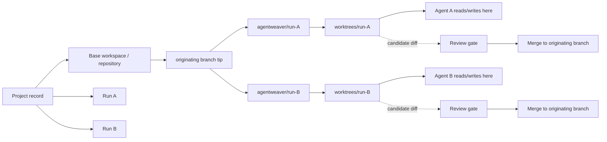
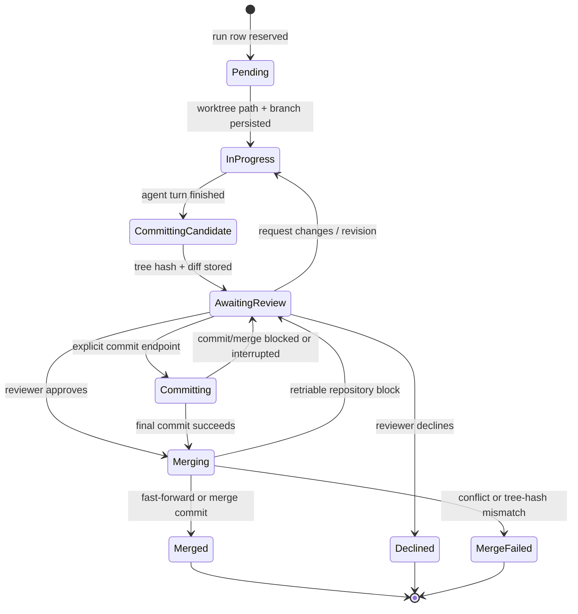
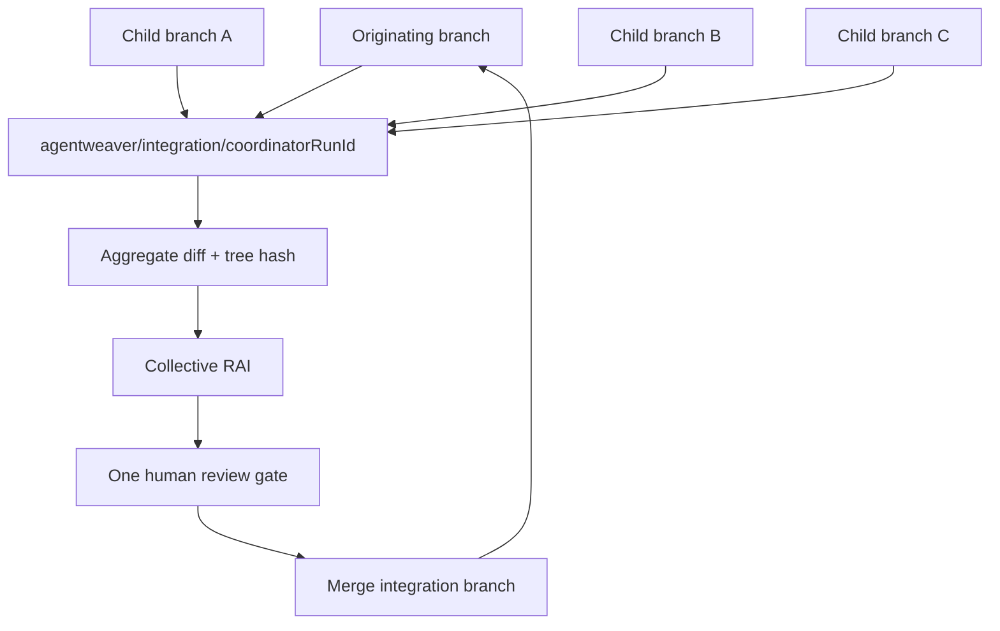
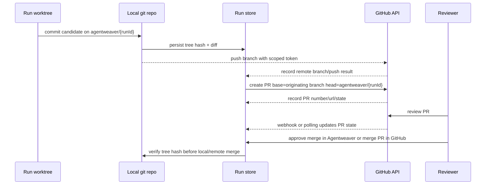
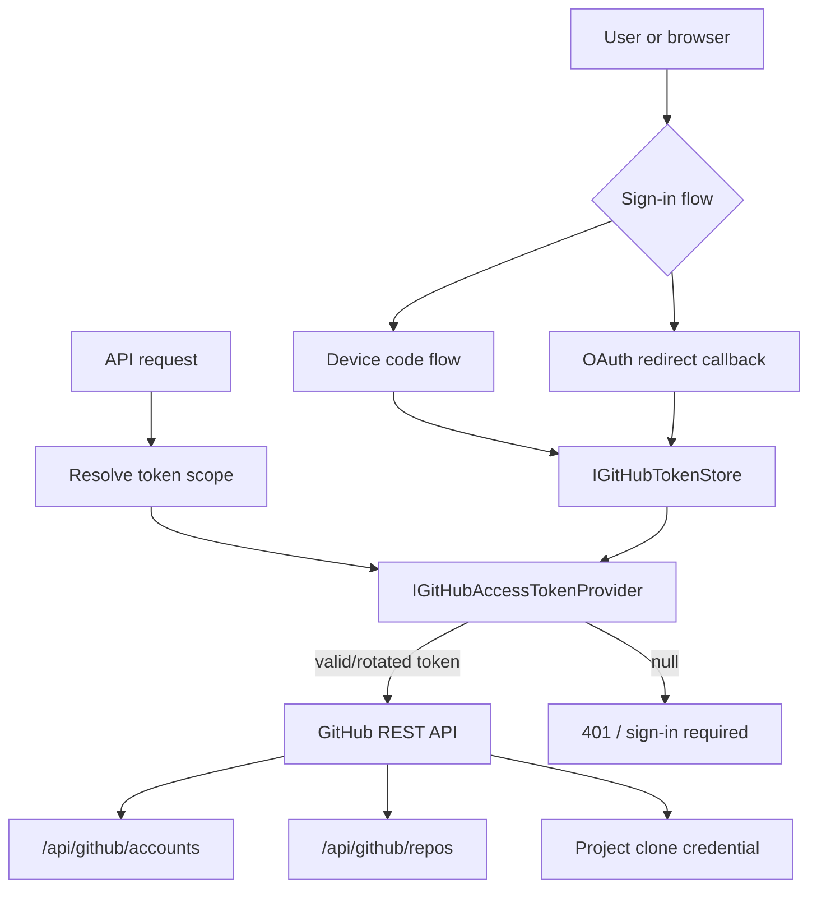

# Git Integration — Conceptual Deep Dive

## Purpose and mental model

Agentweaver treats git as the durable content graph for agent work. The database records who asked for work, which run owns it, where the worktree lives, which branch contains the candidate result, what tree hash was reviewed, and how the merge ended. Git records the actual files.

The central idea is simple: **the project workspace is the stable repository, and every run gets an isolated branch/worktree derived from it**. Agents write inside that run workspace. Agentweaver commits the result, computes a diff against the originating branch, waits for review, and only then advances the target branch.

This gives Agentweaver three properties that are hard to get from a single mutable checkout:

1. **Isolation**: an unfinished run does not dirty the project base checkout.
2. **Parallelism**: multiple runs can modify the same repository at the same time without sharing one working directory.
3. **Reviewability**: the candidate result is a normal git tree with a stable tree hash, diff, and branch name.

Where this lives:

- `apps/Agentweaver.Api/Git/`
- `apps/Agentweaver.Api/Runs/`
- `apps/Agentweaver.Api/Coordinator/`
- `apps/Agentweaver.Api/Projects/`
- `apps/Agentweaver.Api/Auth/`
- `apps/Agentweaver.Api/Endpoints/AuthEndpoints.cs`

See also: `docs/deep-dive/projects.md` and `docs/deep-dive/data-persistence.md`.

## Core concepts

### Project workspace

A project workspace is the long-lived repository checkout. Blank projects are initialized as git repositories with an initial empty commit so the default branch has a real tip. GitHub projects are cloned into the workspace with an ephemeral access token.

The workspace is not meant to be the only place agents write. It is the repository home from which run worktrees are derived.

### Run branch

Every normal run gets a branch named:

```text
agentweaver/{runId}
```

The branch starts at the run's originating branch tip. The branch name is deterministic from the run id, which makes recovery possible: if the worktree directory is lost but the database and branch survive, Agentweaver can recreate the worktree from the same branch.

### Run worktree

A run worktree is a physical directory under the configured worktree base path. If no base path is configured, Agentweaver uses its data directory under `worktrees`. The directory name is the run id.

A worktree is the agent's working directory and sandbox root. The run record stores both the worktree path and the branch before the agent starts so restart recovery and UI browsing can find the candidate workspace.

### Candidate tree

When an agent turn ends, Agentweaver stages and commits the run's changes on the run branch. The committed tree hash becomes the identity of the reviewed result. Review and merge code treats that tree hash as a safety contract: the approved tree must still be the tree being merged.

### Originating branch

The originating branch is the branch the run started from and eventually merges back into. For project runs this is usually the project's default branch, but the run model carries it explicitly.

## Per-run worktree model



The important invariant is that the base workspace and the run workspace are different surfaces. A run can be abandoned, revised, inspected, merged, or cleaned up without requiring the project checkout itself to be the mutable scratchpad.

## Repository creation and GitHub cloning

Agentweaver has two project creation paths.

### Blank repository

For blank projects, Agentweaver:

1. creates or verifies an empty workspace directory;
2. initializes a git repository;
3. creates an empty initial commit;
4. renames the initial branch to the configured default branch, normally `main`;
5. writes the project record only after the repository exists.

The empty initial commit is not cosmetic. Git worktrees and branch operations are much simpler when the default branch is not unborn. A rebuild should preserve that behavior.

### GitHub repository

For GitHub projects, Agentweaver:

1. validates that the source repository is an HTTPS GitHub URL at the project-service boundary;
2. resolves a valid GitHub access token for the project owner/caller scope;
3. clones the repository with that token as a temporary credential;
4. derives the default branch from the clone's HEAD;
5. persists repository identity and project metadata, not the token.

The clone helper can normalize `owner/repo` into a GitHub URL, but the project service currently validates the API request as a full `https://github.com/...` URL before cloning.

## Run lifecycle: branch, commit, review, merge



A normal run follows this logic:

1. **Create branch and worktree**: create `agentweaver/{runId}` from the originating branch and check it out in a dedicated worktree.
2. **Persist before execution**: store the worktree path and branch on the run before the agent starts.
3. **Agent writes files**: the agent executes inside the worktree.
4. **Commit candidate result**: stage allowed changes, commit them on the run branch, and compute the tree hash.
5. **Compute diff**: compare the originating branch tree with the run branch tree.
6. **Wait for review**: store tree hash, diff, step count, and move to `awaiting_review`.
7. **Approve, decline, or revise**: human review either merges, declines, or sends the run back into the same worktree for another revision.
8. **Merge**: approved work advances the originating branch by fast-forward or merge commit, guarded by a repository lock and tree-hash verification.
9. **Clean up or preserve**: successful merges remove the worktree and branch; conflicts preserve the worktree for inspection.

## Commit logic

Agentweaver commits the worktree branch after the agent turn. The commit message is deterministic: `Agentweaver run {runId}`. The author identity comes from configuration, defaulting to `Agentweaver <agentweaver@localhost>`.

The staging rule has two modes:

- **Normal runs** stage all non-ignored changed paths.
- **Coordinator subtask runs** can narrow staging based on declared output paths or a declared working directory in the subtask scope.

That subtask filtering matters because coordinator children may share an orchestration worktree. If a subtask declares outputs, Agentweaver attempts to commit only matching changed paths. If no declared paths are found, it falls back to new or modified files under the declared working directory when one is present.

Agentweaver avoids empty commits. If staging produces no difference from HEAD, it returns the existing HEAD tree hash. That lets the workflow treat the child as a no-change result instead of manufacturing a zero-diff commit that looks like delivered work.

The diff shown to reviewers is not the last commit diff. It is the full candidate diff from the originating branch tip to the run branch tip. That is the right unit for review because it answers, "What would this run add to the target branch?"

## Review and merge safety

Merging is guarded in two layers.

The database layer controls state transitions. A run must move through compare-and-set style states such as `awaiting_review -> merging` or `awaiting_review -> committing -> merging`. This prevents two approvals, commits, declines, or request-changes operations from winning the same run.

The repository layer uses a process-wide per-repository semaphore. That serializes approvals for the same repository and closes timing windows where two runs could both inspect the same target branch tip and then race to update it.

The merge algorithm then checks:

1. the run branch still exists;
2. the originating branch still exists;
3. the run branch tree hash equals the approved tree hash;
4. the worktree branch is not already contained in the originating branch;
5. the target branch can be advanced safely.

If the originating branch is checked out in the base workspace and the working tree is clean, Agentweaver updates both the branch ref and the working tree with a hard reset to the merge result. If the base workspace has unrelated uncommitted changes, Agentweaver falls back to a ref-only merge so local files are preserved; the user will need to pull/reset the checkout to see the new branch tip.

Conflicts are terminal for that merge attempt. The run becomes `merge_failed`, conflicting files are stored where available, and the worktree is preserved for inspection.

## Detached state and dirty worktrees

A detached HEAD in the base repository is not treated as "the originating branch is checked out." In that case Agentweaver uses the ref-only path and updates the branch ref without touching the working tree.

When the originating branch is checked out, Agentweaver checks for conditions that would make a hard reset unsafe:

- a merge, rebase, cherry-pick, revert, or bisect in progress;
- conflicted index entries;
- staged changes;
- modified or deleted tracked files;
- untracked files that would be overwritten by the merge result.

Sequencer state and conflicted indexes block the merge. Other dirty-working-tree cases can use ref-only merge because the branch ref can be advanced without overwriting local files.

## Coordinator integration branches

Coordinator workflows intentionally loosen the ordinary per-run isolation rule. Child runs can share the coordinator's orchestration worktree so one child can read files produced by another child. This is a collaboration workspace, not a separate worktree per child.

For the final assembly, Agentweaver creates an integration branch named:

```text
agentweaver/integration/{coordinatorRunId}
```

It builds that branch headlessly from the originating branch tip and merges eligible child branches in dependency order. "Headless" means it operates on git trees and refs without checking out the integration branch into a working directory.



The coordinator assembly rule is "no partial assembly." If any eligible child branch conflicts while building the integration branch, assembly stops and reports the conflicting branch/files instead of producing a partly assembled result.

## Push and pull request lifecycle

The studied API implements local branch, commit, review, and merge behavior. It also uses GitHub tokens for clone, repository listing, account listing, and user identity. It does **not** show an in-API implementation that pushes run branches to GitHub or creates pull requests.

Unverified: no `Octokit` usage, GitHub Pull Request API call, `git push`, or LibGit2Sharp push operation was found in `apps/Agentweaver.Api` during this pass.

If rebuilding a remote PR lifecycle on top of the current design, the natural extension would be:



That extension should preserve the current invariants:

- push only the deterministic run branch, never arbitrary local refs;
- use the same GitHub token provider that clone and repository listing use;
- record the remote branch and PR identity on the run before surfacing it as durable state;
- bind approval to the reviewed tree hash, not merely to a branch name;
- treat a PR as a remote review surface, not as the only source of the candidate content;
- keep local merge and remote PR merge semantics explicit so users understand which branch is authoritative.

## GitHub credentials and API usage

Agentweaver supports two GitHub sign-in flows:

1. **Device flow** for CLI-style sign-in.
2. **OAuth redirect flow** for web sign-in and MCP OAuth broker flows.

Both flows persist tokens through `IGitHubTokenStore`. On Windows, the default store uses Windows Credential Manager. On non-Windows platforms, it falls back to an owner-only JSON file under the Agentweaver data directory. Explicit sign-out writes a tombstone so configuration fallback does not silently re-authenticate a user who signed out.

A token scope provider decides whether credentials are installation-wide or caller-specific:

- installation scope is the local/developer default;
- caller scope isolates credentials per user for hosted or multi-tenant deployments;
- background work without a caller can fall back to installation scope.

Before consumers use GitHub, they ask `IGitHubAccessTokenProvider` for a valid token. The refresh service returns non-expiring tokens as-is, refreshes near-expiry tokens with the stored refresh token, serializes refreshes per scope, and signs the scope out if refresh cannot succeed.



The checked-in API uses raw `HttpClient` calls with `Bearer` tokens, `Agentweaver/1.0` user agent, and GitHub JSON accept headers. The implemented REST calls include:

- `GET https://api.github.com/user` for identity;
- `GET https://api.github.com/user/orgs` for account/org listing;
- `GET https://api.github.com/user/repos` for repositories owned by the signed-in user;
- `GET https://api.github.com/orgs/{org}/repos` for organization repositories;
- GitHub OAuth endpoints under `/login/device/code`, `/login/oauth/access_token`, and `/login/oauth/authorize`.

The clone path does not call the GitHub REST API. It passes the access token as an ephemeral libgit2 credential while cloning over HTTPS.

## Failure modes and how to reason about them

### Originating branch missing

Worktree creation fails if the originating branch does not exist. This is a submission/setup failure, not an agent failure. The run cannot safely infer a starting point.

Reasoning model: every run branch must be derived from a known branch tip.

### Worktree directory missing after restart

The database can remember a worktree path while the physical directory is gone. Agentweaver can recreate the worktree if the branch still exists. It prunes stale git worktree admin entries first because git may still believe the missing worktree has the branch checked out.

Reasoning model: git branch state and database metadata are durable; ephemeral worktree directories can be reconstructed when enough metadata remains.

### Orphaned worktree branch

LibGit2Sharp's worktree add behavior can create a throw-away branch named after the worktree name. Agentweaver deletes that orphaned branch during recovery so recreating the real `agentweaver/{runId}` worktree does not fail with a name conflict.

Reasoning model: the run branch is `agentweaver/{runId}`; a plain `{runId}` branch is an implementation artifact.

### No changes

If an agent changes nothing, Agentweaver does not create an empty candidate commit. It returns the existing tree hash and the workflow can mark the run as no-change/completed.

Reasoning model: a zero-diff commit should not masquerade as delivered work.

### Tree hash mismatch

If the run branch tree no longer matches the approved tree hash, merge fails. This protects against changes after review, accidental manual mutation of the worktree, and restart races.

Reasoning model: approval binds to content, not to a mutable branch name.

### Merge conflicts

When the originating branch has diverged from the run branch and a three-way merge conflicts, the run becomes `merge_failed` and the worktree is preserved.

Reasoning model: Agentweaver can identify and preserve the conflict state, but it should not invent a resolution.

### Repository busy

Concurrent approvals for the same repository are serialized. If the repository lock cannot be acquired quickly, the operation returns a retriable conflict rather than racing.

Reasoning model: one repository branch update at a time keeps branch-tip reasoning valid.

### Dirty base checkout

If the originating branch is checked out and dirty, Agentweaver either blocks unsafe states or uses a ref-only merge. Ref-only merge preserves local files but leaves the working directory behind the branch ref.

Reasoning model: advancing a ref is safe when updating files is not, but users need an explicit sync step afterward.

### Interrupted commit or merge

Startup recovery reverts interrupted `committing` and `merging` states back to `awaiting_review` where possible. For interrupted commits, it can recover the current worktree HEAD tree hash so the user can retry.

Reasoning model: after a crash, prefer a retryable review state over pretending a partial operation completed.

### GitHub signed out or refresh failed

GitHub project creation and GitHub repository/account listing require a valid token. If no token is available or refresh fails, the API fails closed and asks for sign-in.

Reasoning model: cloning or listing with ambiguous credentials creates confusing partial state; authentication is a precondition.

### Push or PR creation failures

Unverified: push and PR creation are not implemented in the studied API. If added, they should be treated as remote synchronization failures, not as local candidate-content failures. The local branch, tree hash, and diff should remain inspectable even if GitHub rejects a push or PR creation request.

## Invariants

A rebuild should preserve these rules:

1. **Every normal run has one deterministic branch**: `agentweaver/{runId}`.
2. **Every normal run has one isolated worktree** before agent execution begins.
3. **Worktree path and branch are persisted before the agent writes files**.
4. **The database stores metadata; git stores file content**.
5. **Candidate review is based on diff and tree hash from originating branch to run branch**.
6. **Empty commits are avoided** so no-change work is represented honestly.
7. **Human approval binds to a tree hash** and merge refuses mismatches.
8. **Repository branch updates are serialized per repository**.
9. **Successful merges clean up run worktrees and branches**.
10. **Conflicted merges preserve worktrees** for human inspection.
11. **Coordinator integration branches are assembled headlessly and all-or-nothing**.
12. **GitHub tokens are credentials, not project metadata**.
13. **Raw access tokens are not logged or stored in run/project records**.
14. **Remote push/PR behavior, if added, must not weaken local tree-hash review semantics**.

## Trade-offs

### Worktrees over copying directories

Git worktrees are more complex than copying a repository directory, but they avoid duplicated object databases and preserve normal branch semantics. A run's result is a branch and tree, not an ad hoc folder snapshot.

### Local merge over always-remote PR

The current implementation can complete review and merge locally without requiring a remote. That supports blank/local projects and keeps the default deployment simpler. The trade-off is that GitHub PRs are not the authoritative review surface in the studied API.

### Ref-only fallback

Ref-only merge protects dirty base workspaces from destructive resets. The trade-off is operator surprise: the branch ref advances, but files in the checked-out workspace may not visibly change until the user synchronizes.

### Shared coordinator worktree

Coordinator child runs can collaborate through a shared orchestration worktree. That enables multi-agent decomposition, but it weakens isolation between children. Agentweaver compensates with conservative scheduling, subtask output scoping, and a final integration branch.

### SQLite metadata plus git content

This split keeps large file content and history in git while SQLite tracks lifecycle state. The trade-off is recovery must reconcile two durable systems: database rows and repository refs/worktree admin state.

## Rebuild blueprint

If rebuilding the git integration subsystem, implement it in this order:

1. Define run metadata: repository path, originating branch, worktree path, worktree branch, tree hash, diff, status, merge result, merged commit hash, and conflict list.
2. Initialize blank repositories with an initial commit so default branches are never unborn.
3. Clone GitHub repositories using ephemeral HTTPS credentials from a refresh-aware token provider.
4. Create deterministic run branches as `agentweaver/{runId}` from the originating branch.
5. Add run worktrees under a controlled base path using the run id as directory name.
6. Persist worktree path and branch before agent execution.
7. Execute agents with the worktree as their working directory and sandbox boundary.
8. Stage changed files, respecting coordinator subtask output scopes where applicable.
9. Avoid empty commits; return the current HEAD tree hash for no-change results.
10. Store the candidate tree hash, full diff against the originating branch, and review-ready state.
11. Implement request-changes by reusing the same worktree and branch for revision.
12. Implement approval with database CAS transitions and a per-repository merge lock.
13. Verify the tree hash immediately before merge.
14. Merge by fast-forward when possible, otherwise create a merge commit; use ref-only update when the base working tree should not be touched.
15. Remove worktree and branch after successful merge; preserve them after conflict.
16. Recover startup states by failing stranded in-progress runs, reverting interrupted committing/merging states, validating review-ready worktrees, and recreating missing worktrees when branch metadata is sufficient.
17. Add coordinator assembly as a separate headless integration-branch flow if multi-agent fan-out is required.
18. If remote PRs are required, add push/PR state explicitly after local candidate commit and before remote review, using the same token provider and preserving tree-hash approval semantics.

## Common gotchas

- `agentweaver/{runId}` is the real run branch; a plain run-id branch can be a LibGit2Sharp worktree side effect.
- A run branch name is not enough for approval. The tree hash is the content identity.
- The diff shown for review is against the originating branch, not just the last commit.
- A missing physical worktree can be recoverable if the database row and git branch still exist.
- A missing branch is much harder to recover because git has lost the candidate content reference.
- Dirty checked-out target branches may merge ref-only, so the working directory can lag behind the branch ref.
- Coordinator children are not isolated like normal runs; they intentionally share an orchestration worktree.
- The GitHub API usage in the studied API is raw `HttpClient`, not Octokit.
- Unverified: push and PR creation are not implemented in `apps/Agentweaver.Api` as of this review.
