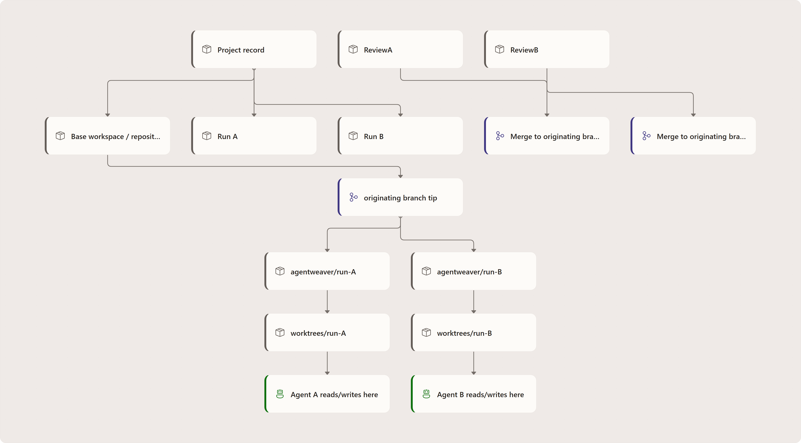
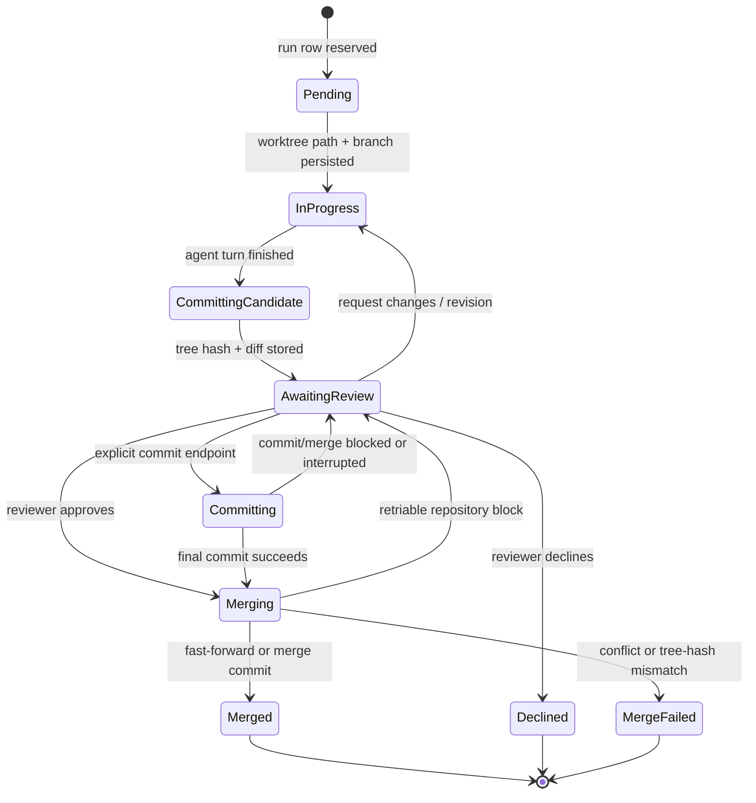
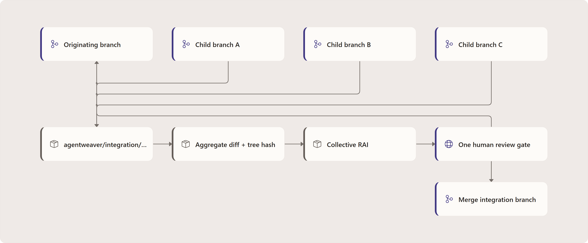

# Git Integration — Conceptual Deep Dive

## Purpose and mental model

Agentweaver treats git as the durable content graph for agent work. The database records who asked for work, which run owns it, where the worktree lives, which branch contains the candidate result, what tree hash was reviewed, and how the merge ended. Git records the actual files.

The central idea is simple: **the project workspace is the stable repository, and every run gets an isolated branch/worktree derived from it**. Agents write inside that run workspace. Agentweaver commits the result, computes a diff against the originating branch, waits for review, and only then advances the target branch.

This gives Agentweaver three properties that are hard to get from a single mutable checkout:

1. **Isolation**: an unfinished run does not dirty the project base checkout.
2. **Parallelism**: multiple runs can modify the same repository at the same time without sharing one working directory.
3. **Reviewability**: the candidate result is a normal git tree with a stable tree hash, diff, and branch name.

Where this lives:

- `apps/Agentweaver.Api/Git/`
- `apps/Agentweaver.Api/Runs/`
- `apps/Agentweaver.Api/Coordinator/`
- `apps/Agentweaver.Api/Projects/`
- `apps/Agentweaver.Api/Auth/`
- `apps/Agentweaver.Api/Endpoints/AuthEndpoints.cs`

See also: `docs/deep-dive/projects.md` and `docs/deep-dive/data-persistence.md`.

## Core concepts

### Project workspace

A project workspace is the long-lived repository checkout. Blank projects are initialized as git repositories with an initial empty commit so the default branch has a real tip. GitHub projects are cloned into the workspace with an ephemeral access token.

The workspace is not meant to be the only place agents write. It is the repository home from which run worktrees are derived.

### Run branch

Every normal run gets a branch named:

```text
agentweaver/{runId}
```

The branch starts at the run's originating branch tip. The branch name is deterministic from the run id, which makes recovery possible: if the worktree directory is lost but the database and branch survive, Agentweaver can recreate the worktree from the same branch.

### Run worktree

A run worktree is a physical directory under the configured worktree base path. If no base path is configured, Agentweaver uses its data directory under `worktrees`. The directory name is the run id.

A worktree is the agent's working directory and sandbox root. The run record stores both the worktree path and the branch before the agent starts so restart recovery and UI browsing can find the candidate workspace.

### Candidate tree

When an agent turn ends, Agentweaver stages and commits the run's changes on the run branch. The committed tree hash becomes the identity of the reviewed result. Review and merge code treats that tree hash as a safety contract: the approved tree must still be the tree being merged.

### Originating branch

The originating branch is the branch the run started from and eventually merges back into. For project runs this is usually the project's default branch, but the run model carries it explicitly.

## Per-run worktree model



<!-- Rendered from ../diagrams/src/git-integration-fig1.json by docs/diagram-renderer +
     Playwright (Fluent-styled React Flow), replacing a Mermaid flowchart.
     Edit the JSON, then run `npm run docs:render-diagrams` and commit the
     regenerated PNG + .hash.txt. -->

The important invariant is that the base workspace and the run workspace are different surfaces. A run can be abandoned, revised, inspected, merged, or cleaned up without requiring the project checkout itself to be the mutable scratchpad.

## Repository creation and GitHub cloning

Agentweaver has two project creation paths.

### Blank repository

For blank projects, Agentweaver:

1. creates or verifies an empty workspace directory;
2. initializes a git repository;
3. creates an empty initial commit;
4. renames the initial branch to the configured default branch, normally `main`;
5. writes the project record only after the repository exists.

The empty initial commit is not cosmetic. Git worktrees and branch operations are much simpler when the default branch is not unborn. A rebuild should preserve that behavior.

### GitHub repository

For GitHub projects, Agentweaver:

1. validates that the source repository is an HTTPS GitHub URL at the project-service boundary;
2. resolves a valid GitHub access token for the project owner/caller scope;
3. clones the repository with that token as a temporary credential;
4. derives the default branch from the clone's HEAD;
5. persists repository identity and project metadata, not the token.

The clone helper can normalize `owner/repo` into a GitHub URL, but the project service currently validates the API request as a full `https://github.com/...` URL before cloning.

## Run lifecycle: branch, commit, review, merge


```mermaid
stateDiagram-v2
  [*] --> Pending: run row reserved
  Pending --> InProgress: worktree path + branch persisted
  InProgress --> CommittingCandidate: agent turn finished
  CommittingCandidate --> AwaitingReview: tree hash + diff stored

  AwaitingReview --> InProgress: request changes / revision
  AwaitingReview --> Declined: reviewer declines
  AwaitingReview --> Merging: reviewer approves

  AwaitingReview --> Committing: explicit commit endpoint
  Committing --> Merging: final commit succeeds
  Committing --> AwaitingReview: commit/merge blocked or interrupted

  Merging --> Merged: fast-forward or merge commit
  Merging --> MergeFailed: conflict or tree-hash mismatch
  Merging --> AwaitingReview: retriable repository block

  Merged --> [*]
  Declined --> [*]
  MergeFailed --> [*]
```

A normal run follows this logic:

1. **Create branch and worktree**: create `agentweaver/{runId}` from the originating branch tip and check it out in a dedicated worktree with a single git-CLI `git worktree add -b agentweaver/{runId} {path} {sha}` (recovery re-checks out the already-existing branch with `git worktree add {path} agentweaver/{runId}`). Provisioning in one step — rather than the older LibGit2Sharp add-at-HEAD-then-checkout — means a run whose branch tip diverges from the primary repository HEAD in a checkout-unsafe way (for example a file/directory typechange) no longer aborts worktree creation, so dependent subtasks that base on the run integration branch provision reliably (`apps/Agentweaver.Api/Git/WorktreeManager.cs:127`, `:171`, `:178`).
2. **Persist before execution**: store the worktree path and branch on the run before the agent starts.
3. **Agent writes files**: the agent executes inside the worktree.
4. **Commit candidate result**: stage every non-ignored change, commit them on the run branch, and compute the tree hash.
5. **Compute diff**: compare the originating branch tree with the run branch tree.
6. **Wait for review**: store tree hash, diff, step count, and move to `awaiting_review`.
7. **Approve, decline, or revise**: human review either merges, declines, or sends the run back into the same worktree for another revision.
8. **Merge**: approved work advances the originating branch by fast-forward or merge commit, guarded by a repository lock and tree-hash verification.
9. **Clean up or preserve**: successful merges remove the worktree and branch; conflicts preserve the worktree for inspection.

## Commit logic

Agentweaver commits the worktree branch after the agent turn. The commit message is deterministic: `Agentweaver run {runId}`. The author identity comes from configuration, defaulting to `Agentweaver <agentweaver@localhost>`.

Staging is **scope-independent**. Agentweaver stages every changed, non-ignored path in the worktree — including deletions and renames — regardless of any coordinator subtask scope. There is no whitelist derived from a subtask's declared output paths or declared working directory. An earlier version scraped path-like tokens from the subtask scope prose and committed only matching changes; that whitelist silently dropped deliverables written to subdirectories (for example an entire `server/` tree), leaving dependent subtasks unable to see the work.

Two defensive rules keep that broad capture safe:

- **Nested git repositories are skipped.** Scaffolders such as create-react-app and Vite run their own `git init`, so a changed subdirectory can contain its own `.git`. Agentweaver walks each changed path and excludes anything at or under such a nested repository, because libgit2 would otherwise stage it as an empty gitlink (a submodule pointer) and lose the actual file tree. Skipped nested-repo roots are logged.
- **Blank projects are seeded with a baseline `.gitignore`.** When a blank project is initialized, Agentweaver writes a baseline ignore file — covering `node_modules/`, `dist/`, `build/`, `.venv/`, `__pycache__/`, `.env*`, `bin/`, `obj/`, and similar — and commits it in the initial commit, without ever clobbering an existing `.gitignore`. This keeps dependency and build artifacts out of the scope-independent staging set.

Agentweaver avoids empty commits. If staging produces no difference from HEAD, it returns the existing HEAD tree hash. That lets the workflow treat the child as a no-change result instead of manufacturing a zero-diff commit that looks like delivered work.

The diff shown to reviewers is not the last commit diff. It is the full candidate diff from the originating branch tip to the run branch tip. That is the right unit for review because it answers, "What would this run add to the target branch?"

## Review and merge safety

Merging is guarded in two layers.

The database layer controls state transitions. A run must move through compare-and-set style states such as `awaiting_review -> merging` or `awaiting_review -> committing -> merging`. This prevents two approvals, commits, declines, or request-changes operations from winning the same run.

The repository layer uses a per-repository merge lock. In PostgreSQL deployments, the lock is a session advisory lock keyed by canonical repository path so it spans API replicas. In SQLite/local development, the lock falls back to a process-wide semaphore. That serializes approvals for the same repository and closes timing windows where two runs could both inspect the same target branch tip and then race to update it.

The merge algorithm then checks:

1. the run branch still exists;
2. the originating branch still exists;
3. the run branch tree hash equals the approved tree hash;
4. the worktree branch is not already contained in the originating branch;
5. the target branch can be advanced safely.

If the originating branch is checked out in the base workspace and the working tree is clean, Agentweaver updates both the branch ref and the working tree with a hard reset to the merge result. If the base workspace has uncommitted changes, Agentweaver attempts to reconcile them onto the merge result with the same hard reset — but only when doing so is provably lossless (every dirty path's current content already matches the merge result). If any dirty path holds content that diverges from the merge result, Agentweaver refuses the merge (a retriable `Blocked` outcome) instead of silently discarding that content or leaving the branch ref and working tree out of sync.

Conflicts are terminal for that merge attempt. The run becomes `merge_failed`, conflicting files are stored where available, and the worktree is preserved for inspection.

## Detached state and dirty worktrees

A detached HEAD in the base repository is not treated as "the originating branch is checked out." In that case Agentweaver uses the ref-only path and updates the branch ref without touching the working tree. This is safe specifically because nothing reads the working tree/index relative to that ref while it is not checked out.

When the originating branch IS checked out, a ref-only update is never safe: it would advance HEAD's branch ref while leaving the index/working tree pointed at the old tree, so any path the merge added or changed but the stale index doesn't have appears as a staged deletion — even though it is fully present and correct in the new HEAD commit (this was the root cause of issue #348, where a completed run's working directory was left with staged deletions of its own committed output). So when the originating branch is checked out, Agentweaver checks for conditions that would make a hard reset unsafe:

- a merge, rebase, cherry-pick, revert, or bisect in progress;
- conflicted index entries;
- staged changes;
- modified or deleted tracked files;
- untracked files that would be overwritten by the merge result.

Sequencer state and conflicted indexes always block the merge outright — the user must resolve them first. For the remaining dirty-working-tree cases, Agentweaver compares each dirty path's current content (working-directory bytes, or the index blob if no working-directory copy exists) against the merge result tree. If every dirty path is byte-identical to the result (or has no content on disk/in the index at all — e.g. a stale staged deletion of a file the run never touched), the working tree is reconciled with a hard reset and the merge proceeds (`merge_mode: working-tree-reconciled`). Otherwise the merge is blocked rather than corrupting the working directory or silently discarding local edits.

## Coordinator integration branches

Coordinator workflows intentionally loosen the ordinary per-run isolation rule. Child runs can share the coordinator's orchestration worktree so one child can read files produced by another child. This is a collaboration workspace, not a separate worktree per child.

For the final assembly, Agentweaver creates an integration branch named:

```text
agentweaver/integration/{coordinatorRunId}
```

It builds that branch headlessly from the originating branch tip and merges eligible child branches in dependency order. "Headless" means it operates on git trees and refs without checking out the integration branch into a working directory.



<!-- Rendered from ../diagrams/src/git-integration-fig2.json by docs/diagram-renderer +
     Playwright (Fluent-styled React Flow), replacing a Mermaid flowchart.
     Edit the JSON, then run `npm run docs:render-diagrams` and commit the
     regenerated PNG + .hash.txt. -->

The coordinator assembly rule is "no partial assembly." If any eligible child branch conflicts while building the integration branch, assembly stops and reports the conflicting branch/files instead of producing a partly assembled result.

## Remote boundary

The current API implements local Git operations only — branch creation, commits, tree/diff inspection, review, and merge. Pushing run branches to a remote and opening pull requests are out of scope. GitHub tokens are used for clone, repository listing, account listing, and user identity, not for publishing candidate branches.

This boundary keeps candidate-content reasoning local and deterministic: Agentweaver can always explain a run through its branch, tree hash, and diff without depending on remote synchronization state.

## GitHub credentials and API usage

Agentweaver supports two GitHub sign-in flows:

1. **Device flow** for CLI-style sign-in.
2. **OAuth redirect flow** for web sign-in and MCP OAuth broker flows.

Both flows persist tokens through `IGitHubTokenStore`. In AKS, each authenticated user's GitHub OAuth token is stored in Azure Key Vault under a per-user key (`ghtok-user--{base32(userId)}`) and is never written to shared storage. Local development uses Windows Credential Manager on Windows or an owner-only JSON file under the Agentweaver data directory on other platforms. Explicit sign-out writes a tombstone so configuration fallback does not silently re-authenticate a user who signed out.

A token scope provider decides whether credentials are installation-wide or caller-specific:

- caller scope is the default and isolates credentials per authenticated user;
- installation scope is used only when `Auth:GitHub:ScopeProvider` is explicitly set to `installation`;
- background work without a caller can fall back to installation scope.

Before consumers use GitHub, they ask `IGitHubAccessTokenProvider` for a valid token. The refresh service returns non-expiring tokens as-is, refreshes near-expiry tokens with the stored refresh token, serializes refreshes per scope, and signs the scope out if refresh cannot succeed. With the Key Vault token store, the refresh serialization is a short-lived distributed lease so concurrent requests on different API replicas wait for and reuse the replica that wins token rotation; local stores use an in-process gate.


<!-- Rendered from ../diagrams/src/git-integration-fig3.json by docs/diagram-renderer +
     Playwright (Fluent-styled React Flow), replacing a Mermaid flowchart.
     Edit the JSON, then run `npm run docs:render-diagrams` and commit the
     regenerated PNG + .hash.txt. -->

The checked-in API uses raw `HttpClient` calls with `Bearer` tokens, `Agentweaver/1.0` user agent, and GitHub JSON accept headers. The implemented REST calls include:

- `GET https://api.github.com/user` for identity;
- `GET https://api.github.com/user/orgs` for account/org listing;
- `GET https://api.github.com/user/repos` for repositories owned by the signed-in user;
- `GET https://api.github.com/orgs/{org}/repos` for organization repositories;
- GitHub OAuth endpoints under `/login/device/code`, `/login/oauth/access_token`, and `/login/oauth/authorize`.

The clone path does not call the GitHub REST API. It passes the access token as an ephemeral libgit2 credential while cloning over HTTPS.

## Failure modes and how to reason about them

### Originating branch missing

Worktree creation fails if the originating branch does not exist. This is a submission/setup failure, not an agent failure. The run cannot safely infer a starting point.

Reasoning model: every run branch must be derived from a known branch tip.

### Worktree directory missing after restart

The database can remember a worktree path while the physical directory is gone. Agentweaver can recreate the worktree if the branch still exists. It prunes stale git worktree admin entries first because git may still believe the missing worktree has the branch checked out.

Reasoning model: git branch state and database metadata are durable; ephemeral worktree directories can be reconstructed when enough metadata remains.

### Resilient worktree deletion on Azure Files SMB

Worktree directories are deleted and recreated constantly: `AddDetachedWorktree` destructively recreates the shared `assembly-build-test-{…}` worktree on every assembly Build & Test, and the teardown paths remove run worktrees after merge. On the Azure Files **SMB** volume that backs `/workspace` in the cloud, a plain `Directory.Delete(path, recursive: true)` of a populated native `node_modules` tree (for example `better-sqlite3` with deep `build/Release/obj/gen/sqlite3` build artifacts) can throw `IOException: Directory not empty` (ENOTEMPTY): the BCL removes children and then rmdir's the parent, but SMB's directory-listing metadata is only eventually consistent, so a child unlink returns success while the parent's rmdir still sees the stale entry. A single transient failure in `AddDetachedWorktree` re-threw and dead-ended assembly Build & Test.

The worktree delete sites now route through `WorktreeManager.DeleteDirectoryResilient` (`apps/Agentweaver.Api/Git/WorktreeManager.cs:272`), a bounded retry that absorbs the SMB eventual-consistency window:

- **Fast path first.** Attempt 1 is the plain top-down `Directory.Delete(recursive: true)` with no extra work, so the common success case — which runs on every assembly and teardown — pays nothing.
- **Bounded retry on `IOException` / `UnauthorizedAccessException` only.** Up to four attempts total with short backoff (~150 → 300 → 600 ms, under ~2 s total — not minutes, not exponential-to-30 s), clearing read-only attributes between attempts (needed on Windows dev machines, a harmless no-op on Linux).
- **Bottom-up last resort.** On the final attempt only, it deletes deepest-first (files then directories) rather than top-down. The manual recursion is refused unless the target is under the worktree base path (reusing the existing `IsPathUnder` guard, `:221`), so a bad path can never walk outside `_basePath`.
- **Never silent-succeed.** If the directory still exists after all attempts, the last exception is re-thrown. Returning while a non-empty directory survived would let the next `git worktree add` build on a dirty tree and produce a corrupt or misleading Build & Test — so that outcome is designed out.

Applied at `AddDetachedWorktree` (the terminal failing site, `:198`), `RemoveDetachedWorktree` (`:232`), `PruneWorktreesCheckedOutOnBranch` (`:1269`), and `RemoveWorktree` (`:1871`). This is deliberately **not** a lingering-file-handle fix: on Linux `unlink` succeeds on open files (orphaning the inode), so it never causes ENOTEMPTY, and there is no "kill the build process first" step. It is a filesystem-robustness fix, kept general rather than `better-sqlite3`-specific.

Reasoning model: on an eventually-consistent network filesystem a delete that "failed" may already be converging — a bounded retry is correct, but silently proceeding on a surviving directory is not.

### Orphaned worktree branch

Worktrees are provisioned through the git CLI (`git worktree add -b agentweaver/{runId} …`), which does **not** create a throw-away branch named after the worktree. Older builds (pre-v0.9.33) used LibGit2Sharp's worktree add, whose underlying `git_worktree_add` always created such a `{runId}`-named branch as a side effect. During a rolling restart a worktree may still have been provisioned by that old code, leaving an orphaned `{runId}` branch that would make a fresh `git worktree add` fail with a name conflict. Agentweaver deletes that orphaned branch before recreating the real `agentweaver/{runId}` worktree; for worktrees created by the current git-CLI path no such branch exists, so the deletion is a harmless no-op.

Reasoning model: the run branch is `agentweaver/{runId}`; a plain `{runId}` branch is a legacy LibGit2Sharp implementation artifact.

### No changes

If an agent changes nothing, Agentweaver does not create an empty candidate commit. It returns the existing tree hash and the workflow can mark the run as no-change/completed.

Reasoning model: a zero-diff commit should not masquerade as delivered work.

### Tree hash mismatch

If the run branch tree no longer matches the approved tree hash, merge fails. This protects against changes after review, accidental manual mutation of the worktree, and restart races.

Reasoning model: approval binds to content, not to a mutable branch name.

### Merge conflicts

When the originating branch has diverged from the run branch and a three-way merge conflicts, the run becomes `merge_failed` and the worktree is preserved.

Reasoning model: Agentweaver can identify and preserve the conflict state, but it should not invent a resolution.

### Repository busy

Concurrent approvals for the same repository are serialized. If the repository lock cannot be acquired quickly, the operation returns a retriable conflict rather than racing.

Reasoning model: one repository branch update at a time keeps branch-tip reasoning valid.

### Dirty base checkout

If the originating branch is checked out and dirty, Agentweaver either blocks unsafe states outright (sequencer in progress, conflicted index) or attempts to reconcile the working tree onto the merge result with a hard reset. Reconciliation only proceeds when it is provably lossless — every dirty path's current content already matches the merge result tree. Otherwise the merge is blocked; Agentweaver never advances the branch ref while leaving the checked-out working tree/index unsynced with it, since that desync is what produced staged deletions of committed content in issue #348.

Reasoning model: advancing a ref while a branch is checked out is only safe when the index/working tree end up matching that ref exactly — so a ref-only update must never be used for a checked-out branch, only reconcile-then-reset or a hard block.

### Interrupted commit or merge

Startup recovery reverts interrupted `committing` and `merging` states back to `awaiting_review` where possible. For interrupted commits, it can recover the current worktree HEAD tree hash so the user can retry.

Reasoning model: after a crash, prefer a retryable review state over pretending a partial operation completed.

### GitHub signed out or refresh failed

GitHub project creation and GitHub repository/account listing require a valid token. If no token is available or refresh fails, the API fails closed and asks for sign-in.

Reasoning model: cloning or listing with ambiguous credentials creates confusing partial state; authentication is a precondition.

## Invariants

A rebuild should preserve these rules:

1. **Every normal run has one deterministic branch**: `agentweaver/{runId}`.
2. **Every normal run has one isolated worktree** before agent execution begins.
3. **Worktree path and branch are persisted before the agent writes files**.
4. **The database stores metadata; git stores file content**.
5. **Candidate review is based on diff and tree hash from originating branch to run branch**.
6. **Empty commits are avoided** so no-change work is represented honestly.
7. **Human approval binds to a tree hash** and merge refuses mismatches.
8. **Repository branch updates are serialized per repository**.
9. **Successful merges clean up run worktrees and branches**.
10. **Conflicted merges preserve worktrees** for human inspection.
11. **Coordinator integration branches are assembled headlessly and all-or-nothing**.
12. **GitHub tokens are credentials, not project metadata**.
13. **Raw access tokens are not logged or stored in run/project records**.
14. **Worktree directory deletes are resilient to SMB eventual consistency** and never silently succeed while the directory still exists.

## Trade-offs

### Worktrees over copying directories

Git worktrees are more complex than copying a repository directory, but they avoid duplicated object databases and preserve normal branch semantics. A run's result is a branch and tree, not an ad hoc folder snapshot.

### Local merge over remote review

Agentweaver can complete review and merge locally without requiring a remote. That supports blank/local projects and keeps the default deployment simpler. The trade-off is that remote review systems are not the authoritative review surface.

### Ref-only fallback

Ref-only merge protects dirty base workspaces from destructive resets. The trade-off is operator surprise: the branch ref advances, but files in the checked-out workspace may not visibly change until the user synchronizes.

### Shared coordinator worktree

Coordinator child runs can collaborate through a shared orchestration worktree. That enables multi-agent decomposition, but it weakens isolation between children. Agentweaver compensates with conservative scheduling and a final integration branch.

### SQLite metadata plus git content

This split keeps large file content and history in git while SQLite tracks lifecycle state. The trade-off is recovery must reconcile two durable systems: database rows and repository refs/worktree admin state.

## Rebuild blueprint

If rebuilding the git integration subsystem, implement it in this order:

1. Define run metadata: repository path, originating branch, worktree path, worktree branch, tree hash, diff, status, merge result, merged commit hash, and conflict list.
2. Initialize blank repositories with a baseline `.gitignore` and an initial commit so default branches are never unborn and dependency/build artifacts stay untracked.
3. Clone GitHub repositories using ephemeral HTTPS credentials from a refresh-aware token provider.
4. Create deterministic run branches as `agentweaver/{runId}` from the originating branch.
5. Add run worktrees under a controlled base path using the run id as directory name.
6. Persist worktree path and branch before agent execution.
7. Execute agents with the worktree as their working directory and sandbox boundary.
8. Stage every changed, non-ignored file (including deletions and renames), skipping nested git repositories to avoid committing them as empty gitlinks.
9. Avoid empty commits; return the current HEAD tree hash for no-change results.
10. Store the candidate tree hash, full diff against the originating branch, and review-ready state.
11. Implement request-changes by reusing the same worktree and branch for revision.
12. Implement approval with database CAS transitions and a per-repository merge lock.
13. Verify the tree hash immediately before merge.
14. Merge by fast-forward when possible, otherwise create a merge commit; use ref-only update when the base working tree should not be touched.
15. Remove worktree and branch after successful merge; preserve them after conflict.
16. Recover startup states by failing stranded in-progress runs, reverting interrupted committing/merging states, validating review-ready worktrees, and recreating missing worktrees when branch metadata is sufficient.
17. Add coordinator assembly as a separate headless integration-branch flow if multi-agent fan-out is required.

## Common gotchas

- `agentweaver/{runId}` is the real run branch; a plain run-id branch is a legacy (pre-v0.9.33) LibGit2Sharp worktree side effect — current git-CLI provisioning never creates one.
- A run branch name is not enough for approval. The tree hash is the content identity.
- The diff shown for review is against the originating branch, not just the last commit.
- A missing physical worktree can be recoverable if the database row and git branch still exist.
- A missing branch is much harder to recover because git has lost the candidate content reference.
- Dirty checked-out target branches either reconcile onto the merge result via a hard reset (when safe) or block the merge outright — they never merge ref-only while checked out, since that would desync the index/working tree from the advanced ref.
- Coordinator children are not isolated like normal runs; they intentionally share an orchestration worktree.
- Worktree deletes on Azure Files SMB can transiently fail with `Directory not empty`; `WorktreeManager.DeleteDirectoryResilient` retries with backoff and never silently proceeds while the directory still exists (see [Resilient worktree deletion](#resilient-worktree-deletion-on-azure-files-smb)).
- The GitHub API usage is raw `HttpClient`, not Octokit.
