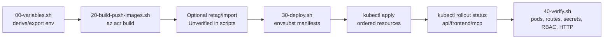
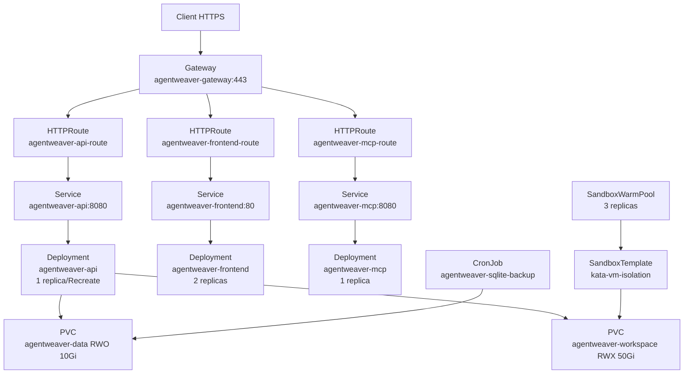
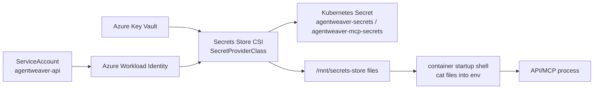

# Infrastructure & Deployment — Deep Dive

## Purpose & Scope

This document describes the Agentweaver AKS infrastructure, image flow, deployment pipeline, Kubernetes topology, secrets path, routing, and operational gotchas. It is based on the manifests in `k8s/*.yaml`, AKS scripts in `scripts/aks/*.sh`, the four production Dockerfiles, and `.dockerignore`.

The deployment target is the `agentweaver` namespace (`k8s/namespace.yaml:1-7`). The platform scripts default to resource group `agentweaver-rg`, cluster `agentweaver-aks-2`, ACR `agentweaverregistry`, region `westus2`, namespace `agentweaver`, Key Vault `agentweaver-kv`, and an image tag derived from `git rev-parse --short HEAD` when `IMAGE_TAG` is not provided (`scripts/aks/00-variables.sh:4-30`).

## Cluster & Platform (AKS, Gateway API/app routing, Cilium/ACNS, workload identity)

`scripts/aks/10-create-cluster.sh` provisions the Azure resource group, ACR, and AKS cluster. The cluster is created with Azure CNI overlay, Cilium dataplane, ACNS enabled, Azure Linux nodes, Kata VM isolation, node auto-provisioning, app routing with Istio, Gateway API, a managed default domain, the Key Vault CSI add-on, OIDC issuer, workload identity, and ACR attachment (`scripts/aks/10-create-cluster.sh:58-80`). The script also installs the agent-sandbox CRDs/controller and waits for `SandboxClaim`, `SandboxTemplate`, and `SandboxWarmPool` CRDs (`scripts/aks/10-create-cluster.sh:89-95`).

Important platform dependencies:

- **Gateway API/app routing**: the cluster is created with `--enable-app-routing-istio`, `--enable-gateway-api`, and `--enable-default-domain` (`scripts/aks/10-create-cluster.sh:72-74`). The `Gateway` uses `gatewayClassName: approuting-istio` and terminates HTTPS with the managed `agentweaver-tls` Secret (`k8s/gateway.yaml:23-38`).
- **Cilium/ACNS**: egress policy includes Cilium FQDN allowlists. The cluster creation command includes `--network-dataplane cilium` and `--enable-acns`; ACNS is therefore required for this deployment shape (`scripts/aks/10-create-cluster.sh:64-68`).
- **Workload identity**: `15-setup-identity.sh` creates the user-assigned managed identity, Key Vault, required secrets, Key Vault role assignment, enables OIDC/workload identity, and creates a federated credential for `system:serviceaccount:agentweaver:agentweaver-api` (`scripts/aks/15-setup-identity.sh:21-91`). `serviceaccount-api.yaml` carries the `azure.workload.identity/client-id` annotation populated through `envsubst` (`k8s/serviceaccount-api.yaml:1-9`).

## Container Images

`.dockerignore` excludes development secrets, Squad/Copilot state, node modules, build artifacts, tests, scripts, specs, and root Markdown files from build contexts (`.dockerignore:10-39`).

| image | Dockerfile | build context | contents |
|---|---|---|---|
| `agentweaver-api` | `apps/Agentweaver.Api/Dockerfile` | repo root | .NET 10 API publish output plus an EF Core `MemoryDbContext` migration bundle, `kubectl`, `libgit2`, `/data`, `/app/logs`, non-root uid/gid 1000, listens on 8080 (`apps/Agentweaver.Api/Dockerfile:1-61`). |
| `agentweaver-frontend` | `apps/web/Dockerfile` | repo root | React SPA build, VitePress docs build, ASP.NET Core static-file host, `apps/web/docker-entrypoint.sh`, non-root uid/gid 1000, default `AGENTWEAVER_API_URL=/api` (`apps/web/Dockerfile:1-50`). |
| `agentweaver-mcp` | `apps/Agentweaver.Mcp/Dockerfile` | repo root | .NET 10 MCP server publish output, non-root uid/gid 1000, listens on 8080 (`apps/Agentweaver.Mcp/Dockerfile:1-31`). |
| `agentweaver-sandbox` | `apps/agentweaver-sandbox/Dockerfile` | `apps/agentweaver-sandbox` | Ubuntu 24.04 sandbox base with curl, wget, git, build tools, Python, Node/npm, .NET 9, non-root user 1000, `/workspace`, and `sleep infinity` (`apps/agentweaver-sandbox/Dockerfile:1-36`). |

### Build/import flow

`20-build-push-images.sh` explicitly builds all four images with `az acr build`, so no local Docker daemon is required (`scripts/aks/20-build-push-images.sh:1-15`). The API, frontend, and MCP images use the repo root context because their Dockerfiles reference multiple subdirectories (`scripts/aks/20-build-push-images.sh:32-71`). The sandbox image uses `apps/agentweaver-sandbox` as its self-contained context (`scripts/aks/20-build-push-images.sh:76-86`).

Unverified: the requested fact “unchanged images are retagged via `az acr import`” is not present in the scoped AKS scripts. The current checked-in `20-build-push-images.sh` rebuilds and pushes each image with `az acr build` (`scripts/aks/20-build-push-images.sh:36-86`).

## Deployment Pipeline

`30-deploy.sh` prints the active kubectl context, namespace, ACR login server, and image tag before changing cluster state (`scripts/aks/30-deploy.sh:19-25`). It requires `envsubst` and fails fast if `IDENTITY_CLIENT_ID`, `KEYVAULT_NAME`, or `TENANT_ID` are missing (`scripts/aks/30-deploy.sh:27-40`).

The deploy script applies the namespace, creates or reuses the managed `DefaultDomainCertificate`, derives `HOST` from its status, and renders every `k8s/*.yaml` into `scripts/aks/.rendered` with exactly these substitutions: `HOST`, `ACR_LOGIN_SERVER`, `IMAGE_TAG`, `IDENTITY_CLIENT_ID`, `KEYVAULT_NAME`, and `TENANT_ID` (`scripts/aks/30-deploy.sh:42-85`). It then applies resources in order: service account, SecretProviderClasses, RBAC, quota, PVCs; network policies and egress allowlists; services, gateway, routes, backup CronJob; sandbox template/warm pool when CRDs exist; and finally the deployments (`scripts/aks/30-deploy.sh:88-147`). Rollout waits cover API, frontend, and MCP deployments (`scripts/aks/30-deploy.sh:149-157`).

`40-verify.sh` checks pod counts, gateway `Programmed=True`, HTTPRoute `Accepted=True` and `ResolvedRefs=True`, HTTP smoke tests, SecretProviderClass existence/status, API RBAC, and sandbox CRDs/resources (`scripts/aks/40-verify.sh:21-109`).

## Kubernetes Topology

The API service selects `app: agentweaver-api` and exposes port 8080 (`k8s/api-service.yaml:1-18`). The frontend service maps service port 80 to pod port 8080 (`k8s/frontend-service.yaml:1-18`). The MCP service exposes port 8080 (`k8s/mcp-service.yaml:1-18`).

The API deployment is a single replica with `Recreate` strategy because SQLite is single-writer on an RWO PVC (`k8s/api-deployment.yaml:9-15`). It runs an EF migration initContainer from the API image before starting the API process (`k8s/api-deployment.yaml:34-68`), mounts `agentweaver-data`, `agentweaver-workspace`, temp/log emptyDirs, and the CSI secrets volume (`k8s/api-deployment.yaml:144-203`). The frontend deployment runs two replicas (`k8s/frontend-deployment.yaml:9-27`). The MCP deployment runs one replica on the same service account as the API and mounts the MCP CSI secrets volume (`k8s/mcp-deployment.yaml:19-23`, `k8s/mcp-deployment.yaml:96-103`).

Storage is split between `agentweaver-data` (`ReadWriteOnce`, `managed-csi-premium`, 10Gi) and `agentweaver-workspace` (`ReadWriteMany`, `azurefile-csi-premium-uid1000`, 50Gi) (`k8s/pvc-data.yaml:1-12`, `k8s/pvc-workspace.yaml:1-12`). The custom workspace StorageClass sets Azure Files mount options for uid/gid 1000 because the built-in class mounts root-owned and `mountOptions` are immutable (`k8s/storageclass-workspace.yaml:1-15`, `k8s/storageclass-workspace.yaml:25-32`).

The backup CronJob runs daily at `17 3 * * *`, performs a SQLite `.backup` into `/data/backups`, and deletes backups older than 14 days (`k8s/backup-cronjob.yaml:1-12`, `k8s/backup-cronjob.yaml:33-39`).

## Secrets & Workload Identity

`15-setup-identity.sh` refuses to write placeholder values and requires `MCP_API_KEY`, `MCP_AUTH_API_KEY`, `MCP_AUTH_USER`, `GITHUB_CLIENT_ID`, and `GITHUB_CLIENT_SECRET` before storing them in Key Vault (`scripts/aks/15-setup-identity.sh:9-19`, `scripts/aks/15-setup-identity.sh:53-58`). It grants the managed identity the `Key Vault Secrets User` role (`scripts/aks/15-setup-identity.sh:60-66`) and federates the AKS service account through OIDC (`scripts/aks/15-setup-identity.sh:68-91`).

The API `SecretProviderClass` reads Key Vault secrets `mcp-api-key`, `github-client-id`, `github-client-secret`, and `mcp-oauth-signing-key`, and syncs them into Kubernetes Secret `agentweaver-secrets` (`k8s/secret-provider-class.yaml:1-42`). The MCP `SecretProviderClass` reads `mcp-api-key`, `mcp-auth-api-key`, and `mcp-auth-user`, and syncs them into `agentweaver-mcp-secrets` (`k8s/secretprovider-mcp.yaml:1-37`). Do not print real secret values.

At container start, the API reads CSI-mounted files and exports `Auth__ApiKey`, `Mcp__ApiKey`, GitHub OAuth settings, and `Auth__OAuth__SigningKey` before launching `Agentweaver.Api.dll` (`k8s/api-deployment.yaml:73-85`). The MCP deployment similarly reads `mcp-auth-user` into `Auth__User` before launching `Agentweaver.Mcp.dll` (`k8s/mcp-deployment.yaml:32-38`).

Rotation caveat: the CSI configuration uses a two-minute rotation poll interval (`k8s/secret-provider-class.yaml:6-8`, `k8s/secretprovider-mcp.yaml:6-8`), but the deployments export secrets into process environment variables at startup. A rotated file value will not change an already-exported process environment value; restart pods unless the application re-reads the mounted file. The OAuth signing-key script says CSI polling can pick up a new version without restart only if the app re-reads `Auth__OAuth__SigningKey` on each token mint (`scripts/aks/16-provision-oauth-signing-key.sh:84-88`).

## Networking & Egress

The namespace uses default-deny ingress for Agentweaver pods except gateway pods and default-deny egress for API, MCP, and frontend (`k8s/networkpolicy-default-deny.yaml:1-38`). DNS egress to kube-dns is allowed for app pods (`k8s/networkpolicy-default-deny.yaml:39-70`). Internal app egress to Agentweaver pods on 8080 is allowed (`k8s/networkpolicy-default-deny.yaml:71-97`), and API/MCP are allowed external HTTPS egress on 443 (`k8s/networkpolicy-default-deny.yaml:98-120`).

Ingress is intentionally narrow: gateway-to-API, gateway-to-frontend, and gateway-to-MCP allow traffic from the app-routing/Istio gateway identity to the relevant pods (`k8s/networkpolicy-default-deny.yaml:121-197`, `k8s/networkpolicy-mcp.yaml:1-25`). MCP-to-API ingress is separately allowed for JWKS validation at `http://agentweaver-api:8080/oauth/jwks` (`k8s/networkpolicy-default-deny.yaml:146-172`).

Sandbox pods have deny-ingress and an egress allowlist for DNS plus the GitHub public IP range `140.82.112.0/20` on 443 (`k8s/networkpolicy-sandbox.yaml:1-50`). A Cilium FQDN policy allows sandbox egress to `api.github.com`, npm registry domains, and Azure AI/OpenAI/Cognitive Services/model domains (`k8s/cilium-network-policy-sandbox.yaml:1-48`). App pods also have a Cilium FQDN allowlist for GitHub, Azure AI/OpenAI/Cognitive Services/model domains, and `otel-collector.observability.svc.cluster.local`, with ports 443 and 4317 (`k8s/serviceentry-telemetry.yaml:1-47`).

## Routing

The `Gateway` is the public HTTPS entry point. It terminates TLS on port 443 for `${HOST}` using the managed `agentweaver-tls` certificate, and route attachment is restricted to the same namespace (`k8s/gateway.yaml:16-38`).

Routes:

- **API**: `agentweaver-api-route` sends `/api`, `/auth`, OAuth/OIDC discovery paths, and `/oauth/*` to service `agentweaver-api:8080` (`k8s/httproute-api.yaml:1-60`). Discovery includes `/.well-known/oauth-authorization-server`, `/.well-known/oauth-authorization-server/mcp`, `/.well-known/openid-configuration`, and `/.well-known/openid-configuration/mcp` (`k8s/httproute-api.yaml:36-56`).
- **MCP**: `agentweaver-mcp-route` rewrites exact `/mcp/health` to `/healthz`, routes RFC 9728 protected-resource metadata at both root and `/mcp`-suffixed forms, and routes `/mcp` traffic to service `agentweaver-mcp:8080` (`k8s/mcp-httproute.yaml:1-47`).
- **Frontend**: `agentweaver-frontend-route` is a catch-all `/` route to service `agentweaver-frontend:80`; the manifest notes Gateway API route specificity keeps more specific API routes ahead of this catch-all (`k8s/httproute-frontend.yaml:1-35`).

## Operations & Gotchas

- **Deploy environment**: `RESOURCE_GROUP`, `CLUSTER_NAME`, `ACR_NAME`, `LOCATION`, `NAMESPACE`, `IMAGE_TAG`, `ACR_LOGIN_SERVER`, `KEYVAULT_NAME`, `TENANT_ID`, and `IDENTITY_CLIENT_ID` are exported by `00-variables.sh`; `IMAGE_TAG` defaults to the short Git SHA (`scripts/aks/00-variables.sh:18-43`). `30-deploy.sh` requires `IDENTITY_CLIENT_ID`, `KEYVAULT_NAME`, and `TENANT_ID` (`scripts/aks/30-deploy.sh:32-40`).
- **Kubectl context**: `30-deploy.sh` prints `kubectl config current-context` before applying resources; verify it points at the intended cluster before running the script (`scripts/aks/30-deploy.sh:19-25`).
- **No kubectl patch rule**: do not patch immutable cluster-managed storage in place. The workspace StorageClass documents that `mountOptions` are immutable and uses a repo-owned replacement class so changes go through manifests/GitOps instead (`k8s/storageclass-workspace.yaml:9-15`).
- **Apply order matters**: workload identity, SecretProviderClasses, RBAC, quotas, and PVCs are applied before deployments; deployments are applied only after gateway readiness and sandbox resources (`scripts/aks/30-deploy.sh:88-147`).
- **Backup job**: `agentweaver-sqlite-backup` runs from `alpine:3.20`, installs `sqlite`, writes timestamped backups under `/data/backups`, and prunes backups older than 14 days (`k8s/backup-cronjob.yaml:27-39`).
- **Sandbox CRDs are conditional at deploy time**: `30-deploy.sh` applies `sandbox-template.yaml` and `sandbox-warmpool.yaml` only if `extensions.agents.x-k8s.io` resources are available (`scripts/aks/30-deploy.sh:122-129`). The template uses `runtimeClassName: kata-vm-isolation`, disables service account token automount, mounts the workspace PVC, and runs the sandbox image read-only/rootless (`k8s/sandbox-template.yaml:15-56`); the warm pool keeps three sandboxes (`k8s/sandbox-warmpool.yaml:1-12`).
