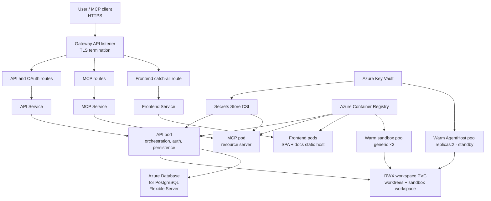
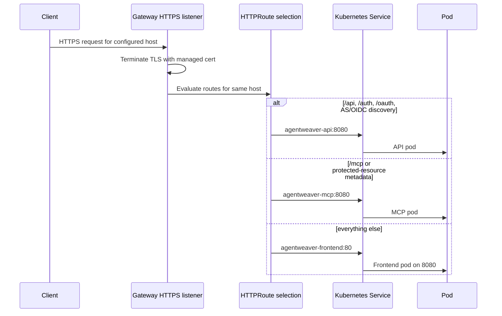
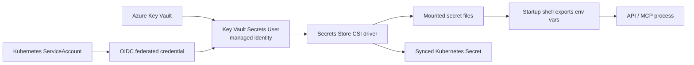
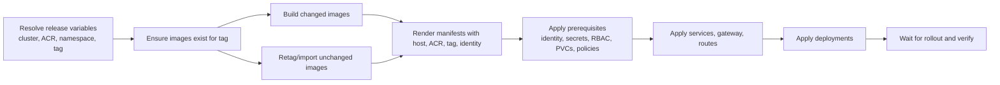

# Infrastructure & Deployment — Conceptual Deep Dive

## Purpose

Agentweaver's AKS infrastructure is organized around deployment logic rather than manifest order. An equivalent deployment follows from understanding the responsibilities, boundaries, and operational trade-offs.

The deployment is built around five ideas:

1. **One public HTTPS entry point** routes browser, API, OAuth, and MCP traffic by path.
2. **Three long-running application workloads** run separately: API, frontend/static host, and MCP server.
3. **State is explicit**: PostgreSQL Flexible Server holds all application state; the workspace volume is a shared multi-writer file share for worktrees and sandbox files.
4. **Identity replaces static cloud credentials**: pods use Azure Workload Identity to read Key Vault secrets; API app secrets use CSI, while AgentHost user tokens are fetched at runtime from Key Vault after `/configure`.
5. **Networking starts closed**: default deny policies are opened only for the paths each component actually needs.

The deployment scripts default to `agentweaver-rg`, `agentweaver-aks-2`, `agentweaverregistry`, `westus2`, namespace `agentweaver`, Key Vault `agentweaver-kv`, and an image tag based on the short Git SHA unless `IMAGE_TAG` is supplied.

## Rebuild mental model

At a high level, Agentweaver is a private application stack behind a public Gateway:

If rebuilding this from scratch, create the platform first, then identity and secrets, then images, then Kubernetes primitives in dependency order. The application deployments are deliberately last because they depend on identity, persistent volumes, routes, and secrets being ready.

Where this lives: `scripts/aks`, `k8s`.

## AKS platform choices

### Why AKS with app routing, Gateway API, and Istio?

Agentweaver needs public HTTPS, path-based routing, TLS certificate management, and clean separation between routing intent and individual services. Gateway API gives a Kubernetes-native model for that:

- A **Gateway** says “this namespace owns an HTTPS listener for this host”.
- **HTTPRoutes** say “these paths go to these services”.
- Services remain ordinary internal Kubernetes load-balancing points.

Cluster creation enables AKS app routing with the Istio variant, Gateway API, and the managed default domain. That means the cluster can provision the gateway implementation and certificate plumbing without hand-maintaining an ingress controller, public load balancer, and TLS cert chain separately.

The trade-off is platform coupling: this deployment assumes AKS app routing behavior, the `approuting-istio` GatewayClass, and the managed default-domain certificate resource. A rebuild on another Kubernetes distribution would need an equivalent GatewayClass and certificate issuer.

### Why Azure CNI overlay, Cilium, and ACNS?

The network model uses both Kubernetes NetworkPolicy and Cilium FQDN-aware policies. Kubernetes NetworkPolicy is good at pod/namespace/IP/port rules, but it cannot express “allow `api.github.com` and Azure OpenAI domains by DNS name”. Cilium can.

That is why the cluster is created with Azure CNI overlay, the Cilium dataplane, and ACNS. Overlay networking avoids consuming a VNet IP for every pod, while Cilium provides the dataplane features needed for DNS-aware egress controls.

The operational constraint is that the manifests are not merely “generic Kubernetes networking”. If Cilium/ACNS is missing, the Cilium FQDN allowlists will not enforce as intended and sandbox/app egress behavior will differ.

### Why workload identity and Key Vault CSI?

Secrets are cloud-owned data, not Kubernetes manifest data. The desired flow is:

1. Store secrets in Azure Key Vault.
2. Grant a user-assigned managed identity permission to read those secrets.
3. Federate the Kubernetes service account to that managed identity through the AKS OIDC issuer.
4. Mount selected Key Vault secrets into pods through the Secrets Store CSI driver.

This avoids committing secrets, avoids long-lived Azure credentials inside containers, and lets Azure RBAC decide what the pod identity can read.

The trade-off is bootstrapping complexity. The service account annotation, pod label for workload identity injection, federated credential subject, Key Vault RBAC assignment, tenant ID, and CSI `SecretProviderClass` must all agree. If one link is wrong, the pod can start but fail to mount secrets or fail the application startup guard.

### Why Kata VM isolation and agent-sandbox CRDs?

Agentweaver launches agent work in sandbox pods. Those pods run tools such as git, language runtimes, and package managers, so they are more exposed than the API/frontend/MCP pods. Kata VM isolation provides a stronger boundary than a normal Linux container runtime by putting each sandbox in a lightweight VM boundary.

The sandbox controller adds higher-level objects such as sandbox templates and warm pools. The template defines the shape of sandbox pods; the warm pool keeps a few ready so first-use latency is lower.

The trade-off is platform maturity and availability: the deploy script only applies sandbox resources when the CRDs are installed. A rebuild can run the core web/API/MCP stack without the sandbox CRDs, but agent execution that depends on Kubernetes sandboxes will not behave the same.

Where this lives: `scripts/aks/10-create-cluster.sh`, `scripts/aks/15-setup-identity.sh`, `k8s/gateway.yaml`, `k8s/secret-provider-class.yaml`, `k8s/sandbox-template.yaml`, `k8s/sandbox-warmpool.yaml`, `k8s/sandbox-template-agenthost.yaml`, `k8s/sandbox-warmpool-agenthost.yaml`.

## Workloads and their responsibilities

### API workload

The API is the authoritative backend. It handles orchestration, project/workspace operations, authentication/OAuth authorization-server endpoints, memory/decision data, sandbox lifecycle calls, and durable run state.

It runs as **two replicas** with a **RollingUpdate** strategy. Application state lives in **Azure Database for PostgreSQL Flexible Server** — multiple pods can write concurrently because status transitions use CAS-style `UPDATE ... WHERE` guards and run-level leasing prevents double-dispatch. The init container runs the EF migration bundle before the API container starts, ensuring the schema is current before serving traffic.

### Frontend workload

The frontend image contains two things:

- the React/Vite single-page app;
- the generated VitePress documentation site.

Both are served by a small ASP.NET Core static-file host. The frontend is safe to run with two replicas because it does not own writable application state. Runtime configuration is injected through a generated `env-config.js`, so the browser can call the API through the public `/api` path rather than a baked build-time URL.

**Docs are built into the frontend:** documentation is part of the frontend container image. Updating Markdown under `docs` does not update the deployed site until the frontend image is rebuilt and rolled out. Conversely, the frontend Docker build context must include `docs`; excluding it would produce an image without the published docs site.

### MCP workload

The MCP server is a separate resource-server process. It exposes the MCP endpoint and validates tokens issued by the API's OAuth authorization server. It uses the internal API service for API calls and JWKS lookup, while its issuer and audience settings are pinned to the public host so token claims match what clients see externally.

This split keeps MCP protocol concerns out of the frontend and avoids making the API process also serve as the MCP resource server. The cost is that routing, identity, network policy, and OAuth metadata must all agree on which paths belong to the authorization server and which paths belong to the MCP resource server.

### Sandbox workload

Sandbox pods are not normal always-on services. They are ephemeral execution environments created from templates and kept warm by two pools: the generic sandbox pool (`replicas: 3`) for command execution and the AgentHost pool (`replicas: 2`) for pod-per-run turns. AgentHost warm pods start in standby and are configured by `/configure` after a claim binds. The generic sandboxes disable service account token mounting; AgentHost uses a dedicated workload-identity service account so it can fetch the configured user token from Key Vault.

The API has narrow RBAC for creating and interacting with these sandbox resources. That is intentional: the API needs to create sandbox claims/pods and exec into them, but it should not be a broad cluster administrator.

Where this lives: `k8s/api-deployment.yaml`, `k8s/frontend-deployment.yaml`, `k8s/mcp-deployment.yaml`, `k8s/rbac-api.yaml`, `apps/web/Dockerfile`, `apps/Agentweaver.Web/Program.cs`.

## Request routing logic

The public routing model is path-based. The Gateway terminates TLS once, then HTTPRoutes select the backend service.

The important design detail is **specific routes before the catch-all**. The frontend route matches `/`, so it is intentionally the fallback. More specific API and MCP routes must exist for protocol paths that should not be swallowed by the SPA host.

### API routes

The API owns:

- REST/API calls under `/api`;
- GitHub auth callback and related browser auth paths under `/auth`;
- OAuth authorization-server endpoints under `/oauth`;
- authorization-server and OpenID discovery documents under `/.well-known/...`.

This is because the API is the OAuth issuer. Clients must discover authorization, token, registration, revocation, and JWKS endpoints from the same public issuer host that appears in token claims.

### MCP routes

The MCP server owns:

- MCP traffic under `/mcp`;
- protected-resource metadata discovery paths;
- a public health convenience path that is rewritten to the MCP server's internal health endpoint.

The MCP server is the OAuth resource server. It validates tokens but does not mint them. For public metadata, clients need to discover the protected resource and then follow that metadata back to the API authorization server.

### Frontend route

The frontend owns everything else. It serves static assets, the React SPA fallback, and the generated docs under `/docs`. Unknown non-doc application paths return the SPA shell so client-side routing can handle them. Unknown docs paths return 404 rather than the SPA shell, which keeps broken documentation links visible.

Where this lives: `k8s/httproute-api.yaml`, `k8s/mcp-httproute.yaml`, `k8s/httproute-frontend.yaml`, `k8s/frontend-service.yaml`, `apps/Agentweaver.Web/Program.cs`.

## Secrets and workload identity

The secret path is deliberately indirect:

The rebuild rule is: applications should not know Azure credentials. They should know only that a secret file appears at a mounted path. Azure identity and Key Vault authorization happen below the application layer.

The API reads GitHub OAuth client settings and the OAuth signing key from CSI-mounted files. The MCP server mounts no secrets — its auth relies only on OAuth (Agentweaver-minted JWT + transitional GitHub passthrough). Both the `agentweaver-api` and `agentweaver-agent-host` service accounts use the same managed identity (`agentweaver-api-identity`), each with its own federated credential (`agentweaver-api-fedcred` and `agentweaver-agenthost-fedcred` respectively). The static `agentweaver-secrets` SecretProviderClass defines which Key Vault objects are mounted for the API.

AgentHost user tokens are fetched at runtime, not mounted through per-run SecretProviderClasses. Each authenticated user's GitHub OAuth token is stored in Key Vault under a per-user key (`ghtok-user--{base32(userId)}`) and is never mirrored to the shared workspace PVC. `sandbox-warmpool-agenthost.yaml` keeps two AgentHost pods pre-warmed in standby; at run launch the API claims one, calls `/configure` with the run owner's secret name, and the pod uses workload identity to fetch exactly that secret. There are no per-run SPCs, cloned templates, or per-run warm pools to clean up.

Rotation constraint: the CSI driver can refresh mounted API files on a polling interval, but these containers export the file contents into environment variables during startup. Environment variables do not update when the file changes. Plan to restart pods after secret rotation unless the application is changed to re-read mounted files for the specific secret.

OAuth signing-key constraint: the signing key is intentionally provisioned as a one-time operator action rather than on every deploy. That prevents routine deploys from accidentally replacing the issuer's private key and invalidating active clients/tokens. It is still a **required first-deploy prerequisite**: run `scripts/aks/16-provision-oauth-signing-key.sh` before the first `30-deploy.sh`. The installer's `--skip-oauth-key` flag is only safe when the Key Vault secret already exists; using it on a production first deploy causes diagnostics to report `key_vault: critical: secret 'mcp-oauth-signing-key' not found`.

Where this lives: `scripts/aks/15-setup-identity.sh`, `scripts/aks/16-provision-oauth-signing-key.sh`, `k8s/serviceaccount-api.yaml`, `k8s/serviceaccount-agenthost.yaml`, `k8s/secret-provider-class.yaml`, `apps/Agentweaver.Api/Sandbox/KubernetesSandboxExecutor.cs`.

## Storage and persistence

Agentweaver separates storage by access pattern.

### PostgreSQL: primary application state

All application state — runs, projects, backlog tasks, revisions, memory, decisions, OAuth state, and run events — is stored in **Azure Database for PostgreSQL Flexible Server**, provisioned by `scripts/aks/17-provision-postgres.sh`. The connection string is stored in the `agentweaver-postgres` Kubernetes Secret and injected as environment variables at pod startup. Use Azure's built-in automated backups and point-in-time restore for data protection.

### Workspace PVC: shared worktrees and sandbox files

The workspace PVC is an Azure Files share mounted ReadWriteMany. The API and sandbox pods both need to see project workspaces and generated files, which makes a shared filesystem a simpler fit than copying files between pods.

The custom StorageClass exists because ownership matters. Containers run as uid/gid 1000 with locked-down filesystems. A default Azure Files mount can appear root-owned and ignore pod `fsGroup`, causing ordinary workspace writes to fail. The repo-owned StorageClass pins mount options so files are usable by the non-root containers.

StorageClass constraint: mount options are immutable. Do not patch a cluster-managed built-in class and hope existing PVCs change. Define the desired class, create/recreate the PVC as needed, and keep the storage behavior under version control.

### Backups

All production data lives in **Azure Database for PostgreSQL Flexible Server**, which provides automated daily backups and point-in-time restore (PITR). Configure retention and geo-redundancy via the Azure portal or `az postgres flexible-server` CLI. No CronJob is needed.

Where this lives: `k8s/pvc-workspace.yaml`, `k8s/storageclass-workspace.yaml`, `apps/Agentweaver.Api/Program.cs`.

## Network policy model

The network design starts with “nothing can talk unless there is a reason”. That is the safest default for a system that runs agent-controlled work.

### Ingress

Application pods are default-denied for ingress. Only the Gateway implementation is allowed to reach API, frontend, and MCP pods on their HTTP ports. MCP is also allowed to call the API internally for JWKS validation.

This creates a clean public boundary:

- external clients enter through the Gateway;
- the Gateway reaches services through narrow pod-level allows;
- MCP-to-API is an explicit east-west exception, not an accidental side effect;
- sandbox pods do not accept inbound traffic.

### Egress

Application pods are default-denied for egress and then granted:

- DNS to kube-dns;
- internal Agentweaver service traffic on the app port;
- external HTTPS where required;
- Cilium FQDN allows for GitHub, Azure AI/OpenAI/Cognitive Services/model endpoints, and telemetry.

Sandbox pods are even narrower. They get DNS, a limited GitHub IP allowance, and Cilium FQDN-based egress for GitHub API, npm registry domains, and Azure AI/model endpoints. They also run without a service account token, so a compromised sandbox has less ambient Kubernetes authority.

### Operational constraints

- DNS must be allowed for FQDN policies to work; blocking DNS breaks name-based egress.
- FQDN allowlists depend on Cilium. Rebuilding on a non-Cilium dataplane requires a different egress-control strategy.
- Broad “allow HTTPS anywhere” rules are easier but weaken the sandbox boundary. If you add one for debugging, remove it rather than letting it become permanent.
- Gateway pods are created by the app-routing implementation, so label/namespace assumptions must match the actual Gateway implementation.

Where this lives: `k8s/networkpolicy-default-deny.yaml`, `k8s/networkpolicy-mcp.yaml`, `k8s/networkpolicy-sandbox.yaml`, `k8s/cilium-network-policy-sandbox.yaml`, `k8s/serviceentry-telemetry.yaml`.

## Build, retag, deploy, rollout logic

The deployment pipeline is easiest to understand as a tag-convergence problem. A release should put every workload on a known image tag, then apply manifests that all refer to that same tag.

### Why use a single image tag per release?

The API, MCP, frontend, sandbox, and AgentHost images are developed together. A single tag lets a deploy answer “what code is running?” without reconstructing a matrix of per-service versions. It also makes rollback simpler: redeploy the previous tag consistently across all images.

### Build changed images

When code changes affect a service, build that image and push it to ACR with the release tag. The build script uses ACR remote builds, so the operator does not need a local Docker daemon. API, frontend, MCP, and AgentHost use the repo root as their build context because their Dockerfiles depend on shared repository content. The sandbox base image has a narrower context because it is self-contained.

AgentHost image builds have one non-obvious invariant: `apps/Agentweaver.AgentHost/Dockerfile` publishes with `dotnet publish --runtime linux-x64 --self-contained false`. The runtime identifier is required for `GitHub.Copilot.SDK` to place the native `copilot` binary at `/app/runtimes/linux-x64/native/copilot`. Without it, AgentHost pods start but crash with `Copilot runtime not found at '/app/runtimes/linux-x64/native/copilot'`.

For the API specifically, the image is more than the web host: it also carries the EF migration bundle used by the init container. That is why “build API” and “roll out API” are coupled to database migration behavior.

### Retag unchanged images

Conceptually, unchanged services still need the release tag. The clean registry pattern is to retag/import the previous known-good image digest to the new release tag instead of rebuilding it. That keeps all deployment manifests on one tag while avoiding unnecessary builds.

The AKS scripts do not include this retag-unchanged optimization. The `20-build-push-images.sh` script rebuilds and pushes all five images with `az acr build`. A pipeline that adds `az acr import`/retag logic should preserve the invariant that every deployed image exists under the same release tag before manifests are applied.

### Render and apply manifests

Deployment renders manifests with environment-specific values: public host, ACR login server, image tag, workload identity client ID, Key Vault name, and tenant ID. Rendering keeps the source manifests reusable while still producing concrete Kubernetes objects for one environment.

Apply order matters:

1. Namespace first.
2. Default-domain certificate and host derivation.
3. Service account, workload identity annotation, static SecretProviderClasses, RBAC, quotas, and PVCs.
4. Network policies and egress allowlists.
5. Services, Gateway, HTTPRoutes, and backup job.
6. Sandbox template/warm pool if the CRDs exist.
7. Deployments last.
8. Rollout waits and post-deploy verification.

This order prevents common race conditions: pods should not start before API secrets can mount, before volumes exist, before identity is annotated, or before the Gateway host is known. Re-applying the static SecretProviderClass is safe because AgentHost user tokens are fetched at runtime from Key Vault; no dynamic user-token SPCs are created per run.

### Rollout and verification

Rollout waits confirm that Kubernetes accepted and started the API, frontend, and MCP deployments. Verification should then check route readiness, HTTP health, static SecretProviderClass status, RBAC assumptions, and sandbox CRD/resources where applicable.

The important distinction: rollout success means pods became ready; it does not prove all external protocol flows work. OAuth discovery, MCP metadata, JWKS validation, and docs routing each deserve smoke tests because they cross multiple components.

Where this lives: `scripts/aks/00-variables.sh`, `scripts/aks/20-build-push-images.sh`, `scripts/aks/30-deploy.sh`, `scripts/aks/40-verify.sh`, `.dockerignore`.

## Rebuild checklist

To stand up an equivalent deployment:

1. Create an AKS cluster with Cilium/ACNS, app routing Istio, Gateway API, managed default domain, Key Vault CSI, OIDC issuer, workload identity, and ACR attachment.
2. Install sandbox CRDs/controller if Kubernetes-backed agent sandboxes are required.
3. Create Key Vault secrets and a user-assigned managed identity with Key Vault secret read access, including the required `mcp-oauth-signing-key` via `scripts/aks/16-provision-oauth-signing-key.sh` before first deploy.
4. Federate the `agentweaver-api` service account subject to that managed identity.
5. Build or retag all required images so API, frontend, MCP, sandbox, and AgentHost exist for one release tag.
6. Render manifests with the environment-specific host, ACR, tag, identity, Key Vault, and tenant values.
7. Apply prerequisites before deployments: identity, CSI secret providers, RBAC, storage, network policy, services, Gateway, routes, backup job.
8. Deploy workloads and wait for rollouts.
9. Smoke test browser routing, API health, OAuth discovery, MCP protected-resource metadata, MCP health, docs under `/docs`, secret mounting, and sandbox creation.
10. Close the backup gap before treating the environment as production: include `memory.db` and protect against whole-PVC loss, not only single-file corruption.

## Common failure modes

- **Frontend works but API calls fail:** the catch-all frontend route is present, but API/MCP routes or route specificity are wrong.
- **MCP initializes slowly or times out:** the MCP pod may be unable to reach the API JWKS endpoint because the east-west network allow is missing.
- **Pods fail to start after secret rotation:** CSI files updated, but process environment variables did not; restart pods or change the app to re-read files.
- **Workspace writes fail with permission errors:** Azure Files mounted with root ownership or wrong mount options; use a uid/gid-aware StorageClass and recreate affected PVCs if needed.
- **Docs changes are not visible:** docs are baked into the frontend image; rebuild and roll out frontend.
- **Cluster diagnostics report `key_vault: critical: secret 'mcp-oauth-signing-key' not found`:** the required OAuth signing-key provisioning step was skipped; run `scripts/aks/16-provision-oauth-signing-key.sh` and redeploy.
- **AgentHost pod crashes with missing Copilot runtime:** rebuild the AgentHost image with the Dockerfile's `dotnet publish --runtime linux-x64 --self-contained false` so the `GitHub.Copilot.SDK` native binary is copied to `/app/runtimes/linux-x64/native/copilot`.
- **API rollout hangs on volume attach:** RWO disk is still attached to the old pod/node; Recreate reduces this risk, but node/storage delays can still happen.
- **Sandbox cannot reach package/model endpoints:** Cilium FQDN policy or DNS allowance is missing, stale, or not supported by the cluster dataplane.
- **OAuth clients reject tokens:** issuer/audience/public host values must match exactly between API token minting, MCP validation, and public metadata.

## Minimal source map

Use these paths for implementation details only after the concepts above are clear:

- Platform and pipeline: `scripts/aks`.
- Kubernetes objects: `k8s`.
- Frontend/docs image and static host: `apps/web/Dockerfile`, `apps/Agentweaver.Web`.
- API image/runtime: `apps/Agentweaver.Api`.
- MCP image/runtime: `apps/Agentweaver.Mcp`.
- Sandbox base image: `apps/agentweaver-sandbox`.
- AgentHost image/runtime: `apps/Agentweaver.AgentHost`.
