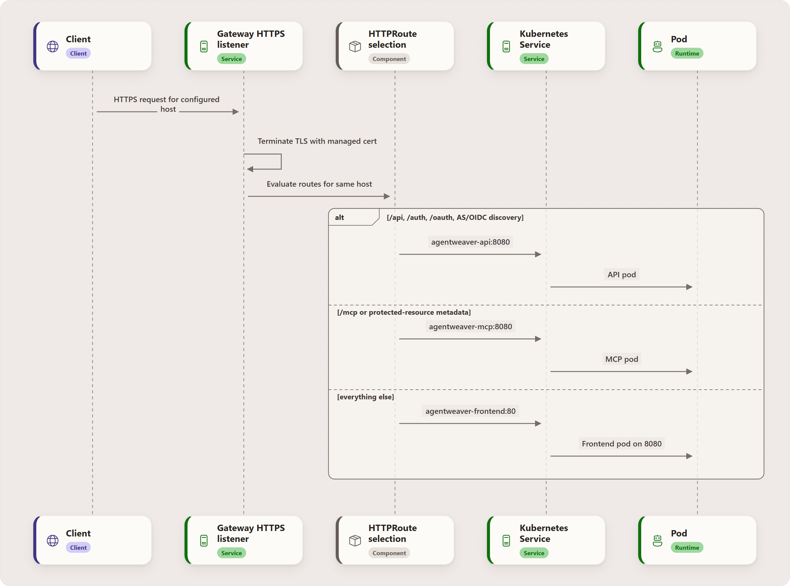
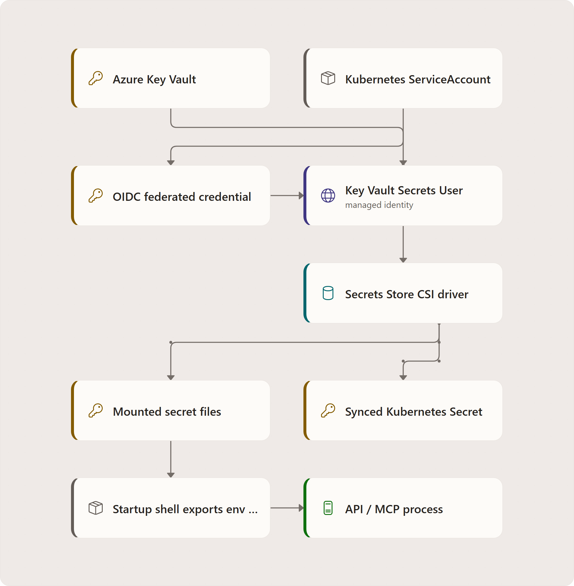

# Infrastructure & Deployment — Conceptual Deep Dive

## Purpose

Agentweaver's AKS infrastructure is organized around deployment logic rather than manifest order. An equivalent deployment follows from understanding the responsibilities, boundaries, and operational trade-offs.

The deployment is built around five ideas:

1. **One public HTTPS entry point** routes browser, API, OAuth, and MCP traffic by path.
2. **Four long-running application workloads** run separately: API, worker, frontend/static host, and MCP server. API and worker share the API image.
3. **State is explicit**: PostgreSQL Flexible Server holds all application state; the workspace volume is a shared multi-writer file share for worktrees and sandbox files.
4. **Identity replaces static cloud credentials**: pods use Azure Workload Identity to read Key Vault secrets; API app secrets use CSI, while AgentHost user tokens are resolved on the API side and brokered to the sandbox in `/configure` (the sandbox identity has no Key Vault access, issue #471).
5. **Networking starts closed**: default deny policies are opened only for the paths each component actually needs.

The deployment scripts default to `agentweaver-rg`, `agentweaver-aks`, `agentweaverregistry`, `westus2`, namespace `agentweaver`, and an image tag based on the short Git SHA unless `IMAGE_TAG` is supplied. `KEYVAULT_NAME` is required environment configuration and has no default.

## Rebuild mental model

At a high level, Agentweaver is a private application stack behind a public Gateway:

The [shared AKS component map](../diagrams/canonical-aks-components.png) is the
single overview; this page does not keep a competing local copy. Its shared-owner
refresh must reconcile the baseline worker count (two), actual secret consumers
(API/worker, not MCP), and the absence of direct AgentHost vault access. Until
then, use the current workload and identity details below rather than stale
labels in that reference.

If rebuilding this from scratch, create the platform first, then identity and secrets, then images, then Kubernetes primitives in dependency order. The application deployments are deliberately last because they depend on identity, persistent volumes, routes, and secrets being ready.

Where this lives: `scripts/azure`, `k8s`.

## AKS platform choices

### Why AKS with app routing, Gateway API, and Istio?

Agentweaver needs public HTTPS, path-based routing, TLS certificate management, and clean separation between routing intent and individual services. Gateway API gives a Kubernetes-native model for that:

- A **Gateway** says “this namespace owns an HTTPS listener for this host”.
- **HTTPRoutes** say “these paths go to these services”.
- Services remain ordinary internal Kubernetes load-balancing points.

Cluster creation enables AKS app routing with the Istio variant, Gateway API, and the managed default domain. That means the cluster can provision the gateway implementation and certificate plumbing without hand-maintaining an ingress controller, public load balancer, and TLS cert chain separately.

The trade-off is platform coupling: this deployment assumes AKS app routing behavior, the `approuting-istio` GatewayClass, and the managed default-domain certificate resource. A rebuild on another Kubernetes distribution would need an equivalent GatewayClass and certificate issuer.

### Why Azure CNI overlay, Cilium, and ACNS?

The network model uses both Kubernetes NetworkPolicy and Cilium FQDN-aware policies. Kubernetes NetworkPolicy is good at pod/namespace/IP/port rules, but it cannot express “allow `api.github.com` and Azure OpenAI domains by DNS name”. Cilium can.

That is why the cluster is created with Azure CNI overlay, the Cilium dataplane, and ACNS. Overlay networking avoids consuming a VNet IP for every pod, while Cilium provides the dataplane features needed for DNS-aware egress controls.

The manifests are not merely generic Kubernetes networking. However, the current
Kata policy uses public-IP HTTPS exceptions, not an effective external-domain
allowlist; Cilium FQDN capability does not make the broader additive rules narrower.

### Why workload identity and Key Vault CSI?

Secrets are cloud-owned data, not Kubernetes manifest data. The desired flow is:

1. Store secrets in Azure Key Vault.
2. Grant a user-assigned managed identity permission to read those secrets.
3. Federate the Kubernetes service account to that managed identity through the AKS OIDC issuer.
4. Mount selected Key Vault secrets into pods through the Secrets Store CSI driver.

This avoids committing secrets, avoids long-lived Azure credentials inside containers, and lets Azure RBAC decide what the pod identity can read.

The trade-off is bootstrapping complexity. The service account annotation, pod label for workload identity injection, federated credential subject, Key Vault RBAC assignment, tenant ID, and CSI `SecretProviderClass` must all agree. If one link is wrong, the pod can start but fail to mount secrets or fail the application startup guard.

### Why Kata VM isolation and agent-sandbox CRDs?

Agentweaver launches agent work in sandbox pods. Those pods run tools such as git, language runtimes, and package managers, so they are more exposed than the API/frontend/MCP pods. Kata VM isolation provides a stronger boundary than a normal Linux container runtime by putting each sandbox in a lightweight VM boundary.

The sandbox controller adds higher-level objects such as sandbox templates and warm pools. The template defines the shape of sandbox pods; the warm pool keeps a few ready so first-use latency is lower.

The trade-off is platform maturity and availability: the deploy script only applies sandbox resources when the CRDs are installed. A rebuild can run the core web/API/MCP stack without the sandbox CRDs, but agent execution that depends on Kubernetes sandboxes will not behave the same.

Where this lives: `scripts/azure/steps/10-create-cluster.mjs`, `scripts/azure/steps/15-setup-identity.mjs`, `k8s/base/gateway.yaml`, `k8s/base/secret-provider-class.yaml`, `k8s/base/sandbox-template-agenthost.yaml`, `k8s/base/sandbox-warmpool-agenthost.yaml`.

## Workloads and their responsibilities

### API workload

The API is the authoritative backend. It handles orchestration, project/workspace operations, authentication/OAuth authorization-server endpoints, memory/decision data, sandbox lifecycle calls, git worktree management, and durable run state. Its runtime image includes both `libgit2` and the `git` CLI because normal headless operations use LibGit2Sharp while the collective Build & Test gate creates a detached integration-branch worktree through `git worktree add --detach` (`apps/Agentweaver.Api/Git/WorktreeManager.cs:155`, `:546`; `apps/Agentweaver.Api/Dockerfile:58`).

It runs as **two replicas** with a **RollingUpdate** strategy. Application state lives in **Azure Database for PostgreSQL Flexible Server** — multiple pods can write concurrently because status transitions use CAS-style `UPDATE ... WHERE` guards and run-level leasing prevents double-dispatch. The init container runs the EF migration bundle before the API container starts, ensuring the schema is current before serving traffic.

### Worker workload

The worker deployment uses the API image without a public Gateway backend. Its
baseline is two replicas; the HPA permits 2-3 replicas using CPU 70% and memory
80%, and its PDB keeps one replica available. Backlog-driven KEDA remains an
alternative documented in comments, not the shipped autoscaler. Public and
orchestration roles are logical responsibilities: background heartbeat pickup is
independently enabled, not prohibited solely by `App:Role`.

### Frontend workload

The frontend image contains two things:

- the React/Vite single-page app;
- the generated VitePress documentation site.

Both are served by a small ASP.NET Core static-file host. The frontend is safe to run with two replicas because it does not own writable application state. Runtime configuration is injected through a generated `env-config.js`, so the browser can call the API through the public `/api` path rather than a baked build-time URL.

**Docs are built into the frontend:** documentation is part of the frontend container image. Updating Markdown under `docs` does not update the deployed site until the frontend image is rebuilt and rolled out. Conversely, the frontend Docker build context must include `docs`; excluding it would produce an image without the published docs site.

### MCP workload

The MCP server is a separate resource-server process. It exposes the MCP endpoint and validates tokens issued by the API's OAuth authorization server. It uses the internal API service for API calls and JWKS lookup, while its issuer and audience settings are pinned to the public host so token claims match what clients see externally.

This split keeps MCP protocol concerns out of the frontend and avoids making the API process also serve as the MCP resource server. The cost is that routing, identity, network policy, and OAuth metadata must all agree on which paths belong to the authorization server and which paths belong to the MCP resource server.

### Sandbox workload

Sandbox pods are not normal always-on services. The live pod-per-run path claims pre-warmed AgentHost pods (`agentweaver-agent-host`, `replicas: 2`), then configures the bound pod with `/configure` before the first A2A turn. AgentHost runs as a dedicated, Key-Vault-less workload identity (issue #471); the run owner's token is brokered to it per-run by the API in `/configure` rather than fetched directly from Key Vault.

The API has narrow RBAC for creating and interacting with these sandbox resources. That is intentional: the API needs to create sandbox claims/pods and exec into them, but it should not be a broad cluster administrator.

Where this lives: `k8s/base/api-deployment.yaml`, `k8s/base/frontend-deployment.yaml`, `k8s/base/mcp-deployment.yaml`, `k8s/base/rbac-api.yaml`, `apps/web/Dockerfile`, `apps/Agentweaver.Web/Program.cs`.

## Request routing logic

The public routing model is path-based. The Gateway terminates TLS once, then HTTPRoutes select the backend service.

<!-- Generated from ../diagrams/src/infra-deployment-fig4.drawio as editable draw.io XML,
     then exported by the official draw.io Desktop CLI, replacing Mermaid.
     Edit the JSON, then run `npm run docs:render-diagrams` and commit the
     regenerated PNG + .hash.txt. -->

The important design detail is **specific routes before the catch-all**. The frontend route matches `/`, so it is intentionally the fallback. More specific API and MCP routes must exist for protocol paths that should not be swallowed by the SPA host.

### API routes

The API owns:

- REST/API calls under `/api`;
- GitHub auth callback and related browser auth paths under `/auth`;
- OpenAPI under `/openapi`;
- exact configured OAuth paths `/oauth/authorize`, `/oauth/token`, `/oauth/register`, `/oauth/resume`, `/oauth/revoke`, and `/oauth/jwks` (not every `/oauth` path);
- authorization-server and OpenID discovery documents under `/.well-known/...`.

This is because the API is the OAuth issuer. Clients must discover authorization, token, registration, revocation, and JWKS endpoints from the same public issuer host that appears in token claims.

### MCP routes

The MCP server owns:

- MCP traffic under `/mcp`;
- protected-resource metadata discovery paths;
- a public health convenience path that is rewritten to the MCP server's internal health endpoint.

The MCP server is the OAuth resource server. It validates tokens but does not mint them. For public metadata, clients need to discover the protected resource and then follow that metadata back to the API authorization server.

### Frontend route

The frontend owns everything else. It serves static assets, the React SPA fallback, and the generated docs under `/docs`. Unknown non-doc application paths return the SPA shell so client-side routing can handle them. Unknown docs paths return 404 rather than the SPA shell, which keeps broken documentation links visible.

Where this lives: `k8s/base/httproute-api.yaml`, `k8s/base/mcp-httproute.yaml`, `k8s/base/httproute-frontend.yaml`, `k8s/base/frontend-service.yaml`, `apps/Agentweaver.Web/Program.cs`.

## Secrets and workload identity

The secret path is deliberately indirect:

<!-- Generated from ../diagrams/src/infra-deployment-fig2.drawio as editable draw.io XML,
     then exported by the official draw.io Desktop CLI, replacing a Mermaid flowchart.
     Edit the JSON, then run `npm run docs:render-diagrams` and commit the
     regenerated PNG + .hash.txt. -->

Separate authorization from secret delivery. API/worker startup reads CSI-mounted
files, while the application also uses workload-identity-authenticated
`SecretClient`/`ISecretStore` for runtime secret storage and OAuth certificate
loading. The managed identity has Secrets User and Secrets Officer roles; this is
not exclusively a file-consumer design.

The API and worker read the required API authentication key from the CSI-mounted
`mcp-api-key` file. MCP mounts no secrets. API and worker have distinct federation
subjects for `agentweaver-api-identity`; an MCP ServiceAccount annotation alone
does not establish a configured federation or vault consumer. AgentHost uses the
separate `agentweaver-agenthost-identity` with no Key Vault roles (issue #471).
The static `agentweaver-secrets` SecretProviderClass serves API/worker secret mounts.

`sandbox-warmpool-agenthost.yaml` keeps two AgentHost pods pre-warmed in standby. At run launch, the API claims one and sends run-scoped provider, repository, preview, workspace, and turn-authentication data through `/configure`. The AgentHost identity has no Key Vault roles, so the pod does not read the vault directly. There are no per-run SecretProviderClasses, cloned templates, or per-run warm pools to clean up.

Rotation constraint: the CSI driver can refresh mounted API files on a polling interval, but these containers export the file contents into environment variables during startup. Environment variables do not update when the file changes. Plan to restart pods after secret rotation unless the application is changed to re-read mounted files for the specific secret.

API-key constraint: `mcp-api-key` remains a **required first-deploy prerequisite**. Run `npm run azure:provision-infra` before the first `npm run azure:deploy-from-local`; without the CSI-delivered key, API authentication and worker loopback calls cannot operate and diagnostics report `key_vault: critical: secret 'mcp-api-key' not found`.

Where this lives: `scripts/azure/steps/15-setup-identity.mjs`, `k8s/base/serviceaccount-api.yaml`, `k8s/base/serviceaccount-agenthost.yaml`, `k8s/base/secret-provider-class.yaml`, `k8s/base/api-deployment.yaml`, `apps/Agentweaver.Api/Diagnostics/DiagnosticsService.cs`.

## Storage and persistence

Agentweaver separates storage by access pattern.

### PostgreSQL: primary application state

All application state — runs, projects, backlog tasks, revisions, memory, decisions, OAuth state, and run events — is stored in **Azure Database for PostgreSQL Flexible Server**, provisioned by `scripts/azure/steps/17-provision-postgres.mjs`. The connection string is stored in the `agentweaver-postgres` Kubernetes Secret and injected as environment variables at pod startup. Use Azure's built-in automated backups and point-in-time restore for data protection.

### Workspace PVC: shared worktrees and sandbox files

The workspace PVC is a 50Gi Azure Files Premium ReadWriteMany share mounted by
API, worker and AgentHost. Detached shared worktrees must sit under the shared
mount. Local execution modes use verified ephemeral checkouts and explicit
writeback instead of executing directly on SMB.

The custom StorageClass exists because ownership matters. Containers run as uid/gid 1000 with locked-down filesystems. A default Azure Files mount can appear root-owned and ignore pod `fsGroup`, causing ordinary workspace writes to fail. The repo-owned StorageClass pins mount options so files are usable by the non-root containers.

StorageClass constraint: mount options are immutable. Do not patch a cluster-managed built-in class and hope existing PVCs change. Define the desired class, create/recreate the PVC as needed, and keep the storage behavior under version control.

### Backups

Primary application state lives in **Azure Database for PostgreSQL Flexible
Server**, with automated backups and point-in-time restore. Workspace files and
Key Vault secrets are separate persistence domains and need their own protection.
Do not apply old SQLite `memory.db` backup or RWO/Recreate advice to the current
RollingUpdate API/worker deployments. The deploy list still contains a legacy
10Gi RWO data claim; that does not make it the live workspace mount.

Where this lives: `k8s/base/pvc-workspace.yaml`, `k8s/base/storageclass-workspace.yaml`, `apps/Agentweaver.Api/Program.cs`.

## Network policy model

The network design starts with “nothing can talk unless there is a reason”. That is the safest default for a system that runs agent-controlled work.

### Ingress

Selected application and AgentHost traffic is default-denied, with explicit
service/control/preview exceptions. API ingress includes Gateway, MCP and
AgentHost peers. The worker's stated API egress has no corresponding worker peer
in the checked-in API ingress rules: this is a **manifest coverage gap**, not a
live connectivity measurement.

This creates a clean public boundary:

- external clients enter through the Gateway;
- the Gateway reaches services through narrow pod-level allows;
- MCP-to-API is an explicit east-west exception, not an accidental side effect;
- AgentHost accepts API/worker control ingress on TCP 8088 and same-namespace
  preview-Gateway ingress on TCP 3000-9000. Since 8088 lies in that range,
  additive policies do not prove that only API/worker can reach the control
  listener. Authentication and configured mTLS remain separate protections.

### Egress

Application pods are default-denied for egress and then granted:

- DNS to kube-dns;
- internal Agentweaver service traffic on the app port;
- external HTTPS where required;
- Cilium FQDN allows for GitHub, Azure AI/OpenAI/Cognitive Services/model endpoints, and telemetry.

AgentHost egress permits public-IP HTTPS with explicit private/link-local CIDR
exclusions, DNS, and API/MCP exceptions. It is not an enforced domain allowlist;
the IPv4 exclusions do not include `100.64.0.0/10`. The template enables a service
account token for the AgentHost platform container and leaves its root filesystem
writable. The executor has a separate credential and child-mount boundary; do not
attribute that narrower boundary to every container in the pod.

### Operational constraints

- DNS must be allowed for FQDN policies to work; blocking DNS breaks name-based egress.
- FQDN allowlists depend on Cilium. Rebuilding on a non-Cilium dataplane requires a different egress-control strategy.
- The shipped public-IP HTTPS allowance is broader than the old FQDN-only prose;
  assess the actual union of policies, not isolated policy names or comments.
- Gateway pods are created by the app-routing implementation, so label/namespace assumptions must match the actual Gateway implementation.

Where this lives: `k8s/base/networkpolicy-default-deny.yaml`, `k8s/base/networkpolicy-mcp.yaml`, `k8s/base/networkpolicy-sandbox.yaml`, `k8s/base/cilium-network-policy-sandbox.yaml`, `k8s/base/serviceentry-telemetry.yaml`.

## Build, retag, deploy, rollout logic

Deployment converges on desired image tags. API, frontend, MCP and AgentHost are
the four image identities; worker reuses the API image. `AGENTHOST_IMAGE_TAG`
defaults to `IMAGE_TAG` but may be overridden explicitly.

<!-- Generated from ../diagrams/src/infra-deployment-fig3.drawio as editable draw.io XML,
     then exported by the official draw.io Desktop CLI, replacing a Mermaid flowchart.
     Edit the JSON, then run `npm run docs:render-diagrams` and commit the
     regenerated PNG + .hash.txt. -->

### Why use a single image tag per release?

The four images are developed together. A common default tag simplifies rollout
and rollback, but is not an invariant forbidding the AgentHost tag override.

### Build changed images

When code changes affect a service, build that image and push it to ACR with the release tag. The build script uses ACR remote builds, so the operator does not need a local Docker daemon. API, frontend, MCP, and AgentHost use the repo root as their build context because their Dockerfiles depend on shared repository content.

AgentHost image builds have one non-obvious invariant: `apps/Agentweaver.AgentHost/Dockerfile` publishes with `dotnet publish --runtime linux-x64 --self-contained false`. The runtime identifier is required for `GitHub.Copilot.SDK` to place the native `copilot` binary at `/app/runtimes/linux-x64/native/copilot`. Without it, AgentHost pods start but crash with `Copilot runtime not found at '/app/runtimes/linux-x64/native/copilot'`.

For the API specifically, the image is more than the web host: it also carries the EF migration bundle used by the init container. That is why “build API” and “roll out API” are coupled to database migration behavior.

### Retag unchanged images

Conceptually, unchanged services still need the release tag. The clean registry pattern is to retag/import the previous known-good image digest to the new release tag instead of rebuilding it. That keeps all deployment manifests on one tag while avoiding unnecessary builds.

Retag/import is implemented in `20-build-push-images.mjs` using `az acr import`. The four image identities are API, frontend, MCP and AgentHost; worker uses the API image.

### Render and apply manifests

Deployment renders manifests with environment-specific values: public host, ACR login server, image tag, workload identity client ID, Key Vault name, and tenant ID. Rendering keeps the source manifests reusable while still producing concrete Kubernetes objects for one environment.

Apply order matters:

1. Namespace first.
2. Default-domain certificate and host derivation.
3. Service account, workload identity annotation, static SecretProviderClasses, RBAC, quotas, and PVCs.
4. Network policies and egress allowlists.
5. Services, runtime configuration, Gateway and HTTPRoutes.
6. Sandbox template/warm pool if the CRDs exist.
7. API/frontend/MCP deployments, then worker with HPA/PDB.
8. Rollout waits and post-deploy verification.

This order prevents common race conditions: pods should not start before API secrets can mount, before volumes exist, before identity is annotated, or before the Gateway host is known. The static SecretProviderClass is reused; the server brokers per-run capability data through `/configure`. AgentHost never fetches user tokens directly from Key Vault.

### Rollout and verification

Rollout waits confirm that Kubernetes accepted and started the API, frontend, and MCP deployments. Verification should then check route readiness, HTTP health, static SecretProviderClass status, RBAC assumptions, and sandbox CRD/resources where applicable.

The important distinction: rollout success means pods became ready; it does not prove all external protocol flows work. OAuth discovery, MCP metadata, JWKS validation, and docs routing each deserve smoke tests because they cross multiple components.

Where this lives: `scripts/azure/variables.mjs`, `scripts/azure/steps/20-build-push-images.mjs`, `scripts/azure/steps/30-deploy.mjs`, `scripts/azure/steps/40-verify.mjs`, `.dockerignore`.

## Rebuild checklist

To stand up an equivalent deployment:

1. Create an AKS cluster with Cilium/ACNS, app routing Istio, Gateway API, managed default domain, Key Vault CSI, OIDC issuer, workload identity, and ACR attachment.
2. Install sandbox CRDs/controller if Kubernetes-backed agent sandboxes are required.
3. Run `npm run azure:provision-infra` to create Key Vault secrets, the user-assigned managed identity, and the required `mcp-api-key` before first deploy.
4. Federate the `agentweaver-api` service account subject to that managed identity.
5. Build or retag API, frontend, MCP and AgentHost to their desired tags; worker shares the API image.
6. Render manifests with the environment-specific host, ACR, tag, identity, Key Vault, and tenant values.
7. Apply identity, CSI, RBAC, storage, network policies, services and routes before workloads.
8. Deploy workloads and wait for rollouts.
9. Smoke test browser routing, API health, OAuth discovery, MCP protected-resource metadata, MCP health, docs under `/docs`, secret mounting, and sandbox creation.
10. Protect PostgreSQL, shared workspace files and vault secrets as separate persistence domains.

## Common failure modes

- **Frontend works but API calls fail:** the catch-all frontend route is present, but API/MCP routes or route specificity are wrong.
- **MCP initializes slowly or times out:** the MCP pod may be unable to reach the API JWKS endpoint because the east-west network allow is missing.
- **Pods fail to start after secret rotation:** CSI files updated, but process environment variables did not; restart pods or change the app to re-read files.
- **Workspace writes fail with permission errors:** Azure Files mounted with root ownership or wrong mount options; use a uid/gid-aware StorageClass and recreate affected PVCs if needed.
- **Docs changes are not visible:** docs are baked into the frontend image; rebuild and roll out frontend.
- **Cluster diagnostics report `key_vault: critical: secret 'mcp-api-key' not found`:** the required API authentication key is absent; run `npm run azure:provision-infra`, then `npm run azure:deploy-from-local`.
- **AgentHost pod crashes with missing Copilot runtime:** rebuild the AgentHost image with the Dockerfile's `dotnet publish --runtime linux-x64 --self-contained false` so the `GitHub.Copilot.SDK` native binary is copied to `/app/runtimes/linux-x64/native/copilot`.
- **Workspace mount fails:** inspect RWX Azure Files mount options and permissions; current API/worker RollingUpdate does not use the old RWO/Recreate workspace model.
- **Sandbox cannot reach package/model endpoints:** Cilium FQDN policy or DNS allowance is missing, stale, or not supported by the cluster dataplane.
- **OAuth clients reject tokens:** issuer/audience/public host values must match exactly between API token minting, MCP validation, and public metadata.

## Minimal source map

Use these paths for implementation details only after the concepts above are clear:

- Platform and pipeline: `scripts/azure`.
- Kubernetes objects: `k8s`.
- Frontend/docs image and static host: `apps/web/Dockerfile`, `apps/Agentweaver.Web`.
- API image/runtime: `apps/Agentweaver.Api`.
- MCP image/runtime: `apps/Agentweaver.Mcp`.
- AgentHost image/runtime: `apps/Agentweaver.AgentHost`.

<!-- diagram-context:canonical-aks-components:start -->

Diagram details and constraints

<table><thead><tr><th>Element</th><th>Contract</th></tr></thead><tbody>
<tr><td>title</td><td>AKS separates control from execution</td></tr>
<tr><td>takeaway</td><td>Replicated API and workers share durable services; AgentHost pods execute isolated turns.</td></tr>
<tr><td>group-title0</td><td>APPLICATION CONTROL</td></tr>
<tr><td>group-title1</td><td>EXECUTION / DURABLE STATE</td></tr>
<tr><td>Application ingress</td><td>Application ingress</td></tr>
<tr><td>Application ingress</td><td>Frontend deployment</td></tr>
<tr><td>Application ingress</td><td>AKS App Routing Gateway</td></tr>
<tr><td>Application ingress</td><td>Frontend: 2 replicas</td></tr>
<tr><td>Application ingress</td><td>Preview gateway separate</td></tr>
<tr><td>API deployment</td><td>API deployment</td></tr>
<tr><td>API deployment</td><td>Request and run control</td></tr>
<tr><td>API deployment</td><td>2 API replicas</td></tr>
<tr><td>API deployment</td><td>Postgres + CSI secrets</td></tr>
<tr><td>API deployment</td><td>Shared workspace mount</td></tr>
<tr><td>MCP deployment</td><td>MCP deployment</td></tr>
<tr><td>MCP deployment</td><td>Broker-authenticated tools</td></tr>
<tr><td>MCP deployment</td><td>1 MCP replica</td></tr>
<tr><td>MCP deployment</td><td>Forwards requests to API</td></tr>
<tr><td>MCP deployment</td><td>No CSI secret mount</td></tr>
<tr><td>Worker deployment</td><td>Worker deployment</td></tr>
<tr><td>Worker deployment</td><td>Background orchestration</td></tr>
<tr><td>Worker deployment</td><td>2 baseline replicas</td></tr>
<tr><td>Worker deployment</td><td>HPA scales from 2 to 3</td></tr>
<tr><td>AgentHost pods</td><td>AgentHost pods</td></tr>
<tr><td>AgentHost pods</td><td>SandboxClaim warm pool</td></tr>
<tr><td>AgentHost pods</td><td>Per-run /configure</td></tr>
<tr><td>AgentHost pods</td><td>Kata-isolated agent turns</td></tr>
<tr><td>AgentHost pods</td><td>No ambient user secrets</td></tr>
<tr><td>Durable services</td><td>Durable services</td></tr>
<tr><td>Durable services</td><td>Postgres + Azure Files</td></tr>
<tr><td>Durable services</td><td>Run state / events in DB</td></tr>
<tr><td>Durable services</td><td>RWX project workspace</td></tr>
<tr><td>Durable services</td><td>Key Vault via API/worker CSI</td></tr>
<tr><td>relation-0</td><td>1 HTTPS</td></tr>
<tr><td>relation-1</td><td>2 API tools</td></tr>
<tr><td>relation-2</td><td>3 persist / mount</td></tr>
<tr><td>relation-3</td><td>4 persist / mount</td></tr>
<tr><td>relation-4</td><td>5 claim + dispatch</td></tr>
<tr><td>assurance</td><td>Application and preview Gateways are separate. AgentHost has no Key Vault-role identity or CSI secret mount.</td></tr>
<tr><td>assurance-0-label</td><td>Azure AKS environment</td></tr>
<tr><td>assurance-0-fact</td><td>GatewayClass: approuting-istio.</td></tr>
<tr><td>assurance-0-source</td><td>gateway.yaml</td></tr>
<tr><td>assurance-1-label</td><td>Manifest facts</td></tr>
<tr><td>assurance-1-fact</td><td>Worker HPA is CPU-based, 2–3.</td></tr>
<tr><td>assurance-1-source</td><td>worker-hpa.yaml</td></tr>
<tr><td>assurance-2-label</td><td>Distinct identities</td></tr>
<tr><td>assurance-2-fact</td><td>AgentHost has no Key Vault role.</td></tr>
<tr><td>assurance-2-source</td><td>serviceaccount-agenthost.yaml</td></tr>
<tr><td>n0</td><td>AKS App Routing Gateway; Frontend: 2 replicas</td></tr>
<tr><td>n1</td><td>2 API replicas; Postgres + CSI secrets</td></tr>
<tr><td>n2</td><td>1 MCP replica; Forwards requests to API</td></tr>
<tr><td>n3</td><td>2 baseline replicas; HPA scales from 2 to 3</td></tr>
<tr><td>n4</td><td>Per-run /configure; Kata-isolated agent turns</td></tr>
<tr><td>n5</td><td>Run state / events in DB; RWX project workspace</td></tr>
<tr><td>groups</td><td>APPLICATION CONTROL; EXECUTION / DURABLE STATE</td></tr>
</tbody></table>

<!-- diagram-context:canonical-aks-components:end -->

<!-- diagram-context:infra-deployment-fig2:start -->

Diagram details and constraints

<table><thead><tr><th>Element</th><th>Contract</th></tr></thead><tbody>
<tr><td>title</td><td>Identity authorizes; CSI delivers secrets</td></tr>
<tr><td>takeaway</td><td>API and worker consume vault secrets; AgentHost receives brokered configuration.</td></tr>
<tr><td>API / worker accounts</td><td>API / worker accounts</td></tr>
<tr><td>API / worker accounts</td><td>Distinct federation subjects</td></tr>
<tr><td>API / worker accounts</td><td>Kubernetes ServiceAccounts</td></tr>
<tr><td>Managed identity</td><td>Managed identity</td></tr>
<tr><td>Managed identity</td><td>OIDC federated credentials</td></tr>
<tr><td>Managed identity</td><td>Secrets User + Secrets Officer</td></tr>
<tr><td>Azure Key Vault</td><td>Azure Key Vault</td></tr>
<tr><td>Azure Key Vault</td><td>Secret storage and authorization</td></tr>
<tr><td>Azure Key Vault</td><td>No static Azure credential</td></tr>
<tr><td>Secrets Store CSI</td><td>Secrets Store CSI</td></tr>
<tr><td>Secrets Store CSI</td><td>Static SecretProviderClass</td></tr>
<tr><td>Secrets Store CSI</td><td>Mounted files + synced Secret</td></tr>
<tr><td>API / worker</td><td>API / worker</td></tr>
<tr><td>API / worker</td><td>Startup exports API key</td></tr>
<tr><td>API / worker</td><td>Also runtime SecretClient calls</td></tr>
<tr><td>Application secret store</td><td>Application secret store</td></tr>
<tr><td>Application secret store</td><td>Workload identity authentication</td></tr>
<tr><td>Application secret store</td><td>Not file-only consumers</td></tr>
<tr><td>MCP</td><td>MCP</td></tr>
<tr><td>MCP</td><td>No secret mounts</td></tr>
<tr><td>MCP</td><td>Annotation is not federation proof</td></tr>
<tr><td>Run configuration</td><td>Run configuration</td></tr>
<tr><td>Run configuration</td><td>Purpose-bound brokered payload</td></tr>
<tr><td>Run configuration</td><td>Provider / repo / turn / preview</td></tr>
<tr><td>AgentHost</td><td>AgentHost</td></tr>
<tr><td>AgentHost</td><td>Separate identity, no vault roles</td></tr>
<tr><td>AgentHost</td><td>No direct vault or CSI token fetch</td></tr>
<tr><td>arrow-1</td><td>federate</td></tr>
<tr><td>arrow-2</td><td>authorize</td></tr>
<tr><td>arrow-3</td><td>secrets</td></tr>
<tr><td>arrow-4</td><td>mount</td></tr>
<tr><td>arrow-5</td><td>use</td></tr>
<tr><td>arrow-6</td><td>read/write</td></tr>
<tr><td>arrow-7</td><td>deliver</td></tr>
<tr><td>note-0</td><td>Top row is authorization, not a secret-data flow.</td></tr>
<tr><td>note-1</td><td>Key Vault supplies CSI and the application SecretClient path.</td></tr>
<tr><td>note-2</td><td>MCP and AgentHost are explicitly not CSI secret consumers.</td></tr>
<tr><td>notes</td><td>Top row is authorization, not a secret-data flow.; Key Vault supplies CSI and the application SecretClient path.; MCP and AgentHost are explicitly not CSI secret consumers.</td></tr>
</tbody></table>

<!-- diagram-context:infra-deployment-fig2:end -->

<!-- diagram-context:infra-deployment-fig3:start -->

Diagram details and constraints

<table><thead><tr><th>Element</th><th>Contract</th></tr></thead><tbody>
<tr><td>title</td><td>Build or reuse, then converge deployment</td></tr>
<tr><td>takeaway</td><td>Four image identities converge before ordered prerequisites and workload rollout.</td></tr>
<tr><td>Desired images</td><td>Desired images</td></tr>
<tr><td>Desired images</td><td>API / frontend / MCP / AgentHost</td></tr>
<tr><td>Desired images</td><td>Worker reuses API image</td></tr>
<tr><td>Build or retag</td><td>Build or retag</td></tr>
<tr><td>Build or retag</td><td>Changed: build + push</td></tr>
<tr><td>Build or retag</td><td>Reusable: az acr import</td></tr>
<tr><td>Concrete manifests</td><td>Concrete manifests</td></tr>
<tr><td>Concrete manifests</td><td>Host / registry / identity / tags</td></tr>
<tr><td>Concrete manifests</td><td>AgentHost tag can override</td></tr>
<tr><td>Namespace + domain</td><td>Namespace + domain</td></tr>
<tr><td>Namespace + domain</td><td>Platform prerequisites</td></tr>
<tr><td>Namespace + domain</td><td>Before dependent resources</td></tr>
<tr><td>Identity and storage</td><td>Identity and storage</td></tr>
<tr><td>Identity and storage</td><td>SA / CSI / RBAC / quota / PVC</td></tr>
<tr><td>Identity and storage</td><td>Then network policy</td></tr>
<tr><td>Services and routing</td><td>Services and routing</td></tr>
<tr><td>Services and routing</td><td>Runtime config / Gateway / routes</td></tr>
<tr><td>Services and routing</td><td>No invented backup-job stage</td></tr>
<tr><td>AgentHost pool</td><td>AgentHost pool</td></tr>
<tr><td>AgentHost pool</td><td>Template then warm pool</td></tr>
<tr><td>AgentHost pool</td><td>Only when CRDs are available</td></tr>
<tr><td>Workload rollout</td><td>Workload rollout</td></tr>
<tr><td>Workload rollout</td><td>API / frontend / MCP / worker</td></tr>
<tr><td>Workload rollout</td><td>Worker HPA and PDB</td></tr>
<tr><td>Verify externally</td><td>Verify externally</td></tr>
<tr><td>Verify externally</td><td>Rollout then protocol checks</td></tr>
<tr><td>Verify externally</td><td>Ready pods are not full proof</td></tr>
<tr><td>arrow-1</td><td>resolve</td></tr>
<tr><td>arrow-2</td><td>render</td></tr>
<tr><td>arrow-3</td><td>apply</td></tr>
<tr><td>arrow-6</td><td>CRDs</td></tr>
<tr><td>arrow-8</td><td>check</td></tr>
<tr><td>note-0</td><td>Rows are successive deployment phases, not independent pipelines.</td></tr>
<tr><td>note-1</td><td>Retag/import is implemented; it is not a future optimization.</td></tr>
<tr><td>note-2</td><td>Desired tags may differ through the explicit AgentHost override.</td></tr>
<tr><td>notes</td><td>Rows are successive deployment phases, not independent pipelines.; Retag/import is implemented; it is not a future optimization.; Desired tags may differ through the explicit AgentHost override.</td></tr>
</tbody></table>

<!-- diagram-context:infra-deployment-fig3:end -->

<!-- diagram-context:infra-deployment-fig4:start -->

Diagram details and constraints

<table><thead><tr><th>Element</th><th>Contract</th></tr></thead><tbody>
<tr><td>title</td><td>Specific routes before frontend fallback</td></tr>
<tr><td>takeaway</td><td>Gateway TLS termination and HTTPRoute selection keep public backends explicit.</td></tr>
<tr><td>Public client</td><td>Public client</td></tr>
<tr><td>Public client</td><td>Browser / API / MCP</td></tr>
<tr><td>Public client</td><td>One HTTPS entry point</td></tr>
<tr><td>Gateway listener</td><td>Gateway listener</td></tr>
<tr><td>Gateway listener</td><td>Terminate TLS</td></tr>
<tr><td>Gateway listener</td><td>Gateway API routing</td></tr>
<tr><td>HTTPRoute match</td><td>HTTPRoute match</td></tr>
<tr><td>HTTPRoute match</td><td>Prefix and exact rules</td></tr>
<tr><td>HTTPRoute match</td><td>Not every /oauth path</td></tr>
<tr><td>API backend</td><td>API backend</td></tr>
<tr><td>API backend</td><td>/api /auth /openapi prefixes</td></tr>
<tr><td>API backend</td><td>Exact OAuth + AS/OIDC discovery</td></tr>
<tr><td>MCP backend</td><td>MCP backend</td></tr>
<tr><td>MCP backend</td><td>/mcp + protected discovery</td></tr>
<tr><td>MCP backend</td><td>/mcp/health rewrites /healthz</td></tr>
<tr><td>Frontend fallback</td><td>Frontend fallback</td></tr>
<tr><td>Frontend fallback</td><td>/ catches remaining traffic</td></tr>
<tr><td>Frontend fallback</td><td>Service :80 -&gt; pod :8080</td></tr>
<tr><td>arrow-1</td><td>HTTPS</td></tr>
<tr><td>arrow-2</td><td>select</td></tr>
<tr><td>arrow-3</td><td>API</td></tr>
<tr><td>arrow-4</td><td>MCP</td></tr>
<tr><td>arrow-5</td><td>fallback</td></tr>
<tr><td>note-0</td><td>API and MCP Services use :8080; worker has no public route.</td></tr>
<tr><td>note-1</td><td>Backend cards list mutually selected destinations, not a serial pipeline.</td></tr>
<tr><td>note-2</td><td>Exact OAuth endpoints and discovery variants remain listed in the page.</td></tr>
<tr><td>notes</td><td>API and MCP Services use :8080; worker has no public route.; Backend cards list mutually selected destinations, not a serial pipeline.; Exact OAuth endpoints and discovery variants remain listed in the page.</td></tr>
</tbody></table>

<!-- diagram-context:infra-deployment-fig4:end -->
