# Decoupled live-preview provisioning — Deep Dive

Decoupled live preview makes the browser preview a deterministic platform step instead of a model-mediated side effect of Build & Test. Build & Test still evaluates the assembled integration tree, but after that turn returns the API runs a platform-owned `PreviewStep` that starts the app in the same retained AgentHost pod, discovers the actual bound port, registers the Gateway preview, and records a durable outcome. The API is an orchestrator here, not a preview data-path client: it creates Kubernetes objects but never probes sandbox preview ports directly.

For proxy internals, see [Sandbox browser preview](./sandbox-browser-preview.md). For event and endpoint contracts, see the [reference](../reference/live-preview-provisioning.md). For the review workflow, see the [user guide](../experience/live-preview-provisioning.md).

## End-to-end flow

```mermaid
%%{init: {'theme':'base','themeVariables':{'fontFamily':'Segoe UI, system-ui, -apple-system, sans-serif','fontSize':'15px','primaryColor':'#E8EEF9','primaryBorderColor':'#0F6CBD','primaryTextColor':'#242424','lineColor':'#605E5C','clusterBkg':'#FAF9F8','clusterBorder':'#D2D0CE','edgeLabelBackground':'#FFFFFF'}}}%%
flowchart LR
    Gate[Build & Test verdict]
    Check{Approved or<br/>request changes?}
    Resolve[PreviewCommandResolver<br/>find run command]
    Runner[AgentHost /preview-runner<br/>start supervised process]
    Port[observe app port<br/>logs + /proc tcp/tcp6]
    Forward[forwarder<br/>0.0.0.0:publicPort]
    Approval[AgentPreviewGate<br/>existing approval policy]
    Route[Gateway HTTPRoute<br/>preview_url]
    Outcome[preview_ready / failed / skipped]
    Review[Human review<br/>preview ready or unavailable]

    Gate --> Check
    Check -- declined --> Review
    Check -- yes --> Resolve --> Runner --> Port --> Forward --> Approval --> Route --> Outcome --> Review
    Resolve -- infra unavailable --> Outcome
    Port -- failure --> Outcome
```

The invocation point is in the coordinator assembly Build & Test gate. `CoordinatorAssemblyService` records preview applicability, runs Build & Test, then calls `PreviewStep.RunAsync` before applying the authored gate decision (`apps/Agentweaver.Api/Coordinator/CoordinatorAssemblyService.cs:710`, `:753`). `ShouldRunDeterministicPreviewStep` means the step runs for `APPROVED` and `REQUEST_CHANGES` verdicts, and skips only `DECLINED` verdicts or missing service wiring (`CoordinatorAssemblyService.cs:180`).

There is no feature flag. If the service is wired and the verdict is not declined, the preview step runs. Infrastructure that cannot produce a reachable Gateway preview self-skips by emitting `sandbox.preview_skipped_not_applicable` with reason `preview_infra_unavailable` (`apps/Agentweaver.Api/Coordinator/Preview/PreviewStep.cs:83`).

## Deterministic command and port discovery

`PreviewStep` does not ask the Build & Test model to call preview tools. It drives AgentHost directly:

1. Resolve a command from the detached worktree with `PreviewCommandResolver`. It checks `package.json`, `.csproj`, Dockerfile, Makefile, Python, Go, and simple Node entry points, forcing all-interface binds where known (`apps/Agentweaver.Api/Sandbox/Preview/PreviewCommandResolver.cs:25`).
2. Call `POST /preview-runner/processes` on the run-bound AgentHost pod origin, not the A2A path (`apps/Agentweaver.Api/Sandbox/Preview/PreviewRunnerHttpClient.cs:35`, `:78`).
3. Call `observe-bound-port`; AgentHost parses stdout/stderr log hints, then diffs the namespace-local kernel socket tables `/proc/net/tcp` and `/proc/net/tcp6` to find a new listening port without depending on the `ss` binary. It verifies HTTP health on the app's actual port, starts `TcpPortForwarder`, then verifies HTTP health again through the forwarder's public port (`apps/Agentweaver.AgentHost/PreviewRunner.cs:246`, `:610`, `:315`).
4. Register the preview with the existing `AgentPreviewGate` and `SandboxPreviewService`. The platform passes the forwarder public port — scanned from `3000-9000` — so the Gateway always targets a pod-IP-reachable listener instead of assuming a fixed port (`PreviewStep.cs:146`, `:166`, `apps/Agentweaver.AgentHost/TcpPortForwarder.cs:75`). `SandboxPreviewService` then creates the Service + HTTPRoute without an API-pod TCP preflight, because NetworkPolicy permits preview-port ingress only from the Gateway (`SandboxPreviewService.cs:134`, `k8s/networkpolicy-sandbox.yaml`).

`PreviewStep` is the single terminal outcome emitter for this stage: `sandbox.preview_ready`, `sandbox.preview_failed`, or `sandbox.preview_skipped_not_applicable` (`PreviewStep.cs:229`, `:258`, `:272`). Observe failures now stay legible end-to-end instead of collapsing into an opaque HTTP 500: `no_listening_port_discovered` means the timeout expired without a healthy listening port, `process_exited:exit={code}` means the app exited before readiness, and `observe_error` means the AgentHost observe endpoint hit an unexpected error but returned a structured unhealthy result. The forwarder adds two more distinct reasons: `bound_unreachable` when the public port fails the through-forwarder health check, and `no_public_port_available` when the allowed public range has no free port (`PreviewRunner.cs:262`, `apps/Agentweaver.AgentHost/Program.cs:347`, `PreviewRunner.cs:321`, `:346`).

The command resolver no longer pins `PORT=3000` or appends `--port`. It may add host-bind hints for known frameworks, but the app otherwise uses its framework default or `process.env.PORT`; port selection belongs to the platform observation/forwarder path (`apps/Agentweaver.Api/Sandbox/Preview/PreviewCommandResolver.cs:25`).

Readiness is intentionally split by trust boundary: AgentHost proves the app and forwarder are reachable from inside the sandbox pod, then the API publishes the Gateway route. The first true data-path check outside the pod is through the returned Gateway hostname, the only source admitted by `sandbox-allow-preview-ingress` for TCP `3000-9000`.

## Gateway and lifetime alignment

On success, registration creates the same Gateway HTTPRoute / Service chain described in [Sandbox browser preview](./sandbox-browser-preview.md), but it also records `preview_runner_session_id` on both the `preview_ready` payload and the HTTPRoute annotations (`PreviewStep.cs:249`, `apps/Agentweaver.Api/Sandbox/Preview/SandboxPreviewService.cs:670`). That id is distinct from `session_id`, which remains the Gateway capability token. Listing active sessions uses a label-selector pod-existence check under the same isolation rule, not an API-to-sandbox TCP liveness check (`SandboxPreviewService.cs:399`, `:768`).

Keepalive now touches both lifetimes. `SandboxPreviewService.KeepAliveAsync` patches the HTTPRoute idle expiry, then best-effort calls `/preview-runner/processes/{sessionId}/health-check` using the annotated PreviewRunner session so the supervised app process is not reaped while the Gateway route stays alive (`SandboxPreviewService.cs:236`, `:271`).

## Per-run preview-runner credential

AgentHost `/preview-runner/*` endpoints are protected by a per-run credential:

- API mints a fresh credential on AgentHost launch and sends it only in the `/configure` body; it is not a pod environment variable, file, or config value (`apps/Agentweaver.Api/Sandbox/KubernetesSandboxExecutor.cs:699`).
- AgentHost stores it in `AgentHostRuntimeState.PreviewRunnerCredential`, in memory only (`apps/Agentweaver.AgentHost/AgentHostRuntimeState.cs:40`).
- `/preview-runner/*` accepts either the turn bearer token or the preview-runner credential and fails closed when either credential is configured (`apps/Agentweaver.AgentHost/Program.cs:450`).
- The credential key is deterministic per run, but every launch mints a new random value (`apps/Agentweaver.Api/Sandbox/Preview/PreviewRunnerCredential.cs:32`, `:39`).
- Pod release and crash/stall orphan reaping delete the durable credential best-effort (`KubernetesSandboxExecutor.cs:486`, `apps/Agentweaver.Api/Sandbox/AgentHostReaperService.cs:189`).

The AgentHost process launcher also scrubs secret-bearing environment variables before spawning the untrusted preview app, so the app cannot inherit the preview-runner credential (`apps/Agentweaver.AgentHost/PreviewRunner.cs:408`).

## Failure behavior

Preview is intentionally decoupled from the Build & Test verdict:

- Preview failure never changes an `APPROVED` verdict into request-changes.
- Preview failure never forces changes when Build & Test already returned `REQUEST_CHANGES`.
- Preview failure never blocks human review. The UI shows **Preview unavailable** with the recorded reason.
- `DECLINED` Build & Test skips the preview step because that gate is already terminal.

The older approval-time outcome guard remains as a safety net. If no terminal preview outcome exists, the coordinator emits `sandbox.preview_failed` with reason `preview_outcome_missing`, but still proceeds with the authored Build & Test decision (`CoordinatorAssemblyService.cs:2455`).

## Source

| Concern | File |
| --- | --- |
| Deterministic preview step | `apps/Agentweaver.Api/Coordinator/Preview/PreviewStep.cs` |
| Build & Test invocation point | `apps/Agentweaver.Api/Coordinator/CoordinatorAssemblyService.cs` |
| Command resolution | `apps/Agentweaver.Api/Sandbox/Preview/PreviewCommandResolver.cs` |
| AgentHost preview-runner HTTP client | `apps/Agentweaver.Api/Sandbox/Preview/PreviewRunnerHttpClient.cs` |
| AgentHost preview-runner endpoints and auth | `apps/Agentweaver.AgentHost/Program.cs` |
| Supervised process runner and `/proc/net/tcp{,6}` port discovery | `apps/Agentweaver.AgentHost/PreviewRunner.cs` |
| Pod-local TCP forwarder | `apps/Agentweaver.AgentHost/TcpPortForwarder.cs` |
| Per-run credential helper | `apps/Agentweaver.Api/Sandbox/Preview/PreviewRunnerCredential.cs` |
| Gateway preview + dual keepalive | `apps/Agentweaver.Api/Sandbox/Preview/SandboxPreviewService.cs` |
| Credential cleanup on pod release/reap | `apps/Agentweaver.Api/Sandbox/KubernetesSandboxExecutor.cs`, `apps/Agentweaver.Api/Sandbox/AgentHostReaperService.cs` |

## See also

- [Decoupled live-preview provisioning — Reference](../reference/live-preview-provisioning.md)
- [Decoupled live-preview provisioning — User Guide](../experience/live-preview-provisioning.md)
- [Sandbox browser preview](./sandbox-browser-preview.md)
- [Coordinator internals](./coordinator-internals.md)
