# Live-preview provisioning — Deep Dive

Live-preview provisioning makes a browser preview a first-class outcome of the coordinator software-delivery pipeline. After Build & Test validates the assembled integration tree, the same gate is expected to start the app inside the run-bound AgentHost pod, discover the actual bound port, health-check it, and call `start_preview(port=PORT)`. The coordinator then verifies that a durable preview outcome exists before it accepts Build & Test approval.

This page covers the pipeline behavior. For the lower-level Gateway proxy, see [Sandbox browser preview](./sandbox-browser-preview.md); for event payloads and operator-facing contracts, see the [reference](../reference/live-preview-provisioning.md); for the web experience, see the [user guide](../experience/live-preview-provisioning.md).

## End-to-end flow

```mermaid
%%{init: {'theme':'base','themeVariables':{'fontFamily':'Segoe UI, system-ui, -apple-system, sans-serif','fontSize':'15px','primaryColor':'#E8EEF9','primaryBorderColor':'#0F6CBD','primaryTextColor':'#242424','lineColor':'#605E5C','clusterBkg':'#FAF9F8','clusterBorder':'#D2D0CE','edgeLabelBackground':'#FFFFFF'}}}%%
flowchart LR
    Integration[Integrated child output<br/>aggregate tree hash]
    Applicability[Preview applicability<br/>required or skipped]
    BuildTest[Build & Test gate<br/>build + tests + preview prompt]
    Runner[AgentHost PreviewRunner<br/>managed process group]
    Port[Observe bound port<br/>logs then socket diff]
    Health[HTTP health check]
    Gate[AgentPreviewGate<br/>HITL or auto-approve]
    Gateway[Gateway preview<br/>preview_url]
    Guard[Coordinator outcome guard]
    Review[Human review<br/>preview ready or unavailable]

    Integration --> Applicability --> BuildTest
    BuildTest --> Runner --> Port --> Health --> Gate --> Gateway
    Gateway --> Guard
    Applicability --> Guard
    Guard --> Review
```

The important detail is that preview success is not inferred from the model's final Build & Test verdict. `CoordinatorAssemblyService` records preview applicability before the Build & Test turn, runs the gate, then calls `EnsureFinalPreviewOutcomeBeforeApprovalAsync` before `ApplyAuthoredGateDecisionAsync` can emit the assembly approval (`apps/Agentweaver.Api/Coordinator/CoordinatorAssemblyService.cs:688`, `:708`, `:2031`). The accepted final outcomes are:

- `sandbox.preview_ready` with a non-empty `preview_url`;
- `sandbox.preview_failed` with a reason/message;
- `sandbox.preview_skipped_not_applicable` when the aggregate diff is classified as not previewable.

`sandbox.preview_pending` is intentionally transitional. The guard waits for the existing approval timeout window, but it does not accept pending as final (`CoordinatorAssemblyService.cs:2037`).

## Applicability before Build & Test

Before Build & Test starts, the coordinator emits:

- `workflow.step` with `step: "preview"` and `status: "started"` or `"skipped"`;
- `sandbox.preview_applicability` with `state: "preview_required"` or `"preview_skipped_not_applicable"`;
- `sandbox.preview_skipped_not_applicable` when the skipped state is final.

The first implementation uses the aggregate diff as a deterministic input. Documentation-only changes are skipped with reason `docs_only`; app/server-looking changes are required with reason `server_files_changed`; ambiguous changes default to required with reason `ambiguous_default_required` (`CoordinatorAssemblyService.cs:1995`, `:2079`). This deliberately fails visible for ambiguous app work instead of silently shipping without a preview.

## Managed process model

The durable process supervisor is `PreviewRunner` inside `apps/Agentweaver.AgentHost`. It contributes four agent tools:

| Tool | Purpose |
| --- | --- |
| `start_preview_process` | Starts the app/server command in the run worktree and keeps stdout/stderr in a ring buffer. |
| `observe_bound_port` | Finds the real port from known log patterns, then falls back to socket-state diffing. |
| `health_check` | Probes `http://127.0.0.1:{port}{path}` and treats HTTP status below 500 as healthy. |
| `stop_preview_process` | Stops the managed process tree with a grace period, then force-kills if needed. |

The runner starts processes through `cmd.exe /c` on Windows or `setsid /bin/sh -lc` on Linux, captures logs, records the baseline listening ports before startup, and stops stale sessions after idle timeout, max lifetime, process exit, or AgentHost shutdown (`apps/Agentweaver.AgentHost/PreviewRunner.cs:70`, `:151`, `:262`, `:326`).

Build & Test is prompted to use this order: `start_preview_process`, `observe_bound_port`, then `start_preview(port=PORT)`. The prompt explicitly forbids hardcoded ports and tells the agent to inspect the project to find the app command (`packages/Agentweaver.AgentRuntime/Workflow/BuildTestTurnExecutor.cs:10`).

## Approval and preview provisioning

The final `start_preview(port=PORT)` call uses the same endpoint and approval seam as any other agent-initiated preview:

1. `POST /api/runs/{runId}/sandbox/preview` validates the run and accepts the owner or the run's own agent callback (`apps/Agentweaver.Api/Endpoints/SandboxEndpoints.cs:57`).
2. `AgentPreviewGate.RequestApprovalAsync` reuses the existing auto-approve sources: `Sandbox:Preview:AutoApprove` / `SANDBOX_PREVIEW_AUTO_APPROVE`, per-run `AutoApproveTools`, or an existing scoped allow policy (`apps/Agentweaver.Api/Sandbox/Preview/AgentPreviewGate.cs:75`).
3. With no auto-approve source, the gate emits `tool.approval_required`, `sandbox.preview_pending`, and a pending `workflow.step`; denial or timeout becomes `sandbox.preview_failed` (`AgentPreviewGate.cs:103`, `apps/Agentweaver.Api/Endpoints/SandboxEndpoints.cs:88`).
4. On approval, `StartPreviewForRunAsync` provisions the Gateway preview, emits `sandbox.preview_ready`, mirrors `coordinator.preview_ready`, and completes the preview workflow step (`SandboxEndpoints.cs:248`).

The preview URL still comes from the [sandbox browser preview](./sandbox-browser-preview.md) Gateway path. A local `kubectl port-forward` fallback can be useful for diagnostics, but it does not satisfy the first-class software-delivery preview contract because it has no public `preview_url` (`SandboxEndpoints.cs:284`).

## Failure and review behavior

Missing preview is visible but not a hard block on human review. If Build & Test passes and no final preview outcome exists, the guard emits `sandbox.preview_failed` with reason `preview_outcome_missing` and a failed preview `workflow.step`, then allows the Build & Test approval path to continue (`CoordinatorAssemblyService.cs:2050`). The web UI shows **Preview unavailable** at the Build & Test step and in the human-review artifacts panel (`apps/web/src/pages/CoordinatorRunPage.tsx:464`, `:3823`).

This split prevents the old silent failure mode without turning app preview into a merge-blocking gate. Build/test failures and preview-only failures also route differently: if Build & Test asks for changes only because preview failed, the coordinator treats the gate as approved so the run can reach human review with the unavailable preview state (`CoordinatorAssemblyService.cs:720`). Preview failure does not use the assembly reset-and-redispatch path.

## Cleanup and retention

The assembly Build & Test pod, detached worktree, and Gateway preview are retained while the coordinator waits at human review so the URL points at the exact assembled tree. Terminalization stops previews best-effort and then cleans up the Build & Test resources or releases the AgentHost pod (`CoordinatorAssemblyService.cs:1869`, `:1918`). The AgentHost PreviewRunner also reaps stale supervised processes locally (`PreviewRunner.cs:326`).

## Source

| Concern | File |
| --- | --- |
| AgentHost process supervisor and preview tools | `apps/Agentweaver.AgentHost/PreviewRunner.cs` |
| Build & Test preview prompt | `packages/Agentweaver.AgentRuntime/Workflow/BuildTestTurnExecutor.cs` |
| Coordinator applicability, outcome guard, approval routing, cleanup | `apps/Agentweaver.Api/Coordinator/CoordinatorAssemblyService.cs` |
| Agent-initiated preview endpoint and ready/failed event emission | `apps/Agentweaver.Api/Endpoints/SandboxEndpoints.cs` |
| Preview approval gate and pending events | `apps/Agentweaver.Api/Sandbox/Preview/AgentPreviewGate.cs` |
| Event type constants | `packages/Agentweaver.Domain/EventTypes.cs` |
| Web preview projection | `apps/web/src/pages/CoordinatorRunPage.tsx` |

## See also

- [Live-preview provisioning — Reference](../reference/live-preview-provisioning.md)
- [Live-preview provisioning — User Guide](../experience/live-preview-provisioning.md)
- [Sandbox browser preview](./sandbox-browser-preview.md)
- [Coordinator internals](./coordinator-internals.md)
