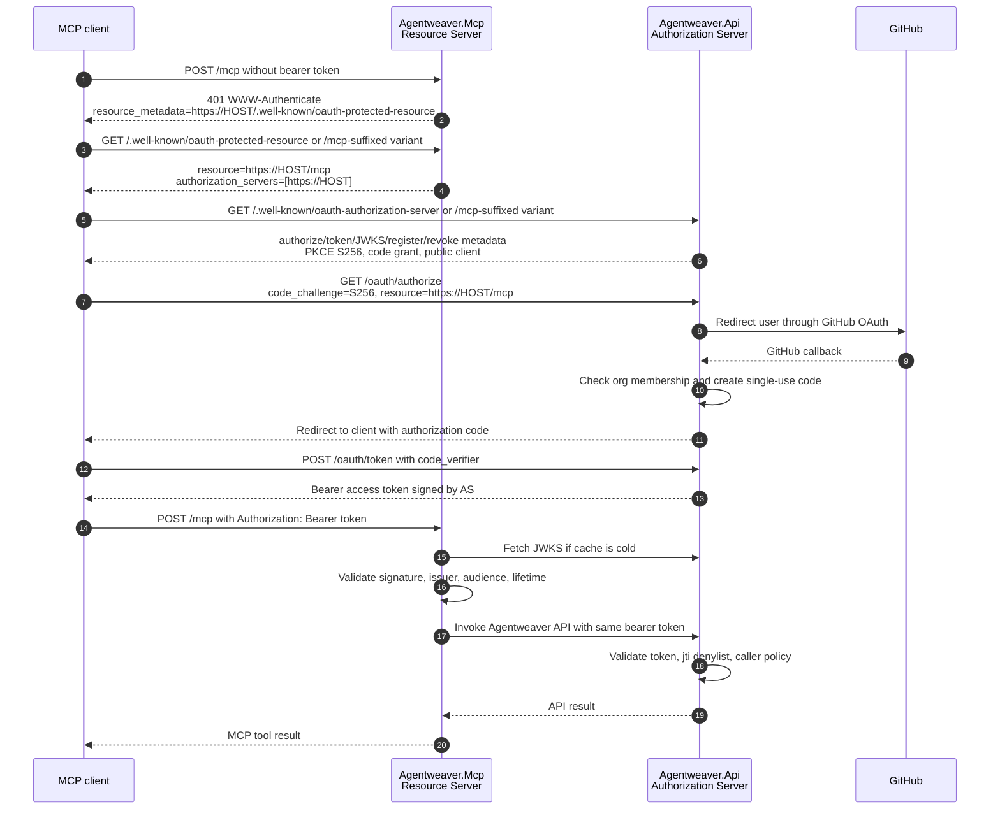
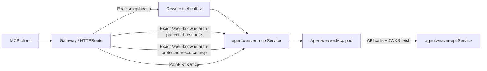

# MCP Server — Conceptual Deep Dive

::: warning Experimental
The Agentweaver MCP server is **experimental**. Tool names, parameters, and behavior may change without notice. Pin to a known revision if you depend on the current surface.
:::

Agentweaver's MCP server is an endpoint that tools can call, uses standards-based OAuth discovery, and preserves the caller's identity all the way to the Agentweaver API. The sections below explain its design as rebuildable ideas, so an engineer who has never seen Agentweaver could recreate the same behavior.

## 1. The mental model: MCP is the tool door, the API is the authority

Agentweaver has two separate responsibilities that are easy to conflate:

- **The MCP server is an OAuth Resource Server (RS).** It hosts the `/mcp` resource and decides whether a request is allowed to invoke MCP tools. It does not issue OAuth tokens, run a login UI, store refresh tokens, or decide long-term identity policy.
- **The Agentweaver API is the OAuth Authorization Server (AS).** It owns the login flow, dynamic client registration, refresh-token rotation, revocation, GitHub organization checks, JWT signing keys, and the business API that tools ultimately call.

The split matters because MCP clients already understand OAuth-style Resource Server behavior. When a client reaches a protected resource without credentials, the resource should tell the client where to discover authorization metadata. The client then obtains a token from the Authorization Server and retries the Resource Server with `Authorization: Bearer ...`.

Agentweaver keeps the MCP server intentionally thin:

1. Authenticate the caller at the MCP boundary.
2. Expose Agentweaver capabilities as MCP tools.
3. Forward the caller's bearer token to the backend API.
4. Let the API enforce durable authorization, revocation, and data access.

That design avoids a confused-deputy problem. If MCP used only a shared service key when calling the API, every tool call would appear to come from the MCP service. Instead, MCP forwards the user's own token whenever it has one, so the API sees the real caller and can apply user-specific policy.

Key invariants to preserve when rebuilding:

- MCP HTTP mode protects tool calls as a Resource Server.
- The API issues and validates Agentweaver OAuth tokens as the Authorization Server.
- The access token audience is the MCP resource, normally `https://HOST/mcp`.
- Hosted deployments pin issuer and audience to the public host, even when services talk to each other over internal cluster addresses.
- The same bearer token that unlocked MCP is propagated downstream to the API.

**Where this lives**

- `apps/Agentweaver.Mcp`
- `apps/Agentweaver.Api/Auth/OAuth`
- `apps/Agentweaver.Api/Endpoints/OAuthServerEndpoints.cs`
- `apps/Agentweaver.Api/Security`

## 2. Runtime shape: local stdio and hosted HTTP solve different problems

The MCP server supports two transport modes.

### stdio mode

Stdio mode is for local MCP hosts that spawn the process and talk over standard input/output. There is no public HTTP resource to protect, so this mode does not run the HTTP bearer middleware. When a tool needs to call the API and there is no inbound HTTP bearer token, the client wrapper can fall back to configured credentials.

### HTTP mode

HTTP mode exposes `/mcp` as a network resource. This is the hosted integration point for clients such as Copilot CLI or VS Code. In this mode, every MCP request flows through bearer-token middleware before reaching tool dispatch, except health checks and OAuth discovery metadata.

The HTTP transport is intentionally stateless. Each request gets its own HTTP scope so the validated inbound token remains available during tool execution. That matters because the tool layer is mostly a proxy: it receives an MCP tool invocation, calls the Agentweaver API, and should forward the caller's token rather than losing context on a detached session loop.

The control flow is:

1. Client sends an MCP request to `/mcp`.
2. Middleware authenticates or challenges.
3. MCP SDK dispatches the requested tool.
4. The tool calls the Agentweaver API through a shared client wrapper.
5. The wrapper chooses the user's inbound bearer token when present; otherwise it falls back to configured service credentials for contexts like stdio.
6. The API performs its own validation and business operation.

**Trade-off:** stateless HTTP keeps identity propagation simple and reliable per request. If a future feature needs long-lived server-side MCP sessions, it must explicitly preserve caller identity across session work rather than relying on ambient HTTP context.

**Where this lives**

- `apps/Agentweaver.Mcp/Program.cs`
- `apps/Agentweaver.Mcp/AgentweaverApiClient.cs`

## 3. Standards-based discovery: how an unauthenticated client learns where to log in

A generic MCP client should not need hard-coded Agentweaver OAuth URLs. The standards flow lets the protected resource advertise enough information for the client to bootstrap itself.

Agentweaver uses two complementary discovery documents:

1. **RFC 9728 Protected Resource Metadata**, served by the MCP Resource Server.
2. **RFC 8414 Authorization Server Metadata**, served by the Agentweaver API Authorization Server.

### 3.1 The Resource Server challenge

When a client calls `/mcp` without a usable token, the MCP server returns `401 Unauthorized` with a `WWW-Authenticate: Bearer ...` challenge. The important part is the `resource_metadata` parameter. It points the client at the protected-resource metadata document.

Conceptually, the challenge says:

> "This is a bearer-protected MCP resource. Before you can call it, discover this resource's OAuth metadata here."

The response should not require authentication; otherwise a client would need a token in order to learn how to get a token.

### 3.2 Protected Resource Metadata (RFC 9728)

The MCP server publishes metadata for the `/mcp` resource. The document communicates four facts:

- **resource**: the exact protected resource identifier, e.g. `https://HOST/mcp`.
- **authorization_servers**: the issuer(s) that can issue tokens for that resource, e.g. `https://HOST`.
- **bearer_methods_supported**: Agentweaver expects bearer tokens in the HTTP `Authorization` header.
- **scopes_supported**: the logical permission needed for MCP invocation, currently `mcp:invoke`.

The resource identifier is not just a URL for routing; it is also the OAuth audience. A token minted for a different audience should not unlock MCP.

### 3.3 Authorization Server Metadata (RFC 8414)

After reading the Resource Server metadata, the client discovers the Authorization Server metadata. That document advertises the authorization endpoint, token endpoint, JWKS endpoint, registration endpoint, revocation endpoint, supported grant types, and PKCE requirements.

Agentweaver's AS is deliberately public-client friendly: MCP clients use authorization code + PKCE, not a client secret. The server supports S256 PKCE and rejects weaker or missing challenge methods. The GitHub client secret stays server-side because the API brokers the GitHub login internally.

### 3.4 The path-suffixed well-known gotcha

The most important routing gotcha is that well-known discovery paths are **not** children of `/mcp`.

For a protected resource `https://HOST/mcp`, path-aware clients may probe well-known URLs like:

- `https://HOST/.well-known/oauth-protected-resource`
- `https://HOST/.well-known/oauth-protected-resource/mcp`
- `https://HOST/.well-known/oauth-authorization-server`
- `https://HOST/.well-known/oauth-authorization-server/mcp`

This follows the well-known URI convention for issuers/resources with path components: the path suffix is appended after the well-known name. A Kubernetes route that only forwards `PathPrefix /mcp` will never deliver `/.well-known/...` requests to the MCP service. Agentweaver therefore routes the bare and `/mcp`-suffixed protected-resource metadata paths explicitly, before the `/mcp` prefix route.

This is a standards-compliance and interoperability decision, not a cosmetic duplicate. Some clients probe the suffixed form; serving only the bare form breaks those clients even though the resource itself is `/mcp`.

**Where this lives**

- `apps/Agentweaver.Mcp/Program.cs`
- `apps/Agentweaver.Mcp/McpBearerTokenMiddleware.cs`
- `apps/Agentweaver.Api/Endpoints/OAuthServerEndpoints.cs`
- `docs/mcp-oauth.md`
- `k8s/mcp-httproute.yaml`

## 4. Bearer tokens: what is accepted, why, and how identity survives

The MCP HTTP boundary accepts bearer credentials through a layered strategy. The order is intentional: cheap deterministic checks happen before expensive or transitional checks.

### 4.1 No token: challenge, do not guess

If there is no bearer token, MCP returns a discovery challenge. It does not redirect, start GitHub login itself, or invent a local login flow. Resource Servers should tell the client how to discover authorization; clients decide how to run the flow.

### 4.2 Automation keys: machine-to-machine compatibility

A configured automation key can authenticate automation and CI callers. This pre-shared-key path is a fast in-memory lookup for controlled service contexts, but it is not the preferred user identity model for interactive MCP clients.

### 4.3 Agentweaver OAuth access tokens: the primary standards path

Agentweaver-minted access tokens are signed JWTs. The API Authorization Server issues them after the client completes authorization code + PKCE and the API confirms GitHub organization membership.

The important claims are conceptual rather than implementation-specific:

- **iss**: the public Authorization Server issuer.
- **aud**: the MCP resource, normally `https://HOST/mcp`.
- **sub / gh_login**: the GitHub-backed user identity.
- **scope**: includes `mcp:invoke`.
- **org**: captures the organization context checked at issuance.
- **jti**: a unique token identifier used for revocation denylisting.
- **exp / nbf / iat**: short-lived token timing, with a small validation clock skew.

The MCP Resource Server validates these tokens offline with the AS public keys from JWKS. Offline validation keeps normal MCP requests fast and avoids a network call to the Authorization Server for every tool invocation. The trade-off is key caching: the Resource Server must refresh JWKS periodically and respect `kid`/key rotation behavior.

Validation should fail closed unless all of these are true:

- The token is structurally a JWT.
- The signature validates with an AS-published RSA signing key.
- The algorithm is the expected asymmetric signing algorithm.
- The issuer equals the configured public issuer.
- The audience equals the MCP resource.
- The token lifetime is valid.
- A usable subject identity is present.

### 4.4 Raw GitHub tokens: transitional compatibility

Agentweaver still has a gated compatibility path for raw GitHub bearer tokens. The MCP server validates them by asking GitHub for the current user and caches the result briefly. This is intentionally transitional: once clients use Agentweaver-minted OAuth tokens, this path can be disabled.

The design trade-off is clear:

- It eases migration for existing clients.
- It adds an external dependency and does not provide Agentweaver's audience-bound JWT properties.
- It should not be expanded into the long-term authentication model.

### 4.5 Revocation and the `jti` denylist

MCP extracts the token identity, including `jti`, but the API owns the authoritative denylist. That is because the API owns OAuth token lifecycle: refresh-token rotation, revocation, and durable storage. MCP forwards the bearer token to the API; the API then rejects tokens whose `jti` has been revoked before natural expiry.

This works because current MCP tools are proxies to the API. If future MCP tools perform sensitive local work without calling the API, they must either perform the same denylist check or avoid relying solely on MCP-side JWT validation.

### 4.6 Public issuer/audience pinning

In Kubernetes, the browser and MCP clients use the public host, while pods call each other through internal service names. If either service derives issuer or audience from the internal request host, tokens will stop matching.

Example failure mode:

1. The AS mints a token with `aud=https://public.example/mcp`.
2. MCP forwards it to `http://agentweaver-api:8080`.
3. The API derives expected audience as `http://agentweaver-api:8080/mcp`.
4. Validation fails even though the user has a valid public token.

The fix is to pin issuer and audience to public values in Production on both services. MCP may still fetch JWKS from the internal API service for efficiency; JWKS location is transport, not token identity.

**Where this lives**

- `apps/Agentweaver.Mcp/McpBearerTokenMiddleware.cs`
- `apps/Agentweaver.Mcp/McpAccessTokenValidator.cs`
- `apps/Agentweaver.Mcp/McpApiKeyRegistry.cs`
- `apps/Agentweaver.Mcp/AgentweaverApiClient.cs`
- `apps/Agentweaver.Api/Auth/OAuth`
- `apps/Agentweaver.Api/Security/ApiKeyAuthMiddleware.cs`
- `k8s/mcp-deployment.yaml`
- `k8s/api-deployment.yaml`

## 5. The MCP tool surface: a protocol adapter over Agentweaver capabilities

The MCP server does not try to duplicate Agentweaver business logic. It exposes a tool vocabulary and translates MCP calls into API calls. This is the right boundary because:

- MCP clients need stable, discoverable tool names and JSON schemas.
- The API remains the source of truth for projects, runs, teams, memory, workflows, and policies.
- Authentication and authorization stay consistent because tool calls use the same API path as other clients.
- New capabilities can be added by adding API endpoints and thin MCP adapters, rather than building a second domain model inside MCP.

A rebuild should preserve this pattern:

1. Define one tool group per product capability.
2. Keep each tool method small: validate MCP-facing arguments, call the API, return the API result.
3. Avoid hidden side effects in MCP that bypass API authorization or audit behavior.
4. Let the MCP SDK generate protocol schemas from tool declarations.
5. Forward the caller's bearer token for every backend call when one exists.

### Capability map

| Area | Conceptual purpose | Representative tools |
|---|---|---|
| Projects | Create, inspect, configure, relink, rename, delete projects and list their runs. | `project_list`, `project_get`, `project_create`, `project_configure`, `project_list_runs` |
| Runs | Submit agent work, monitor status/live events, review, inspect artifacts, retry, archive. | `run_submit`, `run_status`, `run_watch`, `run_review`, `run_show_artifacts`, `run_retry` |
| Coordinator orchestration | Start coordinator runs, confirm/revise outcome specs, inspect work plans and child runs, steer active work. | `coordinator_start`, `coordinator_outcome_spec_confirm`, `coordinator_work_plan_get`, `coordinator_steer`, `orchestration_topology` |
| Backlog and board | Manage tasks through backlog/ready/problem/review/active/done flows and project pickup settings. | `backlog_capture_task`, `backlog_get_board`, `backlog_move_to_ready`, `send_all_backlog_to_ready`, `backlog_set_settings` |
| Memory, decisions, sessions | Submit and merge decision inbox entries, record/search memory, export/import `.squad` state, track sessions. | `decision_inbox_submit`, `decision_inbox_merge`, `squad_decide`, `memory_record`, `memory_search`, `session_start` |
| Team casting | Inspect and evolve a project's agent roster and role charters. | `team_get`, `team_cast`, `team_member_add`, `team_member_retire`, `team_member_get_charter` |
| GitHub auth helpers | Help clients inspect or start GitHub sign-in state where Agentweaver exposes that flow. | `github_status`, `github_signin`, `github_signout` |
| Workspace browsing | Let clients list project workspace references, browse files, and fetch file contents through controlled API paths. | `list_project_workspace_refs`, `list_project_workspace`, `get_project_workspace_file` |
| Workflows | Discover, validate, generate, sync, and save workflow definitions. | `workflows_list`, `workflow_get`, `workflows_sync`, `workflow_generate`, `workflow_save` |
| Blueprints and catalog | List scenario/role catalogs and generate or validate project blueprints. | `list_blueprints`, `validate_blueprint`, `blueprint_generate`, `catalog_list_roles` |
| Diagnostics and sandbox policy | Expose operational status and repository sandbox policy settings. | `diagnostics_get`, `heartbeat_status`, `sandbox_policy_get`, `sandbox_policy_set` |

Beyond the static tool names and descriptions summarized here, the protocol-level schema may include additional MCP SDK-generated metadata.

**Where this lives**

- `apps/Agentweaver.Mcp/Tools`
- `apps/Agentweaver.Mcp/AgentweaverApiClient.cs`

## 6. Kubernetes routing: expose `/mcp`, but do not hide discovery

The Kubernetes design has one public host and routes selected paths to the MCP service.

There are three important routing shapes:

1. **Health:** public `/mcp/health` is rewritten to the pod's internal `/healthz`. This gives operators a stable public health URL without making the app serve health under the MCP protocol path.
2. **Discovery:** exact well-known protected-resource paths go to MCP and are unauthenticated. They must be explicit because they are outside `/mcp`.
3. **MCP protocol:** `PathPrefix /mcp` carries normal MCP traffic to the MCP service.

The deployment pins Resource Server identity configuration:

- `Auth:Mcp:Issuer` is the public host issuer.
- `Auth:Mcp:Audience` is the public MCP resource.
- `Auth:Mcp:JwksUri` can point at the internal API service to avoid public-gateway hairpinning.

This distinction is crucial: issuer and audience describe token identity and must be public/stable; JWKS URI is just where the pod fetches signing keys and may be internal.

**Where this lives**

- `k8s/mcp-service.yaml`
- `k8s/mcp-httproute.yaml`
- `k8s/mcp-deployment.yaml`
- `k8s/secretprovider-mcp.yaml`

## 7. Rebuild checklist

If you were recreating Agentweaver's MCP server from scratch, build in this order:

1. **Define the MCP resource identity.** Choose the public resource URI, e.g. `https://HOST/mcp`, and treat it as the JWT audience.
2. **Implement the Authorization Server separately.** Publish RFC 8414 metadata, run authorization code + PKCE, broker GitHub login server-side, enforce org membership before issuing codes, sign short-lived RS256 JWTs, publish JWKS, support refresh and revocation.
3. **Implement the Resource Server discovery surface.** Serve RFC 9728 protected-resource metadata unauthenticated at both bare and path-suffixed well-known URLs.
4. **Challenge correctly.** Return `401 WWW-Authenticate: Bearer ... resource_metadata="..."` for unauthenticated MCP requests.
5. **Validate bearer tokens at MCP.** Accept configured automation keys if needed, validate Agentweaver JWTs offline with JWKS, and gate the transitional raw GitHub token path behind configuration.
6. **Propagate caller identity.** Store the accepted bearer token in request context and forward it to the API for every tool call.
7. **Keep tools thin.** Use MCP as a protocol adapter, not as a second implementation of Agentweaver's domain logic.
8. **Pin hosted OAuth identity.** In Production, fail startup if issuer/audience are missing or host-derived. Internal service DNS must not change token identity.
9. **Route discovery explicitly.** Kubernetes or gateway routing must send `/.well-known/...` paths to the right service; `/mcp` prefix routing is not enough.
10. **Test with a generic client.** Verify the full flow: unauthenticated `/mcp` challenge, protected-resource metadata, AS metadata, PKCE login, token redemption, MCP call with bearer, downstream API call with the same bearer.

## 8. Common failure modes and the invariant that prevents each one

| Failure mode | Why it happens | Preventing invariant |
|---|---|---|
| Client cannot discover OAuth metadata | Gateway only routes `/mcp`, but well-known URLs are outside that prefix. | Route bare and `/mcp`-suffixed well-known paths explicitly. |
| Token validates locally but fails in cluster | One service derived issuer/audience from an internal host. | Pin issuer and audience to public values in Production. |
| API sees every tool call as the MCP service | MCP used a shared backend key instead of the caller's token. | Forward the accepted bearer token to the API. |
| Revoked access token still passes MCP JWT validation | Offline JWT validation cannot see a central denylist by itself. | API performs authoritative `jti` denylist checks on forwarded tokens. |
| Existing automation cannot call MCP | Only OAuth JWTs are accepted. | Keep automation keys as an explicit machine-to-machine path. |
| Raw GitHub tokens become permanent architecture | Migration path is left enabled without a sunset. | Gate GitHub passthrough by configuration and prefer Agentweaver-minted audience-bound tokens. |
| Future local MCP tool bypasses authorization | Tool performs sensitive work without calling the API. | Either keep tools as API proxies or add equivalent local authorization and revocation checks. |
