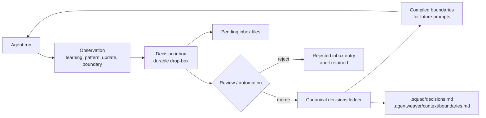
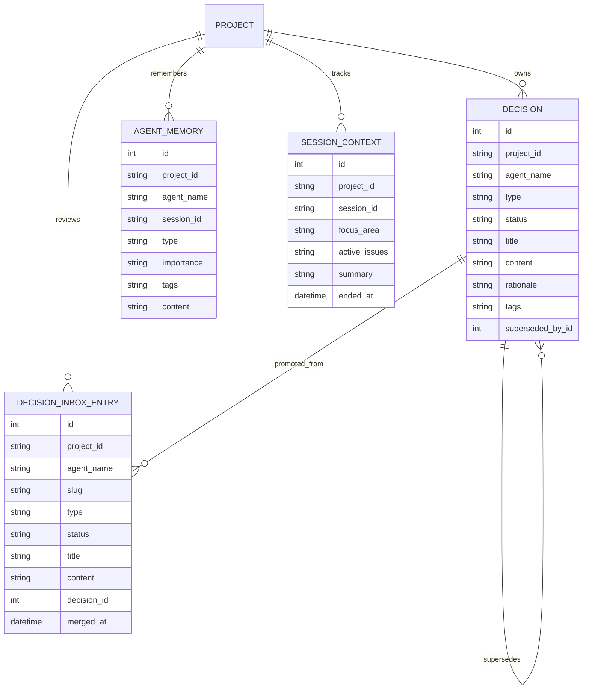
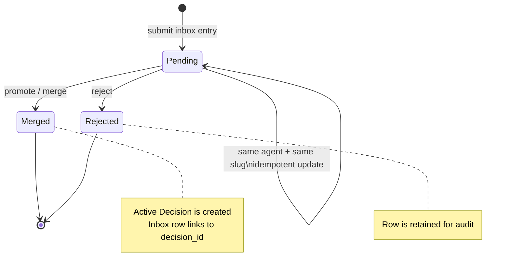
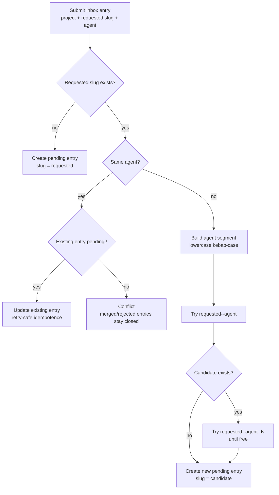
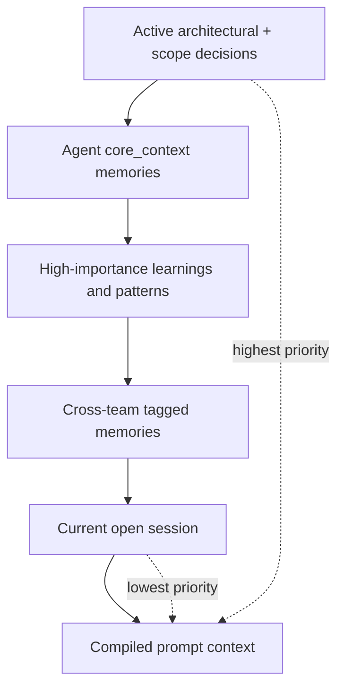
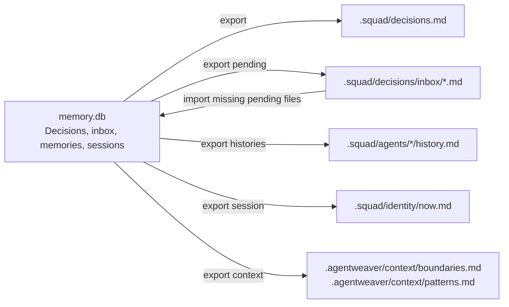

# Memory & Decisions — Conceptual Deep Dive

## Purpose and mental model

Memory and decisions give an Agentweaver team a shared operating record. Agents do not only produce code or prose; they also learn project-specific facts, notice reusable patterns, and propose constraints that future agents should respect. The system has to preserve those observations without letting every transient thought become team law.

Think of the design as a **shared ledger with a drop-box in front of it**:

1. **Agents write observations to the inbox** when they discover something that may matter beyond the current run.
2. **The inbox is reviewable and durable**. Pending, merged, and rejected entries remain explainable.
3. **Promotion creates canonical decisions**. Accepted entries become active decisions in the project ledger.
4. **Memory stays lower priority than decisions**. Memory helps an agent work; decisions constrain what the whole team is allowed to do.
5. **Exports mirror the ledger to files** so humans and agents can inspect the current state in `.squad/` and `.agentweaver/context/`.

The key governance idea is separation: agents may propose, but only accepted decisions become authoritative boundaries. That keeps team knowledge cumulative while preserving a deliberate write boundary around project policy.

Where this lives:

- `apps/Agentweaver.Api/Memory`
- `apps/Agentweaver.Api/Endpoints/DecisionsEndpoints.cs`
- `apps/Agentweaver.Api/Endpoints/MemoryEndpoints.cs`
- `packages/Agentweaver.Squad/Memory`

## Core concepts

### Decision

A decision is an accepted rule, fact, or policy for a project. Active architectural and scope decisions are treated as non-negotiable boundaries when context is compiled for agents. Decisions can also be superseded or archived; supersession preserves why the old rule existed while pointing to the replacement.

Decisions are the highest-priority memory artifact. They answer: "What has the team accepted as true enough to govern future work?"

### Decision inbox entry

An inbox entry is a proposed decision, learning, pattern, or update. It is not automatically authoritative. It carries an agent name, project, slug, type, title, content, rationale, status, and an optional link to the decision created when it is merged.

The inbox exists because agents are useful observers but noisy policymakers. A run can deposit a candidate item without directly changing the team's canonical operating rules.

### Agent memory

Agent memory is reusable context associated with a named agent. It stores core context, learnings, patterns, and updates with an importance level and optional tags. A memory tagged `cross-team` can be selected for agents other than the original author.

Memory answers: "What may help this agent or the wider team do better next time?" It should not override accepted decisions.

### Session context

Session context is the current work focus for a project. It records the active session id, focus area, active issues, summary, and serialized state. Starting a new session closes older open sessions so there is one clear "now" for prompt compilation and export.

### File mirror

The database is authoritative for API reads and writes. Files are an interoperability mirror:

- `.squad/decisions.md` for accepted decisions;
- `.squad/decisions/inbox/{slug}.md` for pending inbox entries;
- `.squad/agents/{agent}/history.md` for learning and update memory;
- `.squad/identity/now.md` for session focus;
- `.agentweaver/context/boundaries.md` for architectural and scope decisions;
- `.agentweaver/context/patterns.md` for reusable patterns.

This mirror makes memory inspectable and git-friendly without making markdown parsing the primary consistency mechanism.

## Why a shared ledger?

Multi-agent work creates two risks:

- **Private knowledge drift**: one agent learns a constraint, but the next agent starts from a blank prompt and violates it.
- **Policy spam**: every agent observation is treated as a durable rule, and the team becomes over-constrained by unreviewed guesses.

The shared-ledger model balances those risks. Agents can always leave evidence. The team can later promote only the evidence that should govern future work. The result is neither purely ephemeral chat history nor an uncontrolled global notebook.

The ledger also creates auditability. A rejected item is still useful because it explains why a proposal did not become policy. A superseded decision is still useful because it explains why an older constraint changed.

## Data model as governance state

The memory database is an EF Core-backed store separate from the operational database. It contains more than human memory, but for governance the central tables are decisions, decision inbox entries, agent memory, and session context.

Two database constraints matter most for rebuilds:

- inbox slugs are unique per project;
- session ids are unique per project.

The project-wide slug constraint is intentionally stronger than "unique per agent." It lets a slug behave like a stable project-level handle for a proposed item, while the endpoint layer handles different-agent collisions safely.

## The inbox to promotion model

The inbox is a state machine:

1. A pending entry is created or updated.
2. A reviewer, coordinator backstop, or post-run Scribe path decides whether it should be accepted.
3. Promotion creates an active decision, marks the inbox entry `merged`, records the merge timestamp, and stores the decision id on the inbox entry.
4. Rejection marks the entry `rejected`; it does not delete it.

Promotion must be transactional in spirit. The system should not create an accepted decision without marking the source inbox entry merged, and it should not mark an inbox entry merged without linking to the accepted decision. If a rebuild uses another database, keep that operation atomic.

There are three promotion paths:

- **Manual/API promotion** merges one pending inbox entry.
- **Post-run Scribe automation** auto-merges lower-risk `learning`, `pattern`, and `update` entries created by the completed run's agent.
- **Coordinator finalization backstop** promotes run-scoped architectural and scope entries authored by the coordinator.

The policy split is deliberate. Routine learnings can flow quickly into the ledger. Architectural and scope boundaries are higher impact and should remain review-oriented unless the coordinator path has explicitly authored them as part of finalization.

## Slug de-collision

An inbox slug is the human-readable identity of a proposed item. Slugs are also used as pending inbox filenames during export. Without careful collision handling, two agents can accidentally write different ideas under the same slug and one can overwrite the other.

The current submission rule is:

1. If no entry exists for the project and requested slug, create a pending entry with that slug.
2. If the same agent submits the same slug again and the entry is still pending, update the existing row. This makes retries idempotent.
3. If the same agent submits the same slug after it was merged or rejected, return a conflict. Historical entries are not silently reopened.
4. If a different agent submits the same slug, create a new entry with a de-collided slug: `original--agent-segment`.
5. If that candidate already exists, append a counter: `original--agent-segment--2`, then `--3`, and so on.

This prevents a data-loss bug: if the key were only `(project, slug)` with blind upsert semantics, the second agent to propose "use-postgres" could overwrite the first agent's unrelated proposal. If the key were only `(project, agent, slug)`, both entries could survive in the database but export to the same `.squad/decisions/inbox/use-postgres.md` path and one file would win. De-collision preserves both proposals all the way through the file mirror.

Slug uniqueness is enforced in two layers. The endpoint first selects a free, de-collided slug before insert by probing `requested--agent--N` candidates until one is unused. The unique `(project, slug)` database constraint then guarantees correctness even under concurrency: if two different-agent submissions race and pick the same free candidate, one insert succeeds and the other fails the constraint. The endpoint does not retry after such a uniqueness violation, so a losing concurrent submission surfaces the conflict to the caller rather than transparently re-deriving a new slug.

## Memory versus decisions

Memory and decisions are intentionally different:

| Aspect | Decisions | Agent memory |
| --- | --- | --- |
| Authority | Governs the team | Informs an agent |
| Review model | Inbox promotion, direct creation, supersession | Direct append |
| Prompt priority | Highest for architectural/scope decisions | Lower than decisions |
| Scope | Project-wide when active | Agent-scoped unless tagged `cross-team` |
| File mirror | `.squad/decisions.md`, boundaries context | agent histories, shared patterns |
| Update model | Status changes and supersession | Append new entries; selection is bounded |

The difference matters during context compilation. Accepted architectural and scope decisions are rendered first as boundaries. Agent memory follows. Session context comes last. This ordering lets the team preserve helpful knowledge without letting a local learning override a project boundary.

Memory selection is bounded. Candidates are scored by importance, then recency, and selected until the item count or approximate token budget is reached. Core context is part of the candidate set, so rebuilds should avoid "dump every memory forever" behavior even when the database contains a long history.

## Import and export

Import/export is the bridge between structured database state and human-readable workspace state.

### Export

Export materializes database rows into files. It rewrites pending inbox markdown from current pending rows and removes stale pending markdown before writing the new set. That makes the database authoritative after synchronization.

Exports happen after memory mutations and after post-run Scribe processing. They are best-effort in the endpoint helpers: failures are logged rather than making the main memory write fail. This favors durability of the database write over availability of the mirror.

### Import

Import scans `.squad/decisions/inbox/*.md`. Each file needs front matter with `agent`, `slug`, `type`, and `title`. The body becomes content. A trailing `**Rationale:**` section is split into rationale. Unparseable files are skipped.

The importer creates missing pending inbox rows by slug and leaves existing slugs alone. It is a union-style import, not a destructive reconciliation. That makes the inbox folder useful as a drop-box for humans or agents without risking deletion of database state.

## Conflict-free merge model

The ledger is designed to merge by **adding facts and changing status**, not by rewriting history.

- New memories are appended.
- New inbox entries are appended, with slug de-collision when needed.
- Rejections are status transitions, not deletes.
- Merges retain the source inbox entry and link it to the created decision.
- Supersession links old and new decisions instead of editing the old decision out of history.
- Export regenerates current mirror files from authoritative rows.

This is not a full CRDT, but the operational shape is conflict-minimizing. Independent agents can usually add observations without coordinating. Human-visible conflict points are explicit: the same project slug, the same session id, and the decision to promote or reject.

The important rebuild principle is **union first, overwrite only for mirrors**. Database state should preserve evidence. Generated files can be rewritten because they are views over that evidence.

## Failure modes

### Duplicate or colliding slugs

The dangerous case is silent overwrite. De-collision avoids it for different agents. Same-agent same-slug updates are allowed only while the entry is pending, preserving retry safety without reopening history.

### Promotion half-success

If promotion creates a decision but does not mark the inbox entry merged, the same proposal can be promoted again. If it marks the inbox entry merged without a decision id, the audit chain breaks. Promotion should therefore be transactional.

### Export failure

The database write may succeed while the file mirror is stale. This is acceptable for the current design because the database is authoritative. The cost is that humans inspecting `.squad/` may temporarily see old state until a later export succeeds.

### Import ambiguity

Malformed inbox files are skipped. This keeps one bad file from blocking all imports, but it can hide authoring mistakes. A rebuild could improve this by returning a warning list while preserving the non-blocking behavior.

### Memory bloat

Unbounded memory would produce noisy prompts and high token usage. The compiler must keep a deterministic budget by importance, recency, item count, and approximate tokens.

### Cross-team over-sharing

The `cross-team` tag is powerful because it moves memory beyond the original agent. Tags should be normalized with delimiter semantics so searching for `team` does not accidentally match `cross-team`, and vice versa.

### Backup gap

The memory ledger lives in `memory.db` for the default SQLite setup. Any backup plan that captures only the operational database misses decisions, inbox entries, sessions, agent memory, run events, coordinator plans, steering directives, and MCP auth state.

## Invariants

A correct implementation should preserve these rules:

- The database is authoritative; exported files are mirrors.
- Project + inbox slug is unique.
- Same agent + same pending slug means idempotent update.
- Different agent + same requested slug means new de-collided entry.
- Merged and rejected inbox entries are not reopened by a retry.
- Rejection never deletes the inbox entry.
- Promotion creates an active decision and links the source inbox entry.
- Architectural and scope decisions outrank all other memory in compiled context.
- Agent memory is scoped to the agent unless explicitly tagged `cross-team`.
- Tags are stored and queried as whole tags, not loose substrings.
- Starting a session closes older open sessions for the same project.
- Export removes stale pending inbox files before writing current pending entries.
- Import creates missing pending inbox rows and does not destructively reconcile the database.
- File writes must stay inside the project workspace.

## Design trade-offs

### Review buffer over instant policy

The inbox delays authority. That adds one more step before a rule governs the team, but it prevents unreviewed agent output from becoming policy.

### Database authority over editable markdown authority

Markdown is easy for humans and agents to inspect. A database is better for transactions, filtering, status transitions, and relationships. Agentweaver chooses the database as source of truth and markdown as a mirror.

### Project-wide slugs over per-agent slugs

Project-wide slug identity catches collisions that would otherwise produce the same exported filename. The trade-off is that the endpoint needs de-collision logic for independent agents using the same natural slug.

### Append/union over destructive cleanup

Keeping rejected and superseded records increases storage and history length. The benefit is that governance remains explainable. The system can answer not only "what is the rule?" but also "what proposal did we reject or replace?"

### Best-effort export over all-or-nothing writes

Failing a database write because a mirror file could not be regenerated would make memory capture fragile. Best-effort export favors durable capture, with the known trade-off that files can lag.

## Rebuild blueprint

To rebuild memory and decision governance from these concepts, implement the system in this order:

1. Define entities for decisions, decision inbox entries, agent memory, and session context.
2. Add project/status/agent indexes and unique constraints for project+slug and project+session id.
3. Implement inbox submission with required-field validation.
4. Implement slug de-collision: same-agent pending updates; different-agent collisions allocate `slug--agent`, then numbered candidates.
5. Implement inbox list filters by status, type, and agent, defaulting to pending.
6. Implement transactional promotion from inbox entry to active decision.
7. Implement rejection as a retained status transition.
8. Implement direct decision creation and decision updates, including supersession links.
9. Implement agent memory recording with normalized comma-delimited tags.
10. Implement memory search with whole-tag matching and agent-specific retrieval.
11. Implement session start/update/current semantics with one open current session.
12. Implement a deterministic context compiler: decisions first, then bounded memory, then current session.
13. Implement DTO-based export to `.squad/` and `.agentweaver/context/`.
14. Implement import from `.squad/decisions/inbox/*.md` as a non-destructive union.
15. Trigger export after memory mutations and after post-run Scribe processing.
16. Add a post-run Scribe path that auto-merges low-risk run-scoped entries and reports higher-risk entries for review.
17. Add a coordinator finalization backstop for run-scoped architectural and scope entries authored by the coordinator.
18. Ensure backup and migration plans include the memory database, not only the operational database.

## Common gotchas

- The decision inbox is not disposable scratch space; it is part of the audit record.
- A pending inbox file is not the source of truth after export; the database row is.
- Same slug does not always mean same proposal. Different agents can choose the same words for different ideas.
- Same-agent idempotence should stop at merged or rejected entries.
- Auto-merging should be conservative. Low-risk learnings are not the same as architectural boundaries.
- Prompt context order is policy: decisions before memory before session.
- Exported `.agentweaver/context/*` files are generated context artifacts, not the canonical decision store.
- Import that overwrites existing rows by slug can destroy review history; import should add missing pending items only.
- A file mirror that cannot represent two entries with the same slug is why de-collision exists.
- Backups that omit `memory.db` omit the team's governance history.
