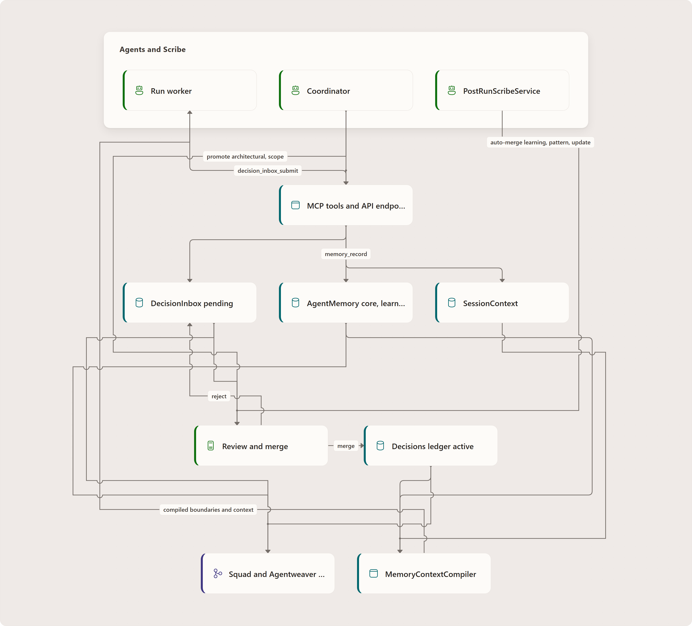
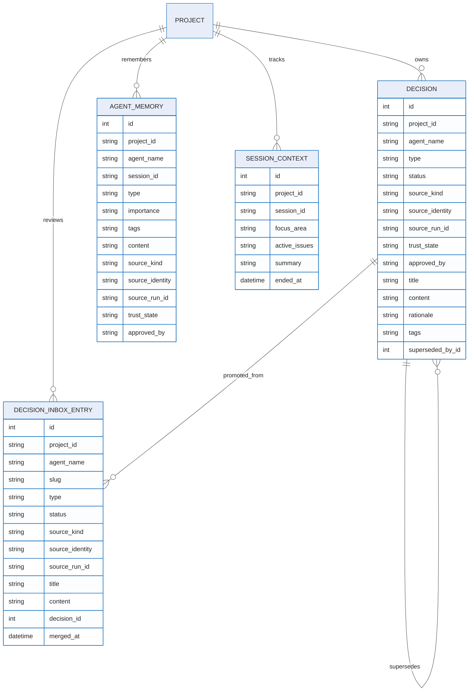
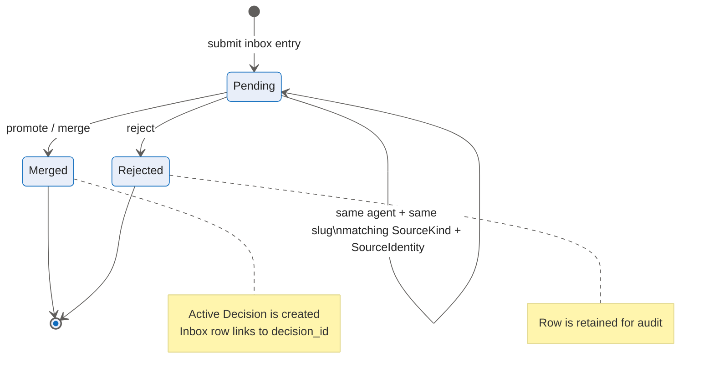
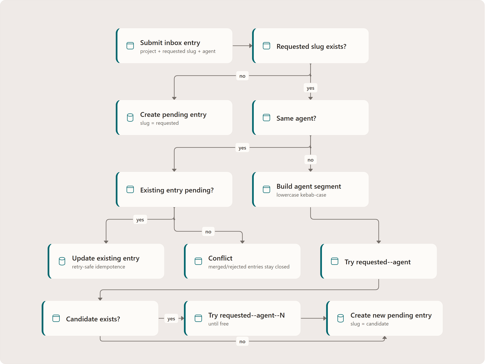

# Memory & Decisions — Conceptual Deep Dive

## Purpose and mental model

Memory and decisions give an Agentweaver team a shared operating record. Agents do not only produce code or prose; they also learn project-specific facts, notice reusable patterns, and propose constraints that future agents should respect. The system has to preserve those observations without letting every transient thought become team law.

Think of the design as a **shared ledger with a drop-box in front of it**:

1. **Agents write observations to the inbox** when they discover something that may matter beyond the current run.
2. **The inbox is reviewable and durable**. Pending, merged, and rejected entries remain explainable.
3. **Promotion creates canonical decisions**. Accepted entries become active decisions in the project ledger.
4. **Memory stays lower priority than decisions**. Memory helps an agent work; decisions constrain what the whole team is allowed to do.
5. **Exports mirror the ledger to files** so humans and agents can inspect the current state in `.squad/` and `.agentweaver/context/`.

The key governance idea is separation: agents may propose, but only accepted decisions
become authoritative boundaries. Acceptance is provenance-aware: a project owner or a
verified Coordinator run controls manual promotion, merge, rejection, and active
decision mutation. That keeps team knowledge cumulative while preserving a deliberate
write boundary around project policy.

<!-- Editable A5 source: ../diagrams/src/memory-decisions-fig1.drawio; exported with draw.io Desktop 31.4.5.
     Inspections and arrow trace: ../diagrams/reviews/memory-decisions-fig1/v2/iteration-manifest.json. -->

Where this lives:

- `apps/Agentweaver.Api/Memory`
- `apps/Agentweaver.Api/Endpoints/DecisionsEndpoints.cs`
- `apps/Agentweaver.Api/Endpoints/MemoryEndpoints.cs`
- `packages/Agentweaver.Squad/Memory`

## Core concepts

### Decision

A decision is an accepted rule, fact, or policy for a project. Active architectural and scope decisions are treated as non-negotiable boundaries when context is compiled for agents. Decisions can also be superseded or archived; supersession preserves why the old rule existed while pointing to the replacement.

Decisions are the highest-priority memory artifact. They answer: "What has the team accepted as true enough to govern future work?"

### Decision inbox entry

An inbox entry is a proposed decision, learning, pattern, or update. It is not automatically authoritative. It carries an agent name, project, slug, type, title, content, rationale, status, and an optional link to the decision created when it is merged.

The inbox exists because agents are useful observers but noisy policymakers. A run can deposit a candidate item without directly changing the team's canonical operating rules.

### Agent memory

Agent memory is reusable context associated with a named agent. It stores core context,
learnings, patterns, and updates with an importance level and optional tags. Approved
memory tagged `cross-team` can be selected for agents other than the original author.

Memory answers: "What may help this agent or the wider team do better next time?" It should not override accepted decisions.

### Provenance and trust

Memory and decisions retain server-resolved provenance:

- `sourceKind`: `human`, `run`, or `legacy`;
- `sourceIdentity`: the authenticated user or verified `run:{id}`;
- `sourceRunId`: the originating run when applicable;
- `trustState`: `pending`, `approved`, or `legacy` for memory and decisions;
- `approvedBy` and `approvedAt`: the approval audit trail.

Agent loopback writes require a short-lived run capability in addition to the internal
API key. The API resolves the project and agent from that verified run and rejects a
forged agent name.

Memory recorded through the API starts `pending`. It can inform its named agent, but `cross-team` selection
requires `approved`. Active architectural and scope decisions also require `approved`
before compilation. Records that predate provenance tracking migrate as `legacy` and
remain visible but fail closed: they are excluded from every prompt until explicitly
approved.

### Session context

Session context is the current work focus for a project. It records the active session id, focus area, active issues, summary, and serialized state. Starting a new session closes older open sessions so there is one clear "now" for prompt compilation and export.

### File mirror

The database is authoritative for API reads and writes. Files are an interoperability mirror:

- `.squad/decisions.md` for accepted decisions;
- `.squad/decisions/inbox/{slug}.md` for pending inbox entries;
- `.squad/agents/{agent}/history.md` for learning and update memory;
- `.squad/identity/now.md` for session focus;
- `.agentweaver/context/boundaries.md` for architectural and scope decisions;
- `.agentweaver/context/patterns.md` for reusable patterns.

This mirror makes memory inspectable and git-friendly without making markdown parsing the primary consistency mechanism.

## Why a shared ledger?

Multi-agent work creates two risks:

- **Private knowledge drift**: one agent learns a constraint, but the next agent starts from a blank prompt and violates it.
- **Policy spam**: every agent observation is treated as a durable rule, and the team becomes over-constrained by unreviewed guesses.

The shared-ledger model balances those risks. Agents can always leave evidence. The team can later promote only the evidence that should govern future work. The result is neither purely ephemeral chat history nor an uncontrolled global notebook.

The ledger also creates auditability. A rejected item is still useful because it explains why a proposal did not become policy. A superseded decision is still useful because it explains why an older constraint changed.

## Data model as governance state

The memory store is EF Core-backed. SQLite deployments use `memory.db` alongside the
operational database; PostgreSQL deployments include operational entities in the same
`MemoryDbContext`. For governance, the central entities are decisions, decision inbox
entries, agent memory, and session context.

The `PROJECT` ownership edges below are conceptual project scoping, not a claim that
every edge is an enforced cross-store foreign key. The model explicitly enforces the
optional decision supersession and inbox-to-decision references.

```mermaid
%%{init: {'theme':'base','themeVariables':{'fontFamily':'Segoe UI, system-ui, -apple-system, sans-serif','fontSize':'15px','primaryColor':'#E8EEF9','primaryBorderColor':'#0F6CBD','primaryTextColor':'#242424','lineColor':'#605E5C','clusterBkg':'#FAF9F8','clusterBorder':'#D2D0CE','edgeLabelBackground':'#FFFFFF'}}}%%
erDiagram
    PROJECT ||--o{ DECISION : owns
    PROJECT ||--o{ DECISION_INBOX_ENTRY : reviews
    PROJECT ||--o{ AGENT_MEMORY : remembers
    PROJECT ||--o{ SESSION_CONTEXT : tracks
    DECISION ||--o{ DECISION : supersedes
    DECISION ||--o{ DECISION_INBOX_ENTRY : promoted_from

    DECISION {
      int id
      string project_id
      string agent_name
      string type
      string status
      string source_kind
      string source_identity
      string source_run_id
      string trust_state
      string approved_by
      string title
      string content
      string rationale
      string tags
      int superseded_by_id
    }
    DECISION_INBOX_ENTRY {
      int id
      string project_id
      string agent_name
      string slug
      string type
      string status
      string source_kind
      string source_identity
      string source_run_id
      string title
      string content
      int decision_id
      datetime merged_at
    }
    AGENT_MEMORY {
      int id
      string project_id
      string agent_name
      string session_id
      string type
      string importance
      string tags
      string content
      string source_kind
      string source_identity
      string source_run_id
      string trust_state
      string approved_by
    }
    SESSION_CONTEXT {
      int id
      string project_id
      string session_id
      string focus_area
      string active_issues
      string summary
      datetime ended_at
    }
```

Two database constraints matter most for rebuilds:

- inbox slugs are unique per project;
- session ids are unique per project.

The project-wide slug constraint is intentionally stronger than "unique per agent." It lets a slug behave like a stable project-level handle for a proposed item, while the endpoint layer handles different-agent collisions safely.

## The inbox to promotion model

The inbox is a state machine. Its abbreviated pending self-loop below requires the
same project, slug, case-insensitive agent name, **source kind, and source identity**;
matching an agent label alone does not authorize an update.

1. A pending entry is created or updated.
2. A project owner, verified Coordinator backstop, or bounded post-run Scribe path
   decides whether it should be accepted.
3. Promotion creates an active decision, marks the inbox entry `merged`, records the merge timestamp, and stores the decision id on the inbox entry.
4. Rejection marks the entry `rejected`; it does not delete it.

```mermaid
%%{init: {'theme':'base','themeVariables':{'fontFamily':'Segoe UI, system-ui, -apple-system, sans-serif','fontSize':'15px','primaryColor':'#E8EEF9','primaryBorderColor':'#0F6CBD','primaryTextColor':'#242424','lineColor':'#605E5C','clusterBkg':'#FAF9F8','clusterBorder':'#D2D0CE','edgeLabelBackground':'#FFFFFF'}}}%%
stateDiagram-v2
    [*] --> Pending: submit inbox entry
    Pending --> Pending: same agent + same slug\nmatching SourceKind + SourceIdentity
    Pending --> Merged: promote / merge
    Pending --> Rejected: reject
    Merged --> [*]
    Rejected --> [*]

    note right of Merged
      Active Decision is created
      Inbox row links to decision_id
    end note
    note right of Rejected
      Row is retained for audit
    end note
```

The merge/promote endpoints open a database transaction around promotion. The shared
promotion helper creates an approved active decision, marks the inbox row merged, and
persists its decision link; the caller owns the transaction. A rebuild should preserve
that atomic relationship rather than treating the helper alone as a transaction.

There are three promotion paths:

- **Manual/API promotion** merges one pending inbox entry after authorization as a
  project owner or verified Coordinator run.
- **Post-run Scribe automation** auto-merges lower-risk `learning`, `pattern`, and
  `update` entries only when they match the completed run's agent, creation window, and
  verified source run id.
- **Coordinator finalization backstop** promotes run-scoped architectural and scope
  entries authored by that same verified Coordinator run.

The policy split is deliberate. Routine, verified run-scoped learnings can flow quickly
into the ledger. Architectural and scope boundaries are higher impact and remain
review-oriented unless the verified Coordinator authored them as part of finalization.
An ordinary agent cannot use Scribe to promote a boundary.

## Slug de-collision

An inbox slug is the human-readable identity of a proposed item. Slugs are also used as pending inbox filenames during export. Without careful collision handling, two agents can accidentally write different ideas under the same slug and one can overwrite the other.

The current submission rule is:

1. If no entry exists for the project and requested slug, create a pending entry with that slug.
2. If the same agent submits the same slug again and the entry is still pending, update the existing row **only when source kind and source identity also match**. This makes retries from the same verified author idempotent.
3. If the same agent submits the same slug after it was merged or rejected, return a conflict. Historical entries are not silently reopened.
4. If a different agent, or the same agent with different provenance on a pending entry, submits the same slug, allocate a de-collided slug: `original--agent-segment`.
5. If that candidate already exists, append a counter: `original--agent-segment--2`, then `--3`, and so on. Every numbered candidate loops back through the availability check before insertion.

<!-- Editable A5 source: ../diagrams/src/memory-decisions-fig2.drawio; exported with draw.io Desktop 31.4.5.
     Inspections and arrow trace: ../diagrams/reviews/memory-decisions-fig2/v2/iteration-manifest.json. -->

This prevents a data-loss bug: if the key were only `(project, slug)` with blind upsert semantics, the second agent to propose "use-postgres" could overwrite the first agent's unrelated proposal. If the key were only `(project, agent, slug)`, both entries could survive in the database but export to the same `.squad/decisions/inbox/use-postgres.md` path and one file would win. De-collision preserves both proposals all the way through the file mirror.

Slug uniqueness is enforced in two layers. The endpoint first selects a free,
de-collided slug before insert by probing candidates until one is unused. The unique
`(project, slug)` database constraint prevents duplicate rows even if two submissions
race and pick the same candidate. The endpoint neither retries the failed insert nor
maps that uniqueness exception to a dedicated HTTP 409 response. A losing concurrent
insert fails; callers must not assume transparent re-allocation.

## Memory versus decisions

Memory and decisions are intentionally different:

| Aspect | Decisions | Agent memory |
| --- | --- | --- |
| Authority | Governs the team | Informs an agent |
| Review model | Owner/verified-Coordinator promotion, direct creation, supersession | Direct append; owner/verified-Coordinator approval for cross-agent use |
| Prompt priority | Highest for architectural/scope decisions | Lower than decisions |
| Scope | Project-wide when active and approved | Agent-scoped unless approved and tagged `cross-team` |
| File mirror | `.squad/decisions.md`, boundaries context | agent histories, shared patterns |
| Update model | Status changes and supersession | Append new entries; selection is bounded |

The difference matters during context compilation. Active, approved architectural and
scope decisions are serialized first as boundaries. Non-legacy agent-scoped memory
follows; cross-team memory must also be approved. Session context comes last. All
selected strings live inside an explicitly untrusted JSON data envelope, so trust
controls eligibility without turning stored text into prompt instructions.

The shared [context schematic](../diagrams/canonical-memory-context.png) is retained
as a reference. The eligibility table below makes the current trust and provenance
gates explicit rather than implying that active status or a tag alone is sufficient.

Memory selection is bounded. Candidates are scored by importance, then recency, and
selection stops at the item limit or the first candidate that would exceed the
approximate token budget. Core context is part of that same candidate set; it is not
guaranteed to outrank every learning. The default limits are 20 items and approximately
4,000 tokens (four characters per token). This budget applies to selected memories,
not to decisions or session data.

| Compiler input | Eligibility |
| --- | --- |
| Project boundaries | Active, approved `architectural` or `scope` decisions |
| Agent core context | Same agent, `core_context`, non-legacy |
| Agent learning/pattern | Same agent, high importance, non-legacy |
| Other-agent learning/pattern | High importance, approved, whole `cross-team` tag |
| Session focus | Most recently started open project session |

These filters describe prompt selection, not every record returned by the read APIs.

## Import and export

Import/export is the bridge between structured database state and human-readable workspace state.

<!-- Editable A5 source: ../diagrams/src/memory-decisions-fig4.drawio; exported with draw.io Desktop 31.4.5.
     Inspections and arrow trace: ../diagrams/reviews/memory-decisions-fig4/v2/iteration-manifest.json. -->

### Export

Export materializes database rows into files. It rewrites pending inbox markdown from current pending rows and removes stale pending markdown before writing the new set. That makes the database authoritative after synchronization.

The API's ledger exporter selects active **approved** decisions, non-legacy memory
(with approval additionally required for shared patterns), pending inbox entries, and
the latest open session. The DTO-based file writer then produces:

| Exported file | Source |
| --- | --- |
| `.squad/decisions.md` | Selected decisions |
| `.squad/decisions/inbox/{slug}.md` | Pending proposals |
| `.squad/agents/{agent}/history.md` | Selected `learning` and `update` memory |
| `.squad/identity/now.md` | Current session, when present |
| `.agentweaver/context/boundaries.md` | Selected `architectural` and `scope` decisions |
| `.agentweaver/context/patterns.md` | Approved pattern memory |

Decision/inbox mutations and post-run Scribe processing can refresh the mirror.
Recording or approving agent memory does not itself perform a synchronous export;
those rows wait for an explicit or subsequent Scribe export. Incidental
refresh helpers log export failures rather than undoing the main database write.
Explicit export surfaces failures instead of reporting a successful sync. None of
the output files other than inbox proposals is an import source.

### Import

Import scans `.squad/decisions/inbox/*.md`. Each file needs front matter with `agent`, `slug`, `type`, and `title`. The body becomes content. A trailing `**Rationale:**` section is split into rationale. Unparseable files are skipped.

The importer creates missing pending inbox rows by slug and leaves existing slugs alone. It is a union-style import, not a destructive reconciliation. That makes the inbox folder useful as a drop-box for humans or agents without risking deletion of database state.

Import does not bypass review. A file can create a pending proposal, but it cannot
directly create an approved decision or repair a `legacy` record's trust state.

## Conflict-free merge model

The ledger is designed to merge by **adding facts and changing status**, not by rewriting history.

- New memories are appended.
- New inbox entries are appended, with slug de-collision when needed.
- Rejections are status transitions, not deletes.
- Merges retain the source inbox entry and link it to the created decision.
- Supersession links old and new decisions instead of editing the old decision out of history.
- Export regenerates current mirror files from authoritative rows.

This is not a full CRDT, but the operational shape is conflict-minimizing. Independent agents can usually add observations without coordinating. Human-visible conflict points are explicit: the same project slug, the same session id, and the decision to promote or reject.

The important rebuild principle is **union first, overwrite only for mirrors**. Database state should preserve evidence. Generated files can be rewritten because they are views over that evidence.

## Failure modes

### Duplicate or colliding slugs

The dangerous case is silent overwrite. De-collision avoids it for different agents
and for pending entries whose author provenance differs. Same-agent same-slug updates
require pending status and matching source kind/identity, preserving retry safety
without reopening history.

### Promotion half-success

If promotion creates a decision but does not mark the inbox entry merged, the same proposal can be promoted again. If it marks the inbox entry merged without a decision id, the audit chain breaks. Promotion should therefore be transactional.

### Export failure

The database write may succeed while the file mirror is stale. This is acceptable for the current design because the database is authoritative. The cost is that humans inspecting `.squad/` may temporarily see old state until a later export succeeds.

### Import ambiguity

Malformed inbox files are skipped. This keeps one bad file from blocking all imports, but it can hide authoring mistakes. A rebuild could improve this by returning a warning list while preserving the non-blocking behavior.

### Memory bloat

Unbounded memory would produce noisy prompts and high token usage. The compiler must keep a deterministic budget by importance, recency, item count, and approximate tokens.

### Cross-team over-sharing

The `cross-team` tag is powerful because it moves memory beyond the original agent. It
must be combined with `TrustState = approved`; a tag on `pending` or `legacy` memory is
not sufficient. Tags should be normalized with delimiter semantics so searching for
`team` does not accidentally match `cross-team`, and vice versa.

### Legacy data treated as current policy

An upgrade can retain historical rows whose authorship cannot be verified. Marking
those rows approved by default would silently elevate unknown text into future prompts.
The migration therefore assigns both `SourceKind = legacy` and `TrustState = legacy`.
The records remain inspectable, but compilation ignores them until an authorized
approval records `ApprovedBy` and `ApprovedAt`.

### Backup gap

The memory ledger lives in `memory.db` for the default SQLite setup. Any backup plan that captures only the operational database misses decisions, inbox entries, sessions, agent memory, run events, coordinator plans, steering directives, and MCP auth state.

## Invariants

A correct implementation should preserve these rules:

- The database is authoritative; exported files are mirrors.
- Project + inbox slug is unique.
- Same agent + same pending slug + matching source kind/identity means idempotent update.
- Different agent, or different provenance on a pending entry, means a new de-collided entry.
- Merged and rejected inbox entries are not reopened by a retry.
- Rejection never deletes the inbox entry.
- Promotion creates an active decision and links the source inbox entry.
- Manual promotion, rejection, approval, and active-decision mutation require a project
  owner or verified Coordinator run.
- Architectural and scope decisions compile only when active and approved.
- Legacy memory and decisions never compile.
- Agent memory is scoped to the agent unless approved and explicitly tagged `cross-team`.
- Stored memory, decision, and session strings are serialized as explicitly untrusted JSON data.
- Tags are stored and queried as whole tags, not loose substrings.
- Starting a session closes older open sessions for the same project.
- Export removes stale pending inbox files before writing current pending entries.
- Import creates missing pending inbox rows and does not destructively reconcile the database.
- File writes must stay inside the project workspace.

## Design trade-offs

### Review buffer over instant policy

The inbox delays authority. That adds one more step before a rule governs the team, but it prevents unreviewed agent output from becoming policy.

### Database authority over editable markdown authority

Markdown is easy for humans and agents to inspect. A database is better for transactions, filtering, status transitions, and relationships. Agentweaver chooses the database as source of truth and markdown as a mirror.

### Project-wide slugs over per-agent slugs

Project-wide slug identity catches collisions that would otherwise produce the same exported filename. The trade-off is that the endpoint needs de-collision logic for independent agents using the same natural slug.

### Append/union over destructive cleanup

Keeping rejected and superseded records increases storage and history length. The benefit is that governance remains explainable. The system can answer not only "what is the rule?" but also "what proposal did we reject or replace?"

### Best-effort export over all-or-nothing writes

Failing a database write because a mirror file could not be regenerated would make memory capture fragile. Best-effort export favors durable capture, with the known trade-off that files can lag.

## Rebuild blueprint

To rebuild memory and decision governance from these concepts, implement the system in this order:

1. Define entities for decisions, decision inbox entries, agent memory, and session context.
2. Add project/status/agent indexes and unique constraints for project+slug and project+session id.
3. Implement inbox submission with required-field validation.
4. Implement slug de-collision: same-agent pending updates require matching provenance; other pending collisions allocate `slug--agent`, then availability-checked numbered candidates.
5. Implement inbox list filters by status, type, and agent, defaulting to pending.
6. Implement transactional, authorized promotion from inbox entry to an approved active decision.
7. Implement rejection as a retained status transition.
8. Implement direct decision creation and decision updates, including supersession links.
9. Implement agent memory recording with verified provenance, `pending` trust, and normalized comma-delimited tags.
10. Implement memory search with whole-tag matching and agent-specific retrieval.
11. Implement session start/update/current semantics with one open current session.
12. Implement a deterministic context compiler: approved decisions first, then eligible
    bounded memory, then current session, all inside an explicitly untrusted data envelope.
13. Implement DTO-based export to `.squad/` and `.agentweaver/context/`.
14. Implement import from `.squad/decisions/inbox/*.md` as a non-destructive union.
15. Refresh mirrors after decision/inbox mutations and post-run Scribe processing; keep agent-memory recording latency independent of filesystem export.
16. Add a post-run Scribe path that auto-merges only low-risk entries attributable to
    the exact completed run and reports higher-risk entries for review.
17. Add a verified Coordinator finalization backstop for its own run-scoped
    architectural and scope entries.
18. Migrate unverifiable existing rows as `legacy` and require explicit approval before compilation.
19. Ensure backup and migration plans include the memory database, not only the operational database.

## Common gotchas

- The decision inbox is not disposable scratch space; it is part of the audit record.
- A pending inbox file is not the source of truth after export; the database row is.
- Same slug does not always mean same proposal. Different agents can choose the same words for different ideas.
- Same-agent idempotence should stop at merged or rejected entries.
- Auto-merging should be conservative. Low-risk learnings are not the same as architectural boundaries.
- A `cross-team` tag is not approval.
- An active database status is not enough for a legacy decision to compile.
- Prompt context order is policy: decisions before memory before session.
- Exported `.agentweaver/context/*` files are generated context artifacts, not the canonical decision store.
- Import that overwrites existing rows by slug can destroy review history; import should add missing pending items only.
- A file mirror that cannot represent two entries with the same slug is why de-collision exists.
- Backups that omit `memory.db` omit the team's governance history.

<!-- diagram-context:canonical-memory-context:start -->

Diagram details and constraints

<table><thead><tr><th>Element</th><th>Contract</th></tr></thead><tbody>
<tr><td>title</td><td>Context is selected data, not instructions</td></tr>
<tr><td>takeaway</td><td>Approved decisions, jointly ranked memories and the open session converge into untrusted JSON.</td></tr>
<tr><td>group-title0</td><td>SCOPED INPUTS</td></tr>
<tr><td>group-title1</td><td>SELECTION AND SERIALIZATION</td></tr>
<tr><td>Active decisions</td><td>Active decisions</td></tr>
<tr><td>Active decisions</td><td>Project-wide boundaries</td></tr>
<tr><td>Active decisions</td><td>Approved architecture / scope</td></tr>
<tr><td>Active decisions</td><td>Oldest-created first</td></tr>
<tr><td>Active decisions</td><td>Child prompts: decisions only</td></tr>
<tr><td>Core + learnings</td><td>Core + learnings</td></tr>
<tr><td>Core + learnings</td><td>Agent-scoped candidates</td></tr>
<tr><td>Core + learnings</td><td>Core: exclude legacy trust</td></tr>
<tr><td>Core + learnings</td><td>High learning / pattern</td></tr>
<tr><td>Core + learnings</td><td>Approved cross-team allowed</td></tr>
<tr><td>Open session</td><td>Open session</td></tr>
<tr><td>Open session</td><td>Latest active session</td></tr>
<tr><td>Open session</td><td>Focus / issues / summary</td></tr>
<tr><td>Open session</td><td>Ended sessions excluded</td></tr>
<tr><td>Open session</td><td>Latest StartedAt wins</td></tr>
<tr><td>Joint rank + budget</td><td>Joint rank + budget</td></tr>
<tr><td>Joint rank + budget</td><td>One combined memory list</td></tr>
<tr><td>Joint rank + budget</td><td>Importance, then recency</td></tr>
<tr><td>Joint rank + budget</td><td>Stop at item / char limit</td></tr>
<tr><td>Joint rank + budget</td><td>Approximation: 4 chars/token</td></tr>
<tr><td>Context compiler</td><td>Context compiler</td></tr>
<tr><td>Context compiler</td><td>Assemble scoped sections</td></tr>
<tr><td>Context compiler</td><td>Decisions + selected memory</td></tr>
<tr><td>Context compiler</td><td>Add current session</td></tr>
<tr><td>Context compiler</td><td>Empty inputs → null</td></tr>
<tr><td>Untrusted JSON</td><td>Untrusted JSON</td></tr>
<tr><td>Untrusted JSON</td><td>Historical data, not authority</td></tr>
<tr><td>Untrusted JSON</td><td>Explicit boundary markers</td></tr>
<tr><td>Untrusted JSON</td><td>Ignore embedded instructions</td></tr>
<tr><td>Untrusted JSON</td><td>untrusted-context.v1</td></tr>
<tr><td>relation-0</td><td>1 combine / sort</td></tr>
<tr><td>relation-1</td><td>2 approved</td></tr>
<tr><td>relation-2</td><td>3 latest open</td></tr>
<tr><td>relation-3</td><td>4 selected</td></tr>
<tr><td>relation-4</td><td>5 serialize</td></tr>
<tr><td>assurance</td><td>Defaults: 20 memory items / ≈4,000 tokens. That budget bounds selected memories—not decisions or the entire context.</td></tr>
<tr><td>assurance-0-label</td><td>Joint memory ordering</td></tr>
<tr><td>assurance-0-fact</td><td>Importance first; recency breaks ties.</td></tr>
<tr><td>assurance-0-source</td><td>MemoryContextCompiler.cs</td></tr>
<tr><td>assurance-1-label</td><td>Bounded selection</td></tr>
<tr><td>assurance-1-fact</td><td>Item / character limits cover memory.</td></tr>
<tr><td>assurance-2-label</td><td>Injection resistance</td></tr>
<tr><td>assurance-2-fact</td><td>Context is wrapped as untrusted JSON.</td></tr>
<tr><td>assurance-2-source</td><td>MemoryContextCompilerSecurityTests.cs</td></tr>
<tr><td>n0</td><td>Approved architecture / scope; Oldest-created first</td></tr>
<tr><td>n1</td><td>Core: exclude legacy trust; High learning / pattern</td></tr>
<tr><td>n2</td><td>Focus / issues / summary; Ended sessions excluded</td></tr>
<tr><td>n3</td><td>Importance, then recency; Stop at item / char limit</td></tr>
<tr><td>n4</td><td>Decisions + selected memory; Add current session</td></tr>
<tr><td>n5</td><td>Explicit boundary markers; Ignore embedded instructions</td></tr>
<tr><td>groups</td><td>SCOPED INPUTS; SELECTION AND SERIALIZATION</td></tr>
</tbody></table>

<!-- diagram-context:canonical-memory-context:end -->

<!-- diagram-context:memory-decisions-fig1:start -->

Diagram details and constraints

<table><thead><tr><th>Element</th><th>Contract</th></tr></thead><tbody>
<tr><td>title</td><td>From proposals to usable context</td></tr>
<tr><td>takeaway</td><td>Verified authorship and trust gates control selection; selected content remains untrusted data.</td></tr>
<tr><td>group-title-0</td><td>AUTHORED PROPOSALS</td></tr>
<tr><td>group-title-1</td><td>GOVERNANCE ALTERNATIVES</td></tr>
<tr><td>group-title-2</td><td>ELIGIBILITY AND PROMPT BOUNDARY</td></tr>
<tr><td>Resolve authorship</td><td>Resolve authorship</td></tr>
<tr><td>Resolve authorship</td><td>Human or verified run</td></tr>
<tr><td>Resolve authorship</td><td>exact project scope</td></tr>
<tr><td>Pending inbox</td><td>Pending inbox</td></tr>
<tr><td>Pending inbox</td><td>Persist source provenance</td></tr>
<tr><td>Pending inbox</td><td>decision proposal</td></tr>
<tr><td>Pending memory</td><td>Pending memory</td></tr>
<tr><td>Pending memory</td><td>Validate type and importance</td></tr>
<tr><td>Pending memory</td><td>source + pending trust</td></tr>
<tr><td>Authorized promotion</td><td>Authorized promotion</td></tr>
<tr><td>Authorized promotion</td><td>Owner / verified Coordinator</td></tr>
<tr><td>Authorized promotion</td><td>transactional decision</td></tr>
<tr><td>Authorized rejection</td><td>Authorized rejection</td></tr>
<tr><td>Authorized rejection</td><td>Retain rejected inbox row</td></tr>
<tr><td>Authorized rejection</td><td>history is not deletion</td></tr>
<tr><td>Scoped Scribe path</td><td>Scoped Scribe path</td></tr>
<tr><td>Scoped Scribe path</td><td>Only eligible low-risk entries</td></tr>
<tr><td>Scoped Scribe path</td><td>same run + time window</td></tr>
<tr><td>Approved boundaries</td><td>Approved boundaries</td></tr>
<tr><td>Approved boundaries</td><td>Active architecture / scope</td></tr>
<tr><td>Approved boundaries</td><td>approved trust required</td></tr>
<tr><td>Memory + session</td><td>Memory + session</td></tr>
<tr><td>Memory + session</td><td>Non-legacy; cross-team gated</td></tr>
<tr><td>Memory + session</td><td>bounded memory selection</td></tr>
<tr><td>Untrusted JSON</td><td>Untrusted JSON</td></tr>
<tr><td>Untrusted JSON</td><td>Eligibility is not authority</td></tr>
<tr><td>Untrusted JSON</td><td>data, not instructions</td></tr>
<tr><td>e0</td><td>submit</td></tr>
<tr><td>e1</td><td>record</td></tr>
<tr><td>e2</td><td>approve</td></tr>
<tr><td>e3</td><td>reject</td></tr>
<tr><td>e4</td><td>eligible</td></tr>
<tr><td>e6</td><td>filter</td></tr>
<tr><td>e7</td><td>serialize</td></tr>
<tr><td>groups</td><td>AUTHORED PROPOSALS; GOVERNANCE ALTERNATIVES; ELIGIBILITY AND PROMPT BOUNDARY</td></tr>
</tbody></table>

<!-- diagram-context:memory-decisions-fig1:end -->

<!-- diagram-context:memory-decisions-fig2:start -->

Diagram details and constraints

<table><thead><tr><th>Element</th><th>Contract</th></tr></thead><tbody>
<tr><td>title</td><td>Allocate an inbox slug safely</td></tr>
<tr><td>takeaway</td><td>Update only a matching pending author; numbered candidates must be checked again.</td></tr>
<tr><td>group-title-0</td><td>REQUESTED IDENTITY</td></tr>
<tr><td>group-title-1</td><td>UPDATE OR ALLOCATE</td></tr>
<tr><td>group-title-2</td><td>AVAILABILITY LOOP AND INSERT</td></tr>
<tr><td>Verified submission</td><td>Verified submission</td></tr>
<tr><td>Verified submission</td><td>Project + requested slug</td></tr>
<tr><td>Verified submission</td><td>authorized author</td></tr>
<tr><td>Requested slug exists?</td><td>Requested slug exists?</td></tr>
<tr><td>Requested slug exists?</td><td>Look up within project</td></tr>
<tr><td>Requested slug exists?</td><td>project / slug</td></tr>
<tr><td>Same-agent terminal?</td><td>Same-agent terminal?</td></tr>
<tr><td>Same-agent terminal?</td><td>Merged or rejected replay</td></tr>
<tr><td>Same-agent terminal?</td><td>explicit conflict</td></tr>
<tr><td>Pending match?</td><td>Pending match?</td></tr>
<tr><td>Pending match?</td><td>Same agent, kind, identity</td></tr>
<tr><td>Pending match?</td><td>SourceKind + identity</td></tr>
<tr><td>Update existing</td><td>Update existing</td></tr>
<tr><td>Update existing</td><td>Preserve proposal identity</td></tr>
<tr><td>Update existing</td><td>idempotent pending edit</td></tr>
<tr><td>Allocate candidate</td><td>Allocate candidate</td></tr>
<tr><td>Allocate candidate</td><td>Slug plus agent segment</td></tr>
<tr><td>Allocate candidate</td><td>slug--agent</td></tr>
<tr><td>Candidate available?</td><td>Candidate available?</td></tr>
<tr><td>Candidate available?</td><td>Check every numbered slug</td></tr>
<tr><td>Candidate available?</td><td>repeat the lookup</td></tr>
<tr><td>Increment suffix</td><td>Increment suffix</td></tr>
<tr><td>Increment suffix</td><td>Try the next candidate</td></tr>
<tr><td>Increment suffix</td><td>--2, --3, ...</td></tr>
<tr><td>Insert pending</td><td>Insert pending</td></tr>
<tr><td>Insert pending</td><td>Unique project/slug backstop</td></tr>
<tr><td>Insert pending</td><td>racing insert may fail</td></tr>
<tr><td>e0</td><td>lookup</td></tr>
<tr><td>e1</td><td>absent</td></tr>
<tr><td>e2</td><td>exists</td></tr>
<tr><td>e3</td><td>pending</td></tr>
<tr><td>e4</td><td>match</td></tr>
<tr><td>e5</td><td>different</td></tr>
<tr><td>e6</td><td>other</td></tr>
<tr><td>e7</td><td>test</td></tr>
<tr><td>e8</td><td>occupied</td></tr>
<tr><td>e9</td><td>recheck</td></tr>
<tr><td>e10</td><td>free</td></tr>
<tr><td>groups</td><td>REQUESTED IDENTITY; UPDATE OR ALLOCATE; AVAILABILITY LOOP AND INSERT</td></tr>
</tbody></table>

<!-- diagram-context:memory-decisions-fig2:end -->

<!-- diagram-context:memory-decisions-fig4:start -->

Diagram details and constraints

<table><thead><tr><th>Element</th><th>Contract</th></tr></thead><tbody>
<tr><td>title</td><td>One authority, asymmetric exchange</td></tr>
<tr><td>takeaway</td><td>The store exports several views; only inbox Markdown imports as pending proposals.</td></tr>
<tr><td>group-title-0</td><td>AUTHORITATIVE STORE AND POLICY VIEWS</td></tr>
<tr><td>group-title-1</td><td>OPERATIONAL FILE VIEWS</td></tr>
<tr><td>group-title-2</td><td>PATTERNS AND THE NARROW IMPORT PATH</td></tr>
<tr><td>Memory store</td><td>Memory store</td></tr>
<tr><td>Memory store</td><td>Provider-neutral authority</td></tr>
<tr><td>Memory store</td><td>SQLite: memory.db</td></tr>
<tr><td>Approved decisions</td><td>Approved decisions</td></tr>
<tr><td>Approved decisions</td><td>Active decisions only</td></tr>
<tr><td>Approved decisions</td><td>decisions.md</td></tr>
<tr><td>Approved boundaries</td><td>Approved boundaries</td></tr>
<tr><td>Approved boundaries</td><td>Architecture / scope only</td></tr>
<tr><td>Approved boundaries</td><td>boundaries.md</td></tr>
<tr><td>Pending inbox files</td><td>Pending inbox files</td></tr>
<tr><td>Pending inbox files</td><td>Rewrite current pending set</td></tr>
<tr><td>Pending inbox files</td><td>decisions/inbox/*.md</td></tr>
<tr><td>Agent history</td><td>Agent history</td></tr>
<tr><td>Agent history</td><td>Eligible learning / updates</td></tr>
<tr><td>Agent history</td><td>agent history.md</td></tr>
<tr><td>Current session</td><td>Current session</td></tr>
<tr><td>Current session</td><td>Latest open session only</td></tr>
<tr><td>Current session</td><td>identity/now.md</td></tr>
<tr><td>Approved patterns</td><td>Approved patterns</td></tr>
<tr><td>Approved patterns</td><td>Pattern memories only</td></tr>
<tr><td>Approved patterns</td><td>patterns.md</td></tr>
<tr><td>Inbox parser</td><td>Inbox parser</td></tr>
<tr><td>Inbox parser</td><td>Parse; skip malformed files</td></tr>
<tr><td>Inbox parser</td><td>not a general file sync</td></tr>
<tr><td>Missing-slug proposal</td><td>Missing-slug proposal</td></tr>
<tr><td>Missing-slug proposal</td><td>Existing slugs stay intact</td></tr>
<tr><td>Missing-slug proposal</td><td>pending, not approved</td></tr>
<tr><td>e0</td><td>export</td></tr>
<tr><td>e6</td><td>inbox</td></tr>
<tr><td>e7</td><td>missing</td></tr>
<tr><td>e8</td><td>persist</td></tr>
<tr><td>groups</td><td>AUTHORITATIVE STORE AND POLICY VIEWS; OPERATIONAL FILE VIEWS; PATTERNS AND THE NARROW IMPORT PATH</td></tr>
</tbody></table>

<!-- diagram-context:memory-decisions-fig4:end -->
