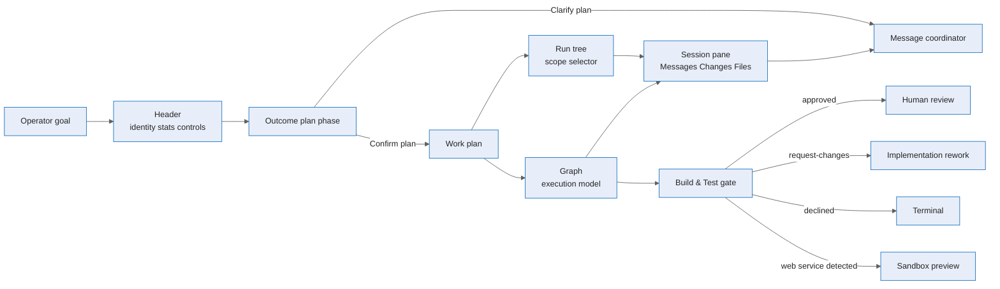

# Orchestration console and gates — Deep Dive

Agentweaver v0.7.12 turns coordinator runs into an operator console and makes validation gates explicit. The wave has three headline pieces:

- the coordinator run page is a four-zone console: header, run tree, graph, and session pane;
- the Outcome plan is a first-class phase in the run tree and graph instead of a detached modal;
- software workflows use a platform-owned Build & Test gate that runs build/tests and registers browser preview when a server is available.

For the operator flow see the [user guide](../experience/orchestration-console-and-gates.md). For HTTP, event, YAML, and editor contracts see the [reference](../reference/orchestration-console-and-gates.md).

## End-to-end flow

## Four-zone console

The page keeps the coordinator graph semantics, but changes how operators navigate the run. `CoordinatorRunPage.tsx` builds a session tree from rendered graph nodes, including planned subtasks as soon as the work plan exists, so the tree mirrors the whole plan rather than only dispatched children (`apps/web/src/pages/CoordinatorRunPage.tsx:1200`, `:1231`). It injects synthetic `Outcome plan` and `Work plan` graph nodes ahead of downstream subtasks, and filters uncommitted assembly nodes while the spec is still being authored so the graph does not imply committed downstream work (`CoordinatorRunPage.tsx:1244`, `:1285`, `:1200`).

The right session pane is `AgentSessionPanel`. It selects either the coordinator run or a child run based on the selected tree item, streams the selected run, and resets tabs/files/diffs when selection changes (`apps/web/src/components/AgentSessionPanel.tsx:1400`, `:1424`). The pane exposes three tabs — **Messages**, **Changes**, and **Files** — plus a single sticky **Message coordinator** composer (`AgentSessionPanel.tsx:1705`, `:1775`). Follow-up messages call `steerCoordinator`; when a child node is selected, the request includes `target_child_run_id`, preserving one input surface while retaining scope (`AgentSessionPanel.tsx:1580`).

## Outcome plan as a phase

`OutcomePlanPanel` is rendered inside the session pane when the selected node is `outcome-plan` (`AgentSessionPanel.tsx:1775`). It seeds from `GET /api/runs/{id}/outcome-spec`, overlays `coordinator.outcome_spec` and `coordinator.outcome_spec.confirmed` events, and treats an early `404` as an expected drafting state with 2-second polling (`apps/web/src/components/OutcomePlanPanel.tsx:160`, `:244`, `:276`, `:328`). Confirming the plan calls `confirmOutcomeSpec`, retries only the short `409 no_pending_gate` race, and reconnects SSE so `coordinator.work_plan` and subtask events arrive without a manual refresh (`OutcomePlanPanel.tsx:339`, `:354`, `:357`).

The UI language is explicitly dispatch-gated: while drafting or awaiting confirmation, the panel states that the coordinator translated the goal into outcome, scope, assumptions, and open questions, and that confirmation dispatches work; after confirmation it reports **Dispatch is unblocked** (`OutcomePlanPanel.tsx:511`, `:519`, `:593`). The page maps the `outcome-plan` tree status from the outcome events and exposes clarification through the same message composer (`CoordinatorRunPage.tsx:1252`, `:1285`; `AgentSessionPanel.tsx:1438`, `:1454`).

## Build & Test gate

The `build_test` node is a real runtime node, not an author-written review prompt. `BuildTestTurnExecutor` supplies one canned prompt that runs the project's build and all tests, rejects compile/test/lint failures, starts a development or preview server for web apps, discovers the actual bound port, verifies it, and calls `start_preview(port=PORT)` (`packages/Agentweaver.AgentRuntime/Workflow/BuildTestTurnExecutor.cs:10`, `:12`, `:17`, `:20`). It emits `workflow.step` status for its logical node, runs a QA agent in a `-build-test` sub-stream, and parses a single verdict line into approved, request-changes, or declined routing (`BuildTestTurnExecutor.cs:82`, `:93`, `:117`, `:153`, `:169`).

The workflow loader accepts `build_test` (`apps/Agentweaver.Api/Workflows/WorkflowDefinitionLoader.cs:213`), the graph mapper renders it as a gate with review role (`WorkflowDtos.cs:148`, `:181`, `:194`), and the generator tells Copilot to emit `build_test` without a prompt, defaulting to `qa-engineer` when omitted (`CopilotWorkflowGenerator.cs:127`, `:137`). The built-in bug-fix and software-delivery catalog workflows now declare `type: build_test`, `label: Build & Test`, and `agent: qa-engineer`, with approved/request-changes/declined edges (`packages/Agentweaver.Squad/Catalog/Resources/workflows/bug_fix.yaml:36`, `:103`; `packages/Agentweaver.Squad/Catalog/Resources/workflows/software_delivery.yaml:35`, `:144`).

## Gate-aware authoring and blueprints

Workflow authors get direct palette entries for RAI Check, Rubberduck Review, Human Review, and Build & Test in `VisualWorkflowEditor` (`apps/web/src/components/VisualWorkflowEditor.tsx:127`, `:137`, `:148`, `:158`, `:590`). Merge and Scribe remain accepted for existing definitions but are filtered out of authorable node types and marked read-only because the platform owns the tail (`apps/web/src/utils/workflowYaml.ts:17`, `:33`; `VisualWorkflowEditor.tsx:123`, `:654`).

Blueprint and workflow generation share `WorkflowGatePromptGuidance`: software workflows must include `build_test` immediately before human review, while blueprint matching must preserve `build_test`, RAI, Rubberduck, and human-review gates and prefer generated specialized workflows when a generic library fit would strip needed gates (`apps/Agentweaver.Api/Workflows/WorkflowGatePromptGuidance.cs:6`, `:27`; `apps/Agentweaver.Api/Blueprints/CopilotBlueprintGenerator.cs:127`, `:129`).

## Source

| Concern | File |
|---|---|
| Four-zone coordinator page, synthetic Outcome plan / Work plan nodes, run tree | `apps/web/src/pages/CoordinatorRunPage.tsx` |
| Session pane tree, Messages / Changes / Files tabs, single coordinator composer | `apps/web/src/components/AgentSessionPanel.tsx` |
| Shared graph node rendering and status labels | `apps/web/src/components/WorkflowGraphPanel.tsx` |
| Outcome plan event/REST merge, polling, confirm/retry flow | `apps/web/src/components/OutcomePlanPanel.tsx` |
| Outcome/work-plan HTTP endpoints | `apps/Agentweaver.Api/Endpoints/CoordinatorEndpoints.cs` |
| Build & Test executor and canned preview activation prompt | `packages/Agentweaver.AgentRuntime/Workflow/BuildTestTurnExecutor.cs` |
| Workflow generator and shared gate guidance | `apps/Agentweaver.Api/Workflows/CopilotWorkflowGenerator.cs`, `WorkflowGatePromptGuidance.cs` |
| Built-in software workflow declarations | `packages/Agentweaver.Squad/Catalog/Resources/workflows/bug_fix.yaml`, `software_delivery.yaml` |
| Visual workflow editor gate authoring | `apps/web/src/components/VisualWorkflowEditor.tsx`, `apps/web/src/utils/workflowYaml.ts` |
| Blueprint gate awareness | `apps/Agentweaver.Api/Blueprints/CopilotBlueprintGenerator.cs` |

## See also

- [Orchestration console and gates — User Guide](../experience/orchestration-console-and-gates.md)
- [Orchestration console and gates — Reference](../reference/orchestration-console-and-gates.md)
- [Coordinator orchestration experience](../experience/coordinator-orchestration.md)
- [Workflow engine](./workflow-engine.md)
- [Sandbox browser preview](./sandbox-browser-preview.md)
