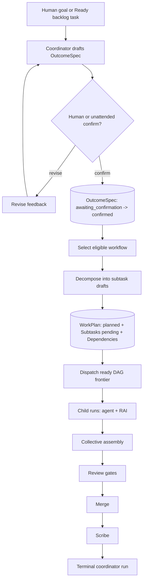
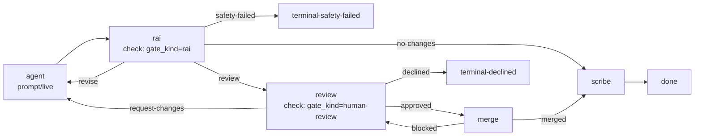
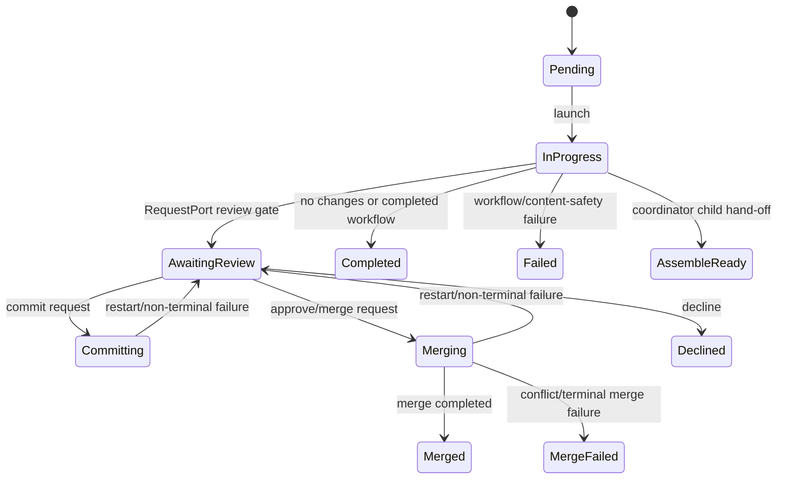
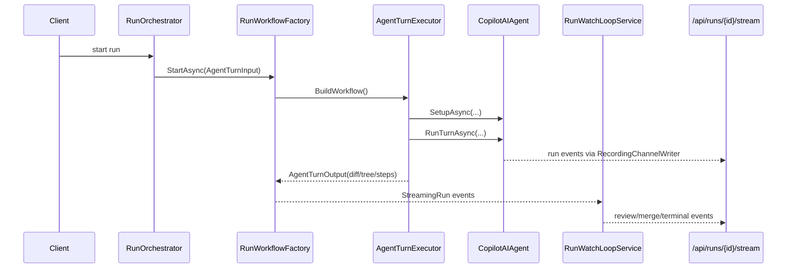

# Orchestration Engine — Deep Dive

## Purpose & Scope

Agentweaver has two related orchestration paths:

1. **Coordinator team orchestration** turns a human goal or Ready backlog task into a confirmed `OutcomeSpec`, a persisted `WorkPlan` DAG, child runs, collective assembly, review, merge, and scribe recording.
2. **Run workflow orchestration** binds a declarative `WorkflowDefinition` onto the live Microsoft Agent Framework (MAF) run graph. The live worker path is `RunWorkflowFactory` → `AgentTurnExecutor` → `CopilotAIAgent`, not `GitHubCopilotAgentRunner`: `RunWorkflowFactory` creates an `AgentTurnExecutor` around a per-run worker agent (`apps/Agentweaver.Api/Runs/RunWorkflowFactory.cs:350-373`), `AgentTurnExecutor` calls `SetupAsync` and `RunTurnAsync` on that agent (`packages/Agentweaver.AgentRuntime/Workflow/AgentTurnExecutor.cs:64-107`), and the production `WorkflowAgentFactory` builds that worker as `CopilotAIAgent` (`packages/Agentweaver.AgentRuntime/Workflow/WorkflowAgentFactory.cs:47-49`).

`GitHubCopilotAgentRunner` is still used by non-MAF, single-prompt runtime calls such as model-assisted casting through the `IAgentRunner` path (`apps/Agentweaver.Api/Infrastructure/AgentweaverAgentRuntime.cs:29-41`, `packages/Agentweaver.AgentRuntime/AgentRunnerDispatcher.cs:17-31`). `FoundryAgentRunner` is also wired only behind that dispatcher: `ModelSource.MicrosoftFoundry` maps to `_foundry.ExecuteAsync(...)` (`packages/Agentweaver.AgentRuntime/AgentRunnerDispatcher.cs:27-32`). Casting and blueprint internals are intentionally summarized here only; see [team-casting.md](team-casting.md).

Verified Foundry gap: the live orchestration path does not currently select a Foundry workflow agent. Standalone/project run submission can store `ModelSource.MicrosoftFoundry` on the `Run` (`apps/Agentweaver.Api/Endpoints/RunEndpoints.cs:44-52`, `apps/Agentweaver.Api/Endpoints/RunEndpoints.cs:65-76`; `apps/Agentweaver.Api/Endpoints/ProjectEndpoints.cs:498-517`, `apps/Agentweaver.Api/Endpoints/ProjectEndpoints.cs:550-567`), and `RunOrchestrator` carries that value into `AgentTurnInput` (`apps/Agentweaver.Api/Runs/RunOrchestrator.cs:108-121`, `apps/Agentweaver.Api/Runs/RunOrchestrator.cs:276-289`; `packages/Agentweaver.AgentRuntime/Workflow/WorkflowMessages.cs:4-23`). From there, `RunWorkflowFactory` uses `IWorkflowAgentFactory.CreateWorkerAgent()` and production DI returns `CopilotAIAgent`; `AgentTurnExecutor` invokes that agent without dispatching on `input.ModelSource` (`apps/Agentweaver.Api/Runs/RunWorkflowFactory.cs:350-373`, `packages/Agentweaver.AgentRuntime/Workflow/WorkflowAgentFactory.cs:47-49`, `packages/Agentweaver.AgentRuntime/Workflow/AgentTurnExecutor.cs:64-107`). Coordinator-originated parent, pickup, and child runs are even narrower: they set `ModelSource = ModelSource.GitHubCopilot` directly (`apps/Agentweaver.Api/Coordinator/CoordinatorRunService.cs:116-128`, `apps/Agentweaver.Api/Coordinator/CoordinatorPickupService.cs:55-65`, `apps/Agentweaver.Api/Coordinator/CoordinatorDispatchService.cs:402-414`).

## Coordinator Flow

The coordinator flow is split into a checkpointed MAF spec/confirmation phase and service-driven dispatch/assembly phases. `CoordinatorWorkflowFactory` builds the first graph as `draft -> await-confirmation RequestPort -> confirm-terminal | revise-loop` (`apps/Agentweaver.Api/Coordinator/CoordinatorWorkflowFactory.cs:17-31`). On confirm, it calls `CoordinatorOrchestratorExecutor.OrchestrateAsync` (`apps/Agentweaver.Api/Coordinator/CoordinatorWorkflowFactory.cs:146-160`).

Key persistence contracts:

- `OutcomeSpec` stores the project/run goal, desired outcome, scope, assumptions, optional clarifying questions, and status (`drafting | awaiting_confirmation | confirmed | declined`) (`apps/Agentweaver.Api/Memory/OutcomeSpec.cs:5-18`).
- `WorkPlan` points back to the `OutcomeSpec`, stores the coordinator run id, optional selected `WorkflowId`, status, assembly stage, and integration branch (`apps/Agentweaver.Api/Memory/WorkPlan.cs:5-35`).
- `Subtask` rows store assigned agent, selected model, phase, advisory isolation, child run id, optional bespoke `AgentCharter`, recovery guidance, and status (`pending | dispatched | running | rai_flagged | assemble_ready | completed | failed`) (`apps/Agentweaver.Api/Memory/Subtask.cs:5-54`).
- `SubtaskDependency` rows encode DAG edges as `SubtaskId -> DependsOnSubtaskId` (`apps/Agentweaver.Api/Memory/SubtaskDependency.cs:5-10`).

`CoordinatorOrchestratorExecutor` is idempotent: if a `WorkPlan` already exists for the coordinator run, it returns without re-planning (`apps/Agentweaver.Api/Coordinator/CoordinatorOrchestratorExecutor.cs:103-130`). Otherwise it selects a workflow, decomposes the confirmed spec, breaks dependency cycles, assigns roster agents/models, persists the plan, and emits `coordinator.work_plan` (`apps/Agentweaver.Api/Coordinator/CoordinatorOrchestratorExecutor.cs:132-167`, `apps/Agentweaver.Api/Coordinator/CoordinatorOrchestratorExecutor.cs:1034-1148`).

After a confirmed plan exists, `CoordinatorRunService` hands off to `CoordinatorDispatchService` when the plan has subtasks (`apps/Agentweaver.Api/Coordinator/CoordinatorRunService.cs:500-535`). Dispatch advances the frontier with `SubtaskFrontier.ReadyPending`, starts child runs, observes terminal events, and moves the plan to assembly when all subtasks settle (`apps/Agentweaver.Api/Coordinator/CoordinatorDispatchService.cs:37-64`, `apps/Agentweaver.Api/Coordinator/CoordinatorDispatchService.cs:222-300`).

## Workflow Model

A workflow is a validated, declarative run graph with:

- `Trigger` (`Manual`, `Heartbeat`, or `Event`) (`apps/Agentweaver.Api/Workflows/WorkflowDefinition.cs:7-17`, `apps/Agentweaver.Api/Workflows/WorkflowDefinition.cs:68-75`).
- `Start`, `Nodes`, `Edges`, and optional board `Stages` (`apps/Agentweaver.Api/Workflows/WorkflowDefinition.cs:151-176`).
- Node fields for `Type`, render `Role`/`Kind`, review `GateKind`, `Agent`, `Prompt`, inline `Charter`, `Target`, `Steps`, and `Branches` (`apps/Agentweaver.Api/Workflows/WorkflowDefinition.cs:77-125`).

The API code has exactly one **built-in** workflow in `BuiltInWorkflows`: `default` (`apps/Agentweaver.Api/Workflows/BuiltInWorkflows.cs:11-28`). Catalog/library workflows are loaded separately by `WorkflowRegistry` alongside the built-in default and project-authored `.agentweaver/workflows` files (`apps/Agentweaver.Api/Workflows/WorkflowRegistry.cs:26-31`, `apps/Agentweaver.Api/Workflows/WorkflowRegistry.cs:103-123`).

The default workflow is code-embedded YAML. It is a behavior-preserving conversion of the original run pipeline: `agent`, `rai`, `review`, `merge`, `scribe`, plus plumbing terminals (`apps/Agentweaver.Api/Workflows/DefaultWorkflowTemplate.cs:23-45`, `apps/Agentweaver.Api/Workflows/DefaultWorkflowTemplate.cs:48-108`).

At runtime, authored workflows are not executed by trusting node ids. The binder classifies nodes by type and gate kind (`apps/Agentweaver.Api/Workflows/NodeClassifier.cs:53-99`), resolves primary executors from pre-built real executor bindings (`apps/Agentweaver.Api/Workflows/NodeExecutorRegistry.cs:5-19`, `apps/Agentweaver.Api/Workflows/NodeExecutorRegistry.cs:22-90`), and expands logical edges into the live MAF graph (`apps/Agentweaver.Api/Workflows/RunWorkflowGraphBinder.cs:46-64`). Unsupported runtime node types fail closed instead of partially wiring (`apps/Agentweaver.Api/Workflows/NodeExecutorRegistry.cs:68-78`).

## Workflow Selection & Triggers

Triggers are enforced during selection. `WorkflowTriggerEvaluator` maps:

- Manual invocation → only `WorkflowTriggerType.Manual`.
- Heartbeat invocation → `WorkflowTriggerType.Heartbeat` plus `Event(TaskAddedToReady)`.

That mapping is explicit in `IsEligible` (`apps/Agentweaver.Api/Workflows/WorkflowTriggerEvaluator.cs:17-47`) and `Filter` preserves candidate ordering (`apps/Agentweaver.Api/Workflows/WorkflowTriggerEvaluator.cs:49-60`).

Coordinator selection flow:

1. Resolve project default as deterministic fallback.
2. Load available workflows.
3. Resolve invocation kind: `RunOrigin.BacklogPickup` becomes `Heartbeat`; everything else is manual (`apps/Agentweaver.Api/Coordinator/CoordinatorOrchestratorExecutor.cs:297-322`).
4. Honor a backlog workflow override only if it is available and trigger-eligible (`apps/Agentweaver.Api/Coordinator/CoordinatorOrchestratorExecutor.cs:210-244`).
5. Filter candidates by `WorkflowTriggerEvaluator`.
6. If only one eligible workflow remains, skip the LLM selector.
7. Otherwise run `IWorkflowSelector`, emit `coordinator.workflow_selected`, and persist the selected id into `WorkPlan.WorkflowId` (`apps/Agentweaver.Api/Coordinator/CoordinatorOrchestratorExecutor.cs:248-274`, `apps/Agentweaver.Api/Coordinator/CoordinatorOrchestratorExecutor.cs:325-348`, `apps/Agentweaver.Api/Coordinator/CoordinatorOrchestratorExecutor.cs:1051-1058`).

The selector itself skips single-workflow projects, builds a process-fit prompt, parses JSON, validates the selected id, and falls back to the default on model/parse errors (`apps/Agentweaver.Api/Coordinator/WorkflowSelector.cs:80-133`, `apps/Agentweaver.Api/Coordinator/WorkflowSelector.cs:157-188`).

`RunWorkflowFactory` repeats trigger-aware workflow resolution for the actual full run graph: it derives manual vs heartbeat from the persisted run origin, checks backlog overrides, prefers the configured default if eligible, otherwise picks the first eligible workflow or fails validation (`apps/Agentweaver.Api/Runs/RunWorkflowFactory.cs:1279-1318`, `apps/Agentweaver.Api/Runs/RunWorkflowFactory.cs:1321-1377`).

## Run Lifecycle & State Machine

`RunOrchestrator.StartRunAsync` creates a worktree, resolves the agent charter, inserts the run as `InProgress`, creates the live stream entry, builds `AgentTurnInput`, starts the workflow through `RunWorkflowFactory`, registers it, and starts the watch loop (`apps/Agentweaver.Api/Runs/RunOrchestrator.cs:76-120`, `apps/Agentweaver.Api/Runs/RunOrchestrator.cs:384-393`). Reserved backlog/coordinator runs follow the same launch pattern after their row already exists (`apps/Agentweaver.Api/Runs/RunOrchestrator.cs:230-300`).

`RunWorkflowFactory.StartAsync` resolves the effective definition for full runs, uses the trimmed child pipeline for coordinator child runs, emits the per-run workflow graph, and starts MAF streaming (`apps/Agentweaver.Api/Runs/RunWorkflowFactory.cs:1217-1237`). Child runs deliberately stop at `AssembleReady` after agent + RAI, with no per-child review/merge/scribe (`apps/Agentweaver.Api/Runs/RunWorkflowFactory.cs:446-460`, `apps/Agentweaver.Api/Runs/RunWatchLoopService.cs:325-370`).

The persisted statuses are `Pending`, `InProgress`, `Completed`, `Failed`, `AwaitingReview`, `Committing`, `Merging`, `Merged`, `Declined`, `MergeFailed`, and child-only `AssembleReady` (`packages/Agentweaver.Domain/RunStatus.cs:3-33`). The watch loop maps MAF request events into `AwaitingReview` and terminal workflow outputs into persisted terminal states and run events (`apps/Agentweaver.Api/Runs/RunWatchLoopService.cs:126-154`, `apps/Agentweaver.Api/Runs/RunWatchLoopService.cs:252-405`).

Run events have two layers. `RecordingChannelWriter` writes every event to the in-memory `RunStreamEntry` and, when configured, through `IRunEventStream` (`apps/Agentweaver.Api/Runs/RunWorkflowFactory.cs:1466-1508`). `IRunEventStream` defines durable append, replay-then-tail subscribe, and completion (`apps/Agentweaver.Api/Infrastructure/IRunEventStream.cs:5-37`); `SqliteRunEventStream` writes to `RunEvents` in `memory.db` before publishing to a bounded live channel (`apps/Agentweaver.Api/Infrastructure/SqliteRunEventStream.cs:12-30`, `apps/Agentweaver.Api/Infrastructure/SqliteRunEventStream.cs:79-110`). The SSE endpoint replays with `Last-Event-ID` through `SubscribeAsync` when no live entry exists, otherwise tails `RunStreamEntry`, and always ends with the `done` event (`apps/Agentweaver.Api/Endpoints/RunEndpoints.cs:415-443`, `apps/Agentweaver.Api/Endpoints/RunEndpoints.cs:455-488`; intended contract in `docs/run-event-stream.md:106-128`).

## Backlog & Heartbeat Pickup

Backlog tasks flow `Backlog -> Ready -> Claimed`. A task records its title, description, ordering key, accountable `CapturedBy`, `CommittedAt`, `ClaimedAt`, `RunId`, and optional `WorkflowOverrideId` (`packages/Agentweaver.Domain/BacklogTask.cs:3-35`).

`IBacklogTaskStore` exposes deterministic top-N Ready reads, workflow override updates while unclaimed, and atomic claim+coordinator-run reservation (`packages/Agentweaver.Domain/IBacklogTaskStore.cs:24-28`, `packages/Agentweaver.Domain/IBacklogTaskStore.cs:66-88`).

`CoordinatorHeartbeatService` is one process-wide background service. Each tick scans active projects, skips unavailable workspaces, reads up to `project.MaxReadyPerHeartbeat` Ready tasks, and passes each to `CoordinatorPickupService` (`apps/Agentweaver.Api/Coordinator/CoordinatorHeartbeatService.cs:10-27`, `apps/Agentweaver.Api/Coordinator/CoordinatorHeartbeatService.cs:70-110`). It also runs the coordinator reconciler sweep after pickup (`apps/Agentweaver.Api/Coordinator/CoordinatorHeartbeatService.cs:141-156`).

`CoordinatorPickupService` builds an unattended coordinator `Run` with `AgentName = "Coordinator"` and `Origin = BacklogPickup`, prepends `use {workflowOverride}` to the goal when present, atomically claims the task and reserves the run, then starts the reserved coordinator run with unattended confirmation (`apps/Agentweaver.Api/Coordinator/CoordinatorPickupService.cs:45-80`, `apps/Agentweaver.Api/Coordinator/CoordinatorPickupService.cs:94-104`).

## Review Policies & Gates

Review policies are per-project overlays, distinct from workflow definitions. A `ReviewPolicy` is a named ordered list of `ReviewStepKind` values: `Rai`, `Rubberduck`, and `HumanReview` (`apps/Agentweaver.Api/ReviewPolicies/ReviewPolicy.cs:3-48`). The default policy is RAI followed by human review; with the default workflow those gates are absorbed rather than duplicated (`apps/Agentweaver.Api/ReviewPolicies/DefaultReviewPolicyTemplate.cs:15-18`, `apps/Agentweaver.Api/ReviewPolicies/DefaultReviewPolicyTemplate.cs:40-48`).

`ReviewPolicyRegistry` loads the built-in default plus project `.agentweaver/review-policies` files, resolves the active project policy by name, and falls back to the safe default when the configured policy is absent (`apps/Agentweaver.Api/ReviewPolicies/ReviewPolicyRegistry.cs:24-39`, `apps/Agentweaver.Api/ReviewPolicies/ReviewPolicyRegistry.cs:64-80`).

`ReviewPolicyComposer` injects missing policy gates immediately before the merge node. RAI can pass, revise back to the producer, or fail safety; human review can approve, revise, or decline (`apps/Agentweaver.Api/ReviewPolicies/ReviewPolicyComposer.cs:27-42`, `apps/Agentweaver.Api/ReviewPolicies/ReviewPolicyComposer.cs:51-90`, `apps/Agentweaver.Api/ReviewPolicies/ReviewPolicyComposer.cs:128-156`). Runtime composition verifies every injected kind has a live executor binding (`apps/Agentweaver.Api/ReviewPolicies/ReviewPolicyComposer.cs:192-212`).

`RunWorkflowFactory` resolves the active review policy, composes it onto the selected workflow, and fails the run submission if composition cannot be made runtime-safe (`apps/Agentweaver.Api/Runs/RunWorkflowFactory.cs:1279-1318`; failure handling in `apps/Agentweaver.Api/Runs/RunOrchestrator.cs:384-418`). Human review itself is a MAF `RequestPort`: the watch loop records `review.requested`, updates the run to `AwaitingReview`, and closes the SSE stream at that gate so the client can act (`apps/Agentweaver.Api/Runs/RunWatchLoopService.cs:126-154`, `apps/Agentweaver.Api/Endpoints/RunEndpoints.cs:473-481`).

## Casting

Casting supplies the roster, agent names, default models, and charters that coordinator decomposition and run execution consume when assigning work to team members. Every confirmed team includes the system agents Scribe, Ralph, Rai, and Coordinator so workflow gates and coordinator responsibilities have identities available (`apps/Agentweaver.Api/Casting/CastingService.cs:904-925`). Full coverage of universes, naming, catalog roles, charters, and squad persistence lives in [team-casting.md](team-casting.md).

## Blueprints

Blueprints seed orchestration defaults: roster roles, workflow set/default workflow, active review policy, sandbox profile, and optional bespoke roles (`apps/Agentweaver.Api/Blueprints/BlueprintDtos.cs:14-27`). Applying a blueprint can materialize generated workflow YAML, sync the workflow registry, and persist the workflow/review-policy defaults that the coordinator later selects from (`apps/Agentweaver.Api/Blueprints/BlueprintService.cs:166-173`, `apps/Agentweaver.Api/Blueprints/BlueprintService.cs:216-250`). For the full blueprint/casting relationship, see [team-casting.md](team-casting.md).

## Extension Points & Gotchas

- **Built-in vs library workflows:** `BuiltInWorkflows` has only `default`; catalog workflows are library workflows loaded by `WorkflowRegistry`, not additional built-ins (`apps/Agentweaver.Api/Workflows/BuiltInWorkflows.cs:11-28`, `docs/workflow-library.md:14-24`).
- **Triggers are hard filters:** Manual starts cannot select heartbeat/event workflows, and heartbeat pickup cannot select manual-only workflows (`apps/Agentweaver.Api/Workflows/WorkflowTriggerEvaluator.cs:35-47`).
- **Child runs are trimmed:** Coordinator child runs execute agent + RAI and stop at `AssembleReady`; review/merge/scribe are collective coordinator phases, not per-child phases (`apps/Agentweaver.Api/Runs/RunWorkflowFactory.cs:1217-1227`, `apps/Agentweaver.Api/Runs/RunWatchLoopService.cs:325-370`).
- **DAG isolation is advisory:** `Subtask.IsolationStrategy` documents intent, but child runs share a worktree; conflict serialization relies on declared file tokens and dependency edges (`apps/Agentweaver.Api/Memory/Subtask.cs:14-23`, `apps/Agentweaver.Api/Coordinator/CoordinatorDispatchService.cs:224-239`, `apps/Agentweaver.Api/Coordinator/CoordinatorDispatchService.cs:992-1038`).
- **Workflow extensions require binder work:** Add node type parsing, classification, executor resolution, and edge expansion. `fan_out`, `fan_in`, `serial`, and `coordinator_composed` are modeled but not wired to runtime executors yet (`apps/Agentweaver.Api/Workflows/NodeExecutorRegistry.cs:68-78`; intended status in `docs/workflow-binder.md:160-173`).
- **Review policy failures fail early:** Runtime composition and workflow start fail closed rather than letting an unbound policy gate weaken RAI/human review guarantees (`apps/Agentweaver.Api/ReviewPolicies/ReviewPolicyComposer.cs:192-212`, `apps/Agentweaver.Api/Runs/RunOrchestrator.cs:384-418`).
- **Registry sync is explicit:** Workflow/review registries cache per project; writing files is not enough unless the service calls `Sync` or the process reloads (`apps/Agentweaver.Api/Workflows/WorkflowRegistry.cs:51-70`, `apps/Agentweaver.Api/ReviewPolicies/ReviewPolicyRegistry.cs:45-56`).
- **SSE has live and durable paths:** Live streams still use `RunStreamEntry`; crash/reconnect replay uses `IRunEventStream` and `RunEvents` (`apps/Agentweaver.Api/Endpoints/RunEndpoints.cs:415-443`, `apps/Agentweaver.Api/Infrastructure/SqliteRunEventStream.cs:26-30`).
- **Comment drift to watch:** Some coordinator comments still describe earlier "decompose + persist only" wave boundaries, while `CoordinatorRunService` and `CoordinatorDispatchService` now perform dispatch/assembly handoff. Prefer the current service flow cited above over those historical wave comments (`apps/Agentweaver.Api/Coordinator/CoordinatorOrchestratorExecutor.cs:22-42`, `apps/Agentweaver.Api/Coordinator/CoordinatorRunService.cs:500-535`).
