# Orchestration Engine — Conceptual Deep Dive

## Purpose & Mental Model

Agentweaver orchestration answers one question: **how does a high-level goal become safe, reviewable, mergeable work performed by a team of agents?**

The engine is intentionally split into two layers:

1. **Coordinator orchestration** decides *what should happen*. It turns an ambiguous goal or backlog item into a confirmed outcome, decomposes that outcome into a dependency-aware plan, assigns work to team members, and assembles the results.
2. **Run workflow orchestration** decides *how each run moves through gates*. It applies a declarative workflow to live execution: agent work, safety review, human review, merge, and scribe recording.

The split matters. Planning and decomposition need durable state, idempotency, and team-level reasoning. Individual run execution needs streaming, review gates, restart loops, and terminal status handling. Keeping those concerns separate lets Agentweaver recover from partial progress without re-asking the model to re-invent the plan.

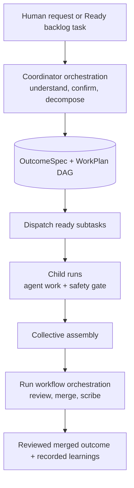

A useful rebuilding rule is: **the coordinator owns intent and coordination; workflows own execution gates.**

Casting and Blueprints feed orchestration with team shape, role charters, workflow defaults, and review-policy defaults. They are summarized here only; the detailed explanation lives in [team-casting.md](team-casting.md).

Live workflow execution is Copilot-backed. Some non-workflow single-prompt paths dispatch through other model runners, but the live workflow worker path does not switch worker implementation based on the run's model source. Rebuilds that need Foundry-backed live workflows add that dispatch point explicitly.

## Core Design Invariants

These invariants are the backbone of the system:

- **Persist decisions before doing work.** The requested outcome and work plan are stored before child runs are launched. Recovery starts from persisted intent, not from chat history.
- **Confirm ambiguity at the boundary.** The coordinator may draft, revise, and ask for confirmation before committing a plan. Once confirmed, later components can assume the outcome is intentional.
- **Use declarative graphs for policy.** Workflows describe nodes, gates, and edges. Runtime code binds those declarations to executable steps and fails closed when a step cannot be safely bound.
- **Advance only the ready frontier.** Subtasks form a DAG. A subtask can run only after its dependencies are complete, so parallelism is safe and deterministic.
- **Separate child work from collective responsibility.** Child runs produce reviewed pieces. The parent coordinator assembles, reviews, merges, and records the combined outcome.
- **Make gates explicit and durable.** Safety, human review, merge, and terminal states are visible run states and stream events, not hidden control flow.
- **Prefer idempotent recovery over clever replay.** If a plan already exists, reuse it. If a run already reached a gate, resume from that gate. If a stream disconnects, replay durable events.

## Coordinator Orchestration

### Problem It Solves

A user often gives Agentweaver a goal, not a task list. The coordinator converts that goal into something a team can execute safely:

- What exact outcome are we trying to produce?
- What assumptions or constraints define success?
- Which parts can run independently?
- Which specialist should own each part?
- What must be reviewed before changes merge?

Without this layer, every agent run would independently interpret the same broad request. That leads to duplicated work, conflicting edits, and unclear ownership.

### OutcomeSpec: The Intent Contract

The first durable artifact is the **OutcomeSpec**. Conceptually, it is the contract between the requester and the system.

It captures:

- the original goal,
- the desired outcome,
- scope and exclusions,
- assumptions,
- clarifying questions or revision feedback,
- and whether the outcome is still being drafted, awaiting confirmation, confirmed, or declined.

The important design choice is that confirmation happens before decomposition is treated as authoritative. The coordinator can draft an interpretation, receive revision feedback, and loop until the requester or unattended policy confirms it.

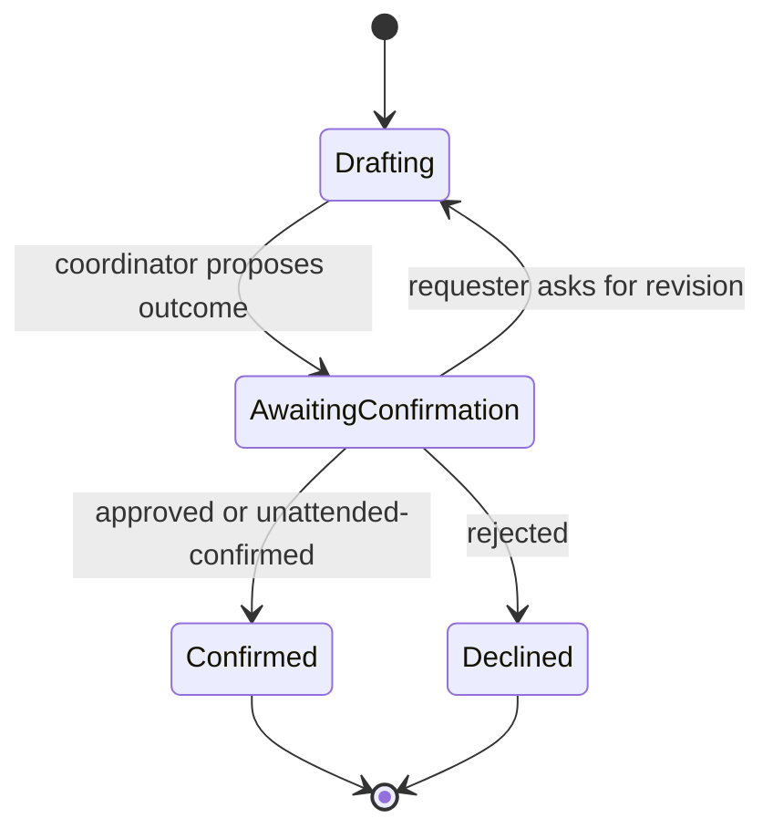

Rebuild guidance: treat the OutcomeSpec as the **source of truth for intent**. Do not let individual worker agents reinterpret the original request independently once the spec is confirmed.

### WorkPlan: The Execution Contract

After confirmation, the coordinator creates a **WorkPlan**. The WorkPlan is the execution contract for the parent coordinator run.

It stores:

- the confirmed OutcomeSpec it implements,
- the selected workflow,
- subtask records,
- dependency edges between subtasks,
- assembly state,
- and any integration branch or coordination metadata.

Each subtask includes its assigned agent, model choice, charter/context, isolation intent, status, child run id, and any recovery guidance.

The plan is a DAG because ordering is a correctness constraint. If subtask B depends on subtask A, B should not start merely because an agent is free. This allows safe parallelism: every tick can dispatch all currently-ready nodes while preserving required sequencing.

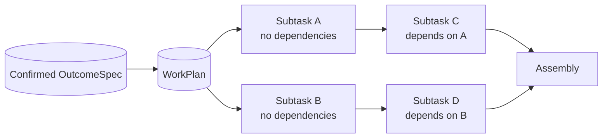

Rebuild guidance: store the plan before dispatch. If the coordinator crashes after planning but before child runs start, it should resume from the persisted WorkPlan rather than ask a model to decompose again.

### Coordinator Control Flow

The coordinator flow has two phases:

1. **Model-assisted planning phase** — draft and confirm the OutcomeSpec, select a workflow, decompose the work, and persist the WorkPlan.
2. **Service-driven execution phase** — dispatch ready subtasks, watch child runs, assemble results, and advance the parent run through review and merge gates.

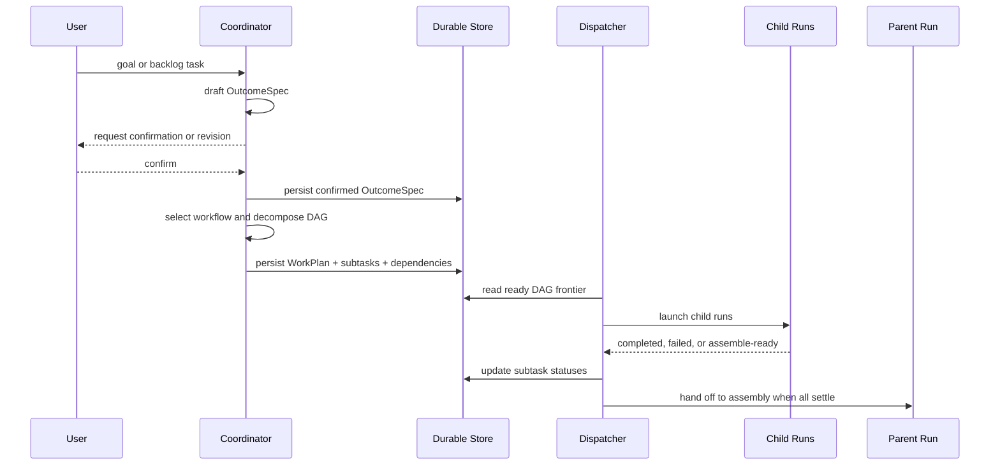

The coordinator is designed to be idempotent. If it is asked to orchestrate a run that already has a WorkPlan, it does not create a second plan. That invariant prevents duplicate child runs and conflicting DAGs.

### Decomposition Logic

A good decomposition algorithm should produce subtasks that are:

- **owned** by one agent,
- **bounded** enough to complete independently,
- **ordered** by explicit dependencies,
- **labeled** with intended isolation or file ownership,
- and **recoverable** with enough guidance to retry or inspect failures.

Agentweaver treats dependency edges and file/isolation hints as coordination data. The dependency graph is the hard ordering rule. Isolation hints are advisory: they help avoid conflicts and guide dispatch, but they are not a substitute for merge conflict handling or review.

Cycle breaking is essential. Model-generated plans can accidentally create circular dependencies. A production coordinator should detect cycles and either remove weak edges, ask for clarification, or fail before dispatch. Dispatching a cyclic plan would deadlock because no frontier can become ready.

### Dispatch and Assembly

The dispatcher repeatedly asks: **which pending subtasks have all dependencies completed?** Those subtasks form the ready frontier.

For each ready subtask, it launches a child run in its own git worktree and branch. Child runs are intentionally trimmed: they perform agent work, then stop at an assemble-ready boundary. They do not each perform RAI, human review, merge, or scribe. Those are parent-level responsibilities because the user reviews the combined outcome, not a pile of isolated fragments.

When a child reaches assemble-ready/completed, the dispatcher rebuilds the coordinator integration branch from the successful child branches in dependency order. Dependents are then branched from that integration branch, so they can read files produced by their prerequisites without concurrent siblings sharing one mutable git index.

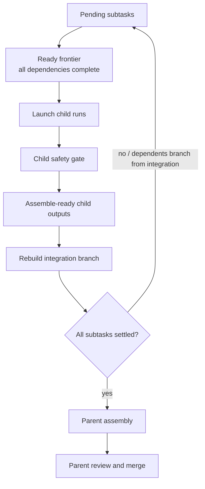

Assembly is where the coordinator turns independent child outputs into one coherent result. This is also where conflicts, missing pieces, and cross-subtask inconsistencies should be detected before the parent enters review and merge gates.

Where this lives:

- `apps/Agentweaver.Api/Coordinator/`
- `apps/Agentweaver.Api/Memory/`

## Workflows and Trigger Evaluation

### Workflow as Policy Graph

A workflow is not just a list of functions. It is a policy graph that describes how a run should progress through work, checks, review, merge, and terminal states.

A workflow definition answers:

- What starts the graph?
- Which node performs agent work?
- Which gates can send work back for revision?
- Which failures are terminal?
- Which path means success?
- Which trigger types are allowed to use this workflow?

The default conceptual workflow is:

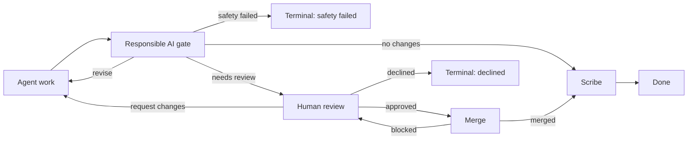

The important idea is that loops are first-class. Safety or review can return work to the producer. Merge can return to review if blocked. Terminal failures are explicit exits, not exceptions swallowed by the runtime.

### Trigger Eligibility

Triggers protect workflows from being used in the wrong context.

Agentweaver distinguishes these invocation modes conceptually:

- **Manual** — a user starts a run directly.
- **Heartbeat** — the background coordinator picks up ready backlog work.
- **Event** — a workflow reacts to a named system event, such as a task becoming ready.

Selection must filter by trigger before model selection or defaults are applied. A manual-only workflow should not run unattended from the heartbeat loop. A heartbeat-only workflow should not be chosen by a direct user run unless explicitly allowed.

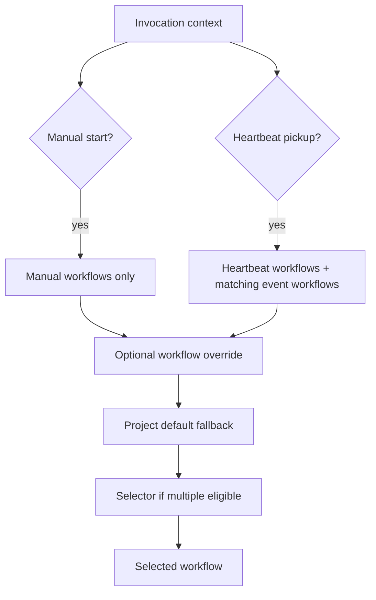

A backlog task may request a workflow override, but the override is only honored if it exists and is trigger-eligible. This preserves safety: metadata on a backlog item cannot force a manual-only workflow to run unattended.

### Workflow Selection Logic

The selection order is deliberately conservative:

1. Load built-in, catalog/library, and project-authored workflows.
2. Determine invocation kind from the run origin.
3. Filter out trigger-ineligible workflows.
4. Honor a valid override if present.
5. Prefer the configured project default when eligible.
6. If exactly one workflow remains, use it without model help.
7. If several remain, ask the selector to choose the best process fit.
8. If selector output is invalid or parsing fails, fall back safely rather than inventing a workflow id.

This pattern limits model authority. The model may choose among safe candidates, but it does not get to bypass trigger filtering or runtime binding.

### Binding Declarative Nodes to Runtime Execution

A workflow file describes intent. The runtime must bind that intent to concrete executors.

The binder should:

- classify nodes by type and gate kind,
- resolve each node to a known executor,
- expand logical edges into the live execution graph,
- verify all required review-policy gates have bindings,
- and fail closed if a required node cannot be executed safely.

Failing closed is a security and correctness property. A workflow that asks for a safety gate but cannot bind one should not silently skip safety. Likewise, a custom node type should not become a no-op merely because the binder does not understand it.

Some workflow shapes, such as fan-out/fan-in style nodes, are design-level extension points: the graph model can express them, and the binder is the place where their executors are resolved. They give the system room to grow more complex execution patterns without changing the surrounding contract.

Where this lives:

- `apps/Agentweaver.Api/Workflows/`
- `docs/workflow-library.md`
- `docs/workflow-binder.md`

## Run Lifecycle

### What a Run Represents

A run is the durable unit of execution. Conceptually it bundles:

- a project and workspace/worktree,
- the assigned agent and charter/context,
- the selected workflow,
- the run origin,
- live and durable event streams,
- and a persisted status.

A run can be started directly by a user, reserved by backlog pickup, created as a coordinator parent, or launched as a coordinator child. All forms should converge on the same lifecycle machinery so status, streaming, review, and recovery behave consistently.

### Parent, Child, and Pickup Runs

Agentweaver uses run origin to preserve intent:

- **Manual runs** are user-started and usually go through the full workflow.
- **Coordinator parent runs** own the team-level plan, assembly, review, merge, and scribe phases.
- **Coordinator child runs** execute one subtask and stop at the assemble-ready boundary after agent work.
- **Backlog pickup runs** are coordinator runs created by the heartbeat loop for unattended ready tasks.

The key difference is not the storage shape; it is the responsibility boundary. Child runs should not merge independently because they are fragments of the parent outcome. Parent runs should not redo child work because they coordinate, assemble, and gate the whole result.

### State Machine

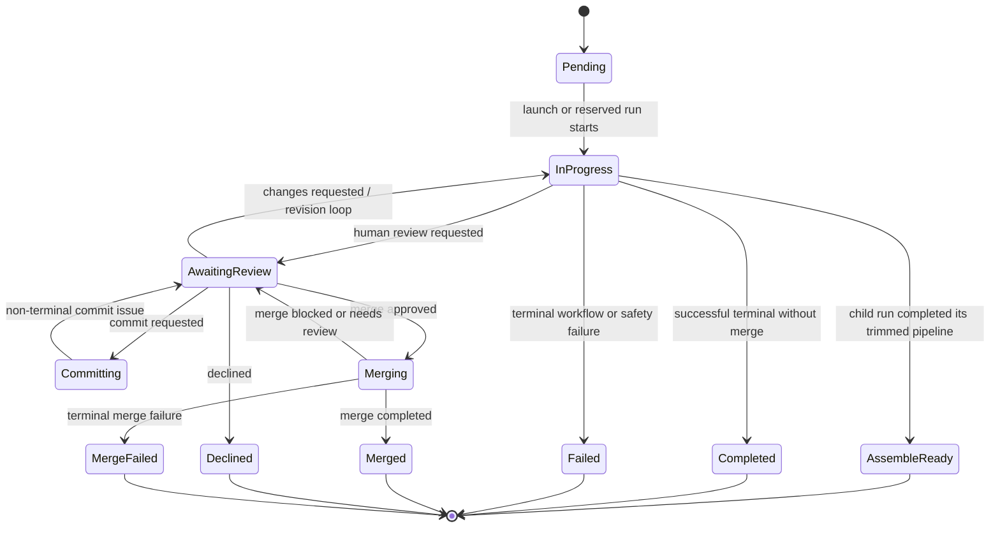

The state machine is designed for externally visible gates. When a human review node is reached, the run becomes `AwaitingReview` and the client can act. When merge is requested, the run becomes `Merging`. These are not merely internal events; they are durable states used by clients, recovery, and monitoring.

### Runtime Sequence

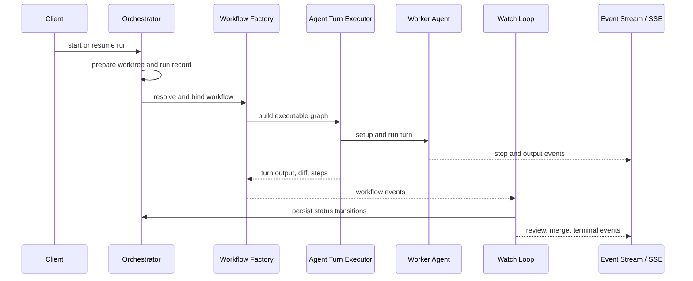

The watch loop translates live runtime events into persisted run state. This keeps state transitions centralized. The agent produces work; the workflow emits events; the watch loop decides what those events mean for durable status and client-visible stream completion.

### Event Streaming

Run events have two purposes:

1. **Live feedback** — clients can see what the agent is doing now.
2. **Recovery and reconnect** — clients can replay what happened if they disconnect or the process restarts.

The conceptual design is replay-then-tail:

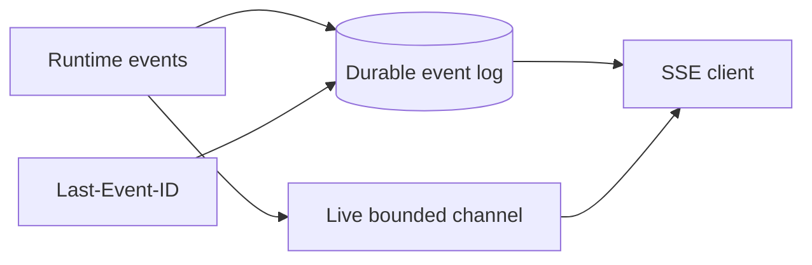

A robust rebuild should write events durably before publishing them live. Then a reconnecting client can provide the last seen event id, replay missed events from storage, and continue tailing live updates. The stream should end with an explicit done marker so clients do not infer completion from connection closure alone.

Where this lives:

- `apps/Agentweaver.Api/Runs/`
- `packages/Agentweaver.AgentRuntime/Workflow/`
- `apps/Agentweaver.Api/Infrastructure/`
- `docs/run-event-stream.md`

## Backlog and Heartbeat Pickup

### Problem It Solves

The backlog lets Agentweaver accept work before an agent is actively assigned. The heartbeat loop turns ready backlog items into unattended coordinator runs.

This separates **commitment** from **execution**:

- A task can be captured and ordered in the backlog.
- Later, when it becomes ready and workspace conditions allow, the system claims it.
- Claiming creates or reserves exactly one coordinator run.
- That coordinator run executes the same planning and workflow path as a manually-started coordinator run, but with unattended confirmation rules.

### Backlog Task Lifecycle

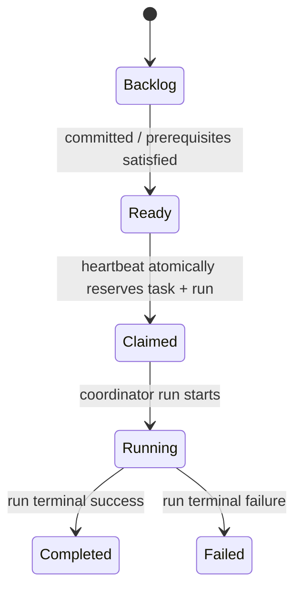

The critical operation is the transition from Ready to Claimed. It must be atomic. If two heartbeat ticks or processes see the same ready task, only one should reserve the task and create the coordinator run. Otherwise, the system would execute duplicate plans for the same backlog item.

### Heartbeat Loop

The heartbeat loop is intentionally simple and repeatable:

1. Scan active projects.
2. Skip projects whose workspace is unavailable.
3. Read a deterministic top-N set of Ready tasks per project.
4. For each task, attempt an atomic claim and run reservation.
5. Start the reserved coordinator run with unattended confirmation.
6. Run reconciliation to pick up stalled or partially-progressed coordinator work.

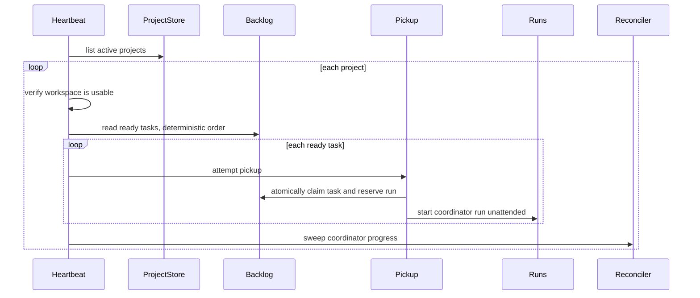

Workflow overrides are allowed at the backlog task level, but they are still filtered by trigger eligibility. The pickup service may prepend or carry override intent into the coordinator goal, but it cannot bypass workflow safety rules.

### Why Heartbeat Instead of Immediate Execution?

A heartbeat loop gives the system backpressure and recovery:

- Projects can limit how many ready tasks are picked up per tick.
- Workspace availability can be checked before work starts.
- If the process crashes, unclaimed Ready tasks remain visible for the next tick.
- Claimed tasks can be reconciled against their reserved runs.
- The same mechanism can eventually support multiple workers if claim semantics stay atomic.

Where this lives:

- `apps/Agentweaver.Api/Coordinator/`
- `packages/Agentweaver.Domain/`

## Review Policies, Gates, and Merge

### Review Policy as a Safety Overlay

Workflows define the shape of execution. Review policies define which review gates must be present for a project.

This separation is useful because teams often need the same workflow structure with different gate requirements. For example, one project requires only Responsible AI plus human review; another adds a rubberduck review before human approval.

A review policy is an ordered list of review steps. Conceptually common steps are:

- **Responsible AI review** — checks safety and returns pass, revision request, or terminal failure.
- **Rubberduck review** — an automated sanity or explanation pass.
- **Human review** — asks a person to approve, request changes, or decline.

The composer injects missing required gates before merge. It should not duplicate gates already present in a workflow, and it should fail if a required gate has no runtime executor.

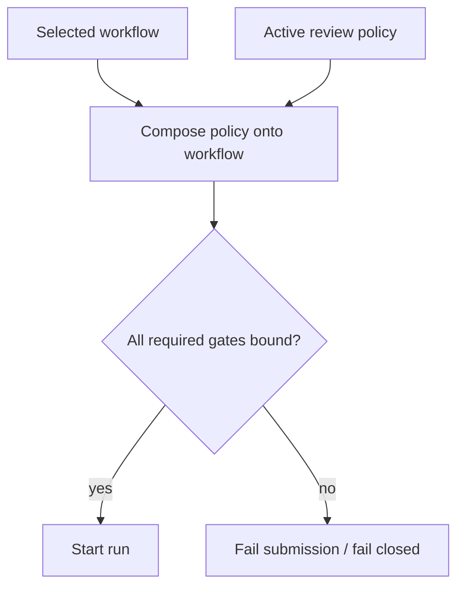

### Human Review as a Pause Point

Human review is not just an event; it is a pause in the workflow. The runtime emits a review request, the watch loop persists the run as awaiting review, and the stream can close cleanly while the system waits for user action.

The user action then chooses a path:

- approve and continue to merge,
- request changes and loop back to agent work,
- or decline and terminate.

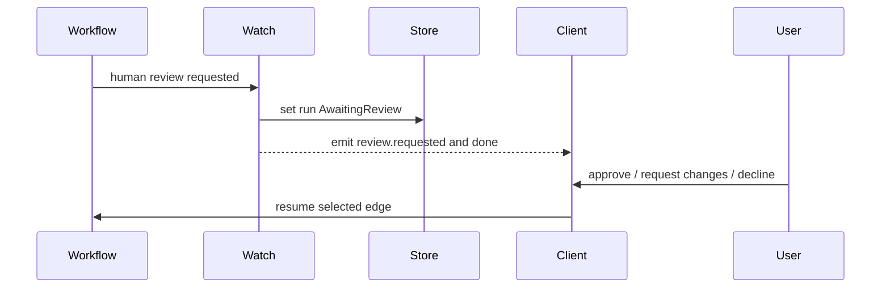

This design keeps review durable and externally controllable. A browser tab can close while a run waits for review; the run state still tells the next client exactly what is needed.

### Merge Gate

Merge is a gate because generated work can be correct but not mergeable. The merge step surfaces conflicts, blocked policies, or repository constraints.

A healthy merge gate should distinguish:

- **blocked but recoverable** — return to review or revision with a clear reason,
- **merged** — terminal success and scribe recording,
- **terminal merge failure** — cannot proceed without manual intervention.

The parent coordinator run owns merge for coordinated work. Child runs should not merge because they do not know whether sibling subtasks are complete or consistent.

### Scribe

Scribe is the post-outcome memory step. It records what happened, decisions, learnings, or trace information after the run reaches the appropriate terminal path. Conceptually, Scribe turns execution history into reusable project memory.

Where this lives:

- `apps/Agentweaver.Api/ReviewPolicies/`
- `apps/Agentweaver.Api/Runs/`

## Recovery and Failure Handling

Agentweaver recovery is built from several smaller guarantees rather than one global transaction.

### Idempotent Planning

If a coordinator run already has a WorkPlan, the coordinator should not decompose again. This prevents duplicate children and preserves the original confirmed intent.

### Atomic Pickup

Backlog pickup should claim the task and reserve the run in one atomic operation. If reservation fails, the task should not appear successfully claimed without an executable run.

### Durable Events

Events should be appended durably before live publication. This lets clients reconnect and lets operators inspect what happened after a crash.

### Watch-Loop Status Projection

The runtime graph emits events. The watch loop projects those events into durable statuses. Keeping this projection centralized prevents every executor from inventing its own status semantics.

### Frontier-Based Dispatch

The dispatcher can be rerun safely because it reads persisted subtask states and dependencies. Already-dispatched or completed subtasks are skipped; newly-ready pending subtasks can be launched.

### Review and Merge Re-entry

Review and merge failures often are not terminal. A requested change loops back to agent work. A blocked merge can return to review. Only explicit terminal paths should mark the run failed, declined, merged, or merge-failed.

### Reconciliation

A reconciler should periodically compare plans, subtasks, child runs, and parent status. Its job is to notice mismatches such as:

- a subtask marked running whose child run reached a terminal state,
- a plan whose all subtasks are assemble-ready but parent assembly has not started,
- a claimed backlog task whose reserved run was not launched,
- or a coordinator parent waiting on children that no longer exist.

The reconciler is what turns persisted state into eventual progress after crashes or partial failures.

## Casting and Blueprints Integration

Casting provides the roster: agent names, role charters, default models, and required system agents such as Coordinator, Scribe, Ralph, and Rai. Orchestration consumes this roster when assigning subtasks and binding review responsibilities.

Blueprints provide defaults: initial roster, workflow set, default workflow, review policy, sandbox profile, and optional bespoke roles. Applying a blueprint can materialize workflow definitions and persist defaults that later coordinator runs select from.

The key boundary is that Casting and Blueprints define **who is available** and **what defaults apply**. The orchestration engine decides **what work is needed now** and **how that work moves through gates**.

See [team-casting.md](team-casting.md) for the detailed model.

Where this lives:

- `apps/Agentweaver.Api/Casting/`
- `apps/Agentweaver.Api/Blueprints/`

## Extension Points and Gotchas

- **Do not treat workflow ids as executable code.** A workflow must be parsed, classified, bound to known executors, and validated before it can run.
- **Trigger filtering is a hard safety boundary.** Overrides and selector output should never make an ineligible workflow eligible.
- **Child pipelines are intentionally shorter.** Per-child review, merge, and scribe would fragment responsibility. Keep those phases at the parent level for coordinated work.
- **Advisory isolation is not a lock.** File ownership hints help dispatch and planning, but dependency edges, review, and merge conflict handling still matter.
- **Review policy composition must fail closed.** Missing safety or human-review bindings should prevent run start rather than silently weaken review guarantees.
- **Registry sync matters.** If workflow or review-policy files are cached, changing files on disk is not enough unless the registry refreshes or the process reloads.
- **Live streams and durable streams serve different users.** Live channels make the UI responsive; durable event logs make reconnect and crash recovery possible. Keep both.
- **Comments can drift from behavior.** Prefer the persisted contracts and current service flow over historical comments when validating orchestration behavior.

## Rebuilding Checklist

If you were rebuilding Agentweaver orchestration from scratch, implement in this order:

1. Durable run records, statuses, and event log.
2. Workflow definitions with trigger filtering and fail-closed binding.
3. Agent execution wrapped by a watch loop that projects events into statuses.
4. Review policies composed onto workflows before merge.
5. OutcomeSpec confirmation flow.
6. WorkPlan, subtask, and dependency persistence.
7. Frontier-based child dispatch and assemble-ready handoff.
8. Parent assembly, review, merge, and scribe phases.
9. Backlog Ready-to-Claimed atomic pickup.
10. Heartbeat scanning and reconciliation.
11. Casting and Blueprint defaults feeding coordinator selection.

The central design principle is simple: **persist intent, execute only eligible work, make every gate explicit, and recover by replaying durable state rather than reinterpreting the original request.**
