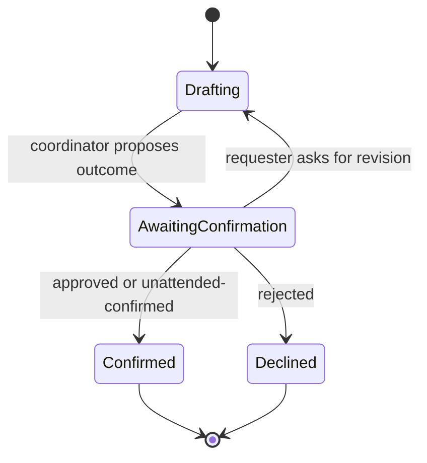
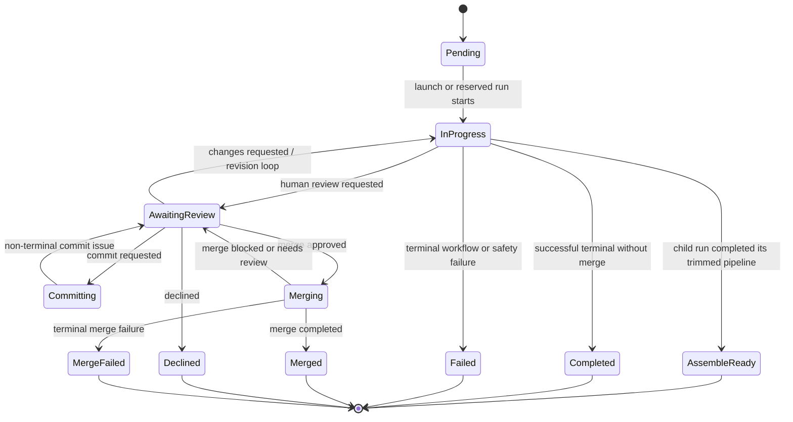

# Orchestration Engine — Conceptual Deep Dive

## Purpose & Mental Model

Agentweaver orchestration answers one question: **how does a high-level goal become safe, reviewable, mergeable work performed by a team of agents?**

The engine is intentionally split into two layers:

1. **Coordinator orchestration** decides *what should happen*. It turns an ambiguous goal or backlog item into a confirmed outcome, decomposes that outcome into a dependency-aware plan, assigns work to team members, and assembles the results.
2. **Run workflow orchestration** decides *how each run moves through gates*. It applies a declarative workflow to live execution: agent work, safety review, human review, merge, and scribe recording.

The split matters. Planning and decomposition need durable state, idempotency, and team-level reasoning. Individual run execution needs streaming, review gates, restart loops, and terminal status handling. Keeping those concerns separate lets Agentweaver recover from partial progress without re-asking the model to re-invent the plan.

A useful rebuilding rule is: **the coordinator owns intent and coordination; workflows own execution gates.**

Casting and Blueprints feed orchestration with team shape, role charters, and workflow defaults. Blueprint validation accepts only `review_policy: default`; this is not a configurable project review-policy overlay. They are summarized here only; the detailed explanation lives in [team-casting.md](team-casting.md).

Live workflow execution and non-workflow single-prompt paths use the Copilot SDK. The
live workflow worker path does not switch worker implementation based on the run's model
source; custom providers are configured through the SDK.

## Core Design Invariants

These invariants are the backbone of the system:

- **Persist decisions before doing work.** The requested outcome and work plan are stored before child runs are launched. Recovery starts from persisted intent, not from chat history.
- **Confirm ambiguity at the boundary.** The coordinator may draft, revise, and ask for confirmation before committing a plan. Once confirmed, later components can assume the outcome is intentional.
- **Use declarative graphs for policy.** Workflows describe nodes, gates, and edges. Runtime code binds those declarations to executable steps and fails closed when a step cannot be safely bound.
- **Advance only the ready frontier.** Subtasks form a DAG. A subtask can run only after its dependencies are complete, so parallelism is safe and deterministic.
- **Separate child work from collective responsibility.** Child runs produce pieces ready for assembly, not independently reviewed pieces. The parent coordinator assembles, reviews, merges, and records the combined outcome.
- **Make gates explicit and durable.** Safety, human review, merge, and terminal states are visible run states and stream events, not hidden control flow.
- **Prefer idempotent recovery over clever replay.** If a plan already exists, reuse it. If a run already reached a gate, resume from that gate. If a stream disconnects, replay durable events.

## Coordinator Orchestration

### Problem It Solves

A user often gives Agentweaver a goal, not a task list. The coordinator converts that goal into something a team can execute safely:

- What exact outcome are we trying to produce?
- What assumptions or constraints define success?
- Which parts can run independently?
- Which specialist should own each part?
- What must be reviewed before changes merge?

Without this layer, every agent run would independently interpret the same broad request. That leads to duplicated work, conflicting edits, and unclear ownership.

### OutcomeSpec: The Intent Contract

The first durable artifact is the **OutcomeSpec**. Conceptually, it is the contract between the requester and the system.

It captures:

- the original goal,
- the desired outcome,
- scope and exclusions,
- assumptions,
- clarifying questions or revision feedback,
- and whether the outcome is still being drafted, awaiting confirmation, confirmed, or declined.

The important design choice is that confirmation happens before decomposition is treated as authoritative. The coordinator can draft an interpretation, receive revision feedback, and loop until the requester or unattended policy confirms it.

Because the confirmed OutcomeSpec is the source of truth for intent, it — not the later decomposition — is where the work's **breadth** originates. When the drafter frames the outcome it reads the project's team roster and honors the breadth the goal explicitly asks for: a full-lifecycle "from the initial idea through to a working app" goal yields an outcome whose scope enumerates the discovery, PM, design, and build deliverables the goal warrants (filtered to what the team can actually produce), while a narrow goal stays lean. Downstream workflow selection and decomposition then faithfully honor that confirmed breadth, so if the outcome is narrowed at drafting time, the whole PM/discovery half is silently dropped everywhere after it. See [How drafting works](./coordinator-internals.md#how-drafting-works) for the roster-awareness and scope-breadth guidance that shapes the draft.

```mermaid
stateDiagram-v2
    [*] --> Drafting
    Drafting --> AwaitingConfirmation: coordinator proposes outcome
    AwaitingConfirmation --> Drafting: requester asks for revision
    AwaitingConfirmation --> Confirmed: approved or unattended-confirmed
    AwaitingConfirmation --> Declined: rejected
    Confirmed --> [*]
    Declined --> [*]
```

Rebuild guidance: treat the OutcomeSpec as the **source of truth for intent**. Do not let individual worker agents reinterpret the original request independently once the spec is confirmed.

### WorkPlan: The Execution Contract

After confirmation, the coordinator creates a **WorkPlan**. The WorkPlan is the execution contract for the parent coordinator run.

It stores:

- the confirmed OutcomeSpec it implements,
- the selected workflow,
- subtask records,
- dependency edges between subtasks,
- assembly state,
- and any integration branch or coordination metadata.

Each subtask includes its assigned agent, model choice, charter/context, isolation intent, status, child run id, and any recovery guidance.

The plan is a DAG because ordering is a correctness constraint. If subtask B depends on subtask A, B should not start merely because an agent is free. This allows safe parallelism: every tick can dispatch all currently-ready nodes while preserving required sequencing.

Rebuild guidance: store the plan before dispatch. If the coordinator crashes after planning but before child runs start, it should resume from the persisted WorkPlan rather than ask a model to decompose again.

### Coordinator Control Flow

The coordinator flow has two phases:

1. **Model-assisted planning phase** — draft and confirm the OutcomeSpec, select a workflow, decompose the work, and persist the WorkPlan.
2. **Service-driven execution phase** — dispatch ready subtasks, watch child runs, assemble results, and advance the parent run through review and merge gates.

The coordinator is designed to be idempotent. If it is asked to orchestrate a run that already has a WorkPlan, it does not create a second plan. That invariant prevents duplicate child runs and conflicting DAGs.

### Decomposition Logic

A good decomposition algorithm should produce subtasks that are:

- **owned** by one agent,
- **bounded** enough to complete independently,
- **ordered** by explicit dependencies,
- **labeled** with intended isolation or file ownership,
- and **recoverable** with enough guidance to retry or inspect failures.

Agentweaver treats dependency edges and file/isolation hints as coordination data. The dependency graph is the hard ordering rule. Isolation hints are advisory: they help avoid conflicts and guide dispatch, but they are not a substitute for merge conflict handling or review.

Cycle breaking is essential. Model-generated plans can accidentally create circular dependencies. A production coordinator should detect cycles and either remove weak edges, ask for clarification, or fail before dispatch. Dispatching a cyclic plan would deadlock because no frontier can become ready.

### Dispatch and Assembly

The dispatcher repeatedly asks: **which pending subtasks have all dependencies completed?** Those subtasks form the ready frontier.

For each ready subtask, it launches a child run with an isolated working tree and output branch. Child runs are intentionally trimmed: they perform agent work, then stop at an assemble-ready boundary. They do not each perform RAI, human review, merge, or scribe. Those are parent-level responsibilities because the user reviews the combined outcome, not a pile of isolated fragments.

When a child reaches assemble-ready/completed, the dispatcher rebuilds the coordinator integration branch from the successful child branches in dependency order. Dependents are then branched from that integration branch, so they can read files produced by their prerequisites without concurrent siblings sharing one mutable git index.

Assembly is where the coordinator turns independent child outputs into one coherent result. This is also where conflicts, missing pieces, and cross-subtask inconsistencies should be detected before the parent enters review and merge gates.

The child graph branches on `AgentTurnOutput.TerminalFailureReason`: a clean turn reaches `child-assemble-ready`, while a typed failure reaches `child-turn-failed` (`apps/Agentweaver.Api/Runs/RunWorkflowFactory.cs:788–814`). “All subtasks settled” is not equivalent to “all outputs eligible for assembly”; a failed child is not an approved aggregate input.

Where this lives:

- `apps/Agentweaver.Api/Coordinator/`
- `apps/Agentweaver.Api/Memory/`

## Workflows and Trigger Evaluation

### Workflow as Policy Graph

A workflow is not just a list of functions. It is a policy graph that describes how a run should progress through work, checks, review, merge, and terminal states.

A workflow definition answers:

- What starts the graph?
- Which node performs agent work?
- Which gates can send work back for revision?
- Which failures are terminal?
- Which path means success?
- Which event or schedule declarations can initiate backlog work for this workflow?

The shared illustration describes the standalone built-in workflow, not mandatory collective assembly policy. Its current success path is `agent -> rai -> review -> merge -> push-pr -> scribe -> done` (`apps/Agentweaver.Api/Workflows/DefaultWorkflowTemplate.cs:42–161`); child runs bypass this graph.

The important idea is that loops are first-class. Safety or review can return work to the producer. Merge can return to review if blocked. Terminal failures are explicit exits, not exceptions swallowed by the runtime.

### Invocation context and event triggers

Manual and heartbeat origins are recorded as invocation context. They do not remove valid workflows from the selector candidate set. Event and schedule triggers are evaluated before the normal backlog and coordinator pickup path. A requested override is used only when it resolves to a valid, bindable workflow.

### Workflow Selection Logic

The selection order is deliberately conservative:

1. Load built-in, catalog/library, and project-authored workflows.
2. Record invocation kind from the run origin.
3. Honor a valid override if present.
4. Order the configured project default first without short-circuiting automatic selection.
5. If exactly one workflow remains, use it without model help.
6. If several remain, ask the selector to choose the best process fit.
7. If selector output is invalid or parsing fails, fall back safely rather than inventing a workflow id.

This pattern limits model authority. The model may choose among safe candidates, but it cannot bypass validation or runtime binding.

See [workflow selection](workflow-selection.md) for override events, selector retry/fallback behavior, and the post-decomposition Build & Test compatibility check. That check can choose a platform software workflow when automatic project candidates cannot cover code-producing work; an explicit workflow lacking Build & Test is honored with a warning.

### Binding Declarative Nodes to Runtime Execution

A workflow file describes intent. The runtime must bind that intent to concrete executors.

The binder should:

- classify nodes by type and gate kind,
- resolve each node to a known executor,
- expand logical edges into the live execution graph,
- verify every workflow-declared gate and transition has a binding,
- and fail closed if a required node cannot be executed safely.

Failing closed is a security and correctness property. A workflow that asks for a safety gate but cannot bind one should not silently skip safety. Likewise, a custom node type should not become a no-op merely because the binder does not understand it.

Some workflow shapes, such as fan-out/fan-in style nodes, are design-level extension points: the graph model can express them, and the binder is the place where their executors are resolved. They give the system room to grow more complex execution patterns without changing the surrounding contract.

Where this lives:

- `apps/Agentweaver.Api/Workflows/`
- `docs/workflow-library.md`
- `docs/workflow-binder.md`

## Run Lifecycle

### What a Run Represents

A run is the durable unit of execution. Conceptually it bundles:

- a project and workspace/worktree,
- the assigned agent and charter/context,
- the selected workflow,
- the run origin,
- live and durable event streams,
- and a persisted status.

A run can be started directly by a user, reserved by backlog pickup, created as a coordinator parent, or launched as a coordinator child. All forms should converge on the same lifecycle machinery so status, streaming, review, and recovery behave consistently.

### Parent, Child, and Pickup Runs

Agentweaver uses run origin to preserve intent:

- **Manual runs** are user-started and usually go through the full workflow.
- **Coordinator parent runs** own the team-level plan, assembly, review, merge, and scribe phases.
- **Coordinator child runs** execute one subtask and stop at the assemble-ready boundary after agent work.
- **Backlog pickup runs** are coordinator runs created by the heartbeat loop for unattended ready tasks.

The key difference is not the storage shape; it is the responsibility boundary. Child runs should not merge independently because they are fragments of the parent outcome. Parent runs should not redo child work because they coordinate, assemble, and gate the whole result.

### State Machine

```mermaid
stateDiagram-v2
    [*] --> Pending
    Pending --> InProgress: launch or reserved run starts
    InProgress --> AssembleReady: child run completed its trimmed pipeline
    InProgress --> AwaitingReview: human review requested
    AwaitingReview --> InProgress: changes requested / revision loop
    AwaitingReview --> Committing: commit requested
    AwaitingReview --> Merging: merge approved
    AwaitingReview --> Declined: declined
    Committing --> AwaitingReview: non-terminal commit issue
    Merging --> AwaitingReview: merge blocked or needs review
    Merging --> Merged: merge completed
    Merging --> MergeFailed: terminal merge failure
    InProgress --> Completed: successful terminal without merge
    InProgress --> Failed: terminal workflow or safety failure
    AssembleReady --> [*]
    Completed --> [*]
    Failed --> [*]
    Merged --> [*]
    Declined --> [*]
    MergeFailed --> [*]
```

This is a conceptual, non-exhaustive state machine. It emphasizes externally visible gates. When a human review node is reached, the run becomes `AwaitingReview` and the client can act. When merge is requested, the run becomes `Merging`. These are not merely internal events; they are durable states used by clients, recovery, and monitoring.

### Runtime Sequence

The watch loop translates live runtime events into persisted run state. This keeps state transitions centralized. The agent produces work; the workflow emits events; the watch loop decides what those events mean for durable status and client-visible stream completion.

### Event Streaming

Run events have two purposes:

1. **Live feedback** — clients can see what the agent is doing now.
2. **Recovery and reconnect** — clients can replay what happened if they disconnect or the process restarts.

The Postgres path appends durably, then reads ordered rows after the subscriber's cursor:

`EfRunEventStream` allocates the next sequence under a per-run advisory transaction lock and acknowledges only after commit. Subscribers query `Sequence > cursor` and poll again after 250 ms when no rows are available. A reconnect can therefore land on another API replica without relying on the first replica's channel. The SQLite/local alternative has a bounded process-local channel; that channel is not the Postgres cross-replica delivery mechanism. The SSE endpoint supplies framing and completion behavior.

Where this lives:

- `apps/Agentweaver.Api/Runs/`
- `packages/Agentweaver.AgentRuntime/Workflow/`
- `apps/Agentweaver.Api/Infrastructure/`
- `docs/run-event-stream.md`

## Backlog and Heartbeat Pickup

### Problem It Solves

The backlog lets Agentweaver accept work before an agent is actively assigned. The heartbeat loop turns ready backlog items into unattended coordinator runs.

This separates **commitment** from **execution**:

- A task can be captured and ordered in the backlog.
- Later, when it becomes ready and workspace conditions allow, the system claims it.
- Claiming creates or reserves exactly one coordinator run.
- That coordinator run executes the same planning and workflow path as a manually-started coordinator run. Resolved approval/autopilot settings determine whether confirmation can be unattended; pickup alone is not approval.

### Backlog Task Lifecycle

The persisted task states are `Backlog -> Ready -> Claimed`. Running, completed, and failed are board projections of the linked run, not additional `BacklogTaskState` values. Use the shared [backlog board](../experience/workflows-backlog.md) explanation rather than a second lifecycle diagram.

The critical operation is the transition from Ready to Claimed. It must be atomic. If two heartbeat ticks or processes see the same ready task, only one should reserve the task and create the coordinator run. Otherwise, the system would execute duplicate plans for the same backlog item.

### Heartbeat Loop

The heartbeat loop is intentionally simple and repeatable:

1. Scan active projects.
2. Skip projects whose workspace is unavailable.
3. Read a deterministic top-N set of Ready tasks per project.
4. For each task, attempt an atomic claim and run reservation.
5. Start the reserved coordinator run under its resolved approval/autopilot settings.
6. After the project loop, run one coordinator reconciliation sweep and drain orphaned OutcomeSpec decisions.
7. Every configured Nth tick, run the optional AgentHost orphan-pod reaper.

The reconciliation, deferred-decision drain, and reaper are separate guarded phases outside the per-project loop (`apps/Agentweaver.Api/Coordinator/CoordinatorHeartbeatService.cs:151–210`).

Workflow overrides are allowed at the backlog task level, subject to registry availability and binding—not invocation-kind or trigger-eligibility filtering. Event and schedule producers initiate backlog work upstream; selection considers the valid available workflow set.

### Why Heartbeat Instead of Immediate Execution?

A heartbeat loop gives the system backpressure and recovery:

- Projects can limit how many ready tasks are picked up per tick.
- Workspace availability can be checked before work starts.
- If the process crashes, unclaimed Ready tasks remain visible for the next tick.
- Claimed tasks can be reconciled against their reserved runs.
- The same mechanism can eventually support multiple workers if claim semantics stay atomic.

Where this lives:

- `apps/Agentweaver.Api/Coordinator/`
- `packages/Agentweaver.Domain/`

## Workflow Gates and Merge

### Workflow-declared review gates

Review gates are declared in workflow nodes and edges. `RunWorkflowFactory.ResolveEffectiveWorkflowAsync` resolves a workflow and returns it without composing a separate project policy (`apps/Agentweaver.Api/Runs/RunWorkflowFactory.cs:1495–1517`). Blueprint validation accepts only `review_policy: default` (`apps/Agentweaver.Api/Blueprints/BlueprintService.cs:113–115`). Legacy policy-prefixed adapters are binding plumbing, not a registry or composer.

See [binding declarative nodes to runtime execution](workflow-engine.md#binding-declarative-nodes-to-runtime-execution) for fail-closed gate/edge binding. Collective assembly executes the authored aggregate gates; a collective RAI RED verdict opens a **durable human-review escalation** (`InReview` / `AwaitingReview`, reason `rai_red`), not a terminal `RaiBlocked` dead end (`apps/Agentweaver.Api/Coordinator/CoordinatorAssemblyService.cs:3752–3795`).

### Human Review as a Pause Point

Human review is not just an event; it is a pause in the workflow. The runtime emits a review request, the watch loop persists the run as awaiting review, and the stream can close cleanly while the system waits for user action.

The user action then chooses a path:

- approve and continue to merge,
- request changes and loop back to agent work,
- or decline and terminate.

This design keeps review durable and externally controllable. A browser tab can close while a run waits for review; the run state still tells the next client exactly what is needed.

The client submits a decision to the API; it does not resume a workflow directly. The shared review sequence owns the authorization, pending-request arbitration, and replay behavior.

### Merge Gate

Merge is a gate because generated work can be correct but not mergeable. The merge step surfaces conflicts, blocked policies, or repository constraints.

A healthy merge gate should distinguish:

- **blocked but recoverable** — return to review or revision with a clear reason,
- **merged** — terminal success and scribe recording,
- **terminal merge failure** — cannot proceed without manual intervention.

The parent coordinator run owns merge for coordinated work. Child runs should not merge because they do not know whether sibling subtasks are complete or consistent.

### Scribe

Scribe is the post-outcome memory step. It records what happened, decisions, learnings, or trace information after the run reaches the appropriate terminal path. Conceptually, Scribe turns execution history into reusable project memory.

Where this lives:

- `apps/Agentweaver.Api/Workflows/`
- `apps/Agentweaver.Api/Runs/`

## Recovery and Failure Handling

Agentweaver recovery is built from several smaller guarantees rather than one global transaction.

### Idempotent Planning

If a coordinator run already has a WorkPlan, the coordinator should not decompose again. This prevents duplicate children and preserves the original confirmed intent.

### Atomic Pickup

Backlog pickup should claim the task and reserve the run in one atomic operation. If reservation fails, the task should not appear successfully claimed without an executable run.

### Durable Events

Events should be appended durably before live publication. This lets clients reconnect and lets operators inspect what happened after a crash.

### Watch-Loop Status Projection

The runtime graph emits events. The watch loop projects those events into durable statuses. Keeping this projection centralized prevents every executor from inventing its own status semantics.

### Frontier-Based Dispatch

The dispatcher can be rerun safely because it reads persisted subtask states and dependencies. Already-dispatched or completed subtasks are skipped; newly-ready pending subtasks can be launched.

### Review and Merge Re-entry

Review and merge failures often are not terminal. A requested change loops back to agent work. A blocked merge can return to review. Only explicit terminal paths should mark the run failed, declined, merged, or merge-failed.

### Reconciliation

A reconciler should periodically compare plans, subtasks, child runs, and parent status. Its job is to notice mismatches such as:

- a subtask marked running whose child run reached a terminal state,
- a plan whose all subtasks are assemble-ready but parent assembly has not started,
- a claimed backlog task whose reserved run was not launched,
- or a coordinator parent waiting on children that no longer exist.

The reconciler is what turns persisted state into eventual progress after crashes or partial failures.

## Casting and Blueprints Integration

Casting provides the roster: agent names, role charters, default models, and required system agents such as Coordinator, Scribe, Ralph, and Rai. Orchestration consumes this roster when assigning subtasks and binding review responsibilities.

Blueprints provide defaults: initial roster, workflow set, default workflow, sandbox profile, and optional bespoke roles. The required `review_policy` field accepts only `default`; it does not configure additional injected gates. Applying a blueprint can materialize workflow definitions and persist defaults that later coordinator runs select from.

The key boundary is that Casting and Blueprints define **who is available** and **what defaults apply**. The orchestration engine decides **what work is needed now** and **how that work moves through gates**.

See [team-casting.md](team-casting.md) for the detailed model.

Where this lives:

- `apps/Agentweaver.Api/Casting/`
- `apps/Agentweaver.Api/Blueprints/`

## Extension Points and Gotchas

- **Do not treat workflow ids as executable code.** A workflow must be parsed, classified, bound to known executors, and validated before it can run.
- **Trigger evaluation is an ingress boundary.** Verified events and schedules may initiate backlog work; they do not filter selector candidates by run origin.
- **Child pipelines are intentionally shorter.** Per-child review, merge, and scribe would fragment responsibility. Keep those phases at the parent level for coordinated work.
- **Advisory isolation is not a lock.** File ownership hints help dispatch and planning, but dependency edges, review, and merge conflict handling still matter.
- **Workflow gate binding must fail closed.** An unsupported declared gate or transition prevents execution rather than silently weakening the authored graph.
- **Registry sync matters.** Explicit sync gives immediate validation feedback; signature changes also refresh cached workflow results on the next read.
- **Live streams and durable streams serve different users.** Live channels make the UI responsive; durable event logs make reconnect and crash recovery possible. Keep both.
- **Comments can drift from behavior.** Prefer the persisted contracts and current service flow over historical comments when validating orchestration behavior.

## Rebuilding Checklist

If you were rebuilding Agentweaver orchestration from scratch, implement in this order:

1. Durable run records, statuses, and event log.
2. Workflow definitions with separate trigger evaluation and fail-closed binding.
3. Agent execution wrapped by a watch loop that projects events into statuses.
4. Workflow-declared review gates with durable decisions.
5. OutcomeSpec confirmation flow.
6. WorkPlan, subtask, and dependency persistence.
7. Frontier-based child dispatch and assemble-ready handoff.
8. Parent assembly, review, merge, and scribe phases.
9. Backlog Ready-to-Claimed atomic pickup.
10. Heartbeat scanning and reconciliation.
11. Casting and Blueprint defaults feeding coordinator selection.

The central design principle is simple: **persist intent, execute only eligible work, make every gate explicit, and recover by replaying durable state rather than reinterpreting the original request.**

Diagram details and constraints

<table><thead><tr><th>Element</th><th>Contract</th></tr></thead><tbody>
<tr><td>title</td><td>Generic default workflow</td></tr>
<tr><td>subtitle</td><td>Built-in template • merge → PR publication → Scribe</td></tr>
<tr><td>returns-heading</td><td>SOURCE / RETURN</td></tr>
<tr><td>outcomes-heading</td><td>OUTCOMES</td></tr>
<tr><td>footer</td><td>PR action can skip / fail and still reach Scribe. No-changes also reaches Scribe.</td></tr>
<tr><td>Agent work</td><td>Agent</td></tr>
<tr><td>Agent work</td><td>Agent task</td></tr>
<tr><td>Agent work</td><td>agent</td></tr>
<tr><td>RAI gate</td><td>Rai</td></tr>
<tr><td>RAI gate</td><td>Verdict routing</td></tr>
<tr><td>RAI gate</td><td>rai</td></tr>
<tr><td>Human review</td><td>Review</td></tr>
<tr><td>Human review</td><td>human-review</td></tr>
<tr><td>Merge</td><td>Merge</td></tr>
<tr><td>Merge</td><td>Merge outcome routing</td></tr>
<tr><td>Merge</td><td>merge</td></tr>
<tr><td>Publish / reuse PR</td><td>Publish / reuse PR</td></tr>
<tr><td>Publish / reuse PR</td><td>Create / reuse; not git push</td></tr>
<tr><td>Publish / reuse PR</td><td>action</td></tr>
<tr><td>Scribe</td><td>Scribe</td></tr>
<tr><td>Scribe</td><td>Record the run outcome</td></tr>
<tr><td>Scribe</td><td>scribe</td></tr>
<tr><td>Safety failed</td><td>Safety failed</td></tr>
<tr><td>Safety failed</td><td>Workflow endpoint</td></tr>
<tr><td>Declined</td><td>Declined</td></tr>
<tr><td>Done</td><td>Done</td></tr>
<tr><td>edge-02-label</td><td>revise</td></tr>
<tr><td>edge-03-label</td><td>safety- failed</td></tr>
<tr><td>edge-04-label</td><td>no- changes</td></tr>
<tr><td>edge-05-label</td><td>review</td></tr>
<tr><td>edge-06-label</td><td>approved</td></tr>
<tr><td>edge-07-label</td><td>request-changes</td></tr>
<tr><td>edge-08-label</td><td>declined</td></tr>
<tr><td>edge-09-label</td><td>merged</td></tr>
<tr><td>edge-10-label</td><td>blocked</td></tr>
</tbody></table>

Diagram details and constraints

<table><thead><tr><th>Element</th><th>Contract</th></tr></thead><tbody>
<tr><td>title</td><td>Postgres is the event relay</td></tr>
<tr><td>subtitle</td><td>Any API replica can serve a cursor over durable RunEvents—no sticky session required.</td></tr>
<tr><td>group-title0</td><td>Write path · replica A</td></tr>
<tr><td>group-title1</td><td>Read path · replica B</td></tr>
<tr><td>Run producer</td><td>Run producer</td></tr>
<tr><td>Run producer</td><td>Append a structured event</td></tr>
<tr><td>Run producer</td><td>runId + type + payload</td></tr>
<tr><td>EF event stream</td><td>EF event stream</td></tr>
<tr><td>EF event stream</td><td>Serialize writes per run</td></tr>
<tr><td>EF event stream</td><td>pg_advisory_xact_lock</td></tr>
<tr><td>RunEvents</td><td>RunEvents</td></tr>
<tr><td>RunEvents</td><td>Shared PostgreSQL table</td></tr>
<tr><td>RunEvents</td><td>(RunId, Sequence)</td></tr>
<tr><td>Web / MCP watcher</td><td>Web / MCP watcher</td></tr>
<tr><td>Web / MCP watcher</td><td>Consume ordered events</td></tr>
<tr><td>Web / MCP watcher</td><td>last delivered cursor</td></tr>
<tr><td>SSE endpoint</td><td>SSE endpoint</td></tr>
<tr><td>SSE endpoint</td><td>Emit id + event + data</td></tr>
<tr><td>SSE endpoint</td><td>ordered response frames</td></tr>
<tr><td>EF subscriber</td><td>EF subscriber</td></tr>
<tr><td>EF subscriber</td><td>Read Sequence &gt; cursor</td></tr>
<tr><td>EF subscriber</td><td>idle poll: 250 ms</td></tr>
<tr><td>e1</td><td>append</td></tr>
<tr><td>e2</td><td>commit</td></tr>
<tr><td>e3</td><td>ordered batch</td></tr>
<tr><td>e4</td><td>yield</td></tr>
<tr><td>e5</td><td>SSE frames</td></tr>
<tr><td>assurance-title</td><td>POSTGRES LANE ONLY</td></tr>
<tr><td>assurance-line1</td><td>SQLite register-channel / replay / tail is a separate implementation—not this architecture.</td></tr>
<tr><td>assurance-line2</td><td>Late-delta suppression is process-local; do not read it as a database-wide terminal fence.</td></tr>
<tr><td>Run producer</td><td>Input</td></tr>
<tr><td>Run producer</td><td>RunStreamEntry</td></tr>
<tr><td>Run producer</td><td>Identity</td></tr>
<tr><td>Run producer</td><td>runId + event type</td></tr>
<tr><td>Run producer</td><td>Body</td></tr>
<tr><td>Run producer</td><td>Structured payload</td></tr>
<tr><td>Run producer</td><td>Ack</td></tr>
<tr><td>Run producer</td><td>After durable commit</td></tr>
<tr><td>EF event stream</td><td>Lock</td></tr>
<tr><td>EF event stream</td><td>Per-run advisory lock</td></tr>
<tr><td>EF event stream</td><td>Next</td></tr>
<tr><td>EF event stream</td><td>MAX(Sequence) + 1</td></tr>
<tr><td>EF event stream</td><td>Write</td></tr>
<tr><td>EF event stream</td><td>Save transaction</td></tr>
<tr><td>EF event stream</td><td>Commit</td></tr>
<tr><td>EF event stream</td><td>Before acknowledgement</td></tr>
<tr><td>RunEvents</td><td>Table</td></tr>
<tr><td>RunEvents</td><td>Key</td></tr>
<tr><td>RunEvents</td><td>RunId + Sequence</td></tr>
<tr><td>RunEvents</td><td>Order</td></tr>
<tr><td>RunEvents</td><td>Ascending sequence</td></tr>
<tr><td>RunEvents</td><td>Reuse</td></tr>
<tr><td>RunEvents</td><td>Same type / payload</td></tr>
<tr><td>Web / MCP watcher</td><td>Client</td></tr>
<tr><td>Web / MCP watcher</td><td>Web or MCP</td></tr>
<tr><td>Web / MCP watcher</td><td>Resume</td></tr>
<tr><td>Web / MCP watcher</td><td>Last delivered cursor</td></tr>
<tr><td>Web / MCP watcher</td><td>Replica</td></tr>
<tr><td>Web / MCP watcher</td><td>No sticky requirement</td></tr>
<tr><td>Web / MCP watcher</td><td>History</td></tr>
<tr><td>Web / MCP watcher</td><td>Durable ordered events</td></tr>
<tr><td>SSE endpoint</td><td>Frame</td></tr>
<tr><td>SSE endpoint</td><td>id + event + data</td></tr>
<tr><td>SSE endpoint</td><td>Cursor</td></tr>
<tr><td>SSE endpoint</td><td>Last-Event-ID</td></tr>
<tr><td>SSE endpoint</td><td>Delivery</td></tr>
<tr><td>SSE endpoint</td><td>Yield ordered events</td></tr>
<tr><td>SSE endpoint</td><td>Close</td></tr>
<tr><td>SSE endpoint</td><td>After batch is drained</td></tr>
<tr><td>EF subscriber</td><td>Query</td></tr>
<tr><td>EF subscriber</td><td>Sequence &gt; cursor</td></tr>
<tr><td>EF subscriber</td><td>Idle</td></tr>
<tr><td>EF subscriber</td><td>Poll after 250 ms</td></tr>
<tr><td>EF subscriber</td><td>State</td></tr>
<tr><td>EF subscriber</td><td>Shared durable table</td></tr>
<tr><td>EF subscriber</td><td>Blocked</td></tr>
<tr><td>EF subscriber</td><td>Retryable: keep open</td></tr>
<tr><td>producer</td><td>Coordinator or run execution; Acknowledgement follows commit</td></tr>
<tr><td>append</td><td>Allocate MAX(Sequence) + 1; Save and commit transaction</td></tr>
<tr><td>store</td><td>Cross-replica ordered history; Explicit duplicates must match payload</td></tr>
<tr><td>client</td><td>Reconnect from the cursor; No local channel dependency</td></tr>
<tr><td>sse</td><td>Cursor advances after delivery; Drain batch before terminal close</td></tr>
<tr><td>reader</td><td>Query the shared durable table; Retryable assembly_blocked stays open</td></tr>
<tr><td>notes</td><td>POSTGRES LANE ONLY; SQLite register-channel / replay / tail is a separate implementation—not this architecture.; Late-delta suppression is process-local; do not read it as a database-wide terminal fence.</td></tr>
<tr><td>groups</td><td>Write path · replica A; Read path · replica B</td></tr>
</tbody></table>

Diagram details and constraints

<table><thead><tr><th>Element</th><th>Contract</th></tr></thead><tbody>
<tr><td>title</td><td>One heartbeat tick, two scopes</td></tr>
<tr><td>takeaway</td><td>Pickup runs per project; reconciliation, deferred-spec drain and optional reaping run afterward.</td></tr>
<tr><td>group-title-0</td><td>PROJECT LOOP</td></tr>
<tr><td>group-title-1</td><td>PER-PROJECT PICKUP</td></tr>
<tr><td>group-title-2</td><td>ONCE AFTER THE PROJECT LOOP</td></tr>
<tr><td>Heartbeat tick</td><td>Heartbeat tick</td></tr>
<tr><td>Heartbeat tick</td><td>Enumerate projects</td></tr>
<tr><td>Heartbeat tick</td><td>failure-isolated sweep</td></tr>
<tr><td>Active + available?</td><td>Active + available?</td></tr>
<tr><td>Active + available?</td><td>Skip unavailable projects</td></tr>
<tr><td>Active + available?</td><td>per-project admission</td></tr>
<tr><td>Capped Ready list</td><td>Capped Ready list</td></tr>
<tr><td>Capped Ready list</td><td>Deterministic candidates</td></tr>
<tr><td>Capped Ready list</td><td>per-project limit</td></tr>
<tr><td>Atomic claim</td><td>Atomic claim</td></tr>
<tr><td>Atomic claim</td><td>Reserve coordinator run</td></tr>
<tr><td>Atomic claim</td><td>competing claim may lose</td></tr>
<tr><td>Start reserved run</td><td>Start reserved run</td></tr>
<tr><td>Start reserved run</td><td>Carry backlog origin</td></tr>
<tr><td>Start reserved run</td><td>confirmation policy applies</td></tr>
<tr><td>End project loop</td><td>End project loop</td></tr>
<tr><td>End project loop</td><td>Record tick result</td></tr>
<tr><td>End project loop</td><td>not an inner-loop sweep</td></tr>
<tr><td>Reconcile once</td><td>Reconcile once</td></tr>
<tr><td>Reconcile once</td><td>Repair durable supervision</td></tr>
<tr><td>Reconcile once</td><td>after all projects</td></tr>
<tr><td>Drain spec decisions</td><td>Drain spec decisions</td></tr>
<tr><td>Drain spec decisions</td><td>Recover orphaned decisions</td></tr>
<tr><td>Drain spec decisions</td><td>durable OutcomeSpec</td></tr>
<tr><td>Optional pod reaper</td><td>Optional pod reaper</td></tr>
<tr><td>Optional pod reaper</td><td>Every N ticks when enabled</td></tr>
<tr><td>Optional pod reaper</td><td>throttled cleanup</td></tr>
<tr><td>e0</td><td>each</td></tr>
<tr><td>e1</td><td>eligible</td></tr>
<tr><td>e2</td><td>claim</td></tr>
<tr><td>e3</td><td>won</td></tr>
<tr><td>e4</td><td>loop done</td></tr>
<tr><td>e5</td><td>once</td></tr>
<tr><td>e6</td><td>then</td></tr>
<tr><td>e7</td><td>when due</td></tr>
<tr><td>groups</td><td>PROJECT LOOP; PER-PROJECT PICKUP; ONCE AFTER THE PROJECT LOOP</td></tr>
</tbody></table>

Diagram details and constraints

<table><thead><tr><th>Element</th><th>Contract</th></tr></thead><tbody>
<tr><td>title</td><td>A dependency DAG, not agent chat</td></tr>
<tr><td>takeaway</td><td>Illustrative tasks A-D show readiness; only assemble-ready/completed prerequisites count.</td></tr>
<tr><td>group-title-0</td><td>DURABLE INTENT AND READINESS</td></tr>
<tr><td>group-title-1</td><td>ILLUSTRATIVE PARALLEL ROOTS</td></tr>
<tr><td>group-title-2</td><td>ILLUSTRATIVE DEPENDENTS AND HANDOFF</td></tr>
<tr><td>Confirmed OutcomeSpec</td><td>Confirmed OutcomeSpec</td></tr>
<tr><td>Confirmed OutcomeSpec</td><td>Intent before decomposition</td></tr>
<tr><td>Confirmed OutcomeSpec</td><td>confirmed status</td></tr>
<tr><td>Persisted WorkPlan</td><td>Persisted WorkPlan</td></tr>
<tr><td>Persisted WorkPlan</td><td>Tasks + dependency edges</td></tr>
<tr><td>Persisted WorkPlan</td><td>selected workflow</td></tr>
<tr><td>Readiness rule</td><td>Readiness rule</td></tr>
<tr><td>Readiness rule</td><td>Every predecessor satisfied</td></tr>
<tr><td>Readiness rule</td><td>assemble_ready / done</td></tr>
<tr><td>Example root A</td><td>Example root A</td></tr>
<tr><td>Example root A</td><td>No prerequisites</td></tr>
<tr><td>Example root A</td><td>illustrative, not fixed</td></tr>
<tr><td>Example root B</td><td>Example root B</td></tr>
<tr><td>Example root B</td><td>parallel with A</td></tr>
<tr><td>Satisfied roots</td><td>Satisfied roots</td></tr>
<tr><td>Satisfied roots</td><td>Not merely terminal</td></tr>
<tr><td>Satisfied roots</td><td>failure does not unlock</td></tr>
<tr><td>Example dependent C</td><td>Example dependent C</td></tr>
<tr><td>Example dependent C</td><td>Depends on A</td></tr>
<tr><td>Example dependent C</td><td>illustrative edge</td></tr>
<tr><td>Example dependent D</td><td>Example dependent D</td></tr>
<tr><td>Example dependent D</td><td>Depends on A and B</td></tr>
<tr><td>Example dependent D</td><td>illustrative join</td></tr>
<tr><td>Collective handoff</td><td>Collective handoff</td></tr>
<tr><td>Collective handoff</td><td>Recheck aggregate eligibility</td></tr>
<tr><td>Collective handoff</td><td>quiescence != success</td></tr>
<tr><td>e0</td><td>persist</td></tr>
<tr><td>e1</td><td>evaluate</td></tr>
<tr><td>e2</td><td>ready</td></tr>
<tr><td>e4</td><td>A done</td></tr>
<tr><td>e6</td><td>B done</td></tr>
<tr><td>e7</td><td>both</td></tr>
<tr><td>e8</td><td>settled</td></tr>
<tr><td>groups</td><td>DURABLE INTENT AND READINESS; ILLUSTRATIVE PARALLEL ROOTS; ILLUSTRATIVE DEPENDENTS AND HANDOFF</td></tr>
</tbody></table>

Diagram details and constraints

<table><thead><tr><th>Element</th><th>Contract</th></tr></thead><tbody>
<tr><td>title</td><td>Child execution and dependency progress</td></tr>
<tr><td>takeaway</td><td>Children publish typed results and branch content; collective review belongs to the parent.</td></tr>
<tr><td>group-title-0</td><td>DEPENDENCY ADMISSION</td></tr>
<tr><td>group-title-1</td><td>TRIMMED CHILD EXECUTION</td></tr>
<tr><td>group-title-2</td><td>PUBLISHED CONTENT AND AGGREGATE ELIGIBILITY</td></tr>
<tr><td>Pending subtasks</td><td>Pending subtasks</td></tr>
<tr><td>Pending subtasks</td><td>Persisted dependency map</td></tr>
<tr><td>Pending subtasks</td><td>not automatically ready</td></tr>
<tr><td>Ready frontier</td><td>Ready frontier</td></tr>
<tr><td>Ready frontier</td><td>All predecessors satisfied</td></tr>
<tr><td>Ready frontier</td><td>not any terminal result</td></tr>
<tr><td>Isolated child</td><td>Isolated child</td></tr>
<tr><td>Isolated child</td><td>Launch agent execution</td></tr>
<tr><td>Isolated child</td><td>separate checkout</td></tr>
<tr><td>Agent result</td><td>Agent result</td></tr>
<tr><td>Agent result</td><td>Typed conditional output</td></tr>
<tr><td>Agent result</td><td>no child RAI executor</td></tr>
<tr><td>Assemble-ready</td><td>Assemble-ready</td></tr>
<tr><td>Assemble-ready</td><td>Successful child content</td></tr>
<tr><td>Assemble-ready</td><td>satisfies dependents</td></tr>
<tr><td>Typed turn failure</td><td>Typed turn failure</td></tr>
<tr><td>Typed turn failure</td><td>Does not satisfy dependents</td></tr>
<tr><td>Typed turn failure</td><td>no per-child review</td></tr>
<tr><td>Published branch</td><td>Published branch</td></tr>
<tr><td>Published branch</td><td>Authoritative committed tip</td></tr>
<tr><td>Published branch</td><td>not shared mutable files</td></tr>
<tr><td>Dependency base</td><td>Dependency base</td></tr>
<tr><td>Dependency base</td><td>Rebuild prerequisite content</td></tr>
<tr><td>Dependency base</td><td>new isolated dependent</td></tr>
<tr><td>Parent assembly check</td><td>Parent assembly check</td></tr>
<tr><td>Parent assembly check</td><td>Quiescence plus eligibility</td></tr>
<tr><td>Parent assembly check</td><td>collective gates later</td></tr>
<tr><td>e0</td><td>evaluate</td></tr>
<tr><td>e1</td><td>dispatch</td></tr>
<tr><td>e2</td><td>execute</td></tr>
<tr><td>e3</td><td>success</td></tr>
<tr><td>e4</td><td>failed</td></tr>
<tr><td>e5</td><td>publish</td></tr>
<tr><td>e6</td><td>integrate</td></tr>
<tr><td>e7</td><td>unlock</td></tr>
<tr><td>e8</td><td>settled</td></tr>
<tr><td>e9</td><td>blocked</td></tr>
<tr><td>groups</td><td>DEPENDENCY ADMISSION; TRIMMED CHILD EXECUTION; PUBLISHED CONTENT AND AGGREGATE ELIGIBILITY</td></tr>
</tbody></table>

Diagram details and constraints

<table><thead><tr><th>Element</th><th>Contract</th></tr></thead><tbody>
<tr><td>title</td><td>Persist the plan before dispatch</td></tr>
<tr><td>takeaway</td><td>Confirmation, selection and decomposition precede durable child dispatch.</td></tr>
<tr><td>group-title-0</td><td>INTENT AND REUSE</td></tr>
<tr><td>group-title-1</td><td>SELECTION AND DURABLE PLAN</td></tr>
<tr><td>group-title-2</td><td>DISPATCH AND COLLECTIVE HANDOFF</td></tr>
<tr><td>Submitted request</td><td>Submitted request</td></tr>
<tr><td>Submitted request</td><td>Goal + caller context</td></tr>
<tr><td>Submitted request</td><td>manual or pickup</td></tr>
<tr><td>Confirmation boundary</td><td>Confirmation boundary</td></tr>
<tr><td>Confirmation boundary</td><td>Manual or unattended policy</td></tr>
<tr><td>Confirmation boundary</td><td>autopilot-dependent</td></tr>
<tr><td>Existing plan?</td><td>Existing plan?</td></tr>
<tr><td>Existing plan?</td><td>Reuse persisted plan</td></tr>
<tr><td>Existing plan?</td><td>avoid decomposing twice</td></tr>
<tr><td>Select workflow</td><td>Select workflow</td></tr>
<tr><td>Select workflow</td><td>Available definitions</td></tr>
<tr><td>Select workflow</td><td>explicit choices honored</td></tr>
<tr><td>Decompose + validate</td><td>Decompose + validate</td></tr>
<tr><td>Decompose + validate</td><td>Outcome-complete work</td></tr>
<tr><td>Decompose + validate</td><td>compatibility check</td></tr>
<tr><td>Persist WorkPlan</td><td>Persist WorkPlan</td></tr>
<tr><td>Persist WorkPlan</td><td>Subtasks and dependencies</td></tr>
<tr><td>Persist WorkPlan</td><td>workflow identity</td></tr>
<tr><td>Ready frontier</td><td>Ready frontier</td></tr>
<tr><td>Ready frontier</td><td>Dependency satisfaction</td></tr>
<tr><td>Ready frontier</td><td>pending -&gt; ready work</td></tr>
<tr><td>Dispatch children</td><td>Dispatch children</td></tr>
<tr><td>Dispatch children</td><td>Observe classified outcomes</td></tr>
<tr><td>Dispatch children</td><td>isolated child runs</td></tr>
<tr><td>Collective handoff</td><td>Collective handoff</td></tr>
<tr><td>Collective handoff</td><td>After child supervision</td></tr>
<tr><td>Collective handoff</td><td>assembly eligibility</td></tr>
<tr><td>e0</td><td>confirm</td></tr>
<tr><td>e1</td><td>lookup</td></tr>
<tr><td>e2</td><td>new</td></tr>
<tr><td>e3</td><td>decompose</td></tr>
<tr><td>e4</td><td>persist</td></tr>
<tr><td>e5</td><td>reuse</td></tr>
<tr><td>e6</td><td>ready</td></tr>
<tr><td>e7</td><td>dispatch</td></tr>
<tr><td>e8</td><td>handoff</td></tr>
<tr><td>groups</td><td>INTENT AND REUSE; SELECTION AND DURABLE PLAN; DISPATCH AND COLLECTIVE HANDOFF</td></tr>
</tbody></table>

Diagram details and constraints

<table><thead><tr><th>Element</th><th>Contract</th></tr></thead><tbody>
<tr><td>title</td><td>Execution and observation cooperate</td></tr>
<tr><td>takeaway</td><td>The watcher projects runtime events into durable state; it is not the executing graph.</td></tr>
<tr><td>group-title-0</td><td>START AND BIND</td></tr>
<tr><td>group-title-1</td><td>RUNTIME AND SUPERVISION</td></tr>
<tr><td>group-title-2</td><td>DURABLE PROJECTIONS</td></tr>
<tr><td>Run orchestrator</td><td>Run orchestrator</td></tr>
<tr><td>Run orchestrator</td><td>Starts factory + watcher</td></tr>
<tr><td>Run orchestrator</td><td>supervised lifetime</td></tr>
<tr><td>Effective definition</td><td>Effective definition</td></tr>
<tr><td>Effective definition</td><td>Resolve concrete workflow</td></tr>
<tr><td>Effective definition</td><td>no policy composer</td></tr>
<tr><td>Factory + binder</td><td>Factory + binder</td></tr>
<tr><td>Factory + binder</td><td>Build executable graph</td></tr>
<tr><td>Factory + binder</td><td>typed bindings</td></tr>
<tr><td>Checkpointed stream</td><td>Checkpointed stream</td></tr>
<tr><td>Checkpointed stream</td><td>MAF executes the graph</td></tr>
<tr><td>Checkpointed stream</td><td>provider-aware store</td></tr>
<tr><td>Watch loop</td><td>Watch loop</td></tr>
<tr><td>Watch loop</td><td>Consumes runtime updates</td></tr>
<tr><td>Watch loop</td><td>not graph execution</td></tr>
<tr><td>Review request</td><td>Review request</td></tr>
<tr><td>Review request</td><td>Persist pending decision</td></tr>
<tr><td>Review request</td><td>durable pause context</td></tr>
<tr><td>Typed terminal</td><td>Typed terminal</td></tr>
<tr><td>Typed terminal</td><td>Classify completed output</td></tr>
<tr><td>Typed terminal</td><td>not inferred from text</td></tr>
<tr><td>Durable run state</td><td>Durable run state</td></tr>
<tr><td>Durable run state</td><td>Persist status projection</td></tr>
<tr><td>Durable run state</td><td>watcher owns updates</td></tr>
<tr><td>Workflow-step events</td><td>Workflow-step events</td></tr>
<tr><td>Workflow-step events</td><td>Expose execution progress</td></tr>
<tr><td>Workflow-step events</td><td>client observation</td></tr>
<tr><td>e0</td><td>start</td></tr>
<tr><td>e1</td><td>resolve</td></tr>
<tr><td>e2</td><td>execute</td></tr>
<tr><td>e3</td><td>supervise</td></tr>
<tr><td>e4</td><td>stream</td></tr>
<tr><td>e5</td><td>request</td></tr>
<tr><td>e6</td><td>terminal</td></tr>
<tr><td>e7</td><td>persist</td></tr>
<tr><td>e8</td><td>publish</td></tr>
<tr><td>groups</td><td>START AND BIND; RUNTIME AND SUPERVISION; DURABLE PROJECTIONS</td></tr>
</tbody></table>

Diagram details and constraints

<table><thead><tr><th>Element</th><th>Contract</th></tr></thead><tbody>
<tr><td>title</td><td>Review API decision paths</td></tr>
<tr><td>takeaway</td><td>Authorize first. Deliver through the right path. Lock before any merge CAS.</td></tr>
<tr><td>group-title-0</td><td>ADMISSION AND REPLAY</td></tr>
<tr><td>group-title-1</td><td>DELIVERY ALTERNATIVES</td></tr>
<tr><td>group-title-2</td><td>CONTINUATION AND MERGE</td></tr>
<tr><td>Caller + access</td><td>Caller + access</td></tr>
<tr><td>Caller + access</td><td>Project contributor check</td></tr>
<tr><td>Caller + access</td><td>legacy: pending owner</td></tr>
<tr><td>Reviewable state?</td><td>Reviewable state?</td></tr>
<tr><td>Reviewable state?</td><td>Inspect status + pending</td></tr>
<tr><td>Reviewable state?</td><td>awaiting_review</td></tr>
<tr><td>Replay or conflict</td><td>Replay or conflict</td></tr>
<tr><td>Replay or conflict</td><td>Matching terminal: reuse</td></tr>
<tr><td>Replay or conflict</td><td>otherwise: 409</td></tr>
<tr><td>Live pending</td><td>Live pending</td></tr>
<tr><td>Live pending</td><td>Changes / decline use CAS</td></tr>
<tr><td>Live pending</td><td>approve: no merge CAS</td></tr>
<tr><td>Deferred pending</td><td>Deferred pending</td></tr>
<tr><td>Deferred pending</td><td>Persist the decision first</td></tr>
<tr><td>Deferred pending</td><td>then status transition</td></tr>
<tr><td>No live / no pending</td><td>No live / no pending</td></tr>
<tr><td>No live / no pending</td><td>Validate direct approval</td></tr>
<tr><td>No live / no pending</td><td>changes: 409</td></tr>
<tr><td>Consume + deliver</td><td>Consume + deliver</td></tr>
<tr><td>Consume + deliver</td><td>Send workflow response</td></tr>
<tr><td>Consume + deliver</td><td>live continuation</td></tr>
<tr><td>Repository lock</td><td>Repository lock</td></tr>
<tr><td>Repository lock</td><td>Only on reaching merge</td></tr>
<tr><td>Repository lock</td><td>lock before CAS</td></tr>
<tr><td>Merge CAS + Git</td><td>Merge CAS + Git</td></tr>
<tr><td>Merge CAS + Git</td><td>Guard reviewed tree input</td></tr>
<tr><td>Merge CAS + Git</td><td>release lock on exit</td></tr>
<tr><td>e0</td><td>check</td></tr>
<tr><td>e1</td><td>replay</td></tr>
<tr><td>e2</td><td>live</td></tr>
<tr><td>e3</td><td>deferred</td></tr>
<tr><td>e4</td><td>direct</td></tr>
<tr><td>e5</td><td>deliver</td></tr>
<tr><td>e6</td><td>on merge</td></tr>
<tr><td>e7</td><td>approve</td></tr>
<tr><td>e8</td><td>locked</td></tr>
<tr><td>groups</td><td>ADMISSION AND REPLAY; DELIVERY ALTERNATIVES; CONTINUATION AND MERGE</td></tr>
</tbody></table>

