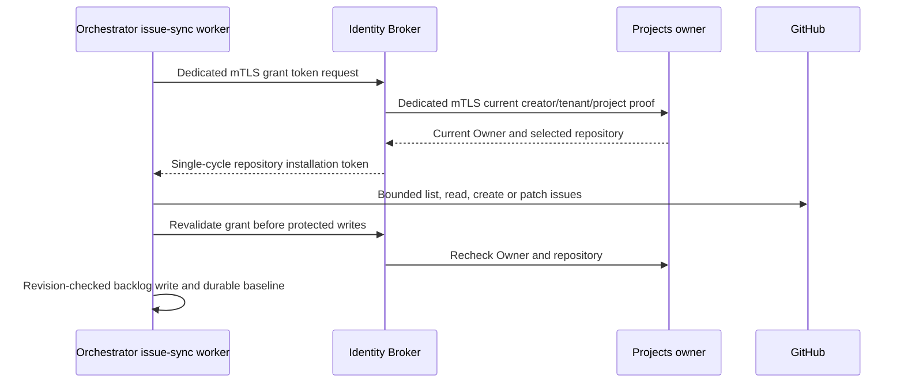
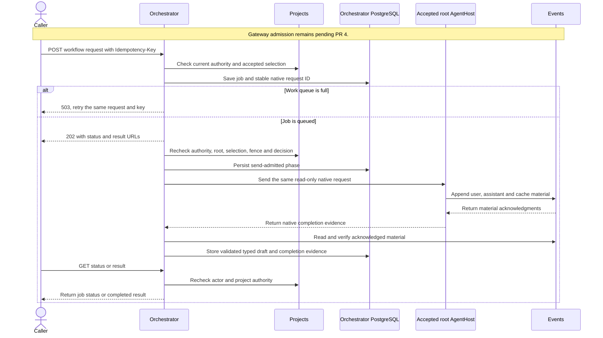

# Orchestration

## 1–4. Goals, constraints, context and strategy

Use this page to understand how the Orchestrator turns confirmed intent into
controlled execution. The HTTP host owns durable state, including Microsoft
Agent Framework (MAF) checkpoints, and calls other owners. Its Core library
validates domain rules without owning the database or starting an agent.

Keep three questions separate:

1. **What work is authorized?** Typed outcome, workflow, and WorkPlan decisions
   establish confirmed scope.
2. **What work is ready?** The planner combines dependencies, checkpoint
   progress, joined results, and capacity limits.
3. **What execution is current?** Owner fences, runtime registrations,
   placement, and action grants identify the active attempt.

A model can propose a decision. It cannot replace typed approval, create its
own resource pin, or mark a platform gate complete.

## 5. Building blocks and state ownership

Project backlog records carry task content, an open/closed lifecycle, a typed
repository issue link, and optimistic task and graph revisions. Content
writes use the existing Orchestrator backlog project lock and do not require
or reserve a run. Atomic execution claims continue to use accepted run
selection and prerequisite evidence. See
[Project backlog content](../reference/api.md#project-backlog-content) for
the authorized routes, bounds, and lifecycle rules.

### Periodic repository issue sync

The optional `IssueSyncWorker` polls due project settings every five seconds.
It runs at most 16 due projects per poll, serially, with a database advisory
lock per project across service instances. Unconfigured and disabled projects
are untouched. Each project cycle has its own persisted interval, item bound
and deadline. It reads one bounded page of repository issues and reconciles
at most `maxItems` backlog tasks; cursor progress survives restarts. A page
includes closed issues for mapping recovery, but only previously unmapped
**open** issues are imported. Pull requests are excluded.

```mermaid
sequenceDiagram
    participant Worker as Orchestrator issue-sync worker
    participant Identity as Identity Broker
    participant Projects as Projects owner
    participant GitHub
    Worker->>Identity: Dedicated mTLS grant token request
    Identity->>Projects: Dedicated mTLS current creator/tenant/project proof
    Projects-->>Identity: Current Owner and selected repository
    Identity-->>Worker: Single-cycle repository installation token
    Worker->>GitHub: Bounded list, read, create or patch issues
    Worker->>Identity: Revalidate grant before protected writes
    Identity->>Projects: Recheck Owner and repository
    Worker->>Worker: Revision-checked backlog write and durable baseline
```

The new `issue-sync` authority is not a run grant. Identity owns a revocable
grant with one creator, tenant, project and selected GitHub App repository.
It rechecks that the grant is active, the creator is still a current project
Owner, and the repository/connection is still selected. The worker validates
this evidence before effects and inside revision-checked backlog writes.
GitHub credentials live only for a single cycle and are invalidated afterward;
no user bearer token is saved. Existing run-token issuance is unchanged.
The creator or a current tenant administrator can revoke the grant. Identity
persists credential-free, append-only `requested` and `minted` audit evidence
with grant ID and owner before returning any minted credential.

Mappings live in the backlog's unique repository issue link and in sync
receipts. Baselines support field-by-field three-way reconciliation: an
unchanged local field follows GitHub; a changed local field wins, including
simultaneous edits. Both sides can close and reopen work. This is a
deterministic policy, not a conflict prompt. Archived tasks retain their
mapping and are not exported or edited.

Before creating an issue the worker persists a pending receipt and includes
a stable HTML comment in the remote body. A lost response is recovered by
finding that marker in subsequent bounded pages, including closed issues.
It never blindly repeats an uncertain create. If a remote issue cannot be
found after an uncertain write, status remains
`issue_sync_create_outcome_pending`; it does not claim successful completion.
Definitive rejections, transient reads and updates are retried on the next
cycle. Partial writes are not rolled back remotely or labelled successful.
Changing a project's connected repository fails closed rather than remapping
existing work to another repository.

The owner routes and exact settings bounds are documented in
[the API reference](../reference/api.md#periodic-issue-sync).
Migration 027, the Identity grant migration, runtime grants and dedicated
service TLS profiles are separate prerequisites. The source contract does
not establish that those prerequisites have been applied or that a cycle
has run in a deployment.

| Source | Responsibility |
| --- | --- |
| `CoordinationEndpoints.cs` and `CoordinationOwnerStore.cs` | Session, decision, gate, message, turn, roots, fences, and outbox |
| `WorkflowGenerationEndpoints.cs` and `WorkflowGenerationJobStore.cs` | Durable workflow-generation jobs and typed draft results |
| `CoordinatorDecisionOwnerStore.cs` | Atomic decision, gate, grant, and outbox writes |
| `MafExecutionPlanner.cs` | Deterministic associations and ready-frontier calculation |
| `MafExecutionDispatchEndpoints.cs` | Explicit dispatch, durable intents, host sends, and result joining |
| `MafExecutionCheckpointStore.cs` and `PostgresMafCheckpointStore.cs` | MAF checkpoint binding and persistence |
| `SessionSuspendResumeCoordinator.cs` | Ordered suspend and resume phases |
| `RuntimeRegistrationOwner.cs` and `RuntimeUsageSourceOwner.cs` | Current runtime identity and SDK evidence |
| `WorkflowContracts.cs`, `WorkflowDefinitionValidator.cs`, and `WorkPlanValidator.cs` | Workflow and plan types and validation |
| `ExecutableActionGuard.cs` and readiness evaluators | Current grants, durable receipts, prerequisites, and schedules |

The endpoint and store files are under
`services/orchestrator/Agentweaver.Orchestrator/`. Domain contracts and
validation rules are under `services/orchestrator/Agentweaver.Orchestrator.Core/`.

### List stored project issues and pull requests

The Orchestrator serves two project lists from stored data, without a provider
call. `ProjectIssueReadStore` reads backlog tasks that issue sync linked to a
repository issue. `ProjectPullRequestReadStore` reads the pull requests that
the project's runs created or reused. `ProjectSourceControlEndpoints` checks
Projects read authority before and after each read, so a caller that loses
permission during the read gets `403` and no items.

Pull request records require migration 032. The reviewed maintenance plan
applies it with its exact runtime grant; startup also accepts a complete
pre-032 schema during rollout. Before maintenance applies it, the list returns
`503 pull_request_records_unavailable`. After that, it lists only pull requests
recorded from that time on. See the [API reference](../reference/api.md#project-issue-and-pull-request-lists).

## 6. Runtime view

### Start the root AgentHost

After Orchestrator commits an accepted root and admits the first message, it
saves a runtime-start intent and queues a bounded background continuation.
Direct root acceptance uses the same path. Invocation-bound root admission reaches
it only after the setup receipt, accepted run selection, root, and first message
pass their current owner checks. Startup does not create a model turn.

The continuation uses the accepted run selection and its execution fence. It
asks Environment to register the run's Environment, apply the selected egress
policy, create a private 1 GiB `ReadWriteMany` workspace at `/workspace`, and
provision the first Sandbox placement. The workspace uses `Strict` consistency
and `Retain` for both reclaim and owner deletion. Environment returns the exact
lease, placement, and selected default source profile.

Orchestrator then creates the current runtime registration, requests Broker
bootstrap, and calls Environment's authenticated
`POST /internal/runtime/v1/activate` route. `Ready` is stored only after
Environment validates the current registration, placement, AgentHost receipt,
and readiness evidence. The response and session status report `pending`,
`ready`, or `blocked`; `pending` is not proof that the Host is ready.

The startup intent stores operation IDs, owner fences, and non-credential
receipts. It does not store bearer credentials. A retry needs fresh
authenticated run authority. Replaying a start request can queue recovery
without sending the first message again. Cancelling a run records a cleanup
obligation for the saved placement; cleanup releases only that placement and
does not delete retained workspace data or start a replacement Host.
First-start provisioning rechecks current authority before it completes the
Sandbox lease. Resume provisioning records a provider effect that already
returned before the final authority check. Neither path reports readiness
after authority is lost; both preserve the exact resource for cleanup.

The continuation and its durable state live in
`RuntimeRunStartOrchestration.cs` and `CoordinationRuntimeRunStartStore.cs`.
Environment owns first placement in `EnvironmentRuntimeRunStartManager.cs`.
The real activation route is in `EnvironmentRuntimeBootstrapEndpoints.cs`.

### Replace a coordinator root Host

The run-bound replacement request names the current runtime instance,
registration revision, execution fence, accepted-selection hash, and one
operation ID. Orchestrator accepts it only for the current coordinator root and
after it verifies a completed native-turn receipt. The request ID stays the
same when the caller checks or retries an uncertain operation.

Orchestrator records the replacement operation and cleanup obligation before
provider effects. Environment retires the old Host placement before it creates
the new Pod and lease. The new placement uses the same workspace volume and
resource/data generations. Orchestrator creates a new runtime registration
without changing the accepted selection or execution fence, then uses the
normal Broker bootstrap and Environment activation paths.

The replacement reaches `ready` only after the new Host restores the exact
acknowledged SDK cache and reports a complete reconstruction interval with no
native events or tool effects. The status route returns the saved operation.
`pending` or `cleanup_pending` means the caller must keep checking that
operation; it must not start another replacement. Cancellation follows the
saved attempt and keeps unresolved resource cleanup visible.

After replacement, an exact retry of the original casting request is checked
against the completion receipt and the saved replacement lineage. Orchestrator
returns the original completion with current-registration replay evidence. It
does not send another native request or repeat a tool effect. These operations
are implemented in `RuntimeRunStartOrchestration.cs`,
`CoordinationRuntimeRunStartStore.cs`, and `ProjectRunEndpoints.cs`.

```mermaid
sequenceDiagram
    actor CLI as Native CLI
    participant Gateway
    participant Core as Orchestrator
    participant Environment
    participant Broker
    participant Host as AgentHost
    participant Events
    Note over CLI,Events: Source flow; it does not prove a deployed acceptance run.
    CLI->>Gateway: Submit one approved read-only casting request
    Gateway->>Core: Forward current run-bound request
    Core->>Host: Admit native root turn
    Host->>Events: Append user, assistant and cache material
    Events-->>Host: Return typed material acknowledgments
    Host-->>Core: Return native completion evidence
    Core-->>Gateway: Return proposal and stored completion receipt
    Gateway-->>CLI: Return nativeCompletion
    CLI->>Gateway: Read user and assistant turn text
    Gateway->>Events: Check current read authority and material binding
    Events-->>Gateway: Return the bound turn text
    Gateway-->>CLI: Return authorized text
    CLI->>Gateway: Request Host replacement with current binding
    Gateway->>Core: Forward stable operation ID and expected values
    Core->>Environment: Retire the exact old placement
    Environment-->>Core: Return release receipt
    Core->>Environment: Provision a new placement on the retained workspace
    Environment-->>Core: Return new lease and Pod identity
    Core->>Broker: Bootstrap the new runtime registration
    Broker-->>Core: Return current bootstrap receipt
    Core->>Environment: Activate the new Host
    Environment->>Host: Configure and resume the saved SDK cache
    Host->>Events: Read the exact acknowledged cache reference
    Events-->>Host: Return cache bytes
    Host-->>Environment: Return readiness and empty reconstruction evidence
    Environment-->>Core: Return current readiness
    Core-->>Gateway: Return ready replacement summary
    Gateway-->>CLI: Return the saved operation state
    CLI->>Gateway: Retry the exact casting request
    Gateway->>Core: Forward the original request identity
    Core->>Core: Validate completion and replacement lineage
    Core-->>Gateway: Return original completion and no-call replay evidence
    Gateway-->>CLI: Return nativeReplay without a new native send
```

### Generate a workflow draft

The Orchestrator owner provides these routes:

- `POST /api/projects/{projectId}/workflows/generate`
- `GET /api/projects/{projectId}/workflows/generation-jobs/{jobId}`
- `GET /api/projects/{projectId}/workflows/generation-jobs/{jobId}/result`

The owner requires an `Idempotency-Key`, the `projects.orchestrator` scope, current
project write and Orchestrator authority, and the exact accepted coordinator
root. It checks the current run selection, model registration, execution fence,
and decision state before it sends work. The request names only the run,
session, expected decision version, and prompt. The owner derives the tenant,
actor, selection, model, fence, and native request ID.

The owner saves the job and native request ID before it sends a model turn.
An identical authenticated POST returns the same job. A changed request with
the same key returns `409 idempotency_key_conflict`. The owner sends the saved
prompt to the accepted root Host in read-only mode. It validates the native
completion and the acknowledged user, assistant, and cache material before it
stores a typed `WorkflowDefinition`. A completed job without a valid stored
definition and persisted native completion evidence is an error.

Acceptance returns `202` with separate status and result URLs. The status route
returns a job envelope. The result route returns `409
workflow_generation_not_complete` until the job completes. Both read routes
recheck the owning actor, project, and current accepted selection. They do not
start model work. Invalid definitions and roles outside the accepted team fail
with typed errors. A generated definition remains a draft; it does not select
or confirm a workflow or plan.

If the work queue is full when a job needs scheduling, POST returns
`503 workflow_generation_queue_full`. The job can already be stored. Retry
the identical request with the same `Idempotency-Key` and current authority
to schedule or reconcile that job.
If the run becomes terminal while the job is being saved, POST can return
`409 workflow_generation_run_unavailable`.

Migration 046 adds the job table and closes queued work when a run is cancelled.
It preserves an admitted native turn as unresolved until completion is verified.
Cleanup stays pending without holding a runtime-start worker. An authorized
retry of the cancellation can schedule cleanup again after an in-flight worker
verifies completion. Cancellation retries do not independently verify stored
proof. If no worker verifies the turn, cleanup remains pending, even when a
receipt was stored. If proof is lost before it is stored, the current contract
cannot recover it after cancellation. Cleanup does not start another turn.

For an active run, an identical POST can attempt to reconcile the saved native
request after a lost reply or a temporary storage failure. The result can remain
indeterminate if completion evidence is unavailable. The owner does not create
a second request ID or make an automatic paid retry. The runtime database role
needs `SELECT`, `INSERT`, and `UPDATE` on the job table. It has no `DELETE`
grant. The migration is optional during rollout; readiness rejects an applied
but incomplete schema.

These are Orchestrator owner routes. Gateway admission and the CLI acceptance
journey remain pending PR 4. The diagram shows the owner source flow, not a
deployed or live-model test.

```mermaid
sequenceDiagram
    actor Caller
    participant Core as Orchestrator
    participant Projects
    participant DB as Orchestrator PostgreSQL
    participant Host as Accepted root AgentHost
    participant Events
    Note over Caller,Events: Gateway admission remains pending PR 4.
    Caller->>Core: POST workflow request with Idempotency-Key
    Core->>Projects: Check current authority and accepted selection
    Core->>DB: Save job and stable native request ID
    alt Work queue is full
        Core-->>Caller: 503, retry the same request and key
    else Job is queued
        Core-->>Caller: 202 with status and result URLs
        Core->>Projects: Recheck authority, root, selection, fence and decision
        Core->>DB: Persist send-admitted phase
        Core->>Host: Send the same read-only native request
        Host->>Events: Append user, assistant and cache material
        Events-->>Host: Return material acknowledgments
        Host-->>Core: Return native completion evidence
        Core->>Events: Read and verify acknowledged material
        Core->>DB: Store validated typed draft and completion evidence
        Caller->>Core: GET status or result
        Core->>Projects: Recheck actor and project authority
        Core-->>Caller: Return job status or completed result
    end
```

### Understand workflows, plans, and gates

A workflow is a versioned catalog of steps. Its step mode defines who creates
the work:

| Mode | Meaning |
| --- | --- |
| `Fixed` | The workflow prescribes task, role, phase, isolation, and outputs. |
| `Open` | The coordinator proposes bounded WorkPlan items for the step. |
| `Platform` | A named platform executor owns the gate; ordinary agent work cannot replace it. |

The gate enum describes domain vocabulary, not a promise that an executor is
available. Dispatch reports steps that have no available executor.

Scribe is available when its Knowledge owner is configured. The selected gate
snapshots successful accepted child results into actor- and producer-bound
checkpoint intents before Knowledge I/O. It records compact Memory revision
receipts under the same execution fence and only succeeds after all receipts
are durable. Restart replay rechecks current authority and exact persisted
content; it does not classify results, create Decisions, or auto-approve context.
See [Scribe workflow-output](../architecture/knowledge-memory.md#scribe-workflow-output-source-contract).

`WorkPlanValidator` checks the exact workflow revision, step identity,
cardinality, role, selected agent and model, isolation, capabilities, output
paths, and dependency graph. Model-proposed items belong only to open steps.
Validation returns either a snapshot or structured issues, never a partial
snapshot. For conflicting proposed outputs, the validator adds deterministic
dependency edges so writes do not race.

Nonempty work, fixed work, and command-backed BuildTest steps require the
appropriate accepted isolation context. The owner resolves an existing
resource through a registered Sandbox adapter; it does not invent or provision
a resource at this boundary.

OpenPullRequest is available when the private authenticated Source Control owner
is configured. Dispatch accepts an exact workspace locator for each such step.
It saves the request and source binding before calling the owner. Retries reuse
the saved request and operation identity, and dependent work waits until a
validated pull request receipt is stored. The owner records the operation before
contacting the provider. Recovery reuses the exact pull request across open and
closed states; a missing or ambiguous result never triggers another create.
Managed workspace changes wait while the owner holds the revision lease for
the write. A changed source, workspace, or decision leaves the gate incomplete.
Merge is available through the same authenticated Source Control owner. Dispatch
persists its idempotency key, repository pin, workflow binding, PR number, and
expected head before calling `/merge-intents`. It derives the PR only from one
completed OpenPullRequest ancestor or accepts an explicit number and head pair.
If the owner creates an approval gate, dispatch returns with the Merge checkpoint
still running; dependents remain blocked until an exact approval receipt is
current. A later dispatch reuses the saved intent, calls `/merge-intents/{id}/execute`,
and stores only the owner-verified merge SHA. Changed authority or head,
ambiguous results, and interrupted execution fail closed without repeating a
merge effect.

RubberDuck is available only when the current coordinator-root AgentHost
registration and action-grant owner are available. It is a platform executor,
not an ordinary work-plan child. The dispatcher stores an immutable intent
before sending the exact recorded ancestor results and platform receipts to
that AgentHost in read-only mode. The intent binds the accepted workflow
revision, actor, selection, execution fence, and current runtime registration.
The owner turn uses the checkpointed operation ID, and its completed response
uses a stable journal event ID so a restarted host can return the recorded
answer without running another review. If only part of the turn was recorded,
the host refuses to send it again; the gate stays incomplete.

Only a response whose first nonempty line is `PASS` can release dependent work.
`REQUEST_CHANGES`, a malformed verdict, stale evidence, a changed owner, or
unavailable owner leaves the gate failed or incomplete and keeps dependents
blocked. Recovery reports the operation, evidence hash, verdict, and any stable
failure code. Other platform gates still require their own registered executors.

Candidate and confirmed plans are separate states. Pending gates prevent
decomposition or dispatch according to transition rules. Gate answers bind a
request ID, actor, and fence; exact replay returns the saved result.
Acknowledging a message records receipt. It does not approve an outcome,
confirm a workflow, or complete work.

### Create and confirm a plan

Before proposing work, the run needs an accepted Projects selection and current
authority. The selected workflow and plan must match that run context.

1. **Accept the root.** Orchestrator reads the accepted Projects selection and
   current authority, then records the root session and initial decision state.
   Configured Hosted Copilot credit limits also use Events run admission.
2. **Propose the outcome.** Core validates the typed outcome specification.
   Clarifying questions and outcome confirmation become explicit gate state.
3. **Select a workflow.** Selection uses the authorized workflow catalog.
   Generated definitions require first-use confirmation.
4. **Propose a WorkPlan.** Core validates the full plan against the selected
   workflow and run context. The owner saves the candidate and its confirmation
   gate.
5. **Confirm or revise.** An accepted gate answer makes the plan dispatchable.
   Scope-changing revisions add another confirmation boundary. Accepted
   revisions consume the configured revision-attempt allowance.

`CoordinatorDecisionOwnerStore` serializes transitions against current owner
state. The winning transaction commits the decision version with its gate,
action grants, and decision outbox. The owner rechecks authority around waits
and before protected writes.

Owner routes are rooted at
`/api/projects/{projectId}/runs/{runId}/coordination`; Gateway exposes versioned
public routes. Use [contracts and endpoints](../reference/contracts.md) for
request shapes.

### Dispatch ready work

Before dispatch, provide an explicit `actions/dispatch` request with the
expected decision-state version and WorkPlan ID. The plan must still be
confirmed.

1. Restore the bound MAF checkpoint and validate the plan again.
2. Reconcile child lifecycle records with saved dispatch intents and joined
   results.
3. Compute the ready frontier from step and item dependencies.
4. Apply child, concurrency, wall-time, and runtime admission limits.
5. Commit child records, stable dispatch identities, pending intents, and
   checkpoint progress before sending work.
6. Recheck authority, runtime registration, and host readiness; then send the
   ready batch.
7. Validate each host response against its native context and persist the
   joined result.

Fixed work gets an immutable activation association. Open work uses its
confirmed WorkPlan item. Both resolve to deterministic child-session IDs.
Dispatch messages also have stable IDs, so retry does not create a new logical
send.

Later explicit dispatch requests reconcile saved progress and expose newly
ready dependencies. This is request-driven execution, not an automatic
scheduler. Command-backed BuildTest delegates resource work to Environment
while Orchestrator retains the accepted command and checkpoint. Source Control
output and merge evidence use separate owner paths.

### Promote a plan into backlog tasks

Instead of dispatching a confirmed plan, the run owner can promote it into
project backlog tasks with `POST .../backlog/promotions`. Promotion is allowed
only before the run starts execution: the run must have no registered
children and no MAF dispatch records.

1. Lock the project backlog graph rows.
2. Lock the run's owner binding row and validate the confirmed plan, decision
   version, execution fence, and selection again.
3. Add one task per plan item and one edge per item dependency.
4. Write the promotion record and one origin record per task.
5. Recheck authority and commit.

Dispatch takes the same owner binding lock and rejects a promoted plan, so a
plan is either promoted or dispatched, not both. The decision state is not
changed. A retry with the same idempotency key returns the stored promotion.
Tasks captured directly have no origin record. For request and response
shapes, see [Plan promotion and task origin](../reference/api.md#plan-promotion-and-task-origin).

### Enforce policy and runtime authority

Core's `ExecutableActionGuard` checks a current owner-issued grant before
calling a protected operation. It evaluates policy, stores source evidence,
waits for durable Events acknowledgment, and rechecks current authority before
the effect. A policy result is evidence, not a grant.

Runtime registration is a separate boundary. Orchestrator compares the
accepted selection, active session and work association, execution fence, and
Environment placement before returning current runtime context. An earlier
registration record alone does not authorize a turn.

### Recover from uncertain execution

- A stale decision version or execution fence conflicts instead of applying
  work to a newer attempt.
- Missing Sandbox negotiation or runtime prerequisites block dispatch; they do
  not select a synthetic resource.
- A pending dispatch intent keeps its identity across retries. Missing or
  uncertain result evidence is not success.
- Owner-reported failure or indeterminate execution advances the run fence.
  Explicit recovery checks the expected fence and run version before advancing
  again and restoring eligible logical turns.
- Suspend and resume use a persisted phase machine. Suspend orders fencing,
  draining, checkpointing, journal and workspace flushes, manifest commit, and
  placement release. Resume orders manifest validation, environment readiness,
  egress verification, fence advancement, and dispatch. A retry cannot skip a
  required phase.

A workflow checkpoint and native SDK cache are different recovery inputs.
Restoring conversation context does not replay external effects.

### Understand readiness evaluation

The Core backlog evaluator checks exact graph and task revisions against
owner-projected prerequisite execution and output evidence. A dependency label
alone does not make a task ready.

The schedule evaluator computes daily, weekly, and monthly occurrences in UTC.
It is a pure function, not a hosted scheduling loop.

## 7–9. Deployment, shared concepts and decisions

The HTTP owner runs as a shared service over its PostgreSQL schema. Core is a
library in that host; MAF checkpoints are owner state, not an SDK cache.
AgentHost placement belongs to Environment and explicit dispatch reaches the
registered runtime. See the [deployment view](./infra-deployment.md).

Cross-owner calls preserve current [Projects](./projects-config.md) authority,
[Identity](./identity-secrets.md) purposes and [Events](./events-sessions.md)
evidence. Local checkpoints and stable operation IDs reduce duplicate logical
work, but do not make external effects transactional.

[ADR 0002](https://github.com/sabbour/agentweaver/blob/v1/docs/architecture/decisions/0002-project-issue-sync-delegation.md)
records accepted/source-implemented issue-sync delegation, not deployment.
The [platform ADR](https://github.com/sabbour/agentweaver/blob/v1/docs/architecture/decisions/0001-platform-architecture.md)
remains Proposed. Neither status is inferred from this runtime inventory.

## 10–12. Quality, risks and glossary

| Context and stimulus | Response and measure | Verification state |
| --- | --- | --- |
| Dispatch restarts with a saved pending intent | Restore the same child/operation identity and reconcile result evidence | Checkpoint/owner restart tests; deployed recovery is separate |
| Plan promotion races dispatch | Shared owner binding lock admits promotion or execution, not both | Backlog promotion/store tests |
| RubberDuck returns `REQUEST_CHANGES` or malformed output | Keep dependents blocked; only first nonempty `PASS` can release them | Executor/dispatch tests |
| Issue create response is lost | Recover the stable marker; unresolved outcome stays `issue_sync_create_outcome_pending` | Controlled issue-sync/store tests |

A domain gate name is not an available executor. The dispatch owner must keep
unsupported or incomplete gates visible rather than replace them with model
work. External response loss requires reconciliation; an automatic scheduler
or blind retry would not resolve it.

**Terms:** workflow prescribes steps; WorkPlan proposes bounded work for open
steps; gate records a typed confirmation; checkpoint retains progress; fence
rejects an older attempt.

## Related content

- [Events and sessions](./events-sessions.md) explains journal and message
  ownership.
- [Agent runtime](./agent-runtime.md) explains bootstrap and guarded SDK work.
- [Environment and sandbox](./environment-sandbox.md) and
  [Source Control](./source-control.md) explain resource and repository effects.
- [Contracts and endpoints](../reference/contracts.md) records the API surface.
- [Orchestration design](https://github.com/sabbour/agentweaver/blob/v1/docs/architecture/design/orchestration.md)
  records broader design decisions.
