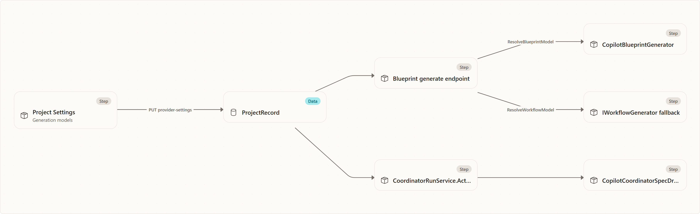

# Project generation model settings — Deep Dive

Project generation model settings let one project choose different GitHub Copilot model ids for three planning surfaces: blueprint generation, workflow generation, and outcome-spec drafting. The setting is project data, not a global switch. For the API contract see the [reference](../reference/project-generation-model-settings.md); for the operator flow see the [experience guide](../experience/project-generation-model-settings.md).

## Flow

<!-- Rendered from ../diagrams/src/project-generation-model-settings-fig1.json by docs/diagram-renderer +
     Playwright (Fluent-styled React Flow), replacing a Mermaid flowchart.
     Edit the JSON, then run `npm run docs:render-diagrams` and commit the
     regenerated PNG + .hash.txt. -->

## Stored fields

`ProjectRecord` now stores `BlueprintGenerationModel`, `WorkflowGenerationModel`, and `OutcomeSpecGenerationModel` (`apps/Agentweaver.Api.Data/Memory/ProjectRecord.cs:26`). `MemoryDbContext` maps them to `blueprint_generation_model`, `workflow_generation_model`, and `outcome_spec_generation_model` (`MemoryDbContext.cs:227`). The Postgres migration `20260708040300_AddProjectGenerationModelSettings.cs` adds the database columns; the project response DTO and web `Project` type expose the same snake_case fields (`apps/Agentweaver.Api/Contracts/Dtos.cs:588`; `apps/web/src/api/types.ts:183`).

## Save path

The web settings page has a **Generation models** section with three text fields and a **Reset to inherit** action (`apps/web/src/pages/ProjectSettingsPage.tsx:538`). Saving calls `PUT /api/projects/{id}/provider-settings` with the three generation model ids plus the existing default-provider fields (`ProjectSettingsPage.tsx:334`). The API rejects model ids that are not allowed by `IsAllowedModelId` and persists the three values through `ProjectService.UpdateProviderSettingsAsync` (`apps/Agentweaver.Api/Endpoints/ProjectEndpoints.cs:270`).

Blank values are saved as `null`, which means inherit the configured global generation default in the resolver path (`ProjectSettingsPage.tsx:342`).

## Runtime consumers

- **Blueprint generation** reads the project, resolves `project.BlueprintGenerationModel` through `GenerationModelOptions.ResolveBlueprintModel`, and passes it to `BlueprintService.GenerateAsync` (`apps/Agentweaver.Api/Endpoints/BlueprintEndpoints.cs:58`). `CopilotBlueprintGenerator.GenerateRawAsync` sends that `modelId` to `IAgentRunner.ExecuteAsync`, falling back to its configured default only when the project model is null (`apps/Agentweaver.Api/Blueprints/CopilotBlueprintGenerator.cs:36`, `:236`).
- **Workflow generation fallback** receives `workflowGenerationModel` from `BlueprintService.GenerateAsync` and places it in `WorkflowGenerationRequest.GenerationModel` before invoking `IWorkflowGenerator` (`apps/Agentweaver.Api/Blueprints/BlueprintService.cs:460`, `:554`).
- **Outcome-spec drafting** resolves `project.OutcomeSpecGenerationModel` when a coordinator run activates, then carries it in `CoordinatorDraftInput.OutcomeSpecGenerationModel` (`apps/Agentweaver.Api/Coordinator/CoordinatorRunService.cs:247`, `:281`).

## Why this hardens generation

The generation paths now preserve the model chosen for the specific project surface. Blueprint generation provider failures are returned as classified `BlueprintGenerationFailureKind` values with a stable `ErrorCode` and `FailureMessage`, rather than being treated as validation drift (`apps/Agentweaver.Api/Blueprints/BlueprintService.cs:475`, `:625`). The blueprint parser also preserves an empty `workflows` array as the explicit "no library workflow fits" signal instead of defaulting to `default` (`apps/Agentweaver.Api/Blueprints/IBlueprintGenerator.cs:103`). If fallback workflow generation is required, it uses the workflow generation model configured for the project.

## Source

| Concern | File |
|---|---|
| Project fields and EF mapping | `apps/Agentweaver.Api.Data/Memory/ProjectRecord.cs`; `MemoryDbContext.cs` |
| Migration | `apps/Agentweaver.Api.Migrations.Postgres/Migrations/20260708040300_AddProjectGenerationModelSettings.cs` |
| Request/response DTOs | `apps/Agentweaver.Api/Contracts/Dtos.cs`; `apps/web/src/api/types.ts` |
| Settings UI | `apps/web/src/pages/ProjectSettingsPage.tsx` |
| Provider-settings endpoint | `apps/Agentweaver.Api/Endpoints/ProjectEndpoints.cs` |
| Blueprint and workflow generation use | `apps/Agentweaver.Api/Endpoints/BlueprintEndpoints.cs`; `BlueprintService.cs`; `CopilotBlueprintGenerator.cs`; `IBlueprintGenerator.cs` |
| Outcome-spec generation use | `apps/Agentweaver.Api/Coordinator/CoordinatorRunService.cs`; `CoordinatorMessages.cs` |

## See also

- [Project generation model settings — Reference](../reference/project-generation-model-settings.md)
- [Project generation model settings — Experience](../experience/project-generation-model-settings.md)
- [Repository blueprint suggestions](../experience/repo-blueprint-suggestions.md)
- [Coordinator & orchestration](../experience/coordinator-orchestration.md)
