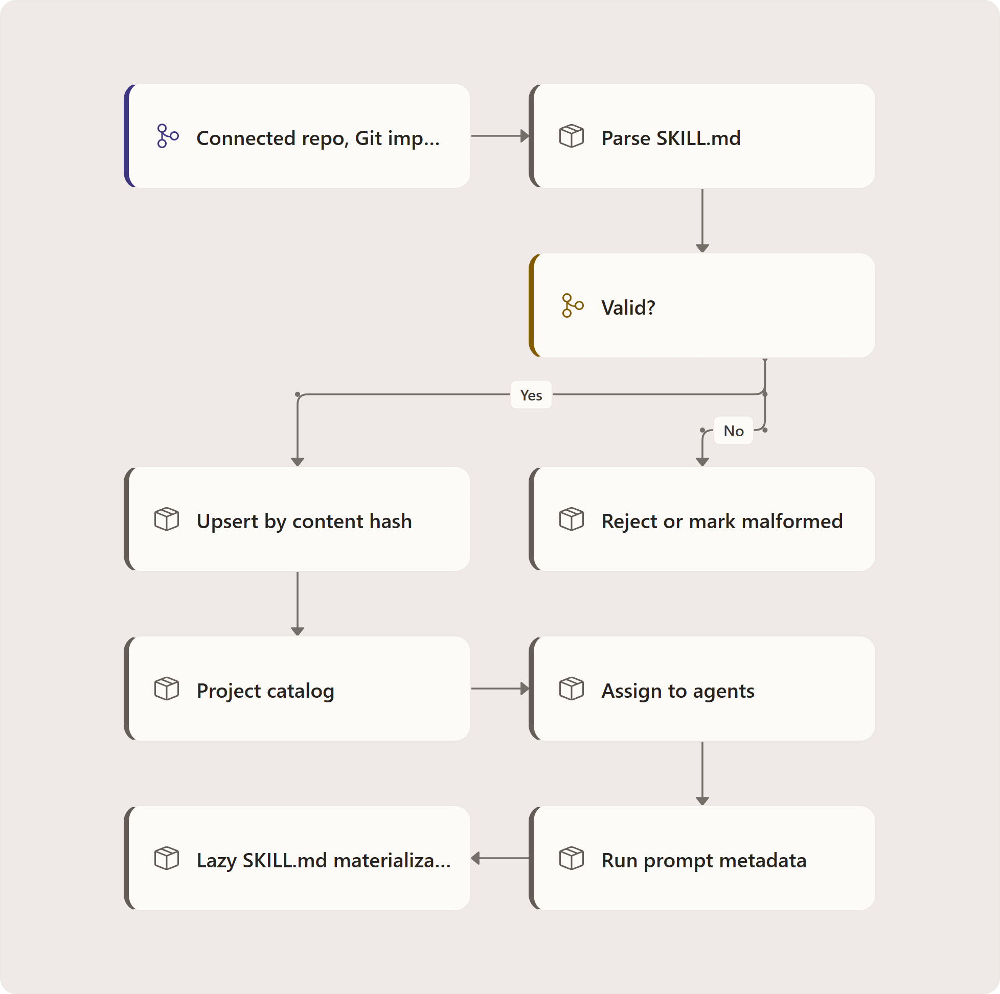

# Project skills

Project skills are reusable, standards-compatible `SKILL.md` instruction modules that live in a
project catalog. A project can acquire skills from its connected repository, another Git repository,
or an upload, then assign each skill to the agents that should use it.

At run time, progressive disclosure requires a shared execution filesystem and successful
materialization. Agentweaver writes instructions/resources under `.agentweaver/skills/` **before**
putting the skill's name, description, and path in the prompt. With pod-local/unavailable storage or
a write failure it inlines full instructions instead; it does not emit a dangling lazy-load pointer.

<!-- Editable source: ../diagrams/src/project-skills-fig1.drawio.
     Export with pinned draw.io Desktop 31.4.5 using --spec project-skills-fig1.
     Review lineage: ../diagrams/reviews/project-skills-fig1/iteration-manifest.json. -->

## Acquisition

Agentweaver recognizes one-skill-per-folder layouts under `.github/skills`,
`.copilot/skills`, `.claude/skills`, and `.agents/skills`. Each skill folder must contain a
`SKILL.md` file with YAML frontmatter for `name` and `description`, followed by an instruction body.
Bundled text files in the same folder are kept as skill resources.

Acquisition is idempotent. The catalog stores a stable content hash over the name, description,
instructions, and sorted resources, so re-syncing or re-importing unchanged content is a no-op. If a
synced skill disappears from the connected repository, it is marked `missing`; if a previously valid
same-source skill becomes malformed, it is marked `malformed`. Only `active` skills can be injected.

Git and raw imports pass through an SSRF guard before anything is cloned or fetched. The source
parser accepts only the `owner/repo` shorthand, public `https://github.com` repo/tree/blob URLs, and
raw `https://raw.githubusercontent.com/.../SKILL.md` URLs; every other host, scheme, non-default port,
or embedded-credential form is rejected. Multi-skill sources return every discovered candidate from a
preview pass so the caller selects which locations to import.

## Assignment and prompt assembly

Assignments are project-scoped links between a skill and an agent name. Prompt assembly queries only
active skills assigned to the current agent. Stale-folder cleanup and git-exclude maintenance are
best-effort and logged when they fail. Lookup failure is also logged and yields no skill block;
delivery is not a guarantee that every stale folder was removed.

## Default assignment preview and apply

A confirmed active team is required before defaults can be planned. The service combines blueprint
role bindings, bundled skills, the project catalog, and current assignments into a side-effect-free
preview with a digest. An explicit apply recomputes that preview, compares the digest, and checks
transactional store state before inserting/reactivating skills and assigning agents. Stale previews
are rejected rather than partially applied. Preview itself neither acquires nor assigns skills.

Source: `apps/Agentweaver.Api/Skills/SkillDefaultsService.cs:55-250`.

## Source

| Concern | Source |
| --- | --- |
| REST routes for catalog, acquisition, upload, and assignment | `apps/Agentweaver.Api/Endpoints/SkillEndpoints.cs:15` |
| Catalog DTOs, idempotent upsert, missing/malformed handling, repository discovery | `apps/Agentweaver.Api/Skills/SkillCatalogService.cs:16`, `apps/Agentweaver.Api/Skills/SkillCatalogService.cs:350` |
| Import source allow-list / SSRF guard (`github.com`, `raw.githubusercontent.com`) | `apps/Agentweaver.Api/Skills/SkillCatalogService.cs:772` |
| `SKILL.md` frontmatter, recognized directories, size limits, content hash | `apps/Agentweaver.Api/Skills/SkillParser.cs:33` |
| Path safety for uploads, zip extraction, and resources | `apps/Agentweaver.Api/Skills/SkillPaths.cs:3` |
| Progressive-disclosure prompt block and materialization | `apps/Agentweaver.Api/Skills/SkillPromptComposer.cs:8` |
| Web catalog and assignment UI | `apps/web/src/pages/SkillsPage.tsx:108` |
| MCP tools | `apps/Agentweaver.Mcp/Tools/SkillTools.cs:10` |

## See also

- [Project skills user guide](../experience/project-skills.md)
- [Project skills reference](../reference/project-skills.md)
- [MCP tool index](../reference/mcp-tools.md)

<!-- diagram-context:project-skills-fig1:start -->

Diagram details and constraints

<table><thead><tr><th>Element</th><th>Contract</th></tr></thead><tbody>
<tr><td>title</td><td>Skills: catalog to safe delivery</td></tr>
<tr><td>takeaway</td><td>Only successful shared-filesystem writes produce pointers; all other delivery is inline.</td></tr>
<tr><td>group-title-0</td><td>ACQUIRE · VALIDATE · ASSIGN</td></tr>
<tr><td>group-title-1</td><td>DELIVERY BRANCHES · EXECUTION</td></tr>
<tr><td>Skill sources</td><td>Skill sources</td></tr>
<tr><td>Skill sources</td><td>Checkout · repo · marketplace</td></tr>
<tr><td>Skill sources</td><td>Upload and manual entry are also inputs</td></tr>
<tr><td>Skill sources</td><td>SkillCatalogService.cs:335-372</td></tr>
<tr><td>Active assignments</td><td>Active assignments</td></tr>
<tr><td>Active assignments</td><td>Look up skills for this agent</td></tr>
<tr><td>Active assignments</td><td>No active assignments → no skill block</td></tr>
<tr><td>Active assignments</td><td>SkillPromptComposer.cs:45-81</td></tr>
<tr><td>Project skill catalog</td><td>Project skill catalog</td></tr>
<tr><td>Project skill catalog</td><td>Parse / validate / content-hash upsert</td></tr>
<tr><td>Project skill catalog</td><td>Missing / malformed sources are tracked</td></tr>
<tr><td>Project skill catalog</td><td>SkillCatalogService:1045-1156</td></tr>
<tr><td>Shared worktree available</td><td>Shared worktree available</td></tr>
<tr><td>Shared worktree available</td><td>Best-effort stale-folder cleanup</td></tr>
<tr><td>Shared worktree available</td><td>Attempt each assigned skill materialization</td></tr>
<tr><td>Shared worktree available</td><td>SkillPromptComposer.cs:63-106</td></tr>
<tr><td>Explicit agent assignment</td><td>Explicit agent assignment</td></tr>
<tr><td>Explicit agent assignment</td><td>Catalog skills bind to agents</td></tr>
<tr><td>Explicit agent assignment</td><td>Delivery selects active assigned entries</td></tr>
<tr><td>Explicit agent assignment</td><td>SkillPromptComposer.cs:49-54</td></tr>
<tr><td>Successful write only</td><td>Successful write only</td></tr>
<tr><td>Successful write only</td><td>Prompt metadata + SKILL.md path</td></tr>
<tr><td>Successful write only</td><td>Agent reads relevant skill instructions</td></tr>
<tr><td>Successful write only</td><td>SkillPromptComposer.cs:91-98,145</td></tr>
<tr><td>Defaults preview / apply</td><td>Defaults preview / apply</td></tr>
<tr><td>Defaults preview / apply</td><td>Confirmed team + preview digest</td></tr>
<tr><td>Defaults preview / apply</td><td>Apply recomputes; stale digest rejects</td></tr>
<tr><td>Defaults preview / apply</td><td>SkillDefaultsService.cs:231-250</td></tr>
<tr><td>Inline full instructions</td><td>Inline full instructions</td></tr>
<tr><td>Inline full instructions</td><td>Pod-local / unavailable filesystem</td></tr>
<tr><td>Inline full instructions</td><td>Also used for each failed materialization</td></tr>
<tr><td>Inline full instructions</td><td>SkillPromptComposer.cs:99-160</td></tr>
<tr><td>Skill sources</td><td>validate</td></tr>
<tr><td>Project skill catalog</td><td>assign</td></tr>
<tr><td>Explicit agent assignment</td><td>lookup</td></tr>
<tr><td>Active assignments</td><td>shared FS</td></tr>
<tr><td>Shared worktree available</td><td>write succeeds</td></tr>
<tr><td>Active assignments</td><td>no FS</td></tr>
<tr><td>Shared worktree available</td><td>write fail</td></tr>
<tr><td>scope</td><td>Defaults preview has no side effects; explicit apply is digest-checked. Cleanup is best-effort.</td></tr>
<tr><td>groups</td><td>ACQUIRE · VALIDATE · ASSIGN; DELIVERY BRANCHES · EXECUTION</td></tr>
</tbody></table>

<!-- diagram-context:project-skills-fig1:end -->
