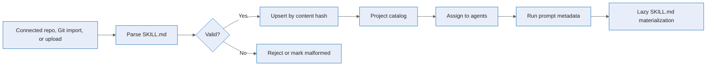

# Project skills

Project skills are reusable, standards-compatible `SKILL.md` instruction modules that live in a
project catalog. A project can acquire skills from its connected repository, another Git repository,
or an upload, then assign each skill to the agents that should use it.

At run time, Agentweaver uses progressive disclosure: only the assigned skill's name, description,
and materialized `SKILL.md` path are injected into the agent prompt. The full instructions and bundled
text resources are written into the run worktree under `.agentweaver/skills/` and read only when the
agent decides the skill is relevant.

## Acquisition

Agentweaver recognizes one-skill-per-folder layouts under `.github/skills`,
`.copilot/skills`, `.claude/skills`, and `.agents/skills`. Each skill folder must contain a
`SKILL.md` file with YAML frontmatter for `name` and `description`, followed by an instruction body.
Bundled text files in the same folder are kept as skill resources.

Acquisition is idempotent. The catalog stores a stable content hash over the name, description,
instructions, and sorted resources, so re-syncing or re-importing unchanged content is a no-op. If a
synced skill disappears from the connected repository, it is marked `missing`; if a previously valid
same-source skill becomes malformed, it is marked `malformed`. Only `active` skills can be injected.

Git and raw imports pass through an SSRF guard before anything is cloned or fetched. The source
parser accepts only the `owner/repo` shorthand, public `https://github.com` repo/tree/blob URLs, and
raw `https://raw.githubusercontent.com/.../SKILL.md` URLs; every other host, scheme, non-default port,
or embedded-credential form is rejected. Multi-skill sources return every discovered candidate from a
preview pass so the caller selects which locations to import.

## Assignment and prompt assembly

Assignments are project-scoped links between a skill and an agent name. Prompt assembly queries only
active skills assigned to the current agent. Stale materialized skill folders are removed from reused
worktrees, and `.agentweaver/skills/` is added to git exclude so skill materialization does not appear
in agent diffs.

## Source

| Concern | Source |
| --- | --- |
| REST routes for catalog, acquisition, upload, and assignment | `apps/Agentweaver.Api/Endpoints/SkillEndpoints.cs:15` |
| Catalog DTOs, idempotent upsert, missing/malformed handling, repository discovery | `apps/Agentweaver.Api/Skills/SkillCatalogService.cs:16`, `apps/Agentweaver.Api/Skills/SkillCatalogService.cs:350` |
| Import source allow-list / SSRF guard (`github.com`, `raw.githubusercontent.com`) | `apps/Agentweaver.Api/Skills/SkillCatalogService.cs:772` |
| `SKILL.md` frontmatter, recognized directories, size limits, content hash | `apps/Agentweaver.Api/Skills/SkillParser.cs:33` |
| Path safety for uploads, zip extraction, and resources | `apps/Agentweaver.Api/Skills/SkillPaths.cs:3` |
| Progressive-disclosure prompt block and materialization | `apps/Agentweaver.Api/Skills/SkillPromptComposer.cs:8` |
| Web catalog and assignment UI | `apps/web/src/pages/SkillsPage.tsx:108` |
| MCP tools | `apps/Agentweaver.Mcp/Tools/SkillTools.cs:10` |

## See also

- [Project skills user guide](../experience/project-skills.md)
- [Project skills reference](../reference/project-skills.md)
- [MCP tool index](../reference/mcp-tools.md)
