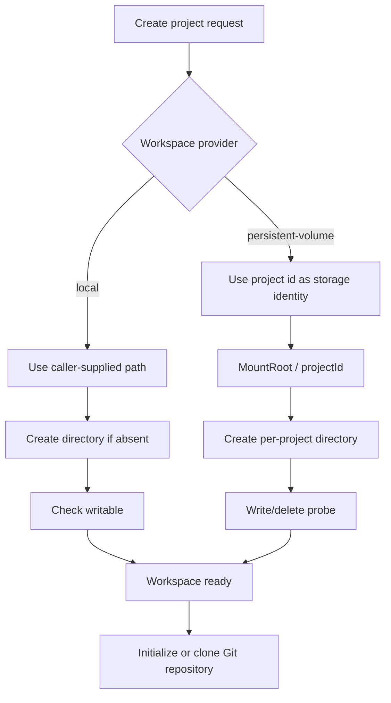
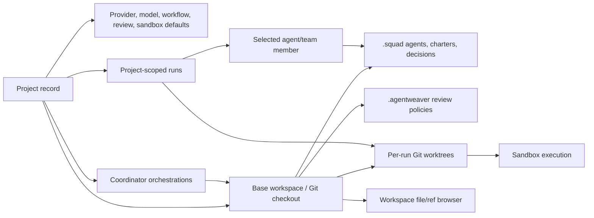

# Projects & Workspaces — Conceptual Deep Dive

## The mental model

A **project** is Agentweaver's durable boundary around a repository and the work Agentweaver performs against it. It answers five questions that every run, team, sandbox, and UI view needs answered before any agent can safely work:

1. **Whose work is this?** The project has an owner and is used as the authorization and listing boundary.
2. **What repository is being worked on?** The project is either a blank Git repository created by Agentweaver or a clone of a GitHub repository.
3. **Where is the repository stored?** The project points to a workspace directory that contains the base checkout.
4. **Which defaults should agents use?** Provider/model, workflow, review, sandbox, and blueprint defaults are attached to the project so callers do not need to repeat them on every run.
5. **Is this project allowed to start new work right now?** The lifecycle state and workspace availability together decide whether runs can be started.

The important design choice is that Agentweaver separates the **project record** from the **workspace contents**. The record is small durable metadata in the application database. The workspace is filesystem state: a Git checkout, `.squad` files, review policies, worktrees, and whatever the agents write. This split lets the API reason about ownership, lifecycle, defaults, and availability without treating the database as the source of truth for repository files.

Where this lives:

- `packages/Agentweaver.Domain/Project.cs`
- `packages/Agentweaver.Domain/ProjectOrigin.cs`
- `apps/Agentweaver.Api/Projects/`
- `apps/Agentweaver.Api/Infrastructure/SqliteProjectStore.cs`

## Core concepts and invariants

### Project identity is stable

Every project receives an Agentweaver project id. That id is more than a database key: in cloud workspace mode it becomes the directory name under the shared workspace mount. This avoids deriving storage paths from user-provided project names or repository names, which may collide, contain unsafe characters, change over time, or leak information.

The project name is user-facing and renameable. The project id is internal and stable.

### Ownership is the project authorization boundary

The project owner is the authenticated caller that created the project. Project-scoped APIs use that owner as the authorization boundary for the project itself and for teams, backlog tasks, runs, workflows, workspace browsing, and memory under the project. The endpoint layer should enforce this with `caller.Owns(...)` or an equivalent owner comparison; membership in the allowed GitHub org admits a caller to the deployment but does not grant access to another caller's projects.

There is no built-in superuser derived from a GitHub username. A login named `admin` is just another project owner when it creates its own projects, and it cannot bypass ownership checks for someone else's project.

### Origin describes how the base repository was born

Agentweaver recognizes two project origins:

- **Blank**: Agentweaver creates an empty Git repository and makes an initial commit.
- **GitHub**: Agentweaver clones a GitHub repository into the workspace.

The origin is not merely decorative. It controls creation behavior, relink validation, and how much repository identity Agentweaver can verify later. A GitHub-origin project records the source repository so a relink can reject an unrelated checkout when the remote clearly does not match.

### The workspace is the base checkout, not the run sandbox

A project workspace is the long-lived base repository. Runs and orchestrations start from that base, but should not freely mutate it as their only working area. Per-run work uses isolated Git worktrees and branches so concurrent runs can proceed without overwriting each other.

Think of the workspace as the project's **home repository**. A run gets a **temporary room** derived from that home.

### Availability is runtime state, not persisted truth

A project can exist in the database while its workspace is temporarily unavailable. For example, a Kubernetes pod may start before the persistent volume is mounted, or a local directory may have been moved. Agentweaver therefore computes `available` when reading the project instead of persisting it permanently.

This prevents stale availability from becoming authoritative. The database says, "this project exists"; the workspace provider says, "its files are usable right now."

## Lifecycle

```mermaid
stateDiagram-v2
  [*] --> ValidatingCreate: create request

  ValidatingCreate --> ResolvingWorkspace: request is well formed
  ValidatingCreate --> Rejected: bad name, origin, path, model, or repository

  ResolvingWorkspace --> EnsuringWorkspace: choose local path or project-id PVC path
  EnsuringWorkspace --> MaterializingRepository: directory exists and is writable
  EnsuringWorkspace --> RolledBack: mount/path unavailable

  MaterializingRepository --> PersistingProject: git init or clone succeeds
  MaterializingRepository --> RolledBack: git init/clone fails

  PersistingProject --> Active: database insert succeeds
  PersistingProject --> RolledBack: database insert fails; created files are removed

  Active --> Active: rename, update defaults, relink
  Active --> RunBlocked: workspace unavailable or project deleting
  RunBlocked --> Active: workspace becomes available again

  Active --> Deleting: confirmed delete
  Deleting --> Deleted: active runs cancelled, workspace released, record removed
  Deleted --> [*]
```

A project creation request moves through four conceptual phases:

1. **Validate intent**: ensure the name, origin, repository, path, and default model/provider settings make sense before touching storage.
2. **Resolve storage**: turn the requested path into the actual workspace path. In local mode the caller controls this path. In persistent-volume mode Agentweaver ignores the caller's path and assigns one from the project id.
3. **Materialize the repository**: either initialize a blank Git repository or clone from GitHub.
4. **Persist the record**: write the durable project metadata only after the workspace and repository are usable.

This order is deliberate. It avoids a database row that points at a repository that was never successfully created. When failure happens after files have been created but before the project is fully persisted, Agentweaver compensates by deleting the newly-created directory. This is not a full distributed transaction, but it gives the user the behavior they expect: failed creation should not leave half-created projects behind.

Deletion is intentionally conservative. Agentweaver first marks the project as deleting, which blocks new runs. Then it cancels non-terminal runs, releases the workspace handle, and removes the project record. Project files are preserved rather than recursively destroyed as part of normal delete. That choice protects user code from accidental data loss and keeps infrastructure cleanup separate from application record cleanup.

## Creating a blank project

A blank project is for starting from nothing inside Agentweaver. The flow is:

1. Allocate a project id.
2. Resolve the workspace path.
3. Require the target directory to be empty or absent.
4. Create and write-probe the workspace.
5. Initialize Git.
6. Create an initial empty commit on the default branch.
7. Materialize default project files where appropriate.
8. Save the project record.

The initial empty commit is important. A Git repository with no commits has an "unborn" branch, which makes branch and worktree operations awkward or impossible. By creating a first commit immediately, Agentweaver guarantees every later run has a real branch tip to start from.

The empty-directory rule is equally important. Creation is allowed to create a new repository, not adopt arbitrary existing files. If the user wants to connect an existing checkout, that is a relink operation with different validation. This prevents Agentweaver from accidentally overwriting or reinterpreting user data during creation.

## Creating a GitHub project

A GitHub project is a project whose base workspace is cloned from GitHub. Conceptually, Agentweaver does three extra things beyond blank-project creation:

1. It validates that the source is an HTTPS GitHub repository URL.
2. It obtains a valid GitHub access token for the owner/session.
3. It clones using that token as an ephemeral credential, then derives the default branch from the cloned repository.

The token is used to perform the clone; it is not meant to become project metadata. The project stores repository identity and defaults, not the user's secret. This keeps long-lived project state safer and lets token refresh/sign-in remain an authentication concern rather than a project-storage concern.

Project creation requires the API input to be a full `https://github.com/...` URL. Although the lower-level Git initializer can normalize `owner/repo` into a GitHub URL, service-level validation happens first, so `owner/repo` fails validation rather than cloning.

Failure during clone rolls back the workspace directory created for that attempt. Failure after clone but before database insert also removes the newly-created checkout. The intended user-facing invariant is simple: after a failed create, there should be no usable project record and no misleading partial project workspace.

## Relinking an existing workspace

Relink exists because files move. A local user may move a checkout, restore a backup, or mount storage at a new path. Relinking updates the project record to point at a new working directory without pretending this is a new project.

Relink is deliberately more permissive than creation about existing content, but stricter about identity:

- The target path must exist.
- It must be a valid Git repository.
- For GitHub-origin projects, if an `origin` remote is present, it must plausibly match the recorded source repository.
- The default branch is re-derived from the repository's current HEAD.

This design lets Agentweaver recover from storage movement while reducing the chance that a project is accidentally pointed at the wrong repository.

## Workspace provisioning

Workspace provisioning is abstracted behind a provider because local development and cloud deployment need different storage behavior while the rest of the project lifecycle should stay the same.

Every provider answers the same questions:

- **Resolve**: given a project id and requested path, what path should this project actually use?
- **Ensure**: can that directory be created and written to?
- **Check availability**: is the workspace usable right now?
- **Check mount health**: is the provider's root storage healthy enough for this pod/process to serve requests?
- **Release**: what should happen to provider-owned runtime resources when the project is deleted?

### Local filesystem provider

The local provider is optimized for developer machines. The user supplies a working directory path, Agentweaver canonicalizes it, creates it if necessary, and checks that it can write there. Availability is simply whether the directory still exists.

This mode is flexible and transparent: users know exactly where files are. The trade-off is that it trusts local paths and local filesystem semantics, so it is appropriate for a controlled developer environment rather than multi-tenant cloud storage.

### Persistent-volume provider

The persistent-volume provider is optimized for Kubernetes/cloud deployment. It ignores the requested working directory and assigns each project a path under a configured mount root, using the project id as the directory name. In the Agentweaver Kubernetes manifests, that mount root is `/workspace`, backed by the shared `agentweaver-workspace` persistent volume claim.

The cloud design solves several problems:

- **Path safety**: callers cannot choose arbitrary paths inside the API container.
- **Collision avoidance**: project ids make directory collisions unlikely even if names or repository names repeat.
- **Stable storage across pods**: a project can outlive the pod that created it.
- **Shared access for sandboxes**: API and sandbox pods can mount the same workspace volume and see the same project files.
- **Operational readiness**: Kubernetes can use a workspace health endpoint to keep pods out of service if the mount is missing or read-only.

The provider uses write/delete probes rather than trusting directory-existence checks for persistent volume health. This matters for CIFS/Azure Files-style mounts where some existence checks can produce false negatives even though writes succeed. The behavior Agentweaver actually needs is not "does stat say the directory exists?" but "can agents create and update files here?"

Where this lives:

- `packages/Agentweaver.Domain/IProjectWorkspaceProvider.cs`
- `apps/Agentweaver.Api/Infrastructure/LocalFilesystemWorkspaceProvider.cs`
- `apps/Agentweaver.Api/Infrastructure/PersistentVolumeWorkspaceProvider.cs`
- `k8s/api-deployment.yaml`
- `k8s/pvc-workspace.yaml`
- `k8s/sandbox-template-agenthost.yaml`

## Why workspace isolation matters

Workspace isolation is the difference between a safe automation platform and a process that edits whatever path it is handed.

Agentweaver isolates at multiple levels:

1. **Project isolation**: each project has its own base workspace.
2. **Run isolation**: each run works in its own branch/worktree derived from the project repository.
3. **Sandbox isolation**: sandbox execution is constrained to the configured workspace mount.
4. **Lifecycle isolation**: deleting a project blocks new runs before cancelling existing work.

This design exists because agents are concurrent, stateful, and allowed to modify files. Without isolated workspaces, two projects could collide. Without per-run worktrees, two runs in the same project could race on the same checkout. Without mount-root constraints, a sandbox could be pointed at files outside the intended project storage. Without a deleting state, a user could start new work while cleanup is in progress.

The trade-off is storage complexity. Agentweaver must manage base repositories, worktrees, branch names, availability checks, and cleanup rules. The payoff is that project state remains understandable: base project files are stable, each run has a separate working area, and infrastructure failures can be diagnosed as workspace availability problems rather than mysterious agent behavior.

## Relationship between projects, runs, workspaces, teams, and sandboxes

### Runs

A run is always scoped to a project. When a run starts, Agentweaver uses the project to decide the repository path, default branch, provider/model defaults, and workflow defaults. The run then receives its own working context, typically a worktree and branch, so it can modify files without making the project base checkout itself the only mutable surface.

Starting a run should be rejected if the project is deleting or if the workspace is unavailable. This is a guardrail: an agent should not begin work against a repository it cannot read/write or a project that is being removed.

### Orchestrations

Coordinator orchestrations also use the project as their boundary. They need the same basic facts as runs: where the repository is, what branch to start from, and what defaults apply.

See also: [Orchestration](./orchestration.md).

### Teams and casting

Team behavior is project-relative because team files live in the repository workspace, especially under `.squad`. When a project run targets an agent, Agentweaver can read that agent's charter from the project workspace and reject missing or inactive agents. This makes the repository itself part of the team's durable context.

See also: [Team & casting](./team-casting.md).

### Sandboxes

Sandboxes execute work while constrained to the configured workspace mount. In Kubernetes, both the API and sandbox template mount the same persistent workspace volume. That gives sandboxes access to the project/worktree files they need while keeping them inside the expected storage boundary.

See also: [sandbox.md](./sandbox.md).

## API surface in concepts

The Projects API exposes operations that map directly to the lifecycle concepts:

- **Create**: validate intent, provision workspace, initialize/clone Git, persist metadata.
- **List/get**: return stored project metadata plus computed availability.
- **Rename/update defaults**: change mutable metadata without touching repository identity.
- **Relink**: point a project record at a moved/restored Git checkout after validation.
- **Delete**: transition to deleting, cancel active work, release workspace resources, remove the record.
- **Start/list/get runs**: enforce project scope and workspace availability around workflow execution.
- **Start orchestration**: run coordinator work against the project's repository boundary.
- **Browse workspace**: expose selected refs and file content from the base checkout, active worktree, or assembly refs.
- **GitHub account/repository helpers**: support the UI's repository picker before project creation.
- **Workspace health**: report whether the configured workspace root is ready for service.

Where this lives:

- `apps/Agentweaver.Api/Endpoints/ProjectEndpoints.cs`
- `apps/Agentweaver.Api/Endpoints/ProjectWorkspaceEndpoints.cs`
- `apps/Agentweaver.Api/Endpoints/AuthEndpoints.cs`
- `apps/Agentweaver.Api/Diagnostics/DiagnosticsEndpoints.cs`

## Failure modes and how to reason about them

### Create returns validation errors

Usually the request is inconsistent with the creation mode: blank projects need a usable workspace path in local mode; GitHub projects need a source repository; model ids must be acceptable; existing non-empty directories are not allowed during creation.

Reasoning model: creation is for making a new controlled workspace. Existing non-empty content belongs to relink, not create.

### GitHub project creation fails because the user is signed out

Cloning private and user-scoped repositories requires a valid GitHub token. Agentweaver fails closed if it cannot obtain one. This is intentional: silently creating a project without a trustworthy clone would produce a broken workspace and confusing later failures.

Reasoning model: authentication is a precondition of materializing a GitHub-origin workspace.

### GitHub URL shape mismatch

Creation validation expects a full HTTPS GitHub URL beginning with `https://github.com/`. Although lower-level clone logic can understand `owner/repo`, service-level validation happens first. A UI or client that submits `owner/repo` should expect request validation failure.

Reasoning model: normalize client behavior to the API contract rather than relying on deeper Git-helper normalization.

### Workspace unavailable

A project can be stored but temporarily unusable. Local directories can be moved or deleted. Kubernetes mounts can be absent, read-only, or not yet attached. In those cases the project may list with `available=false`, and starting new work should be blocked.

Reasoning model: the project record is durable intent; workspace availability is live infrastructure health.

### Persistent volume false negatives

Some network filesystems can make existence probes unreliable. Agentweaver therefore uses write probes for persistent-volume availability and readiness checks. If writes fail, the workspace is unavailable even if a directory entry appears to exist. If writes succeed, the workspace is healthy enough for Agentweaver's purposes.

Reasoning model: the platform needs write capability, so probe the capability directly.

### Database insert fails after filesystem work

Project creation is not a database-only operation. It creates directories and Git repositories before inserting the project row. If the final insert fails, Agentweaver attempts to delete the newly-created directory so users do not see orphaned half-projects.

Reasoning model: compensate for side effects in reverse order when a multi-resource create fails.

### Delete races with new work

Deletion first transitions the project out of the active state. Run and orchestration start paths should reject a deleting project. Existing non-terminal runs are abandoned/marked terminal as part of deletion.

Reasoning model: close the front door before sweeping up in-flight work.

### Files remain after delete

Deleting a project removes the project record and releases runtime workspace resources; it does not necessarily destroy user files. This is safer for source code and matches the idea that infrastructure storage lifecycle is separate from application metadata lifecycle.

Reasoning model: application delete is not the same thing as secure data destruction.

## Rebuilding checklist

If you were rebuilding this subsystem from scratch, implement these pieces in this order:

1. Define a project record with stable id, owner, name, origin, working directory, default branch, provider/default settings, lifecycle state, and timestamps.
2. Define a workspace provider interface with resolve, ensure, availability, health, and release operations.
3. Implement a local provider that honors user paths and a cloud provider that auto-assigns paths under a mounted root using project ids.
4. Build creation as validate → resolve workspace → ensure writable → init/clone Git → persist record, with compensation on failure.
5. Make blank repositories non-unborn by creating an initial commit.
6. Clone GitHub repositories using ephemeral credentials and store repository identity, not the token.
7. Compute availability at read/start time instead of persisting it.
8. Gate run/orchestration start on project state and workspace availability.
9. Use per-run worktrees/branches for concurrent work inside a project.
10. Make delete a state transition first, then cancel work, release resources, and remove metadata while preserving files by default.

## See also

- [Agent definition — Deep Dive](./agent-definition.md) — the GitHub Copilot agent file materialized into each new project at creation time.
