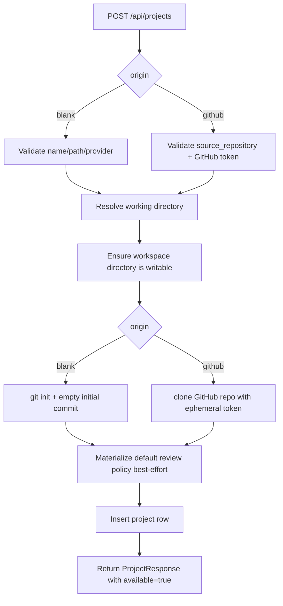
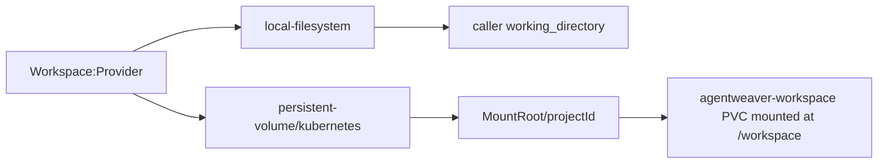

# Projects & Workspaces — Deep Dive

## Purpose & Scope (what a "project" is in Agentweaver)

A project is Agentweaver's durable container for repository state, ownership, default model/provider settings, workflow/review/sandbox defaults, and the workspace path that runs and teams use. The domain record stores the project id, name, origin, working directory, default branch, owner, provider settings, lifecycle state, timestamps, and optional workflow/review/sandbox/blueprint metadata (`packages/Agentweaver.Domain/Project.cs:3-69`). Project origins are either `blank` or `github`; GitHub projects carry `SourceRepository` (`packages/Agentweaver.Domain/ProjectOrigin.cs:3-21`).

At the API boundary, projects are created from a request containing `name`, `origin`, `source_repository`, `working_directory`, provider/model defaults, and optional blueprint data (`apps/Agentweaver.Api/Contracts/Dtos.cs:530-552`). The response echoes the durable record plus runtime availability (`apps/Agentweaver.Api/Contracts/Dtos.cs:571-590`).

## Project Lifecycle

The HTTP handler validates `name`, `origin`, `source_repository`, and `working_directory`, validates any blueprint before creating storage, then dispatches to `CreateBlankAsync` or `CreateFromGitHubAsync` (`apps/Agentweaver.Api/Endpoints/ProjectEndpoints.cs:33-129`). Creation returns `201 /api/projects/{id}`; when a blueprint is applied, the handler re-reads the project so workflow/review/sandbox defaults are reflected (`apps/Agentweaver.Api/Endpoints/ProjectEndpoints.cs:131-175`).

Blank project creation resolves a working directory, requires it to be empty or absent, ensures the workspace, initializes a Git repository on `main`, writes a best-effort default review policy, and inserts the project (`apps/Agentweaver.Api/Projects/ProjectService.cs:48-115`). GitHub project creation additionally validates the URL, resolves a valid access token, clones the repository, derives the default branch, and inserts the project (`apps/Agentweaver.Api/Projects/ProjectService.cs:117-200`).

## ProjectService (create/list/get/delete; validation; persistence)

`ProjectService` owns lifecycle operations over an `IProjectStore`, an `IProjectWorkspaceProvider`, `ProjectGitInitializer`, and GitHub token services (`apps/Agentweaver.Api/Projects/ProjectService.cs:16-42`).

- **Create blank**: validates non-empty name, resolves the working directory, rejects non-empty existing directories, ensures workspace availability, initializes Git, then inserts the project (`apps/Agentweaver.Api/Projects/ProjectService.cs:57-105`, `apps/Agentweaver.Api/Projects/ProjectService.cs:389-396`).
- **Create from GitHub**: validates non-empty source repository and HTTPS GitHub URL, requires a valid GitHub access token, ensures the workspace, clones the repository, then inserts the project (`apps/Agentweaver.Api/Projects/ProjectService.cs:127-163`, `apps/Agentweaver.Api/Projects/ProjectService.cs:415-424`).
- **Rollback/compensation**: file-system or clone failures delete the created directory; DB insert failures also clean up the working directory (`apps/Agentweaver.Api/Projects/ProjectService.cs:72-80`, `apps/Agentweaver.Api/Projects/ProjectService.cs:190-198`).
- **List/get**: reads projects through the store and wraps them as `ProjectView` with a runtime `Available` flag (`apps/Agentweaver.Api/Projects/ProjectService.cs:360-377`).
- **Rename/settings/relink**: update name/provider defaults, or relink a project to an existing Git repository after validating the path, Git repo, optional remote match, and default branch (`apps/Agentweaver.Api/Projects/ProjectService.cs:207-280`).
- **Delete**: uses a compare-and-set `Active -> Deleting`, cancels non-terminal runs, releases the workspace, then deletes only the project row; files are preserved (`apps/Agentweaver.Api/Projects/ProjectService.cs:287-334`).

Persistence is abstracted by `IProjectStore` (`packages/Agentweaver.Domain/IProjectStore.cs:3-51`). The SQLite store inserts, gets, lists, renames, updates provider and working-directory fields, marks deleting, and deletes rows in `projects` (`apps/Agentweaver.Api/Infrastructure/SqliteProjectStore.cs:19-155`). The `projects` table contains the core identity/origin/workspace/provider/state/timestamp columns (`apps/Agentweaver.Api/Infrastructure/SqliteDb.cs:231-247`), while store mapping reconstructs the domain record and optional workflow/review/sandbox/blueprint fields (`apps/Agentweaver.Api/Infrastructure/SqliteProjectStore.cs:283-316`).

## Workspace Provisioning

Workspace provisioning is behind `IProjectWorkspaceProvider`: it resolves a canonical path, ensures the directory is present and writable, reports project availability, probes mount-root health, and releases runtime resources (`packages/Agentweaver.Domain/IProjectWorkspaceProvider.cs:8-56`).

Provider selection happens in DI: `Workspace:Provider=local` uses `LocalFilesystemWorkspaceProvider`; `persistent-volume` or `kubernetes` uses `PersistentVolumeWorkspaceProvider` (`apps/Agentweaver.Api/Program.cs:157-173`). Local mode honors the caller's path, creates the directory, probes writability, and treats availability as `Directory.Exists` (`apps/Agentweaver.Api/Infrastructure/LocalFilesystemWorkspaceProvider.cs:5-53`).

Persistent-volume mode ignores the requested path and maps every project to `{Workspace:PersistentVolume:MountRoot}/{projectId}` (`apps/Agentweaver.Api/Infrastructure/PersistentVolumeWorkspaceProvider.cs:29-36`). It creates the per-project directory, write-probes it, throws `WorkspaceUnavailableException` when the mount is missing or unwritable, and uses write probes for `IsAvailable` and mount-root health to avoid CIFS `Directory.Exists` false negatives (`apps/Agentweaver.Api/Infrastructure/PersistentVolumeWorkspaceProvider.cs:38-120`). In AKS, the API config sets `Workspace__Provider=persistent-volume` and `Workspace__PersistentVolume__MountRoot=/workspace` (`k8s/api-deployment.yaml:105-108`), mounts the `workspace` volume at `/workspace` (`k8s/api-deployment.yaml:144-148`), and binds that volume to the `agentweaver-workspace` PVC (`k8s/api-deployment.yaml:186-192`). The PVC is ReadWriteMany, `azurefile-csi-premium-uid1000`, 50Gi (`k8s/pvc-workspace.yaml:1-11`).

Git initialization is separate from workspace provisioning. Blank projects create an empty initial commit and rename HEAD to the requested default branch (`apps/Agentweaver.Api/Git/ProjectGitInitializer.cs:23-55`). GitHub projects clone with an ephemeral access token and derive the default branch from the cloned repo's HEAD (`apps/Agentweaver.Api/Git/ProjectGitInitializer.cs:57-90`). Per-run isolation uses git worktrees: `WorktreeManager` creates `agentweaver/{runId}` branches under `Worktrees:BasePath` and adds physical worktree directories (`apps/Agentweaver.Api/Git/WorktreeManager.cs:15-20`, `apps/Agentweaver.Api/Git/WorktreeManager.cs:44-57`, `apps/Agentweaver.Api/Git/WorktreeManager.cs:108-140`).

## ProjectView / DTOs (what the API returns to the UI)

`ProjectView` is a read model containing the stored `Project` plus `Available`, which is computed at read time by `IProjectWorkspaceProvider.IsAvailable` rather than persisted (`apps/Agentweaver.Api/Projects/ProjectView.cs:5-13`, `apps/Agentweaver.Api/Projects/ProjectService.cs:373-377`). `MapProject` converts that view to JSON fields such as `project_id`, `origin`, `source_repository`, `working_directory`, `default_branch`, provider/model defaults, `available`, `state`, blueprint provenance, and allowed workflow ids (`apps/Agentweaver.Api/Endpoints/ProjectEndpoints.cs:684-703`).

On the web side, `CreateProjectRequest` mirrors the API shape (`apps/web/src/api/types.ts:208-215`), `apiClient.createProject` posts to `/projects` (`apps/web/src/api/client.ts:162-164`), and the GitHub create dialog sends `source_repository` only for GitHub-origin projects (`apps/web/src/pages/ProjectGalleryPage.tsx:142-155`).

## API Endpoints

| Route | Verb | Handler | Purpose |
|---|---:|---|---|
| `/api/projects` | POST | `ProjectEndpoints.MapProjectEndpoints` | Create blank or GitHub project; validates request, optional blueprint, workspace, Git, and persistence (`apps/Agentweaver.Api/Endpoints/ProjectEndpoints.cs:33-197`). |
| `/api/server/info` | GET | `ProjectEndpoints.MapProjectEndpoints` | Public metadata including data directory and whether workspace paths are auto-assigned (`apps/Agentweaver.Api/Endpoints/ProjectEndpoints.cs:199-204`). |
| `/api/projects` | GET | `ProjectEndpoints.MapProjectEndpoints` | List caller-owned projects with availability (`apps/Agentweaver.Api/Endpoints/ProjectEndpoints.cs:206-216`). |
| `/api/projects/{id}` | GET | `ProjectEndpoints.MapProjectEndpoints` | Get one project after id parsing and owner check (`apps/Agentweaver.Api/Endpoints/ProjectEndpoints.cs:218-231`). |
| `/api/projects/{id}` | PATCH | `ProjectEndpoints.MapProjectEndpoints` | Rename a project (`apps/Agentweaver.Api/Endpoints/ProjectEndpoints.cs:234-255`). |
| `/api/projects/{id}/provider-settings` | PUT | `ProjectEndpoints.MapProjectEndpoints` | Update project-level provider/model defaults (`apps/Agentweaver.Api/Endpoints/ProjectEndpoints.cs:258-285`). |
| `/api/projects/{id}/relink` | POST | `ProjectEndpoints.MapProjectEndpoints` | Reconnect a project to a moved/restored working directory (`apps/Agentweaver.Api/Endpoints/ProjectEndpoints.cs:288-310`). |
| `/api/projects/{id}` | DELETE | `ProjectEndpoints.MapProjectEndpoints` | Confirm-gated delete; cancels active runs, releases workspace, deletes row (`apps/Agentweaver.Api/Endpoints/ProjectEndpoints.cs:313-345`). |
| `/api/projects/{id}/runs` | GET | `ProjectEndpoints.MapProjectEndpoints` | List runs scoped to a project, with optional filters (`apps/Agentweaver.Api/Endpoints/ProjectEndpoints.cs:347-403`). |
| `/api/projects/{id}/runs/{workflowRunId}` | GET | `ProjectEndpoints.MapProjectEndpoints` | Get one workflow run and enforce project isolation (`apps/Agentweaver.Api/Endpoints/ProjectEndpoints.cs:409-455`). |
| `/api/projects/{id}/runs` | POST | `ProjectEndpoints.MapProjectEndpoints` | Start a project run; checks project state and workspace availability (`apps/Agentweaver.Api/Endpoints/ProjectEndpoints.cs:457-620`). |
| `/api/projects/{id}/orchestrations` | POST | `ProjectEndpoints.MapProjectEndpoints` | Start a coordinator orchestration against the project's workspace/default branch (`apps/Agentweaver.Api/Endpoints/ProjectEndpoints.cs:628-681`). |
| `/api/projects/{id}/workspace/refs` | GET | `ProjectWorkspaceEndpoints.MapProjectWorkspaceEndpoints` | List base, active worktree, and assembly refs (`apps/Agentweaver.Api/Endpoints/ProjectWorkspaceEndpoints.cs:17-34`). |
| `/api/projects/{id}/workspace` | GET | `ProjectWorkspaceEndpoints.MapProjectWorkspaceEndpoints` | List files for a selected ref (`apps/Agentweaver.Api/Endpoints/ProjectWorkspaceEndpoints.cs:36-54`). |
| `/api/projects/{id}/workspace/files/{**path}/content` | GET | `ProjectWorkspaceEndpoints.MapProjectWorkspaceEndpoints` | Return file content for a selected ref, with path validation (`apps/Agentweaver.Api/Endpoints/ProjectWorkspaceEndpoints.cs:56-82`). |
| `/api/github/accounts` | GET | `AuthEndpoints` | UI repo-picker dependency: list authenticated user and orgs (`apps/Agentweaver.Api/Endpoints/AuthEndpoints.cs:203-289`). |
| `/api/github/repos?account=...` | GET | `AuthEndpoints` | UI repo-picker dependency: list owner/org repos as `full_name`, description, privacy, default branch (`apps/Agentweaver.Api/Endpoints/AuthEndpoints.cs:291-369`, `apps/Agentweaver.Api/Endpoints/AuthEndpoints.cs:386-397`). |
| `/healthz/workspace` | GET | `DiagnosticsEndpoints` | Workspace mount readiness probe; returns 503 when mount root is missing or read-only (`apps/Agentweaver.Api/Diagnostics/DiagnosticsEndpoints.cs:28-39`). |

## Relationship to Runs, Teams, Sandboxes

- **Runs and orchestrations**: `Run` carries `ProjectId`, `RepositoryPath`, `OriginatingBranch`, `WorktreePath`, and `WorktreeBranch` (`packages/Agentweaver.Domain/Run.cs:7-31`). `WorkflowRun` is always project-scoped (`packages/Agentweaver.Domain/WorkflowRun.cs:8-23`). Starting a project run uses the project working directory as `RepositoryPath`, the project default branch unless overridden, and the project provider/model defaults (`apps/Agentweaver.Api/Endpoints/ProjectEndpoints.cs:485-567`). Unverified: `docs/deep-dive/orchestration.md` does not exist in this checkout.
- **Teams/casting**: project runs can target an active team member; the API reads `.squad/agents/{agent}/charter.md` from the project workspace and rejects missing/inactive agents (`apps/Agentweaver.Api/Endpoints/ProjectEndpoints.cs:530-548`). Unverified: `docs/deep-dive/team-casting.md` does not exist in this checkout.
- **Sandboxes**: Kubernetes sandbox execution expects requested working directories to be under the configured workspace mount (`apps/Agentweaver.Api/Sandbox/KubernetesSandboxExecutor.cs:16-20`, `apps/Agentweaver.Api/Sandbox/KubernetesSandboxExecutor.cs:351-364`). The sandbox template mounts the same `agentweaver-workspace` PVC at `/workspace` (`k8s/sandbox-template.yaml:45-55`). See `docs/architecture/sandbox.md`.

## Failure Modes & Gotchas

- **Generic "Failed to create the project" 500**: the create endpoint maps uncaught exceptions to `500` with the exception type/message (`apps/Agentweaver.Api/Endpoints/ProjectEndpoints.cs:190-195`). Workspace-specific `WorkspaceUnavailableException` maps to `503 workspace_unavailable` (`apps/Agentweaver.Api/Endpoints/ProjectEndpoints.cs:184-188`); if an AKS create still returns the generic 500, inspect the inner exception around Git clone/init, SQLite insert, blueprint application, or an unexpected filesystem exception not wrapped as `WorkspaceUnavailableException`.
- **GitHub sign-in/token**: GitHub-origin project creation fails closed if no valid access token is available (`apps/Agentweaver.Api/Projects/ProjectService.cs:137-151`). The UI picker also needs `/api/github/accounts` and `/api/github/repos`; unauthenticated users can manually type `owner/repo`, but create still requires a token for clone (`apps/web/src/pages/ProjectGalleryPage.tsx:457-462`, `apps/Agentweaver.Api/Projects/ProjectService.cs:149-151`).
- **GitHub URL shape mismatch**: the domain comment says `SourceRepository` may be `owner/repo` (`packages/Agentweaver.Domain/ProjectOrigin.cs:8-12`) and the Git initializer can normalize `owner/repo` (`apps/Agentweaver.Api/Git/ProjectGitInitializer.cs:63-68`), but `ProjectService.CreateFromGitHubAsync` currently requires an HTTPS URL starting with `https://github.com/` (`apps/Agentweaver.Api/Projects/ProjectService.cs:127-130`, `apps/Agentweaver.Api/Projects/ProjectService.cs:415-424`). If the UI submits picker values like `owner/repo`, creation returns `400`, not 500.
- **Workspace PVC/mount**: in AKS, project paths are auto-assigned under `/workspace/{projectId}` and depend on the `agentweaver-workspace` PVC being mounted and writable (`apps/Agentweaver.Api/Infrastructure/PersistentVolumeWorkspaceProvider.cs:29-75`, `k8s/api-deployment.yaml:105-108`, `k8s/api-deployment.yaml:186-192`). Startup logs a warning if the mount-root health probe fails, and `/healthz/workspace` should keep unmounted pods out of service (`apps/Agentweaver.Api/Program.cs:328-340`, `apps/Agentweaver.Api/Diagnostics/DiagnosticsEndpoints.cs:28-39`).
- **Non-empty target directory**: create rejects an existing non-empty working directory and tells callers to relink instead (`apps/Agentweaver.Api/Projects/ProjectService.cs:389-396`).
- **Deleting state blocks new work**: deletion first marks the project `Deleting`; run and orchestration start return `409 project_deleting` for that state (`apps/Agentweaver.Api/Projects/ProjectService.cs:287-334`, `apps/Agentweaver.Api/Endpoints/ProjectEndpoints.cs:490-496`, `apps/Agentweaver.Api/Endpoints/ProjectEndpoints.cs:653-657`).
- **Workspace unavailable blocks runs**: even an existing project cannot start runs or orchestrations if `IsAvailable` fails (`apps/Agentweaver.Api/Endpoints/ProjectEndpoints.cs:494-497`, `apps/Agentweaver.Api/Endpoints/ProjectEndpoints.cs:656-657`).
