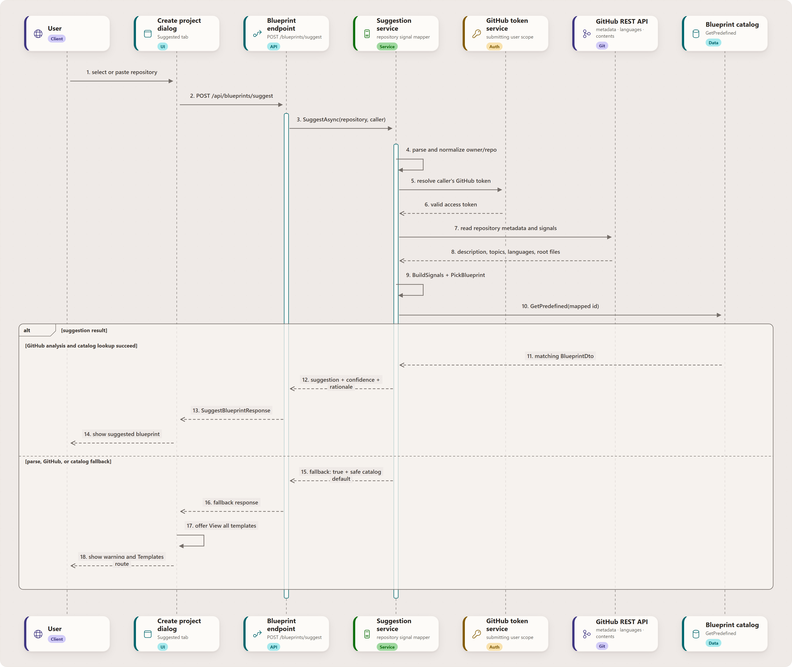

# Repository blueprint suggestions — Deep Dive

The **Suggested** blueprint flow recommends a catalog blueprint for a GitHub repository before the project is created. It is intentionally lightweight: the API reads repository signals from GitHub, maps those signals to one of the existing catalog blueprint ids, and returns a normal `BlueprintDto` for the create dialog to apply. It does not call a model; generation remains the separate **Generate** tab.

For the API contract see the [reference](../reference/repo-blueprint-suggestions.md); for the user flow see the [experience guide](../experience/repo-blueprint-suggestions.md).

## End-to-end flow

<!-- Rendered from ../diagrams/src/repo-blueprint-suggestions-fig1.json by docs/diagram-renderer +
     Playwright (Fluent-styled sequence diagram).
     Edit the JSON, then run `npm run docs:render-diagrams` and commit the
     regenerated PNG + .hash.txt. -->

1. **The dialog has a repository.** `CreateFromGitHubDialog` keeps the active repository in `d.sourceRepository` and passes it into the shared `BlueprintPanel`, whose tab strip starts the GitHub flow on `suggested` (`apps/web/src/pages/ProjectGalleryPage.tsx:676`, `apps/web/src/components/BlueprintPicker.tsx:371`).
2. **The client calls the new endpoint.** `SuggestedBlueprintPanel` calls `apiClient.suggestBlueprint(normalizedRepo)` only when the tab is active and the repo string is non-empty (`apps/web/src/components/BlueprintPicker.tsx:301`, `:305`). The client method posts `{ "repository": "owner/repo" }` to `/blueprints/suggest` (`apps/web/src/api/client.ts:186`).
3. **The endpoint validates shape and identity.** `POST /api/blueprints/suggest` rejects blank `repository` with `400`, resolves the authenticated caller, and passes `caller.User` to the suggestion service (`apps/Agentweaver.Api/Endpoints/BlueprintEndpoints.cs:53`, `:59`, `:63`).
4. **The service parses GitHub coordinates.** `TryParseOwnerRepo` accepts `owner/repo`, a GitHub URL, and a `.git` suffix, then normalizes to owner and repo strings (`apps/Agentweaver.Api/Blueprints/GitHubRepoBlueprintSuggestionService.cs:17`, `:116`).
5. **GitHub is read using the submitting user scope.** The service resolves the caller's GitHub token scope, gets a valid access token, and sends GitHub REST requests with `User-Agent`, `Accept: application/vnd.github+json`, and a bearer token when available (`GitHubRepoBlueprintSuggestionService.cs:48`, `:104`).
6. **Repository signals are collected.** The service reads repository metadata, languages, and root contents (`GitHubRepoBlueprintSuggestionService.cs:51`, `:58`, `:62`). `BuildSignals` exposes description, up to five topics, top languages, up to eight root files, and whether issues are enabled (`GitHubRepoBlueprintSuggestionService.cs:132`).
7. **Signals are mapped to catalog blueprint ids.** `PickBlueprint` scores text from name, description, topics, languages, and root file names. AI/LLM signals map to `blueprint-ai-agent-engineering`; docs/content-only signals map to `blueprint-content-authoring`; product/design-only signals map to `blueprint-product-management`; codebase signals or any non-Markdown language map to `blueprint-software-development` (`GitHubRepoBlueprintSuggestionService.cs:149`, `:163`, `:167`, `:171`, `:175`).
8. **Catalog lookup is safe.** If the mapped id is missing, the service falls back to `blueprint-software-development`, then the first available catalog blueprint (`GitHubRepoBlueprintSuggestionService.cs:70`). If GitHub analysis fails or no templates exist, the response sets `fallback: true` and confidence `0` (`GitHubRepoBlueprintSuggestionService.cs:89`, `:93`). The UI renders a warning plus **View all templates →**, which switches to the shared Templates tab rather than blocking project creation (`BlueprintPicker.tsx:323`, `:371`).

## Shared dialog and personal repository source

The suggestion panel is now one tab inside the shared **Blueprint** panel used by both new-project dialogs. Blank projects use **Generated | Templates**; GitHub projects use **Suggested | Templates | Generate**. The Templates tab is the same `StarterTemplatesSection` in both flows, and every compact **View all templates →** control routes to `setSelectedTab('templates')` (`apps/web/src/components/BlueprintPicker.tsx:209`, `:222`, `:371`; `apps/web/src/pages/ProjectGalleryPage.tsx:405`, `:676`).

The GitHub-side source list includes the signed-in user's personal account before organizations. The backend's `GET /api/github/accounts` builds a first `GitHubAccountResponse` from `GET https://api.github.com/user` with `type: "user"`, then appends orgs from `/user/orgs`; the UI displays `@{login}` with a **You** badge for that first entry (`apps/Agentweaver.Api/Endpoints/AuthEndpoints.cs:207`, `:249`, `:276`; `apps/web/src/pages/ProjectGalleryPage.tsx:642`). When that account is selected, `GET /api/github/repos?account=<login>` is routed to GitHub `/user/repos?affiliation=owner`, so repository search and recent rows include personal repos (`AuthEndpoints.cs:295`, `:333`; `apps/web/src/pages/ProjectGalleryPage.tsx:501`, `:625`).

## Why this is separate from generation

Suggestion chooses from catalog blueprints and returns quickly from GitHub metadata. Generation uses a natural-language description and may produce an inline blueprint plus generated workflow YAML. Keeping the tabs separate makes the user choice clear: **Suggested** means "best matching starter template for this repo," **Templates** means manual catalog choice, and **Generate** means bespoke blueprint from a prompt (`apps/web/src/pages/ProjectGalleryPage.tsx:676`, `apps/web/src/components/BlueprintPicker.tsx:236`, `:279`).

## Fallback behavior

Fallback is a product feature, not just an exception handler. A parse failure, unavailable GitHub metadata, canceled or failed GitHub calls, or an empty catalog returns a valid `SuggestBlueprintResponse` with `fallback: true`, `confidence: 0`, a rationale, no signals, and (when possible) the first catalog blueprint (`GitHubRepoBlueprintSuggestionService.cs:42`, `:55`, `:89`, `:93`). The UI renders a warning and a route to the Templates tab rather than blocking project creation (`BlueprintPicker.tsx:323`, `:371`).

## Source

| Concern | File |
|---|---|
| Suggested endpoint route and `400` blank-repository validation | `apps/Agentweaver.Api/Endpoints/BlueprintEndpoints.cs:53` |
| Suggest request/response wire fields | `apps/Agentweaver.Api/Blueprints/BlueprintDtos.cs:111` |
| GitHub repo parsing, signal collection, catalog mapping, fallback | `apps/Agentweaver.Api/Blueprints/GitHubRepoBlueprintSuggestionService.cs:17` |
| DI registration | `apps/Agentweaver.Api/Program.cs:603` |
| Web client method | `apps/web/src/api/client.ts:186` |
| Frontend response type | `apps/web/src/api/types.ts:219` |
| Suggested tab rendering and fallback UI | `apps/web/src/components/BlueprintPicker.tsx:279` |
| Shared Blueprint panel, tab strip, and Templates routing | `apps/web/src/components/BlueprintPicker.tsx:371` |
| Create-from-GitHub tab wiring | `apps/web/src/pages/ProjectGalleryPage.tsx:676` |
| Personal GitHub account and repository endpoints | `apps/Agentweaver.Api/Endpoints/AuthEndpoints.cs:207` |

## See also

- [Repository blueprint suggestions — Reference](../reference/repo-blueprint-suggestions.md)
- [Repository blueprint suggestions — Experience](../experience/repo-blueprint-suggestions.md)
- [Project generation model settings](./project-generation-model-settings.md)
- [Projects experience](../experience/projects.md)
- [API reference](../reference/api.md#blueprints)
