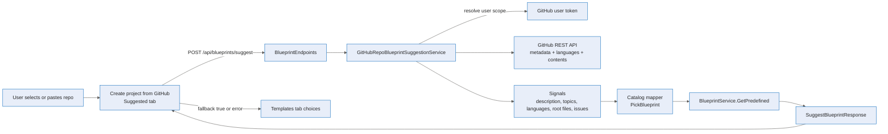

# Repository blueprint suggestions — Deep Dive

The **Suggested** blueprint flow recommends a catalog blueprint for a GitHub repository before the project is created. It is intentionally lightweight: the API reads repository signals from GitHub, maps those signals to one of the existing catalog blueprint ids, and returns a normal `BlueprintDto` for the create dialog to apply. It does not call a model; generation remains the separate **Generate** tab.

For the API contract see the [reference](../reference/repo-blueprint-suggestions.md); for the user flow see the [experience guide](../experience/repo-blueprint-suggestions.md).

## End-to-end flow

1. **The dialog has a repository.** `CreateFromGitHubDialog` keeps the active repository in `d.sourceRepository`, defaults the right-side tab to `suggested`, and resets to that tab whenever a repo is applied (`apps/web/src/pages/ProjectGalleryPage.tsx:516`, `:539`, `:660`).
2. **The client calls the new endpoint.** `SuggestedBlueprintPanel` calls `apiClient.suggestBlueprint(normalizedRepo)` only when the tab is active and the repo string is non-empty (`apps/web/src/components/BlueprintPicker.tsx:301`, `:305`). The client method posts `{ "repository": "owner/repo" }` to `/blueprints/suggest` (`apps/web/src/api/client.ts:186`).
3. **The endpoint validates shape and identity.** `POST /api/blueprints/suggest` rejects blank `repository` with `400`, resolves the authenticated caller, and passes `caller.User` to the suggestion service (`apps/Agentweaver.Api/Endpoints/BlueprintEndpoints.cs:53`, `:59`, `:63`).
4. **The service parses GitHub coordinates.** `TryParseOwnerRepo` accepts `owner/repo`, a GitHub URL, and a `.git` suffix, then normalizes to owner and repo strings (`apps/Agentweaver.Api/Blueprints/GitHubRepoBlueprintSuggestionService.cs:17`, `:116`).
5. **GitHub is read using the submitting user scope.** The service resolves the caller's GitHub token scope, gets a valid access token, and sends GitHub REST requests with `User-Agent`, `Accept: application/vnd.github+json`, and a bearer token when available (`GitHubRepoBlueprintSuggestionService.cs:48`, `:104`).
6. **Repository signals are collected.** The service reads repository metadata, languages, and root contents (`GitHubRepoBlueprintSuggestionService.cs:51`, `:58`, `:62`). `BuildSignals` exposes description, up to five topics, top languages, up to eight root files, and whether issues are enabled (`GitHubRepoBlueprintSuggestionService.cs:132`).
7. **Signals are mapped to catalog blueprint ids.** `PickBlueprint` scores text from name, description, topics, languages, and root file names. AI/LLM signals map to `blueprint-ai-agent-engineering`; docs/content-only signals map to `blueprint-content-authoring`; product/design-only signals map to `blueprint-product-management`; codebase signals or any non-Markdown language map to `blueprint-software-development` (`GitHubRepoBlueprintSuggestionService.cs:149`, `:163`, `:167`, `:171`, `:175`).
8. **Catalog lookup is safe.** If the mapped id is missing, the service falls back to `blueprint-software-development`, then the first available catalog blueprint (`GitHubRepoBlueprintSuggestionService.cs:70`). If GitHub analysis fails or no templates exist, the response sets `fallback: true` and confidence `0` (`GitHubRepoBlueprintSuggestionService.cs:89`, `:93`).

## Why this is separate from generation

Suggestion chooses from catalog blueprints and returns quickly from GitHub metadata. Generation uses a natural-language description and may produce an inline blueprint plus generated workflow YAML. Keeping the tabs separate makes the user choice clear: **Suggested** means "best matching starter template for this repo," **Templates** means manual catalog choice, and **Generate** means bespoke blueprint from a prompt (`apps/web/src/pages/ProjectGalleryPage.tsx:660`, `apps/web/src/components/BlueprintPicker.tsx:236`, `:278`).

## Fallback behavior

Fallback is a product feature, not just an exception handler. A parse failure, unavailable GitHub metadata, canceled or failed GitHub calls, or an empty catalog returns a valid `SuggestBlueprintResponse` with `fallback: true`, `confidence: 0`, a rationale, no signals, and (when possible) the first catalog blueprint (`GitHubRepoBlueprintSuggestionService.cs:42`, `:55`, `:89`, `:93`). The UI renders a warning and the top Templates choices rather than blocking project creation (`BlueprintPicker.tsx:323`).

## Source

| Concern | File |
|---|---|
| Suggested endpoint route and `400` blank-repository validation | `apps/Agentweaver.Api/Endpoints/BlueprintEndpoints.cs:53` |
| Suggest request/response wire fields | `apps/Agentweaver.Api/Blueprints/BlueprintDtos.cs:111` |
| GitHub repo parsing, signal collection, catalog mapping, fallback | `apps/Agentweaver.Api/Blueprints/GitHubRepoBlueprintSuggestionService.cs:17` |
| DI registration | `apps/Agentweaver.Api/Program.cs:603` |
| Web client method | `apps/web/src/api/client.ts:186` |
| Frontend response type | `apps/web/src/api/types.ts:219` |
| Suggested tab rendering and fallback UI | `apps/web/src/components/BlueprintPicker.tsx:278` |
| Create-from-GitHub tab wiring | `apps/web/src/pages/ProjectGalleryPage.tsx:516` |

## See also

- [Repository blueprint suggestions — Reference](../reference/repo-blueprint-suggestions.md)
- [Repository blueprint suggestions — Experience](../experience/repo-blueprint-suggestions.md)
- [Projects experience](../experience/projects.md)
- [API reference](../reference/api.md#blueprints)
