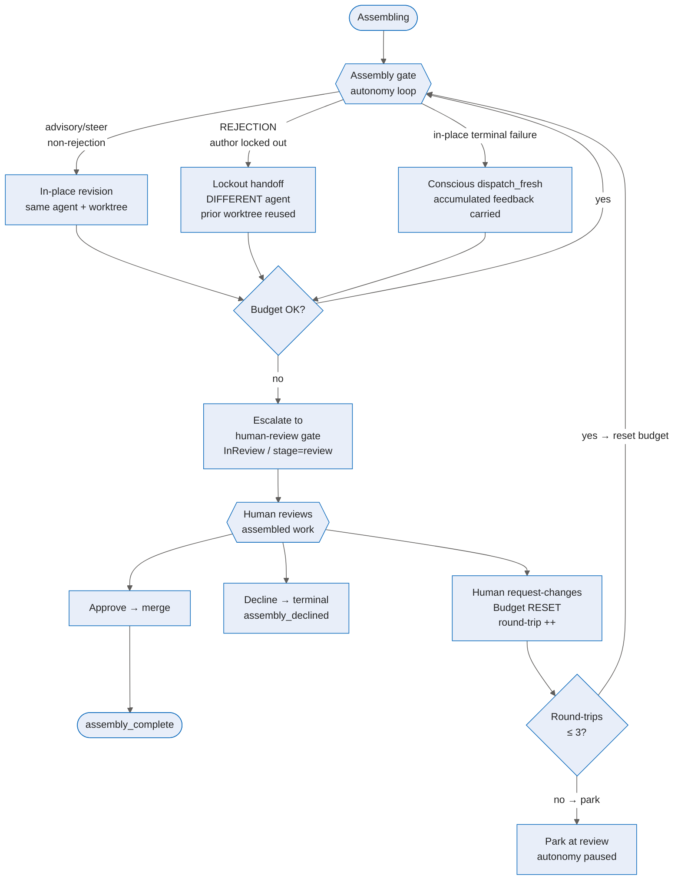

# Resilient assembly-review loop — Deep Dive

Shipped in **v0.9.17-rc1**, the resilient assembly-review loop eliminates the `assembly_blocked` dead-end that
previously stranded coordinator runs when the autonomous steering budget was exhausted. It also makes every
phase of the review cycle more robust: revisions carry full accumulated context, a rejected author's work is
handed to a different agent (not discarded), and child-turn commit faults now surface as typed, recoverable
events instead of silent stream-drain failures.

For config keys and status codes see the [reference](../reference/resilient-assembly-review.md). For the
operator-facing view of what changed see the [user guide](../experience/resilient-assembly-review.md).

## The problem: why runs used to dead-end

The assembly gate runs an autonomous steering loop to converge work toward approval. Before v0.9.17-rc1,
when that loop exhausted its budget the coordinator wrote a **terminal `WorkPlanStatus.AssemblyBlocked`**
and emitted `CoordinatorAssemblyBlocked`. Because `assembly_blocked` with reason
`steering_budget_exhausted` is not eligibility-recoverable, the reconciler could not restart the run — it
parked indefinitely waiting for an external signal that the platform never sent. The assembled work was
ready; a human could not reach it
(`apps/Agentweaver.Api/Coordinator/CoordinatorAssemblyService.cs:1735–1830` before this change).

Two coupled sub-problems drove that outcome:

1. **Budget-exhaustion wrote terminal instead of escalating.** The steering decider's own rationale
   described the intent as *"escalate to human review"*, but the code path wrote `AssemblyBlocked`.
2. **In-place revision fell back to context-dropping re-dispatch 2/3 of the time.** A stale
   `.git/index.lock` left by a prior crashed process caused the post-turn commit to fail; the three retry
   attempts all hit the same lock because nothing cleared it between attempts → rethrow → the child run
   failed → a fresh-pod `dispatch_fresh` started with only the latest round's feedback and a blank worktree
   (all prior context lost).

Each lost context round burned steering budget faster, hitting the terminal state sooner. The two fixes are
complementary: Fix-A raises the in-place convergence rate; Fix-B guarantees the tail still reaches a human.

## End-to-end resilient assembly flow

### Fix-B: budget-exhausted escalation (the headline change)

When `CoordinatorSteeringDecider.DecideAsync` returns `Proceed` (budget exhausted), the coordinator now
calls `EscalateToHumanReviewAsync`, which mirrors the existing `human-review` gate block verbatim:

1. **Guarded CAS transition** — `CoordinatorAssemblyStore.TryEscalateToInReviewAsync` does an
   `ExecuteUpdateAsync` `WHERE Status ∈ {AssemblySteering, Assembling} → InReview, stage "review"`. A
   concurrent replica that already set `InReview` no-ops (no double-escalation).
2. **Durable review-request** — `UpsertReviewRequestAsync` persists the escalation with reason
   `steering_budget_exhausted` and all accumulated gate feedback (bounded to 32 directives × 2000
   characters each, built by `BuildAccumulatedGateFeedbackAsync`) before settling the directive. A crash
   after the write recovers via the existing `planStatus == InReview → ResumeInReviewAsync` path at
   `CoordinatorAssemblyService.cs:532`; no new recovery code is needed.
3. **Settle the directive** — `MarkDirectiveAppliedAsync` is called only after the review request is
   durably open. The human then owns the loop; the directive is never blocked on how long the human takes.
4. **Live-await** — `AwaitReviewDecisionAsync` → `ApplyReviewDecisionAsync`. Approve → merge → complete.
   Decline → `assembly_declined` terminal. Request-changes → budget reset + fresh steering loop (below).

The emit sequence:
- `coordinator.steering_decision { decision="proceed", escalation="human_review" }`
- `coordinator.assembly_review_requested { gateKind="human-review", reason="steering_budget_exhausted", treeHash, integrationBranch, includedSubtaskIds }`

This is the same event the human-review gate emits on the normal happy path, so the UI opens the same
review card with the exhaustion reason visible.

**Why not make `AssemblyBlocked` recoverable?** `AssemblyBlocked` semantics = "the plan can't proceed,
wait for external input." `InReview` is the state whose full machinery (gate arm, deferred-decision poll,
crash recovery) is built for "a human must decide now." Reusing it is the root-cause fix; patching
`AssemblyBlocked` recovery would be symptom-plastering.

### Human-round-trip budget reset and backstop

When the human submits request-changes after an escalation, `ApplyReviewDecisionAsync` increments
`WorkPlan.HumanReviewRoundTrips` and, while the count is within the cap (default 3), calls
`CoordinatorSteeringDecider.ResetSteeringBudgetAsync`. This atomically zeros `SteeringIterations` and
the target subtasks' `RecoveryAttempts` (guarded CAS, single transaction) so autonomy can converge
again under the human's specific feedback. Without the reset, the human's very first steer would
immediately re-hit `Proceed` (a livelock). A visible `coordinator.steering` event records the round-trip
and reset decision for auditability.

Once `HumanReviewRoundTrips` exceeds the cap, the reset is skipped and the run re-parks at review
(autonomy paused, gate stays open) — never a terminal, never a loop.

**Loop-prevention invariant:** autonomous gates can never call `ResetSteeringBudgetAsync` on themselves.
Only `source == human-review` directives trigger the reset.

### Fix-A: reliable child-turn terminal emission

The child run graph previously had no failure→terminal edge. A post-turn commit fault rethrew → the watcher
recorded a `failed` step but did not terminalize → stream drained → `watch_stream_completed_without_terminal_event`
fallback → the child fell into conscious `dispatch_fresh` (context dropped). Fix-A has two layers:

**Layer 1 — stale lock recovery (FIX 1, the rate driver).** `AgentTurnExecutor.CommitChangesWithRetryAsync`
now calls `IWorktreeOperations.TryClearStaleIndexLock(worktreePath)` between retry attempts.
`WorktreeManager.ClearStaleIndexLock` resolves the actual `gitdir` (handles linked-worktree `.git`
pointer files), checks the `index.lock` mtime against `Coordinator:StaleLockThresholdSeconds` (default
15 s), verifies no live `git` process owns it, and only then deletes the file. The clear is best-effort:
on uncertainty it does NOT delete → the persistent fault surfaces as a typed failure terminal (Layer 2).
This converts lock-contention commit faults from context-dropping `dispatch_fresh` failures to clean
`assemble_ready` outcomes on the same worktree.

**Layer 2 — graph-native failure terminal (FIX 2, the invariant).** `AgentTurnOutput` now carries
nullable `TerminalFailureReason` and `TerminalFailureEvidence`. When all retry attempts are exhausted
(persistent fault), `AgentTurnExecutor` **returns** a typed failure output instead of rethrowing. The
child graph (`RunWorkflowFactory.cs`) routes via two conditional edges:

- `agent → child-assemble-ready` when `TerminalFailureReason is null` (success, existing path).
- `agent → child-turn-failed` (new terminal node) when `TerminalFailureReason is not null`.

`RunWatchLoopService.HandleTerminalOutputAsync` maps `ChildTurnFailedOutput` → child run Failed (visible,
structured) → subtask Failed → coordinator's `failedTargets` → conscious `dispatch_fresh` with accumulated
context. An unhandled in-turn throw still hits the watcher `ExecutorFailedEvent` backstop (defense-in-depth).

**Invariant:** for every child/revision run, after `agent.turn.end` the workflow yields exactly one terminal
`WorkflowOutputEvent`. `watch_stream_completed_without_terminal_event` is no longer reachable via the
handled commit-fault path.

### Context-preserving revisions and `AccumulatedReviewFeedback`

Before this change, the `dispatch_fresh` fallback overwrote `Subtask.RecoveryGuidance` with only the
latest round's feedback — prior feedback was silently discarded (amnesiac re-dispatch). Now both in-place
and fresh-dispatch revision paths use `BuildAccumulatedGateFeedbackAsync`, which reads all persisted
`SteeringDirective` rows (one per source/round, crash-safe by construction) and assembles a structured
feedback bundle keyed by gate source and round number. This is the `AccumulatedReviewFeedback` contract
shared between `CoordinatorAssemblyService` and `RunOrchestrator`.

The fresh-dispatch path (`ConsciousDispatchFreshFallbackAsync`) also carries a pointer to the prior child's
integration-branch diff, so the new agent builds on prior committed work instead of starting blank.

### Strict reviewer-rejection lockout

A **rejection** (any gate source with severity `request-changes`) triggers the lockout protocol:

1. The current author is atomically appended to `Subtask.LockedOutAgents` (a dormant column that existed
   in the schema since the initial migration but was never read/written; no new migration needed).
2. The coordinator selects a DIFFERENT eligible agent — `roster \ LockedOutAgents` via
   `CoordinatorOrchestratorExecutor.ResolveRoster` + `SelectRosterMember`.
3. The revision is dispatched via `RunOrchestrator.StartChildRevisionHandoffAsync`: the new agent
   **reuses the prior child's worktree and branch** (the work is preserved; only authorship rotates) and
   receives the full accumulated feedback bundle injected via the task path. A **new SDK session** is
   minted — the rotated agent never inherits the locked-out author's session identity.
4. The re-dispatched child honors the FIX 2 terminal-emission invariant identically (same conditional
   edge routing; same one-terminal guarantee).

Deadlock (all eligible agents locked out) or budget exhaustion on the lockout path routes to the
Fix-B human-review escalation — never to a terminal.

**Advisory / steer feedback (not a rejection)** keeps the same agent in place via the normal
`in_place_steer` path (`StartRevisionAsync`). The lockout disposition is derived from
`(source, severity)`: `request-changes` from a reviewer ⇒ rejection; everything else ⇒ guidance.

## Source

| Concern | File |
|---|---|
| Budget-exhausted escalation, `EscalateToHumanReviewAsync`, `ParkAtHumanReviewAsync` | `apps/Agentweaver.Api/Coordinator/CoordinatorAssemblyService.cs` |
| `BuildAccumulatedGateFeedbackAsync`, human round-trip wiring, `IsEscalationDurablyOpenAsync` | `apps/Agentweaver.Api/Coordinator/CoordinatorAssemblyService.cs` |
| `TryEscalateToInReviewAsync`, `IncrementHumanReviewRoundTripAsync` | `apps/Agentweaver.Api/Coordinator/CoordinatorAssemblyStore.cs` |
| `DefaultMaxHumanReviewRoundTrips`, `ResetSteeringBudgetAsync`, `BuildRationale` | `apps/Agentweaver.Api/Coordinator/CoordinatorSteeringDecider.cs` |
| `HumanReviewRoundTrips` column; migrations | `apps/Agentweaver.Api.Data/Memory/WorkPlan.cs`; `migrations/20260710004451_AddHumanReviewRoundTrips.cs` |
| Stale lock recovery `ClearStaleIndexLock`, `ResolveGitDir`, `IsAnyGitProcessRunning` | `apps/Agentweaver.Api/Git/WorktreeManager.cs` |
| `TryClearStaleIndexLock` seam | `packages/Agentweaver.AgentRuntime/Workflow/IWorktreeOperations.cs`; `apps/Agentweaver.Api/Runs/WorktreeOperationsAdapter.cs` |
| `AgentTurnOutput.TerminalFailureReason/Evidence`; `ChildTurnFailedOutput` | `packages/Agentweaver.AgentRuntime/Workflow/WorkflowMessages.cs` |
| Child graph failure→terminal edge; `child-turn-failed` terminal binding | `apps/Agentweaver.Api/Runs/RunWorkflowFactory.cs` |
| `ChildTurnFailedOutput` → Failed(reason) in watch loop | `apps/Agentweaver.Api/Runs/RunWatchLoopService.cs` |
| `StartChildRevisionHandoffAsync` (lockout context-carrying handoff) | `apps/Agentweaver.Api/Runs/RunOrchestrator.cs` |
| `Subtask.LockedOutAgents` (existing dormant column, now used) | `apps/Agentweaver.Api.Data/Memory/Subtask.cs` |
| `CommitChangesWithRetryAsync` stale-lock clear between attempts | `packages/Agentweaver.AgentRuntime/Workflow/AgentTurnExecutor.cs` |

## See also

- [Resilient assembly-review — Reference](../reference/resilient-assembly-review.md) — config keys and operational knobs.
- [Resilient assembly-review — User Guide](../experience/resilient-assembly-review.md) — what operators and users observe.
- [Unified autonomous steering](./unified-steering.md) — the `SteeringSignal` and `CoordinatorSteeringDecider` that route assembly feedback.
- [Coordinator internals](./coordinator-internals.md) — the broader assembly pipeline and collective assembly stage.
- [Review & merge](./review-merge.md) — the human-review gate mechanics Fix-B escalates into.
