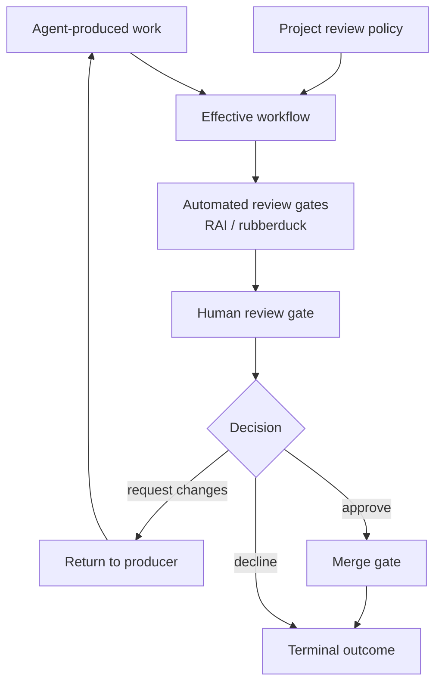
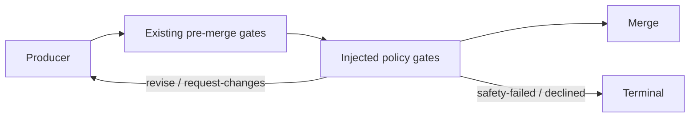
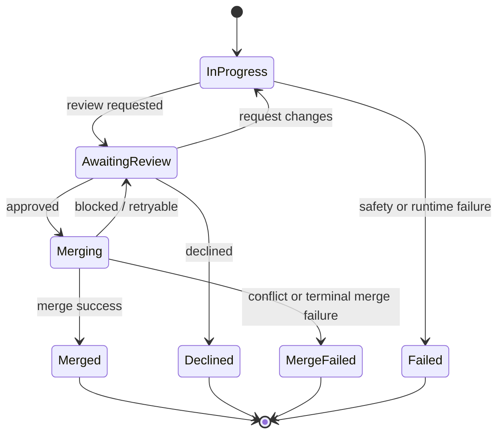
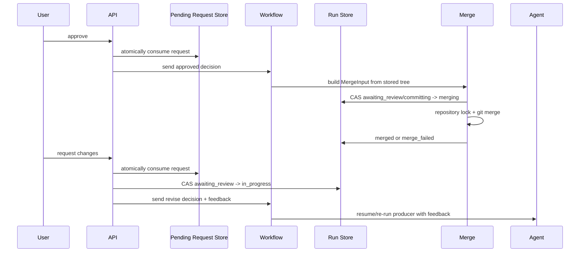
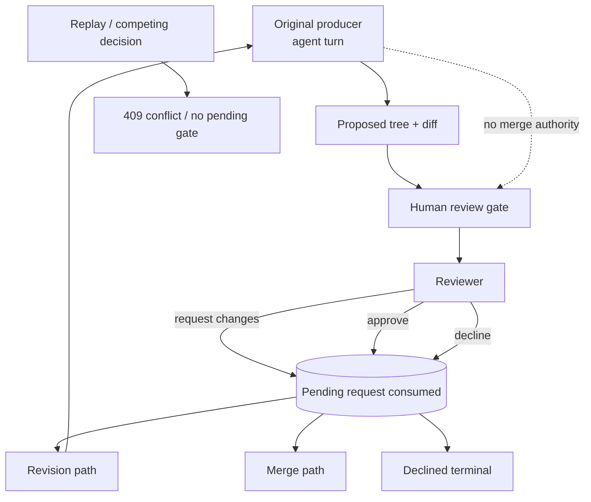
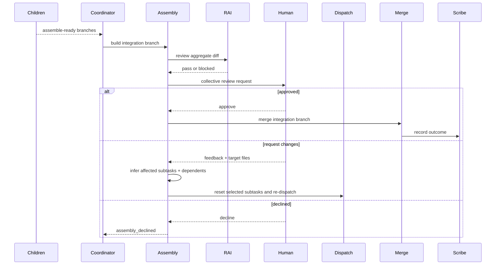
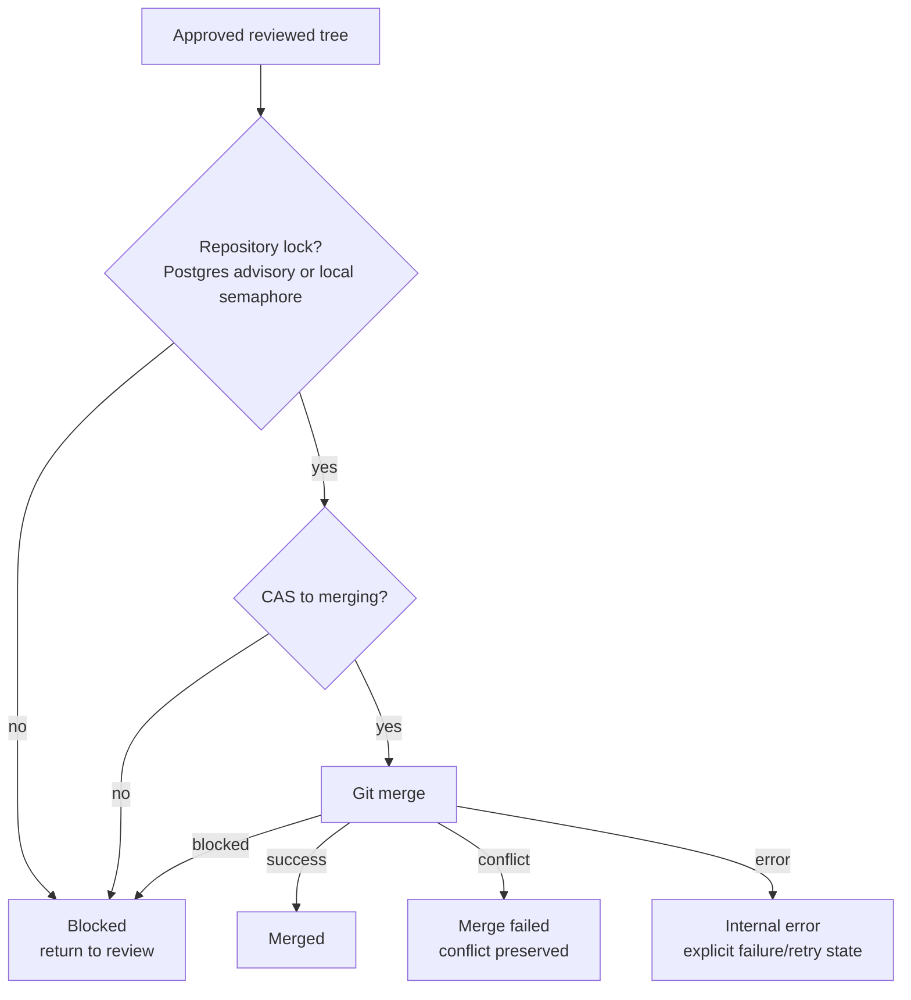

# Review & Merge — Conceptual Deep Dive

## Purpose & Mental Model

Agentweaver's review and merge subsystem answers one product-defining question: **how can agent-produced work move quickly while preserving human oversight at every irreversible step?**

The design separates three concerns that are easy to accidentally blur:

1. **Review policy** decides which gates a project requires.
2. **Review execution** pauses a live run and waits for a decision.
3. **Merge execution** applies an already-reviewed tree to the target branch under repository and database guards.

That separation is the reason the system can support standalone runs, coordinator child runs, automated reviewers, human approval, request-changes loops, and collective assembly without every path inventing its own safety model.

A useful rebuilding rule is: **review approves intent to proceed; merge proves the repository can actually accept the result.** Approval and merge are related, but they are not the same operation.

## Core Design Invariants

These invariants define the subsystem:

- **No hidden merge path.** Generated changes reach the target branch only through an explicit merge executor or coordinator assembly merge.
- **Gates are durable pause points.** A human review request is represented in run state and stream events, not only in an in-memory callback.
- **Review decisions are at-most-once.** Pending review requests are consumed atomically, and run-status compare-and-swap operations ensure only one approve, decline, request-changes, commit, or merge path wins.
- **Request changes loops back to work.** A reviewer can send feedback to the producer instead of choosing between blind approval and terminal rejection.
- **Automated review is policy, not authority by itself.** RAI and rubberduck gates can pass, request revision, or fail/route the graph, but the human-review gate is the explicit human-oversight point for irreversible actions in the default runtime path.
- **Merge is repository-serialized.** Even after approval, repository-level merge locks and run-status CAS guards prevent two merges from racing the same base checkout. PostgreSQL deployments use session advisory locks so this guard spans API replicas; SQLite/local development uses a process-wide semaphore.
- **Coordinator children do not merge.** Child runs produce assemble-ready branches. The parent coordinator assembles, reviews, merges, and records the integrated outcome.
- **Fail closed on unbound policy.** A policy step that cannot be safely bound to a runtime executor should prevent execution rather than silently weakening review.

## Review Policy as a Safety Overlay

A review policy is a named, per-project ordered list of review steps. It is intentionally separate from the workflow definition. Workflows describe the shape of execution; review policies describe the review gates that must be present before merge.

The supported step kinds are:

- **RAI** — Responsible AI review. It can pass, request revision, or fail safe on content-safety.
- **Rubberduck** — automated peer/sanity review. It can pass or request changes.
- **Human review** — explicit human approval. It can approve, request changes, or decline.

Policies are discovered from the project workspace under `.agentweaver/review-policies/`, with a built-in default available when nothing valid is configured. The built-in default is **RAI + human-review**. Project-authored policy files are loaded server-side, validated, and resolved by name. A project file with the same name as the built-in default replaces the built-in for that project. Duplicate project policy names are deterministic: the first valid file wins and later duplicates are reported invalid.

The policy composer performs a graph transform:

1. Find the workflow's merge node.
2. Find compatible pre-merge gates already present.
3. Absorb policy steps already represented by existing gates.
4. Inject missing gates immediately before merge, in policy order.
5. Wire pass/approve forward, revise/request-changes back to the producer, and terminal failures to terminal nodes.

If the workflow has no merge node, there is no irreversible merge action to gate, so the policy composition returns the workflow unchanged. That is a deliberate distinction: review policies gate merge; they are not a universal wrapper around every workflow shape.

## Human and Automated Reviewers

Agentweaver treats automated and human reviewers as different kinds of gates with the same graph vocabulary.

Automated gates are executable reviewers:

- RAI runs through a Responsible AI reviewer agent and emits a verdict.
- Rubberduck runs through an AI critique reviewer and maps PASS to forward progress and REVISE to request changes.

Human gates are request ports:

- The workflow emits a review request containing the run id, tree hash, diff, step count, and RAI context.
- The watch loop persists the run as awaiting review and stores a pending request.
- The client submits approve, request-changes, or decline.
- The pending request is consumed once and the live workflow resumes on the selected edge.

The key distinction is accountability. Automated reviewers can help decide whether work is ready for a person, but human review is the point where a named user approves or rejects the irreversible action. The run records the reviewer on merge-related status transitions when that reviewer is known.

## Single-Run Review Lifecycle

A standalone full run has the conceptual shape:

1. The agent produces a tree hash and diff in an isolated worktree.
2. RAI reviews the output.
3. A human-review request is emitted.
4. The run waits in `awaiting_review`.
5. The reviewer chooses approve, request changes, or decline.
6. Approval enters merge; request-changes returns to the agent; decline terminates.

The important part is the pause. `awaiting_review` is not a UI-only label. It is the durable point where the workflow can stop streaming, the browser can disconnect, and a later caller can still see that the run needs a decision.

## Approve vs Request Changes

Approve and request-changes both start from the same review gate, but they intentionally diverge.

Approval does not edit files. It authorizes the existing reviewed tree to proceed toward merge. Request-changes does edit the future path: it carries reviewer feedback back into the producer's next turn and increments the revision loop.

There are two request-changes surfaces:

- The review decision path can send `request_changes` through the live workflow so the graph loops back.
- The dedicated request-changes endpoint validates and sanitizes a comment, records a revision audit row, abandons stale checkpoints, clears run-scoped shell approvals, and starts a fresh revision workflow on the same worktree.

Both preserve the same invariant: after a reviewer rejects the current output, the existing tree is not merged; work returns to a producer path with explicit feedback.

## Reviewer Rejection and Lockout

The implemented lockout model has two layers.

First, the **agent-producer is locked out of merge**. The agent can produce a tree and can revise after feedback, but it has no path to call the review decision endpoint or merge its own output. Merge requires the review gate to produce an approval decision.

Second, the **pending review request is at-most-once**. Once a reviewer decision is consumed, competing or replayed decisions lose. The run status CAS is the durable backstop: if one request has already moved the run out of `awaiting_review`, later approve/request-changes/decline attempts conflict instead of racing.

Review authorization is owner-scoped: the run's submitting user, or equivalent authenticated identity, owns the review request. There is no separate rule that prevents a human requester from approving their own run as a distinct "original author." A strict "author cannot approve own work" rule between two human users would require an explicit persisted author/reviewer assignment model in addition to owner-scoped authorization.

## Coordinator Collective Review

Coordinator orchestration changes the unit of review. Child runs do not individually ask for human approval and do not merge. They stop at assemble-ready, carrying branch, tree hash, diff, and safety context back to the parent.

The parent coordinator then performs one collective assembly pipeline:

1. Ensure all subtasks are assembly-eligible.
2. Build an integration branch from child branches in dependency order.
3. Run collective RAI.
4. Ask for one human review over the combined output.
5. On approval, merge the integration branch and run Scribe.
6. On request-changes, infer affected subtasks and re-dispatch them.
7. On decline, terminalize the coordinator run as declined.

This design avoids a misleading review experience. Reviewing child diffs independently can miss cross-child interactions. The meaningful artifact is the integrated whole, so the human sees and approves the combined output.

## How Merge Actually Happens

Merge is deliberately more mechanical than review.

For a standalone run, the merge coordinator:

1. Canonicalizes and validates the repository path.
2. Acquires a repository merge lock.
3. CAS-transitions the run from `awaiting_review` or `committing` to `merging`.
4. Merges the worktree branch into the originating branch, verifying the expected tree hash.
5. On success, records `merged`, stores the merge commit hash, and removes the worktree.
6. On conflict, records `merge_failed`, stores conflicting files, and preserves the worktree for inspection.
7. On a retryable blocked outcome or internal fail-safe, reverts back to `awaiting_review` when possible.

For coordinator assembly, the merge target is the integration branch. A successful assembly merge terminalizes the coordinator run as completed with an assembly-complete reason rather than as a normal standalone `merged` run. That difference matters: the parent run represents an orchestration outcome, not a single worker's branch.

## Failure Modes and How to Reason About Them

### Policy file is malformed

The policy loader returns an invalid result for that file and continues loading other policies. Invalid files do not crash policy discovery, but they are excluded from the available set.

Reasoning model: policy discovery should be observable and resilient, not all-or-nothing.

### Active policy no longer resolves

The registry resolves the configured policy name if possible. If it cannot, it falls back to the built-in default.

Reasoning model: a missing custom policy should not silently remove safety gates.

### Policy injects a gate the runtime cannot bind

Runtime composition should fail closed with policy context rather than starting a workflow with an unbound gate.

Reasoning model: unknown review semantics are dangerous because they look like policy but do not execute.

### Review decision races

Two clients may submit decisions at nearly the same time. The pending request store and run-status CAS decide one winner. The loser sees conflict/no-pending behavior.

Reasoning model: review is an ownership transfer from waiting workflow to exactly one decision.

### Workflow disappears after restart

If a run is awaiting review but no live workflow can be resumed, the direct fallback can approve or decline using merge infrastructure. Request-changes is not supported on that direct path because there is no live workflow to resume; the run is restored to awaiting review so the caller can choose approve or decline.

Reasoning model: fallback can finish an irreversible path, but it should not pretend it can reconstruct a revision loop without a workflow.

### Merge is blocked

A blocked merge can return to awaiting review instead of failing terminally. This lets a human retry once the repository constraint clears.

Reasoning model: "approved" means the user accepted the diff, not that the repository was guaranteed writable at that instant.

### Merge conflicts

Conflicts become `merge_failed`, with conflict details and the worktree preserved where applicable.

Reasoning model: conflicts are not safe to auto-resolve under the review approval. The reviewed tree and the target branch no longer compose cleanly.

### Coordinator assembly has ineligible children

The assembly pipeline blocks before building or merging a partial result.

Reasoning model: collective review is all-or-nothing. A missing or failed child means the integrated output is not the reviewed outcome.

### Coordinator review times out

The assembly review gate has a timeout and can terminalize the assembly as failed with a review-timeout reason.

Reasoning model: a background coordinator pipeline must not remain parked forever with no explicit state.

## Trade-offs

- **Policy as overlay vs workflow-only review.** Overlay policies let teams change gates without editing workflow shape, but the composer must understand graph structure and avoid duplicate gates.
- **Owner-scoped review vs separate reviewer assignment.** Owner-scoped review is simple and matches current auth boundaries. A stricter two-person approval model would need persisted author/reviewer roles and UI/API enforcement.
- **Single collective review vs per-child review.** Collective review gives a truthful integrated diff. It delays human feedback until fan-in, and request-changes must infer which children need rework.
- **Direct fallback vs no fallback.** Fallback lets approval/decline complete after some restart scenarios. It intentionally does less than the live workflow to avoid inventing state.
- **Blocked merge returns to review.** This keeps runs recoverable, but clients must understand that approval can lead back to an awaiting-review state rather than a terminal result.

## Rebuilding Blueprint

If you were rebuilding this subsystem from scratch, implement these pieces in order:

1. Define durable run statuses: in progress, awaiting review, merging, merged, merge failed, declined, completed, failed, and coordinator assembly states.
2. Implement a workflow request gate that can pause execution and emit a durable review request.
3. Store pending review requests with owner identity and at-most-once consumption.
4. Implement review decisions: approve, request changes, decline.
5. Make request-changes feed sanitized reviewer feedback back into the producer and clear stale approvals/checkpoints.
6. Implement review policies as named, server-loaded, server-validated project configuration.
7. Compose policy gates before merge, absorbing existing compatible gates and failing closed on unsupported bindings.
8. Implement merge with both a repository lock and run-status CAS; use a distributed lock when multiple API replicas can serve the same project workspace.
9. Preserve conflict details and recoverable blocked states distinctly.
10. Trim coordinator child runs so they produce assemble-ready output only.
11. Implement coordinator assembly as one integration branch, one aggregate RAI pass, one human review, one merge, and one Scribe pass.
12. Add rejection routing for coordinator request-changes: infer affected children from target files/feedback, reset them, and re-dispatch.
13. Persist review/merge events so reload, reconnect, and postmortem inspection see the same story.

The central design principle is simple: **agents can propose and revise, automated reviewers can critique, but irreversible repository change passes through explicit review and guarded merge.**

## Where this lives

- `apps/Agentweaver.Api/ReviewPolicies/`
- `apps/Agentweaver.Api/Endpoints/RunEndpoints.cs`
- `apps/Agentweaver.Api/Endpoints/CoordinatorEndpoints.cs`
- `apps/Agentweaver.Api/Runs/`
- `apps/Agentweaver.Api/Workflows/`
- `apps/Agentweaver.Api/Coordinator/`
- `packages/Agentweaver.AgentRuntime/Workflow/`
- `packages/Agentweaver.Domain/`
