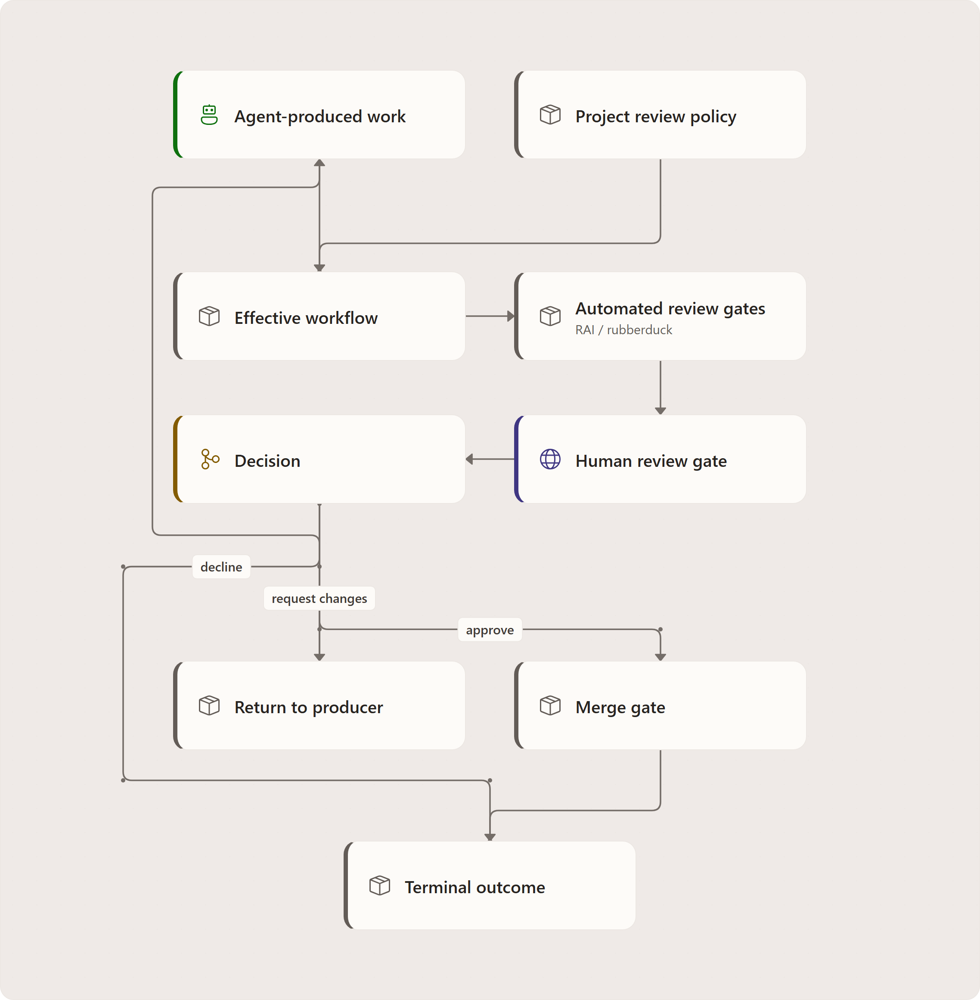
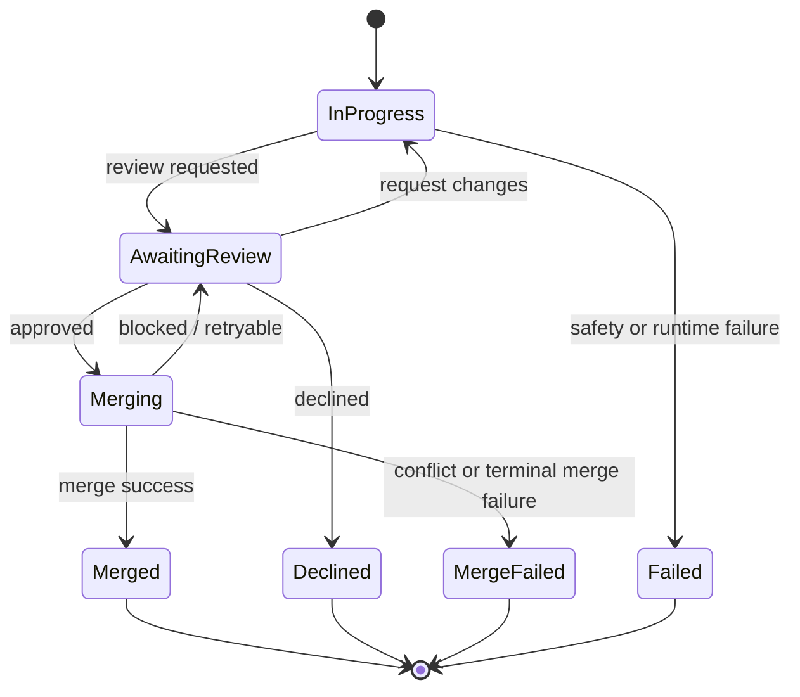
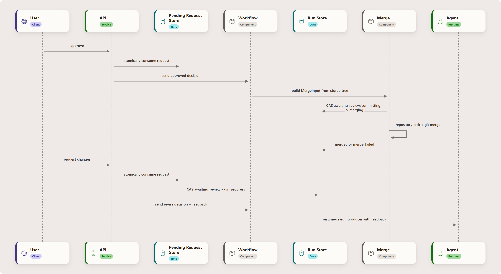
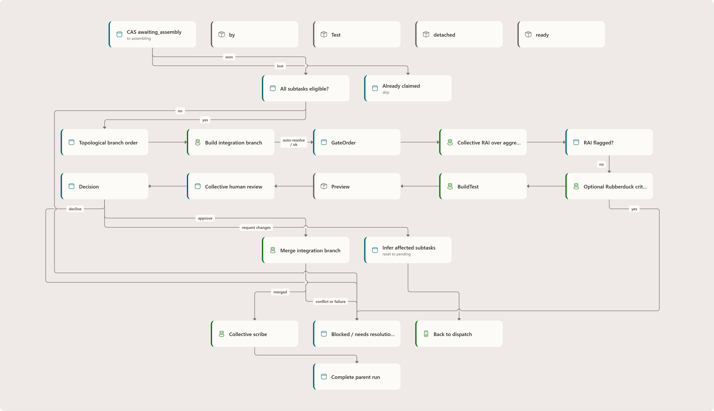
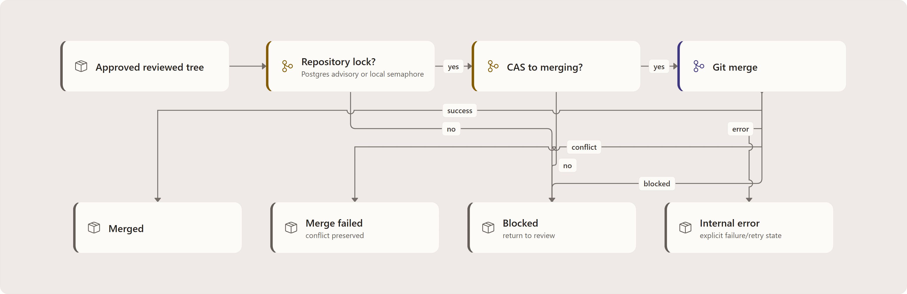

# Review & Merge — Conceptual Deep Dive

## Purpose & Mental Model

Agentweaver's review and merge subsystem answers one product-defining question: **how can agent-produced work move quickly while preserving human oversight at every irreversible step?**

The design separates three concerns that are easy to accidentally blur:

1. **Workflow declarations** identify the review gates and their execution edges.
2. **Review execution** pauses a live run and waits for a decision.
3. **Merge execution** applies an already-reviewed tree to the target branch under repository and database guards.

That separation is the reason the system can support standalone runs, coordinator child runs, automated reviewers, human approval, request-changes loops, and collective assembly without every path inventing its own safety model.

<!-- Editable A5 source: ../diagrams/src/review-merge-fig1.drawio; exported with draw.io Desktop 31.4.5.
     Inspections and arrow trace: ../diagrams/reviews/review-merge-fig1/v2/iteration-manifest.json. -->

A useful rebuilding rule is: **review approves intent to proceed; merge proves the repository can actually accept the result.** Approval and merge are related, but they are not the same operation.

## Core Design Invariants

These invariants define the subsystem:

- **No hidden merge path.** Generated changes reach the target branch only through an explicit merge executor or coordinator assembly merge.
- **Gates are durable pause points.** A human review request is represented in run state and stream events, not only in an in-memory callback.
- **Review decisions have arbitration guards.** Pending review requests are consumed atomically and status transitions use compare-and-swap. Matching terminal replays can return the existing result; competing active decisions can return conflict. Live and deferred delivery have different ordering, described below.
- **Request changes loops back to work.** A reviewer can send feedback to the producer instead of choosing between blind approval and terminal rejection.
- **Automated review is policy, not authority by itself.** RAI and rubberduck gates can pass, request revision, or fail/route the graph, but the human-review gate is the explicit human-oversight point for irreversible actions in the default runtime path.
- **Merge is repository-serialized.** Even after approval, repository-level merge locks and run-status CAS guards prevent two merges from racing the same base checkout. PostgreSQL deployments use session advisory locks so this guard spans API replicas; SQLite/local development uses a process-wide semaphore.
- **Coordinator children do not merge.** Child runs produce assemble-ready branches. The parent coordinator assembles, reviews, merges, and records the integrated outcome.
- **Fail closed on unbound workflow nodes.** An unsupported executable node must fail binding rather than silently disappear.

## Workflow-declared review gates

Review gates belong to the selected workflow definition. `RunWorkflowFactory.ResolveEffectiveWorkflowAsync` resolves the workflow and returns it unchanged; it does not load named project review-policy files or inject a policy overlay. Blueprint validation accepts only `review_policy: default` (`apps/Agentweaver.Api/Runs/RunWorkflowFactory.cs:1495–1517`; `apps/Agentweaver.Api/Blueprints/BlueprintService.cs:111–115`).

Relevant gate kinds include:

- **RAI** — Responsible AI review. It can pass, request revision, or fail safe on content-safety.
- **Rubberduck** — automated peer/sanity review. It can pass or request changes.
- **Build & Test** — automated verification of an applicable assembled code artifact.
- **Human review** — explicit human approval. It can approve, request changes, or decline.

The runtime binds declared nodes and edges to concrete executors. Compatibility adapters and historical comments mentioning policy-prefixed gates do not establish a configurable registry or composer. See [Binding declarative nodes to runtime execution](workflow-engine.md#binding-declarative-nodes-to-runtime-execution).

The lifecycle below describes a **review-bearing standalone workflow**, not a guarantee that every custom workflow declares the same gates. Coordinator children use a separate trimmed graph; their parent resolves applicable aggregate gates from its selected workflow.

## Human and Automated Reviewers

Agentweaver treats automated and human reviewers as different kinds of gates with the same graph vocabulary.

Automated gates are executable reviewers:

- RAI runs through a Responsible AI reviewer agent and emits a verdict.
- Rubberduck runs through an AI critique reviewer and maps PASS to forward progress and REVISE to request changes.

Human gates are request ports:

- The workflow emits a review request containing the run id, tree hash, diff, step count, and RAI context.
- The watch loop persists the run as awaiting review and stores a pending request.
- The client submits approve, request-changes, or decline.
- The pending request is consumed once and the live workflow resumes on the selected edge.

The key distinction is accountability. Automated reviewers can help decide whether work is ready for a person, but human review is the point where a named user approves or rejects the irreversible action. The run records the reviewer on merge-related status transitions when that reviewer is known.

## Single-Run Review Lifecycle

A standalone workflow with RAI, human review, and merge has the conceptual shape:

1. The agent produces a tree hash and diff in an isolated worktree.
2. RAI reviews the output.
3. A human-review request is emitted.
4. The run waits in `awaiting_review`.
5. The reviewer chooses approve, request changes, or decline.
6. Approval enters merge; request-changes returns to the agent; decline terminates.

```mermaid
stateDiagram-v2
    [*] --> InProgress
    InProgress --> AwaitingReview: review requested
    AwaitingReview --> Merging: approved
    AwaitingReview --> InProgress: request changes
    AwaitingReview --> Declined: declined
    Merging --> Merged: merge success
    Merging --> AwaitingReview: blocked / retryable
    Merging --> MergeFailed: conflict or terminal merge failure
    InProgress --> Failed: safety or runtime failure
    Merged --> [*]
    Declined --> [*]
    MergeFailed --> [*]
    Failed --> [*]
```

The important part is the pause. `awaiting_review` is not a UI-only label. It is the durable point where the workflow can stop streaming, the browser can disconnect, and a later caller can still see that the run needs a decision.

## Approve vs Request Changes

Approve and request-changes both start from the same review gate, but they intentionally diverge.

<!-- Editable A5 source: ../diagrams/src/review-merge-fig5.drawio; exported with draw.io Desktop 31.4.5.
     Inspections and arrow trace: ../diagrams/reviews/review-merge-fig5/v2/iteration-manifest.json. -->

Approval does not edit files. It authorizes the existing reviewed tree to proceed toward merge. Request-changes does edit the future path: it carries reviewer feedback back into the producer's next turn and increments the revision loop.

For `POST /api/runs/{id}/review`, the ordering is explicit (`apps/Agentweaver.Api/Endpoints/RunEndpoints.cs:845–1053`):

| Path | Arbitration and effect |
|---|---|
| Local live approval | Consume the pending request, then send the decision to the workflow. Approval does **not** CAS the run to `merging` in the HTTP handler; the merge executor later acquires the repository lock **before** its merge CAS. |
| Local live request-changes / decline | CAS `awaiting_review` to `in_progress` / `declined` **before** removing the pending request, then resume the workflow. |
| No local workflow, durable pending request exists | Persist the deferred decision first; request-changes/decline then attempt their status CAS. The owner workflow consumes the deferred response. An approval response labelled `merging` is not proof that the merge CAS or Git merge has occurred. |
| Neither live workflow nor pending request | Use direct approval/decline fallback. Direct request-changes returns `409` and restores `awaiting_review`; it cannot reconstruct a revision workflow. |
| Replay / competing caller | Missing pending requests or losing status transitions can return `409`; a matching already-merged approval or already-declined non-approval returns the existing terminal result. |

There are two request-changes surfaces:

- The review decision path can send `request_changes` through the live workflow so the graph loops back.
- The dedicated request-changes endpoint validates and sanitizes a comment, records a revision audit row, abandons stale checkpoints, clears run-scoped shell approvals, and starts a fresh revision workflow on the same worktree.

Both preserve the same invariant: after a reviewer rejects the current output, the existing tree is not merged; work returns to a producer path with explicit feedback.

## Reviewer Rejection and Lockout

The implemented lockout model has two layers.

First, **workflow production and review are distinct responsibilities**. In a review-bearing workflow, the agent executor proposes a tree; the review decision resumes the graph toward revision, decline, or guarded merge. This is not a claim that every custom workflow enforces two-person approval.

Second, **pending consumption and status transitions arbitrate active decisions**. A consumed live gate cannot accept another response. Losing CAS operations return conflict, while matching already-terminal replays can return the recorded result. These guards are not a separate agent-author rotation rule.

The [approval and request-changes sequence](#approve-vs-request-changes) shows the shared pending-request and CAS arbitration; a second lockout diagram would duplicate it.

The standalone endpoint requires run access at `ProjectRole.Contributor`; an additional pending-request owner check applies to projectless legacy runs (`RunEndpoints.cs:875`, `:936–938`, `:1008–1011`). The coordinator assembly gate has its own owner-scoped delivery contract. Neither is a general two-person rule preventing a human requester from approving their own run. Coordinator **agent-author rotation** is a different mechanism: a resumable rejected target may keep its author; a fresh-dispatch decision attempts scoped rotation, with a bounded same-author fallback when no alternate is eligible. See [resilient reviewer rejection](resilient-assembly-review.md#resumability-aware-reviewer-rejection).

## Coordinator Collective Review

Coordinator orchestration changes the unit of review. Child runs do not individually ask for human approval and do not merge. They stop at assemble-ready, carrying branch, tree hash, diff, and safety context back to the parent.

The parent coordinator then performs one collective assembly pipeline:

1. Ensure all subtasks are assembly-eligible.
2. Build an integration branch from child branches in dependency order.
3. Resolve workflow-declared aggregate gates and Build & Test applicability; run those gates in their resolved order.
4. At the authored human gate, persist one review request over the combined output. Collective RAI RED also parks at durable human review; RAI REVISE enters explicit steering, with durable human escalation when the decider chooses `Proceed`.
5. On approval, continue any remaining authored gates, then merge the integration branch into the originating branch and run Scribe.
6. On request-changes, scope structured target files and dependent rebuilds, then let the coordinator explicitly choose in-place revision, fresh dispatch, escalation, or advisory continuation. Do not infer a reset from feedback prose.
7. On decline, terminalize the coordinator run as declined.

<!-- Editable A5 source: ../diagrams/src/coordinator-internals-fig4.drawio; exported with draw.io Desktop 31.4.5.
     Inspections and arrow trace: ../diagrams/reviews/coordinator-internals-fig4/v2/iteration-manifest.json. -->

This design avoids a misleading review experience. Reviewing child diffs independently can miss cross-child interactions. The meaningful artifact is the integrated whole, so the human sees and approves the combined output.

## How Merge Actually Happens

Merge is deliberately more mechanical than review.

For a standalone run, the merge coordinator:

1. Canonicalizes and validates the repository path.
2. Acquires a repository merge lock.
3. Attempts the transition from `awaiting_review` or `committing` to `merging`; if the CAS loses, it permits an already-`merging` run while holding the repository lock, otherwise releases the lock and fails (`MergeCoordinator.cs:50–62`).
4. Merges the worktree branch into the originating branch, verifying the expected tree hash.
5. On success, records `merged`, stores the merge commit hash, and removes the worktree.
6. On conflict, records `merge_failed`, stores conflicting files, and preserves the worktree for inspection.
7. On a retryable blocked outcome or internal fail-safe, reverts back to `awaiting_review` when possible.

For coordinator assembly, the integration branch is the **source**, merged into the originating branch. A successful assembly merge terminalizes the coordinator run as completed with an assembly-complete reason rather than as a normal standalone `merged` run. That difference matters: the parent run represents an orchestration outcome, not a single worker's branch.

<!-- Editable A5 source: ../diagrams/src/review-merge-fig4.drawio; exported with draw.io Desktop 31.4.5.
     Inspections and arrow trace: ../diagrams/reviews/review-merge-fig4/v2/iteration-manifest.json. -->

## Failure Modes and How to Reason About Them

### Workflow cannot resolve or bind

Invalid workflow resolution throws `WorkflowBindException`; executable nodes must bind to supported runtime behavior. There is no project policy-file discovery or overlay fallback to diagnose.

Reasoning model: a declared gate must execute, not merely appear in configuration.

### Review decision races

Two clients may submit decisions at nearly the same time. The pending request store and run-status CAS decide one winner. The loser sees conflict/no-pending behavior.

Reasoning model: review is an ownership transfer from waiting workflow to exactly one decision.

### Workflow disappears after restart

If a run is awaiting review but no live workflow can be resumed, the direct fallback can approve or decline using merge infrastructure. Request-changes is not supported on that direct path because there is no live workflow to resume; the run is restored to awaiting review so the caller can choose approve or decline.

Reasoning model: fallback can finish an irreversible path, but it should not pretend it can reconstruct a revision loop without a workflow.

### Merge is blocked

A blocked merge can return to awaiting review instead of failing terminally. This lets a human retry once the repository constraint clears.

Reasoning model: "approved" means the user accepted the diff, not that the repository was guaranteed writable at that instant.

### Merge conflicts

Conflicts become `merge_failed`, with conflict details and the worktree preserved where applicable.

Reasoning model: conflicts are not safe to auto-resolve under the review approval. The reviewed tree and the target branch no longer compose cleanly.

### Coordinator assembly has ineligible children

The assembly pipeline blocks before building or merging a partial result.

Reasoning model: collective review is all-or-nothing. A missing or failed child means the integrated output is not the reviewed outcome.

### Coordinator review survives a long wait or restart

The human assembly gate waits indefinitely until a decision or cancellation. Shutdown leaves `in_review` recoverable. `ResumeInReviewAsync` uses the persisted integration branch and tree hash: it applies a persisted decision or re-arms the gate **without rebuilding**. Only missing/incomplete review metadata falls back to rebuilding (`CoordinatorAssemblyService.cs:1321–1385`).

Reasoning model: an explicit, durable human wait is not a failed autonomous worker.

## Trade-offs

- **Declared review vs policy injection.** Gate changes belong to workflow definitions; there is no separate configurable safety overlay.
- **Run access vs separate reviewer assignment.** Project contributor access and legacy/assembly owner checks are not two-person approval. That would require a separate persisted assignment model and enforcement.
- **Single collective review vs per-child review.** Collective review gives a truthful integrated diff. It delays human feedback until fan-in; structured target files and explicit steering limit the scope of rework.
- **Direct fallback vs no fallback.** Fallback lets approval/decline complete after some restart scenarios. It intentionally does less than the live workflow to avoid inventing state.
- **Blocked merge returns to review.** This keeps runs recoverable, but clients must understand that approval can lead back to an awaiting-review state rather than a terminal result.

## Rebuilding Blueprint

If you were rebuilding this subsystem from scratch, implement these pieces in order:

1. Define durable run statuses: in progress, awaiting review, merging, merged, merge failed, declined, completed, failed, and coordinator assembly states.
2. Implement a workflow request gate that can pause execution and emit a durable review request.
3. Store pending review requests with owner identity and at-most-once consumption.
4. Implement review decisions: approve, request changes, decline.
5. Make request-changes feed sanitized reviewer feedback back into the producer and clear stale approvals/checkpoints.
6. Declare review gates and their decision edges in validated workflow definitions.
7. Bind declared gates to executable behavior; fail closed on unsupported bindings.
8. Implement merge with both a repository lock and run-status CAS; use a distributed lock when multiple API replicas can serve the same project workspace.
9. Preserve conflict details and recoverable blocked states distinctly.
10. Trim coordinator child runs so they produce assemble-ready output only.
11. Resolve applicable authored aggregate gates, persist human review, then merge the integration source into the originating branch and run Scribe.
12. Route structured request-changes through an explicit steering decision; preserve in-place context where resumable and scope fresh work to implicated subtasks plus dependents.
13. Persist review/merge events so reload, reconnect, and postmortem inspection see the same story.

The central design principle is simple: **agents can propose and revise, automated reviewers can critique, but irreversible repository change passes through explicit review and guarded merge.**

## Where this lives

- `apps/Agentweaver.Api/Endpoints/RunEndpoints.cs`
- `apps/Agentweaver.Api/Endpoints/CoordinatorEndpoints.cs`
- `apps/Agentweaver.Api/Runs/`
- `apps/Agentweaver.Api/Workflows/`
- `apps/Agentweaver.Api/Coordinator/`
- `packages/Agentweaver.AgentRuntime/Workflow/`
- `packages/Agentweaver.Domain/`

<!-- diagram-context:coordinator-internals-fig4:start -->

Diagram details and constraints

<table><thead><tr><th>Element</th><th>Contract</th></tr></thead><tbody>
<tr><td>title</td><td>Collective assembly and review</td></tr>
<tr><td>takeaway</td><td>RED parks durably for a human. REVISE enters explicit steering, not RaiBlocked.</td></tr>
<tr><td>group-title-0</td><td>CLAIM AND AGGREGATE</td></tr>
<tr><td>group-title-1</td><td>AUTHORED CHECKS AND HUMAN WAIT</td></tr>
<tr><td>group-title-2</td><td>STEERING, RECOVERY AND COMPLETION</td></tr>
<tr><td>Claim + eligibility</td><td>Claim + eligibility</td></tr>
<tr><td>Claim + eligibility</td><td>No partial failed plan</td></tr>
<tr><td>Claim + eligibility</td><td>awaiting -&gt; assembling</td></tr>
<tr><td>Integration snapshot</td><td>Integration snapshot</td></tr>
<tr><td>Integration snapshot</td><td>Ordered child branches</td></tr>
<tr><td>Integration snapshot</td><td>branch / tree / diff</td></tr>
<tr><td>Applicable gates</td><td>Applicable gates</td></tr>
<tr><td>Applicable gates</td><td>Workflow-defined ordering</td></tr>
<tr><td>Applicable gates</td><td>non-code: omit build</td></tr>
<tr><td>Gate outcomes</td><td>Gate outcomes</td></tr>
<tr><td>Gate outcomes</td><td>Pass: next; REVISE: steer</td></tr>
<tr><td>Gate outcomes</td><td>RAI RED: human park</td></tr>
<tr><td>Normal human gate</td><td>Normal human gate</td></tr>
<tr><td>Normal human gate</td><td>Persist request, then wait</td></tr>
<tr><td>Normal human gate</td><td>approve: next gates</td></tr>
<tr><td>Safety / budget park</td><td>Safety / budget park</td></tr>
<tr><td>Safety / budget park</td><td>Durable human escalation</td></tr>
<tr><td>Safety / budget park</td><td>in_review / awaiting</td></tr>
<tr><td>Explicit steering</td><td>Explicit steering</td></tr>
<tr><td>Explicit steering</td><td>In-place, fresh or advisory</td></tr>
<tr><td>Explicit steering</td><td>Proceed: human park</td></tr>
<tr><td>Recovered review</td><td>Recovered review</td></tr>
<tr><td>Recovered review</td><td>Use saved branch and tree</td></tr>
<tr><td>Recovered review</td><td>no routine rebuild</td></tr>
<tr><td>Approved completion</td><td>Approved completion</td></tr>
<tr><td>Approved completion</td><td>Lock, merge, then Scribe</td></tr>
<tr><td>Approved completion</td><td>Scribe error: nonfatal</td></tr>
<tr><td>e0</td><td>eligible</td></tr>
<tr><td>e1</td><td>snapshot</td></tr>
<tr><td>e2</td><td>check</td></tr>
<tr><td>e3</td><td>pass</td></tr>
<tr><td>e4</td><td>human</td></tr>
<tr><td>e5</td><td>approve</td></tr>
<tr><td>e6</td><td>RED</td></tr>
<tr><td>e7</td><td>REVISE</td></tr>
<tr><td>e8</td><td>changes</td></tr>
<tr><td>e9</td><td>Proceed</td></tr>
<tr><td>e10</td><td>revision</td></tr>
<tr><td>e11</td><td>recover</td></tr>
<tr><td>e12</td><td>approved</td></tr>
<tr><td>e13</td><td>all done</td></tr>
<tr><td>groups</td><td>CLAIM AND AGGREGATE; AUTHORED CHECKS AND HUMAN WAIT; STEERING, RECOVERY AND COMPLETION</td></tr>
</tbody></table>

<!-- diagram-context:coordinator-internals-fig4:end -->

<!-- diagram-context:review-merge-fig1:start -->

Diagram details and constraints

<table><thead><tr><th>Element</th><th>Contract</th></tr></thead><tbody>
<tr><td>title</td><td>Review authorizes; merge still guards</td></tr>
<tr><td>takeaway</td><td>A review-bearing standalone workflow declares its gates; approval alone does not edit Git.</td></tr>
<tr><td>group-title-0</td><td>WORKFLOW AND CANDIDATE</td></tr>
<tr><td>group-title-1</td><td>REVIEW ALTERNATIVES</td></tr>
<tr><td>group-title-2</td><td>CONTINUATION AND GIT RESULT</td></tr>
<tr><td>Selected definition</td><td>Selected definition</td></tr>
<tr><td>Selected definition</td><td>Bind the authored graph</td></tr>
<tr><td>Selected definition</td><td>no injected project policy</td></tr>
<tr><td>Producer output</td><td>Producer output</td></tr>
<tr><td>Producer output</td><td>Capture tree and diff</td></tr>
<tr><td>Producer output</td><td>reviewable candidate</td></tr>
<tr><td>Declared review gate</td><td>Declared review gate</td></tr>
<tr><td>Declared review gate</td><td>Only when workflow includes it</td></tr>
<tr><td>Declared review gate</td><td>not universal to all graphs</td></tr>
<tr><td>Request changes</td><td>Request changes</td></tr>
<tr><td>Request changes</td><td>Return feedback to execution</td></tr>
<tr><td>Request changes</td><td>revision path</td></tr>
<tr><td>Approve</td><td>Approve</td></tr>
<tr><td>Approve</td><td>Allow workflow continuation</td></tr>
<tr><td>Approve</td><td>not direct file mutation</td></tr>
<tr><td>Decline</td><td>Decline</td></tr>
<tr><td>Decline</td><td>Persist declined terminal</td></tr>
<tr><td>Decline</td><td>no merge authorization</td></tr>
<tr><td>Continuation</td><td>Continuation</td></tr>
<tr><td>Continuation</td><td>Deliver workflow response</td></tr>
<tr><td>Continuation</td><td>remaining authored nodes</td></tr>
<tr><td>Merge coordinator</td><td>Merge coordinator</td></tr>
<tr><td>Merge coordinator</td><td>Lock and reviewed-tree guard</td></tr>
<tr><td>Merge coordinator</td><td>CAS before Git operation</td></tr>
<tr><td>Actual merge result</td><td>Actual merge result</td></tr>
<tr><td>Actual merge result</td><td>Merged, blocked or conflict</td></tr>
<tr><td>Actual merge result</td><td>internal errors distinct</td></tr>
<tr><td>e0</td><td>execute</td></tr>
<tr><td>e1</td><td>review</td></tr>
<tr><td>e2</td><td>changes</td></tr>
<tr><td>e3</td><td>approve</td></tr>
<tr><td>e4</td><td>decline</td></tr>
<tr><td>e5</td><td>feedback</td></tr>
<tr><td>e6</td><td>continue</td></tr>
<tr><td>e7</td><td>on merge</td></tr>
<tr><td>e8</td><td>result</td></tr>
<tr><td>groups</td><td>WORKFLOW AND CANDIDATE; REVIEW ALTERNATIVES; CONTINUATION AND GIT RESULT</td></tr>
</tbody></table>

<!-- diagram-context:review-merge-fig1:end -->

<!-- diagram-context:review-merge-fig4:start -->

Diagram details and constraints

<table><thead><tr><th>Element</th><th>Contract</th></tr></thead><tbody>
<tr><td>title</td><td>Guarded standalone merge</td></tr>
<tr><td>takeaway</td><td>Repository locking precedes CAS; reviewed-tree mismatch and conflicts are not success.</td></tr>
<tr><td>group-title-0</td><td>INPUT AND LOCK ADMISSION</td></tr>
<tr><td>group-title-1</td><td>STATUS GUARD AND GIT</td></tr>
<tr><td>group-title-2</td><td>OUTCOMES AND RELEASE</td></tr>
<tr><td>Reviewed input</td><td>Reviewed input</td></tr>
<tr><td>Reviewed input</td><td>Canonicalize repository path</td></tr>
<tr><td>Reviewed input</td><td>reviewed source + tree</td></tr>
<tr><td>Repository lock</td><td>Repository lock</td></tr>
<tr><td>Repository lock</td><td>Bounded acquisition wait</td></tr>
<tr><td>Repository lock</td><td>5-second wait</td></tr>
<tr><td>Repository busy</td><td>Repository busy</td></tr>
<tr><td>Repository busy</td><td>No acquired lock</td></tr>
<tr><td>Repository busy</td><td>LockFailed</td></tr>
<tr><td>TryStartMerging CAS</td><td>TryStartMerging CAS</td></tr>
<tr><td>TryStartMerging CAS</td><td>Reload if CAS loses</td></tr>
<tr><td>TryStartMerging CAS</td><td>already Merging may proceed</td></tr>
<tr><td>Guarded Git operation</td><td>Guarded Git operation</td></tr>
<tr><td>Guarded Git operation</td><td>Reviewed tree into origin</td></tr>
<tr><td>Guarded Git operation</td><td>while holding lock</td></tr>
<tr><td>Merged</td><td>Merged</td></tr>
<tr><td>Merged</td><td>Persist commit and status</td></tr>
<tr><td>Merged</td><td>best-effort cleanup</td></tr>
<tr><td>Blocked / conflict</td><td>Blocked / conflict</td></tr>
<tr><td>Blocked / conflict</td><td>Blocked: restore review</td></tr>
<tr><td>Blocked / conflict</td><td>conflict: MergeFailed</td></tr>
<tr><td>Internal error</td><td>Internal error</td></tr>
<tr><td>Internal error</td><td>Filtered exception handling</td></tr>
<tr><td>Internal error</td><td>revert / internal error</td></tr>
<tr><td>Release acquired lock</td><td>Release acquired lock</td></tr>
<tr><td>Release acquired lock</td><td>Every acquired-lock exit</td></tr>
<tr><td>Release acquired lock</td><td>finally</td></tr>
<tr><td>e0</td><td>validate</td></tr>
<tr><td>e1</td><td>busy</td></tr>
<tr><td>e2</td><td>locked</td></tr>
<tr><td>e3</td><td>allowed</td></tr>
<tr><td>e4</td><td>merged</td></tr>
<tr><td>e5</td><td>blocked</td></tr>
<tr><td>e6</td><td>error</td></tr>
<tr><td>e10</td><td>denied</td></tr>
<tr><td>groups</td><td>INPUT AND LOCK ADMISSION; STATUS GUARD AND GIT; OUTCOMES AND RELEASE</td></tr>
</tbody></table>

<!-- diagram-context:review-merge-fig4:end -->

<!-- diagram-context:review-merge-fig5:start -->

Diagram details and constraints

<table><thead><tr><th>Element</th><th>Contract</th></tr></thead><tbody>
<tr><td>title</td><td>Review API decision paths</td></tr>
<tr><td>takeaway</td><td>Authorize first. Deliver through the right path. Lock before any merge CAS.</td></tr>
<tr><td>group-title-0</td><td>ADMISSION AND REPLAY</td></tr>
<tr><td>group-title-1</td><td>DELIVERY ALTERNATIVES</td></tr>
<tr><td>group-title-2</td><td>CONTINUATION AND MERGE</td></tr>
<tr><td>Caller + access</td><td>Caller + access</td></tr>
<tr><td>Caller + access</td><td>Project contributor check</td></tr>
<tr><td>Caller + access</td><td>legacy: pending owner</td></tr>
<tr><td>Reviewable state?</td><td>Reviewable state?</td></tr>
<tr><td>Reviewable state?</td><td>Inspect status + pending</td></tr>
<tr><td>Reviewable state?</td><td>awaiting_review</td></tr>
<tr><td>Replay or conflict</td><td>Replay or conflict</td></tr>
<tr><td>Replay or conflict</td><td>Matching terminal: reuse</td></tr>
<tr><td>Replay or conflict</td><td>otherwise: 409</td></tr>
<tr><td>Live pending</td><td>Live pending</td></tr>
<tr><td>Live pending</td><td>Changes / decline use CAS</td></tr>
<tr><td>Live pending</td><td>approve: no merge CAS</td></tr>
<tr><td>Deferred pending</td><td>Deferred pending</td></tr>
<tr><td>Deferred pending</td><td>Persist the decision first</td></tr>
<tr><td>Deferred pending</td><td>then status transition</td></tr>
<tr><td>No live / no pending</td><td>No live / no pending</td></tr>
<tr><td>No live / no pending</td><td>Validate direct approval</td></tr>
<tr><td>No live / no pending</td><td>changes: 409</td></tr>
<tr><td>Consume + deliver</td><td>Consume + deliver</td></tr>
<tr><td>Consume + deliver</td><td>Send workflow response</td></tr>
<tr><td>Consume + deliver</td><td>live continuation</td></tr>
<tr><td>Repository lock</td><td>Repository lock</td></tr>
<tr><td>Repository lock</td><td>Only on reaching merge</td></tr>
<tr><td>Repository lock</td><td>lock before CAS</td></tr>
<tr><td>Merge CAS + Git</td><td>Merge CAS + Git</td></tr>
<tr><td>Merge CAS + Git</td><td>Guard reviewed tree input</td></tr>
<tr><td>Merge CAS + Git</td><td>release lock on exit</td></tr>
<tr><td>e0</td><td>check</td></tr>
<tr><td>e1</td><td>replay</td></tr>
<tr><td>e2</td><td>live</td></tr>
<tr><td>e3</td><td>deferred</td></tr>
<tr><td>e4</td><td>direct</td></tr>
<tr><td>e5</td><td>deliver</td></tr>
<tr><td>e6</td><td>on merge</td></tr>
<tr><td>e7</td><td>approve</td></tr>
<tr><td>e8</td><td>locked</td></tr>
<tr><td>groups</td><td>ADMISSION AND REPLAY; DELIVERY ALTERNATIVES; CONTINUATION AND MERGE</td></tr>
</tbody></table>

<!-- diagram-context:review-merge-fig5:end -->
