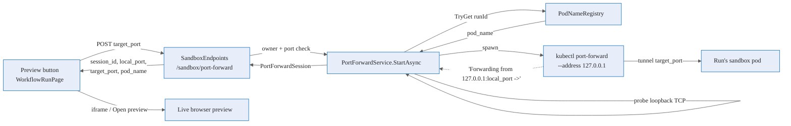

# Sandbox browser preview — Deep Dive

When an agent starts a server **inside its sandbox pod** — a dev server, a freshly built web app, a
debug endpoint — Agentweaver lets a human open a **live browser preview** of it, scoped to exactly that
one run's pod. This page explains how that path works end to end: from the button click in the run view,
through `PortForwardService`, to a `kubectl port-forward` tunnel and the loopback port the API exposes.

It is the inbound counterpart to the sandbox's default-deny egress: egress governs traffic *out* of the
pod; the preview is a deliberate, operator-initiated path *into* a single run's pod. It never widens the
pod's egress allowlist and it is not a capability the sandboxed agent can grant itself.

> This is a **Kubernetes-only** feature. On local/dev sandbox backends there is no claim pod to forward
> into, so neither the button nor the endpoints do anything. See the [Sandbox subsystem deep
> dive](./sandbox.md) for the backend-selection logic and [Sandbox pod execution](./sandbox-pod-execution.md)
> for the pod-per-run model this rides on.

## End-to-end flow

1. **The button.** `WorkflowRunPage.tsx` shows a **Preview** button only when the run is on the Kubernetes
   sandbox and is still active (`isKubernetesSandbox && runActive`). The backend is derived from the run's
   `sandbox.selected` event — the button appears only when `sandboxBackend === 'kubernetes-sandbox-claim'`.
2. **The request.** Clicking **Start** in the *Sandbox Preview* dialog calls
   `apiClient.startPortForward(runId, port)` → `POST /api/runs/{runId}/sandbox/port-forward` with the
   chosen `target_port` (the port the agent's server listens on *inside* the pod; the field defaults to
   `3000`).
3. **The endpoint.** `SandboxEndpoints` validates the port range, parses the run id, loads the run, and
   enforces ownership (`403`/`404`) before delegating to `PortForwardService.StartAsync`.
4. **Pod resolution.** `PortForwardService` resolves the pod via `IPodNameRegistry.TryGet(runId)` — the
   same registry the pod pill uses. No pod registered → `InvalidOperationException` → the endpoint returns
   `409 Conflict` (*"the run must be `in_progress` with an active Kubernetes sandbox"*).
5. **The tunnel.** It spawns `kubectl port-forward --address 127.0.0.1 pod/{podName} :{targetPort} -n
   {namespace}` (it shells `kubectl`; it does **not** call the Kubernetes API). It reads kubectl's
   `Forwarding from 127.0.0.1:<port> ->` line to learn the bound **loopback `local_port`** on the API host,
   then probes loopback TCP until the tunnel is ready (5 s ready timeout).
6. **The response.** The session is returned as `{ session_id, local_port, target_port, pod_name,
   started_at }`. The dialog confirms *"Preview active for port {target_port} on pod {pod_name}"*.

## What the backend returns — and the web-only `preview_url`

The backend returns a **loopback `local_port` on the API host, not a public URL.** The web client's
`PortForwardSessionDto` carries two **optional, web-only** fields — `preview_url` and `previewUrl` — that
the frontend reads to render an embedded `<iframe>` and an **Open preview** button. The backend does
**not** currently populate them, and the UI is honest about it: when no proxied URL is returned the dialog
says *"The API server did not return a proxied preview URL."* This keeps the documented behavior aligned
with the shipped code — the field exists for a future proxied-URL path, but today the live preview is the
loopback port the API bound.

## Session caps and limits

`PortForwardService` reserves a session slot under a lock before starting kubectl, enforcing two caps:

- **Per run:** default **3** concurrent sessions
  (`Sandbox:PortForward:MaxConcurrentSessionsPerRun`, fallback `:MaxPerRun`).
- **Global:** default **20** concurrent sessions across all runs
  (`Sandbox:PortForward:MaxConcurrentSessionsGlobal`, fallback `:MaxGlobal`).

Exceeding either raises `PortForwardLimitExceededException`, which `SandboxEndpoints` maps to
**`429 Too Many Requests`**. Each cap is floored at `1`. Sessions are keyed by run in `_sessionsByRun` and
globally in `_sessions`, both in-process concurrent dictionaries.

## Lifecycle and cleanup

Sessions live **only in memory, with no TTL** — there is no expiry timer. A session ends in exactly one of
these ways:

- **Explicit stop** — `DELETE /api/runs/{runId}/sandbox/port-forward/{sessionId}` → `PortForwardService.Stop`
  kills the kubectl process tree and releases the slot.
- **Run end** — `RunWatchLoopService.StopPortForwardsSafeAsync(runId)` unregisters the pod from
  `IPodNameRegistry` and stops every session listed for the run when the run completes.
- **kubectl exits on its own** — the process `Exited` handler removes the session and releases the slot.
- **API shutdown** — `PortForwardService.Dispose()` kills all remaining sessions.

Because the hybrid sandbox lifecycle can release and re-claim a pod across a suspension, a preview is valid
only while the *current* pod is bound. After a release/resume the pod name can change (the same reason the
pod pill name can change), and a new preview must be started against the re-claimed pod.

## Security and containment notes

- **Inbound only — no egress widening.** The tunnel is a path the operator opens *into* the pod; it never
  alters the pod's [default-deny egress allowlist](./sandbox.md#network-isolation-and-egress-allowlisting).
  The agent inside the sandbox cannot grant itself this path.
- **Scoped to one run's pod.** The run id resolves to a single bound pod via `PodNameRegistry`, so a
  preview can never cross into another run's pod.
- **Owner-gated.** Every call verifies the run exists and the caller owns it before any tunnel is created.
- **Loopback-bound.** kubectl binds `--address 127.0.0.1`; the forwarded port is reachable on the API host's
  loopback, not the public interface. The pod name and namespace are validated as DNS-1123 labels before
  kubectl is invoked.
- **Bounded blast radius.** Caps and explicit-per-port sessions keep the surface small; run-end cleanup
  guarantees no tunnel outlives its run.

## Source

| Concern | Where |
|---|---|
| Endpoints (`POST`/`GET`/`DELETE`) | `apps/Agentweaver.Api/Endpoints/SandboxEndpoints.cs` |
| Tunnel + caps + lifecycle | `apps/Agentweaver.Api/Sandbox/PortForwardService.cs` |
| Pod resolution by run id | `apps/Agentweaver.Api/Sandbox/IPodNameRegistry.cs` |
| Run-end cleanup | `apps/Agentweaver.Api/Runs/RunWatchLoopService.cs` (`StopPortForwardsSafeAsync`) |
| `PortForwardSessionDto` (web) | `apps/web/src/api/types.ts` |
| API client calls | `apps/web/src/api/client.ts` (`startPortForward`, `stopPortForward`, `listPortForwards`) |
| Preview button + dialog | `apps/web/src/pages/WorkflowRunPage.tsx` |

## See also

- [Sandbox browser preview — User Guide](../experience/sandbox-browser-preview.md) — the step-by-step user flow.
- [Sandbox browser preview — Reference](../reference/sandbox-browser-preview.md) — routes, DTO, status codes.
- [Sandbox pod execution](./sandbox-pod-execution.md) — the pod-per-run model and the pod pill.
- [Sandbox subsystem](./sandbox.md) — backend selection, claims, and egress allowlisting.
