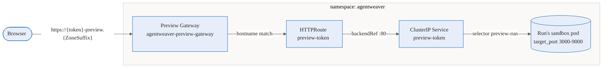
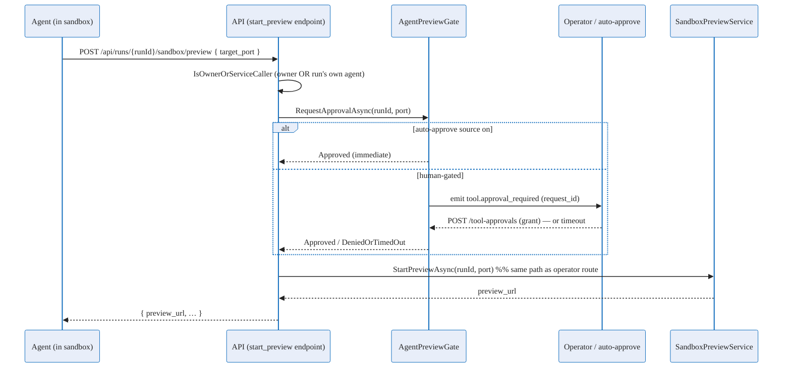

# Sandbox browser preview — Deep Dive

When an agent starts an HTTP server **inside its sandbox pod** — a dev server, a freshly built web app,
a debug endpoint — the **sandbox browser preview** exposes it to the user at a public HTTPS URL, scoped to
that one run. The preview is a **Gateway-direct reverse proxy**: a shared Gateway API gateway routes a
per-preview subdomain straight to the run's sandbox pod. It is **not** an API-loopback `kubectl
port-forward` (that earlier design was replica-unsafe and is retained only as a local-dev fallback).

This page explains how the proxy is wired and torn down. For the API surface see the
[reference](../reference/sandbox-browser-preview.md); for the user flow see the
[user guide](../experience/sandbox-browser-preview.md).

The feature is **enabled by default** in AKS deployments (`Sandbox__Preview__Enabled=true`, gateway
`agentweaver-preview-gateway`, zone `6a41f26c75d5cf00019ef7d7.westus2.staging.aksapp.io`). In local-dev
environments where `Sandbox:Preview:Enabled` is `false`, the Gateway path is a no-op and the
`kubectl port-forward` fallback is used instead ([`SandboxPreviewOptions.cs:21`](#source)).

## End-to-end flow

A preview is just three small Kubernetes objects the API creates at runtime, chaining the shared gateway to
the run's pod:

When the user clicks **Preview** and picks a port, `StartPreviewAsync`
([`SandboxPreviewService.cs:100`](#source)) does the following:

1. **Resolve the bound pod from cluster state.** `ResolveBoundPodNameAsync`
   ([`SandboxPreviewService.cs:387`](#source)) derives the run's `SandboxClaim` name
   (`SandboxClaimConventions.DeriveAgentHostClaimName`), reads the claim via the in-cluster
   custom-objects client, and returns the bound pod from `status` — **not** from any in-process registry
   (see [Why cluster-state resolution](#why-cluster-state-pod-resolution-replica-safety)). A missing or
   not-yet-`Bound` claim is a deterministic "not ready" → `409`.
2. **Mint a capability token.** `PreviewToken.Generate` ([`PreviewToken.cs:68`](#source)) returns an
   unguessable label (three cosmetic words + a 128-bit base32 suffix). The host label is
   `{token}-preview` ([`PreviewToken.cs:92`](#source)) and the preview URL is
   `https://{token}-preview.{ZoneSuffix}`.
3. **Patch the pod** with the per-run selector label `agentweaver.dev/preview-run`
   ([`SandboxPreviewService.cs:122`](#source)) so a Service can target it.
4. **Create a ClusterIP Service** named `preview-{token}` whose selector is the per-run label and whose
   port `80` forwards to the agent-chosen `target_port` ([`SandboxPreviewService.cs:134`](#source)).
5. **Create an HTTPRoute** named `preview-{token}` that attaches to the shared preview Gateway, matches the
   `{token}-preview.{ZoneSuffix}` hostname, and backends the Service. Idle/max expiry and the run binding
   are stored in **annotations** ([`SandboxPreviewService.cs:168`](#source),
   [`:438`](#source)). If the HTTPRoute create fails for any reason other than `Conflict`, the
   just-created Service is best-effort deleted before rethrowing, so a retry can't leak ClusterIPs
   ([`SandboxPreviewService.cs:184`](#source)).

The API returns `preview_url` and a relative `keepalive_url`; the browser opens the URL (in an iframe with
`referrerPolicy="no-referrer"`) and pings keepalive every 60 s.

### Single-label subdomain (no nested wildcards)

The host is `{token}-preview.{ZoneSuffix}` — a **single** new DNS label under the zone wildcard. AKS App
Routing's managed `DefaultDomainCertificate` only issues a `*.{zone}` wildcard and **does not support nested
wildcards** ([`gateway-preview.yaml:12`](#source)), so the token and the `-preview` marker share one
leftmost label (`{token}-preview`) rather than becoming two levels. `ZoneSuffix` is the managed
`aksapp.io` zone, supplied by the deploy script.

### Why cluster-state pod resolution (replica-safety)

The API runs at **replicas:2 with no session affinity**. The in-memory `PodNameRegistry` is populated
**only on the replica that launched the sandbox pod**, so a preview-start request landing on the *other*
replica would find nothing and fail — a split-brain `409`. `SandboxClaimConventions`
([`SandboxClaimConventions.cs`](#source)) reads the bound pod from the `SandboxClaim`'s `status`
(`Ready` condition `True` → `status.sandbox.name`), which **every** replica sees
identically. All other per-preview state lives in HTTPRoute annotations, never in process memory, so
keepalive and reaping are equally replica-safe.

## Lifecycle and cleanup

A preview outlives the run by default (`KeepAfterRun=true`, [`SandboxPreviewOptions.cs:46`](#source)) and
is torn down by a background reaper, an explicit stop, or pod disappearance:

- **Sliding idle TTL.** The HTTPRoute's `preview-expires-at` annotation is set to
  now + `IdleTimeoutMinutes` (**30 min** default). The frontend pings `keepalive` ~every 60 s, and
  `KeepAliveAsync` ([`SandboxPreviewService.cs:206`](#source)) bumps the annotation. Stop pinging and the
  preview lapses within the idle window.
- **Hard lifetime cap.** `preview-max-until` = now + `MaxLifetimeHours` (**8 h** default). A preview is
  always reaped after this, regardless of keepalive.
- **Pod-gone.** If the backing pod no longer exists (run ended, claim released), the reaper reaps the
  preview as an orphan.
- **The reaper.** `SandboxPreviewReaperService` ([`SandboxPreviewReaperService.cs`](#source)) sweeps every
  ~60 s, listing preview HTTPRoutes and feeding each route's two timestamps plus a live pod-exists flag into
  the pure decision function `PreviewReaper.Decide` ([`PreviewReaper.cs:56`](#source)) →
  `Alive` / `ExpiredIdle` / `ExpiredMax` / `Orphan`. Non-alive previews are deleted (HTTPRoute then
  Service).
- **Orphan-Service sweep.** The same pass also deletes any `preview-*` Service that has **no** matching
  HTTPRoute (e.g. the process died between Service-create and HTTPRoute-create), after a 2-minute grace, so
  a retry loop can never accumulate leaked ClusterIPs ([`SandboxPreviewService.cs:303`](#source)).
- **Explicit stop.** `DELETE …/port-forward/{token}` calls `StopPreviewAsync`
  ([`SandboxPreviewService.cs:245`](#source)), which deletes the HTTPRoute then the Service (both
  idempotent / 404-tolerant).

Because every decision input is read from cluster state, **both** API replicas reconcile identically — there
is no leader and no in-memory expiry timer.

## Run ↔ token binding

Keepalive and stop never trust the token alone. `VerifyTokenForRunAsync`
([`SandboxPreviewService.cs:406`](#source)) reads the HTTPRoute named for the token and confirms its
`preview-run` annotation matches the `runId` in the URL (`PreviewReaper.RunMatches`,
[`PreviewReaper.cs:143`](#source)). A mismatch returns `404`, so one run cannot keep alive or delete
another run's preview by guessing a foreign token. The check reads cluster annotations, so it is
replica-safe.

## Security and containment notes

- **Capability URL.** The URL is unauthenticated — possession grants access. All security entropy is the
  128-bit CSPRNG suffix ([`PreviewToken.cs:35`](#source)); the cosmetic words add none. Reserved labels
  (`agentweaver`, `mcp`, `api`, `frontend`) are denied and regenerated ([`PreviewToken.cs:25`](#source)).
- **NetworkPolicy.** `sandbox-allow-preview-ingress` ([`networkpolicy-sandbox.yaml`](#source)) admits
  TCP `3000-9000` from a single `from` peer with a `podSelector` matching the preview gateway pods
  (`gateway.networking.k8s.io/gateway-name=agentweaver-preview-gateway`). With no `namespaceSelector`, the
  peer matches those pods in the policy's own namespace (`agentweaver`) — exactly where the
  approuting-istio preview gateway data-plane runs — so only the preview gateway can reach the sandbox
  preview ports. Out-of-range ports are rejected by the endpoint, so we never provision a preview the
  policy would black-hole.
- **Capability token in the URL.** The 128-bit token rides in the preview URL and therefore the Host header
  (and keepalive path). This is expected and inherent to an unguessable capability URL: app code only ever
  logs a non-reversible fingerprint (`SHA-256[0..4]+token`), never the raw token, and the URL is unguessable
  and short-lived (idle + hard-cap reaper) with `no-referrer` on preview pages.
- **RBAC.** The API ServiceAccount can read `sandboxclaims` and create/delete the per-preview `services` and
  `httproutes` ([`rbac-api.yaml`](#source)).

## Agent capability awareness

When the feature is enabled, `RunOrchestrator.ComposeCapabilities`
([`RunOrchestrator.cs:590`](#source)) appends a short **Browser Preview** note
([`RunOrchestrator.cs:64`](#source)) to worker/child system prompts, telling the agent to bind its server to
`0.0.0.0` (not `127.0.0.1`), keep it running, and tell the user which port to preview.

## Agent-initiated preview (`start_preview`)

A running agent can also expose its server **autonomously**, mid-workflow, without a human picking a port in
the UI — via the `start_preview` agent tool. The tool is produced by `AgentweaverApiTools.Build` and is
**run-scoped**: it is only offered when a `runId` is captured in the tool closure
([`AgentweaverApiTools.cs:245`](#source)), and the model supplies **only** the port. Because the `runId` is
server-bound, the agent physically cannot target another run.

1. **The tool POSTs** `{ target_port }` to `POST /api/runs/{runId}/sandbox/preview`
   ([`SandboxEndpoints.cs:57`](#source)) and returns the response `preview_url` back to the agent.
2. **Authorization** accepts the run's owner **or** the run's own agent callback. The agent callback
   authenticates with the shared service key, which resolves to the configured `Auth:User` identity (not the
   human owner), so the human-oriented `IsOwner` check would block it; `IsOwnerOrServiceCaller`
   ([`EndpointHelpers.cs:40`](#source)) admits that service identity **without** weakening security — the
   server-bound `runId` means a service caller can only ever act on the run its agent is executing.
3. **The HITL gate** `AgentPreviewGate.RequestApprovalAsync` ([`AgentPreviewGate.cs:85`](#source)) is the
   human-in-the-loop seam. It reuses the same `IToolApprovalGate` primitive as `web_fetch`: it emits a
   `tool.approval_required` card ([`AgentPreviewGate.cs:103`](#source)) and suspends until an operator grants
   via `POST /api/runs/{runId}/tool-approvals` or the 5-minute window times out.
4. **Auto-approve** short-circuits the wait when any of these is on
   ([`AgentPreviewGate.cs:75`](#source)): the global `Sandbox:Preview:AutoApprove` config / env
   `SANDBOX_PREVIEW_AUTO_APPROVE` ([`AgentPreviewGate.cs:125`](#source)), the per-run `AutoApproveTools`
   operator option, or an existing scoped allow policy. Production stays human-gated (default `false`); the
   flag exists so an automated demo can run unattended.
5. **On approval** the endpoint runs the **same** `StartPreviewForRunAsync` path
   ([`SandboxEndpoints.cs:217`](#source)) as the operator route — Gateway-direct preview when enabled,
   `kubectl` fallback otherwise — and returns `preview_url`.

> **Design note.** The agent tool is a synchronous HTTP callback that must return a URL, so it uses the
> per-tool `IToolApprovalGate` (which persists context/decisions and returns a bool) rather than the MAF
> `RequestPort` workflow primitive — `RequestPort` suspends/checkpoints the whole workflow and resumes via a
> separately-posted decision, which cannot satisfy a synchronous tool callback.

### Second surface: the MCP `start_preview` tool

The same capability is also exposed as an **MCP tool** on the `agentweaver-mcp` server, so an external MCP
client (e.g. GitHub Copilot connected to the Agentweaver MCP server) can expose a run's preview without being
the in-sandbox agent. Because an external caller is not bound to a single run, the MCP tool takes the run id as
an explicit parameter: `start_preview(run_id: string, port: int)`
([`RunTools.cs`](#source), auto-discovered by `WithToolsFromAssembly`). It POSTs `{ target_port }` to the
**same** `POST /api/runs/{runId}/sandbox/preview` endpoint, so it reuses the **same** `AgentPreviewGate` and
`StartPreviewForRunAsync` path — no port-forward or approval logic is duplicated. Authorization is enforced by
the MCP server forwarding the caller's bearer token to the API (`AgentweaverApiClient`), so the backend sees the
real human identity and the owner check (`IsOwnerOrServiceCaller`) applies unchanged. The auto-approve flag still
governs unattended runs; production stays human-gated.

> The MCP surface lives in the separate `agentweaver-mcp` deployable image, so changes to `start_preview` require
> rebuilding **both** `agentweaver-api` and `agentweaver-mcp`.

## Source

| Concern | File |
|---|---|
| Preview provisioning, reap, orphan sweep, run↔token binding | `apps/Agentweaver.Api/Sandbox/Preview/SandboxPreviewService.cs` |
| Config defaults & port-range check | `apps/Agentweaver.Api/Sandbox/Preview/SandboxPreviewOptions.cs` |
| Capability token (128-bit, reserved deny, DNS-1123) | `apps/Agentweaver.Api/Sandbox/Preview/PreviewToken.cs` |
| Reaper decision logic & label/Service-name helpers | `apps/Agentweaver.Api/Sandbox/Preview/PreviewReaper.cs` |
| Background ~60 s reaper sweep | `apps/Agentweaver.Api/Sandbox/Preview/SandboxPreviewReaperService.cs` |
| SandboxClaim CRD coordinates + bound-pod parsing | `apps/Agentweaver.Api/Sandbox/SandboxClaimConventions.cs` |
| HTTP endpoints (start / agent-start / keepalive / stop / list) | `apps/Agentweaver.Api/Endpoints/SandboxEndpoints.cs` |
| Agent-initiated approval gate (HITL + auto-approve) | `apps/Agentweaver.Api/Sandbox/Preview/AgentPreviewGate.cs` |
| `start_preview` agent tool (run-scoped HTTP callback) | `packages/Agentweaver.AgentRuntime/AgentweaverApiTools.cs` |
| `start_preview` MCP tool (run_id + port, same endpoint) | `apps/Agentweaver.Mcp/Tools/RunTools.cs` |
| Owner-or-agent-callback authorization helper | `apps/Agentweaver.Api/Endpoints/EndpointHelpers.cs` |
| HITL approval primitive (shared with `web_fetch`) | `apps/Agentweaver.Api/Runs/DurableToolApprovalGate.cs` |
| Agent capability note injection | `apps/Agentweaver.Api/Runs/RunOrchestrator.cs` |
| Shared preview Gateway | `k8s/gateway-preview.yaml` |
| Sandbox NetworkPolicy (preview ingress range) | `k8s/networkpolicy-sandbox.yaml` |
| API RBAC (claims read, service/route write) | `k8s/rbac-api.yaml` |
| Preview button, iframe, keepalive ping | `apps/web/src/pages/WorkflowRunPage.tsx` |
| API client (`startPortForward` / `pingKeepalive`) | `apps/web/src/api/client.ts` |
| `PortForwardSessionDto` (DTO fields) | `apps/web/src/api/types.ts` |

## See also

- [Sandbox browser preview — Reference](../reference/sandbox-browser-preview.md) — routes, DTO, config, status codes.
- [Sandbox browser preview — User Guide](../experience/sandbox-browser-preview.md) — the step-by-step user flow.
- [Sandbox](./sandbox.md) — the sandbox claim/pod model the preview targets.
- [Sandbox pod execution](./sandbox-pod-execution.md) — how the per-run pod is claimed and bound.
- [Sandbox pods reference](../reference/sandbox-pods.md) — pod naming and the wider sandbox API surface.
