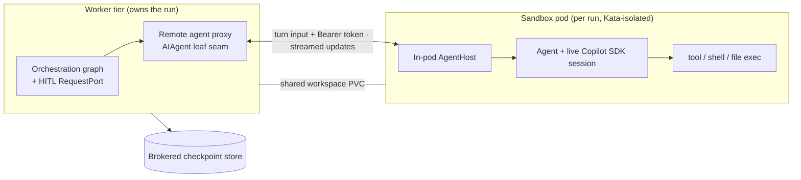
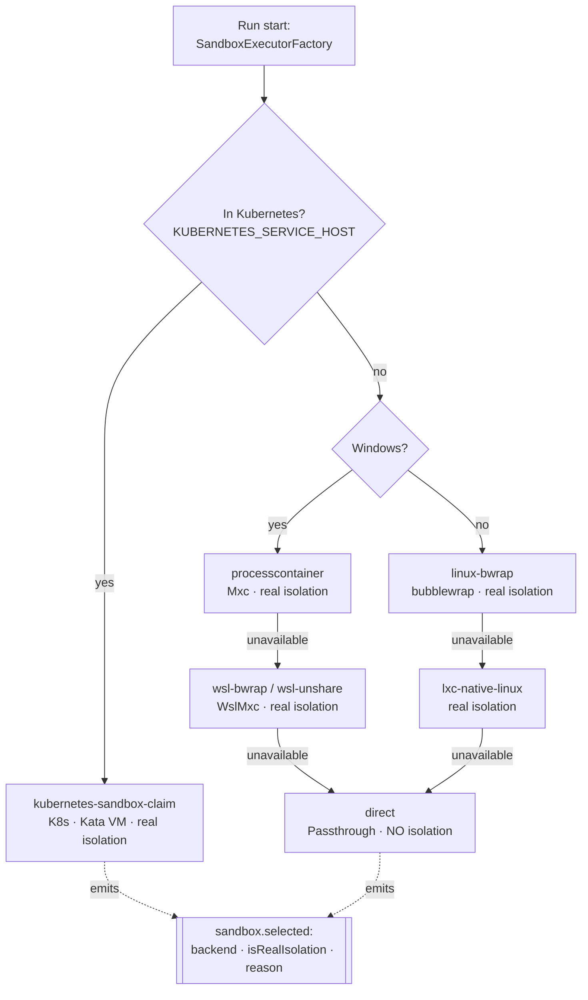
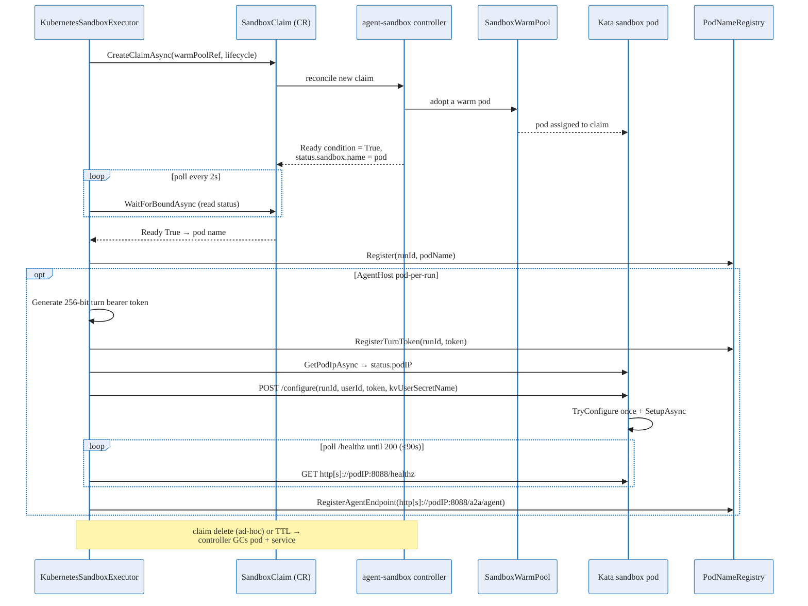
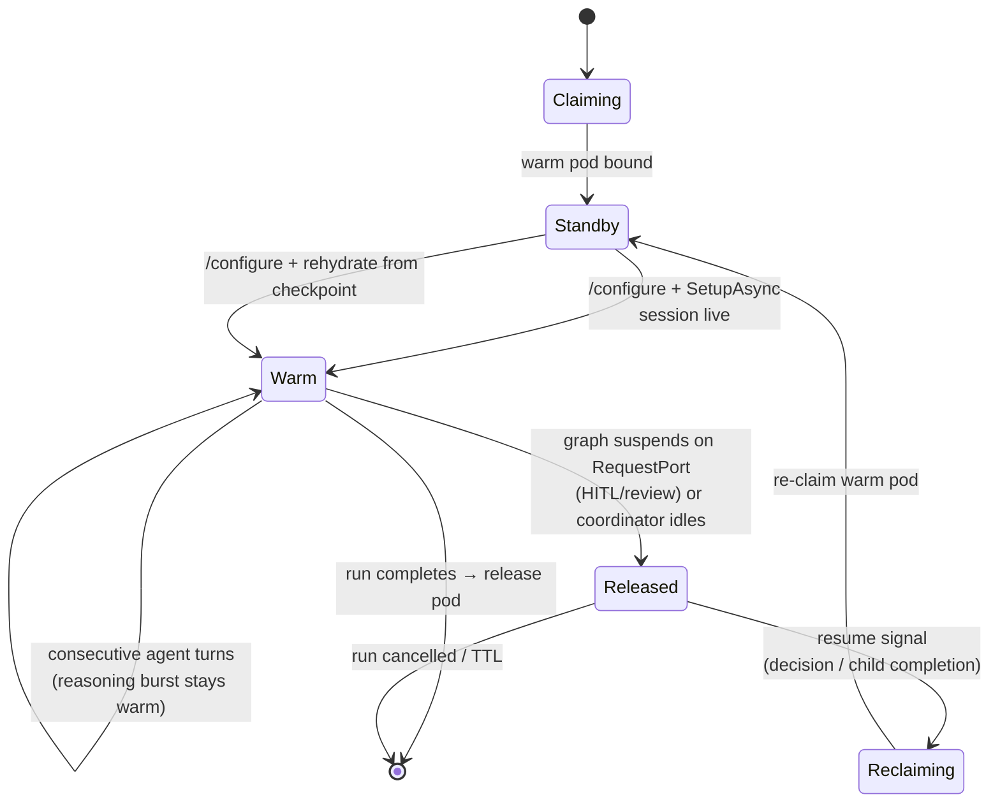
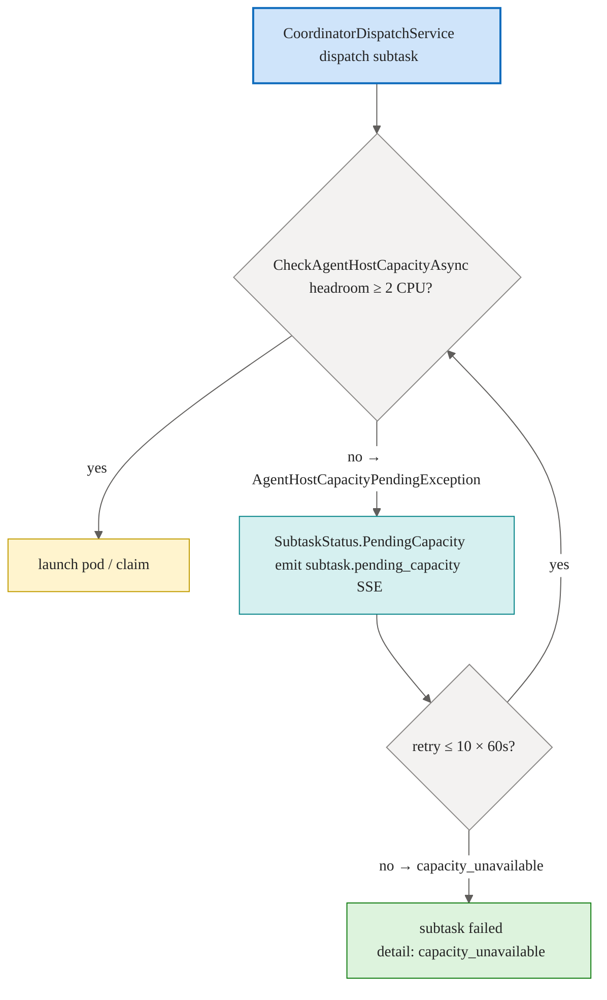

# Sandbox Pod Execution (pod-per-run) — Conceptual Deep Dive

## Why this exists: one fix for two problems

Before pod-per-run shipped, production agent subtasks ran **in-process inside the shared Worker
pod**. That pod held the live GitHub Copilot SDK session for each active run, the in-process
workflow runner, the streaming buffers, the tool/shell execution, and an in-memory history of
recent runs. Because all of it lived in one process, memory scaled with *concurrent +
recently-completed runs × (SDK session + graph + history)*, and the pod ran out of memory.

Sandbox pod execution starts from a single insight: **memory relief and security isolation are the
same fix**. Moving each run's agent execution out of the shared Worker process and into its own
per-run, Kata-isolated pod simultaneously:

1. **relieves the OOM** — the heavy SDK session, the runner, and tool execution leave the shared
   process, so no single process holds more than the runs it actively owns; and
2. **isolates execution** — each run's tool, shell, file, and model I/O happens inside its own VM-backed
   pod with a restricted egress allowlist, instead of sharing one blast radius.

After the move, the API/worker tier becomes a **thin orchestrator**: HTTP, SSE relay, database, and the
orchestration graph. The heavy, untrusted work runs elsewhere, per run, and dies with the run.

> This page explains the *logic* of pod-per-run. For the existing isolation model (filesystem
> containment, governance, executor selection, claim lifecycle, hardening) see
> [Sandbox](./sandbox.md); for the cluster topology see [Infrastructure](./infra-deployment.md). The
> exhaustive flag/identity/token reference is [Sandbox pods reference](../reference/sandbox-pods.md), and
> the operator/user-facing view is [Sandbox pod execution experience](../experience/sandbox-pod-execution.md).

## Before and after: where agent execution runs

### Before pod-per-run: single-Worker-pod execution

Before this rollout, the leaf agent — the object that wraps a live Copilot SDK session — was
created and driven **inside the Worker process**. The workflow graph ran in-process there too, and
the sandbox pod was used only to **exec one shell command at a time** through a warm-pool claim.
The pod was a place to run `run_command`; it was *not* where the agent lived.


Every box inside the Worker pod multiplies by concurrent and recent runs. That is why it OOMed, and
why production had to keep subtasks on one shared in-process owner.

### Now: per-run sandbox pod

Under pod-per-run, the **leaf agent turn relocates into the pod**. The orchestration graph and its
human-in-the-loop (HITL) gates stay in the worker tier; only the agent *turn* — the part that holds the
SDK session and runs tools — moves out.



The decisive architectural fact: **the coordinator's orchestration loop stays in the API/worker tier.
Only agent turns are sandboxed.** Remoting happens at the **AIAgent leaf seam** — the workflow graph,
the `RequestPort`/HITL/review logic, and the suspend/resume machinery never cross the wire. This keeps
all the state that decides *what happens next* in the durable, observable worker, and ships only the
expensive *doing* into the disposable pod.

> The worker↔pod transport is the **A2A bridge** (Agent Framework's Agent2Agent), used in message/stream
> mode. A2A ships in the .NET Agent Framework on a `-preview` package line and is therefore
> **experimental**; it is adopted deliberately, pinned by version, behind the same execution-mode flag
> that provides rollback. See [A2A bridge deep dive](./a2a-bridge.md), the
> [A2A reference](../reference/a2a.md), and the
> [A2A distributed agents experience](../experience/a2a-distributed-agents.md).

## The in-pod AgentHost

The pod runs a minimal host process — **AgentHost** — baked into the sandbox image. Conceptually it is
the pod-side counterpart of the leaf seam:

- it **receives the forwarded turn** (setup + run) from the worker;
- it **requires the run's bearer token** on `POST /a2a/agent/v1/message:stream`;
- it **hosts the real leaf agent** (the Copilot SDK session) directly, and runs the turn locally;
- it **executes tools, shell, and file operations in-pod**, inside the Kata VM boundary; and
- it **streams agent updates and token deltas back** to the worker, which re-injects them into the
  existing run-event stream so the SSE contract to clients is unchanged.

A key simplification: because remoting is at the leaf seam, AgentHost does **not** run its own workflow
graph. The graph lives only in the worker. AgentHost hosts one `AIAgent` and serves its turns. The
worktree commit/diff stays on the worker side, over the **shared workspace volume** both tiers mount, so
the database-write logic stays central and the pod stays stateless beyond the live turn.

With the Worker deployment now set to `Sandbox:AgentExecutionMode=pod-per-run`, the dedicated
AgentHost warm pool is on the live execution path: its standby pods are claimed, configured, and
serve real child-run turns instead of sitting idle.

The existing per-command exec path is **retained for its current utility purpose** (ad-hoc
`run_command`); it is simply never the agent-turn transport. Nothing about pod-per-run deletes that
capability — see [Sandbox](./sandbox.md#kubernetes-sandbox-lifecycle-claims-over-pods).

## The executor seam: how commands are actually isolated

Pod-per-run answers *where the agent turn runs*. It does not, by itself, answer *how a single
`run_command` is isolated from the host* — that is the job of a second, older seam: the **executor
abstraction**. Both seams matter, and they are easy to conflate, so this section pins down the
relationship.

Whenever an agent runs a shell command, the runtime hands a uniform command object (command line,
working directory, environment, filesystem policy, timeout, network-enabled flag, run id) to an
**`ISandboxExecutor`**, and gets back a uniform result (exit code, stdout, stderr, timeout flag,
truncation flag). The executor decides *how and where* the process actually runs. That uniform contract
is what lets the same agent code run unchanged whether isolation comes from a Windows process container, a
Linux namespace sandbox, or a Kata-isolated Kubernetes pod. The contract itself is described in
[Sandbox › Executor abstraction](./sandbox.md#executor-abstraction-one-command-contract-many-isolation-backends).

### One executor per host, chosen at run start

`SandboxExecutorFactory` selects exactly **one** executor for the host at run start, walking a fixed
ladder and stopping at the first backend that is actually available. It emits a **`sandbox.selected`**
event carrying `backend`, `isRealIsolation`, and `reason`, so the chosen backend — and *why* it was
chosen — is observable for every run.



The ladder, top to bottom:

- **`processcontainer` (Mxc, Windows)** — the first choice on Windows. `mxc` is Microsoft's open-source
  sandbox isolation tool; its Windows `processcontainer` backend (BackendName `Mxc`) is driven by binaries
  in `MXC_BIN_DIR` (for example `wxc-exec.exe --probe` returns a `tier` such as `base-container`). Setup is
  in [Sandbox setup › Windows](../reference/sandbox-setup.md#windows-arm64).
- **`wsl-bwrap` / `wsl-unshare` (WslMxc, Windows)** — when `processcontainer` is unavailable but WSL2
  offers a usable Linux backend.
- **`linux-bwrap` (bubblewrap)** — the preferred Linux backend, a selective-mount namespace sandbox.
- **`lxc-native-linux`** — the Linux fallback when bubblewrap is absent but `lxc-exec` is present.
- **`kubernetes-sandbox-claim` (K8s)** — selected automatically in-cluster. Each command runs in a warm
  pod obtained through a `SandboxClaim` custom resource (`extensions.agents.x-k8s.io/v1beta1`), with Kata
  VM isolation and a NetworkPolicy egress allowlist. This is provisioned by the upstream **agent-sandbox
  controller**, a distinct runtime from MXC — see [The agent-sandbox controller (MXC vs. the
  controller)](#the-agent-sandbox-controller-mxc-vs-the-controller) below.
- **`direct` (Passthrough)** — the last resort, chosen **only when nothing else is available**. It runs
  the command directly on the host with **no isolation layer**; the shell still runs, relying on whatever
  isolation the surrounding deployment already provides.

`IsRealIsolation` is `true` for every real backend and `false` for `direct`. The governance gate enforces
a hard rule: a shell command is allowed only when the selected executor reports `IsRealIsolation == true`
**or** is the `direct` backend. Any *other* non-isolating executor **denies `run_command`** outright — so
an agent never silently runs a shell command under a half-isolated backend. The exact rows and selection
conditions live in the [Sandbox backends table](../reference/sandbox-setup.md#sandbox-backends).

### Two seams, one contract, three tiers

The connective idea for pod-per-run is that **the executor abstraction and pod-per-run agent execution are
the same seam at different deployment tiers — and the A2A agent-turn remoting is orthogonal to both.**
Three things are deliberately distinct:

- **The executor seam (`ISandboxExecutor`)** isolates an individual *command*. Local dev gets MXC
  (`processcontainer`) or bubblewrap; in-cluster gets the Kubernetes claim backend. Same command contract,
  different backend.
- **The Kubernetes claim backend** is the in-cluster *implementation* of that same executor contract:
  `KubernetesSandboxExecutor` runs each command in a warm pod obtained via a `SandboxClaim` CR, with Kata
  VM isolation and NetworkPolicy egress. There is no special second contract for the cluster — it is the
  same `ISandboxExecutor` seam, fulfilled by a pod instead of a local process.
- **A2A agent-turn remoting** (the [A2A bridge](./a2a-bridge.md)) moves an entire *agent turn* — the SDK
  session and its tool loop — out to the per-run pod. That is the pod-per-run story above. It is
  **orthogonal** to backend selection: the in-pod AgentHost still runs each `run_command` through *its
  own* `ISandboxExecutor`, which in-cluster is the Kata-pod backend the pod itself lives in.

Read the whole isolation stack top-down: pod-per-run decides *which process hosts the agent turn* (worker
vs. per-run pod, via A2A); the executor abstraction decides *how each command inside that turn is
isolated* (MXC / bwrap / Kata-pod claim); and the governance gate decides *whether the command may run at
all* given the selected backend's `IsRealIsolation`. On a laptop these collapse onto one host — the agent
turn runs in-process and commands isolate via MXC or bubblewrap; in-cluster they fan out — the agent turn
runs in its own pod and commands isolate via the Kata-pod claim. The contract a reader has to remember is
single: *one command in, one uniform result out, isolation chosen per host and announced by
`sandbox.selected`.*

## The agent-sandbox controller (MXC vs. the controller)

In-cluster, the sandbox pod a run executes in is not created by Agentweaver directly and is **not** MXC.
It is provisioned by the upstream **agent-sandbox controller** ([`kubernetes-sigs/agent-sandbox`](https://github.com/kubernetes-sigs/agent-sandbox)),
which Agentweaver installs in `scripts/aks/10-create-cluster.sh` (default `v0.4.6`). The naming overlap
trips people up, so pin it down:

- **MXC** = `Sabbour.Mxc.Sdk` / `wxc-exec.exe`, the **local-host** command-isolation runtime behind the
  `processcontainer`, WSL, and `lxc-exec` executors. It runs on a laptop or non-cluster host and has no
  controller and no CRDs.
- **agent-sandbox controller** = the **in-cluster** operator that turns a `SandboxClaim` into a bound,
  Kata-isolated pod. The in-cluster `ISandboxExecutor` (`KubernetesSandboxExecutor`) talks only to this
  controller's CRDs; there is no MXC binary in the cluster.

So "how is the sandbox implemented with MXC?" has two honest answers depending on tier: **locally**, a
command is isolated by MXC spawning a `wxc-exec.exe` sandbox process; **in-cluster**, a command (or a
whole agent turn) runs in a pod the agent-sandbox controller bound for the run. Both present the identical
`ISandboxExecutor` contract.

### How the controller provisions a run's pod

The three CRDs (API group `extensions.agents.x-k8s.io`; `KubernetesSandboxExecutor` targets the `v1beta1` storage version — [`SandboxClaimConventions.cs:23`](#source)) Agentweaver applies are:

- **`SandboxTemplate`** (`k8s/sandbox-template.yaml`, `agentweaver-sandbox`) — the pod shape and hardening:
  `kata-vm-isolation` runtime class, non-root UID/GID 1000, dropped capabilities, read-only root
  filesystem, `/workspace` PVC, and the A2A listener on container port `8088`.
- **`SandboxWarmPool`** — keeps warm pods pre-built from a template so a claim binds without a cold
  start. Two pools ship: generic `agentweaver-sandbox` (`k8s/sandbox-warmpool.yaml`, `replicas: 3`)
  and pod-per-run `agentweaver-agent-host` (`k8s/sandbox-warmpool-agenthost.yaml`, `replicas: 2`). The AgentHost pool pre-warms the .NET process and Copilot SDK; per-run context arrives later via `/configure`.
- **`SandboxClaim`** — created per run by `KubernetesSandboxExecutor` with `spec.warmPoolRef.name`
  (the pool to bind), `spec.lifecycle.{ttlSecondsAfterFinished, shutdownPolicy: Delete}`, and
  `spec.env[]` for static values only on the AgentHost path (`AgentHost__KeyVaultUri`, paths, port, mTLS settings). `RunId`, `UserId`, `TurnBearerToken`, and `KvUserSecretName` are delivered after binding by `POST /configure`. The controller adopts a warm pod and signals readiness via a `Ready` condition.



The executor reads the pod name from `status.sandbox.name` (the agent-sandbox controller's shape) once the
claim's `Ready` condition is `True`. For pod-per-run AgentHost pods it then polls the pod's `status.podIP` to
build the A2A endpoint. Agentweaver never deletes pods itself — it deletes the *claim* (or lets the TTL
expire) and the controller garbage-collects the pod and its service. Anything not visible in these
manifests or the executor code (controller replica count, leader election, image, RBAC of the controller
itself) is **operationally configured by the agent-sandbox release**, not specified by Agentweaver.

### Warm-pool configure and readiness gate (AgentHost)

A bound claim means the controller assigned a pod; it does **not** mean the run-specific AgentHost
is ready to serve turns. AgentHost warm pods start with no `RunId`, enter standby, and log that
they are waiting for `/configure`. This lets
`k8s/sandbox-warmpool-agenthost.yaml` run at `replicas: 2` without CrashLooping: the .NET process
and Copilot SDK host are already warm, but no run context is required until a claim binds. With the
Worker now in `pod-per-run`, those two standby pods are the hot path for coordinator child turns.

At run launch, `KubernetesSandboxExecutor` generates a 256-bit turn bearer token, resolves the run owner's Key Vault secret name, and calls `POST {scheme}://{podIP}:8088/configure` with `runId`, `userId`, `turnBearerToken`, and `kvUserSecretName`. `/configure` is one-time (`409` after the first successful call), returns `400` when `runId` is missing, is excluded from the readiness gate, and is intentionally not protected by the turn token because it delivers that token. NetworkPolicy limiting AgentHost ingress to API/worker pods is the guard.

After `/configure`, `AgentHostStartupService.ConfigureAsync` runs `SetupAsync`; only then does `/healthz` return `200` and the executor registers the A2A endpoint. The wait is bounded (default `90 s`, `1 s` interval, `5 s` per-attempt timeout) and honors the launch cancellation token. The `a2a-sandbox-pod` client still carries the connection-refused retry handler as defense-in-depth, but the normal path is: **claim warm pod → configure → health ready → first turn**.

### Node topology: the dedicated kata user pool

Sandbox/AgentHost pods require **Kata VM isolation**, which on AKS is the `workloadRuntime:
KataVmIsolation` node-pool property (nodes get the `kubernetes.azure.com/kata-vm-isolation=true`
label and a Kata-capable gen2 image). The cluster uses **cluster-autoscaler** (not NAP):

- **NAP and cluster-autoscaler are mutually exclusive.** This cluster uses cluster-autoscaler
  on all three pools; `--node-provisioning-mode Auto` is not set.
- **Kata capacity lives in a fixed user pool.** `katapool` is created with
  `--workload-runtime KataVmIsolation --enable-cluster-autoscaler --min-count 1 --max-count 5`
  so it scales automatically under load without requiring manual resize.
- **System pool is reserved.** `nodepool1` carries `CriticalAddonsOnly=true:NoSchedule`; only
  kube-system / critical-addon pods land there. App workloads go to `apppool` (no taint,
  no tolerations required in app deployment YAMLs).

The three-pool layout:

```bash
# apppool — app workloads (api, worker, mcp, frontend, jobs); no taint
az aks nodepool add \
  --resource-group "${RESOURCE_GROUP}" --cluster-name "${CLUSTER_NAME}" \
  --name apppool --mode User --os-sku AzureLinux \
  --node-vm-size Standard_D4s_v3 \
  --enable-cluster-autoscaler --min-count 1 --max-count 5 \
  --ssh-access disabled

# katapool — sandbox/AgentHost pods; taint keeps non-sandbox pods out
az aks nodepool add \
  --resource-group "${RESOURCE_GROUP}" --cluster-name "${CLUSTER_NAME}" \
  --name katapool --mode User --os-sku AzureLinux \
  --workload-runtime KataVmIsolation --node-vm-size Standard_D4s_v3 \
  --enable-cluster-autoscaler --min-count 1 --max-count 5 \
  --node-taints sandbox=kata:NoSchedule --labels agentweaver.io/kata=true \
  --ssh-access disabled
```

| Pool        | Mode   | workloadRuntime | Autoscaler  | Taint                             | Label                       | Receives                       |
|-------------|--------|-----------------|-------------|-----------------------------------|-----------------------------|-------------------------------|
| `nodepool1` | System | *(standard)*    | 1–3 nodes   | `CriticalAddonsOnly=true:NoSchedule` | —                        | kube-system / critical addons  |
| `apppool`   | User   | *(standard)*    | 1–5 nodes   | *(none)*                          | —                           | api, worker, mcp, frontend, jobs |
| `katapool`  | User   | KataVmIsolation | 1–5 nodes   | `sandbox=kata:NoSchedule`         | `agentweaver.io/kata=true`  | Sandbox / AgentHost pods       |

The Kata `SandboxTemplate` pod specs (`k8s/sandbox-template-agenthost.yaml`,
`k8s/sandbox-template.yaml`) wire pods to `katapool` — the CRD `podTemplate.spec` is a full PodSpec,
so `tolerations`/`affinity` pass straight through to the rendered pod:

- a **toleration** for `sandbox=kata:NoSchedule` admits pods onto the tainted `katapool`; and
- a **preferred** (not required) `nodeAffinity` for `agentweaver.io/kata=true` *biases* pods onto
  `katapool`; cluster-autoscaler scales `katapool` when demand grows — pods are **never stranded**.

The `CriticalAddonsOnly` taint lives only on `nodepool1`; app workloads schedule onto `apppool`
without any toleration changes.

## The hybrid pod-granularity model

How long should a run hold a pod? Two naive answers both fail:

- **Pod-per-turn** (claim a pod for each turn, release between turns) pays a warm-pool claim, an agent
  setup, and a session deserialize *on every turn*. That is unaffordable latency and token cost, and it
  risks session round-trip drift.
- **Pod-per-run, held continuously** (one pod for the whole run, never released) keeps a pod — with its
  live SDK session — alive through unbounded human-review waits and through a coordinator's long idle
  life while it awaits child runs. That recreates a softer, *distributed* OOM and wastes capacity.

Agentweaver therefore uses a **hybrid**: pod-per-run **with checkpoint-and-release on suspend**.



The rules of the model:

- **A pod is warm for an active reasoning burst.** One pod, one live session, serves all the
  *consecutive* agent turns of an active burst. Inter-turn boundaries do **not** release the pod —
  releasing and re-setting up between every turn is exactly the cost pod-per-turn would pay.
- **The pod is checkpoint-and-released when the graph *suspends on an external gate*.** The release
  boundary is graph suspension on a `RequestPort` — a HITL/review gate, or the coordinator loop idling
  while it awaits child runs — **not** a mere inter-turn boundary. While a human is deciding, or while
  the coordinator waits on children, there is nothing for the SDK session to do, so the pod is released
  back to the warm pool.
- **Resume re-claims a warm pod and rehydrates.** On the resume signal (a HITL decision arrives, or a
  child run completes), the worker re-claims a warm pod and rehydrates the run from the brokered
  checkpoint.

For this to be correct, the checkpoint must carry enough to perfectly reconstruct the suspended run: the
**serialized agent session blob** plus the **workflow superstep state**, including the correlation id of
the suspended external request. Two facts make rehydration cheap and safe:

- the **worktree is already durable** on the shared workspace volume, so no file state needs to travel in
  the checkpoint; and
- the **run-scoped context is re-delivered at re-claim via `/configure`**, so a resumed pod gets a fresh turn token and configured Key Vault secret name rather than inheriting stale state (see the credential model below).

A tuning sub-flag, `Sandbox:ReleasePodOnSuspend` (default **true**), disables the release for
low-latency-resume or debugging — the pod then stays warm across a suspension at the cost of holding
capacity. The release is **internal behavior of `pod-per-run`**; it does not change the execution-mode
flag value.

## Credential model — without a broker

A persistent design question was how a sandboxed agent gets the credentials it needs (to call the model,
to clone/push the run's repository) without a central capability-token broker minting and validating
tokens for every pod. The resolved answer is: **there is no broker.** The pod legitimately holds a
**run-scoped credential**, by one of two mechanisms:

- **Preferred — workload identity.** The sandbox pod's service account is federated, so the pod obtains a
  short-lived model token from the OIDC-federated identity at runtime. Nothing is baked into the image,
  and no long-lived secret sits in the pod. This is consistent with the cluster's passwordless posture.
- **Alternative — run-scoped token at claim time.** When the worker claims the pod, it injects a
  **short-lived, run-scoped** token (e.g. a projected secret) consumed by AgentHost at startup. The
  token's lifetime is bounded by the claim/run.

Either way, the credential is **scoped to the single run** and **never baked into the image**. The
dropped pieces are explicit: there is **no `CapabilityTokenService`**, no coordinator-as-pod recursion,
and no bespoke duplex sandbox-agent protocol. The previous "pods hold no secrets" rule was a
*recommendation*, not a requirement; relaxing it to "pods hold only a run-scoped, short-lived credential"
is what lets the broker disappear.

The same principle drives **GitHub access**: the run acts *as its signed-in user*, so the pod receives only the run owner's Key Vault secret name in `/configure`. `KeyVaultUserTokenProvider` fetches that one user's stored GitHub token with workload identity and caches it in memory for the pod lifetime. The old infrastructure-layer CSI projection has been replaced by application-layer isolation inside AgentHost; the trade-off and mechanics are in [Agent-host token delivery](./agent-token-delivery.md). The security principle is that the pod serves only the configured user's scope — never another user's scope and never a shared workspace token mirror.

The A2A turn path has its own run-scoped secret. At AgentHost launch, `KubernetesSandboxExecutor`
generates a 256-bit bearer token, sends it in `POST /configure`, and registers it in
`IAgentHostTurnTokenRegistry`. `RemoteAgentProxy` sends that value as `Authorization: Bearer ...` on
every `message:stream` call, and AgentHost accepts only its own token. This means NetworkPolicy/mTLS are
not the only gates on the turn endpoint, and a token stolen from one run cannot reach another run's pod.

Egress is **default-deny** with a narrow allowlist: the model endpoint, the API/worker bridge endpoint,
and the git remote(s) the run legitimately needs. Everything else — especially arbitrary in-cluster
services and the database — is denied. Sandbox pods talk to the worker tier, never directly to the
database.

## Reaching into the pod: browser preview

Default-deny egress governs traffic *out* of the pod. A separate, deliberate path lets an operator (or a
running agent) reach *into* a run's sandbox pod: the **sandbox browser preview**. When an agent starts a
server inside its sandbox (a dev server, a built app, a debug endpoint), the run's pod can expose that port
back through the API on demand, so a human can open a live preview scoped to exactly that run's pod.

In **AKS deployments** (where `Sandbox:Preview:Enabled=true`) this is a **Gateway-direct reverse proxy**: the
API creates a per-preview `ClusterIP Service` + `HTTPRoute` that attaches to the shared
`agentweaver-preview-gateway` and routes `{token}-preview.{ZoneSuffix}` directly to the sandbox pod. The
response includes a public `preview_url`; no loopback port or `kubectl` process is involved. The agent or the
operator UI can also initiate this via the `start_preview` MCP tool, which first routes through a
human-in-the-loop approval gate.

In **local dev** (where `Sandbox:Preview:Enabled=false`) the fallback path still exists: the
implementation (`PortForwardService`) shells out to
`kubectl port-forward --address 127.0.0.1 pod/{podName} :{targetPort} -n {namespace}`, parses the chosen
loopback port from kubectl's `Forwarding from 127.0.0.1:<port> ->` line, and probes TCP until ready. It
returns a **`local_port` on the API host — not a public URL**; the `preview_url`/`previewUrl` fields are not
populated and the UI says so honestly when no proxied URL is returned. Sessions are tracked in memory, capped
at 3 per run and 20 globally, and cleaned up explicitly.

Neither path widens the pod's own egress allowlist; both are inbound tunnels the operator/agent opens, not
capabilities the sandboxed code can grant itself. The AKS NetworkPolicy
`sandbox-allow-preview-ingress` (`k8s/networkpolicy-sandbox.yaml`) admits TCP 3000–9000 exclusively from
`agentweaver-preview-gateway` pods — no other source can reach those ports.

> **Dedicated pages:** the browser preview has its own first-class docs —
> [Deep Dive](./sandbox-browser-preview.md), [Reference](../reference/sandbox-browser-preview.md), and
> [User Guide](../experience/sandbox-browser-preview.md).
> For the AKS-specific setup see [Sandbox browser preview — Deploy to AKS](../guide/deployment-aks.md#sandbox-browser-preview).

## The execution-mode flag and rollback

Everything above is gated behind a single flag so the change is reversible at any moment:

`Sandbox:AgentExecutionMode` ∈ { **`in-api`**, **`pod-per-run`** }.

- **`pod-per-run`** is now the production Worker setting. It activates the bridge and the per-run
  AgentHost pod, with the hybrid release behavior tuned by `Sandbox:ReleasePodOnSuspend` (default
  `true`).
- **`in-api`** remains available as the **fallback / rollback path**. If pod-per-run misbehaves —
  including any instability in the `-preview` A2A transport — flipping back to `in-api` restores
  the old in-process execution model without deploying a second transport.

This "default to today's behavior, flip per environment, roll back by flag" discipline is the same
posture used across the distributed-execution rollout. Pod-per-run is the first, independently shippable
phase — it stops the OOM on its own, before the later data-store and web/worker-split phases. See
[Distributed execution & scaling](./infra-deployment.md) for the surrounding phasing.

## Rebuild blueprint

To rebuild pod-per-run from these ideas:

1. **Keep the orchestration graph and HITL gates in the worker.** Relocate only the leaf agent turn.
   Remote at the `AIAgent` seam so the graph never crosses the wire.
2. **Introduce a remote leaf proxy** on the worker that forwards setup/run to the pod and re-emits the
   pod's update stream locally, so the rest of the graph and the SSE relay are unchanged.
3. **Bake a minimal AgentHost** into the sandbox image that hosts the real leaf agent, requires the
   per-run bearer on `message:stream`, and runs tools in-pod; stream updates back to the worker.
4. **Make checkpoints brokered/durable** so any worker (and a re-claimed pod) can read them — the
   serialized session blob plus superstep state, including the suspended external-request correlation id.
5. **Implement the hybrid lifecycle:** warm across consecutive turns; checkpoint-and-release on
   `RequestPort`/coordinator-idle suspension; re-claim + rehydrate on resume. Gate the release with
   `Sandbox:ReleasePodOnSuspend`.
6. **Give the pod run-scoped context** via one-time `/configure`: RunId, UserId, the A2A turn bearer token, and the Key Vault user-secret name. Fetch the user token with workload identity and no broker.
7. **Default deny egress** to model + worker + git only; never let the pod reach the database.
8. **Gate the whole thing behind `Sandbox:AgentExecutionMode`** so production can run `pod-per-run`
   while retaining `in-api` as an instant rollback path.

## Security invariants

- The orchestration graph, HITL decisions, and run record live in the **worker**, never in the pod — a
  compromised pod cannot rewrite *what happens next*.
- Each run's heavy execution is confined to its **own Kata-isolated pod** with a **default-deny egress
  allowlist**; the pod cannot reach the database or arbitrary in-cluster services.
- The pod holds **only the configured run owner's credential in memory** after `/configure` — never a broker key, never another run's or user's scope.
- The A2A turn endpoint is application-layer authenticated with a per-run bearer token; a token from one
  pod is not valid against any other pod.
- The pod is **disposable and re-creatable**: durable state lives in the shared workspace volume and the
  brokered checkpoint, so killing a pod loses no run.
- The whole capability is **reversible by a single flag** (`Sandbox:AgentExecutionMode=in-api`).

## Orphaned-pod reaper and quota lifecycle

### Why orphaned pods happen

Pod-per-run expects every run lifecycle path (normal completion, stall-fail, cancellation) to call `ReleaseAgentHostPodAsync` before exiting. Any path that fails to do so leaves a pod running without an active run — an **orphaned pod** that consumes cluster CPU quota but does no work. Over time these accumulate and exhaust the `katapool` capacity.

### The reaper

`AgentHostReaperService` (`IAgentHostReaper`, singleton) sweeps all agent-host pods in the namespace and identifies pods that have no matching active run record. It is driven by the coordinator heartbeat's 3rd tick phase on a tunable cadence:

```
Coordinator:ReaperIntervalTicks   (default 12)
```

With the default heartbeat interval the reaper fires roughly **every 2 minutes** (12 ticks × ~10 s). It terminates orphaned pods and emits a telemetry event for each one reaped.

All stall-fail and cancellation paths in `CoordinatorDispatchService` call `ReleaseAgentHostPodAsync` explicitly to minimize the reaper's workload. The reaper is the belt to that suspender.

### Pre-dispatch quota check

Before dispatching a new subtask, `KubernetesSandboxExecutor.CheckAgentHostCapacityAsync` checks the namespace's current CPU quota headroom. If the headroom is less than **2 CPU**, the executor throws `AgentHostCapacityPendingException` rather than trying to schedule a pod that would be unschedulable.

### PendingCapacity subtask flow

`CoordinatorDispatchService` catches `AgentHostCapacityPendingException` and transitions the subtask to the `PendingCapacity` status. The UI emits a `subtask.pending_capacity` SSE event and the frontend renders the subtask node with an amber **⏳ Waiting for capacity** badge. The dispatcher retries the dispatch on a **60-second interval** for up to **10 attempts**. If capacity is still unavailable after 10 retries, the subtask fails with the detail code `capacity_unavailable`.



The `OutcomeSpecPanel.tsx` sidebar surfaces human-readable messages for all detail codes that reach terminal runs: `agent_stall_timeout`, `agent_quota_exceeded`, `agent_pod_reconciler_error`, and `capacity_unavailable`.

Where this lives:

- `apps/Agentweaver.Api/Sandbox/AgentHostReaperService.cs`
- `apps/Agentweaver.Api/Sandbox/AgentHostCapacityPendingException.cs`
- `apps/Agentweaver.Api/Coordinator/CoordinatorDispatchService.cs`
- `apps/Agentweaver.Api/Coordinator/CoordinatorHeartbeatService.cs`

## Related reading

- [Sandbox](./sandbox.md) — the underlying isolation model, claim lifecycle, and hardening.
- [Sandbox setup](../reference/sandbox-setup.md) — the backend ladder, the `sandbox.selected` event, and
  the MXC binary / `MXC_BIN_DIR` install.
- [Infrastructure & deployment](./infra-deployment.md) — cluster topology, PVCs, and network policy.
- [Sandbox pods reference](../reference/sandbox-pods.md) — flags, pod identity/quota, token injection,
  pod naming, and security properties.
- [Sandbox pod execution experience](../experience/sandbox-pod-execution.md) — what users and operators
  see and feel.
- [A2A bridge](./a2a-bridge.md) and [A2A reference](../reference/a2a.md) — the `-preview` transport that
  carries agent turns to the pod.
- [Sandbox browser preview](./sandbox-browser-preview.md) — exposing a server running inside the run's pod
  to the user over a public HTTPS reverse proxy.
