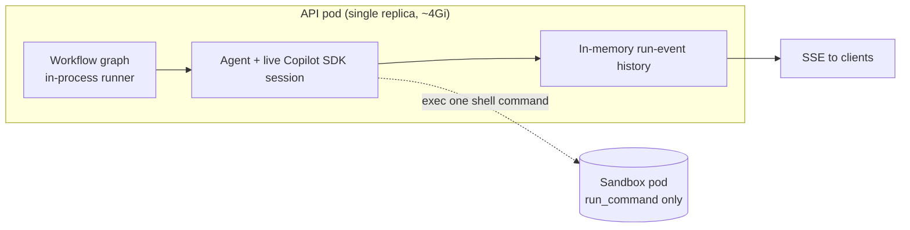
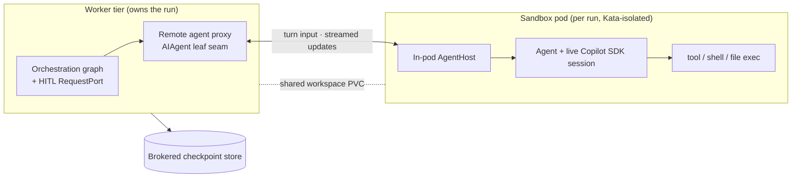
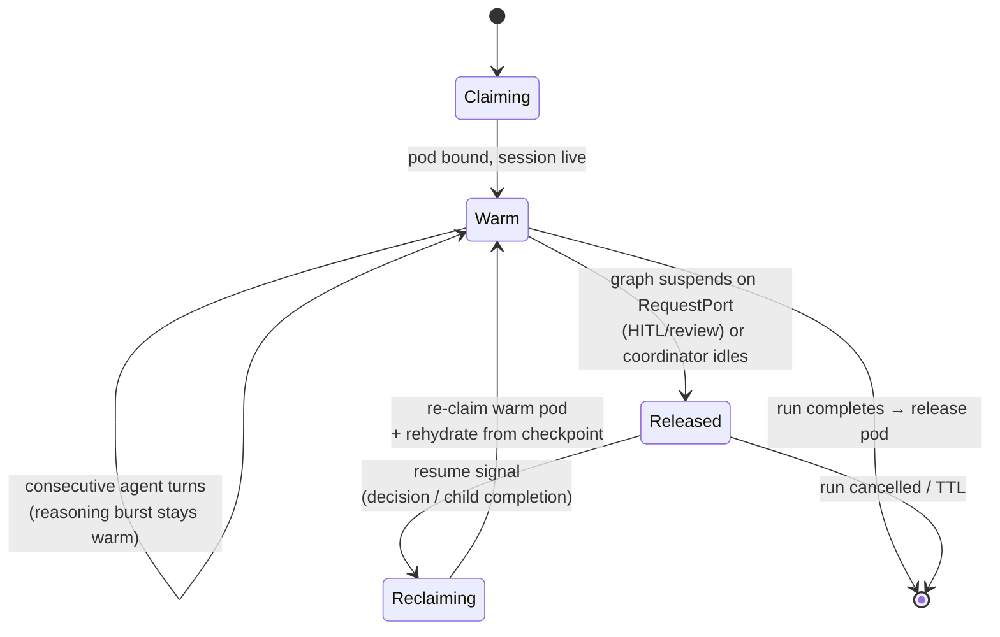

# Sandbox Pod Execution (pod-per-run) — Conceptual Deep Dive

## Why this exists: one fix for two problems

Agentweaver historically runs **every run's heavy execution state inside a single API pod**. That one
pod holds the live GitHub Copilot SDK session for each active run, the in-process workflow runner, the
streaming buffers, the tool/shell execution, and an in-memory history of recent runs. Because all of it
lives in one process, memory scales with *concurrent + recently-completed runs × (SDK session + graph +
history)*, and the pod runs out of memory. It cannot be scaled out either, because the single-writer
data store pins it to one replica.

Sandbox pod execution starts from a single insight: **memory relief and security isolation are the same
fix**. Moving each run's agent execution out of the shared API process and into its own per-run,
Kata-isolated pod simultaneously:

1. **relieves the OOM** — the heavy SDK session, the runner, and tool execution leave the shared
   process, so no single process holds more than the runs it actively owns; and
2. **isolates execution** — each run's tool, shell, file, and model I/O happens inside its own VM-backed
   pod with a restricted egress allowlist, instead of sharing one blast radius.

After the move, the API/worker tier becomes a **thin orchestrator**: HTTP, SSE relay, database, and the
orchestration graph. The heavy, untrusted work runs elsewhere, per run, and dies with the run.

> This page explains the *logic* of pod-per-run. For the existing isolation model (filesystem
> containment, governance, executor selection, claim lifecycle, hardening) see
> [Sandbox](./sandbox.md); for the cluster topology see [Infrastructure](./infra-deployment.md). The
> exhaustive flag/identity/token reference is [Sandbox pods reference](../reference/sandbox-pods.md), and
> the operator/user-facing view is [Sandbox pod execution experience](../experience/sandbox-pod-execution.md).

## As-is vs to-be: where agent execution runs

### As-is: single-API-pod execution

Today the leaf agent — the object that wraps a live Copilot SDK session — is created and driven **inside
the API process**. The workflow graph runs in-process there too, the coordinator drives its own
decomposition turn in-process, and the sandbox pod is used only to **exec one shell command at a time**
through a warm-pool claim. The pod is a place to run `run_command`; it is *not* where the agent lives.

Every box inside the API pod multiplies by concurrent and recent runs. That is why it OOMs, and why a
single-writer store keeps it pinned to one replica.

### To-be: per-run sandbox pod

Under pod-per-run, the **leaf agent turn relocates into the pod**. The orchestration graph and its
human-in-the-loop (HITL) gates stay in the worker tier; only the agent *turn* — the part that holds the
SDK session and runs tools — moves out.

The decisive architectural fact: **the coordinator's orchestration loop stays in the API/worker tier.
Only agent turns are sandboxed.** Remoting happens at the **AIAgent leaf seam** — the workflow graph,
the `RequestPort`/HITL/review logic, and the suspend/resume machinery never cross the wire. This keeps
all the state that decides *what happens next* in the durable, observable worker, and ships only the
expensive *doing* into the disposable pod.

> The worker↔pod transport is the **A2A bridge** (Agent Framework's Agent2Agent), used in message/stream
> mode. A2A ships in the .NET Agent Framework on a `-preview` package line and is therefore
> **experimental**; it is adopted deliberately, pinned by version, behind the same execution-mode flag
> that provides rollback. See [A2A bridge deep dive](./a2a-bridge.md), the
> [A2A reference](../reference/a2a.md), and the
> [A2A distributed agents experience](../experience/a2a-distributed-agents.md).

## The in-pod AgentHost

The pod runs a minimal host process — **AgentHost** — baked into the sandbox image. Conceptually it is
the pod-side counterpart of the leaf seam:

- it **receives the forwarded turn** (setup + run) from the worker;
- it **hosts the real leaf agent** (the Copilot SDK session) directly, and runs the turn locally;
- it **executes tools, shell, and file operations in-pod**, inside the Kata VM boundary; and
- it **streams agent updates and token deltas back** to the worker, which re-injects them into the
  existing run-event stream so the SSE contract to clients is unchanged.

A key simplification: because remoting is at the leaf seam, AgentHost does **not** run its own workflow
graph. The graph lives only in the worker. AgentHost hosts one `AIAgent` and serves its turns. The
worktree commit/diff stays on the worker side, over the **shared workspace volume** both tiers mount, so
the database-write logic stays central and the pod stays stateless beyond the live turn.

The existing per-command exec path is **retained for its current utility purpose** (ad-hoc
`run_command`); it is simply never the agent-turn transport. Nothing about pod-per-run deletes that
capability — see [Sandbox](./sandbox.md#kubernetes-sandbox-lifecycle-claims-over-pods).

## The hybrid pod-granularity model

How long should a run hold a pod? Two naive answers both fail:

- **Pod-per-turn** (claim a pod for each turn, release between turns) pays a warm-pool claim, an agent
  setup, and a session deserialize *on every turn*. That is unaffordable latency and token cost, and it
  risks session round-trip drift.
- **Pod-per-run, held continuously** (one pod for the whole run, never released) keeps a pod — with its
  live SDK session — alive through unbounded human-review waits and through a coordinator's long idle
  life while it awaits child runs. That recreates a softer, *distributed* OOM and wastes capacity.

Agentweaver therefore uses a **hybrid**: pod-per-run **with checkpoint-and-release on suspend**.

The rules of the model:

- **A pod is warm for an active reasoning burst.** One pod, one live session, serves all the
  *consecutive* agent turns of an active burst. Inter-turn boundaries do **not** release the pod —
  releasing and re-setting up between every turn is exactly the cost pod-per-turn would pay.
- **The pod is checkpoint-and-released when the graph *suspends on an external gate*.** The release
  boundary is graph suspension on a `RequestPort` — a HITL/review gate, or the coordinator loop idling
  while it awaits child runs — **not** a mere inter-turn boundary. While a human is deciding, or while
  the coordinator waits on children, there is nothing for the SDK session to do, so the pod is released
  back to the warm pool.
- **Resume re-claims a warm pod and rehydrates.** On the resume signal (a HITL decision arrives, or a
  child run completes), the worker re-claims a warm pod and rehydrates the run from the brokered
  checkpoint.

For this to be correct, the checkpoint must carry enough to perfectly reconstruct the suspended run: the
**serialized agent session blob** plus the **workflow superstep state**, including the correlation id of
the suspended external request. Two facts make rehydration cheap and safe:

- the **worktree is already durable** on the shared workspace volume, so no file state needs to travel in
  the checkpoint; and
- the **run-scoped credential is re-injected at re-claim**, so a resumed pod gets a fresh token rather
  than inheriting a stale one (see the credential model below).

A tuning sub-flag, `Sandbox:ReleasePodOnSuspend` (default **true**), disables the release for
low-latency-resume or debugging — the pod then stays warm across a suspension at the cost of holding
capacity. The release is **internal behavior of `pod-per-run`**; it does not change the execution-mode
flag value.

## Credential model — without a broker

A persistent design question was how a sandboxed agent gets the credentials it needs (to call the model,
to clone/push the run's repository) without a central capability-token broker minting and validating
tokens for every pod. The resolved answer is: **there is no broker.** The pod legitimately holds a
**run-scoped credential**, by one of two mechanisms:

- **Preferred — workload identity.** The sandbox pod's service account is federated, so the pod obtains a
  short-lived model token from the OIDC-federated identity at runtime. Nothing is baked into the image,
  and no long-lived secret sits in the pod. This is consistent with the cluster's passwordless posture.
- **Alternative — run-scoped token at claim time.** When the worker claims the pod, it injects a
  **short-lived, run-scoped** token (e.g. a projected secret) consumed by AgentHost at startup. The
  token's lifetime is bounded by the claim/run.

Either way, the credential is **scoped to the single run** and **never baked into the image**. The
dropped pieces are explicit: there is **no `CapabilityTokenService`**, no coordinator-as-pod recursion,
and no bespoke duplex sandbox-agent protocol. The previous "pods hold no secrets" rule was a
*recommendation*, not a requirement; relaxing it to "pods hold only a run-scoped, short-lived credential"
is what lets the broker disappear.

The same principle drives **GitHub access**: the run acts *as its signed-in user*, so the pod receives a
short-lived, run-scoped GitHub **access** token (no refresh material), delivered for that one run and
cleaned up when the run ends. The detailed sourcing, delivery, lifetime, and pod-side read are in
[Sandbox pods reference](../reference/sandbox-pods.md#run-scoped-github-token-injection). The
security principle is that the pod holds *only* its own run's short-lived access token — never refresh
material, never another user's scope.

Egress is **default-deny** with a narrow allowlist: the model endpoint, the API/worker bridge endpoint,
and the git remote(s) the run legitimately needs. Everything else — especially arbitrary in-cluster
services and the database — is denied. Sandbox pods talk to the worker tier, never directly to the
database.

## The execution-mode flag and rollback

Everything above is gated behind a single flag so the change is reversible at any moment:

`Sandbox:AgentExecutionMode` ∈ { **`in-api`**, **`pod-per-run`** }, default **`in-api`**.

- **`in-api`** is today's in-process behavior, and it is the **rollback path**. If pod-per-run misbehaves
  — including any instability in the `-preview` A2A transport — flipping back to `in-api` restores
  in-process execution instantly, with no second wire transport to deploy.
- **`pod-per-run`** activates the bridge and the per-run pod. The hybrid release behavior is internal to
  this mode and is itself tuned by `Sandbox:ReleasePodOnSuspend` (default `true`).

This "default to today's behavior, flip per environment, roll back by flag" discipline is the same
posture used across the distributed-execution rollout. Pod-per-run is the first, independently shippable
phase — it stops the OOM on its own, before the later data-store and web/worker-split phases. See
[Distributed execution & scaling](./infra-deployment.md) for the surrounding phasing.

## Rebuild blueprint

To rebuild pod-per-run from these ideas:

1. **Keep the orchestration graph and HITL gates in the worker.** Relocate only the leaf agent turn.
   Remote at the `AIAgent` seam so the graph never crosses the wire.
2. **Introduce a remote leaf proxy** on the worker that forwards setup/run to the pod and re-emits the
   pod's update stream locally, so the rest of the graph and the SSE relay are unchanged.
3. **Bake a minimal AgentHost** into the sandbox image that hosts the real leaf agent and runs tools
   in-pod; stream updates back to the worker.
4. **Make checkpoints brokered/durable** so any worker (and a re-claimed pod) can read them — the
   serialized session blob plus superstep state, including the suspended external-request correlation id.
5. **Implement the hybrid lifecycle:** warm across consecutive turns; checkpoint-and-release on
   `RequestPort`/coordinator-idle suspension; re-claim + rehydrate on resume. Gate the release with
   `Sandbox:ReleasePodOnSuspend`.
6. **Give the pod a run-scoped credential** via workload identity (preferred) or claim-time injection —
   no broker — and re-inject a fresh credential on each re-claim.
7. **Default deny egress** to model + worker + git only; never let the pod reach the database.
8. **Gate the whole thing behind `Sandbox:AgentExecutionMode`**, defaulting to `in-api` for instant
   rollback.

## Security invariants

- The orchestration graph, HITL decisions, and run record live in the **worker**, never in the pod — a
  compromised pod cannot rewrite *what happens next*.
- Each run's heavy execution is confined to its **own Kata-isolated pod** with a **default-deny egress
  allowlist**; the pod cannot reach the database or arbitrary in-cluster services.
- The pod holds **only a short-lived, run-scoped credential** — never a broker key, never refresh
  material, never another run's or user's scope.
- The pod is **disposable and re-creatable**: durable state lives in the shared workspace volume and the
  brokered checkpoint, so killing a pod loses no run.
- The whole capability is **reversible by a single flag** (`Sandbox:AgentExecutionMode=in-api`).

## Related reading

- [Sandbox](./sandbox.md) — the underlying isolation model, claim lifecycle, and hardening.
- [Infrastructure & deployment](./infra-deployment.md) — cluster topology, PVCs, and network policy.
- [Sandbox pods reference](../reference/sandbox-pods.md) — flags, pod identity/quota, token injection,
  pod naming, and security properties.
- [Sandbox pod execution experience](../experience/sandbox-pod-execution.md) — what users and operators
  see and feel.
- [A2A bridge](./a2a-bridge.md) and [A2A reference](../reference/a2a.md) — the `-preview` transport that
  carries agent turns to the pod.
