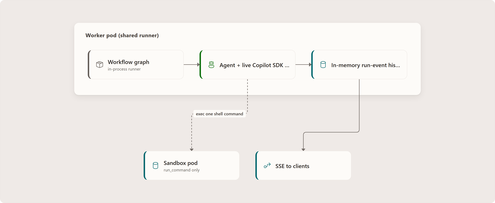
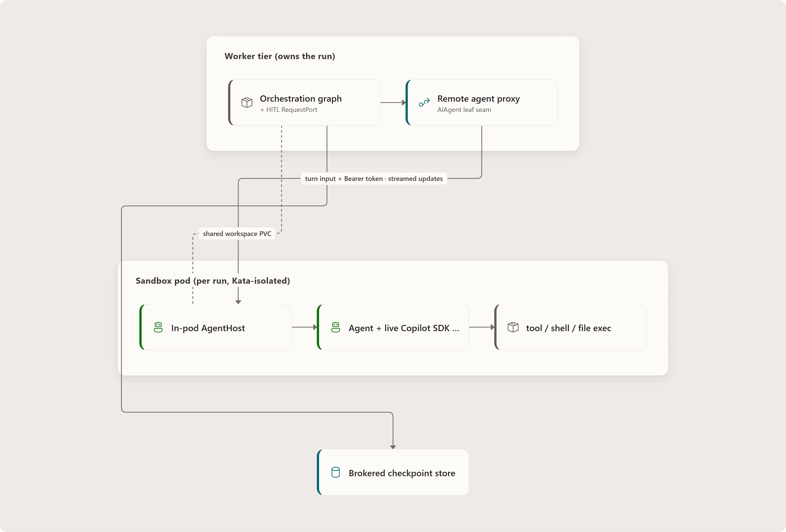
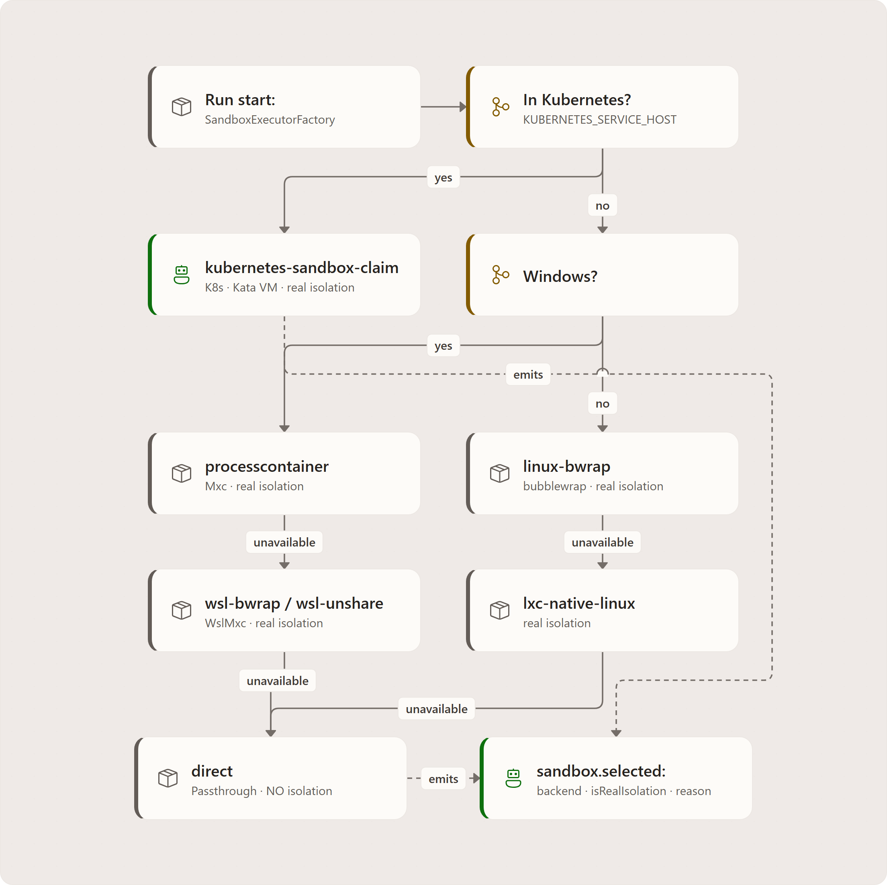
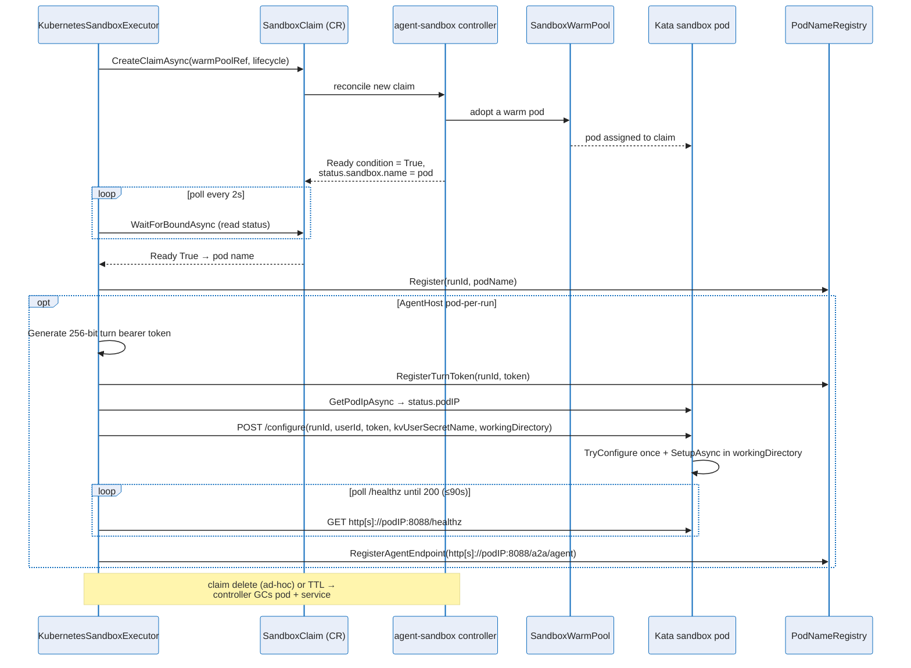
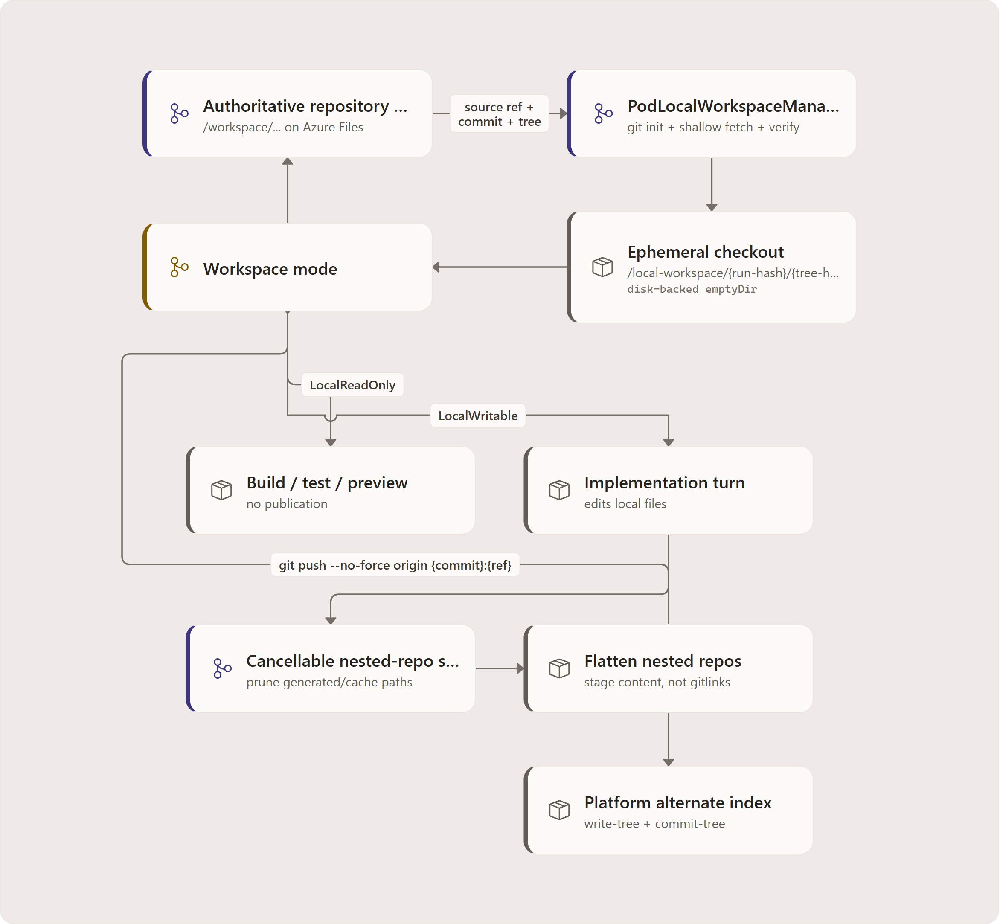
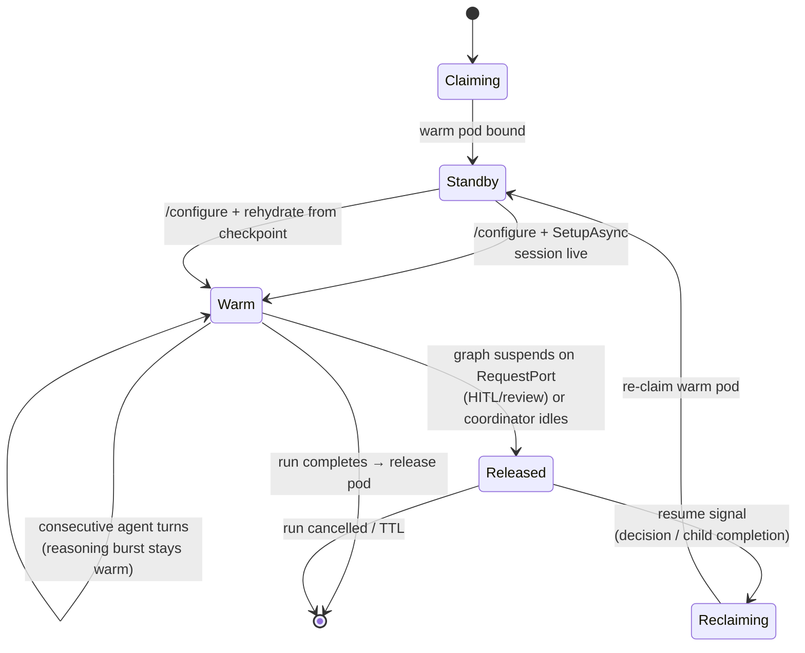
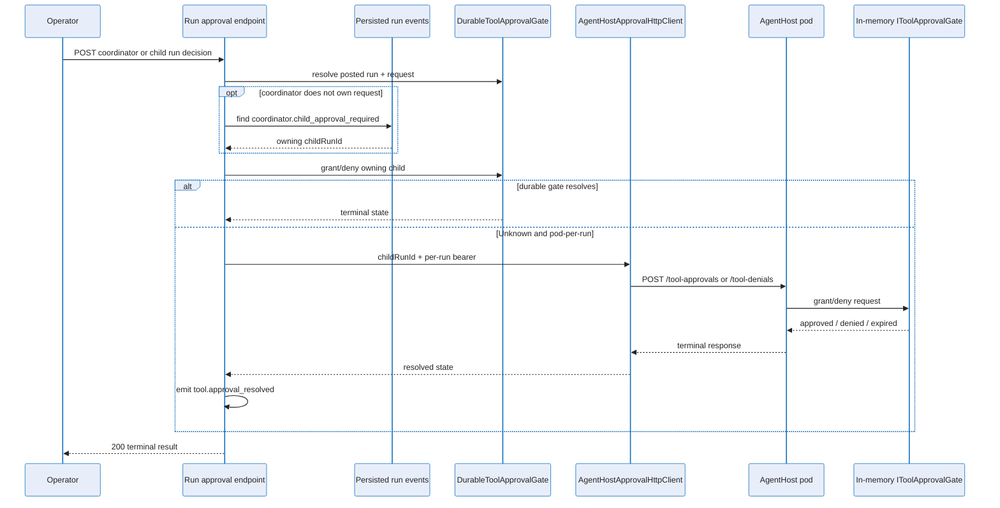
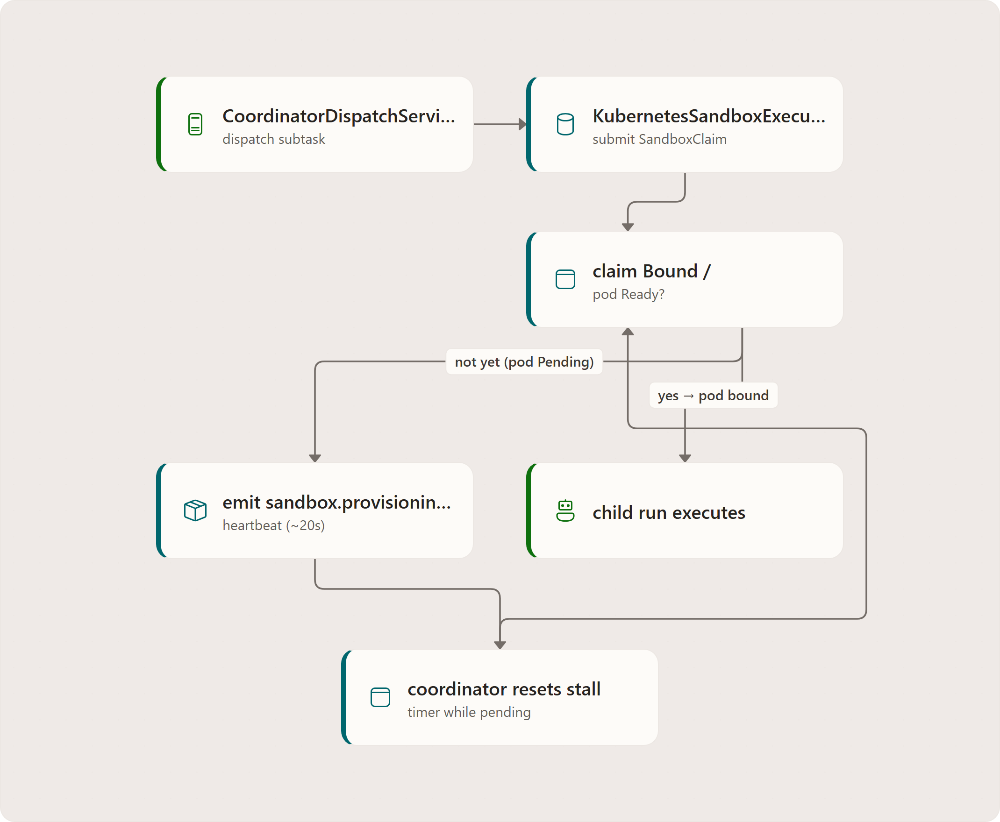

# Sandbox Pod Execution (pod-per-run) — Conceptual Deep Dive

## Why this exists: one fix for two problems

Before pod-per-run shipped, production agent subtasks ran **in-process inside the shared Worker
pod**. That pod held the live GitHub Copilot SDK session for each active run, the in-process
workflow runner, the streaming buffers, the tool/shell execution, and an in-memory history of
recent runs. Because all of it lived in one process, memory scaled with *concurrent +
recently-completed runs × (SDK session + graph + history)*, and the pod ran out of memory.

Sandbox pod execution starts from a single insight: **memory relief and security isolation are the
same fix**. Moving each run's agent execution out of the shared Worker process and into its own
per-run, Kata-isolated pod simultaneously:

1. **relieves the OOM** — the heavy SDK session, the runner, and tool execution leave the shared
   process, so no single process holds more than the runs it actively owns; and
2. **isolates execution** — each run's tool, shell, file, and model I/O happens inside its own VM-backed
   pod with a restricted egress allowlist, instead of sharing one blast radius.

After the move, the API/worker tier becomes a **thin orchestrator**: HTTP, SSE relay, database, and the
orchestration graph. The heavy, untrusted work runs elsewhere, per run, and dies with the run.

> This page explains the *logic* of pod-per-run. For the existing isolation model (filesystem
> containment, governance, executor selection, claim lifecycle, hardening) see
> [Sandbox](./sandbox.md); for the cluster topology see [Infrastructure](./infra-deployment.md). The
> exhaustive flag/identity/token reference is [Sandbox pods reference](../reference/sandbox-pods.md), and
> the operator/user-facing view is [Sandbox pod execution experience](../experience/sandbox-pod-execution.md).

## Before and after: where agent execution runs

### Before pod-per-run: single-Worker-pod execution

Before this rollout, the leaf agent — the object that wraps a live Copilot SDK session — was
created and driven **inside the Worker process**. The workflow graph ran in-process there too, and
the sandbox pod was used only to **exec one shell command at a time** through a warm-pool claim.
The pod was a place to run `run_command`; it was *not* where the agent lived.



<!-- Rendered from ../diagrams/src/sandbox-pod-execution-fig1.json by docs/diagram-renderer +
     Playwright (Fluent-styled React Flow), replacing a Mermaid flowchart.
     Edit the JSON, then run `npm run docs:render-diagrams` and commit the
     regenerated PNG + .hash.txt. -->

Every box inside the Worker pod multiplies by concurrent and recent runs. That is why it OOMed, and
why production had to keep subtasks on one shared in-process owner.

### Now: per-run sandbox pod

Under pod-per-run, the **leaf agent turn relocates into the pod**. The orchestration graph and its
human-in-the-loop (HITL) gates stay in the worker tier; only the agent *turn* — the part that holds the
SDK session and runs tools — moves out.



<!-- Rendered from ../diagrams/src/sandbox-pod-execution-fig2.json by docs/diagram-renderer +
     Playwright (Fluent-styled React Flow), replacing a Mermaid flowchart.
     Edit the JSON, then run `npm run docs:render-diagrams` and commit the
     regenerated PNG + .hash.txt. -->

The decisive architectural fact: **the coordinator's orchestration loop stays in the API/worker tier.
Only agent turns are sandboxed.** Remoting happens at the **AIAgent leaf seam** — the workflow graph,
the `RequestPort`/HITL/review logic, and the suspend/resume machinery never cross the wire. This keeps
all the state that decides *what happens next* in the durable, observable worker, and ships only the
expensive *doing* into the disposable pod.

> The worker↔pod transport is the **A2A bridge** (Agent Framework's Agent2Agent), used in message/stream
> mode. A2A ships in the .NET Agent Framework on a `-preview` package line and is therefore
> **experimental**; it is adopted deliberately, pinned by version, behind the same execution-mode flag
> that provides rollback. See [A2A bridge deep dive](./a2a-bridge.md), the
> [A2A reference](../reference/a2a.md), and the
> [A2A distributed agents experience](../experience/a2a-distributed-agents.md).

## The in-pod AgentHost

The pod runs a minimal host process — **AgentHost** — baked into the sandbox image. Conceptually it is
the pod-side counterpart of the leaf seam:

- it **receives the forwarded turn** (setup + run) from the worker;
- it **requires the run's bearer token** on `POST /a2a/agent/v1/message:stream`;
- it **hosts the real leaf agent** (the Copilot SDK session) directly, and runs the turn locally;
- it **executes tools, shell, and file operations in-pod**, inside the Kata VM boundary; and
- it **streams agent updates and token deltas back** to the worker, which re-injects them into the
  existing run-event stream so the SSE contract to clients is unchanged.

A key simplification: because remoting is at the leaf seam, AgentHost does **not** run its own workflow
graph. The graph lives only in the worker. AgentHost hosts one `AIAgent` and serves its turns. The
worktree commit/diff stays on the worker side, over the **shared workspace volume** both tiers mount, so
the database-write logic stays central and the pod stays stateless beyond the live turn.

With the Worker deployment now set to `Sandbox:AgentExecutionMode=pod-per-run`, the dedicated
AgentHost warm pool is on the live execution path: its standby pods are claimed, configured, and
serve real child-run turns instead of sitting idle.

The AgentHost claim path binds to `AgentHostWarmPoolRef` (default `agentweaver-agent-host`) and calls `/configure` after the warm pod is bound; it does not create an AgentHost-specific per-run `SandboxTemplate` or per-run warm pool. Source: `apps/Agentweaver.Api/Sandbox/KubernetesSandboxExecutor.cs:40`, `apps/Agentweaver.Api/Sandbox/KubernetesSandboxExecutor.cs:332`, `apps/Agentweaver.Api/Sandbox/KubernetesSandboxExecutor.cs:480`, `apps/Agentweaver.Api/Sandbox/KubernetesSandboxExecutor.cs:497`.

The existing per-command exec path is **retained for its current utility purpose** (ad-hoc
`run_command`); it is simply never the agent-turn transport. Nothing about pod-per-run deletes that
capability — see [Sandbox](./sandbox.md#kubernetes-sandbox-lifecycle-claims-over-pods).

## The executor seam: how commands are actually isolated

Pod-per-run answers *where the agent turn runs*. It does not, by itself, answer *how a single
`run_command` is isolated from the host* — that is the job of a second, older seam: the **executor
abstraction**. Both seams matter, and they are easy to conflate, so this section pins down the
relationship.

Whenever an agent runs a shell command, the runtime hands a uniform command object (command line,
working directory, environment, filesystem policy, timeout, network-enabled flag, run id) to an
**`ISandboxExecutor`**, and gets back a uniform result (exit code, stdout, stderr, timeout flag,
truncation flag). The executor decides *how and where* the process actually runs. That uniform contract
is what lets the same agent code run unchanged whether isolation comes from a Windows process container, a
Linux namespace sandbox, or a Kata-isolated Kubernetes pod. The contract itself is described in
[Sandbox › Executor abstraction](./sandbox.md#executor-abstraction-one-command-contract-many-isolation-backends).

### One executor per host, chosen at run start

`SandboxExecutorFactory` selects exactly **one** executor for the host at run start, walking a fixed
ladder and stopping at the first backend that is actually available. It emits a **`sandbox.selected`**
event carrying `backend`, `isRealIsolation`, and `reason`, so the chosen backend — and *why* it was
chosen — is observable for every run.



<!-- Rendered from ../diagrams/src/sandbox-pod-execution-fig3.json by docs/diagram-renderer +
     Playwright (Fluent-styled React Flow), replacing a Mermaid flowchart.
     Edit the JSON, then run `npm run docs:render-diagrams` and commit the
     regenerated PNG + .hash.txt. -->

The ladder, top to bottom:

- **`processcontainer` (Mxc, Windows)** — the first choice on Windows. `mxc` is Microsoft's open-source
  sandbox isolation tool; its Windows `processcontainer` backend (BackendName `Mxc`) is driven by binaries
  in `MXC_BIN_DIR` (for example `wxc-exec.exe --probe` returns a `tier` such as `base-container`). Setup is
  in [Sandbox setup › Windows](../reference/sandbox-setup.md#windows-arm64).
- **`wsl-bwrap` / `wsl-unshare` (WslMxc, Windows)** — when `processcontainer` is unavailable but WSL2
  offers a usable Linux backend.
- **`linux-bwrap` (bubblewrap)** — the preferred Linux backend, a selective-mount namespace sandbox.
- **`lxc-native-linux`** — the Linux fallback when bubblewrap is absent but `lxc-exec` is present.
- **`kubernetes-sandbox-claim` (K8s)** — selected automatically in-cluster. Each command runs in a warm
  pod obtained through a `SandboxClaim` custom resource (`extensions.agents.x-k8s.io/v1beta1`), with Kata
  VM isolation and a NetworkPolicy egress allowlist. This is provisioned by the upstream **agent-sandbox
  controller**, a distinct runtime from MXC — see [The agent-sandbox controller (MXC vs. the
  controller)](#the-agent-sandbox-controller-mxc-vs-the-controller) below.
- **`direct` (Passthrough)** — the last resort, chosen **only when nothing else is available**. It runs
  the command directly on the host with **no isolation layer**; the shell still runs, relying on whatever
  isolation the surrounding deployment already provides.

`IsRealIsolation` is `true` for every real backend and `false` for `direct`. The governance gate enforces
a hard rule: a shell command is allowed only when the selected executor reports `IsRealIsolation == true`
**or** is the `direct` backend. Any *other* non-isolating executor **denies `run_command`** outright — so
an agent never silently runs a shell command under a half-isolated backend. The exact rows and selection
conditions live in the [Sandbox backends table](../reference/sandbox-setup.md#sandbox-backends).

### Two seams, one contract, three tiers

The connective idea for pod-per-run is that **the executor abstraction and pod-per-run agent execution are
the same seam at different deployment tiers — and the A2A agent-turn remoting is orthogonal to both.**
Three things are deliberately distinct:

- **The executor seam (`ISandboxExecutor`)** isolates an individual *command*. Local dev gets MXC
  (`processcontainer`) or bubblewrap; in-cluster gets the Kubernetes claim backend. Same command contract,
  different backend.
- **The Kubernetes claim backend** is the in-cluster *implementation* of that same executor contract:
  `KubernetesSandboxExecutor` runs each command in a warm pod obtained via a `SandboxClaim` CR, with Kata
  VM isolation and NetworkPolicy egress. There is no special second contract for the cluster — it is the
  same `ISandboxExecutor` seam, fulfilled by a pod instead of a local process.
- **A2A agent-turn remoting** (the [A2A bridge](./a2a-bridge.md)) moves an entire *agent turn* — the SDK
  session and its tool loop — out to the per-run pod. That is the pod-per-run story above. It is
  **orthogonal** to backend selection: the in-pod AgentHost still runs each `run_command` through *its
  own* `ISandboxExecutor`. When `AgentHost:SandboxMode=kata`, that executor is
  `PodExecSandboxClient`: it forwards every model-controlled command to the **executor sidecar
  container** of the same pod, where `KataBwrapExecutor` builds the per-run mount namespace. The Kata
  VM isolates the pod from the node, the sidecar container isolates model-controlled processes from
  AgentHost, and bubblewrap removes the shared PVC root from each shell/preview child process.

Read the whole isolation stack top-down: pod-per-run decides *which process hosts the agent turn* (worker
vs. per-run pod, via A2A); the executor abstraction decides *how each command inside that turn is
isolated* (MXC / bwrap / Kata-pod claim plus an in-pod mount namespace); and the governance gate decides *whether the command may run at
all* given the selected backend's `IsRealIsolation`. On a laptop these collapse onto one host — the agent
turn runs in-process and commands isolate via MXC or bubblewrap; in-cluster they fan out — the agent turn
runs in its own Kata VM and commands execute in a run-scoped mount view within that VM. The contract a reader has to remember is
single: *one command in, one uniform result out, isolation chosen per host and announced by
`sandbox.selected`.*

Every Kata AgentHost pod still mounts the shared RWX `/workspace` PVC because linked git worktrees
refer to git metadata outside the worktree directory and the generic warm pool cannot vary pod
mounts after adoption. The pod therefore applies the per-run policy at the **process/mount
boundary**, not by parsing shell syntax. Two containers share the pod:

- `agentweaver-agent-host` hosts the agent turn and the run's brokered GitHub token. It never
  executes a model-controlled command.
- `agentweaver-exec` (same image, `--exec-agent`) executes every model-controlled command inside
  `KataBwrapExecutor`'s per-run mount namespace. It is a real, runtime-created PID namespace with a
  runtime-provided procfs, holds no Kubernetes or AAD identity, and shares only the pod network
  namespace (so preview ports stay reachable) and the two workspace volumes.

Within that structure:

- only the current run worktree, its explicitly registered run HOME, authorized run-scoped scratch,
  pod-private tmp, and the exact linked
  worktree git metadata are bind-mounted; git control metadata is read-only, while the platform
  performs the durable commit after the turn;
- the PVC root and sibling worktrees are absent, so absolute paths, variable indirection, `..`,
  symlinks, and direct Python/.NET file APIs cannot resolve them;
- `/proc` is the executor container's own procfs, bound into the run's mount namespace. It contains
  only that container's processes, so CoreCLR process discovery works while AgentHost's process tree
  is not merely hidden but **absent from the namespace**;
- the child environment is cleared and rebuilt from a minimal baseline plus explicitly supplied
  values; and
- the sidecar executes a real bwrap capability probe before it binds its socket, and AgentHost
  startup fails closed unless that sidecar answers a probe proving it is reachable, isolated, and in
  a *different* PID namespace. There is no passthrough fallback in Kata mode.

#### Why a sidecar and not a nested PID namespace

The original design asked bubblewrap for `--unshare-pid --proc /proc`. That cannot work in **any**
Kubernetes container: the kernel's `mount_too_revealing()` check refuses a fresh procfs inside an
unprivileged user namespace whenever the visible procfs has masked or covered submounts, and every
container runtime — Kata's guest agent included — masks `/proc/kcore`, `/proc/keys`,
`/proc/timer_list`, `/proc/interrupts` and read-only-binds `/proc/bus`, `/proc/fs`, `/proc/irq`,
`/proc/sys`, `/proc/sysrq-trigger`. In production this surfaced as
`bwrap: Can't mount proc on /newroot/proc: Operation not permitted` and, because the isolation probe
is fail-closed, a 0/2 warm pool. CI never caught it because GitHub runners are VMs with an unmasked
`/proc`.

Every way to make the nested mount succeed weakens the boundary — `procMount: Unmasked`,
`CAP_SYS_ADMIN`, a privileged container, or a synthetic `/proc`. Dropping `--unshare-pid` while
keeping `--proc` is worse than useless: bubblewrap then silently binds the outer `/proc`, so the
sandbox *looks* isolated and is not. A second container gets the same guarantee for free, because the
runtime creates the PID namespace and the matching procfs itself — no capability, no privilege, no
host namespace. Bubblewrap keeps doing the per-run mount scoping it *can* still do, with
`--bind /proc /proc` and no PID claim it cannot back.

The AgentHost↔sidecar channel is a Unix domain socket on a pod-private `emptyDir` mounted into only
those two containers, never bound into a sandboxed child's mount namespace, and guarded by a 32-byte
token written mode-0600 next to it and compared in constant time. Long-lived preview processes are
supervised by a relay child of AgentHost that holds the connection: if the relay or AgentHost dies,
the sidecar sees the disconnect and terminates the sandboxed process group, preserving
die-with-parent semantics across the container boundary.

`ShellCommandValidator` and `SharedWorkspacePathGuard` remain compounding controls, but the security
claim for #476 no longer depends on command text.

### Contract with #481

#481 remains the pod-wide storage redesign: relocate authoritative worktrees off the API HOME tree,
empirically prove `volumeClaimTemplates` warm-pool behavior on the pinned controller, provision a
private volume/source snapshot for every run, define authenticated write-back/resume semantics, and
securely sanitize/delete the volume. It may then remove the shared PVC mount from the AgentHost pod
entirely. #476 does **not** create dynamic PVCs, templates, or pools and does not alter controller
adoption; it guarantees that model-triggerable shell and preview child processes cannot see the
shared root while preserving existing linked-worktree operation. Until #481 lands, linked worktrees
still receive read-only access to their repository's shared common git metadata, so commits and refs
already present in that same repository are not a per-run confidentiality boundary; other projects'
worktrees and git metadata remain absent.

## The agent-sandbox controller (MXC vs. the controller)

In-cluster, the sandbox pod a run executes in is not created by Agentweaver directly and is **not** MXC.
It is provisioned by the upstream **agent-sandbox controller** ([`kubernetes-sigs/agent-sandbox`](https://github.com/kubernetes-sigs/agent-sandbox)),
which Agentweaver installs in `scripts/azure/steps/10-create-cluster.mjs` (default `v0.5.3`). The naming overlap
trips people up, so pin it down:

- **MXC** = `Sabbour.Mxc.Sdk` / `wxc-exec.exe`, the **local-host** command-isolation runtime behind the
  `processcontainer`, WSL, and `lxc-exec` executors. It runs on a laptop or non-cluster host and has no
  controller and no CRDs.
- **agent-sandbox controller** = the **in-cluster** operator that turns a `SandboxClaim` into a bound,
  Kata-isolated pod. The in-cluster `ISandboxExecutor` (`KubernetesSandboxExecutor`) talks only to this
  controller's CRDs; there is no MXC binary in the cluster.

So "how is the sandbox implemented with MXC?" has two honest answers depending on tier: **locally**, a
command is isolated by MXC spawning a `wxc-exec.exe` sandbox process; **in-cluster**, a command (or a
whole agent turn) runs in a pod the agent-sandbox controller bound for the run. Both present the identical
`ISandboxExecutor` contract.

### How the controller provisions a run's pod

The three CRDs (API group `extensions.agents.x-k8s.io`; `KubernetesSandboxExecutor` targets the `v1beta1` storage version — [`SandboxClaimConventions.cs:23`](#source)) Agentweaver applies are:

- **`SandboxTemplate`** (`k8s/base/sandbox-template-agenthost.yaml`, `agentweaver-agent-host`) — the live AgentHost pod shape and hardening:
  `kata-vm-isolation` runtime class, non-root UID/GID 1000, dropped capabilities, `/workspace` PVC, and the A2A listener on container port `8088`.
- **`SandboxWarmPool`** — keeps AgentHost pods pre-built from a template so a claim binds without a cold start. The live pool is `agentweaver-agent-host` (`k8s/base/sandbox-warmpool-agenthost.yaml`, `replicas: 2`). It pre-warms the .NET process and Copilot SDK; per-run context arrives later via `/configure`.
- **`SandboxClaim`** — created per run by `KubernetesSandboxExecutor` with `spec.warmPoolRef.name`
  (the pool to bind), `spec.lifecycle.{ttlSecondsAfterFinished, shutdownPolicy: Delete}`, and
  `spec.env[]` for static values only on the AgentHost path (`AgentHost__KeyVaultUri`, paths, port, mTLS settings). `RunId`, `UserId`, `TurnBearerToken`, and `KvUserSecretName` are delivered after binding by `POST /configure`. The controller adopts a warm pod and signals readiness via a `Ready` condition.


```mermaid
%%{init: {'theme':'base','themeVariables':{'fontFamily':'Segoe UI, system-ui, -apple-system, sans-serif','fontSize':'15px','primaryColor':'#E8EEF9','primaryBorderColor':'#0F6CBD','primaryTextColor':'#242424','lineColor':'#605E5C','clusterBkg':'#FAF9F8','clusterBorder':'#D2D0CE','edgeLabelBackground':'#FFFFFF'}}}%%
sequenceDiagram
    participant Exec as KubernetesSandboxExecutor
    participant Claim as SandboxClaim (CR)
    participant Ctrl as agent-sandbox controller
    participant Pool as SandboxWarmPool
    participant Pod as Kata sandbox pod
    participant Reg as PodNameRegistry
    Exec->>Claim: CreateClaimAsync(warmPoolRef, lifecycle)
    Claim->>Ctrl: reconcile new claim
    Ctrl->>Pool: adopt a warm pod
    Pool-->>Pod: pod assigned to claim
    Ctrl-->>Claim: Ready condition = True,<br/>status.sandbox.name = pod
    loop poll every 2s
        Exec->>Claim: WaitForBoundAsync (read status)
    end
    Claim-->>Exec: Ready True → pod name
    Exec->>Reg: Register(runId, podName)
    opt AgentHost pod-per-run
        Exec->>Exec: Generate 256-bit turn bearer token
        Exec->>Reg: RegisterTurnToken(runId, token)
        Exec->>Pod: GetPodIpAsync → status.podIP
        Exec->>Pod: POST /configure(runId, userId, token, kvUserSecretName, workingDirectory)
        Pod->>Pod: TryConfigure once + SetupAsync in workingDirectory
        loop poll /healthz until 200 (≤90s)
            Exec->>Pod: GET http[s]://podIP:8088/healthz
        end
        Exec->>Reg: RegisterAgentEndpoint(http[s]://podIP:8088/a2a/agent)
    end
    Note over Exec,Ctrl: claim delete (ad-hoc) or TTL →<br/>controller GCs pod + service
```

The executor reads the pod name from `status.sandbox.name` (the agent-sandbox controller's shape) once the
claim's `Ready` condition is `True`. For pod-per-run AgentHost pods it then polls the pod's `status.podIP` to
build the A2A endpoint. Agentweaver never deletes pods itself — it deletes the *claim* (or lets the TTL
expire) and the controller garbage-collects the pod and its service. Anything not visible in these
manifests or the executor code (controller replica count, leader election, image, RBAC of the controller
itself) is **operationally configured by the agent-sandbox release**, not specified by Agentweaver.

### Transient Kubernetes API resilience

Pod-claim creation and the bind/IP polls that follow it are guarded against transient Kubernetes API faults (issue #230). A single mid-flight connection reset during `CreateClaimAsync` used to fail the subtask's first agent turn outright, cascading into `assembly_blocked` for every dependent subtask. The executor now wraps the **idempotent** k8s calls — the mutating claim create plus the read-only `WaitForBoundAsync` and `GetPodIpAsync` polls — in a bounded retry (`ExecuteK8sWithRetryAsync<T>`, `MaxK8sAttempts = 3` total tries) with exponential backoff (~250 ms · 2^(n−1), capped ~2 s) plus 0–250 ms jitter to de-sync concurrent launches retrying the same API server after a blip.

`IsTransientK8sFault` decides what is worth retrying:

- **Retried** — a socket/IO connection reset (`SocketException 104` → `IOException` → `HttpRequestException`, directly or nested in an inner exception), a `429` or `5xx` from the API server, and an `HttpClient` timeout (`OperationCanceledException`/`TaskCanceledException` with no caller cancellation).
- **Never retried** — caller cancellation short-circuits to `false`, so a genuine cancel aborts immediately (the backoff `Task.Delay` also honors the token).
- **`409 Conflict` is not a transient fault.** It is handled attempt-awarely to preserve idempotency: a first-attempt `409` is a genuinely pre-existing claim owned by an earlier launch (wait for it); a `409` on a **retry** means our own create committed server-side before a reset hid the response, so the claim is treated as created and configured — never reused un-configured and token-less.

The retry wrapper must only wrap idempotent calls: the non-idempotent AgentHost `POST /configure` stays outside it, because a second delivery hard-fails `409`.

### Warm-pool configure and readiness gate (AgentHost)

A bound claim means the controller assigned a pod; it does **not** mean the run-specific AgentHost
is ready to serve turns. AgentHost warm pods start with no `RunId`, enter standby, and log that
they are waiting for `/configure`. This lets
`k8s/base/sandbox-warmpool-agenthost.yaml` run at `replicas: 2` without CrashLooping: the .NET process
and Copilot SDK host are already warm, but no run context is required until a claim binds. With the
Worker now in `pod-per-run`, those two standby pods are the hot path for coordinator child turns.

At run launch, `KubernetesSandboxExecutor` generates a 256-bit turn bearer token, resolves the run owner's Key Vault secret name, resolves the run's shared orchestration worktree path, reads the run's `AutoApproveTools` option from the API-side `IRunOptionsStore`, and calls `POST {scheme}://{podIP}:8088/configure` with `runId`, `userId`, `turnBearerToken`, `kvUserSecretName`, `sharedWorkingDirectory`, and `autoApproveTools`. The legacy `workingDirectory` property is sent as a rolling-upgrade alias and always carries the same API-visible shared path. Coordinator sub-run ids such as `-coordinator-decompose` resolve back to the parent run so child stages inherit the same shared worktree. `autoApproveTools` propagates the per-run auto-approve flag so the warm pod — which boots a fresh `IRunOptionsStore` defaulting to `false` — honors run-level auto-approve at its HITL gate; without it, every `web_fetch` in a `pod-per-run` autopilot run would stall the 5-minute approval gate and auto-deny (issue #221). `/configure` is one-time (`409` after the first successful call), returns `400` when `runId` is missing, is excluded from the readiness gate, and is intentionally not protected by the turn token because it delivers that token. NetworkPolicy limiting AgentHost ingress to API/worker pods is the guard.

After `/configure`, `AgentHostStartupService.ConfigureAsync` runs `SetupAsync` with that per-run working directory overriding the static `AgentHost__WorkingDirectory` env default; only then does `/healthz` return `200` and the executor registers the A2A endpoint. This establishes the invariant `SetupAsync` working directory == `Run.WorktreePath` == the path named in the run's system prompt, so files written by one sibling agent are visible to later synthesis or assembly stages. If working-directory resolution fails, launch continues and the pod falls back to the env default. The wait is bounded (default `90 s`, `1 s` interval, `5 s` per-attempt timeout) and honors the launch cancellation token. The `a2a-sandbox-pod` client still carries the connection-refused retry handler as defense-in-depth, but the normal path is: **claim warm pod → configure → health ready → first turn**.

#### Pod-local execution workspaces

`PodLocalWorkspaceManager` is the materialization and publication seam for work that should not run
directly on Azure Files SMB. `ExecutionWorkspaceMode` separates location from mutation policy:

- `Shared` runs against the existing PVC-backed worktree.
- `LocalReadOnly` creates a verified pod-local checkout and refuses publication.
- `LocalWritable` creates the same verified checkout for an implementation turn, then publishes its
  resulting commit back to the authoritative repository.

The API-visible worktree remains on the shared `/workspace` PVC for orchestration, review, and durable
branch state. Dependency installation, compilation, tests, preview artifacts, and implementation edits
happen in a **complete checkout** under `/local-workspace/{run-hash}/{tree-hash}`. That root is an
8 GiB, disk-backed `emptyDir`: it is local to the claimed pod, is not synchronized to Azure Files, and
disappears when the pod is released. The shared repository receives changes only through the explicit
write-back path described below.



<!-- Rendered from ../diagrams/src/sandbox-pod-execution-fig4.json by docs/diagram-renderer +
     Playwright (Fluent-styled React Flow), replacing a Mermaid flowchart.
     Edit the JSON, then run `npm run docs:render-diagrams` and commit the
     regenerated PNG + .hash.txt. -->

##### Materialize and verify before execution

The `/configure` payload carries the shared/source coordinates rather than pretending that a
pod-local directory already exists: `sourceRepositoryPath`, `sourceRef`, `baseCommitSha`,
`expectedTreeHash`, and `scratchRoot`. AgentHost derives the scratch path, checks free ephemeral
capacity, initializes a repository, shallow-fetches the requested ref, and verifies both the fetched
commit and its tree before checking out the immutable base detached. A mismatch is fatal; execution
never proceeds on a nearby revision.

Assembly Build/Test selects `LocalReadOnly`. Implementation child turns select `LocalWritable` and
must fetch their authoritative `agentweaver/{childRunId}` branch. Both modes therefore execute away
from SMB while retaining a precise coordinate back to the durable branch.

##### Write-back is ordinary Git, not a custom transport

At the end of a successful writable turn, AgentHost prepares a platform-owned alternate index from
the immutable base, stages the final filesystem state, writes a tree, and creates a single-parent
commit with the configured platform author identity. It then invokes Git directly with the literal
shape:

```text
git push --no-force origin {resultCommit}:{writebackRef}
```

There is no bespoke file-copy protocol, patch transport, or force push. The command inherits the
pod's existing Git environment and credential context; write-back does not mint, serialize, or deliver
a second credential. In the current pod-local flow, `origin` is the shared source repository path
delivered in `/configure`, so this publication is a normal Git repository-to-repository push rather
than a custom network transport. The run's existing GitHub token remains available through the
AgentHost token store for GitHub operations; the write-back path does not create a parallel token
mechanism.

The pushed ref is a unique temporary ref under the Agentweaver write-back namespace. The API side
then validates the descriptor, commit parent, tree, and authoritative branch state before applying a
fast-forward. If the local filesystem produced no tree change, AgentHost returns the immutable base
and does not push a temporary ref.

##### Nested repositories are flattened into content

A nested checkout or submodule cannot be staged naively. Git normally records it in the parent tree
as mode `160000` — a **gitlink** pointing at another commit — rather than recording the nested files.
That pointer is unusable when the nested repository is only ephemeral pod state or when the receiving
branch must contain the generated content.

Before writing the result tree, AgentHost discovers nested `.git` directories and `.git` files,
deepest first. It temporarily moves their metadata outside the workspace, removes any cached gitlink,
stages the nested directory as ordinary files, and restores the metadata even on failure. A final
`git ls-tree` check rejects any remaining mode-`160000` entries.

The discovery walk is deliberately bounded operationally:

- it checks cancellation while popping and enumerating directories;
- it prunes `.git`, `.next`, `bin`, `build`, `dist`, `node_modules`, and `obj`
  unless that directory is itself a nested repository root;
- it does not traverse reparse points; and
- filesystem access failures become a typed `writeback_invalid` failure instead of silently producing
  an incomplete tree.

This keeps write-back responsive on dependency-heavy workspaces while still detecting a repository
that an implementation turn intentionally created inside an otherwise ignored path.

##### One HOME/XDG cache contract for every toolchain

Every non-operator AgentHost run gets a HOME outside the checkout at
`<execution-scratch>/runtime-home/<run-hash>`. After resolving the final Shared or pod-local
working directory, `PodLocalWorkspaceManager` creates the HOME and its XDG children, then
registers that exact path through `IRunWorkspaceRegistrar` — in Kata mode that registration travels
over the executor socket and is applied by the sidecar's `KataBwrapExecutor`:

| Variable | Registered value |
| --- | --- |
| `HOME` | `<runtime-home>` |
| `XDG_CACHE_HOME` | `<runtime-home>/.cache` |
| `XDG_DATA_HOME` | `<runtime-home>/.local/share` |
| `XDG_CONFIG_HOME` | `<runtime-home>/.config` |

This tech-agnostic contract replaced the former matrix of npm-, Yarn-, and pnpm-specific variables.
Tools that follow HOME/XDG conventions now place caches and state on the same fast scratch disk
without every new ecosystem requiring another environment-variable exception. Because the runtime
HOME is outside the checkout, it cannot enter write-back. Kata shell and preview children fail closed
until the workspace and runtime HOME are both registered, bind only the registered HOME read-write,
and rebuild HOME/XDG from that immutable registration. Inherited or command-supplied HOME/XDG values
cannot select another mount or override the registered values.

Preview command discovery still reads the API-visible tree, but `PreviewStep` maps the resolved
relative cwd into the verified local checkout. The preview therefore sees the exact dependencies and
build artifacts produced by the gate without copying those artifacts to Azure Files.

### Node topology: the dedicated kata user pool

Sandbox/AgentHost pods require **Kata VM isolation**, which on AKS is the `workloadRuntime:
KataVmIsolation` node-pool property (nodes get the `kubernetes.azure.com/kata-vm-isolation=true`
label and a Kata-capable gen2 image). The cluster uses **cluster-autoscaler** (not NAP):

- **NAP and cluster-autoscaler are mutually exclusive.** This cluster uses cluster-autoscaler
  on all three pools; `--node-provisioning-mode Auto` is not set.
- **Kata capacity lives in a fixed user pool.** `katapool` is created with
  `--workload-runtime KataVmIsolation --enable-cluster-autoscaler --min-count 1 --max-count 5`
  so it scales automatically under load without requiring manual resize.
- **System pool is reserved.** `nodepool1` carries `CriticalAddonsOnly=true:NoSchedule`; only
  kube-system / critical-addon pods land there. App workloads go to `apppool` (no taint,
  no tolerations required in app deployment YAMLs).

The three-pool layout:

```bash
# apppool — app workloads (api, worker, mcp, frontend, jobs); no taint
az aks nodepool add \
  --resource-group "${RESOURCE_GROUP}" --cluster-name "${CLUSTER_NAME}" \
  --name apppool --mode User --os-sku AzureLinux \
  --node-vm-size Standard_D4s_v6 \
  --enable-cluster-autoscaler --min-count 1 --max-count 5 \
  --ssh-access disabled

# katapool — sandbox/AgentHost pods; taint keeps non-sandbox pods out
az aks nodepool add \
  --resource-group "${RESOURCE_GROUP}" --cluster-name "${CLUSTER_NAME}" \
  --name katapool --mode User --os-sku AzureLinux \
  --workload-runtime KataVmIsolation --node-vm-size Standard_D4s_v6 \
  --enable-cluster-autoscaler --min-count 1 --max-count 5 \
  --node-taints sandbox=kata:NoSchedule --labels agentweaver.io/kata=true \
  --ssh-access disabled
```

| Pool        | Mode   | workloadRuntime | Autoscaler  | Taint                             | Label                       | Receives                       |
|-------------|--------|-----------------|-------------|-----------------------------------|-----------------------------|-------------------------------|
| `nodepool1` | System | *(standard)*    | 1–3 nodes   | `CriticalAddonsOnly=true:NoSchedule` | —                        | kube-system / critical addons  |
| `apppool`   | User   | *(standard)*    | 1–5 nodes   | *(none)*                          | —                           | api, worker, mcp, frontend, jobs |
| `katapool`  | User   | KataVmIsolation | 1–5 nodes   | `sandbox=kata:NoSchedule`         | `agentweaver.io/kata=true`  | Sandbox / AgentHost pods       |

The Kata `SandboxTemplate` pod spec (`k8s/base/sandbox-template-agenthost.yaml`) wires pods to `katapool` — the CRD `podTemplate.spec` is a full PodSpec,
so `tolerations`/`affinity` pass straight through to the rendered pod:

- a **toleration** for `sandbox=kata:NoSchedule` admits pods onto the tainted `katapool`; and
- a **preferred** (not required) `nodeAffinity` for `agentweaver.io/kata=true` *biases* pods onto
  `katapool`; cluster-autoscaler scales `katapool` when demand grows — pods are **never stranded**.

The `CriticalAddonsOnly` taint lives only on `nodepool1`; app workloads schedule onto `apppool`
without any toleration changes.

## The hybrid pod-granularity model

How long should a run hold a pod? Two naive answers both fail:

- **Pod-per-turn** (claim a pod for each turn, release between turns) pays a warm-pool claim, an agent
  setup, and a session deserialize *on every turn*. That is unaffordable latency and token cost, and it
  risks session round-trip drift.
- **Pod-per-run, held continuously** (one pod for the whole run, never released) keeps a pod — with its
  live SDK session — alive through unbounded human-review waits and through a coordinator's long idle
  life while it awaits child runs. That recreates a softer, *distributed* OOM and wastes capacity.

Agentweaver therefore uses a **hybrid**: pod-per-run **with checkpoint-and-release on suspend**.


```mermaid
stateDiagram-v2
    [*] --> Claiming
    Claiming --> Standby: warm pod bound
    Standby --> Warm: /configure + SetupAsync<br/>session live
    Warm --> Warm: consecutive agent turns<br/>(reasoning burst stays warm)
    Warm --> Released: graph suspends on RequestPort<br/>(HITL/review) or coordinator idles
    Released --> Reclaiming: resume signal<br/>(decision / child completion)
    Reclaiming --> Standby: re-claim warm pod
    Standby --> Warm: /configure + rehydrate from checkpoint
    Warm --> [*]: run completes → release pod
    Released --> [*]: run cancelled / TTL
```

The rules of the model:

- **A pod is warm for an active reasoning burst.** One pod, one live session, serves all the
  *consecutive* agent turns of an active burst. Inter-turn boundaries do **not** release the pod —
  releasing and re-setting up between every turn is exactly the cost pod-per-turn would pay.
- **The pod is checkpoint-and-released when the graph *suspends on an external gate*.** The release
  boundary is graph suspension on a `RequestPort` — a HITL/review gate, or the coordinator loop idling
  while it awaits child runs — **not** a mere inter-turn boundary. While a human is deciding, or while
  the coordinator waits on children, there is nothing for the SDK session to do, so the pod is released
  back to the warm pool.
- **Resume re-claims a warm pod and rehydrates.** On the resume signal (a HITL decision arrives, or a
  child run completes), the worker re-claims a warm pod and rehydrates the run from the brokered
  checkpoint.

For this to be correct, the checkpoint must carry enough to perfectly reconstruct the suspended run: the
**serialized agent session blob** plus the **workflow superstep state**, including the correlation id of
the suspended external request. Two facts make rehydration cheap and safe:

- the **worktree is already durable** on the shared workspace volume, so no file state needs to travel in
  the checkpoint; and
- the **run-scoped context is re-delivered at re-claim via `/configure`**, so a resumed pod gets a fresh turn token and configured Key Vault secret name rather than inheriting stale state (see the credential model below).

A tuning sub-flag, `Sandbox:ReleasePodOnSuspend` (default **true**), disables the release for
low-latency-resume or debugging — the pod then stays warm across a suspension at the cost of holding
capacity. The release is **internal behavior of `pod-per-run`**; it does not change the execution-mode
flag value.

## Credential model — without a broker

A persistent design question was how a sandboxed agent gets the credentials it needs (to call the model,
to clone/push the run's repository) without a central capability-token broker minting and validating
tokens for every pod. The resolved answer is: **there is no broker.** The pod legitimately holds a
**run-scoped credential**, by one of two mechanisms:

- **Preferred — workload identity.** The sandbox pod's service account is federated, so the pod obtains a
  short-lived model token from the OIDC-federated identity at runtime. Nothing is baked into the image,
  and no long-lived secret sits in the pod. This is consistent with the cluster's passwordless posture.
- **Alternative — run-scoped token at claim time.** When the worker claims the pod, it injects a
  **short-lived, run-scoped** token (e.g. a projected secret) consumed by AgentHost at startup. The
  token's lifetime is bounded by the claim/run.

Either way, the credential is **scoped to the single run** and **never baked into the image**. The
dropped pieces are explicit: there is **no `CapabilityTokenService`**, no coordinator-as-pod recursion,
and no bespoke duplex sandbox-agent protocol. The previous "pods hold no secrets" rule was a
*recommendation*, not a requirement; relaxing it to "pods hold only a run-scoped, short-lived credential"
is what lets the broker disappear.

The same principle drives **GitHub access**: the run acts *as its signed-in user*, so the pod receives only the run owner's Key Vault secret name in `/configure`. `KeyVaultUserTokenProvider` fetches that one user's stored GitHub token with workload identity and caches it in memory for the pod lifetime. The old infrastructure-layer CSI projection has been replaced by application-layer isolation inside AgentHost; the trade-off and mechanics are in [Agent-host token delivery](./agent-token-delivery.md). The security principle is that the pod serves only the configured user's scope — never another user's scope and never a shared workspace token mirror.

The A2A turn path has its own run-scoped secret. At AgentHost launch, `KubernetesSandboxExecutor`
generates a 256-bit bearer token, sends it in `POST /configure`, and registers it in
`IAgentHostTurnTokenRegistry`. `RemoteAgentProxy` sends that value as `Authorization: Bearer ...` on
every `message:stream` call, and AgentHost accepts only its own token. This means NetworkPolicy/mTLS are
not the only gates on the turn endpoint, and a token stolen from one run cannot reach another run's pod.

Egress is **default-deny** with a narrow allowlist: the model endpoint, the API/worker bridge endpoint,
and the git remote(s) the run legitimately needs. Everything else — especially arbitrary in-cluster
services and the database — is denied. Sandbox pods talk to the worker tier, never directly to the
database.

The pod-root control endpoints use the separately minted per-run preview-runner credential. It is
delivered only in the `/configure` body, stored in `AgentHostRuntimeState`, and persisted under the
replica-safe key returned by `PreviewRunnerCredential.SecretKey(runId)`. The API re-fetches this
credential when it must call back into the pod for preview control or tool-approval resolution.

## Returning tool-approval decisions to AgentHost

Pod-per-run moves the approval wait into AgentHost: its in-memory `IToolApprovalGate` owns the pending
request while the public approval endpoint runs in the API process with a `DurableToolApprovalGate`.
Issue #196 closed the missing API-to-pod return leg.

When an operator posts either the child run id or its coordinator run id, the API resolves the owning
child. If the durable gate reports `Unknown` and `Sandbox:AgentExecutionMode` is `pod-per-run`, the API
resolves the pod origin, loads the per-run credential, and forwards the decision over the existing
`a2a-sandbox-pod` HTTP client. AgentHost authenticates the request and resolves its local gate. A
terminal result is mapped to HTTP 200 and the API emits `tool.approval_resolved`; `unknown`, `pending`,
and unreachable results map to 404, 409, and 503 respectively.


```mermaid
%%{init: {'theme':'base','themeVariables':{'fontFamily':'Segoe UI, system-ui, -apple-system, sans-serif','fontSize':'15px','primaryColor':'#E8EEF9','primaryBorderColor':'#0F6CBD','primaryTextColor':'#242424','lineColor':'#605E5C','clusterBkg':'#FAF9F8','clusterBorder':'#D2D0CE','edgeLabelBackground':'#FFFFFF'}}}%%
sequenceDiagram
    participant User as Operator
    participant API as Run approval endpoint
    participant Events as Persisted run events
    participant Durable as DurableToolApprovalGate
    participant Client as AgentHostApprovalHttpClient
    participant Host as AgentHost pod
    participant Local as In-memory IToolApprovalGate
    User->>API: POST coordinator or child run decision
    API->>Durable: resolve posted run + request
    opt coordinator does not own request
        API->>Events: find coordinator.child_approval_required
        Events-->>API: owning childRunId
    end
    API->>Durable: grant/deny owning child
    alt durable gate resolves
        Durable-->>API: terminal state
    else Unknown and pod-per-run
        API->>Client: childRunId + per-run bearer
        Client->>Host: POST /tool-approvals or /tool-denials
        Host->>Local: grant/deny request
        Local-->>Host: approved / denied / expired
        Host-->>Client: terminal response
        Client-->>API: resolved state
        API->>API: emit tool.approval_resolved
    end
    API-->>User: 200 terminal result
```

| Source | Role |
| --- | --- |
| `apps/Agentweaver.Api/Endpoints/EndpointHelpers.cs:43-98` | Resolves a coordinator post to the owning child, including persisted approval-required events. |
| `apps/Agentweaver.Api/Endpoints/RunEndpoints.cs:1559-1705` | Tries the durable gate, invokes the pod fallback, and exposes the public status contract. |
| `apps/Agentweaver.Api/Endpoints/RunEndpoints.cs:2590-2718` | Loads the per-run credential, maps pod outcomes, and emits `tool.approval_resolved`. |
| `apps/Agentweaver.Api/Sandbox/AgentHostApprovalHttpClient.cs:28-112` | Resolves the pod origin and sends authenticated decisions through `a2a-sandbox-pod`. |
| `apps/Agentweaver.AgentHost/Program.cs:287-288,486-588` | Hosts and authenticates the pod-local approval routes and resolves the in-memory gate. |

## Reaching into the pod: browser preview

Default-deny egress governs traffic *out* of the pod. A separate, deliberate path lets an operator (or a
running agent) reach *into* a run's sandbox pod: the **sandbox browser preview**. When an agent starts a
server inside its sandbox (a dev server, a built app, a debug endpoint), the run's pod can expose that port
back through the API on demand, so a human can open a live preview scoped to exactly that run's pod.

In **AKS deployments** (where `Sandbox:Preview:Enabled=true`) this is a **Gateway-direct reverse proxy**: the
API creates a per-preview `ClusterIP Service` + `HTTPRoute` that attaches to the shared
`agentweaver-preview-gateway` and routes `{token}-preview.{ZoneSuffix}` directly to the sandbox pod. The
response includes a public `preview_url`; no loopback port or `kubectl` process is involved. The agent or the
operator UI can also initiate this via the `start_preview` MCP tool, which first routes through a
human-in-the-loop approval gate.

In **local dev** (where `Sandbox:Preview:Enabled=false`) the fallback path still exists: the
implementation (`PortForwardService`) shells out to
`kubectl port-forward --address 127.0.0.1 pod/{podName} :{targetPort} -n {namespace}`, parses the chosen
loopback port from kubectl's `Forwarding from 127.0.0.1:<port> ->` line, and probes TCP until ready. It
returns a **`local_port` on the API host — not a public URL**; the `preview_url`/`previewUrl` fields are not
populated and the UI says so honestly when no proxied URL is returned. Sessions are tracked in memory, capped
at 3 per run and 20 globally, and cleaned up explicitly.

Neither path widens the pod's own egress allowlist; both are inbound tunnels the operator/agent opens, not
capabilities the sandboxed code can grant itself. The AKS NetworkPolicy
`sandbox-allow-preview-ingress` (`k8s/base/networkpolicy-sandbox.yaml`) admits TCP 3000–9000 exclusively from
`agentweaver-preview-gateway` pods — no other source can reach those ports.

> **Dedicated pages:** the browser preview has its own first-class docs —
> [Deep Dive](./sandbox-browser-preview.md), [Reference](../reference/sandbox-browser-preview.md), and
> [User Guide](../experience/sandbox-browser-preview.md).
> For the AKS-specific setup see [Sandbox browser preview — Deploy to AKS](../guide/deployment-aks.md#sandbox-browser-preview).

## The execution-mode flag and rollback

Everything above is gated behind a single flag so the change is reversible at any moment:

`Sandbox:AgentExecutionMode` ∈ { **`in-api`**, **`pod-per-run`** }.

- **`pod-per-run`** is now the production Worker setting. It activates the bridge and the per-run
  AgentHost pod, with the hybrid release behavior tuned by `Sandbox:ReleasePodOnSuspend` (default
  `true`).
- **`in-api`** remains available as the **fallback / rollback path**. If pod-per-run misbehaves —
  including any instability in the `-preview` A2A transport — flipping back to `in-api` restores
  the old in-process execution model without deploying a second transport.

This "default to today's behavior, flip per environment, roll back by flag" discipline is the same
posture used across the distributed-execution rollout. Pod-per-run is the first, independently shippable
phase — it stops the OOM on its own, before the later data-store and web/worker-split phases. See
[Distributed execution & scaling](./infra-deployment.md) for the surrounding phasing.

## Rebuild blueprint

To rebuild pod-per-run from these ideas:

1. **Keep the orchestration graph and HITL gates in the worker.** Relocate only the leaf agent turn.
   Remote at the `AIAgent` seam so the graph never crosses the wire.
2. **Introduce a remote leaf proxy** on the worker that forwards setup/run to the pod and re-emits the
   pod's update stream locally, so the rest of the graph and the SSE relay are unchanged.
3. **Bake a minimal AgentHost** into the sandbox image that hosts the real leaf agent, requires the
   per-run bearer on `message:stream`, and runs tools in-pod; stream updates back to the worker.
4. **Make checkpoints brokered/durable** so any worker (and a re-claimed pod) can read them — the
   serialized session blob plus superstep state, including the suspended external-request correlation id.
5. **Implement the hybrid lifecycle:** warm across consecutive turns; checkpoint-and-release on
   `RequestPort`/coordinator-idle suspension; re-claim + rehydrate on resume. Gate the release with
   `Sandbox:ReleasePodOnSuspend`.
6. **Give the pod run-scoped context** via one-time `/configure`: RunId, UserId, the A2A turn bearer token, and the Key Vault user-secret name. Fetch the user token with workload identity and no broker.
7. **Default deny egress** to model + worker + git only; never let the pod reach the database.
8. **Gate the whole thing behind `Sandbox:AgentExecutionMode`** so production can run `pod-per-run`
   while retaining `in-api` as an instant rollback path.

## Security invariants

- The orchestration graph, HITL decisions, and run record live in the **worker**, never in the pod — a
  compromised pod cannot rewrite *what happens next*.
- Each run's heavy execution is confined to its **own Kata-isolated pod** with a **default-deny egress
  allowlist**; the pod cannot reach the database or arbitrary in-cluster services.
- The pod holds **only the configured run owner's credential in memory** after `/configure` — never a broker key, never another run's or user's scope.
- The A2A turn endpoint is application-layer authenticated with a per-run bearer token; a token from one
  pod is not valid against any other pod.
- The pod is **disposable and re-creatable**: durable state lives in the shared workspace volume and the
  brokered checkpoint, so killing a pod loses no run.
- The whole capability is **reversible by a single flag** (`Sandbox:AgentExecutionMode=in-api`).

## Orphaned-pod reaper and Kubernetes-owned admission

### Why orphaned pods happen

Pod-per-run expects every run lifecycle path (normal completion, stall-fail, cancellation) to call `ReleaseAgentHostPodAsync` before exiting. Any path that fails to do so leaves a pod running without an active run — an **orphaned pod** that consumes cluster CPU quota but does no work. Over time these accumulate and exhaust the `katapool` capacity.

### The reaper

`AgentHostReaperService` (`IAgentHostReaper`, singleton) sweeps all agent-host pods in the namespace and identifies pods that have no matching active run record. It is driven by the coordinator heartbeat's 3rd tick phase on a tunable cadence:

```
Coordinator:ReaperIntervalTicks   (default 12)
```

With the default heartbeat interval the reaper fires roughly **every 2 minutes** (12 ticks × ~10 s). It terminates orphaned pods and emits a telemetry event for each one reaped.

Fresh claims are protected by the creation-grace policy documented in the
[sandbox pods reference](../reference/sandbox-pods.md#orphan-reaper-creation-grace).

All stall-fail and cancellation paths in `CoordinatorDispatchService` call `ReleaseAgentHostPodAsync` explicitly to minimize the reaper's workload. The reaper is the belt to that suspender.

### Kubernetes owns admission — there is no app-side capacity gate

Agentweaver does **not** pre-flight namespace quota before it launches a pod (issue #217). Earlier builds ran a `CheckAgentHostCapacityAsync` headroom check and, if the namespace had less than ~2 CPU of headroom, threw `AgentHostCapacityPendingException`, parked the subtask in `PendingCapacity`, and retried on a fixed interval before hard-failing with `capacity_unavailable`. That made the application second-guess the scheduler and discard runs while nodes sat idle.

The model is now simpler: the executor submits the `SandboxClaim` and **waits for Kubernetes to bind it** (`WaitForBoundWithProvisioningHeartbeatAsync` → `WaitForBoundAsync`). Kubernetes owns pod admission, scheduling, queueing, and — through the cluster autoscaler — headroom. A pod that sits **Pending** while a node frees up or `katapool` autoscales is a **legitimate wait, not a failure**. The namespace `ResourceQuota` no longer caps CPU/memory; it bounds only object counts (see the [sandbox pods reference](../reference/sandbox-pods.md#pod-identity-and-quota)).

### Provisioning heartbeat and the coordinator stall exemption

A claim can stay unbound longer than the coordinator's subtask-stall timeout (`Coordinator:SubtaskStallTimeoutMinutes`, default 5 min). To keep that legitimate wait from being misread as a hung child, the executor emits a `sandbox.provisioning_pending` heartbeat (`EventTypes.SandboxProvisioningPending`) into the **child run's** event stream about every **20 s** (`SandboxProvisioningHeartbeatInterval`) while the claim is unbound. This mirrors the #212 `tool.approval_pending` heartbeat pattern.

The coordinator's child-observation loop exempts a subtask whose most recent event is `sandbox.provisioning_pending`: it resets the stall window and keeps observing instead of firing `agent_stall_timeout`. The guard self-heals and cannot latch — any other real event (the pod binding, agent output, a terminal event) clears the flag, so a pod that genuinely hangs after provisioning is still caught. The heartbeat is best-effort: if the run-event stream is unavailable the wait degrades to a plain bind poll and never fails the launch.



<!-- Rendered from ../diagrams/src/sandbox-pod-execution-fig5.json by docs/diagram-renderer +
     Playwright (Fluent-styled React Flow), replacing a Mermaid flowchart.
     Edit the JSON, then run `npm run docs:render-diagrams` and commit the
     regenerated PNG + .hash.txt. -->

::: info Legacy states
The `SubtaskStatus.PendingCapacity` enum, the `subtask.pending_capacity` event, and the amber **⏳ Waiting for capacity** badge are **retained for back-compat only**. New runs never enter `PendingCapacity`; a pre-upgrade subtask stranded in that status is recovered to `pending` and re-attempted. The terminal `capacity_unavailable` detail code is likewise legacy — Kubernetes now absorbs the wait instead of hard-failing.
:::

`OutcomeSpecPanel.tsx` still surfaces human-readable messages for terminal detail codes such as `agent_stall_timeout` and `agent_pod_reconciler_error`; `capacity_unavailable` and `agent_quota_exceeded` remain mapped for older records but are no longer produced.

Where this lives:

- `apps/Agentweaver.Api/Sandbox/KubernetesSandboxExecutor.cs` — claim submit, bind wait, `sandbox.provisioning_pending` heartbeat.
- `apps/Agentweaver.Api/Coordinator/CoordinatorDispatchService.cs` — child-observation stall exemption and the `PendingCapacity → pending` back-compat recovery.
- `packages/Agentweaver.Domain/EventTypes.cs` — `SandboxProvisioningPending`.
- `apps/Agentweaver.Api/Sandbox/AgentHostReaperService.cs`
- `apps/Agentweaver.Api/Coordinator/CoordinatorHeartbeatService.cs`

## Source

| Concern | Source |
| --- | --- |
| Scratch checkout creation, immutable commit/tree verification | `apps/Agentweaver.AgentHost/PodLocalWorkspaceManager.cs:38-139` |
| Alternate index, commit creation, literal non-force push | `apps/Agentweaver.AgentHost/PodLocalWorkspaceManager.cs:152-326` |
| HOME/XDG directory creation and Kata registration | `apps/Agentweaver.AgentHost/PodLocalWorkspaceManager.cs` |
| Cancellable, pruned nested-repository discovery | `apps/Agentweaver.AgentHost/PodLocalWorkspaceManager.cs:575-628` |
| Nested metadata removal, content staging, gitlink rejection | `apps/Agentweaver.AgentHost/PodLocalWorkspaceManager.cs:631-735` |
| Writable-turn finalization after the agent response | `apps/Agentweaver.AgentHost/A2ATurnBridgeAgent.cs:198-250` |
| Existing in-pod GitHub token store | `apps/Agentweaver.AgentHost/PodGitHubTokenStore.cs:6-49` |
| Local-writable launch coordinates | `apps/Agentweaver.Api/Sandbox/IRunAgentHostContextResolver.cs:65-99` |
| API-side descriptor validation and authoritative fast-forward | `apps/Agentweaver.Api/Git/WorktreeManager.cs:482-644` |
| Immutable Kata HOME mount and child environment | `packages/Agentweaver.SandboxExec/KataBwrapExecutor.cs` |
| Executor-sidecar wire protocol, daemon, client, and relay | `packages/Agentweaver.SandboxExec/PodExec/` |
| Fail-closed sidecar probe at AgentHost startup | `apps/Agentweaver.AgentHost/Program.cs` |
| Executor sidecar container and its volumes | `k8s/base/sandbox-template-agenthost.yaml` |
| HOME propagation through WSL/bubblewrap | `packages/Agentweaver.SandboxExec/WslMxcSandboxExecutor.cs:130-158` |
| Disk-backed 8 GiB `execution-scratch` emptyDir | `k8s/base/sandbox-template-agenthost.yaml:139-175` |

## Related reading

- [Sandbox](./sandbox.md) — the underlying isolation model, claim lifecycle, and hardening.
- [Sandbox setup](../reference/sandbox-setup.md) — the backend ladder, the `sandbox.selected` event, and
  the MXC binary / `MXC_BIN_DIR` install.
- [Infrastructure & deployment](./infra-deployment.md) — cluster topology, PVCs, and network policy.
- [Sandbox pods reference](../reference/sandbox-pods.md) — flags, pod identity/quota, token injection,
  pod naming, and security properties.
- [Sandbox pod execution experience](../experience/sandbox-pod-execution.md) — what users and operators
  see and feel.
- [A2A bridge](./a2a-bridge.md) and [A2A reference](../reference/a2a.md) — the `-preview` transport that
  carries agent turns to the pod.
- [Sandbox browser preview](./sandbox-browser-preview.md) — exposing a server running inside the run's pod
  to the user over a public HTTPS reverse proxy.
- [Tool Approval SSE Contract](../tool-approval-sse-contract.md) — public approval outcomes and
  `tool.approval_resolved` behavior.
