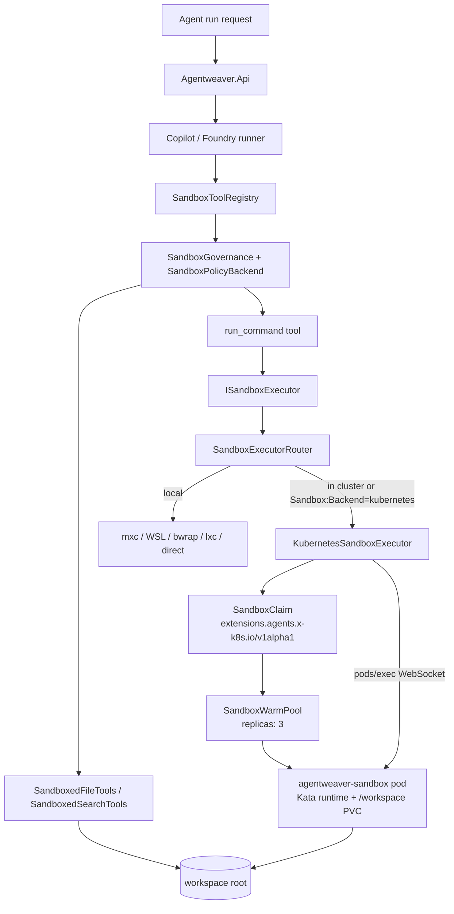

# Sandbox Subsystem — Deep Dive

## Purpose & Scope (why isolate agent execution)

Agentweaver runs model-selected file tools and shell commands against a project workspace. The sandbox subsystem limits the blast radius of those actions by combining:

- a deny-by-default governance gate for tool calls (`SandboxGovernance` loads a policy with `defaultAction: Deny` and also calls `SandboxPolicyBackend` directly) [packages/Agentweaver.AgentRuntime/SandboxGovernance.cs:18-29](../../packages/Agentweaver.AgentRuntime/SandboxGovernance.cs) [packages/Agentweaver.AgentRuntime/SandboxGovernance.cs:110-148](../../packages/Agentweaver.AgentRuntime/SandboxGovernance.cs);
- filesystem containment for read/write/search tools under the per-run working directory [packages/Agentweaver.SandboxFs/SandboxPathValidator.cs:17-49](../../packages/Agentweaver.SandboxFs/SandboxPathValidator.cs);
- an `ISandboxExecutor` abstraction for process isolation, selected per deployment [packages/Agentweaver.SandboxExec/ISandboxExecutor.cs:3-33](../../packages/Agentweaver.SandboxExec/ISandboxExecutor.cs);
- Kubernetes-native sandbox pods for production AKS deployments, backed by `SandboxClaim` resources and warm pods [apps/Agentweaver.Api/Sandbox/KubernetesSandboxExecutor.cs:27-39](../../apps/Agentweaver.Api/Sandbox/KubernetesSandboxExecutor.cs);
- Kubernetes `NetworkPolicy`/`CiliumNetworkPolicy` for sandbox egress control [k8s/networkpolicy-sandbox.yaml:17-50](../../k8s/networkpolicy-sandbox.yaml) [k8s/cilium-network-policy-sandbox.yaml:1-48](../../k8s/cilium-network-policy-sandbox.yaml).

The same API surface also supports local developer execution via Windows `mxc`, WSL2, Linux `bwrap`, Linux `lxc-exec`, or a final `direct` passthrough fallback [packages/Agentweaver.SandboxExec/SandboxExecutorFactory.cs:6-15](../../packages/Agentweaver.SandboxExec/SandboxExecutorFactory.cs).

## Architecture (mermaid: API -> sandbox claim -> warm pool pod -> exec/fs)

The API registers the runtime, then overrides the runtime's default `ISandboxExecutor` with `SandboxExecutorRouter`; it also registers the pod-name registry and port-forward service [apps/Agentweaver.Api/Program.cs:193-204](../../apps/Agentweaver.Api/Program.cs). `SandboxExecutorRouter` chooses Kubernetes when `Sandbox:Backend` is `kubernetes`, or when the API is in-cluster and the backend is not forced to `local`; if Kubernetes initialization fails, it throws instead of falling back to local execution [apps/Agentweaver.Api/Sandbox/SandboxExecutorRouter.cs:30-83](../../apps/Agentweaver.Api/Sandbox/SandboxExecutorRouter.cs).

## Sandbox Lifecycle (provision from warm pool, claim, run, teardown)

For the Kubernetes backend, one command execution follows this path:

1. **Choose a claim name.** If `SandboxCommand.AgentweaverRunId` is present, the executor derives `run-{id-prefix}` so the run can later map back to the pod; otherwise it uses a random ID [apps/Agentweaver.Api/Sandbox/KubernetesSandboxExecutor.cs:70-79](../../apps/Agentweaver.Api/Sandbox/KubernetesSandboxExecutor.cs).
2. **Clamp timeout below claim TTL.** Command timeout is capped at `Sandbox:Kubernetes:TimeoutSeconds - 30s` to avoid the controller deleting the claim mid-command [apps/Agentweaver.Api/Sandbox/KubernetesSandboxExecutor.cs:80-90](../../apps/Agentweaver.Api/Sandbox/KubernetesSandboxExecutor.cs).
3. **Validate the pod working directory.** The requested working directory must be the configured workspace mount or a child of it [apps/Agentweaver.Api/Sandbox/KubernetesSandboxExecutor.cs:351-364](../../apps/Agentweaver.Api/Sandbox/KubernetesSandboxExecutor.cs).
4. **Create a `SandboxClaim`.** The executor posts `apiVersion: extensions.agents.x-k8s.io/v1alpha1`, `kind: SandboxClaim`, `spec.templateRef`, and `spec.ttl` [apps/Agentweaver.Api/Sandbox/KubernetesSandboxExecutor.cs:165-184](../../apps/Agentweaver.Api/Sandbox/KubernetesSandboxExecutor.cs).
5. **Wait for binding.** It polls until `status.phase == "Bound"` and reads the pod name from `status.sandbox.name` or `status.podName` [apps/Agentweaver.Api/Sandbox/KubernetesSandboxExecutor.cs:186-227](../../apps/Agentweaver.Api/Sandbox/KubernetesSandboxExecutor.cs).
6. **Register the pod for previews.** When a run ID is present, the pod is stored in `IPodNameRegistry` so port-forward endpoints can find it [apps/Agentweaver.Api/Sandbox/KubernetesSandboxExecutor.cs:121-130](../../apps/Agentweaver.Api/Sandbox/KubernetesSandboxExecutor.cs) [apps/Agentweaver.Api/Sandbox/IPodNameRegistry.cs:3-20](../../apps/Agentweaver.Api/Sandbox/IPodNameRegistry.cs).
7. **Exec in the pod.** The command is executed through Kubernetes WebSocket pod exec against container `agentweaver-sandbox`, using `/bin/sh -c` and the resolved working directory [apps/Agentweaver.Api/Sandbox/KubernetesSandboxExecutor.cs:247-285](../../apps/Agentweaver.Api/Sandbox/KubernetesSandboxExecutor.cs) [apps/Agentweaver.Api/Sandbox/KubernetesSandboxExecutor.cs:381-395](../../apps/Agentweaver.Api/Sandbox/KubernetesSandboxExecutor.cs).
8. **Bounded output + redaction.** stdout, stderr, and status streams are read with 4 MiB caps; stdout/stderr are passed through `SandboxOutputRedactor` before returning [apps/Agentweaver.Api/Sandbox/KubernetesSandboxExecutor.cs:250-285](../../apps/Agentweaver.Api/Sandbox/KubernetesSandboxExecutor.cs).
9. **Teardown.** For ad-hoc commands without a run ID, the claim is deleted immediately. For run-scoped claims, the executor intentionally retains the claim for preview until run cleanup or TTL [apps/Agentweaver.Api/Sandbox/KubernetesSandboxExecutor.cs:139-147](../../apps/Agentweaver.Api/Sandbox/KubernetesSandboxExecutor.cs). Run cleanup unregisters the pod and stops any active port-forward sessions [apps/Agentweaver.Api/Runs/RunWatchLoopService.cs:469-496](../../apps/Agentweaver.Api/Runs/RunWatchLoopService.cs).

Preview/debugging uses separate endpoints that start, list, and stop `kubectl port-forward` sessions for the sandbox pod [apps/Agentweaver.Api/Endpoints/SandboxEndpoints.cs:11-64](../../apps/Agentweaver.Api/Endpoints/SandboxEndpoints.cs) [apps/Agentweaver.Api/Endpoints/SandboxEndpoints.cs:67-121](../../apps/Agentweaver.Api/Endpoints/SandboxEndpoints.cs). The service binds forwards to `127.0.0.1`, enforces per-run/global limits, and shells out to `kubectl port-forward` [apps/Agentweaver.Api/Sandbox/PortForwardService.cs:65-84](../../apps/Agentweaver.Api/Sandbox/PortForwardService.cs) [apps/Agentweaver.Api/Sandbox/PortForwardService.cs:99-120](../../apps/Agentweaver.Api/Sandbox/PortForwardService.cs) [apps/Agentweaver.Api/Sandbox/PortForwardService.cs:206-235](../../apps/Agentweaver.Api/Sandbox/PortForwardService.cs).

## SandboxExec & SandboxFs (interfaces, how commands/files are proxied)

### Command execution

`ISandboxExecutor` exposes metadata (`IsRealIsolation`, `BackendName`, network warnings) plus buffered and streaming execution [packages/Agentweaver.SandboxExec/ISandboxExecutor.cs:7-33](../../packages/Agentweaver.SandboxExec/ISandboxExecutor.cs). `SandboxCommand` carries the command line, working directory, filesystem policy, timeout, network flag, and optional Agentweaver run ID [packages/Agentweaver.SandboxExec/ISandboxExecutor.cs:35-49](../../packages/Agentweaver.SandboxExec/ISandboxExecutor.cs).

`run_command` is a custom tool that:

- performs HITL approval for destructive commands or when all shell commands require approval [packages/Agentweaver.AgentTools/Tools/RunCommandTool.cs:19-63](../../packages/Agentweaver.AgentTools/Tools/RunCommandTool.cs);
- validates working-directory containment, command length, and null bytes [packages/Agentweaver.AgentTools/Tools/RunCommandTool.cs:65-69](../../packages/Agentweaver.AgentTools/Tools/RunCommandTool.cs) [packages/Agentweaver.SandboxExec/ShellCommandValidator.cs:14-40](../../packages/Agentweaver.SandboxExec/ShellCommandValidator.cs);
- builds a filesystem policy and invokes the selected executor [packages/Agentweaver.AgentTools/Tools/RunCommandTool.cs:70-85](../../packages/Agentweaver.AgentTools/Tools/RunCommandTool.cs).

The local executor selection order is:

| Backend | Selection / security note |
| --- | --- |
| `processcontainer` | Windows `mxc` when `wxc-exec.exe` is found and the SDK probe reports support; output is capped and redacted [packages/Agentweaver.SandboxExec/MxcSandboxExecutor.cs:38-170](../../packages/Agentweaver.SandboxExec/MxcSandboxExecutor.cs) [packages/Agentweaver.SandboxExec/MxcSandboxExecutor.cs:180-265](../../packages/Agentweaver.SandboxExec/MxcSandboxExecutor.cs). |
| `wsl-bwrap` / `wsl-unshare` | WSL2 backend chosen by SDK support; `wsl-bwrap` uses targeted mounts and namespaces, while non-bwrap WSL has a network warning [packages/Agentweaver.SandboxExec/WslMxcSandboxExecutor.cs:23-51](../../packages/Agentweaver.SandboxExec/WslMxcSandboxExecutor.cs) [packages/Agentweaver.SandboxExec/WslMxcSandboxExecutor.cs:130-160](../../packages/Agentweaver.SandboxExec/WslMxcSandboxExecutor.cs). |
| `linux-bwrap` | Preferred Linux backend; binds the workdir to `/workspace`, mounts selected tool/runtime paths read-only, creates tmpfs for `/tmp`, `/home`, `/root`, and unshares PID/user/network unless network is enabled [packages/Agentweaver.SandboxExec/LinuxBwrapExecutor.cs:55-89](../../packages/Agentweaver.SandboxExec/LinuxBwrapExecutor.cs). |
| `lxc-native-linux` | Linux fallback when `lxc-exec` is found at known absolute paths or assembly-adjacent bundle [packages/Agentweaver.SandboxExec/LinuxNativeMxcSandboxExecutor.cs:33-67](../../packages/Agentweaver.SandboxExec/LinuxNativeMxcSandboxExecutor.cs) [packages/Agentweaver.SandboxExec/LinuxNativeMxcSandboxExecutor.cs:77-163](../../packages/Agentweaver.SandboxExec/LinuxNativeMxcSandboxExecutor.cs). |
| `direct` | Final passthrough fallback; runs host `cmd.exe /c` or `/bin/bash -c` with no process isolation [packages/Agentweaver.SandboxExec/PassthroughExecutor.cs:8-22](../../packages/Agentweaver.SandboxExec/PassthroughExecutor.cs) [packages/Agentweaver.SandboxExec/PassthroughExecutor.cs:30-97](../../packages/Agentweaver.SandboxExec/PassthroughExecutor.cs). |

### Filesystem and search tools

Runners create `SandboxedFileTools` and `SandboxedSearchTools` rooted at the working directory, then pass them into `SandboxToolContext` [packages/Agentweaver.AgentRuntime/GitHubCopilotAgentRunner.cs:217-245](../../packages/Agentweaver.AgentRuntime/GitHubCopilotAgentRunner.cs) [packages/Agentweaver.AgentTools/SandboxToolContext.cs:7-39](../../packages/Agentweaver.AgentTools/SandboxToolContext.cs). `SandboxToolRegistry` exposes file/search/edit tools, and only includes `run_command` when shell is enabled and the executor is real isolation or explicit `direct` mode [packages/Agentweaver.AgentTools/SandboxToolRegistry.cs:11-45](../../packages/Agentweaver.AgentTools/SandboxToolRegistry.cs).

Filesystem enforcement has two layers:

1. `SandboxPolicyBackend` recognizes known file/search/shell tools, denies unknown tool names, validates path-bearing arguments, and validates shell working directories [packages/Agentweaver.SandboxFs/SandboxPolicyBackend.cs:14-51](../../packages/Agentweaver.SandboxFs/SandboxPolicyBackend.cs) [packages/Agentweaver.SandboxFs/SandboxPolicyBackend.cs:60-145](../../packages/Agentweaver.SandboxFs/SandboxPolicyBackend.cs).
2. The tool implementations validate again. `SandboxPathValidator` rejects absolute paths, `..`, device paths, UNC paths, drive-relative paths, and symlink/junction ancestors; after opening a handle, it resolves the final path and re-checks containment [packages/Agentweaver.SandboxFs/SandboxPathValidator.cs:23-49](../../packages/Agentweaver.SandboxFs/SandboxPathValidator.cs) [packages/Agentweaver.SandboxFs/SandboxPathValidator.cs:104-163](../../packages/Agentweaver.SandboxFs/SandboxPathValidator.cs).

Reads, writes, creates, string replacements, line inserts, and patches all route through `SandboxedFileTools` and return structured failures instead of throwing into the agent loop [packages/Agentweaver.SandboxFs/SandboxedFileTools.cs:5-19](../../packages/Agentweaver.SandboxFs/SandboxedFileTools.cs) [packages/Agentweaver.SandboxFs/SandboxedFileTools.cs:37-83](../../packages/Agentweaver.SandboxFs/SandboxedFileTools.cs) [packages/Agentweaver.SandboxFs/SandboxedFileTools.cs:89-142](../../packages/Agentweaver.SandboxFs/SandboxedFileTools.cs) [packages/Agentweaver.SandboxFs/SandboxedFileTools.cs:439-492](../../packages/Agentweaver.SandboxFs/SandboxedFileTools.cs). Search never follows reparse points, skips `.git`, `node_modules`, `bin`, `obj`, and `.vs`, and caps results [packages/Agentweaver.SandboxFs/SandboxedSearchTools.cs:12-31](../../packages/Agentweaver.SandboxFs/SandboxedSearchTools.cs) [packages/Agentweaver.SandboxFs/SandboxedSearchTools.cs:73-111](../../packages/Agentweaver.SandboxFs/SandboxedSearchTools.cs) [packages/Agentweaver.SandboxFs/SandboxedSearchTools.cs:173-233](../../packages/Agentweaver.SandboxFs/SandboxedSearchTools.cs).

## Container Image & Shim (apps/agentweaver-sandbox, copilot-sandbox session, shim/server.js if present)

The production sandbox image lives in `apps/agentweaver-sandbox/Dockerfile`. It is `ubuntu:24.04`, installs common agent build/runtime tools (`git`, `build-essential`, Python 3, Node.js/npm), installs .NET 9 into `/usr/local/dotnet`, creates UID/GID 1000, sets `WORKDIR /workspace`, drops to `USER 1000`, and uses `sleep infinity` so commands arrive via pod exec [apps/agentweaver-sandbox/Dockerfile:1-36](../../apps/agentweaver-sandbox/Dockerfile). The AKS build script builds and pushes this image from that self-contained context [scripts/aks/20-build-push-images.sh:76-86](../../scripts/aks/20-build-push-images.sh).

The Kubernetes template hardens that image with `runtimeClassName: kata-vm-isolation`, `restartPolicy: Never`, `automountServiceAccountToken: false`, non-root pod security context, `allowPrivilegeEscalation: false`, `readOnlyRootFilesystem: true`, dropped Linux capabilities, and a writable `/tmp` `emptyDir` [k8s/sandbox-template.yaml:15-38](../../k8s/sandbox-template.yaml) [k8s/sandbox-template.yaml:46-56](../../k8s/sandbox-template.yaml).

Unverified: this repository does not contain a root-level `copilot-sandbox/` directory, `shim/server.js`, or `CopilotSessionService` source file. The only repo-local `CopilotSession` reference found in the API is for read-only history resume in `RunEndpoints`, not for the Kubernetes sandbox shim [apps/Agentweaver.Api/Endpoints/RunEndpoints.cs:637-652](../../apps/Agentweaver.Api/Endpoints/RunEndpoints.cs). I also did not find repo-local code that saves pasted image attachments to `/workspace/.copilot/uploads` or enforces an 8 MiB upload cap; the verified output cap in this subsystem is 4 MiB for command/tool output [apps/Agentweaver.Api/Sandbox/KubernetesSandboxExecutor.cs:250-285](../../apps/Agentweaver.Api/Sandbox/KubernetesSandboxExecutor.cs) [packages/Agentweaver.Domain/SandboxPolicy.cs:82-86](../../packages/Agentweaver.Domain/SandboxPolicy.cs).

## Kubernetes Resources (SandboxTemplate, WarmPool, claim template, RBAC)

| Resource | File | What it does |
| --- | --- | --- |
| `SandboxTemplate/agentweaver-sandbox` | `k8s/sandbox-template.yaml` | Defines the warm-pod blueprint in API group `extensions.agents.x-k8s.io/v1alpha1`; disallows env-var injection; labels pods `app: agentweaver-sandbox`; uses the sandbox image [k8s/sandbox-template.yaml:1-14](../../k8s/sandbox-template.yaml) [k8s/sandbox-template.yaml:26-29](../../k8s/sandbox-template.yaml). |
| Workspace + tmp volumes | `k8s/sandbox-template.yaml` | Mounts shared PVC `agentweaver-workspace` at `/workspace` and an `emptyDir` at `/tmp` [k8s/sandbox-template.yaml:46-56](../../k8s/sandbox-template.yaml). |
| `SandboxWarmPool/agentweaver-sandbox` | `k8s/sandbox-warmpool.yaml` | Keeps three warm sandboxes ready against the template [k8s/sandbox-warmpool.yaml:1-12](../../k8s/sandbox-warmpool.yaml). |
| `SandboxClaim` template | `k8s/sandbox-claim-template.yaml` | Shows the per-run claim shape: `run-{runId}`, `templateRef: agentweaver-sandbox`, `ttl: 600s` [k8s/sandbox-claim-template.yaml:1-10](../../k8s/sandbox-claim-template.yaml). |
| API ServiceAccount | `k8s/serviceaccount-api.yaml` | Names the `agentweaver-api` ServiceAccount and annotates it for Azure workload identity [k8s/serviceaccount-api.yaml:1-9](../../k8s/serviceaccount-api.yaml). |
| API Role/RoleBinding | `k8s/rbac-api.yaml` | Grants the API ServiceAccount `get/create/delete` on `sandboxclaims`, `get/create` on pods, and `create` on `pods/exec` [k8s/rbac-api.yaml:1-29](../../k8s/rbac-api.yaml) [k8s/rbac-api.yaml:31-46](../../k8s/rbac-api.yaml). |
| Namespace quota | `k8s/quota.yaml` | Caps namespace resources and allows at most 20 `sandboxclaims.extensions.agents.x-k8s.io` [k8s/quota.yaml:1-17](../../k8s/quota.yaml). |

Deployment applies the sandbox template and warm pool only if the `extensions.agents.x-k8s.io` CRD is present [scripts/aks/30-deploy.sh:123-128](../../scripts/aks/30-deploy.sh). Verification checks the `kata-vm-isolation` runtime class plus the template and warm pool resources [scripts/aks/40-verify.sh:104-108](../../scripts/aks/40-verify.sh). The API deployment explicitly sets `Sandbox__Backend=kubernetes`, the namespace, template ref, and `/workspace` mount root [k8s/api-deployment.yaml:105-114](../../k8s/api-deployment.yaml).

## Network Isolation & Egress Allowlist (Cilium FQDN, network policies)

Sandbox pods are selected by `app: agentweaver-sandbox` [k8s/sandbox-template.yaml:11-14](../../k8s/sandbox-template.yaml). The standard Kubernetes policies:

- create an ingress policy with no ingress rules, which denies inbound traffic to sandbox pods [k8s/networkpolicy-sandbox.yaml:1-16](../../k8s/networkpolicy-sandbox.yaml);
- create an egress policy that allows DNS to kube-dns and HTTPS to GitHub's `140.82.112.0/20` public range; no service/pod CIDR is included [k8s/networkpolicy-sandbox.yaml:17-50](../../k8s/networkpolicy-sandbox.yaml).

The Cilium policy adds FQDN-based egress for:

- DNS through kube-dns [k8s/cilium-network-policy-sandbox.yaml:12-25](../../k8s/cilium-network-policy-sandbox.yaml);
- `api.github.com` over TCP 443 [k8s/cilium-network-policy-sandbox.yaml:26-31](../../k8s/cilium-network-policy-sandbox.yaml);
- `registry.npmjs.org` and `*.npmjs.org` over TCP 443 [k8s/cilium-network-policy-sandbox.yaml:32-38](../../k8s/cilium-network-policy-sandbox.yaml);
- Azure AI/OpenAI/Cognitive Services/Models domains over TCP 443 [k8s/cilium-network-policy-sandbox.yaml:39-48](../../k8s/cilium-network-policy-sandbox.yaml).

The router reads `Sandbox:Kubernetes:ServiceCidr`/`ClusterServiceCidr` and `SandboxEgressCidrExclusions`; if the service CIDR is not excluded, it logs a warning because sandbox egress could otherwise reach in-cluster services [apps/Agentweaver.Api/Sandbox/SandboxExecutorRouter.cs:57-75](../../apps/Agentweaver.Api/Sandbox/SandboxExecutorRouter.cs) [apps/Agentweaver.Api/Sandbox/SandboxExecutorRouter.cs:86-106](../../apps/Agentweaver.Api/Sandbox/SandboxExecutorRouter.cs).

Local network behavior differs by backend. Windows `processcontainer` reports a network warning because allowlist enforcement is unavailable [packages/Agentweaver.SandboxExec/MxcSandboxExecutor.cs:18-24](../../packages/Agentweaver.SandboxExec/MxcSandboxExecutor.cs). WSL warns unless the selected backend is `WslBubblewrap` [packages/Agentweaver.SandboxExec/WslMxcSandboxExecutor.cs:47-51](../../packages/Agentweaver.SandboxExec/WslMxcSandboxExecutor.cs). Runners emit `sandbox.warning` when an executor reports a network warning, or when project policy explicitly enables outbound network [packages/Agentweaver.AgentRuntime/GitHubCopilotAgentRunner.cs:229-243](../../packages/Agentweaver.AgentRuntime/GitHubCopilotAgentRunner.cs) [packages/Agentweaver.AgentRuntime/FoundryAgentRunner.cs:105-119](../../packages/Agentweaver.AgentRuntime/FoundryAgentRunner.cs).

## Security Properties & Gotchas (uploads cap, isolation boundaries)

- **Fail-closed routing in cluster.** In-cluster Kubernetes executor initialization errors throw instead of silently using a weaker local backend [apps/Agentweaver.Api/Sandbox/SandboxExecutorRouter.cs:53-83](../../apps/Agentweaver.Api/Sandbox/SandboxExecutorRouter.cs).
- **Kata + pod hardening.** Production sandboxes run with Kata VM runtime, no service-account token, non-root UID/GID, seccomp runtime default, read-only root filesystem, no privilege escalation, and all capabilities dropped [k8s/sandbox-template.yaml:15-38](../../k8s/sandbox-template.yaml).
- **Shared workspace PVC.** The sandbox process is isolated, but `/workspace` is a shared PVC named `agentweaver-workspace`; this is an execution boundary, not a secrecy boundary between all workloads that can mount that PVC [k8s/sandbox-template.yaml:46-56](../../k8s/sandbox-template.yaml).
- **Run-scoped Kubernetes claims are retained.** Because run-scoped claims are kept for preview until cleanup or TTL, operators should size `SandboxClaim` quota and warm-pool capacity accordingly [apps/Agentweaver.Api/Sandbox/KubernetesSandboxExecutor.cs:139-147](../../apps/Agentweaver.Api/Sandbox/KubernetesSandboxExecutor.cs) [k8s/quota.yaml:1-17](../../k8s/quota.yaml).
- **`direct` is not isolation.** The passthrough executor runs commands on the host shell and sets `IsRealIsolation` to `false`; use it only when the deployment environment itself is the sandbox [packages/Agentweaver.SandboxExec/PassthroughExecutor.cs:8-22](../../packages/Agentweaver.SandboxExec/PassthroughExecutor.cs).
- **Filesystem controls are defense-in-depth.** Governance denies unknown tools, then `SandboxedFileTools` validates paths and verifies opened handles; directory listing intentionally has a narrow filename-only TOCTOU residual risk documented in code [packages/Agentweaver.SandboxFs/SandboxPolicyBackend.cs:68-80](../../packages/Agentweaver.SandboxFs/SandboxPolicyBackend.cs) [packages/Agentweaver.SandboxFs/SandboxedFileTools.cs:820-835](../../packages/Agentweaver.SandboxFs/SandboxedFileTools.cs).
- **Output is redacted and capped.** Command output is passed through secret/PII redaction patterns [packages/Agentweaver.SandboxExec/SandboxOutputRedactor.cs:5-41](../../packages/Agentweaver.SandboxExec/SandboxOutputRedactor.cs) [packages/Agentweaver.SandboxExec/SandboxOutputRedactor.cs:87-111](../../packages/Agentweaver.SandboxExec/SandboxOutputRedactor.cs). Default project policy caps output at 4 MiB [packages/Agentweaver.Domain/SandboxPolicy.cs:82-86](../../packages/Agentweaver.Domain/SandboxPolicy.cs).
- **Unverified upload behavior.** The requested `/workspace/.copilot/uploads` and 8 MiB pasted-image cap are not verified in this repository snapshot. Treat any such behavior as external or pending until a repo-owned shim/session service is added.
