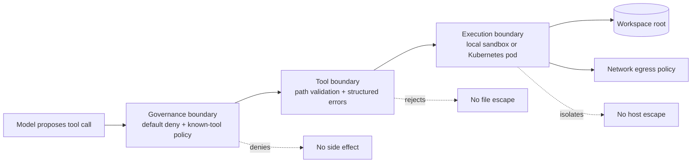
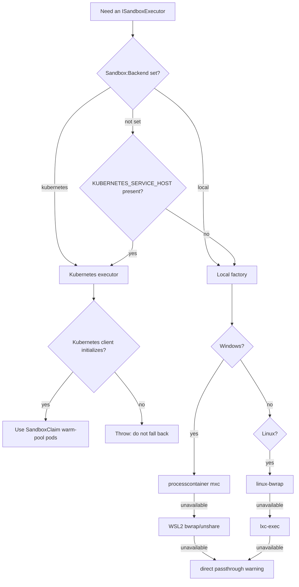
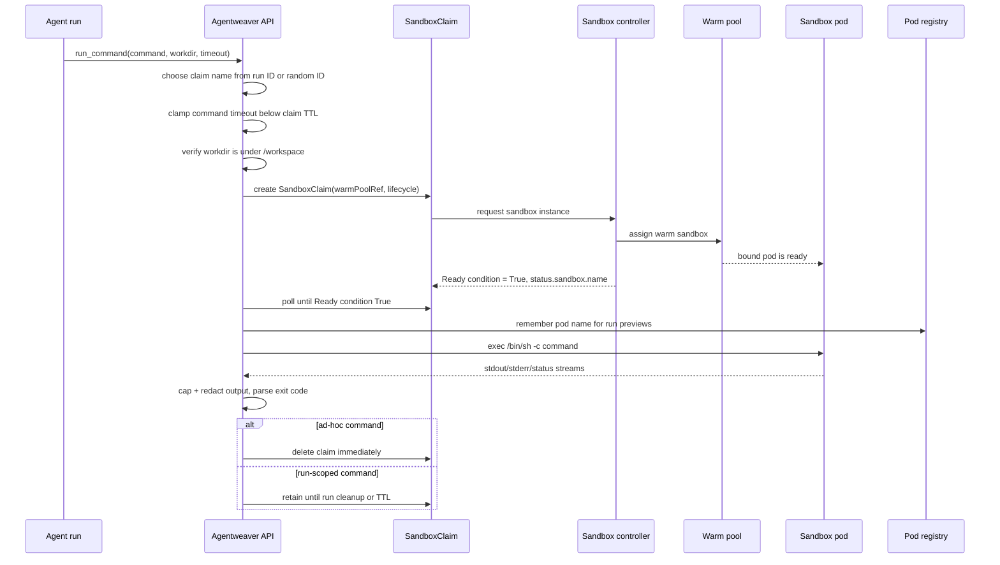

# Sandbox Subsystem — Conceptual Deep Dive

## What the sandbox is protecting against

Agentweaver lets an AI agent inspect files, edit a workspace, search source, and optionally run shell commands. Those capabilities are useful only if the agent can act like an engineer, but they also create an escape problem: a model can be mistaken, prompt-injected, or asked to run commands whose side effects are broader than the current project.

The sandbox is therefore built around one rule: **agent actions must be useful inside the assigned workspace and boring everywhere else**. A well-behaved agent should barely notice the sandbox. A malicious or confused agent should be unable to:

- read or write files outside the run workspace;
- escape through `..`, absolute paths, Windows drive tricks, UNC/device paths, symlinks, or junctions;
- run host-level shell commands when no real process isolation exists;
- reach arbitrary internal services from a production sandbox pod;
- leave long-lived compute, network listeners, or preview tunnels after the run ends;
- exfiltrate obvious secrets through large command output.

This is not one mechanism. It is a layered isolation model:

1. **Governance decides whether a tool call is allowed.** Unknown tools and suspicious paths fail closed before tool code runs.
2. **Filesystem tools validate again at the point of use.** The implementation assumes governance can be bypassed or fed malformed arguments.
3. **Shell commands run through an executor abstraction.** The runtime can choose a local isolation backend for development or a Kubernetes-backed sandbox for production.
4. **Production sandboxes are isolated pods.** They use hardened pod settings, a shared workspace mount, bounded lifetime claims, and network policy egress controls.
5. **Output is bounded and redacted.** The sandbox assumes command output itself can become an exfiltration channel.

The result is defense in depth rather than a single perfect wall.

Where this lives: `packages/Agentweaver.AgentRuntime`, `packages/Agentweaver.AgentTools`, `packages/Agentweaver.SandboxFs`, `packages/Agentweaver.SandboxExec`, `apps/Agentweaver.Api/Sandbox`, `k8s`

## The core mental model

Think of every agent action as passing through three concentric boundaries:

Each boundary has a different job:

- **Governance boundary:** answers “is this kind of action allowed for this run?” It is intentionally deny-by-default. A tool name must be recognized, and path-bearing arguments must resolve inside the sandbox root.
- **Tool boundary:** answers “is this exact file operation safe right now?” It re-validates paths, rejects reparse-point escapes, and returns controlled failures to the agent loop.
- **Execution boundary:** answers “where does this process actually run?” It hides the host behind a container, namespace, VM, or — only in explicit non-production cases — direct passthrough.
- **Network boundary:** answers “what can this isolated process talk to?” In production, this is handled by Kubernetes/Cilium policy, not by trusting shell command text.

The important design choice is that boundaries are **redundant**. Governance is not trusted as the only check, path validation is not trusted as process isolation, and process isolation is not trusted as network isolation.

## Why command execution needs stronger isolation than file tools

File tools are narrow: read this path, write this file, search this tree. Shell commands are broad: a single command can spawn processes, run interpreters, traverse the filesystem, open sockets, install packages, fork children, or encode data into output.

For that reason, `run_command` is treated as a privileged capability:

1. The shell tool is only registered when shell execution is enabled and the selected executor is acceptable for the current mode.
2. Destructive command patterns, or policies that require approval for all shell commands, trigger a human-in-the-loop approval gate before execution.
3. The command validator rejects malformed shell requests such as missing/invalid working directories, null bytes, or excessive command length.
4. The command is packaged with the run workspace, timeout, filesystem policy, network flag, and optional run ID.
5. The selected executor runs it and returns only bounded, redacted stdout/stderr plus an exit code.

This design does not try to parse every shell command into safe and unsafe subcommands. That would be brittle. Instead, the system validates the shell envelope, requires approval for dangerous patterns, and relies on the executor boundary to contain whatever the shell actually does.

Where this lives: `packages/Agentweaver.AgentTools/Tools/RunCommandTool.cs`, `packages/Agentweaver.SandboxExec`

## Filesystem containment: make the workspace the only universe

The filesystem sandbox exists because path strings are adversarial input. An agent may ask for `../../secrets`, an absolute host path, a Windows device path, a UNC share, or a benign-looking path whose parent is a symlink to somewhere else. The containment rule is simple: **all file effects must resolve to the sandbox root or one of its children**.

A rebuild should implement containment in two phases.

### Phase 1: lexical rejection before touching the filesystem

Before opening anything, reject inputs that are obviously outside the contract:

- empty paths;
- absolute paths when the tool expects a relative workspace path;
- `..` path segments;
- Windows device paths such as `\\?\` or `\\.\`;
- UNC paths such as `\\server\share`;
- drive-relative paths such as `C:foo`;
- normalized paths whose prefix is not the normalized sandbox root.

This catches cheap escape attempts without giving the filesystem a chance to resolve links or special names.

### Phase 2: real-path verification at the point of use

Lexical checks are necessary but insufficient. A path can look safe and still escape through a symlink or junction. Agentweaver therefore treats symlink/junction ancestors as untrusted and verifies the final opened handle where possible.

The invariant is:

> The path must be inside the workspace both before opening and after the OS resolves the object that was opened.

That second check matters because it narrows time-of-check/time-of-use races. If an attacker swaps a path between validation and open, the final handle resolution can still detect that the opened object is outside the sandbox.

### Why tools return structured failures

Sandbox violations are not treated as fatal runtime crashes. File tools return clear, structured failures to the agent. This keeps the run alive while making the boundary visible: the agent can choose a safe path and continue, but it cannot pressure the runtime into ignoring the violation.

### Search is constrained enumeration

Search tools do not accept arbitrary host roots. They enumerate the sandbox root, avoid reparse points, skip high-noise/generated directories such as `.git`, `node_modules`, `bin`, `obj`, and `.vs`, and cap results. This is partly security and partly agent ergonomics: bounded search prevents accidental huge responses and reduces the chance of leaking irrelevant data.

Where this lives: `packages/Agentweaver.SandboxFs`

## Governance: fail closed before side effects

The governance layer is the first policy checkpoint for model-selected tools. Its conceptual contract is:

- default action is deny;
- unknown tool names are denied;
- known file tools must provide a recognized path argument;
- search tools are allowed only because they are implemented as sandbox-root enumeration;
- shell tools must provide a working directory inside the sandbox root;
- internal governance exceptions deny the call rather than allowing it.

Agentweaver also performs a direct sandbox-backend evaluation in addition to the governance kernel evaluation. That redundancy is deliberate: even if one policy integration changes behavior, the dedicated containment backend still has to approve the call.

For shell specifically, governance adds a capability check: if the selected executor does not represent acceptable isolation for shell mode, shell execution is denied. The model should not be able to obtain a host shell merely because a tool name exists.

Where this lives: `packages/Agentweaver.AgentRuntime/SandboxGovernance.cs`, `packages/Agentweaver.SandboxFs/SandboxPolicyBackend.cs`

## Executor abstraction: one command contract, many isolation backends

The executor abstraction separates “what the agent wants to run” from “where and how it runs.” The runtime passes a command object containing:

- command line;
- working directory;
- environment variables;
- filesystem policy;
- timeout;
- network-enabled flag;
- optional Agentweaver run ID.

Every executor returns the same shape: exit code, stdout, stderr, timeout flag, and output-truncated flag. This uniform contract lets the agent runtime stay stable while deployments choose different isolation implementations.

### Backend selection logic

Executor selection is environment-aware:

The key production invariant is **fail closed in cluster**. If the API is running inside Kubernetes and the Kubernetes executor cannot initialize, Agentweaver throws instead of silently using a weaker local executor. A fallback that is acceptable on a developer laptop would be a security downgrade in production.

### Local backends and their trade-offs

Local execution exists for development, tests, and non-cluster deployments. It is intentionally best-effort and transparent about gaps:

| Backend family | Conceptual role | Trade-off |
| --- | --- | --- |
| Windows process container (`mxc`) | Use OS/container support to isolate a process from the host. | Network allowlisting is not equivalent to Kubernetes policy, so warnings are surfaced. |
| WSL2 with bubblewrap/unshare | Run Linux-style namespace isolation from Windows. | Strength depends on the available WSL backend; some variants warn about unrestricted network behavior. |
| Native Linux bubblewrap | Bind the workspace as `/workspace`, mount only selected runtime paths read-only, create tmpfs homes/temp, and unshare PID/user/network namespaces unless network is enabled. | Useful local isolation, but still not the same operational boundary as a production Kata pod plus cluster policy. |
| Native Linux `lxc-exec` | Fallback Linux isolation when bubblewrap is unavailable. | Depends on host LXC availability and configuration. |
| Direct passthrough | Last-resort host shell. | **Not isolation.** Use only when the surrounding environment is already disposable or explicitly trusted. |

Where this lives: `packages/Agentweaver.SandboxExec`, `apps/Agentweaver.Api/Sandbox/SandboxExecutorRouter.cs`

## Kubernetes sandbox lifecycle: claims over pods

Production command execution is built around Kubernetes sandbox claims rather than directly creating ad-hoc pods for every command. The reason is latency and lifecycle control:

- A **SandboxTemplate** defines the pod shape and hardening policy.
- A **SandboxWarmPool** keeps ready sandboxes available from that template.
- A **SandboxClaim** asks the sandbox controller for one sandbox instance for a bounded TTL.
- The executor waits until the claim is bound to a concrete pod, then uses Kubernetes pod exec to run the command.

### The agent-sandbox controller (and where MXC fits)

The "Sandbox controller" above is the upstream [`kubernetes-sigs/agent-sandbox`](https://github.com/kubernetes-sigs/agent-sandbox) controller — **not** MXC. The two are different runtimes for different tiers, and the names are easy to conflate:

- **MXC** (`Sabbour.Mxc.Sdk` / `wxc-exec.exe`) is the **local-host** command isolation runtime behind the Windows `processcontainer`, WSL, and Linux `lxc-exec` executors. It runs on a developer or non-cluster host and has no Kubernetes presence.
- The **agent-sandbox controller** is the **in-cluster** runtime that turns a `SandboxClaim` into a bound, Kata-isolated pod. `KubernetesSandboxExecutor` talks only to this controller's CRDs; no MXC binary exists in the cluster.

Agentweaver installs the controller and its three CRDs (API group `extensions.agents.x-k8s.io`) in `scripts/aks/10-create-cluster.sh` (install default `SANDBOX_CONTROLLER_VERSION=v0.4.6` at `10-create-cluster.sh:24` — production clusters run **agent-sandbox v0.5.0**). The installed controller serves both `v1beta1` (the **storage** version) and the deprecated-but-served `v1alpha1`; `KubernetesSandboxExecutor` targets **`v1beta1`** ([`SandboxClaimConventions.cs:23`](#source)):

- **`SandboxTemplate`** (`k8s/sandbox-template.yaml`, `agentweaver-sandbox`) defines the pod shape and hardening: `kata-vm-isolation` runtime class, non-root UID/GID 1000, dropped capabilities, read-only root filesystem, the `/workspace` PVC, and the A2A listener port `8088`.
- **`SandboxWarmPool`** keeps pre-built warm pods from a template so claims bind without a cold pod start. Two pools ship: the generic `agentweaver-sandbox` (`k8s/sandbox-warmpool.yaml`, `replicas: 3`) and the pod-per-run `agentweaver-agent-host` (`k8s/sandbox-warmpool-agenthost.yaml`, `replicas: 0`) backed by the AgentHost template. The agent-host pool runs `replicas: 0` because every agent-host claim injects per-run `spec.env` (e.g. `AgentHost__RunId`), which forces a cold start — a warm spare with no RunId would only CrashLoop — so the pool exists purely as the template reference and each claim cold-starts its own pod.
- **`SandboxClaim`** (created per run by `KubernetesSandboxExecutor`; shape in `k8s/sandbox-claim-template.yaml`) carries `spec.warmPoolRef.name` (the pool the claim binds to — `agentweaver-sandbox` for generic claims, `agentweaver-agent-host` for AgentHost claims), `spec.lifecycle.{ttlSecondsAfterFinished, shutdownPolicy: Delete}`, and `spec.env[]`. The controller adopts a warm pod, then signals readiness with a `Ready` **condition** (`status.conditions[type=Ready].status == "True"`) and writes the bound pod name into `status.sandbox.name`. There is **no** `status.phase` field.

The executor's provisioning loop is the concrete contract with the controller:

1. `CreateClaimAsync` / `CreateAgentHostClaimAsync` POSTs the v1beta1 `SandboxClaim` custom object into the namespace ([`KubernetesSandboxExecutor.cs:354`, `:294`](#source)).
2. `WaitForBoundAsync` polls the claim every 2 s until its `Ready` condition is `True`, then returns `status.sandbox.name` ([`SandboxClaimConventions.cs:53`](#source)).
3. For pod-per-run AgentHost pods, `GetPodIpAsync` then polls the pod's `status.podIP` so the worker can build the A2A endpoint `http[s]://<podIP>:<port><a2aPath>`.
4. On claim deletion (ad-hoc command) or TTL expiry, the controller garbage-collects the pod and its service — Agentweaver never deletes pods directly.

### Why claims have TTLs

A shell command can hang, or a client can disconnect. The claim TTL gives the controller an independent cleanup clock. Agentweaver also clamps the command timeout below the claim TTL so the controller should not delete the sandbox while the executor is still expecting a result.

### Why run IDs map to pod names

Run-scoped commands may need preview/debug support. When a command belongs to an Agentweaver run, the executor derives a stable claim name from the run ID and records the bound pod name. Preview endpoints can then locate the sandbox pod and establish `kubectl port-forward` sessions. Those sessions are bound to loopback, limited per run and globally, and cleaned up when the run lifecycle ends. This is the foundation of the [sandbox browser preview](./sandbox-browser-preview.md) — see its [User Guide](../experience/sandbox-browser-preview.md) and [Reference](../reference/sandbox-browser-preview.md).

### Why ad-hoc and run-scoped cleanup differ

Ad-hoc commands have no reason to keep a sandbox alive after the command returns, so the claim is deleted immediately. Run-scoped commands may keep the claim until cleanup or TTL so preview remains available. That improves developer experience but consumes warm-pool/quota capacity for longer, so operators must size quotas and warm pools accordingly.

Where this lives: `apps/Agentweaver.Api/Sandbox/KubernetesSandboxExecutor.cs`, `apps/Agentweaver.Api/Sandbox/SandboxClaimConventions.cs`, `apps/Agentweaver.Api/Sandbox/PortForwardService.cs`, `apps/Agentweaver.Api/Endpoints/SandboxEndpoints.cs`, `apps/Agentweaver.Api/Runs/RunWatchLoopService.cs`, `k8s/sandbox-template.yaml`, `k8s/sandbox-warmpool.yaml`, `k8s/sandbox-warmpool-agenthost.yaml`, `k8s/sandbox-claim-template.yaml`

## Production pod isolation and hardening

The sandbox pod is intentionally boring. It contains common build/runtime tools so agents can run normal project commands, but it is not privileged and should not receive cluster credentials.

The production template applies several important constraints:

- **Kata runtime:** the pod uses `kata-vm-isolation`, adding a VM boundary around the container workload.
- **No service account token:** the sandbox does not automatically receive Kubernetes API credentials.
- **Non-root identity:** the container runs as UID/GID 1000.
- **No privilege escalation and no Linux capabilities:** the process should not be able to acquire broader kernel privileges.
- **Read-only root filesystem:** tools cannot persist changes into the image filesystem.
- **Writable workspace and temp only:** the shared workspace PVC is mounted at `/workspace`; `/tmp` is an `emptyDir`.
- **Never restart:** failed or completed sandbox pods are not automatically restarted as hidden long-lived state.

The image installs practical tooling — Git, C/C++ build essentials, Python, Node/npm, and .NET — because an agent that cannot build or test is not useful. The security posture comes from pod/runtime policy and network policy, not from making the image empty.

Important boundary: the shared workspace PVC is an execution workspace, not a secrecy boundary between every workload that can mount it. The sandbox limits process and network blast radius; it does not make shared storage private from other principals with access to the same volume.

Where this lives: `apps/agentweaver-sandbox/Dockerfile`, `k8s/sandbox-template.yaml`

## Network isolation and egress allowlisting

Network access is an exfiltration and lateral-movement channel. A sandboxed command that can reach arbitrary addresses can probe cluster services, call metadata endpoints, or send data to the internet. Production network policy therefore follows an allowlist model.

The standard Kubernetes policies select pods labeled `app: agentweaver-sandbox` and enforce:

- **no inbound traffic** to sandbox pods;
- **DNS only to kube-dns**;
- **HTTPS only to the configured GitHub public IP range**;
- no broad service or pod CIDR allowlist.

The Cilium policy adds FQDN-based egress for common agent dependencies:

- `api.github.com`;
- `registry.npmjs.org` and `*.npmjs.org`;
- Azure AI/OpenAI/Cognitive Services/Models domains;
- DNS through kube-dns.

The service-CIDR warning is important. If sandbox egress accidentally includes the cluster service CIDR, a sandbox pod may be able to reach internal Kubernetes services even if internet egress looks restricted. Agentweaver checks configured service CIDR exclusions and logs a warning when the cluster service CIDR is not excluded.

Local backends cannot all enforce the same network model. Where network allowlisting is unavailable or weaker, executors report warnings, and runners emit sandbox warning events. Treat those warnings as a deployment property, not as an agent-visible suggestion.

Where this lives: `k8s/networkpolicy-sandbox.yaml`, `k8s/cilium-network-policy-sandbox.yaml`, `apps/Agentweaver.Api/Sandbox/SandboxExecutorRouter.cs`, `packages/Agentweaver.SandboxExec`

## Rebuild blueprint

If rebuilding this subsystem from scratch, implement it in this order:

1. **Define the workspace invariant.** Pick one sandbox root per run. Every file tool, search tool, and shell working directory must resolve inside it.
2. **Create a path validator.** Reject obvious path escapes lexically, reject symlink/junction ancestors, and verify opened handles against the sandbox root.
3. **Wrap all file/search tools.** Do not expose raw host file APIs to the model. Return structured errors for violations.
4. **Add deny-by-default governance.** Allow only known tools and known argument shapes. Fail closed on unknown tools and internal policy errors.
5. **Define a command executor interface.** Keep command input/output stable so the runtime is independent of the isolation backend.
6. **Gate shell execution.** Require shell enablement, working-directory containment, destructive-command approval, timeout bounds, output caps, and redaction.
7. **Provide local executors.** Prefer real local isolation where available; mark direct passthrough as non-production and warn loudly.
8. **Provide a production Kubernetes executor.** Use claims, templates, warm pools, TTLs, pod exec, and fail-closed backend selection.
9. **Harden the pod.** Use non-root, no token, no privilege escalation, dropped capabilities, read-only root, explicit writable mounts, and a stronger runtime class where available.
10. **Add network policy.** Deny inbound traffic and allow only required egress. Exclude service/pod CIDRs unless there is a deliberate, reviewed reason.
11. **Plan cleanup.** Delete ad-hoc claims, retain run-scoped claims only while previews need them, and enforce TTL/quota as independent backstops.
12. **Surface warnings.** If a backend cannot enforce a promised boundary, emit an explicit warning rather than silently weakening isolation.

## Security invariants and gotchas

- **Default deny is an invariant.** A new tool should do nothing until governance and tool-level validation know how to constrain it.
- **Path containment is checked more than once.** This is intentional defense in depth, not duplication to remove.
- **Shell parsing is not the security boundary.** The executor and OS/container boundary must contain arbitrary shell behavior.
- **Kubernetes fallback must fail closed.** In production, silently downgrading to local or direct execution is worse than failing the run.
- **Direct passthrough is not a sandbox.** It is useful only when the host environment is already disposable/trusted.
- **Run-scoped sandboxes consume capacity while retained.** Preview support trades resource usage for debuggability.
- **Shared `/workspace` is shared storage.** Do not treat the PVC as a per-tenant secrecy boundary unless the surrounding storage model enforces that.
- **Output can leak data.** Keep caps and redaction even when process isolation is strong.
- **Directory listing has a narrow residual race.** The code documents a filename-only TOCTOU residual risk for listing; file reads/writes use stronger open-and-verify handling.
- **Output caps apply to command and tool results.** The command/tool output cap in this subsystem is 4 MiB; keep that limit in place so a single large result cannot exhaust memory or flood the event stream. Image or attachment upload paths belong to other components and are out of scope for this repo-owned sandbox subsystem.

## See also

- [Sandbox browser preview](./sandbox-browser-preview.md) - exposing a server running inside a run's sandbox pod to the user over a public HTTPS reverse proxy (per-preview HTTPRoute -> per-run ClusterIP Service -> pod).
