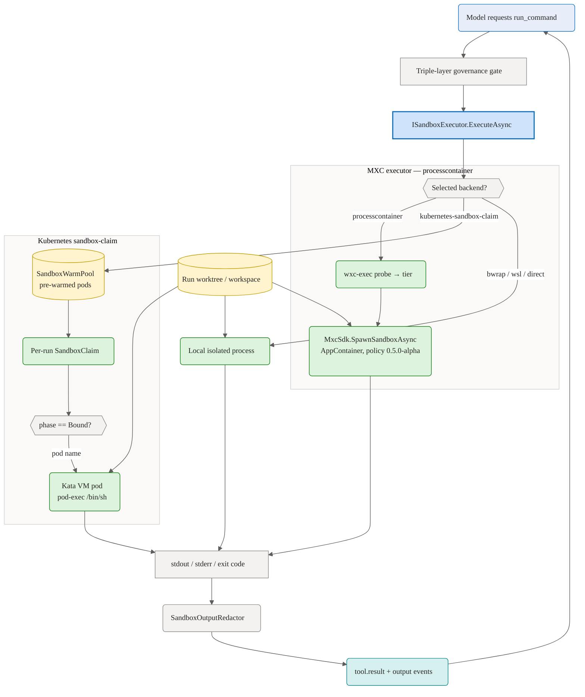

# Sandboxed execution

This document describes the design of mxc-based sandboxed command execution in Agentweaver — how the sandbox engine plugs into the existing governance and runner layers, how executor selection works, and the security model behind it.

## Overview

Agentweaver originally permitted no shell execution. The governance policy categorically denied any `shell` tool call, and agents were restricted to path-contained in-process file operations.

This feature adds sandboxed shell execution by adopting Microsoft's `mxc` sandboxing engine. The key constraint is that `mxc` is an early preview and its own documentation says its profiles are not yet hardened security boundaries. It is therefore adopted as a **defense-in-depth layer only** — it augments the existing in-process path containment and deny-by-default governance, and never replaces them.

The general principle: the system confirms real isolation is available before permitting any shell command. When confirmation fails, shell remains denied — unless the operator explicitly opts into unsandboxed `direct` execution (`direct: true` in `.agentweaver/settings.yml`), which relies on deployment-level isolation instead. No command runs unsandboxed by default.

Once a backend is selected (see the [sandbox deep dive](./sandbox.md)), a `run_command` invocation flows through the triple-layer governance gate, into the chosen executor, and back out as redacted output events:



## Executor selection

Executor selection happens at startup via `SandboxExecutorFactory.Create`. The factory probes the host in order and returns the first available executor:

| Order | Backend name | Platform condition |
| --- | --- | --- |
| 1 | `processcontainer` | Windows + `wxc-exec.exe` found + `MxcSdk.GetPlatformSupport().IsSupported` |
| 2 | `wsl-bwrap` / `wsl-unshare` | Windows + WSL2 available (`wsl-bwrap` when bubblewrap is present in the distro, otherwise `wsl-unshare`) |
| 3 | `linux-bwrap` | Linux + bubblewrap (`bwrap`) available — preferred Linux backend (selective mount allowlist) |
| 4 | `lxc-native-linux` | Linux + `lxc-exec` found at `/usr/local/bin/lxc-exec` or `/usr/bin/lxc-exec` (only when bwrap is unavailable) |
| 5 | `direct` | Fallback when no isolation backend is available, **or** selected explicitly via `direct: true` in `.agentweaver/settings.yml` |

When the API runs **inside a Kubernetes cluster** (`KUBERNETES_SERVICE_HOST` is set), the `SandboxExecutorRouter` overrides the factory result with the `kubernetes-sandbox-claim` backend (`KubernetesSandboxExecutor`), which runs commands in a per-run Kata VM pod claimed from a warm pool. See [aks-deployment.md](../aks-deployment.md#sandbox-setup).

The selected executor is injected into the per-run governance context and both agent runners. Its key properties are:

- **`IsRealIsolation`** — `true` for `processcontainer`, `wsl-bwrap`, `linux-bwrap`, `lxc-native-linux`, and `kubernetes-sandbox-claim`; `false` for `wsl-unshare` and the `direct` fallback. Shell execution requires this to be `true`, **except** for the `direct` backend, which is an explicit opt-out (see [Layer C](#layer-c-executor-gate)).
- **`HasNetworkWarning`** — `true` for the Windows `processcontainer` and `wsl-unshare` tiers, whose backends cannot enforce a network allowlist. When set, the runner emits a `sandbox.warning` event (see [Limitations](#limitations)).

The executor selection decision, backend name, and probe reason are emitted as a `sandbox.selected` event when a run starts.

## Tool architecture

Both agent runners (GitHub Copilot and Microsoft Foundry) register the same set of custom `AIFunction` tools assembled by `SandboxToolRegistry.Build`. There are nine tool names total:

| Tool | Purpose | Conditional |
| --- | --- | --- |
| `run_command` | Run a shell command in the sandbox | Yes — only when `IsRealIsolation && ShellEnabled` |
| `read_file` | Read a file inside the sandbox root | No |
| `grep_search` | Search file contents with a regex | No |
| `file_search` | Find files by name pattern | No |
| `str_replace_editor` | Make targeted line or text replacements | No |
| `apply_patch` | Apply a unified-diff patch | No |
| `create` | Create a new file | No |
| `edit` | Overwrite or insert in an existing file | No |
| `report_intent` | Emit an `agent.intent` event for UI display | No |

### AvailableTools allowlist

The Copilot SDK's `SessionConfig` accepts an `AvailableTools` list. This is the primary server-side enforcement of which tools the model may invoke. `NativeToolExclusion.AvailableToolNames(includeShell)` returns the 9 names (or 8 without `run_command`) to populate this list.

When `includeShell` is false, `run_command` is absent from the allowlist and the model cannot request it.

### ExcludedTools blocklist

`ExcludedTools` blocks native Copilot bundle tools from executing. It is defense-in-depth: `AvailableTools` is the primary gate.

The blocklist includes:
- `shell`, `bash` — native shell tools, always denied regardless of isolation state
- Native equivalents of the custom tools (`view`, `glob`, `ls`, `grep`, `read`, `write`) — blocked because they bypass sandbox containment and use absolute paths the model controls
- `store_memory`, `vote_memory`, `update_todo`, `task`, `notebook` — scoped out
- `semantic_search` — no local embeddings API available
- Network tools (`webfetch`, `web_fetch`, `websearch`, `web_search`) — always denied

### Why native shell is always denied

The YAML policy loaded into the governance kernel has an explicit `deny-native-shell` rule that matches `tool_name == 'shell'` with action `Deny`. This fires before the executor gate and before any path check, unconditionally. Shell execution must go through the `run_command` custom tool, which routes through `ISandboxExecutor` under the triple-layer evaluation described in the security model.

## Sandbox policy

Each project stores its `SandboxPolicy` as `.agentweaver/settings.yml` in the project repository root (GitOps). The file is version-controlled alongside the code: policy changes are reviewable via PR and auditable via `git log`. When the file does not exist, `SandboxPolicy.Default(repositoryPath)` applies automatically.

The API (`GET /api/sandbox-policy`, `PUT /api/sandbox-policy`) reads and writes this file. `PUT` writes the YAML file; the operator should commit and push the change to record it in the project history. No database row is required.

| Field | Type | Default | Purpose |
| --- | --- | --- | --- |
| `RepositoryPath` | `string` | — | Lookup key |
| `ShellEnabled` | `bool` | `true` | Whether `run_command` is permitted at all. `false` disables shell regardless of isolation state. |
| `AllowedRepositoryRoots` | `string[]` | `[]` | Additional paths mounted read-only inside the sandbox. If empty, only the run's working directory is accessible. |
| `DestructiveCommandPatterns` | `string[]` | `["rm -rf", "del /s", "format ", ...]` | Patterns that trigger human approval before execution. |
| `RequireApprovalForAllShell` | `bool` | `false` | When `true`, every shell command requires human approval, not just destructive ones. |
| `RedactPii` | `bool` | `true` | Whether to redact emails and IP addresses from command output in addition to secrets. |
| `MaxOutputBytes` | `int` | `4194304` (4 MB) | Output cap. Results exceeding this are truncated and marked with `OutputTruncated: true`. |

The policy is read through `ISandboxPolicyStore.GetPolicyAsync` and is configurable via the API at `GET /api/sandbox-policy` and `PUT /api/sandbox-policy`. See [sandbox-setup.md](../reference/sandbox-setup.md) for operator instructions.

## Security model

A `run_command` invocation passes three layers before the sandbox engine sees it.

### Layer A — YAML policy

The `GovernanceKernel` evaluates the tool call against the embedded YAML policy. The policy allows `run_command` and all custom file tools by name; everything else is denied by the default `Deny` action. The policy also has an explicit `deny-native-shell` rule for `tool_name == 'shell'` that fires before the default.

At kernel construction, the runtime asserts that the loaded policy's `defaultAction` is `Deny`. If it is not, the run is refused.

### Layer B — path containment backend

`SandboxPolicyBackend` runs unconditionally and independently of layer A. It validates that every file path argument is contained within the sandbox root, and denies any call with no identifiable path argument. For `run_command`, it validates that the `directory` argument resolves inside the sandbox root. Layer B cannot be bypassed by layer A passing.

### Layer C — executor gate

Only for `run_command`, after both A and B allow. `SandboxGovernance.EvaluateToolCall` checks:
1. `executor.IsRealIsolation` — must be `true`.
2. `policy.ShellEnabled` — must be `true`.

If either check fails, the call is denied before any process is spawned. The one exception is the `direct` backend (`PassthroughExecutor`, selected by `direct: true` in `.agentweaver/settings.yml`): it bypasses both checks because the operator has explicitly opted out of in-process isolation and is relying on deployment-level isolation instead.

Any exception in any layer produces a deny result (fail-closed).

### TOCTOU mitigations

The sandbox root is validated as a non-reparse-point at construction time (`SandboxedFileTools` asserts this). For file operations, the runtime performs an open-then-verify pass: after opening a file handle, it resolves the final path from the handle (`GetFinalPathNameByHandle` on Windows, `/proc/self/fd/<fd>` on Linux) and checks it against the sandbox root again. A handle resolving outside the root is rejected before any bytes are read or written.

### Output redaction

`SandboxOutputRedactor` runs on stdout and stderr before the content reaches log or event streams. It always removes secrets (Bearer tokens, AWS access key IDs, GitHub PATs, PEM private key headers, connection string passwords, generic API key patterns). When `SandboxPolicy.RedactPii` is `true`, it also removes email addresses and IPv4/IPv6 addresses.

### Destructive command detection

Before a `run_command` invocation reaches the executor, the runner checks `SandboxPolicy.DestructiveCommandPatterns` against the command line. If any pattern matches, or if `RequireApprovalForAllShell` is set, the runner computes a deterministic SHA-256 hash (first 16 hex characters, lowercase) of the command and checks whether the operator has already approved it for this run.

- **Not yet approved** — the runner emits a `shell.approval_required` event and returns a message to the model with the approval endpoint (`POST /api/runs/{id}/shell-approvals`) and the `command_hash` to submit. The model retries the same command on the next turn; because the hash is deterministic, it will find the approval.
- **Already approved** — the runner logs the approval and falls through to execution immediately without re-emitting the event.

Approvals are scoped to the run. The `IShellApprovalStore` (`InMemoryShellApprovalStore`) holds all approvals for live runs in memory, keyed by `(runId, commandHash)`. The store is cleared when the run completes (normally or on error).

## Deployment parity

The same `SandboxExecutorFactory` runs on all targets. Each target gets real isolation through a different tier:

| Target | Executor backend | Notes |
| --- | --- | --- |
| Windows ARM64 (developer) | `processcontainer` | Requires `wxc-exec.exe` on PATH or `MXC_BIN_DIR` set |
| Windows with WSL2 | `wsl-bwrap` / `wsl-unshare` | Falls through to this when processcontainer is unavailable; `wsl-bwrap` when bubblewrap is installed in the distro |
| Linux cloud | `linux-bwrap` | Preferred Linux backend; requires `bwrap` (bubblewrap) |
| Linux cloud (no bwrap) | `lxc-native-linux` | Used when bwrap is unavailable; requires `lxc-exec` at a known absolute path |
| AKS / in-cluster | `kubernetes-sandbox-claim` | Auto-selected when `KUBERNETES_SERVICE_HOST` is set; per-run Kata VM pod from a warm pool |

Both clients (MCP server and Web UI) reach the same endpoints. Executor selection happens in the backend, not the client. There is no client-side isolation logic.

## Windows ARM64 runbook

This covers local developer setup and CI pipelines on Windows ARM64.

### Download and extract binaries

Download `mxc-release-binaries.zip` from https://github.com/microsoft/mxc/releases. The spike was validated against v0.6.1.

```powershell
Expand-Archive mxc-release-binaries.zip -DestinationPath C:\mxc-bin
```

The zip extracts to `arm64\wxc-exec.exe` (and equivalent per-arch subdirectories).

### Set MXC_BIN_DIR

Set the environment variable system-wide or in your CI pipeline:

```powershell
[System.Environment]::SetEnvironmentVariable("MXC_BIN_DIR", "C:\mxc-bin", "Machine")
```

The SDK resolves the binary at `%MXC_BIN_DIR%\arm64\wxc-exec.exe` (where `arm64` matches the process architecture). This variable takes priority over the assembly-adjacent `bin\<arch>\wxc-exec.exe` path.

### Verify

```powershell
& "C:\mxc-bin\arm64\wxc-exec.exe" --probe
```

Expected output:

```json
{
  "tier": "base-container",
  "needsDaclAugmentation": false,
  "warnings": [],
  "probes": {
    "baseContainerApiPresent": true,
    "bfscfgPresent": false,
    "bfsCompiledIn": false
  }
}
```

### Policy version

`MxcSandboxExecutor` pins `SandboxPolicy.Version = "0.5.0-alpha"` when calling `MxcSdk.SpawnSandboxAsync`. This schema provides improved path normalization over `0.4.0-alpha` while still routing to the AppContainer fallback tier. `ClearPolicyOnExit = true` is always set so AppContainer ACL grants are cleaned up on process exit.

At executor construction (once per process start), `SandboxPolicyEnrichment.BuildForWindows()` calls three `PolicyDiscovery` helpers from the mxc SDK:
- `GetAvailableToolsPolicy` — minimal PATH-based tool directories (excludes paths already accessible to ALL_APPLICATION_PACKAGES)
- `GetUserProfilePolicy` — safe user-profile directories (LocalAppData\Programs subdirectories, not the full home directory)
- `GetTemporaryFilesPolicy` — the platform temp directory as read-write

These enrichment paths are merged into the sandbox filesystem policy on every command, replacing the need for broad mounts.

### SDK execution path

`MxcSandboxExecutor` uses `MxcSdk.SpawnSandboxAsync(script, policy, options)` with `SandboxSpawnOptions { UsePty = false }`. This returns a `SandboxProcessResult` with public `Stdout`, `Stderr`, and `ExitCode`. The alternative `SpawnSandboxProcessFromConfig` path is not used because `ProcessConnection.GetStdout()` and `GetStderr()` are declared `internal` in SDK v0.1.1.

### Optional: DACL augmentation

For the `appcontainer-dacl` isolation tier (higher than `0.4.0-alpha`), run elevated once:

```powershell
& "C:\mxc-bin\arm64\wxc-host-prep.exe" prepare-system-drive   # one-time
& "C:\mxc-bin\arm64\wxc-host-prep.exe" prepare-null-device    # per-boot
```

This is not required for the default `0.4.0-alpha` AppContainer path.

## Linux cloud runbook

On Linux hosts, `SandboxExecutorFactory` prefers bubblewrap. `LinuxBwrapExecutor` is selected when `bwrap` is available (the SDK platform probe reports the Bubblewrap backend, or `bwrap` is found on PATH); it applies a selective mount allowlist scoped to the run's working directory.

Only when bubblewrap is unavailable does the factory fall back to `LinuxNativeMxcSandboxExecutor`, which probes the following absolute paths in order:

1. `/usr/local/bin/lxc-exec`
2. `/usr/bin/lxc-exec`

PATH is never consulted for `lxc-exec`. If neither bwrap nor an `lxc-exec` backend is available, the factory falls through to the `direct` (passthrough) executor and shell is denied unless `direct: true` is set in `.agentweaver/settings.yml`.

## Limitations

### mxc is not a hardened security boundary

The mxc project's own documentation states that profiles are not yet hardened security boundaries. Agentweaver adopts mxc as a defense-in-depth layer on top of the existing path containment and deny-by-default governance. mxc is not and must not be presented as the primary security layer.

### Network allowlist enforcement on Windows

The Windows AppContainer backend cannot enforce a per-host network allowlist. The default network posture for the `processcontainer` backend is unrestricted outbound. `MxcSandboxExecutor.HasNetworkWarning` returns `true` on Windows, which causes the runner to emit a `sandbox.warning` event with `category: "network-unrestricted"`. Operators who need network restriction must either configure a proxy (set `Network.Proxy` on the mxc policy) or use the WSL2/Linux path, which supports real allowlisting.

### hyperlight and microvm unavailable on ARM64

`hyperlight` is x86-64 only. `microvm` requires the `nanvixd` daemon, which is not distributed in the public release zip. Neither backend is in scope for ARM64.

### Executor path artifact in SDK stdout

SDK v0.1.1 dev-artifacts builds append the executor binary path as a trailing line on stdout. `MxcSandboxExecutor.StripExecutorArtifact` removes any trailing line that ends in `.exe` and contains a path separator. This workaround is in place until the upstream artifact is confirmed fixed or a clean release binary is used.

## Known gaps

| ID | Description | Status |
| --- | --- | --- |
| T012 | Binary bundling. The spec (FR-034) calls for bundling `wxc-exec.exe` per-arch under `bin/<arch>` for zero-configuration discovery. This is blocked pending redistribution license review for the mxc binaries. Until resolved, operators must set `MXC_BIN_DIR` manually. | Open |
