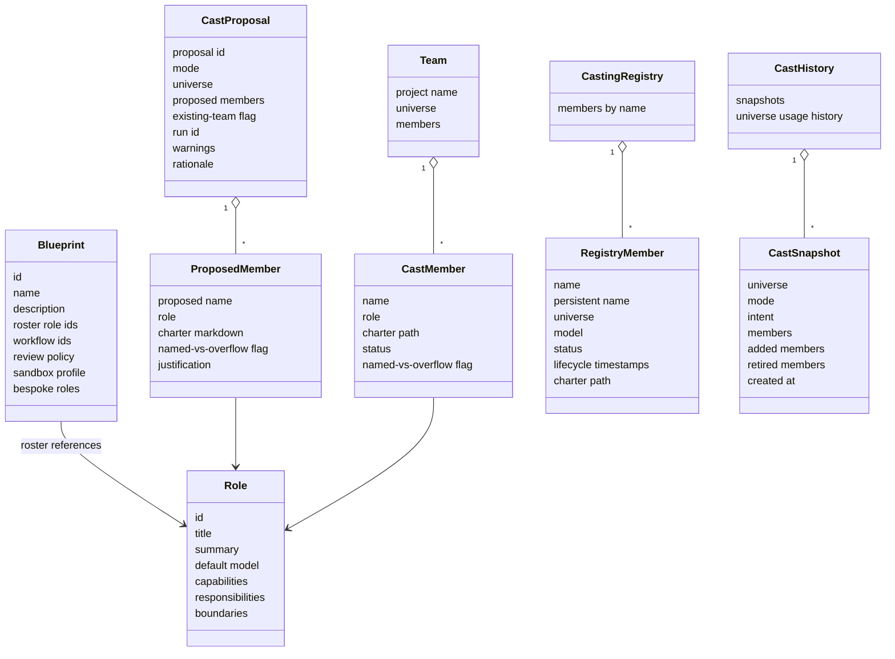
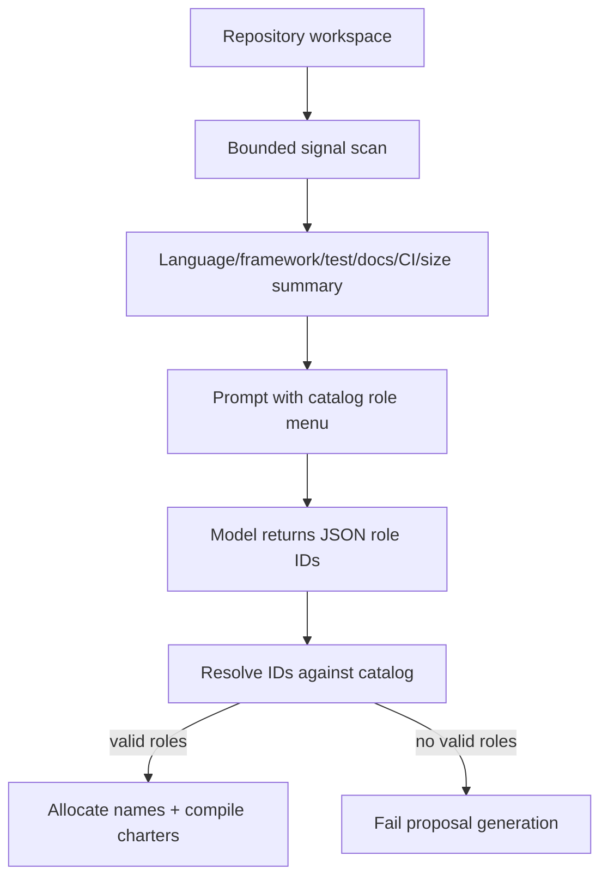
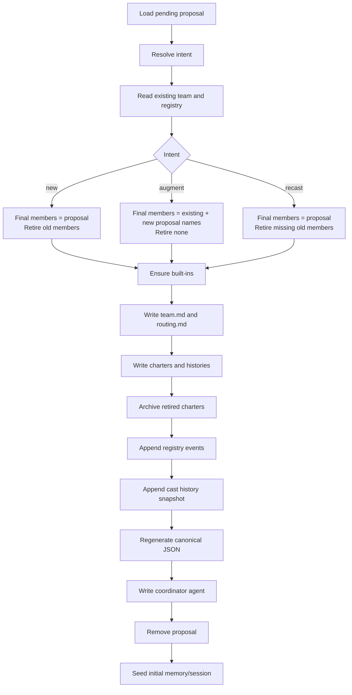

# Team & Casting Engine — Conceptual Deep Dive

## Purpose and mental model

The team and casting engine turns an intent into a durable team of named agents. The intent can be a predefined scenario, a blueprint, a manually chosen roster, a free-text goal, or an analysis of an existing repository. The durable result is a `.squad/` workspace: a team roster, each agent's charter, routing guidance, casting history, identity files, decision files, and sync metadata.

Think of casting as a controlled compiler:

1. **Inputs** describe desired work: a blueprint, template, goal, or project signals.
2. **Catalogs** provide the allowed vocabulary: role archetypes, charter templates, workflows, and built-ins.
3. **Casting state** preserves identity: naming policy, already-used names, and universe history.
4. **Proposal generation** is read-only: it suggests a roster, names, rationale, and charters.
5. **Confirmation** is the write boundary: it commits the roster to `.squad/`, records events, and seeds memory.

The design keeps creative choice and persistent state separate. Model-assisted steps may help select roles, but deterministic code owns naming, validation, persistence, and file writes.

Unverified: the older document referenced an orchestration deep dive at `docs/deep-dive/orchestration.md`; that file is not present in this checkout. Runtime workflow execution is intentionally out of scope here.

```mermaid
flowchart LR
    A[Intent\nscenario, blueprint, manual roster, free text, project analysis] --> B[Load project casting state\npolicy, registry, history]
    B --> C[Resolve role roster]
    C --> D[Select or validate universe]
    D --> E[Allocate names]
    E --> F[Compile charters]
    F --> G[Store pending proposal\nread-only]
    G --> H{Confirm?}
    H -->|reject/expire| I[No workspace changes]
    H -->|new / augment / recast| J[Merge proposal with existing team]
    J --> K[Add built-in agents]
    K --> L[Write .squad workspace]
    L --> M[Append registry/history events]
    M --> N[Regenerate canonical JSON]
    N --> O[Seed memory/session]
```

Where this lives:

- `apps/Agentweaver.Api/Casting`
- `packages/Agentweaver.Squad`

## Core concepts

### Blueprint

A blueprint is a reusable project-starting recipe. It answers: "What kind of team and workflow should this project begin with?" It contains a human name and description, a roster of role IDs, workflow IDs, a review policy, a sandbox profile, and optional bespoke roles with inline charters.

Blueprints are higher level than casts. Applying a blueprint does not write the team directly. Instead, the blueprint is translated into a manual cast proposal, then immediately confirmed as a new team. This keeps every path through the system using the same validation, naming, charter compilation, event recording, and persistence logic.

### Role

A role is an archetype such as backend engineer, QA engineer, writer, PM, or researcher. It is not an agent yet. It defines capabilities, responsibilities, boundaries, a default model, and usually a charter template. Roles are the stable vocabulary the system allows models and users to choose from.

### Cast proposal

A proposal is a temporary, reviewable draft. It contains the selected universe, proposed members, proposed names, compiled charters, a rationale, warnings, and possibly the model-run ID that produced it. Proposals are intentionally short-lived and replace any older pending proposal for the same project.

The proposal is the safety buffer between "suggest" and "commit." Model-assisted selection can be inspected, amended, rejected, or allowed to expire without touching `.squad/`.

### Team

A team is the confirmed roster. It has a project name, one universe, and active or retired members. It is stored as human-readable markdown plus canonical casting state.

### Registry and history

The registry answers: "Which agent names have existed, and what is their current status?" It prevents accidental name reuse and preserves identity across recasts.

The history answers: "What casts happened over time?" It records snapshots, intents, added members, retired members, and universe usage. It is what makes future universe selection aware of past casts.

Where this lives:

- `packages/Agentweaver.Squad/Model`
- `apps/Agentweaver.Api/Blueprints`

## Inputs: how different casting paths converge

All casting paths converge on the same intermediate object: a cast proposal.

### Scenario casting

Scenario casting starts from a catalog grouping. A grouping is a predefined set of roles for a common team shape, such as software delivery or content authoring. The system loads the grouping, resolves each role from the catalog, allocates names, compiles charters, and stores the proposal.

This path is deterministic except for the existing project state it reads. It is useful when the user already knows the kind of team they want.

### Manual casting

Manual casting starts from explicit role IDs. It follows the same naming and charter pipeline as scenario casting. Manual casting can also accept bespoke roles from a blueprint. A bespoke role is allowed only when it has an inline definition/charter supplied by the blueprint; otherwise unknown role IDs are rejected.

This path is the bridge between blueprints and teams.

### Free-text casting

Free-text casting asks a model to map a user goal to catalog roles. The user goal is fenced and labeled as data, not instructions. The prompt includes a menu of allowed role archetypes and requires JSON output. The parser extracts role IDs, resolves them against the catalog, discards unrecognized IDs, and fails if nothing valid remains.

The model chooses roles; deterministic code chooses names, charters, and persistence behavior.

### Analysis casting

Analysis casting first scans the repository for coarse project signals: languages, frameworks, test presence, documentation presence, CI presence, and rough project size. It avoids raw source transfer; the prompt receives only a summary. Sensitive filenames and common bulky directories are skipped, and scanning is bounded.

Those signals influence **role selection only**. For example, TypeScript plus React may justify a frontend engineer; tests missing may justify QA; docs present or absent may justify a docs writer. Signals do not currently influence universe choice.

If no signals are found, the model is asked for a small general-purpose starting team and the proposal includes a warning.

Unverified: there is no active "project signals to universe resonance" algorithm in the inspected code. Universe selection is deterministic from policy, history, optional override, and seed; project signals are used for role-selection prompts.

Where this lives:

- `packages/Agentweaver.Squad/Analysis`
- `apps/Agentweaver.Api/Casting`

## Blueprints: reusable team recipes

Blueprints solve a different problem from one-off casting: they package a domain-specific operating model. A blueprint says, "For this kind of project, use these roles, these workflows, this review policy, and this sandbox posture."

### Generation logic

Blueprint generation uses a model, but the prompt is heavily constrained:

- Treat the user's description as untrusted data.
- Decide whether the user wants Agentweaver to **operate** a process or to build software. This matters because "plan travel" should produce a travel-planning team, not software-delivery engineers.
- Prefer catalog roles because they already have known metadata and charters.
- Use bespoke roles only when no catalog role fits the domain function.
- Choose workflows by process fit, not by name similarity.
- Return structured JSON only.

The parser is tolerant about extra prose: it extracts the first balanced JSON object. The validator then enforces the actual contract.

### Workflow fallback

A generated blueprint may return no workflow when no library workflow fits. That is a meaningful signal, not a failure. In that case the blueprint service asks the workflow generator to draft a custom workflow. If custom workflow generation fails, the system falls back to the built-in default workflow with a warning.

The important design idea is **library first, custom second, default last**:

1. Use an existing workflow if it truly matches the process.
2. Generate a custom workflow if no existing process fits.
3. Use the default workflow only as a safe fallback.

### Validation logic

Validation checks that a blueprint is complete and safe to apply:

- identity fields exist;
- at least one workflow is available after fallback;
- review policy exists;
- sandbox profile is one of the bounded known profiles;
- roster is non-empty;
- each rostered role is either a catalog role or a declared bespoke role;
- bespoke roles have charters, are actually rostered, and do not collide with catalog role IDs.

This validation is what allows model-generated blueprints without trusting model output blindly.

### Applying a blueprint

Applying a blueprint is transactional in spirit:

1. Capture the current relevant workspace/project state.
2. Materialize a generated workflow if needed.
3. Convert bespoke roles into manual-cast inputs.
4. Create a manual proposal from the blueprint roster.
5. Confirm the proposal as a new team.
6. Update project defaults: default workflow, allowed workflows, review policy, and sandbox profile.
7. If anything fails, restore files and project settings as much as possible.

This design avoids a separate "blueprint writer" and guarantees blueprints produce teams through the same casting path as every other feature.

Unverified: some comments still describe blueprints as catalog-only. The active behavior supports bespoke roles when they are declared in `bespoke_roles` and referenced by the roster.

Where this lives:

- `apps/Agentweaver.Api/Blueprints`
- `packages/Agentweaver.Squad/Catalog/Resources/blueprints`

## The role catalog: bounded creativity

The catalog is the system's controlled vocabulary. It contains:

- role archetypes;
- role groupings/templates;
- charter templates;
- built-in agent templates;
- workflow YAMLs;
- predefined blueprints.

The catalog exists because casting should be creative in composition, not arbitrary in authority. A model can recommend "backend engineer" or "writer" only if those roles exist in the menu. The service then resolves IDs to trusted metadata. This prevents the model from inventing privileged roles, unknown IDs, or opaque instructions that bypass review.

A role and a charter are separated deliberately:

- The **role** is structured metadata used for selection, routing, validation, and defaults.
- The **charter** is the narrative operating contract injected into an agent's context and written to disk.

This separation lets Agentweaver reason about teams as data while still giving each agent a readable mission.

Where this lives:

- `packages/Agentweaver.Squad/Catalog`
- `packages/Agentweaver.Squad/Catalog/Resources`

## Universe selection and name allocation

### Why universes exist

Agent names are not just decoration. They create stable, memorable handles for agents across sessions, history, and decision files. A single fictional universe gives the team a coherent naming namespace: all proposed names come from the same pool instead of mixing unrelated names.

The universe also makes identity distinct from role. "Trinity" can be a backend engineer today and remain Trinity if rerolled later. The role can change; the persistent name remains the agent's identity.

### Universe policy

A project's casting policy defines which universes are allowed. If no policy exists, the default policy allows all built-in universe pools. An explicit universe override is accepted only if it appears in the allowlist.

### Selection algorithm

The universe allocator is pure and deterministic. It does no I/O; it receives policy and history and returns a universe.

In plain language:

1. Start with the project's allowlist.
2. If the caller supplied an override, accept it only if it is allowlisted.
3. If there is no usage history and a seed is available, hash the seed and use it to choose an allowlisted universe. This gives fresh projects variety without randomness.
4. Otherwise, choose the first allowlisted universe not yet seen in the project's universe history.
5. If every allowed universe has already been used, wrap around to the first allowlisted universe.

The important trade-off is determinism over surprise. The same policy, history, and seed should produce the same universe. That makes tests and rebuilds predictable.

Unverified: the casting policy model contains a universe capacity map, but the inspected allocator does not enforce capacity. Exhaustion is handled at the name level with generic overflow names.

### Name allocation algorithm

After selecting a universe, names are allocated from that universe's ordered pool.

Inputs:

- selected universe;
- case-insensitive reserved names from the registry;
- number of members to name.

Algorithm:

1. Create a working set of taken names from the registry.
2. Walk the universe pool in order.
3. For each member, pick the next pool name that is not already taken.
4. Add the selected name to the taken set immediately, so duplicates cannot occur within the same proposal.
5. If the pool runs out, generate `member-1`, `member-2`, and so on, skipping any already-taken generic name.
6. Mark whether the name came from the universe pool or from overflow.

Adding one member to an existing team reuses the team's existing universe. That preserves the invariant that a team has one universe.

### Naming invariants

- Names are compared case-insensitively for collision avoidance.
- The registry reserves names even across later casts.
- Overflow is explicit and non-fatal.
- A team has one universe; members do not choose individual universes.
- Universe selection does not inspect raw source or project content.

Where this lives:

- `packages/Agentweaver.Squad/Naming`
- `packages/Agentweaver.Squad/Squad`

## Charter compilation

A charter is the agent's operating contract. It answers:

- Who am I on this team?
- What responsibilities do I own?
- What capabilities may I use?
- What boundaries must I respect?
- How should other agents route work to me?

Compilation chooses the best available source:

1. If the catalog has a charter template for the role, fill placeholders such as agent name, role title, and role summary.
2. If no template exists, render a generic charter from the role's metadata.
3. If the role is bespoke, render from the blueprint-supplied inline charter.
4. Reject charters containing emoji code points.

Rejecting emoji is a small but useful invariant: generated charters remain plain, stable, and less likely to include decorative or ambiguous symbols in system context.

Charters are never accepted blindly from proposal amendment clients. When a proposal is amended with catalog roles, the service recompiles charters from trusted catalog data. That keeps client-side edits from smuggling arbitrary instructions into the committed team.

Where this lives:

- `packages/Agentweaver.Squad/Squad/CharterCompiler.cs`
- `packages/Agentweaver.Squad/Catalog/Resources/charters`

## Proposal lifecycle and confirmation

### Why proposals are temporary

A proposal is a review checkpoint, not durable project truth. The store keeps at most one active proposal per project, replaces older proposals with newer ones, and expires proposals after a short TTL. This avoids stale proposals being confirmed against a project whose team state has moved on.

A model-assisted proposal also records a run so users can see that a casting run happened, but the run record is not the source of truth. The proposal and later `.squad/` events are what matter for casting state.

### Confirmation intents

When a project already has a team, confirmation must state intent:

- **new**: replace the team with the proposal. Existing members not in the new team are retired.
- **augment**: keep the current team and add proposed members that are not already present. Nothing is retired.
- **recast**: use the proposal as the desired final team. Proposed members become active; existing members absent from the proposal are retired.

This explicit intent prevents accidental team replacement. It also makes history meaningful: a cast snapshot records whether the user started fresh, augmented, or recast.

### Built-in agents

Every confirmed team gets built-in support agents if absent:

- **Scribe** records sessions, decisions, and memory.
- **Ralph** monitors work and backlog health.
- **Rai** handles safety/compliance review.
- **Coordinator** coordinates the team.

Built-ins are not part of the user proposal. They are provisioned automatically during confirmation, registered alongside other members, and get charters. The coordinator also has a generated GitHub agent file; the other built-ins are represented by `.squad/agents/.../charter.md` rather than separate GitHub agent files.

### Confirmation flow

### What confirmation writes

Confirmation creates or updates:

- `.squad/team.md` as the human-readable roster;
- `.squad/routing.md` as a role-title-based routing guide;
- `.squad/config.json` if missing;
- `.squad/identity/now.md` and `wisdom.md` if missing;
- `.squad/rai/policy.md` and audit trail;
- `.squad/decisions.md` if missing;
- `.squad/agents/{name}/charter.md` for active proposed members and built-ins;
- `.squad/agents/{name}/history.md` for newly added members;
- `.squad/agents/_alumni/{name}/charter.md` for retired members;
- `.squad/casting/*.events.jsonl` event sidecars;
- `.squad/casting/registry.json` and `history.json` regenerated from events;
- `.github/agents/squad-agentweaver.agent.md` for the coordinator;
- merge-friendly `.gitattributes` entries and runtime `.gitignore` entries.

Where this lives:

- `apps/Agentweaver.Api/Casting`
- `packages/Agentweaver.Squad/Squad`

## Persistence model

### Human files plus canonical state

The `.squad/` folder serves two audiences:

- Humans and agents read markdown: team roster, charters, histories, decisions, routing, identity, and RAI policy.
- The casting engine reads structured state: policy, registry, and cast history.

The structured state uses append-only event sidecars plus regenerated canonical JSON. The events are the audit trail; the JSON files are convenient snapshots for fast reads and interoperability.

### Registry rebuild

To rebuild the registry, read each registry event line in order. Each line describes a member lifecycle state. Keep the latest event for each agent name. The resulting map is the current registry.

This supports simple operations:

- adding a member appends an active registry event;
- reroling appends a new active event for the same name;
- retiring appends a retired event for the same name;
- rebuilding collapses those events into the current state.

### History rebuild

To rebuild cast history, parse each cast snapshot event. Universe usage history is derived by sorting snapshots by creation time and keeping the first occurrence of each universe. That derived list feeds future universe selection.

### Legacy layout and conflicts

The reader prefers canonical `.squad/casting/` state. It can fall back to older flat casting files when canonical files do not exist. If both canonical and legacy state exist with different contents, the reader reports a layout conflict instead of guessing.

This is an important migration invariant: silent conflict resolution would risk corrupting identity state.

### Path safety

All squad reads and writes validate paths against the project workspace. Member names are slugged and validated before becoming path components. This prevents path traversal through agent names and keeps all generated files inside the intended workspace.

Where this lives:

- `packages/Agentweaver.Squad/Squad`

## Git sync

The git sync layer exists to let users review and commit team-definition changes separately from unrelated work.

The sync algorithm:

1. Diff the working tree and index against `HEAD`.
2. Keep only paths under `.squad/`.
3. Compute a hash from sorted changed paths plus file contents.
4. Return the change list and hash for review.
5. On commit, recompute current status and require the hash to match the reviewed hash.
6. Stage only `.squad/` paths; reject anything outside that prefix.
7. Commit with the provided or default message.

The expected-hash check prevents committing a `.squad/` state different from the one the user reviewed. The prefix restriction prevents sync from accidentally staging application code or generated context files outside `.squad/`.

Note: memory export can write `.agentweaver/context/*`, but the sync path described here commits only `.squad/` changes.

Where this lives:

- `packages/Agentweaver.Squad/Sync`
- `apps/Agentweaver.Api/Casting`

## Memory import and export

Memory bridges database-backed decisions/session state and the file ledger agents can read.

The squad package deliberately uses DTOs rather than EF entities. The API layer owns persistence; the squad package owns file import/export formats. This keeps the core squad library independent of the database implementation.

### Import

Import scans `.squad/decisions/inbox/*.md`. Each file must contain front matter with:

- `agent`
- `slug`
- `type`
- `title`

The body becomes the inbox content. A trailing `**Rationale:**` section, if present, is split into rationale. Files that cannot be parsed are skipped rather than blocking the whole import.

This makes the inbox a lightweight interoperability surface: agents or users can drop markdown decisions into a known folder, and the API can import them into structured state.

### Export

Export rewrites file artifacts from materialized database data:

- `.squad/decisions.md` from active decisions;
- `.squad/decisions/inbox/{slug}.md` from pending inbox entries;
- `.squad/agents/{agent}/history.md` from learning and update memory;
- `.squad/identity/now.md` from current session context;
- `.agentweaver/context/boundaries.md` from architectural and scope decisions;
- `.agentweaver/context/patterns.md` from pattern memories.

Pending inbox files are regenerated from the database, and stale pending markdown is removed. That makes the database the authoritative source after import/export synchronization.

### Memory seeded by casting

After confirmation, the casting service best-effort seeds `core_context` memory for newly added non-built-in agents using their charters. It also starts an initial session if no session is open. This gives newly cast agents immediate context without requiring a separate memory operation.

Where this lives:

- `packages/Agentweaver.Squad/Memory`
- `apps/Agentweaver.Api/Memory`

## Design trade-offs

### Deterministic infrastructure around model-assisted choice

Agentweaver allows a model to help choose a roster, but it does not let the model write the team directly. The model's output is parsed into role IDs and rationale. Everything after that is deterministic: role resolution, universe selection, name allocation, charter compilation, persistence, and event recording.

This gives users model flexibility while preserving rebuildability and auditability.

### Append-only events plus regenerated JSON

Append-only events preserve history and are friendly to merges. Regenerated JSON gives consumers a simple current-state file. The trade-off is that writers must remember to regenerate canonical JSON after appending events. The invariant is: events are the source for rebuild; JSON is a snapshot.

### One active proposal per project

Keeping one pending proposal avoids complex merge semantics between competing drafts. The trade-off is that a new proposal supersedes an older one. That is acceptable because proposals are temporary review artifacts, not durable history.

### Built-ins outside proposals

Built-ins are always provisioned at confirmation rather than presented as selectable roles. This keeps user proposals focused on domain work while guaranteeing every team has governance, coordination, memory, and safety support.

### Human-readable files as product surface

Most important artifacts are markdown. This makes teams inspectable, editable, reviewable, and git-friendly. The trade-off is that parsing must be conservative and structured state must exist beside the human files.

## Rebuild checklist

To rebuild the casting engine from scratch, implement these pieces in order:

1. Define role, proposal, team, registry, history, blueprint, and cast-intent models.
2. Build a catalog reader for roles, groupings, charter templates, workflows, built-ins, and blueprints.
3. Implement a deterministic universe allocator with allowlist validation, history-aware selection, seed hashing, pool-order name allocation, and generic overflow.
4. Implement project signal scanning that summarizes safe metadata only.
5. Implement prompt builders that fence user/repository data and require JSON role IDs from a catalog menu.
6. Implement proposal generation for scenario, manual, free-text, and analysis paths.
7. Store pending proposals with one-active-per-project semantics and expiry.
8. Implement charter compilation from templates, metadata fallback, and bespoke inline charters.
9. Implement confirmation intents: new, augment, recast.
10. Add built-in agents during confirmation.
11. Write `.squad/` human files and append registry/history events.
12. Regenerate canonical JSON from event sidecars.
13. Seed memory/session after confirmation as best effort.
14. Implement reader conflict detection between canonical and legacy layouts.
15. Implement git sync that reviews and commits only `.squad/` changes with expected-hash protection.
16. Implement DTO-based memory import/export so database state and file ledgers stay synchronized.

## Gotchas and invariants

- Proposal generation must not write `.squad/`; confirmation is the write boundary.
- A team has exactly one universe.
- Universe choice is deterministic and history-aware, not signal-scored.
- Names are reserved through the registry and compared case-insensitively.
- Exhausting a universe pool produces `member-N` names rather than failing.
- Role IDs from model output must resolve against the catalog unless they are explicitly declared bespoke blueprint roles.
- Client-supplied charter markdown should not be trusted for catalog roles; recompile from trusted templates/metadata.
- Existing teams require explicit confirmation intent.
- Built-ins are automatic and are not part of user proposals.
- Registry/history events must be followed by canonical JSON regeneration.
- Canonical and legacy casting state conflicts should block reads/writes until resolved.
- Git sync stages only `.squad/`; it does not commit `.agentweaver/context/*`.
- Memory import/export is DTO-based so the squad package remains database-agnostic.
