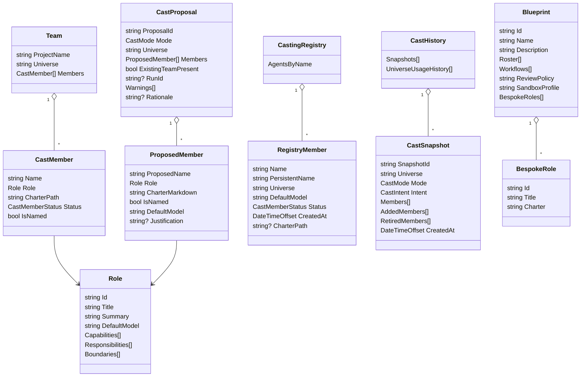

# Team & Casting Engine — Deep Dive

## Purpose & Scope

The Team / Casting / Blueprint engine turns a project description, scenario template, or explicit roster into a named, chartered team of specialist agents. Its core responsibilities are:

- choose a single fictional naming universe for a cast proposal;
- allocate stable, human-friendly agent names from that universe;
- compile per-agent charters from catalog role definitions or bespoke blueprint roles;
- persist the result into the project workspace under `.squad/`;
- seed registry/history/memory so future casts preserve identity.

This document focuses on casting and persistence. Runtime workflow execution and coordinator wiring are intentionally not duplicated here; see the orchestration deep dive link target: [`./orchestration.md`](./orchestration.md). Unverified: that file is referenced by the task but is not present in this checkout.

## Casting Pipeline

The verified pipeline has two phases: proposal generation is read-only, and confirmation writes the squad layout. The requested “project signals -> universe selection” flow is only partly true: `ProjectSignalScanner` feeds analysis-mode role selection, while universe selection is deterministic from policy/history/seed and does not currently score project signals.

```mermaid
flowchart LR
    A[Scenario template / manual roles / free-text goal / project analysis] --> B[Load project + .squad policy, registry, history]
    B --> C{Universe override?}
    C -->|yes| D[Validate allowlisted universe]
    C -->|no| E[UniverseAllocator.ProposeUniverse(history, projectId)]
    D --> F[Allocate names from one universe]
    E --> F
    A --> G{Analysis mode?}
    G -->|yes| H[ProjectSignalScanner summary]
    H --> I[CastingPrompts.Analysis / fallback]
    G -->|free text| J[CastingPrompts.FreeText]
    I --> K[GitHub Copilot role-selection run]
    J --> K
    K --> L[Resolve catalog roles]
    L --> F
    F --> M[CharterCompiler / bespoke charter render]
    M --> N[CastProposalStore stores pending proposal]
    N --> O[ConfirmProposalAsync]
    O --> P[team.md + routing + charters + histories]
    O --> Q[registry.events.jsonl + history.events.jsonl]
    Q --> R[canonical registry.json + history.json]
```

Key code paths:

- Scenario casting loads a catalog template, reads policy/registry/history, selects or validates a universe, allocates names, compiles charters, and stores a `CastProposal` without writing files (`apps/Agentweaver.Api/Casting/CastingService.cs:98-200`).
- Manual casting does the same from explicit role ids and can accept blueprint-supplied bespoke roles with inline charters (`apps/Agentweaver.Api/Casting/CastingService.cs:207-329`).
- Free-text and analysis casts create a read-only Copilot run; analysis mode scans repository signals and fences them as data before prompting (`apps/Agentweaver.Api/Casting/CastingService.cs:333-389`, `apps/Agentweaver.Api/Casting/CastingService.cs:452-468`).
- Confirmation resolves `new` / `augment` / `recast`, adds built-ins, writes `.squad/`, appends registry/history events, regenerates canonical JSON, and removes the pending proposal (`apps/Agentweaver.Api/Casting/CastingService.cs:796-1085`).

## Universe Selection & Naming

### Universe pools

`UniversePools` is a static, ordered dictionary from universe name to character-name pool. Current pools include The Matrix, Star Wars, Inception, Firefly, The Office, Breaking Bad, Dune, Alien, Blade Runner, The Lord of the Rings, Star Trek, Harry Potter, The Avengers, and Battlestar Galactica (`packages/Agentweaver.Squad/Naming/UniversePools.cs:6-25`).

### Selection

`UniverseAllocator` is pure and deterministic: it has no I/O and receives a `CastingPolicy` (`packages/Agentweaver.Squad/Naming/UniverseAllocator.cs:5-15`). Selection rules:

1. The policy allowlist must be non-empty (`packages/Agentweaver.Squad/Naming/UniverseAllocator.cs:23-28`).
2. If there is no usage history and a seed is provided, a SHA-256-based stable hash of the seed selects an allowlisted universe (`packages/Agentweaver.Squad/Naming/UniverseAllocator.cs:29-34`, `packages/Agentweaver.Squad/Naming/UniverseAllocator.cs:44-48`).
3. Otherwise, it returns the first allowlisted universe not yet in usage history, falling back to the first allowlisted universe after all have been used (`packages/Agentweaver.Squad/Naming/UniverseAllocator.cs:36-42`).
4. Overrides are validated against the same allowlist (`packages/Agentweaver.Squad/Naming/UniverseAllocator.cs:51-52`; used by `apps/Agentweaver.Api/Casting/CastingService.cs:141-153` and `apps/Agentweaver.Api/Casting/CastingService.cs:229-241`).

Unverified: there is no explicit “resonance scoring” function in the inspected code. Project signals influence role selection, not universe scoring (`packages/Agentweaver.Squad/Analysis/ProjectSignalScanner.cs:38-126`; `apps/Agentweaver.Api/Casting/CastingService.cs:455-464`).

### Name allocation and overflow

Names are allocated in pool order, skipping reserved names from the registry (`packages/Agentweaver.Squad/Naming/UniverseAllocator.cs:54-69`, `packages/Agentweaver.Squad/Naming/UniverseAllocator.cs:70-89`). When the pool is exhausted, overflow names are generated as `member-1`, `member-2`, etc., avoiding collisions (`packages/Agentweaver.Squad/Naming/UniverseAllocator.cs:90-99`). Adding a member to an existing team uses the existing team universe, preserving one universe per team (`apps/Agentweaver.Api/Casting/CastingService.cs:1319-1329`).

## Role Catalog

`CatalogReader` loads embedded catalog resources:

- group templates from `Catalog/Resources/groupings` via `LoadTemplates` / `LoadTemplate` (`packages/Agentweaver.Squad/Catalog/CatalogReader.cs:34-67`);
- roles from `Catalog/Resources/roles`, mapping ids by replacing hyphens with underscores in resource names (`packages/Agentweaver.Squad/Catalog/CatalogReader.cs:24-31`, `packages/Agentweaver.Squad/Catalog/CatalogReader.cs:69-85`);
- all roles by enumerating embedded role JSON resources (`packages/Agentweaver.Squad/Catalog/CatalogReader.cs:87-102`);
- predefined blueprints from embedded blueprint JSON resources (`packages/Agentweaver.Squad/Catalog/CatalogReader.cs:114-160`);
- role charter templates, built-in MAF agent templates, RAI policy template, and workflow YAMLs (`packages/Agentweaver.Squad/Catalog/CatalogReader.cs:162-208`).

Roles carry id, title, summary, default model, capabilities, responsibilities, and boundaries (`packages/Agentweaver.Squad/Model/CastingModels.cs:8-15`). Model-assisted casting presents a role menu to Copilot and requires returned role ids to come from the menu (`apps/Agentweaver.Api/Casting/CastingPrompts.cs:67-79`, `apps/Agentweaver.Api/Casting/CastingPrompts.cs:81-117`).

## Blueprints

A `Blueprint` is a reusable project starting point: id, name, description, roster role ids, workflow ids, review policy, sandbox profile, plus optional `BespokeRoles` for non-catalog roles with inline charters (`packages/Agentweaver.Squad/Model/Blueprint.cs:17-39`). The API DTO mirrors this shape and accepts legacy `workflow` plus newer `workflows` (`apps/Agentweaver.Api/Blueprints/BlueprintDtos.cs:14-55`).

### Generation

`CopilotBlueprintGenerator` is the production generator. It uses the shared `IAgentRunner`, lists catalog roles and built-in workflows, fences the user description as untrusted data, and asks for a JSON blueprint containing roster, bespoke roles, workflows, review policy, and sandbox profile (`apps/Agentweaver.Api/Blueprints/CopilotBlueprintGenerator.cs:9-15`, `apps/Agentweaver.Api/Blueprints/CopilotBlueprintGenerator.cs:39-59`, `apps/Agentweaver.Api/Blueprints/CopilotBlueprintGenerator.cs:90-127`). It runs in a throwaway scratch directory through `IAgentRunner.ExecuteAsync` (`apps/Agentweaver.Api/Blueprints/CopilotBlueprintGenerator.cs:129-150`).

The parser extracts the first JSON object and maps it into a `Blueprint`, including `bespoke_roles` (`apps/Agentweaver.Api/Blueprints/IBlueprintGenerator.cs:39-47`, `apps/Agentweaver.Api/Blueprints/IBlueprintGenerator.cs:87-103`, `apps/Agentweaver.Api/Blueprints/IBlueprintGenerator.cs:106-125`). If no library workflow fits, `BlueprintService.GenerateAsync` calls `IWorkflowGenerator` and replaces the blueprint workflow set with the generated workflow id; if that fails, it falls back to the built-in default workflow with a warning (`apps/Agentweaver.Api/Blueprints/BlueprintService.cs:417-477`).

### Validation and apply

Validation requires id, name, review policy, at least one workflow, known sandbox profile, and a non-empty roster (`apps/Agentweaver.Api/Blueprints/BlueprintService.cs:78-124`). Roster entries are valid if they are catalog roles or declared bespoke roles; bespoke roles must have charters, must be rostered, and must not collide with existing catalog role ids (`apps/Agentweaver.Api/Blueprints/BlueprintService.cs:127-160`).

Applying a blueprint:

1. optionally materializes a generated workflow YAML into `.agentweaver/workflows/`;
2. converts bespoke roles into a dictionary;
3. calls `CastingService.ProposeManualCastAsync`;
4. immediately confirms the proposal as a new team;
5. stores the blueprint's default workflow, allowed workflow set, active review policy, and sandbox profile on the project (`apps/Agentweaver.Api/Blueprints/BlueprintService.cs:216-240`, `apps/Agentweaver.Api/Blueprints/BlueprintService.cs:243-257`).

Blueprints relate to workflow role-slots by selecting the team roster and workflow set. Workflow definitions then provide node-level `role` / `agent` metadata: `WorkflowNode.Role` is documented as render role values such as `agent`, `review`, `merge`, `scribe`, `assembly`, and `plumbing` (`apps/Agentweaver.Api/Workflows/WorkflowDefinition.cs:77-101`). For example, the software-delivery blueprint rosters engineering/QA/docs roles and enables workflows including `software-delivery` (`packages/Agentweaver.Squad/Catalog/Resources/blueprints/blueprint_software_development.json:1-9`); that workflow uses `agent`, `review`, `merge`, `scribe`, and `plumbing` roles and assigns the QA test gate to `qa-engineer` (`packages/Agentweaver.Squad/Catalog/Resources/workflows/software_delivery.yaml:16-77`). Runtime binding details belong in orchestration.

## Casting Service & Proposals

`CastingService` is the application service for team casting and team read/edit operations (`apps/Agentweaver.Api/Casting/CastingService.cs:16-20`). It depends on project storage, catalog reader, proposal store, `IAgentRunner`, project signal scanner, logging, service scope factory, and run store (`apps/Agentweaver.Api/Casting/CastingService.cs:22-49`).

Proposal modes:

- `Scenario`: catalog template -> roles -> names -> charters.
- `Manual`: explicit role ids and optional bespoke definitions.
- `FreeText`: Copilot selects catalog roles from a goal.
- `Analysis`: scanner summarizes languages/frameworks/tests/docs/CI and Copilot selects roles from detected signals.

`CastProposalStore` is SQLite-backed with an in-memory write-through cache. It keeps at most one active proposal per project; new proposals supersede old ones, and proposals expire after 30 minutes (`apps/Agentweaver.Api/Casting/CastProposalStore.cs:10-20`, `apps/Agentweaver.Api/Casting/CastProposalStore.cs:34-66`). Reads fall back to SQLite after process restart and purge expired proposals (`apps/Agentweaver.Api/Casting/CastProposalStore.cs:68-86`, `apps/Agentweaver.Api/Casting/CastProposalStore.cs:150-185`).

Copilot usage is through `IAgentRunner`, not a direct `new GitHubCopilotAgentRunner()`. The agent runtime registration wires `GitHubCopilotAgentRunner`, `FoundryAgentRunner`, and `IAgentRunner` as an `AgentRunnerDispatcher` (`packages/Agentweaver.AgentRuntime/AgentRuntimeServiceCollectionExtensions.cs:26-30`). The dispatcher sends `ModelSource.GitHubCopilot` calls to `GitHubCopilotAgentRunner` (`packages/Agentweaver.AgentRuntime/AgentRunnerDispatcher.cs:17-32`). Casting’s helper runtime calls `IAgentRunner.ExecuteAsync` with `ModelSource.GitHubCopilot` (`apps/Agentweaver.Api/Infrastructure/AgentweaverAgentRuntime.cs:29-41`), and model-assisted casting records its run as GitHub Copilot (`apps/Agentweaver.Api/Casting/CastingService.cs:474-489`).

## Squad Persistence

### Layout

`SquadPaths` defines the project-relative layout:

- `.squad/team.md`;
- `.squad/config.json`;
- `.squad/identity/now.md` and `wisdom.md`;
- `.squad/routing.md`, `.squad/decisions.md`;
- `.squad/rai/policy.md`, `.squad/rai/audit-trail.md`;
- canonical casting state under `.squad/casting/{policy,registry,history}.json` plus append-only `.events.jsonl` sidecars;
- legacy flat casting paths for migration/conflict detection;
- charters/histories under `.squad/agents/{slug}/` and alumni charters under `.squad/agents/_alumni/`;
- `.github/agents/squad-agentweaver.agent.md` for the coordinator MAF agent (`packages/Agentweaver.Squad/Squad/SquadPaths.cs:8-35`, `packages/Agentweaver.Squad/Squad/SquadPaths.cs:37-70`).

### `team.md`

`TeamMarkdown.Render` writes a `# Squad Team` document with a Coordinator table, member table, and project context including project, universe, creation date, owner, and description (`packages/Agentweaver.Squad/Squad/TeamMarkdown.cs:11-41`). `TeamMarkdown.Parse` reconstructs a `Team` from the member table and registry defaults (`packages/Agentweaver.Squad/Squad/TeamMarkdown.cs:44-104`).

### Charters and sidecars

`CharterCompiler` compiles catalog templates with `{Name}`, `{Role Title}`, and `{Role summary}` replacements or renders a generic custom charter; it rejects emoji code points (`packages/Agentweaver.Squad/Squad/CharterCompiler.cs:21-44`, `packages/Agentweaver.Squad/Squad/CharterCompiler.cs:46-103`).

`SquadWriter` validates all writes through `SandboxPathValidator`, writes team/config/identity/RAI/routing/decision files, writes charters and histories, appends registry/history events, regenerates canonical JSON from events, and manages `.gitignore` / `.gitattributes` entries (`packages/Agentweaver.Squad/Squad/SquadWriter.cs:8-23`, `packages/Agentweaver.Squad/Squad/SquadWriter.cs:45-84`, `packages/Agentweaver.Squad/Squad/SquadWriter.cs:101-159`, `packages/Agentweaver.Squad/Squad/SquadWriter.cs:161-238`).

`SquadReader` reads canonical state first, falls back to legacy files, and detects conflicts when canonical and legacy layouts differ (`packages/Agentweaver.Squad/Squad/SquadReader.cs:14-19`, `packages/Agentweaver.Squad/Squad/SquadReader.cs:53-91`, `packages/Agentweaver.Squad/Squad/SquadReader.cs:105-170`).

`SquadSerialization` rebuilds registry and history from append-only events. Latest registry event per agent wins; history events are ordered by `CreatedAt`, and universe usage history is deduplicated in first-seen order (`packages/Agentweaver.Squad/Squad/SquadSerialization.cs:35-57`, `packages/Agentweaver.Squad/Squad/SquadSerialization.cs:59-90`).

### Git sync

`SquadGitScribe` diffs only `.squad/` changes against HEAD and computes a hash over paths and content (`packages/Agentweaver.Squad/Sync/SquadGitScribe.cs:16-53`). Commit requires the expected hash to still match and stages only `.squad/` paths, aborting if any path escapes that prefix (`packages/Agentweaver.Squad/Sync/SquadGitScribe.cs:55-98`). `CastingService` exposes this through `GetSyncStatus` / `CommitSync` helpers (`apps/Agentweaver.Api/Casting/CastingService.cs:1505-1525`).

## Squad Memory

Memory import/export is deliberately DTO-based and has no EF dependency in the squad package.

- `MemoryDtos` defines export DTOs for decisions, inbox entries, memory, session state, and import DTOs for inbox files (`packages/Agentweaver.Squad/Memory/MemoryDtos.cs:3-40`).
- `SquadMemoryImporter` scans `.squad/decisions/inbox/*.md`, parses YAML-like front matter, requires `agent`, `slug`, `type`, and `title`, and extracts optional rationale from the body (`packages/Agentweaver.Squad/Memory/SquadMemoryImporter.cs:3-20`, `packages/Agentweaver.Squad/Memory/SquadMemoryImporter.cs:34-73`).
- `SquadMemoryExporter.ExportAsync` writes team decisions, inbox files, agent histories, `.squad/identity/now.md`, and `.agentweaver/context/{boundaries,patterns}.md` (`packages/Agentweaver.Squad/Memory/SquadMemoryExporter.cs:6-44`).
- The exporter rewrites `.squad/decisions.md` and pending inbox files, deletes stale pending inbox markdown, writes learning/update memories to agent histories, writes current session focus, writes architecture/scope boundaries, and writes pattern memories (`packages/Agentweaver.Squad/Memory/SquadMemoryExporter.cs:46-79`, `packages/Agentweaver.Squad/Memory/SquadMemoryExporter.cs:81-163`).
- On proposal confirmation, casting seeds `core_context` memory from charters for newly added non-built-in agents and starts an initial session if none is open (`apps/Agentweaver.Api/Casting/CastingService.cs:1081-1162`).

## Domain Models



The records and enums behind this diagram live in `CastingModels.cs` (`packages/Agentweaver.Squad/Model/CastingModels.cs:3-90`) and `Blueprint.cs` (`packages/Agentweaver.Squad/Model/Blueprint.cs:3-39`).

## Gotchas & Invariants

- **One universe per assignment/team.** `CastProposal` and `Team` each carry one `Universe`, and confirmation assigns that universe to all final and built-in registry members (`packages/Agentweaver.Squad/Model/CastingModels.cs:24-45`; `apps/Agentweaver.Api/Casting/CastingService.cs:927-930`, `apps/Agentweaver.Api/Casting/CastingService.cs:1012-1042`).
- **Names are persistent.** Allocated names are reserved from the registry before new allocations, appended as registry events on confirmation/add/rerole/retire, and rebuilt from append-only event sidecars (`apps/Agentweaver.Api/Casting/CastingService.cs:132-155`, `apps/Agentweaver.Api/Casting/CastingService.cs:1008-1072`, `packages/Agentweaver.Squad/Squad/SquadSerialization.cs:35-90`).
- **Overflow is explicit.** Exhausted universe pools produce `member-N` generic names rather than failing (`packages/Agentweaver.Squad/Naming/UniverseAllocator.cs:90-99`).
- **Proposals are not durable forever.** Pending proposals expire after 30 minutes and only one active proposal is retained per project (`apps/Agentweaver.Api/Casting/CastProposalStore.cs:10-20`, `apps/Agentweaver.Api/Casting/CastProposalStore.cs:58-66`).
- **Confirmation is the write boundary.** Proposal methods do not write `.squad/`; `ConfirmProposalAsync` writes team/routing/charters/history/registry state (`apps/Agentweaver.Api/Casting/CastingService.cs:98-100`, `apps/Agentweaver.Api/Casting/CastingService.cs:336-340`, `apps/Agentweaver.Api/Casting/CastingService.cs:934-1073`).
- **Built-ins are automatic.** Scribe, Ralph, Rai, and Coordinator are added to every confirmed team if absent; they are registered and get charters, but they are not part of user proposals (`apps/Agentweaver.Api/Casting/CastingService.cs:904-925`, `apps/Agentweaver.Api/Casting/CastingService.cs:1026-1043`, `apps/Agentweaver.Api/Casting/CastingService.cs:1164-1202`). API mapping also treats those names as built-in (`apps/Agentweaver.Api/Casting/CastingMappings.cs:50-65`).
- **Built-ins are charters, not separate MAF files.** The coordinator MAF agent file is written separately, while Scribe/Ralph/Rai/Coordinator built-ins are addressed through `.squad/agents/{name}/charter.md` (`apps/Agentweaver.Api/Casting/CastingService.cs:1164-1169`, `apps/Agentweaver.Api/Casting/CastingService.cs:1071-1073`).
- **Bespoke blueprint roles are supported despite older comments.** The active validation path accepts roster ids declared in `bespoke_roles`, and manual casting renders their inline charters (`apps/Agentweaver.Api/Blueprints/BlueprintService.cs:127-160`, `apps/Agentweaver.Api/Casting/CastingService.cs:252-280`).
- **Sync commits only `.squad/`.** `SquadGitScribe` refuses to stage paths outside `.squad/`, so files such as `.agentweaver/context/*` exported by memory are not included in that sync path (`packages/Agentweaver.Squad/Sync/SquadGitScribe.cs:75-88`; `packages/Agentweaver.Squad/Memory/SquadMemoryExporter.cs:37-42`).
