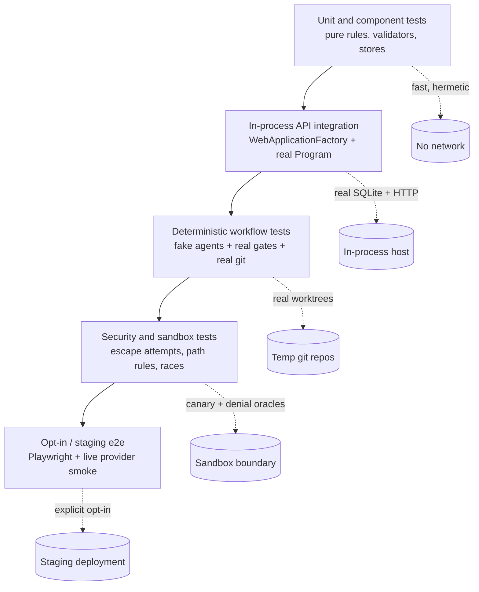
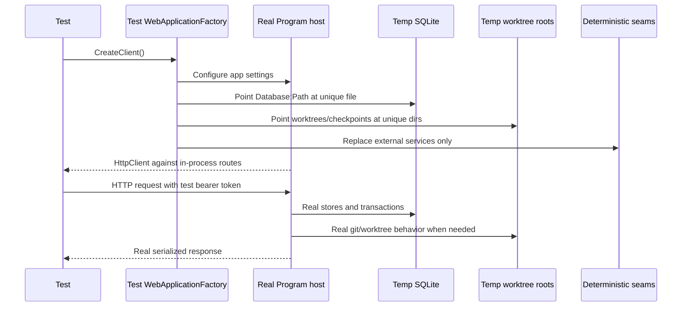
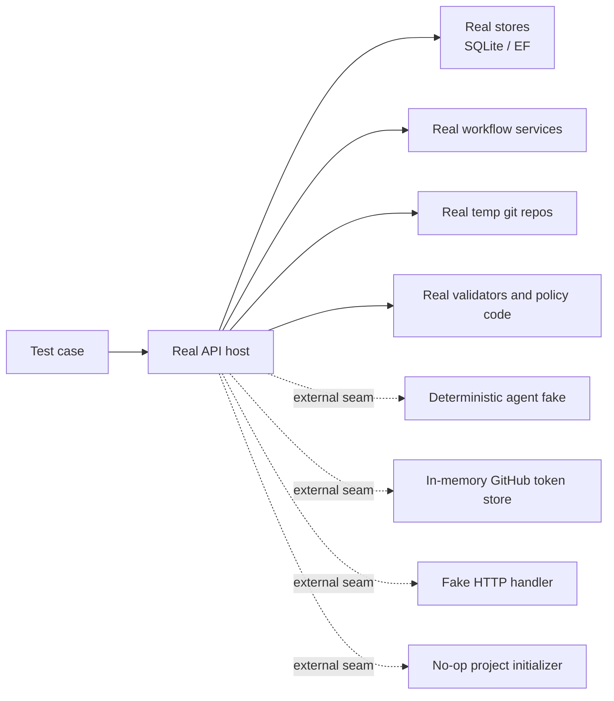
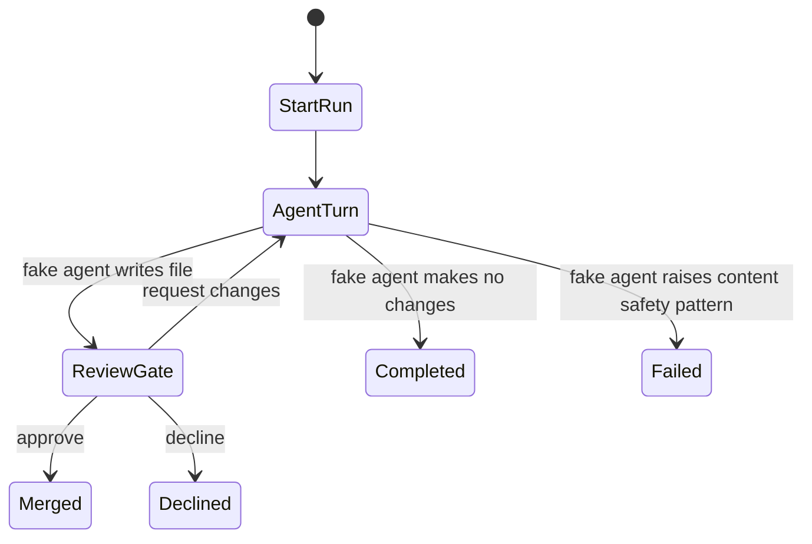
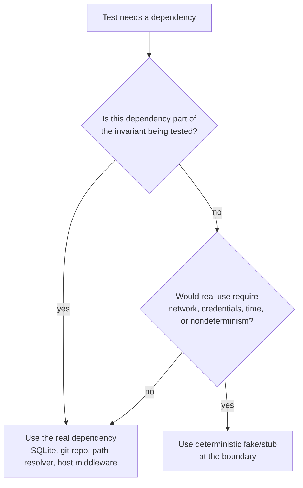

# Testing Strategy — Conceptual Deep Dive

## Purpose and mental model

Agentweaver is verified as a control system, not as a collection of isolated helpers. The core risk is not just "does this method return the right value?" It is "can an AI-driven run move through a controlled lifecycle without escaping its workspace, skipping review, losing events, corrupting repository state, or trusting the wrong identity?"

The test strategy therefore mirrors the architecture from the system overview:

1. **Intent plane tests** check HTTP and MCP-facing contracts: authentication, project APIs, review decisions, coordinator gates, memory tools, and staging smoke paths.
2. **Control plane tests** check durable state and orchestration: run stores, event streams, workflow gates, coordinator planning, merge coordination, recovery, and decision ledgers.
3. **Execution plane tests** check governed side effects: filesystem containment, shell sandbox policy, git worktrees, provider seams, and agent tool behavior.

The philosophy is conservative: keep the default suite fast and hermetic, but exercise real infrastructure boundaries wherever correctness depends on them. Tests replace live model calls and external GitHub/network dependencies with deterministic seams, while still using real HTTP routing, real SQLite databases, real git repositories, real workflow state machines, and real sandbox path logic.

Where this lives: `tests/Agentweaver.Tests`, `tests/Agentweaver.Tests/Helpers`, `tests/e2e`, `docs/deep-dive/00-system-overview.md`.

## The testing pyramid

Agentweaver's pyramid is intentionally wide in the middle. Pure unit tests are useful for algorithms and validators, but many of the important failures happen at service boundaries: middleware ordering, database state transitions, workflow gates, stream persistence, git branch updates, and sandbox policy wiring. Those are covered with in-process integration tests rather than brittle end-to-end tests.

| Layer | What it proves | Typical dependencies |
| --- | --- | --- |
| Unit/component | Local rules are deterministic: path validation, PKCE math, token validation, command construction, parsers, stores, DAG frontier logic. | In-memory objects, fake HTTP handlers, isolated temp directories. |
| Store/infrastructure | Durable contracts hold: SQLite schemas, compare-and-swap transitions, append-only records, replay, idempotent persistence. | Real SQLite files or in-memory SQLite connections. |
| API integration | The real host routes requests through middleware, auth, endpoint mapping, services, stores, and response serialization. | `WebApplicationFactory<Program>`, temp SQLite, temp worktree/checkpoint roots, test auth keys. |
| Workflow integration | Runs move through actual workflow nodes and gates without live model calls. | Real API host, fake workflow agents, real git repos, pending request stores, polling for async completion. |
| Security/regression | Known escape and race classes stay closed. | Real filesystem paths, real git merges, sandbox validators, opt-in live-provider canaries. |
| E2E smoke | A deployed instance responds as a user or MCP client would observe it. | Playwright against staging; several OAuth flows are documented/skipped until deployable. |

The shape is a trade-off. The suite avoids depending on live providers by default because model output is nondeterministic and credentials are sensitive. But it also avoids over-mocking the system: most integration tests boot the real API and then replace only the external seams that would make the test slow, flaky, or non-hermetic.

## How API integration tests host the system

The main integration pattern is a custom `WebApplicationFactory<Program>`. Each factory starts the real ASP.NET Core application in-process, then injects test configuration before startup:

- a unique SQLite database path;
- isolated worktree and checkpoint directories;
- test bearer keys and users;
- test provider configuration values required at startup;
- development/test bypass flags where the test is not exercising GitHub org authorization;
- service replacements for live external seams.

This approach is important because middleware order and DI wiring are part of the contract. A project endpoint test is not merely testing a service method; it verifies that authentication, route binding, JSON naming, service registration, persistence, and response status codes all agree.

There are several specialized factories because different subsystems need different seams:

- **General API factory**: temp SQLite, temp worktrees, known API key, and test provider values.
- **Projects factory**: in-memory GitHub token store and no-op project git initializer so project CRUD does not touch the OS credential store or clone real repositories.
- **Review factory**: two API keys so owner and non-owner review paths can be tested without mocking identity.
- **Workflow factory**: deterministic file-editing agent and fake workflow agent factory so the real workflow graph can run without GitHub Copilot.
- **Coordinator factory**: deterministic coordinator spec drafter, signed-out token store, no-op project initializer, and disabled auto-dispatch for scoped coordinator phases.
- **OAuth factory**: synthetic issuer/audience, test API key, in-memory token store, and no-op git initializer for MCP OAuth integration surfaces.

The common principle is: replace the world outside Agentweaver, not Agentweaver's own control plane.

Where this lives: `tests/Agentweaver.Tests/Helpers`.

## Fakes, fixtures, and real dependencies

Agentweaver tests use fakes deliberately, not casually. A fake is acceptable when it stands at a nondeterministic or external boundary and preserves the shape of the production contract. A fake is not used to skip the behavior being tested.

Key patterns:

- **SQLite is real.** Many tests use unique database files, and some EF-backed coordinator or memory tests use an in-memory SQLite connection. This catches SQL schema, transaction, uniqueness, append-only, and compare-and-swap behavior that a mock would miss.
- **Git is real when git behavior matters.** Review, commit, merge, integration-branch, and workflow tests create temporary LibGit2Sharp repositories. They assert branch tips, tree hashes, merge conflicts, and worktree cleanup instead of assuming a git abstraction worked.
- **Agents are deterministic.** `TestFileEditAgentRunner` can make a real file change, make no change, or simulate content-safety failure. `FakeWorkflowAgentFactory` keeps RAI, Rubberduck, and Scribe turns deterministic so tests can focus on workflow routing.
- **Coordinator drafting is deterministic.** The coordinator suite replaces model drafting with a fake drafter that produces stable outcome specs from the goal and memory context. The subsequent gates, persistence, and orchestration are still real.
- **Network calls are stubbed at the HTTP boundary.** OAuth, GitHub token, org membership, and API-tool tests use fake handlers or in-memory stores so tests can exercise success, denial, SAML, rate-limit, and error semantics without live GitHub.
- **Sandbox tests use real filesystem objects.** Path tests create actual directories, files, and, when permitted by the OS, symlinks. Escape tests rely on canary files outside the sandbox as the oracle.

This split keeps the suite reliable while still testing the failure modes that historically matter: database races, branch divergence, path traversal, middleware auth behavior, and workflow gate consumption.

## What each subsystem's tests are trying to protect

### Memory and decisions

Memory tests treat the memory system as a ledger. They verify that inbox submissions are idempotent by slug, merge creates a canonical decision and marks the source entry, rejection retains audit state without creating a decision, filters return the expected status/type/agent slices, and exported/imported data stays tied to the project model.

The tests also cover the agent-facing API tools. Those tools must return useful strings for recoverable conditions such as conflicts or server errors instead of throwing opaque tool-execution failures. That matters because an agent turn should be able to learn "this decision was already recorded" and continue.

Rebuilder rule: test both the HTTP ledger and the agent tool facade. A memory system is only useful if humans can inspect it and agents can write to it without destabilizing runs.

### OAuth, auth, and MCP

Auth tests are split between pure protocol rules and hosted middleware behavior:

- token signing produces audience-bound JWTs and rejects tampering or wrong audiences;
- redirect URI policy allows loopback/native-client shapes and rejects unsafe destinations;
- PKCE requires S256 and rejects missing or weak challenge inputs;
- authorization codes and refresh-token paths are specified as single-use/rotating where implemented;
- org enforcement fails closed for non-members or inconclusive states;
- MCP bearer middleware keeps backward-compatible static API-key behavior while protecting `/mcp`;
- discovery and metadata routes are checked through in-process or staging smoke paths.

Some OAuth lifecycle scenarios are represented as skipped acceptance tests. They document the contract the implementation is expected to satisfy as protocol support and staging coverage expand.

Rebuilder rule: test OAuth as a state machine, not just as JSON metadata. Codes, verifiers, redirect URIs, `aud` claims, refresh rotation, and revocation are security invariants, so each should have a positive and negative test.

### Projects and GitHub integration

Project tests cover the boundary where a repository becomes known to Agentweaver. They verify CRUD, relinking, deletion, workspace selection, token redaction, GitHub device/sign-in flows, token storage and refresh, org authorization, and failure-closed behavior when Copilot tokens are signed out.

Most project endpoint tests do not perform real clones; they use a no-op initializer and isolated workspaces. Git behavior is reserved for tests where branch state is the point.

Rebuilder rule: project tests should distinguish "metadata and policy" from "actual git mutation." Use a fake initializer for project CRUD, but use real repos for merge, worktree, and branch invariants.

### Single-run workflows, review, and merge

Workflow and review tests protect the central lifecycle from the system overview:

1. a run starts against a repository and branch;
2. the agent changes an isolated worktree;
3. the workflow reaches review with a diff and tree hash;
4. a valid reviewer approves, declines, or requests changes;
5. merges serialize and update the originating branch only when allowed;
6. terminal states clean up or preserve worktrees according to outcome.

The tests assert observable consequences rather than internal method calls: run status, pending request presence, branch tip tree, worktree cleanup, diff visibility, merge conflict records, SSE events, and idempotent review decisions.

The important race tests use compare-and-swap style assertions. For example, concurrent approve and request-changes attempts must result in exactly one winner. Append-only revision tests make direct database tampering fail. Prompt-injection tests verify reviewer feedback is nonce-fenced before it is handed back to the agent.

Rebuilder rule: never test review as a boolean flag only. Test the whole boundary: owner identity, pending gate, state transition, branch mutation or non-mutation, event emission, idempotency, and cleanup.

### Coordinator flows

Coordinator tests are heavy because coordinator correctness is mostly state-machine correctness. They cover:

- outcome-spec draft, persistence, event emission, and suspension at a confirmation gate;
- confirm, revise, decline, owner-scoping, missing-run, and no-pending-gate outcomes;
- bounded waiting for a gate that arms shortly after the UI observes `awaiting_confirmation`;
- deterministic work-plan persistence after confirmation;
- subtask dependency frontier rules;
- child observation, failure routing, retry, pickup ownership, roster dispatch filters, and assembly finalization;
- integration-branch construction from child outputs, including conflict handling;
- coordinator event persistence and replay contracts.

The coordinator suite uses deterministic planning seams because a model-generated plan would make the suite nondeterministic. The system behavior after the plan exists is still tested through real stores and services.

Rebuilder rule: test the coordinator as a durable DAG plus gates. A good suite should be able to restart, recompute the frontier, observe child states, assemble only eligible outputs, and reject double decisions.

### Sandbox and tool governance

Sandbox tests are intentionally adversarial. They check path traversal, absolute paths, Windows drive paths, null bytes, symlinks, search traversal patterns, excluded directories, governance default-deny behavior, command validation, shell executor command construction, and regressions where a provider once had its own unsafe resolver.

The live provider sandbox-escape tests are opt-in. They create an in-sandbox marker and an out-of-sandbox canary, instruct the provider-backed agent to read both, and pass only if:

- the in-sandbox marker can be read;
- at least one out-of-sandbox attempt is denied;
- the canary never appears in the final response, streamed events, or logs;
- tool call/result/error events are correlated by call id.

That test is expensive and credentialed, so it is not part of the default suite. But it is the right shape for proving the provider path is wired through governance rather than only testing local helpers.

Rebuilder rule: sandbox tests need a positive control and a negative oracle. A test that only asserts "denied" can be vacuous; a test that proves safe access works and unsafe canary access does not leak is stronger.

### Events, persistence, and recovery

Event tests protect the "durable event log is truth" invariant:

- appending writes through to SQLite before returning;
- a new stream instance can replay events after simulated restart;
- cursor resume returns only events after the requested sequence;
- persisted coordinator streams stay ordered and idempotent;
- terminal events survive long enough for observers and replay consumers.

Recovery and watch-loop tests build on that by checking terminal output, restart services, pending gates, and run status reconciliation.

Rebuilder rule: do not treat streams as only live websockets. Test the database rows directly, then test replay through the public stream abstraction.

### E2E smoke

The Playwright suite is mostly a staging smoke layer. It checks that the SPA shell loads, sign-in renders and redirects, health and docs endpoints respond, protected APIs reject unauthenticated callers, and an authenticated GitHub token can return signed-in status when available.

The OAuth E2E file doubles as a manual runbook for MCP OAuth discovery, PKCE, token exchange, refresh, non-member denial, and static API-key compatibility. The actual tests are skipped until the relevant staging capabilities are deployed and credentials are available.

Rebuilder rule: keep E2E small. Use it to prove deployment wiring and the most important user-visible paths, not to duplicate every API integration test.

## Determinism in agent and coordinator tests

Agentweaver cannot make a model deterministic, so tests put determinism at the seam immediately outside the model. The fake agent still performs real file operations and emits representative events; it just chooses from known modes.

This pattern has two advantages:

1. The workflow graph, request-port suspension, watch loop, pending request store, run store, event stream, git diff, and merge services are exercised exactly as production would exercise them.
2. The test has a stable oracle. If a run fails to reach `awaiting_review`, there is a control-plane problem, not a model-quality problem.

Coordinator tests use the same idea. The drafter is deterministic, but the persisted spec, gate consumption, work-plan records, dependency edges, and events are real. This is the right compromise for a system where the model is one participant, not the source of authority.

## In-memory versus real dependencies

The suite uses a simple decision rule:

Examples:

- SQLite is real because transactionality, uniqueness, append-only behavior, and compare-and-swap transitions are test subjects.
- Git repositories are real when branch and merge behavior are test subjects.
- GitHub and model providers are fake by default because live network and model output are not the test subject in most runs.
- The API host is real because route, middleware, DI, and serialization wiring are part of the contract.
- The sandbox path resolver is real because path containment is the contract.

This rule is what a rebuild should preserve. The exact class names can change; the boundary logic should not.

## Deliberate test boundaries

The suite is strong around control-plane invariants, but there are deliberate gaps:

- Live model-provider behavior is not part of the default suite. Provider-backed sandbox escape tests exist, but they are opt-in through environment configuration.
- Staging Playwright tests are smoke tests, not full workflow coverage.
- Several OAuth lifecycle scenarios are skipped acceptance tests; they define the intended contract but do not run in the default suite.
- Kubernetes sandbox execution is not proven by a default live-cluster E2E. The default coverage focuses on command construction, policy behavior, and API-side sandbox contracts.
- Frontend behavior is not deeply unit-tested in `tests/Agentweaver.Tests`. The E2E coverage checks major deployed pages and auth redirects.
- Performance, load, and long-running multi-agent soak behavior are not represented as a normal test layer.

The documented test scope covers `tests/Agentweaver.Tests` and `tests/e2e`. Any additional deployment, load, or live AKS sandbox stages that a CI pipeline might run sit outside this scope.

These gaps are acceptable only if they are explicit. The default suite should remain hermetic, but release gates should add opt-in live checks for the boundaries that cannot be proven locally.

## Invariants a rebuild should preserve

A rebuilt Agentweaver should have tests that protect these invariants:

- **Authority stays in the control plane.** Clients and MCP tools request actions; they do not directly mutate run state, memory ledgers, or branches.
- **Runs are durable and replayable.** Every run has a durable identity, monotonic event sequence, and recoverable terminal story.
- **Work happens in isolated worktrees.** The protected branch is unchanged until review/merge logic explicitly advances it.
- **Review decisions are scoped and consumed once.** Owner checks, pending gates, idempotency, and compare-and-swap transitions prevent stale or double decisions.
- **Merge failures are safe.** Conflicts do not advance the originating branch, and conflict details do not leak raw file content in unsafe places.
- **Sandbox boundaries fail closed.** Unknown tools, suspicious paths, weak executors, symlink escapes, and out-of-root operations are denied before side effects.
- **Safe operations still work.** Tests must prove agents can read/write/search inside the workspace so denial checks are not vacuous.
- **Auth is explicit.** Bearer tokens are validated, OAuth redirects are constrained, PKCE is mandatory, org authorization fails closed, and production bypasses are guarded.
- **Memory promotion is atomic.** Inbox entries, decisions, session context, and exported files remain consistent enough for future agents to trust.
- **Coordinator work is a DAG.** Dependencies, child states, retries, assembly, and collective review are durable and recomputable.
- **External nondeterminism is isolated.** Tests can run without live models, real GitHub, or staging unless the test is explicitly opt-in.

## How to structure tests when rebuilding

Start with the contracts, then choose the lightest dependency that can prove each one.

1. **Write pure tests for pure rules.** Path normalization, redirect validation, PKCE challenge matching, token validation parameters, command builders, parsers, and DAG frontier logic should be fast and table-driven.
2. **Use real SQLite for persistence semantics.** If a feature depends on transactions, unique indexes, append-only triggers, replay, or compare-and-swap, do not mock the store.
3. **Use in-process API tests for route contracts.** Boot the real host with temp configuration and make HTTP requests through `HttpClient`.
4. **Use real git for branch claims.** If a test says "branch unchanged" or "merge conflict," assert against actual git objects.
5. **Replace only external seams.** Fake model turns, GitHub HTTP responses, credential stores, and project initializers, but keep Agentweaver's services real.
6. **Poll asynchronous workflows through observable state.** Do not sleep blindly. Poll run status, pending gates, stream events, or database rows with bounded timeouts.
7. **Make security tests non-vacuous.** Include a safe positive control and a denied negative control, preferably with a canary value that must not leak.
8. **Keep E2E narrow and honest.** Use it for deployment wiring, browser redirects, and staging smoke; keep detailed behavior in hermetic integration tests.

The rebuild target is not identical file names. It is the same confidence model: deterministic tests around nondeterministic agents, real persistence for durable claims, real git for repository claims, adversarial tests for security boundaries, and small opt-in live checks for everything that cannot be proven offline.
