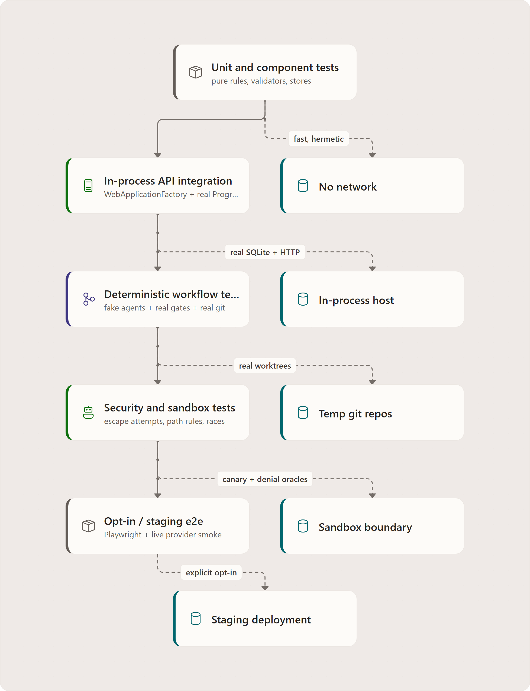
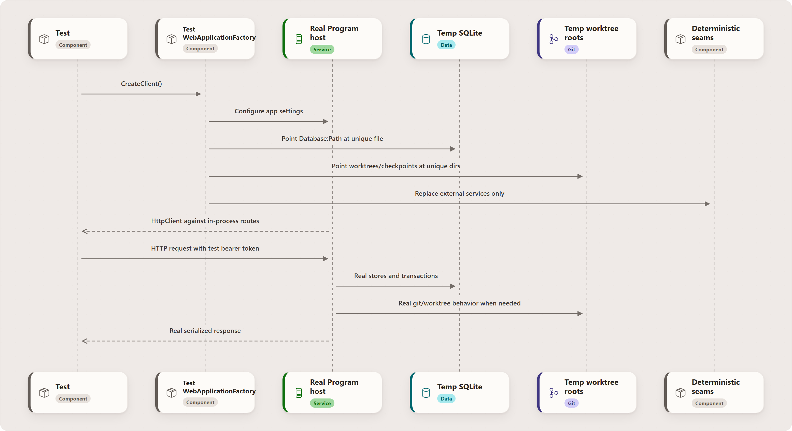
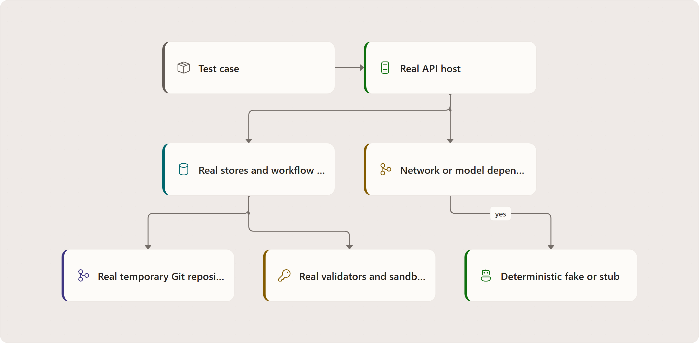

# Testing Strategy — Conceptual Deep Dive

## Purpose and mental model

Agentweaver is verified as a control system, not as a collection of isolated helpers. The core risk is not just "does this method return the right value?" It is "can an AI-driven run move through a controlled lifecycle without escaping its workspace, skipping review, losing events, corrupting repository state, or trusting the wrong identity?"

The test strategy therefore mirrors the architecture from the system overview:

1. **Intent plane tests** check HTTP and MCP-facing contracts: authentication, project APIs, review decisions, coordinator gates, memory tools, and staging smoke paths.
2. **Control plane tests** check durable state and orchestration: run stores, event streams, workflow gates, coordinator planning, merge coordination, recovery, and decision ledgers.
3. **Execution plane tests** check governed side effects: filesystem containment, shell sandbox policy, git worktrees, provider seams, and agent tool behavior.

The philosophy is conservative: keep the default suite fast and hermetic, but exercise real infrastructure boundaries wherever correctness depends on them. Tests replace live model calls and external GitHub/network dependencies with deterministic seams, while still using real HTTP routing, real SQLite databases, real git repositories, real workflow state machines, and real sandbox path logic.

<!-- Editable source: ../diagrams/src/testing-strategy-fig1.drawio.
     Export with pinned draw.io Desktop 31.4.5 using --spec testing-strategy-fig1.
     Review lineage: ../diagrams/reviews/testing-strategy-fig1/iteration-manifest.json. -->

Where this lives: `tests/Agentweaver.Tests`, `tests/Agentweaver.Tests/Helpers`, `tests/e2e`, `docs/deep-dive/00-system-overview.md`.

## The testing pyramid

Agentweaver's pyramid is intentionally wide in the middle. Pure unit tests are useful for algorithms and validators, but many of the important failures happen at service boundaries: middleware ordering, database state transitions, workflow gates, stream persistence, git branch updates, and sandbox policy wiring. Those are covered with in-process integration tests rather than brittle end-to-end tests.

| Layer | What it proves | Typical dependencies |
| --- | --- | --- |
| Unit/component | Local rules are deterministic: path validation, PKCE math, token validation, command construction, parsers, stores, DAG frontier logic. | In-memory objects, fake HTTP handlers, isolated temp directories. |
| Store/infrastructure | Durable contracts hold: SQLite schemas, compare-and-swap transitions, append-only records, replay, idempotent persistence. | Real SQLite files or in-memory SQLite connections. |
| API integration | The real host routes requests through middleware, auth, endpoint mapping, services, stores, and response serialization. | `WebApplicationFactory<Program>`, temp SQLite, temp worktree/checkpoint roots, test auth keys. |
| Workflow/service integration | Individual graph, review, merge, and recovery contracts without live model calls; coverage depends on the fixture and invocation. | Fake workflow agents, real git/stores where relevant, pending gates and async polling. |
| Security/regression | Known escape and race classes stay closed. | Real filesystem paths, real git merges, sandbox validators, opt-in live-provider canaries. |
| Frontend | Browser state, reducers, routing and components under deterministic inputs. | Vitest/Testing Library in `apps/web`. |
| PostgreSQL integration | Real provider transactions, sequence serialization and migrations. | PostgreSQL Testcontainers; not proved by SQLite-backed EF tests. |
| MCP real-process | Actual MCP transport/validation against controlled issuer/API inputs. | Loopback MCP process, synthetic JWKS and stub API; not a deployed end-to-end environment. |
| E2E smoke | Selected deployed-user paths. | Playwright against configured `AKS_BASE_URL` or staging; credentials/environment required. |

The shape is a trade-off. The suite avoids depending on live providers by default because model output is nondeterministic and credentials are sensitive. But it also avoids over-mocking the system: most integration tests boot the real API and then replace only the external seams that would make the test slow, flaky, or non-hermetic.

## How API integration tests host the system

The main integration pattern is a custom `WebApplicationFactory<Program>`. Each factory starts the real ASP.NET Core application in-process, then injects test configuration before startup:

- a unique SQLite database path;
- isolated worktree and checkpoint directories;
- test bearer keys and users;
- test provider configuration values required at startup;
- explicit test authentication/bypass seams when identity is not the subject;
- service replacements for live external seams.

<!-- Editable source: ../diagrams/src/testing-strategy-fig4.drawio.
     Export with pinned draw.io Desktop 31.4.5 using --spec testing-strategy-fig4.
     Review lineage: ../diagrams/reviews/testing-strategy-fig4/iteration-manifest.json. -->

This approach is important because middleware order and DI wiring are part of the contract. A project endpoint test is not merely testing a service method; it verifies that authentication, route binding, JSON naming, service registration, persistence, and response status codes all agree.

There are several specialized factories because different subsystems need different seams:

- **General API factory**: isolated storage/roots, dummy provider values and an explicit auth test seam.
- **Projects factory**: real filesystem provider with a no-op Git initializer for CRUD-focused tests.
- **Review factories**: controlled identities and repositories for authorization and branch effects.
- **Workflow factory**: deterministic runner and workflow-agent replacements; the calling test determines which graph path executes.
- **Coordinator factory**: deterministic planning/classification and disabled auto-dispatch for scoped phases.
- **OAuth/MCP fixtures**: controlled issuer, signing/token state and HTTP/process peers appropriate to each test.

Historical fixture configuration keys are test setup, not evidence of production API-key or
ambient GitHub-token compatibility.

The common principle is: replace the world outside Agentweaver, not Agentweaver's own control plane.

Where this lives: `tests/Agentweaver.Tests/Helpers`.

## Fakes, fixtures, and real dependencies

Agentweaver tests use fakes deliberately, not casually. A fake is acceptable when it stands at a nondeterministic or external boundary and preserves the shape of the production contract. A fake is not used to skip the behavior being tested.

<!-- Editable source: ../diagrams/src/canonical-testing-boundary.drawio.
     Export with pinned draw.io Desktop 31.4.5 using --spec canonical-testing-boundary.
     Review lineage: ../diagrams/reviews/canonical-testing-boundary/iteration-manifest.json. -->

Key patterns:

- **SQLite is real.** Many tests use unique database files, and some EF-backed coordinator or memory tests use an in-memory SQLite connection. This catches SQL schema, transaction, uniqueness, append-only, and compare-and-swap behavior that a mock would miss.
- **Git is real when git behavior matters.** Review, commit, merge, integration-branch, and workflow tests create temporary LibGit2Sharp repositories. They assert branch tips, tree hashes, merge conflicts, and worktree cleanup instead of assuming a git abstraction worked.
- **Agents are deterministic.** `TestFileEditAgentRunner` can make a real file change, make no change, or simulate content-safety failure. `FakeWorkflowAgentFactory` keeps RAI, Rubberduck, and Scribe turns deterministic so tests can focus on workflow routing.
- **Coordinator drafting is deterministic.** The coordinator suite replaces model drafting with a fake drafter that produces stable outcome specs from the goal and memory context. The subsequent gates, persistence, and orchestration are still real.
- **Network calls are stubbed at the HTTP boundary.** OAuth, GitHub token, org membership, and API-tool tests use fake handlers or in-memory stores so tests can exercise success, denial, SAML, rate-limit, and error semantics without live GitHub.
- **Sandbox tests use real filesystem objects.** Path tests create actual directories, files, and, when permitted by the OS, symlinks. Escape tests rely on canary files outside the sandbox as the oracle.

This split keeps the suite reliable while still testing the failure modes that historically matter: database races, branch divergence, path traversal, middleware auth behavior, and workflow gate consumption.

## What each subsystem's tests are trying to protect

### Memory and decisions

Memory tests treat the memory system as a ledger. They verify that inbox submissions are idempotent by slug, merge creates a canonical decision and marks the source entry, rejection retains audit state without creating a decision, filters return the expected status/type/agent slices, and exported/imported data stays tied to the project model.

The tests also cover the agent-facing API tools. Those tools must return useful strings for recoverable conditions such as conflicts or server errors instead of throwing opaque tool-execution failures. That matters because an agent turn should be able to learn "this decision was already recorded" and continue.

Rebuilder rule: test both the HTTP ledger and the agent tool facade. A memory system is only useful if humans can inspect it and agents can write to it without destabilizing runs.

### OAuth, auth, and MCP

Auth tests are split between pure protocol rules and hosted middleware behavior:

- token signing produces audience-bound JWTs and rejects tampering or wrong audiences;
- redirect URI policy allows loopback/native-client shapes and rejects unsafe destinations;
- PKCE requires S256 and rejects missing or weak challenge inputs;
- authorization codes and refresh-token paths are specified as single-use/rotating where implemented;
- Entra and endpoint-classified policies reject invalid identities or unauthorized project roles;
- MCP accepts broker tokens and rejects upstream tokens/static API keys;
- discovery and metadata routes are checked through in-process or staging smoke paths.

Executable coverage includes `AuthenticationSchemeCutoverTests`, `OpenIddictAuthorizationServerTests`,
and `McpBrokerRealProcessTests`. A skipped acceptance scenario is not evidence that its behavior
passed, and old fixture keys are not supported production authentication modes.

Rebuilder rule: test OAuth as a state machine, not just as JSON metadata. Codes, verifiers, redirect URIs, `aud` claims, refresh rotation, and revocation are security invariants, so each should have a positive and negative test.

### Projects and GitHub integration

Project tests cover CRUD, deletion, workspace selection, role boundaries, capability redaction,
and caller-bound GitHub repository-selection codes. Direct repository input is rejected by
`GitHubRepositorySelectionEndpointsTests`; a GitHub connection is not platform sign-in.

Most project endpoint tests do not perform real clones; they use a no-op initializer and isolated workspaces. Git behavior is reserved for tests where branch state is the point.

Rebuilder rule: project tests should distinguish "metadata and policy" from "actual git mutation." Use a fake initializer for project CRUD, but use real repos for merge, worktree, and branch invariants.

### Single-run workflows, review, and merge

Graph, service, and review tests cover parts of the central lifecycle:

1. a run starts against a repository and branch;
2. the agent changes an isolated worktree;
3. the workflow reaches review with a diff and tree hash;
4. a valid reviewer approves, declines, or requests changes;
5. merges serialize and update the originating branch only when allowed;
6. terminal states clean up or preserve worktrees according to outcome.

Tests assert observable state, pending gates, tree hashes, cleanup, diffs, events, and review
consumption where those are in scope. In particular, current `WorkflowIntegrationTests` checks
that retired public `POST /api/runs` is rejected (401 or 410); its name does not prove an
agent-to-review-to-merge traversal.

The important race tests use compare-and-swap style assertions. For example, concurrent approve and request-changes attempts must result in exactly one winner. Append-only revision tests make direct database tampering fail. Prompt-injection tests verify reviewer feedback is nonce-fenced before it is handed back to the agent.

Rebuilder rule: never test review as a boolean flag only. Test the whole boundary: owner identity, pending gate, state transition, branch mutation or non-mutation, event emission, idempotency, and cleanup.

### Coordinator flows

Coordinator tests are heavy because coordinator correctness is mostly state-machine correctness. They cover:

- outcome-spec draft, persistence, event emission, and suspension at a confirmation gate;
- confirm, revise, decline, owner-scoping, missing-run, and no-pending-gate outcomes;
- bounded waiting for a gate that arms shortly after the UI observes `awaiting_confirmation`;
- deterministic work-plan persistence after confirmation;
- subtask dependency frontier rules;
- child observation, failure routing, retry, pickup ownership, roster dispatch filters, and assembly finalization;
- integration-branch construction from child outputs, including conflict handling;
- coordinator event persistence and replay contracts.

The coordinator suite uses deterministic planning seams because a model-generated plan would make the suite nondeterministic. The system behavior after the plan exists is still tested through real stores and services.

Rebuilder rule: test the coordinator as a durable DAG plus gates. A good suite should be able to restart, recompute the frontier, observe child states, assemble only eligible outputs, and reject double decisions.

### Sandbox and tool governance

Sandbox tests are intentionally adversarial. They check path traversal, absolute paths, Windows drive paths, null bytes, symlinks, search traversal patterns, excluded directories, governance default-deny behavior, command validation, shell executor command construction, and regressions where a provider once had its own unsafe resolver.

The live provider sandbox-escape tests are opt-in. They create an in-sandbox marker and an out-of-sandbox canary, instruct the provider-backed agent to read both, and pass only if:

- the in-sandbox marker can be read;
- at least one out-of-sandbox attempt is denied;
- the canary never appears in the final response, streamed events, or logs;
- tool call/result/error events are correlated by call id.

That test is expensive and credentialed, so it is not part of the default suite. But it is the right shape for proving the provider path is wired through governance rather than only testing local helpers.

Rebuilder rule: sandbox tests need a positive control and a negative oracle. A test that only asserts "denied" can be vacuous; a test that proves safe access works and unsafe canary access does not leak is stronger.

### Events, persistence, and recovery

Event tests protect the "durable event log is truth" invariant:

- appending writes through to SQLite before returning;
- a new stream instance can replay events after simulated restart;
- cursor resume returns only events after the requested sequence;
- persisted coordinator streams stay ordered and idempotent;
- terminal events survive long enough for observers and replay consumers.

Recovery and watch-loop tests build on that by checking terminal output, restart services, pending gates, and run status reconciliation.

Rebuilder rule: do not treat streams as only live websockets. Test the database rows directly, then test replay through the public stream abstraction.

### E2E smoke

Playwright targets a configured deployed instance; it does not automatically launch a fake local
stack. Evaluate each test's enabled/skipped status and credential requirements. Entra sign-in and
broker-token MCP are the current contracts; old GitHub-login/static-key scenarios are not
compatibility promises. Executable loopback OAuth/MCP tests remain a separate assurance boundary.

Rebuilder rule: keep E2E small. Use it to prove deployment wiring and the most important user-visible paths, not to duplicate every API integration test.

## Determinism in agent and coordinator tests

Agentweaver cannot make a model deterministic, so tests put determinism at the seam immediately outside the model. The fake agent still performs real file operations and emits representative events; it just chooses from known modes.

| Deterministic seam input | What the fake supplies | What a consuming test must assert separately |
| --- | --- | --- |
| File-edit mode | A real fixture file change | Diff/tree identity and whichever review/merge path the test invokes. |
| No-change mode | An unchanged result | The configured graph's no-change outcome, not a universal production state transition. |
| Safety-failure mode | A synthetic content-safety exception | Failure classification and cleanup in the tested service/graph. |
| Review decision | An explicit fixture response | Authorization, pending-gate correlation, CAS consumption, and branch effects. |

This pattern has two advantages:

1. Tests can retain real graph/store/Git behavior while replacing model output; the fixture determines which of those boundaries actually runs.
2. The test has a stable oracle. If a run fails to reach `awaiting_review`, there is a control-plane problem, not a model-quality problem.

Coordinator tests use the same idea. The drafter is deterministic, but the persisted spec, gate consumption, work-plan records, dependency edges, and events are real. This is the right compromise for a system where the model is one participant, not the source of authority.

## In-memory versus real dependencies

The suite uses a simple decision rule:

Examples:

- SQLite is real because transactionality, uniqueness, append-only behavior, and compare-and-swap transitions are test subjects.
- Git repositories are real when branch and merge behavior are test subjects.
- GitHub and model providers are fake by default because live network and model output are not the test subject in most runs.
- The API host is real because route, middleware, DI, and serialization wiring are part of the contract.
- The sandbox path resolver is real because path containment is the contract.

This rule is what a rebuild should preserve. The exact class names can change; the boundary logic should not.

## Deliberate test boundaries

The suite is strong around control-plane invariants, but there are deliberate gaps:

- Live model-provider behavior is not part of the default suite. Provider-backed sandbox escape tests exist, but they are opt-in through environment configuration.
- Staging Playwright tests are smoke tests, not full workflow coverage.
- Skipped acceptance cases are not passing evidence; executable OAuth lifecycle and real-process MCP tests cover distinct controlled boundaries.
- Kubernetes sandbox execution is not proven by a default live-cluster E2E. The default coverage focuses on command construction, policy behavior, and API-side sandbox contracts.
- Frontend unit/component tests live separately in `apps/web`; the .NET test directory is not their coverage boundary.
- Performance, load, and long-running multi-agent soak behavior are not represented as a normal test layer.

The documented scope includes .NET, frontend Vitest, PostgreSQL integration, controlled MCP
process tests, and deployed Playwright smoke. None by itself proves live model, Kubernetes,
or multi-agent soak behavior.

These gaps are acceptable only if they are explicit. The default suite should remain hermetic, but release gates should add opt-in live checks for the boundaries that cannot be proven locally.

## Invariants a rebuild should preserve

A rebuilt Agentweaver should have tests that protect these invariants:

- **Authority stays in the control plane.** Clients and MCP tools request actions; they do not directly mutate run state, memory ledgers, or branches.
- **Runs are durable and replayable.** Every run has a durable identity, monotonic event sequence, and recoverable terminal story.
- **Work happens in isolated worktrees.** The protected branch is unchanged until review/merge logic explicitly advances it.
- **Review decisions are scoped and consumed once.** Owner checks, pending gates, idempotency, and compare-and-swap transitions prevent stale or double decisions.
- **Merge failures are safe.** Conflicts do not advance the originating branch, and conflict details do not leak raw file content in unsafe places.
- **Sandbox boundaries fail closed.** Unknown tools, suspicious paths, weak executors, symlink escapes, and out-of-root operations are denied before side effects.
- **Safe operations still work.** Tests must prove agents can read/write/search inside the workspace so denial checks are not vacuous.
- **Auth is explicit.** Entra/broker credentials and endpoint/project roles are checked, OAuth redirects are constrained, S256 PKCE is required, and production bypasses are guarded.
- **Memory promotion is atomic.** Inbox entries, decisions, session context, and exported files remain consistent enough for future agents to trust.
- **Coordinator work is a DAG.** Dependencies, child states, retries, assembly, and collective review are durable and recomputable.
- **External nondeterminism is isolated.** Tests can run without live models, real GitHub, or staging unless the test is explicitly opt-in.

## How to structure tests when rebuilding

Start with the contracts, then choose the lightest dependency that can prove each one.

1. **Write pure tests for pure rules.** Path normalization, redirect validation, PKCE challenge matching, token validation parameters, command builders, parsers, and DAG frontier logic should be fast and table-driven.
2. **Use real SQLite for persistence semantics.** If a feature depends on transactions, unique indexes, append-only triggers, replay, or compare-and-swap, do not mock the store.
3. **Use in-process API tests for route contracts.** Boot the real host with temp configuration and make HTTP requests through `HttpClient`.
4. **Use real git for branch claims.** If a test says "branch unchanged" or "merge conflict," assert against actual git objects.
5. **Replace only external seams.** Fake model turns, GitHub HTTP responses, credential stores, and project initializers, but keep Agentweaver's services real.
6. **Poll asynchronous workflows through observable state.** Do not sleep blindly. Poll run status, pending gates, stream events, or database rows with bounded timeouts.
7. **Make security tests non-vacuous.** Include a safe positive control and a denied negative control, preferably with a canary value that must not leak.
8. **Keep E2E narrow and honest.** Use it for deployment wiring, browser redirects, and staging smoke; keep detailed behavior in hermetic integration tests.

The rebuild target is not identical file names. It is the same confidence model: deterministic tests around nondeterministic agents, real persistence for durable claims, real git for repository claims, adversarial tests for security boundaries, and small opt-in live checks for everything that cannot be proven offline.

<!-- diagram-context:canonical-testing-boundary:start -->

Diagram details and constraints

<table><thead><tr><th>Element</th><th>Contract</th></tr></thead><tbody>
<tr><td>title</td><td>Testing boundary · choose what must stay real</td></tr>
<tr><td>takeaway</td><td>Replace nondeterministic dependencies without replacing the behavior under test.</td></tr>
<tr><td>group-0-title</td><td>REAL BEHAVIOR / INFRASTRUCTURE</td></tr>
<tr><td>group-1-title</td><td>CONTROLLED EXTERNAL SEAMS</td></tr>
<tr><td>Real API host</td><td>Real API host</td></tr>
<tr><td>Real API host</td><td>WebApplicationFactory / Program</td></tr>
<tr><td>Real API host</td><td>Middleware, DI, binding and response contracts</td></tr>
<tr><td>Real API host</td><td>AgentweaverWebApplicationFactory</td></tr>
<tr><td>Deterministic agent seam</td><td>Deterministic agent seam</td></tr>
<tr><td>Deterministic agent seam</td><td>TestFileEditAgentRunner</td></tr>
<tr><td>Deterministic agent seam</td><td>Real file write / no-change / synthetic safety error</td></tr>
<tr><td>Deterministic agent seam</td><td>TestFileEditAgentRunner:44–80</td></tr>
<tr><td>Real SQLite stores</td><td>Real SQLite stores</td></tr>
<tr><td>Real SQLite stores</td><td>Raw and EF-backed test databases</td></tr>
<tr><td>Real SQLite stores</td><td>Transactions, uniqueness, state and CAS behavior</td></tr>
<tr><td>Real SQLite stores</td><td>ProjectsWebApplicationFactory</td></tr>
<tr><td>Controlled HTTP boundary</td><td>Controlled HTTP boundary</td></tr>
<tr><td>Controlled HTTP boundary</td><td>Stub handlers / issuer / API</td></tr>
<tr><td>Controlled HTTP boundary</td><td>External dependency shape, not live upstream proof</td></tr>
<tr><td>Controlled HTTP boundary</td><td>McpBrokerRealProcessTests</td></tr>
<tr><td>Real Git / policy logic</td><td>Real Git / policy logic</td></tr>
<tr><td>Real Git / policy logic</td><td>Repositories and worktree operations</td></tr>
<tr><td>Real Git / policy logic</td><td>Branches, tree hashes, containment and validators</td></tr>
<tr><td>Real Git / policy logic</td><td>WorkflowWebApplicationFactory</td></tr>
<tr><td>Planning / workflow seams</td><td>Planning / workflow seams</td></tr>
<tr><td>Planning / workflow seams</td><td>Fixture-specific factory replacements</td></tr>
<tr><td>Planning / workflow seams</td><td>Some fixtures suppress dispatch or Rai/Scribe</td></tr>
<tr><td>Planning / workflow seams</td><td>CoordinatorWebApplicationFactory</td></tr>
<tr><td>Real PostgreSQL fixture</td><td>Real PostgreSQL fixture</td></tr>
<tr><td>Real PostgreSQL fixture</td><td>postgres:16-alpine Testcontainer</td></tr>
<tr><td>Real PostgreSQL fixture</td><td>Provider locks/migrations need the actual engine</td></tr>
<tr><td>Real PostgreSQL fixture</td><td>PostgresFixture:9–29</td></tr>
<tr><td>Real MCP process</td><td>Real MCP process</td></tr>
<tr><td>Real MCP process</td><td>Loopback executable test</td></tr>
<tr><td>Real MCP process</td><td>Synthetic JWKS + stub API remain controlled</td></tr>
<tr><td>Real MCP process</td><td>McpBrokerRealProcessTests:235–255</td></tr>
<tr><td>Real API host</td><td>inject seam</td></tr>
<tr><td>Real API host</td><td>planning</td></tr>
<tr><td>scope</td><td>Scope varies by fixture. These tests do not establish live Entra, model-provider or Kubernetes behavior.</td></tr>
<tr><td>groups</td><td>REAL BEHAVIOR / INFRASTRUCTURE; CONTROLLED EXTERNAL SEAMS</td></tr>
</tbody></table>

<!-- diagram-context:canonical-testing-boundary:end -->

<!-- diagram-context:testing-strategy-fig1:start -->

Diagram details and constraints

<table><thead><tr><th>Element</th><th>Contract</th></tr></thead><tbody>
<tr><td>title</td><td>Test coverage · independent layers, distinct proof</td></tr>
<tr><td>takeaway</td><td>Each layer proves a different seam; this is a coverage map, not a sequential execution pipeline.</td></tr>
<tr><td>group-0-title</td><td>DETERMINISTIC / IN-PROCESS</td></tr>
<tr><td>group-1-title</td><td>PROVIDER / PROCESS / AUTH / LIVE</td></tr>
<tr><td>Unit / component</td><td>Unit / component</td></tr>
<tr><td>Unit / component</td><td>Domain services and validators</td></tr>
<tr><td>Unit / component</td><td>Focused logic without live provider dependencies</td></tr>
<tr><td>Unit / component</td><td>tests/Agentweaver.Tests</td></tr>
<tr><td>Frontend Vitest</td><td>Frontend Vitest</td></tr>
<tr><td>Frontend Vitest</td><td>Hooks, reducers and components</td></tr>
<tr><td>Frontend Vitest</td><td>Separate web suite; not downstream of .NET tests</td></tr>
<tr><td>Frontend Vitest</td><td>apps/web/package.json:11</td></tr>
<tr><td>In-process API</td><td>In-process API</td></tr>
<tr><td>In-process API</td><td>Factory + real Program host</td></tr>
<tr><td>In-process API</td><td>Routing / identity policy / JSON / persistence</td></tr>
<tr><td>In-process API</td><td>Helpers/*WebApplicationFactory</td></tr>
<tr><td>Workflow / Git / policy</td><td>Workflow / Git / policy</td></tr>
<tr><td>Workflow / Git / policy</td><td>Deterministic execution seams</td></tr>
<tr><td>Workflow / Git / policy</td><td>Real Git when needed; do not infer live model proof</td></tr>
<tr><td>Workflow / Git / policy</td><td>TestFileEditAgentRunner:44–80</td></tr>
<tr><td>PostgreSQL integration</td><td>PostgreSQL integration</td></tr>
<tr><td>PostgreSQL integration</td><td>Testcontainers + migrations</td></tr>
<tr><td>PostgreSQL integration</td><td>Provider-specific locks and concurrency behavior</td></tr>
<tr><td>PostgreSQL integration</td><td>PostgresFixture:9–29</td></tr>
<tr><td>Real MCP process</td><td>Real MCP process</td></tr>
<tr><td>Real MCP process</td><td>Loopback subprocess tests</td></tr>
<tr><td>Real MCP process</td><td>Controlled issuer/JWKS and stub API route</td></tr>
<tr><td>Real MCP process</td><td>McpBrokerRealProcessTests</td></tr>
<tr><td>OAuth server tests</td><td>OAuth server tests</td></tr>
<tr><td>OAuth server tests</td><td>Consent, PKCE and refresh state</td></tr>
<tr><td>OAuth server tests</td><td>Active focused tests; not blanket skipped OAuth</td></tr>
<tr><td>OAuth server tests</td><td>OpenIddictAuthorizationServerTests</td></tr>
<tr><td>Opt-in / staging browser</td><td>Opt-in / staging browser</td></tr>
<tr><td>Opt-in / staging browser</td><td>Playwright deployment tests</td></tr>
<tr><td>Opt-in / staging browser</td><td>Live target + explicit environment prerequisites</td></tr>
<tr><td>Opt-in / staging browser</td><td>tests/e2e/playwright.config.ts</td></tr>
<tr><td>prerequisites</td><td>Prerequisites differ: .NET / Node locally; Docker for Postgres; a configured live target for staging.</td></tr>
<tr><td>scope</td><td>No arrows: layers run independently. Source presence is evidence of coverage, not a passing test run.</td></tr>
<tr><td>groups</td><td>DETERMINISTIC / IN-PROCESS; REAL BOUNDARIES / OPT-IN</td></tr>
</tbody></table>

<!-- diagram-context:testing-strategy-fig1:end -->

<!-- diagram-context:testing-strategy-fig4:start -->

Diagram details and constraints

<table><thead><tr><th>Element</th><th>Contract</th></tr></thead><tbody>
<tr><td>title</td><td>API test hosting · configure, substitute, request</td></tr>
<tr><td>takeaway</td><td>Specialized factories keep Program wiring real while selecting isolated state and controlled seams.</td></tr>
<tr><td>group-0-title</td><td>FACTORY SETUP</td></tr>
<tr><td>group-1-title</td><td>HOST / REQUEST / ASSERT</td></tr>
<tr><td>Test case</td><td>Test case</td></tr>
<tr><td>Test case</td><td>Select a specialized factory</td></tr>
<tr><td>Test case</td><td>Choose the subsystem and behavior to preserve</td></tr>
<tr><td>Test case</td><td>Helpers/*WebApplicationFactory</td></tr>
<tr><td>Fixture configuration</td><td>Fixture configuration</td></tr>
<tr><td>Fixture configuration</td><td>Isolated DB, worktree, checkpoints</td></tr>
<tr><td>Fixture configuration</td><td>Required provider settings; explicit identity seams</td></tr>
<tr><td>Fixture configuration</td><td>WorkflowWebApplicationFactory:34–60</td></tr>
<tr><td>Service replacement</td><td>Service replacement</td></tr>
<tr><td>Service replacement</td><td>Swap IAgentRunner / agent factory</td></tr>
<tr><td>Service replacement</td><td>Deterministic writes; some gates short-circuited</td></tr>
<tr><td>Service replacement</td><td>WorkflowWebApplicationFactory:61–82</td></tr>
<tr><td>Real Program host</td><td>Real Program host</td></tr>
<tr><td>Real Program host</td><td>Startup + DI + middleware</td></tr>
<tr><td>Real Program host</td><td>Not a direct service-method-only test</td></tr>
<tr><td>Real Program host</td><td>WebApplicationFactory</td></tr>
<tr><td>Isolated real state</td><td>Isolated real state</td></tr>
<tr><td>Isolated real state</td><td>SQLite + filesystem / Git as needed</td></tr>
<tr><td>Isolated real state</td><td>Dispose fixture-owned databases and directories</td></tr>
<tr><td>Isolated real state</td><td>WorkflowWebApplicationFactory:86–111</td></tr>
<tr><td>Test HTTP client</td><td>Test HTTP client</td></tr>
<tr><td>Test HTTP client</td><td>Route, JSON and identity contract</td></tr>
<tr><td>Test HTTP client</td><td>Request traverses the configured host</td></tr>
<tr><td>Test HTTP client</td><td>WorkflowIntegrationTests:20–31</td></tr>
<tr><td>Controlled execution</td><td>Controlled execution</td></tr>
<tr><td>Controlled execution</td><td>No live model invocation required</td></tr>
<tr><td>Controlled execution</td><td>Fake preserves relevant input/output shape</td></tr>
<tr><td>Controlled execution</td><td>TestFileEditAgentRunner:44–80</td></tr>
<tr><td>Assertions + cleanup</td><td>Assertions + cleanup</td></tr>
<tr><td>Assertions + cleanup</td><td>Status / payload / state as applicable</td></tr>
<tr><td>Assertions + cleanup</td><td>Retired POST /api/runs test accepts 401 or 410</td></tr>
<tr><td>Test case</td><td>configure</td></tr>
<tr><td>Test case</td><td>replace</td></tr>
<tr><td>Fixture configuration</td><td>build</td></tr>
<tr><td>Service replacement</td><td>inject</td></tr>
<tr><td>Controlled execution</td><td>writes</td></tr>
<tr><td>Test HTTP client</td><td>assert</td></tr>
<tr><td>scope</td><td>Fixture legacy auth settings are not production architecture. The retired-route test proves no full workflow.</td></tr>
<tr><td>groups</td><td>FACTORY SETUP; HOST / REQUEST / ASSERT</td></tr>
</tbody></table>

<!-- diagram-context:testing-strategy-fig4:end -->
