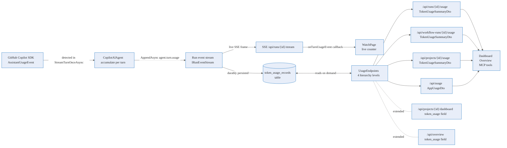

# Token usage monitoring — Deep Dive

Every GitHub Copilot model call has a cost: input tokens read, output tokens written, and a nano-AIU charge
that maps to the **AI Credits (AIC)** shown on the product dashboard. Agentweaver treats that cost data as a
**first-class run event** — an `agent.turn.usage` fact emitted after every model response, persisted before
it is visible to any consumer, and projected into four aggregation levels: individual run, workflow run,
project (time-ranged), and app-wide. Cost is not bolted on as a background batch job; it is wired into the
same event stream that drives live UI updates and durable observability.

This page explains how the data flows from model response to dashboard. For the API surface see the
[reference](../reference/token-usage.md); for the user flow see the
[user guide](../experience/token-usage-monitoring.md).

## End-to-end flow



1. **Model response arrives.** The GitHub Copilot SDK emits an `AssistantUsageEvent` inside
   `CopilotAIAgent.StreamTurnOnceAsync` / `ExecuteStreamingLoopAsync`
   (`packages/Agentweaver.AgentRuntime/CopilotAIAgent.cs`). The agent accumulates
   `inputTokens`, `outputTokens`, `totalTokens`, `totalNanoAiu`, and `modelId` from that event.

2. **`agent.turn.usage` event emitted.** After the turn completes, `CopilotAIAgent` appends an
   `agent.turn.usage` event to the run's `IRunEventStream`. The payload is:

   | Field | Type | Description |
   |---|---|---|
   | `inputTokens` | `long` | Prompt tokens for this turn |
   | `outputTokens` | `long` | Completion tokens for this turn |
   | `totalTokens` | `long` | Sum of input + output |
   | `totalNanoAiu` | `long` | Cost in nano-AIU units |
   | `modelId` | `string` | Copilot model identifier (e.g. `gpt-4o`) |

   The event type is `EventTypes.AgentTurnUsage = "agent.turn.usage"`
   (`packages/Agentweaver.Domain/EventTypes.cs`).

3. **Durability before visibility.** Per the core run-event invariant, the `IRunEventStream.AppendAsync`
   call writes the event row to the database before live subscribers see it. Live SSE clients — including the
   Watch page — receive the frame through the in-process fan-out channel after the row is committed.

4. **Background projection.** `TokenUsageProjectionService`
   (`apps/Agentweaver.Api/Runs/TokenUsageProjectionService.cs`) subscribes to active run event streams
   and writes a `TokenUsageRecord` row to `token_usage_records` on every `agent.turn.usage` event. This
   projection is separate from the event log itself, enabling efficient aggregation queries across runs,
   projects, and the entire app without scanning the raw event payload columns.

5. **Aggregation hierarchy.** `ITokenUsageStore` (`packages/Agentweaver.Domain/ITokenUsageStore.cs`)
   exposes four read methods, implemented by `SqliteTokenUsageStore`
   (`apps/Agentweaver.Api/Infrastructure/SqliteTokenUsageStore.cs`) and `EfTokenUsageStore`
   (`apps/Agentweaver.Api/Infrastructure/Ef/EfTokenUsageStore.cs`):

   | Method | Scope |
   |---|---|
   | `GetRunUsageAsync` | One run |
   | `GetWorkflowRunUsageAsync` | One workflow-run envelope (may span many child runs) |
   | `GetProjectUsageAsync` | One project, time-ranged (default: last 30 days) |
   | `GetAppUsageAsync` | Entire app, time-ranged |

6. **HTTP endpoints.** `UsageEndpoints` (`apps/Agentweaver.Api/Endpoints/UsageEndpoints.cs`) maps
   each store method to an API route. Existing dashboard and overview endpoints extend their responses with
   `token_usage` fields when the store returns data.

7. **MCP tools.** `get_run_usage` (`apps/Agentweaver.Mcp/Tools/RunTools.cs`) and
   `get_project_usage` (`apps/Agentweaver.Mcp/Tools/ProjectTools.cs`) let any MCP client query usage
   without a browser.

8. **Live Watch counter.** `WatchPage.tsx` (`apps/web/src/pages/WatchPage.tsx`) listens for
   `agent.turn.usage` SSE events via the `RunWatcher.tsx` `onTurnUsageEvent` callback and updates a live
   counter. `TokenUsagePanel.tsx` (`apps/web/src/components/TokenUsagePanel.tsx`) renders the running
   total and per-model breakdown table.

9. **Dashboard and overview.** `DashboardPage.tsx` (`apps/web/src/pages/DashboardPage.tsx`) shows a
   token/AIC section with a 7d/30d/90d time-range filter. `OverviewPage.tsx`
   (`apps/web/src/pages/OverviewPage.tsx`) shows an app-level usage section (admin-only; degrades
   gracefully on `403`).

## AIC unit and display

Agentweaver reports usage in **nano-AIU** internally. The display unit is **AIC (AI Credit)**:

```
1 AIC = 1,000,000,000 nano-AIU
display value = totalNanoAiu / 1_000_000_000  (4 decimal places)
```

This mapping means small model calls show as fractional AICs (e.g. `0.0012 AIC`) and larger agent loops
accumulate to whole credits. The 4-decimal format is the product convention set by
`TokenUsagePanel.tsx`.

## Per-model breakdown

Each `TokenUsageSummaryDto` carries a `by_model` array (`TokenUsageByModelDto[]`). A project or workflow
may use multiple models in different agents — the breakdown lets operators see which model dominates token
consumption and AIC spend. The `modelId` string comes directly from the Copilot SDK response and is not
normalized by Agentweaver, so it matches the Copilot model identifier as returned by the provider.

## Access control

| Endpoint | Who may call it |
|---|---|
| `GET /api/runs/{id}/usage` | API key owner of the run |
| `GET /api/workflow-runs/{id}/usage` | API key owner of the project |
| `GET /api/projects/{id}/usage` | API key owner of the project |
| `GET /api/usage` | Admin key only |
| Dashboard `token_usage` field | Same as `GET /api/projects/{id}/dashboard` (project owner) |
| Overview `token_usage` field | Same as `GET /api/overview` (admin; degrades on 403) |

These rules match the general API auth model: run owners see their own run data; project owners see their
project data; admins see everything. Non-admin callers of `/api/usage` receive `403 Forbidden`.

## Source

| Concern | File |
|---|---|
| `agent.turn.usage` event type | `packages/Agentweaver.Domain/EventTypes.cs` |
| Token accumulation and event emission | `packages/Agentweaver.AgentRuntime/CopilotAIAgent.cs` |
| Domain types: `TokenUsageRecord`, `TokenUsageSummary`, `TokenUsageByModel`, `TokenUsageByProject` | `packages/Agentweaver.Domain/ITokenUsageStore.cs` |
| SQLite projection store | `apps/Agentweaver.Api/Infrastructure/SqliteTokenUsageStore.cs` |
| EF Core / Postgres projection store | `apps/Agentweaver.Api/Infrastructure/Ef/EfTokenUsageStore.cs` |
| `token_usage_records` schema | `apps/Agentweaver.Api/Infrastructure/SqliteDb.cs` |
| Background projection service (subscribes to event streams) | `apps/Agentweaver.Api/Runs/TokenUsageProjectionService.cs` |
| HTTP endpoints (all 4 levels) | `apps/Agentweaver.Api/Endpoints/UsageEndpoints.cs` |
| DTOs (`TokenUsageSummaryDto`, `TokenUsageByModelDto`, `AppUsageDto`, `ProjectUsageDto`) | `apps/Agentweaver.Api/Metrics/MetricsDtos.cs` |
| MCP `get_run_usage` tool | `apps/Agentweaver.Mcp/Tools/RunTools.cs` |
| MCP `get_project_usage` tool | `apps/Agentweaver.Mcp/Tools/ProjectTools.cs` |
| Live token counter (Watch page) | `apps/web/src/pages/WatchPage.tsx` |
| SSE event wiring (`onTurnUsageEvent`) | `apps/web/src/pages/RunWatcher.tsx` |
| Reusable `TokenUsagePanel` component | `apps/web/src/components/TokenUsagePanel.tsx` |
| Dashboard token/AIC section | `apps/web/src/pages/DashboardPage.tsx` |
| Overview app-level usage section | `apps/web/src/pages/OverviewPage.tsx` |

## See also

- [Token usage — Reference](../reference/token-usage.md) — endpoints, DTOs, status codes, MCP tools.
- [Token usage monitoring — User Guide](../experience/token-usage-monitoring.md) — watch counter, dashboard section, overview.
- [Events & observability](./events-observability.md) — the run event stream and SSE architecture.
- [Data & persistence](./data-persistence.md) — database architecture and the SQLite control-plane schema.
