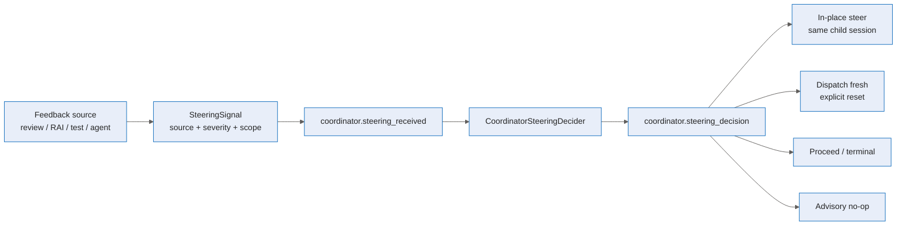

# Unified autonomous steering — Deep Dive

Unified autonomous steering replaces hidden gate-specific correction paths with one coordinator-owned routing mechanism. Human review, RAI, Rubberduck, Build & Test, agent-originated guidance, coordinator-originated guidance, and workflow-step feedback all normalize to a `SteeringSignal`. The coordinator then records a conscious decision before any action executes.

For event payloads and routes, see the [reference](../reference/unified-steering.md). For the operator workflow, see the [experience guide](../experience/unified-steering.md).

## Mental model

The key invariant is visibility before effect. `CoordinatorSteeringService.SubmitSteeringAsync` persists and queues the signal, emits `coordinator.steering_received`, and does not execute recovery or reset any subtask (`apps/Agentweaver.Api/Coordinator/CoordinatorSteeringService.cs:484`). `CoordinatorSteeringDecider.DecideAsync` then records the action and emits `coordinator.steering_decision` before in-place steering or fresh dispatch runs (`apps/Agentweaver.Api/Coordinator/CoordinatorSteeringDecider.cs:105`, `:201`).

There is no feature flag. Unified steering is the behavior in the assembly path.

## One signal shape

`SteeringSignal` is the normalized envelope for all correction feedback (`apps/Agentweaver.Api/Coordinator/SteeringSignal.cs:8`). It carries:

- `source`: `human-review`, `rai`, `rubberduck`, `build-test`, `agent`, `coordinator`, or `step`;
- `severity`: `advisory`, `request-changes`, or `blocking`;
- target scope: run, work plan, subtask ids, and optional child run id;
- feedback text;
- optional tree hash and explicit file hints.

Feedback text is reasoning context, not a routing heuristic. The old behavior that parsed prose and automatically reset subtasks is no longer the gate path.

## Coordinator choices

The coordinator chooses among four directions (`SteeringSignal.cs:129`):

| Direction | User-facing effect |
| --- | --- |
| `in_place_steer` | Resume the existing child run as a revision turn, preserving session, worktree, and context. |
| `dispatch_fresh` | Reset selected subtasks and launch fresh child runs. This is explicit, logged, and visible. |
| `proceed` | Proceed toward review or a terminal/blocked state. |
| `advisory` | Surface the signal and take no action. |

The shipped deterministic fallback policy prefers advisory no-op for advisory signals, proceeds when budgets are exhausted or feedback is blocking/stale, steers in place when the target is resumable, and dispatches fresh only when request-changes feedback targets a non-resumable path (`apps/Agentweaver.Api/Coordinator/CoordinatorSteeringDecider.cs:31`).

## Assembly gate integration

Assembly gate request-changes no longer calls a separate assembly-gate reset route. `RouteAssemblyGateThroughSteeringAsync` stamps `assembly_steering`, submits the signal, claims it for the inline decider, and then executes the chosen direction (`apps/Agentweaver.Api/Coordinator/CoordinatorAssemblyService.cs:1680`).

- **A: in-place steer.** `ExecuteInPlaceSteerAsync` resumes the existing child run with `RunOrchestrator.StartRevisionAsync`, keeps the `ChildRunId`, and returns the plan to dispatching so the resumed child can finish (`CoordinatorAssemblyService.cs:1810`).
- **B: dispatch fresh.** Only after a `dispatch_fresh` decision event, the coordinator calls the reset/re-dispatch path (`CoordinatorAssemblyService.cs:1751`).
- **C: proceed.** Budget exhaustion records `assembly_blocked` with reason `steering_budget_exhausted` (`CoordinatorAssemblyService.cs:1770`).
- **D: advisory.** The assembly stage is restored and the gate loop continues (`CoordinatorAssemblyService.cs:1795`).

The assembly decision lease is recoverable. `AssemblySteering` routes back to assembly recovery rather than dispatch, and the reconciler scans it as an assembly state (`apps/Agentweaver.Api/Coordinator/CoordinatorRecoveryRouter.cs:55`, `apps/Agentweaver.Api/Coordinator/CoordinatorReconciler.cs:128`).

## Loop bounds and idempotency

Steering cannot loop forever:

- per-subtask recovery attempts are capped at `CoordinatorSteeringService.MaxRecoveryAttempts = 3` (`CoordinatorSteeringService.cs:811`);
- per-plan steering iterations default to `6` (`CoordinatorSteeringDecider.cs:81`).

The decider increments the budget exactly once for in-place or fresh-dispatch actions and degrades to `proceed` when the cap is reached (`CoordinatorSteeringDecider.cs:164`). In-place steering uses attempt-specific revision effect records, so recovery can prove whether the revision actually ran before re-driving or marking the directive applied (`CoordinatorSteeringDecider.cs:219`).

## Source

| Concern | File |
| --- | --- |
| Steering signal schema and directions | `apps/Agentweaver.Api/Coordinator/SteeringSignal.cs` |
| Unified steering submission and received event | `apps/Agentweaver.Api/Coordinator/CoordinatorSteeringService.cs` |
| Coordinator decision policy, budgets, decision event | `apps/Agentweaver.Api/Coordinator/CoordinatorSteeringDecider.cs` |
| Assembly gate steering-only routing | `apps/Agentweaver.Api/Coordinator/CoordinatorAssemblyService.cs` |
| Recovery routing for `assembly_steering` | `apps/Agentweaver.Api/Coordinator/CoordinatorRecoveryRouter.cs`, `CoordinatorReconciler.cs` |
| Event type constants | `packages/Agentweaver.Domain/EventTypes.cs` |
| Timeline rendering | `apps/web/src/components/LifecycleEventCard.tsx` |

## See also

- [Unified autonomous steering — Reference](../reference/unified-steering.md)
- [Unified autonomous steering — User Guide](../experience/unified-steering.md)
- [Coordinator internals](./coordinator-internals.md)
- [Events & observability](./events-observability.md)
