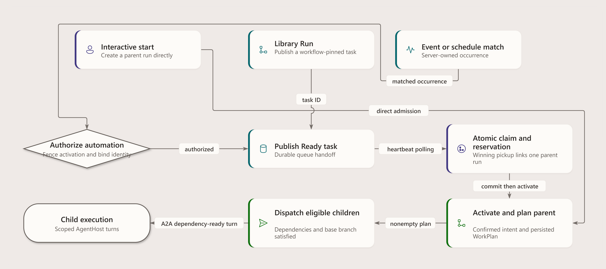

# Workflow Engine — Conceptual Deep Dive

## Purpose & Mental Model

Agentweaver workflows answer one question: **which execution process should move an agent run from intent to a reviewed outcome?**

The workflow engine is the policy layer between orchestration and runtime execution. The coordinator decides what the team should accomplish. The workflow engine decides which gates, loops, and terminal paths govern the run that carries out that work.

Conceptually, a workflow engine has five jobs:

1. **Define** reusable process graphs as declarative workflow templates.
2. **Discover** built-in, catalog, and project-authored workflow definitions.
3. **Track** invocation context and automation metadata so runs carry the right operational context without changing workflow validity.
4. **Select** the best process fit when several workflows are available.
5. **Bind** the selected definition to real runtime executors, failing closed if any node or edge cannot run safely.

A useful rebuilding rule is: **workflows are declarative policy graphs; binding is the safety boundary that turns policy into execution.**

The executor chain shown is the built-in default, not every workflow. Checkpoints use `ICheckpointStoreFactory`: PostgreSQL-backed shared storage for the PostgreSQL provider, file storage for local/default configuration (`apps/Agentweaver.Api/Program.cs:1063–1065`; `apps/Agentweaver.Api/Runs/RunWorkflowFactory.cs:181–188`). Pending human decisions are durable records, not browser-local state.

Workflows are one half of run orchestration. The coordinator and run lifecycle are covered in [orchestration.md](orchestration.md); the focus here is how workflow definitions are authored, generated, selected, and bound.

## Core Design Invariants

These invariants are the backbone of the workflow engine:

- **Definitions are data, not code.** YAML describes nodes, edges, and metadata. It does not execute directly.
- **Discovery is server-side.** Clients list, render, and edit workflows, but loading, validation, selection, and binding happen in the API.
- **Trigger evaluation and workflow execution are separate concerns.** A workflow definition may declare a trigger, but trigger verification/filtering happens before the workflow is selected and bound.
- **Overrides cannot bypass safety.** A requested workflow id is honored only if it resolves, validates, and binds.
- **Selection is bounded model authority.** The selector may choose among already-safe candidates; it may not invent ids or bypass availability and validation checks.
- **Binding fails closed.** A node type, gate, or edge with no known executor mapping aborts the build instead of becoming a no-op.
- **Gates belong to workflow definitions.** Effective workflow resolution does not inject a configurable project review policy; the binder checks the declared graph.
- **A built-in default is always available.** The default workflow is embedded in code and serves projects that ship no workflow files of their own, so every project has a valid workflow to run.

## Workflow Template as Policy Graph

### What a Workflow Template Is

A workflow template is a declarative graph with:

- a stable `id`,
- a human-readable `name` and optional `description` / `version`,
- a `start` node,
- typed `nodes`,
- directed `edges`,
- optional board `stages`,
- and node metadata used for rendering and execution context.

The key abstraction is that a workflow describes **what process should happen**, not the hidden plumbing required to execute it. A single logical edge such as `rai -> review when review` may expand into adapters, state storage, predicates, review ports, and graph outputs when bound to the runtime.

The loader validates the static shape first: required fields, valid node type, unique node ids, known edge endpoints, check branches with matching outgoing edges, and valid references from structured node fields.

The binder then validates runtime bindability. This second phase matters because the schema can represent graph concepts before the live executor graph has executor support for them.

### Node Types

Agentweaver's workflow schema models these conceptual node types:

- **prompt** — an agent turn that produces work or analysis.
- **publish** — an agent-backed action classified as `NodeKind.Agent`, not the deterministic GitHub PR executor (`apps/Agentweaver.Api/Workflows/NodeClassifier.cs:78`).
- **peer_review** — an AI review turn that can emit approval, change request, decline, pass, or fail verdicts.
- **build_test** — the platform-owned Build & Test gate. It runs the canonical build/test/preview instruction, emits `approved`, `request-changes`, or `declined`, and should sit after any RAI safety gate and before human review for software workflows. In `Sandbox:AgentExecutionMode=pod-per-run`, assembly Build & Test first launches a dedicated AgentHost pod for the coordinator run and configures it with the detached integration worktree as its working directory, so the gate and any `start_preview` server run from the same assembled tree.
- **check** — a routing gate with declared branches. Known gate kinds include `rai`, `human-review`, and `rubberduck`.
- **merge** — an action that applies produced changes.
- **open_pull_request** — a platform-owned deterministic action, not an LLM turn. It invokes the PR client with configured `title`, `body`, `base`, `head`, and `draft` fields; templates support `{run_id}`, `{worktree_branch}`, `{originating_branch}`, and `{outcome_summary}`. It can follow an agent turn or a supported approval/merge transition. Successful publication emits the PR number/url; ordinary validation, credential, and client errors emit a failed step while passing the produced `AgentTurnOutput` onward unchanged. Cancellation is rethrown rather than swallowed (`packages/Agentweaver.AgentRuntime/Workflow/OpenPullRequestTurnExecutor.cs:88–166`). Do not equate one client invocation with a guaranteed single network request.
- **scribe** — a recording step that captures the outcome.
- **terminal** — an explicit sink such as done, declined, or safety failed.
- **fan_out**, **fan_in**, **serial**, **coordinator_composed** — schema-level extension points for richer topologies.

Runtime binding supports prompt/publish agent turns, peer-review, `build_test`, `open_pull_request`, check gates with known gate kinds, merge, scribe, terminal sinks, and a set of sequential / review / direct-completion topologies. Extension node types remain explicit schema concepts; until executors bind them, the runtime fails closed.

An `open_pull_request` node binds from a producing `prompt` node directly, or from a `peer_review`/`build_test` gate's `approved`/`pass` verdict (mirroring the existing gate → merge transition), and forwards into `scribe` exactly like an agent turn does:

```yaml
nodes:
  - id: implement
    type: prompt
    agent: worker
    prompt: "Implement the requested change."
  - id: build-test
    type: build_test
  - id: open-pr
    type: open_pull_request
    title: "Agentweaver: {outcome_summary}"
    body: "Automated changes from run `{run_id}` on `{worktree_branch}`."
    base: main
  - id: record
    type: scribe
edges:
  - from: implement
    to: build-test
  - from: build-test
    to: open-pr
    when: approved
  - from: open-pr
    to: record
```

### Software assembly gate order

Authored assembly gates are ordered using a breadth-first traversal from `start` over unconditional edges and verdict edges whose `when` is `approved`, `pass`, or `review`. The resolver selects known check/Build & Test nodes, sorts them by that traversal index (unvisited gates sort last, in declaration order), projects canonical assembly stages (`rai`, `build-test`, `rubberduck`, `human-review`), and deduplicates by stage. For non-code-producing work, the platform Build & Test gate is omitted (`apps/Agentweaver.Api/Coordinator/CoordinatorAssemblyService.cs:1586–1676`). This is aggregate gate projection, not execution of every workflow node by the assembly service.

For the built-in software workflows this means RAI runs before Build & Test, even if a YAML author groups node declarations differently. `bug-fix` follows `triage -> fix -> verify -> rai-check -> build-test -> human-review`; `software-delivery` follows `plan -> implement -> test-gate -> rai-check -> rubberduck -> code-review -> build-test -> review-gate` (`packages/Agentweaver.Squad/Catalog/Resources/workflows/bug_fix.yaml`, `software_delivery.yaml`). Copilot workflow and blueprint generation prompts carry the same rule so generated software workflows place `build_test` after any RAI gate and immediately before human review (`apps/Agentweaver.Api/Workflows/WorkflowGatePromptGuidance.cs:7`, `apps/Agentweaver.Api/Workflows/CopilotWorkflowGenerator.cs:243`, `apps/Agentweaver.Api/Blueprints/CopilotBlueprintGenerator.cs:152`).

Build & Test infrastructure failures are not authored `request-changes` verdicts. Pod capacity, launch/readiness, endpoint-resolution, and A2A transport failures are raised as typed infrastructure exceptions, then parked as retryable `assembly_blocked` reasons or failed terminally for non-retryable configuration errors (`apps/Agentweaver.Api/Coordinator/CoordinatorAssemblyService.cs:1039–1043`, `:3559–3632`). The emitted event payload includes `detail`, `exceptionMessage`, `innerExceptionMessage`, `innerExceptionType`, and `infrastructureReason`, so operators can distinguish a quota park from an AgentHost launch or A2A transport root cause.

### The Default Workflow

The default workflow encodes the standard standalone run pipeline. Its canonical source is the code-embedded `DefaultWorkflowTemplate` (id `default`), loaded once through the real loader as `BuiltInWorkflows.Default`. `DefaultWorkflowTemplate.TryMaterialize` can write an inspectable project copy at `.agentweaver/workflows/default.yaml`; customization requires a new workflow id because the registry skips a materialized `default`. The current success path is `agent -> rai -> review -> merge -> push-pr -> scribe -> done`, with separate safety-failed and declined sinks (`apps/Agentweaver.Api/Workflows/DefaultWorkflowTemplate.cs:42–161`).

This default produces work, applies Responsible AI safety review, pauses for human review when required, merges if approved, attempts PR publication, and records the outcome. Its RAI routing distinguishes no-change, revision, human-review and safety-failed paths; it must not be confused with collective assembly, where RAI RED opens durable human review. The loops are part of the workflow, not exceptional control flow.

## Role Slots, Catalog Roles, and Bespoke Charters

Workflow nodes carry two different kinds of "role" information:

1. **Workflow role slots** describe the node's place in the graph or UI lane: `agent`, `review`, `merge`, `scribe`, `plumbing`, and similar labels.
2. **Catalog or bespoke execution roles** identify who should perform a node when a real agent identity is needed.

Do not collapse these into one concept. A node with `role: review` is in a review lane; it is not automatically a catalog role named `review`. A peer-review node names a concrete reviewer with `agent: qa-engineer` when it needs that agent. A generated or project-authored node carries an inline `charter` when no catalog role fits.

The runtime uses explicit node fields and run context to build the agent prompt. Catalog roles are preferred because their charters are already known to the casting system. Bespoke charters are a controlled escape hatch for generated workflows whose process needs a role outside the catalog.

Execution context is node-specific, not one universal precedence chain. Generic prompt/publish nodes pass `charter` and `prompt` into `AgentTurnExecutor` while retaining the run's assigned identity; this binding does not pass `node.Agent`. Peer-review nodes pass both `agent` and `charter` to `RubberduckTurnExecutor`; Build & Test passes `agent` to its platform executor (`apps/Agentweaver.Api/Runs/RunWorkflowFactory.cs:935–1006`). `role` and `kind` remain graph/render metadata and do not select the executing agent.

## Discovery, Validation, and Registry

### Source Precedence

For a project, `WorkflowRegistry.Build` assembles a `ProjectWorkflowSet` from:

1. the built-in default workflow (`BuiltInWorkflows.Default`, from `DefaultWorkflowTemplate`),
2. conformance-checked catalog library workflows from `CatalogConformanceSnapshot`,
3. project-authored `.yaml` / `.yml` files under `.agentweaver/workflows/` (`WorkflowRegistry.WorkflowsRelativePath`).

The result is cached per project in `WorkflowRegistry.GetOrLoad`. Each cache entry is keyed by a signature of the project's top-level workflow YAML files plus the project's allowed workflow id set, so a replica refreshes its local cache when shared project files or blueprint restrictions change. `WorkflowRegistry.Sync` still provides the explicit user-facing refresh path and rebuilds from disk; validation errors are cached as registry results for replica coherence. Invalid workflows remain visible in `ProjectWorkflowSet.Results` with their errors, but `ProjectWorkflowSet.Available` excludes them.

The built-in default is always available. Catalog workflows are available without project-local files. A blueprint may restrict the allowed workflow ids for a project via `Project.AllowedWorkflowIds`; `WorkflowRegistry.FilterByAllowedSet` keeps only allowed ids **plus** the built-in `default`, which is always retained so a project never has zero workflows. An empty/absent allowed set means all workflows are returned (backward compatible).

Reserved ids are protected. A loaded project definition with id `default` is silently skipped as a materialized copy; other reserved catalog ids produce conflicts rather than overrides (`WorkflowRegistry.cs:183–203`). Duplicate ids are resolved deterministically in `WorkflowRegistry.AddResult`: among built-in/catalog collisions the higher semantic `Version` wins (ties keep the first-loaded source); among project files the first valid file wins and later duplicates are invalid load results. Source categories are therefore not an override-precedence hierarchy.

### Validation Layers

Validation happens in layers:

1. **YAML parse** — `WorkflowDefinitionLoader.Load` turns malformed YAML into a file-scoped invalid result.
2. **Schema mapping** — node type, start node, edge endpoints, branches, and references are checked.
3. **Bindability dry-run** — `WorkflowRegistry.ValidateBindable` runs `RunWorkflowGraphBinder.GetBindabilityErrors` to check whether every node and transition can map to real executor wiring.
4. **Runtime resolution and binding** — the effective workflow is resolved again and its declared graph is bound before execution.

This layered design lets the UI show useful authoring errors while preserving runtime safety.

## Invocation Context

`RunOrigin` describes how a run began. Backlog pickup records `RunOrigin.BacklogPickup`; manually started and child runs have their own origin/responsibility context. The selector does not convert this into a separate invocation-kind eligibility filter (`apps/Agentweaver.Api/Coordinator/CoordinatorOrchestratorExecutor.cs:297–300`). There is no current `WorkflowInvocationKind` / `ResolveInvocationKindAsync` API.

Event and schedule automation are implemented upstream producers, not future selector modes. A matching trigger must obtain or recover an authorized automation invocation before the Ready task is published with a workflow pin (`apps/Agentweaver.Api/Workflows/WorkflowEventTriggerService.cs:59–116`; `WorkflowScheduleTriggerService.cs:145–199`). Manual starts and heartbeat pickup use the same normally available workflow set.

All valid workflows in the project's available set are candidates. A backlog task can carry a `WorkflowOverrideId`. The override is honored only if the workflow exists, is valid, and can bind safely. Otherwise the system logs the mismatch and continues with normal selection or safe fallback behavior.

Rebuild guidance: keep origin, trigger authorization, and workflow selection separate. See [selection](workflow-selection.md) for override precedence and post-decomposition compatibility; do not treat an invalid requested id as executable.

## Event Trigger Evaluation Pipeline

Event-triggered workflows add a narrow routing layer in front of the normal backlog → coordinator
pickup path. The trigger mechanism is intentionally small:

1. `POST /api/github/webhooks/repo-app` bounds the raw body and verification time;
2. the endpoint verifies the configured Repo App HMAC keys (including rotation) **before** JSON
   deserialization, lifecycle routing, or predicate evaluation;
3. installation/repository lifecycle processing resolves connected active projects and derives event names:
   `github.<event>` and, when GitHub sent an action, `github.<event>.<action>`;
4. `WorkflowEventTriggerService` scans valid workflows' event declarations, evaluates `if:` predicates,
   and claims or recovers an authorized automation invocation before publishing matching Ready tasks;
5. the coordinator heartbeat claims those Ready tasks through the same accountable path as schedule
   triggers and manual backlog work.

That ordering is the trust boundary: unsigned or badly signed deliveries never reach predicate
evaluation, backlog creation, or prompt assembly.

Source: `apps/Agentweaver.Api/Endpoints/GitHubWebhookEndpoints.cs:14–135` and `apps/Agentweaver.Api/Workflows/WorkflowEventTriggerService.cs:59–116`.

### Curated predicate DSL

The event trigger DSL is deliberately **not** a general expression language. It supports:

- `hasLabel`
- `isNotLabeledWith`
- `baseBranch`
- `reviewState`
- `ref`
- `category`
- `commentMatches`
- `or`
- `not`

Sibling entries in `trigger.if` are ANDed by default. `or` and `not` provide the only compound
logic. Predicate support is event-specific (`reviewState` only for `pull_request_review`, `ref` only
for `push`, and so on), and invalid event/predicate combinations are rejected when the workflow is
loaded rather than silently ignored at runtime.

### `commentMatches` privacy and ReDoS boundary

`commentMatches` is the only predicate that inspects raw user-authored text, so it has an explicit
security boundary:

- the only raw text admitted is the verified `comment.body` string from the GitHub payload;
- the pattern is fixed in saved workflow configuration — not generated dynamically from the incoming
  comment;
- the pattern is validated against a restricted safe subset before the workflow is accepted;
- runtime matching uses `.NET`'s non-backtracking regex engine plus a hard 200 ms match timeout;
- match failures, compile errors, and timeouts fail closed to “no match”;
- only the boolean match result crosses into workflow firing — Agentweaver does not log, persist, or
  forward the raw comment body into backlog task text or downstream prompts.

This keeps comment-command workflows possible without widening the rest of the engine into a
free-form text processing surface.

Use snake_case in YAML and camelCase in the structured trigger API/UI. For example:

```yaml
trigger:
  type: event
  event_name: github.issue_comment.created
  if:
    - comment_matches: { pattern: "^/agentweaver:triage$" }
    - not:
        or:
          - has_label: { label: "ignore-bot" }
          - comment_matches: { pattern: "^/agentweaver:skip$" }
```
## Workflow Library and Generation

### Catalog Library

The catalog library provides reusable functional processes, with only conformance-checked definitions entering normal selection. A blueprint can restrict workflow ids and set a default.

The library is process-oriented. Workflow selection compares process steps and expected outputs rather than matching names. Inspect the current registry rather than assuming a fixed catalog count or that a retired id remains selectable.

### Workflow Generation

Workflow generation turns a natural-language process request into an unsaved YAML draft.

Generation has these rules:

- The prompt is built server-side.
- The user's description is fenced as untrusted data.
- The prompt includes the schema, supported runtime node vocabulary, validation rules, available project roles, and few-shot examples.
- Output is cleaned for accidental Markdown fences.
- If the model omits an id, a kebab-case id is derived from the description.
- The generator validates with the same loader and binder dry-run used by runtime authoring paths.
- Exactly one correction pass is allowed.
- The result is a draft; it is not written to `.agentweaver/workflows/` until a save/apply path persists it.

Trigger-aware generation extends that same flow rather than introducing a separate side channel. Both
create-mode and edit-mode prompts teach the model:

- the schedule trigger schema (`daily` / `weekly` / `monthly`, UTC `time_of_day`, weekly
  `day_of_week`, monthly `day_of_month`);
- the curated GitHub event shortlist (`issues`, `issue_comment`, `pull_request`,
  `pull_request_review`, `push`, `release`, `discussion`);
- the structured predicate vocabulary and boolean wrappers (`or`, `not`);
- a few-shot set of natural-language trigger examples such as label-driven issue triage, weekly
  schedules, and exact comment commands.

The output still goes through the same loader and binder gate as any other generated workflow. A bad
event name, malformed predicate, or unsafe `commentMatches` pattern triggers the single correction
pass; if the corrected draft is still invalid, generation fails closed instead of saving a broken
trigger.

Blueprint generation can also invoke workflow generation when no library workflow is a good process fit. Applying that blueprint writes the generated workflow file, syncs the registry, and makes the workflow selectable.

## Selection Logic

Workflow selection chooses a process for a task. It runs inside `CoordinatorOrchestratorExecutor.SelectWorkflowAsync` and is intentionally conservative: deterministic rules narrow the space first (registry ordering, availability, overrides), and `WorkflowSelector.SelectAsync` only chooses among 2+ available definitions.

The selector prompt asks for process fit:

- Match on the steps the workflow runs and the output it produces.
- Do not choose by name similarity or domain-word overlap.
- Prefer project/custom workflows when they perform the requested process.
- If nothing fits, select the first listed workflow, which is the project default.

The requested model response is JSON with a `selected` workflow id and short `rationale`. Candidate matching also accepts normalized ids/display names and supported string/prose forms; unusable responses get one retry before deterministic fallback. The selector prefers available `default`/`standard` fallback definitions, while the coordinator's outer exception fallback uses its resolved project default. See [workflow selection](workflow-selection.md) for these distinct rules and post-decomposition Build & Test compatibility.

### Overrides

There are three override channels, checked before automatic singleton handling:

- **Request/dialog override** — `CoordinatorDraftInput.WorkflowOverrideId`, checked before the backlog-task pin. An unavailable dialog value continues normal selection without falling back to that pin.

- **Backlog task override** — `BacklogTask.WorkflowOverrideId`, persisted on the task before it is claimed. `CoordinatorPickupService` prepends `use {id}` to the goal at pickup, and `SelectWorkflowAsync` also resolves the override id directly against the registry and available set.
- **Conversational override** — revision feedback `use {workflow-id}` is parsed before the candidate-count shortcut and used when available. Available request, backlog, and conversational choices emit selection events even with one candidate.

An explicit override wins only inside the candidate safety boundary. It does not let a user or backlog item execute a workflow that the registry cannot resolve or that cannot bind safely.

### Selection vs Runtime Resolution

The coordinator persists the selected workflow id on its WorkPlan for decomposition and collective assembly. Standalone run graph construction independently resolves a backlog-task override or the project default and binds that definition; it does not compose a review policy or read the coordinator's selected WorkPlan as its override source (`apps/Agentweaver.Api/Runs/RunWorkflowFactory.cs:1495–1558`). Child graphs take the separate trimmed path. These are different resolution responsibilities, not a promise that every run replays the selector's exact result.

## Binding Declarative Nodes to Runtime Execution

Binding is where a workflow stops being YAML and becomes an executable graph.

The binder:

1. classifies each node by `type` and, for gates, `gate_kind`;
2. resolves the node to a known executor kind;
3. expands every logical edge into concrete executor wiring and predicates;
4. wires terminal outputs from incoming edge semantics;
5. preserves hidden plumbing such as adapters and stored merge data;
6. fails closed when a node or transition has no mapping.

The binder resolves by node type, not by hardcoded ids. A workflow can rename `agent`, `rai`, `review`, `merge`, and `scribe` and still bind if the node types and gate kinds describe the same process. This is what lets library and generated workflows use meaningful node ids while preserving the same runtime semantics.

### Canonical Transition Families

The default family includes:

- agent work into RAI,
- RAI revision back to agent,
- RAI safety failure to terminal,
- RAI no-change to scribe,
- RAI review path to human review,
- human approval to merge,
- human change request back to agent,
- human decline to terminal,
- merge completion to PR publication and then scribe in the current default (direct merge-to-scribe remains a supported family),
- merge blocked back to review,
- scribe to done.

Catalog-style workflows add supported generic families:

- sequential agent turns,
- agent output into peer review,
- peer-review pass or approval into merge / RAI / a subsequent agent turn,
- peer-review fail or request-changes back to an agent,
- direct agent or review completion through scribe,
- merge blocked back into peer review or an agent.

Anything outside supported transition families is not "best effort." It is a binding error.

### Workflow-declared gates, not a project policy overlay

Author required gates in the workflow nodes and edges. Effective resolution returns the validated workflow without a separate policy-composition pass (`apps/Agentweaver.Api/Runs/RunWorkflowFactory.cs:1495–1517`). Blueprint validation accepts only `review_policy: default` (`apps/Agentweaver.Api/Blueprints/BlueprintService.cs:113–115`). There is no configurable project review-policy registry here.

Policy-prefixed adapters retained in `RunWorkflowFactory` are executor plumbing for declared gate transitions; their names do not establish a live composer. An unsupported declared gate or edge fails binding instead of becoming optional.

## Relationship to Runs and Coordinator Work

A workflow is selected at the point where a run needs an execution process. Different run origins use the same concepts but have different responsibility boundaries:

- **Manual run** — an explicit start.
- **Backlog pickup coordinator run** — a heartbeat-started run with durable `RunOrigin.BacklogPickup`.
- **Scheduled or event-driven automation** — implemented trigger producers publish authorized, workflow-pinned Ready backlog tasks; normal pickup starts the coordinator.
- **Coordinator parent run** — owns planning, assembly, review, merge, and scribe for coordinated work.
- **Coordinator child run** — uses a trimmed child pipeline in an isolated working tree: agent work terminating at assemble-ready or a typed failure terminal. It does not perform per-child RAI, human review, merge, or scribe independently. Dependency outputs are merged forward through the coordinator integration branch before dependent children launch.

The important boundary is that workflows govern run gates, while the coordinator owns intent, decomposition, dependency frontiers, and assembly. A child run can produce a safe piece of work; the parent workflow decides how the assembled result is reviewed and merged.

See [orchestration.md](orchestration.md) for the broader run lifecycle and coordinator model.

## Extension Points and Gotchas

- **Do not execute by id alone.** Workflow ids identify definitions; node types and edge semantics determine bindability.
- **Unattended pickup is governed outside the workflow YAML.** Use project settings and automation rules to decide when a workflow should start automatically.
- **Keep generated examples bindable.** A generator that teaches unsupported node types will produce attractive but unrunnable YAML.
- **Role metadata can be misleading.** Distinguish render lanes from concrete catalog agent ids and inline charters.
- **Peer review must be verdict-routed.** A `peer_review` node needs verdict-labeled outgoing edges; otherwise bindability validation rejects it instead of guessing how to route it.
- **Terminal nodes are resolved by incoming semantics.** Renaming `done` is fine; losing the scribe-sourced or verdict-sourced incoming edge is not.
- **Registry sync matters.** Saving a file should be followed by an explicit sync for immediate feedback; other replicas refresh when they observe the changed shared-file signature.
- **Workflow gates are explicit.** Do not infer a configurable review-policy overlay from legacy adapter names.
- **Selection and binding have separate responsibilities.** Coordinator topology is persisted on the WorkPlan; standalone graph resolution and trimmed child graphs follow their own paths.

## Rebuilding Blueprint

If you were rebuilding the workflow engine from scratch, implement it in this order:

1. Define the workflow schema: start, typed nodes, edges, branches, and metadata.
2. Write a loader that returns valid and invalid load results without crashing the whole set.
3. Embed a built-in default workflow and parse it through the same loader as user files.
4. Build a registry that discovers built-in, catalog, and project workflows, caches per project with a shared-file signature, and syncs explicitly.
5. Add invocation-context tracking and keep it separate from candidate availability.
6. Add bindability validation that rejects unsupported node types and transitions before runtime.
7. Implement node classification by type and gate kind, never by fixed ids.
8. Implement edge expansion from `(from kind, to kind, when)` to concrete executor wiring.
9. Keep authored review gates explicit and validate every gate transition before binding.
10. Add default and override resolution that revalidates availability and bindability.
11. Add process-fit selection among available candidates with deterministic fallback.
12. Add generation as a draft-only server-side prompt + validation + one correction pass.
13. Surface graph descriptors and workflow-selected events for clients, but keep clients out of selection and binding.
14. Add recovery tests that prove renamed nodes, invalid edges, invalid overrides, and unsupported types fail safely.

The central design principle is simple: **load workflows as data, select among valid available process graphs, bind every edge to real executors, and fail closed whenever policy cannot be proven executable.**

## Where this lives

- `apps/Agentweaver.Api/Workflows/`
- `apps/Agentweaver.Api/Coordinator/WorkflowSelector.cs`
- `apps/Agentweaver.Api/Coordinator/CoordinatorOrchestratorExecutor.cs`
- `apps/Agentweaver.Api/Runs/RunWorkflowFactory.cs`
- `packages/Agentweaver.Squad/Catalog/Resources/workflows/`
- `docs/workflow-binder.md`
- `docs/workflow-generation.md`
- `docs/workflow-library.md`
- `docs/workflow-selection.md`

<details id="diagram-context-canonical-default-workflow">
<summary>Diagram details and constraints</summary>
<table><thead><tr><th>Element</th><th>Contract</th></tr></thead><tbody>
<tr><td>title</td><td>Generic default workflow</td></tr>
<tr><td>subtitle</td><td>Built-in template • merge → PR publication → Scribe</td></tr>
<tr><td>returns-heading</td><td>SOURCE / RETURN</td></tr>
<tr><td>outcomes-heading</td><td>OUTCOMES</td></tr>
<tr><td>footer</td><td>PR action can skip / fail and still reach Scribe. No-changes also reaches Scribe.</td></tr>
<tr><td>Agent work</td><td>Agent</td></tr>
<tr><td>Agent work</td><td>Agent task</td></tr>
<tr><td>Agent work</td><td>agent</td></tr>
<tr><td>RAI gate</td><td>Rai</td></tr>
<tr><td>RAI gate</td><td>Verdict routing</td></tr>
<tr><td>RAI gate</td><td>rai</td></tr>
<tr><td>Human review</td><td>Review</td></tr>
<tr><td>Human review</td><td>human-review</td></tr>
<tr><td>Merge</td><td>Merge</td></tr>
<tr><td>Merge</td><td>Merge outcome routing</td></tr>
<tr><td>Merge</td><td>merge</td></tr>
<tr><td>Publish / reuse PR</td><td>Publish / reuse PR</td></tr>
<tr><td>Publish / reuse PR</td><td>Create / reuse; not git push</td></tr>
<tr><td>Publish / reuse PR</td><td>action</td></tr>
<tr><td>Scribe</td><td>Scribe</td></tr>
<tr><td>Scribe</td><td>Record the run outcome</td></tr>
<tr><td>Scribe</td><td>scribe</td></tr>
<tr><td>Safety failed</td><td>Safety failed</td></tr>
<tr><td>Safety failed</td><td>Workflow endpoint</td></tr>
<tr><td>Declined</td><td>Declined</td></tr>
<tr><td>Done</td><td>Done</td></tr>
<tr><td>edge-02-label</td><td>revise</td></tr>
<tr><td>edge-03-label</td><td>safety- failed</td></tr>
<tr><td>edge-04-label</td><td>no- changes</td></tr>
<tr><td>edge-05-label</td><td>review</td></tr>
<tr><td>edge-06-label</td><td>approved</td></tr>
<tr><td>edge-07-label</td><td>request-changes</td></tr>
<tr><td>edge-08-label</td><td>declined</td></tr>
<tr><td>edge-09-label</td><td>merged</td></tr>
<tr><td>edge-10-label</td><td>blocked</td></tr>
</tbody></table>
</details>

<details id="diagram-context-canonical-workflow-invocation" v-pre>
<summary>Diagram details and constraints</summary>
<table><thead><tr><th>Element</th><th>Contract</th></tr></thead><tbody>
<tr><td>title</td><td>How work enters the coordinator</td></tr>
<tr><td>takeaway</td><td>Origin produces work; it does not filter the set of selectable workflows.</td></tr>
<tr><td>group-title-0</td><td>ORIGIN CHANNELS</td></tr>
<tr><td>group-title-1</td><td>AUTOMATION ADMISSION AND DURABLE WORK</td></tr>
<tr><td>group-title-2</td><td>PICKUP, CONFIRMATION AND SELECTION</td></tr>
<tr><td>Manual request</td><td>Manual request</td></tr>
<tr><td>Manual request</td><td>Start coordinator directly</td></tr>
<tr><td>Manual request</td><td>submitting user</td></tr>
<tr><td>Verified Repo App event</td><td>Verified Repo App event</td></tr>
<tr><td>Verified Repo App event</td><td>HMAC before JSON parsing</td></tr>
<tr><td>Verified Repo App event</td><td>configured signing keys</td></tr>
<tr><td>Due schedule</td><td>Due schedule</td></tr>
<tr><td>Due schedule</td><td>Claim scheduled occurrence</td></tr>
<tr><td>Due schedule</td><td>recover outstanding work</td></tr>
<tr><td>Trigger + authorization</td><td>Trigger + authorization</td></tr>
<tr><td>Trigger + authorization</td><td>Match and claim invocation</td></tr>
<tr><td>Trigger + authorization</td><td>rejected: no work</td></tr>
<tr><td>Pinned Ready task</td><td>Pinned Ready task</td></tr>
<tr><td>Pinned Ready task</td><td>Durable workflow choice</td></tr>
<tr><td>Pinned Ready task</td><td>automation work item</td></tr>
<tr><td>Atomic pickup</td><td>Atomic pickup</td></tr>
<tr><td>Atomic pickup</td><td>Claim and reserve a run</td></tr>
<tr><td>Atomic pickup</td><td>start reserved coordinator</td></tr>
<tr><td>Coordinator run</td><td>Coordinator run</td></tr>
<tr><td>Coordinator run</td><td>Manual or backlog origin</td></tr>
<tr><td>Coordinator run</td><td>RunOrigin recorded</td></tr>
<tr><td>Approval policy</td><td>Approval policy</td></tr>
<tr><td>Approval policy</td><td>Autopilot controls unattended</td></tr>
<tr><td>Approval policy</td><td>not origin alone</td></tr>
<tr><td>Available workflows</td><td>Available workflows</td></tr>
<tr><td>Available workflows</td><td>No invocation-kind filter</td></tr>
<tr><td>Available workflows</td><td>valid supplied candidates</td></tr>
<tr><td>e0</td><td>start</td></tr>
<tr><td>e1</td><td>match</td></tr>
<tr><td>e2</td><td>claim</td></tr>
<tr><td>e3</td><td>publish</td></tr>
<tr><td>e4</td><td>pickup</td></tr>
<tr><td>e6</td><td>policy</td></tr>
<tr><td>e7</td><td>select</td></tr>
<tr><td>groups</td><td>ORIGIN CHANNELS; AUTOMATION ADMISSION AND DURABLE WORK; PICKUP, CONFIRMATION AND SELECTION</td></tr>
</tbody></table>
</details>

<details id="diagram-context-canonical-workflow-selection" v-pre>
<summary>Diagram details and constraints</summary>
<table><thead><tr><th>Element</th><th>Contract</th></tr></thead><tbody>
<tr><td>title</td><td>Workflow selection</td></tr>
<tr><td>subtitle</td><td>Trigger-agnostic • explicit choices precede singleton</td></tr>
<tr><td>returns-heading</td><td>SOURCE / RETURN</td></tr>
<tr><td>outcomes-heading</td><td>OUTCOMES</td></tr>
<tr><td>footer</td><td>Post-decomposition Build &amp; Test compatibility is a separate check (executor:407–494).</td></tr>
<tr><td>Load candidates</td><td>Load candidates</td></tr>
<tr><td>Load candidates</td><td>Project default ordered first</td></tr>
<tr><td>Load candidates</td><td>registry.Available</td></tr>
<tr><td>Explicit override?</td><td>Explicit override?</td></tr>
<tr><td>Explicit override?</td><td>Dialog value, else backlog pin</td></tr>
<tr><td>Explicit override?</td><td>must be available</td></tr>
<tr><td>Conversational choice?</td><td>Conversational choice?</td></tr>
<tr><td>Conversational choice?</td><td>Revision feedback: use {id}</td></tr>
<tr><td>Candidate count</td><td>Candidate count</td></tr>
<tr><td>Candidate count</td><td>Only automatic selection</td></tr>
<tr><td>Candidate count</td><td>0 / 1 / multiple</td></tr>
<tr><td>Ask selection model</td><td>Ask selection model</td></tr>
<tr><td>Ask selection model</td><td>Goal + roles + process fit</td></tr>
<tr><td>Ask selection model</td><td>maximum 2 attempts</td></tr>
<tr><td>Usable candidate?</td><td>Usable candidate?</td></tr>
<tr><td>Usable candidate?</td><td>Parse / normalize / prose match</td></tr>
<tr><td>Usable candidate?</td><td>reject unknown choices</td></tr>
<tr><td>Selected workflow</td><td>Selected workflow</td></tr>
<tr><td>Selected workflow</td><td>Emit selection + rationale</td></tr>
<tr><td>Selected workflow</td><td>workflow_selected</td></tr>
<tr><td>Explicit choice</td><td>Explicit choice</td></tr>
<tr><td>Explicit choice</td><td>Emit selection</td></tr>
<tr><td>Explicit choice</td><td>not auto-selected</td></tr>
<tr><td>Silent choice</td><td>Silent choice</td></tr>
<tr><td>Silent choice</td><td>One: candidate</td></tr>
<tr><td>Silent choice</td><td>Zero: project default</td></tr>
<tr><td>Model fallback</td><td>Model fallback</td></tr>
<tr><td>Model fallback</td><td>default / standard then non-code-review</td></tr>
<tr><td>Model fallback</td><td>else first candidate</td></tr>
<tr><td>Outer fallback</td><td>Outer fallback</td></tr>
<tr><td>Outer fallback</td><td>Project default</td></tr>
<tr><td>Outer fallback</td><td>when catch permits</td></tr>
<tr><td>edge-02-label</td><td>available</td></tr>
<tr><td>edge-03-label</td><td>absent / invalid</td></tr>
<tr><td>edge-06-label</td><td>0 or 1</td></tr>
<tr><td>edge-07-label</td><td>2+</td></tr>
<tr><td>edge-08-label</td><td>response</td></tr>
<tr><td>edge-09-label</td><td>exception</td></tr>
<tr><td>edge-10-label</td><td>accepted</td></tr>
<tr><td>edge-11-label</td><td>retry once</td></tr>
<tr><td>edge-12-label</td><td>2 unusable</td></tr>
<tr><td>edge-13-label</td><td>emit choice</td></tr>
<tr><td>edge-14-label</td><td>outer catch</td></tr>
<tr><td>fallback</td><td>default / standard</td></tr>
</tbody></table>
</details>

<details id="diagram-context-workflow-engine-fig1" v-pre>
<summary>Diagram details and constraints</summary>
<table><thead><tr><th>Element</th><th>Contract</th></tr></thead><tbody>
<tr><td>title</td><td>From workflow definition to execution</td></tr>
<tr><td>takeaway</td><td>Binding, checkpointed execution and observation are distinct responsibilities.</td></tr>
<tr><td>group-title-0</td><td>DECLARATIVE INPUT AND BINDING</td></tr>
<tr><td>group-title-1</td><td>EXECUTION AND CHECKPOINTS</td></tr>
<tr><td>group-title-2</td><td>DURABLE OBSERVATION</td></tr>
<tr><td>Selected definition</td><td>Selected definition</td></tr>
<tr><td>Selected definition</td><td>Concrete authored workflow</td></tr>
<tr><td>Selected definition</td><td>no policy overlay</td></tr>
<tr><td>Node classification</td><td>Node classification</td></tr>
<tr><td>Node classification</td><td>Types and gate contracts</td></tr>
<tr><td>Node classification</td><td>not fragile node IDs</td></tr>
<tr><td>Factory + binder</td><td>Factory + binder</td></tr>
<tr><td>Factory + binder</td><td>Executors and typed edges</td></tr>
<tr><td>Factory + binder</td><td>fail closed if unsupported</td></tr>
<tr><td>Executable MAF graph</td><td>Executable MAF graph</td></tr>
<tr><td>Executable MAF graph</td><td>Run the bound workflow</td></tr>
<tr><td>Executable MAF graph</td><td>not always default chain</td></tr>
<tr><td>Checkpoint store</td><td>Checkpoint store</td></tr>
<tr><td>Checkpoint store</td><td>Provider-aware persistence</td></tr>
<tr><td>Checkpoint store</td><td>not universally files</td></tr>
<tr><td>Default example</td><td>Default example</td></tr>
<tr><td>Default example</td><td>Merge -&gt; push-pr -&gt; Scribe</td></tr>
<tr><td>Default example</td><td>authored default only</td></tr>
<tr><td>Watch loop</td><td>Watch loop</td></tr>
<tr><td>Watch loop</td><td>Consume execution updates</td></tr>
<tr><td>Watch loop</td><td>supervised observer</td></tr>
<tr><td>Pending + run state</td><td>Pending + run state</td></tr>
<tr><td>Pending + run state</td><td>Durable request/status state</td></tr>
<tr><td>Pending + run state</td><td>typed terminal projection</td></tr>
<tr><td>Workflow-step events</td><td>Workflow-step events</td></tr>
<tr><td>Workflow-step events</td><td>Progress for observers</td></tr>
<tr><td>Workflow-step events</td><td>not runtime control</td></tr>
<tr><td>e0</td><td>classify</td></tr>
<tr><td>e1</td><td>bind</td></tr>
<tr><td>e2</td><td>execute</td></tr>
<tr><td>e3</td><td>checkpoint</td></tr>
<tr><td>e4</td><td>example</td></tr>
<tr><td>e5</td><td>stream</td></tr>
<tr><td>e6</td><td>persist</td></tr>
<tr><td>e7</td><td>publish</td></tr>
<tr><td>groups</td><td>DECLARATIVE INPUT AND BINDING; EXECUTION AND CHECKPOINTS; DURABLE OBSERVATION</td></tr>
</tbody></table>
</details>

<details id="diagram-context-workflow-engine-fig11" v-pre>
<summary>Diagram details and constraints</summary>
<table><thead><tr><th>Element</th><th>Contract</th></tr></thead><tbody>
<tr><td>title</td><td>Generate a draft, not a saved workflow</td></tr>
<tr><td>takeaway</td><td>One correction attempt reuses loader and binder validation; saving is a separate action.</td></tr>
<tr><td>group-title-0</td><td>DRAFT REQUEST AND GENERATION</td></tr>
<tr><td>group-title-1</td><td>NORMALIZATION AND VALIDATION</td></tr>
<tr><td>group-title-2</td><td>BOUNDED CORRECTION OR RESULT</td></tr>
<tr><td>User description</td><td>User description</td></tr>
<tr><td>User description</td><td>Request workflow generation</td></tr>
<tr><td>User description</td><td>not a save command</td></tr>
<tr><td>Server prompt + model</td><td>Server prompt + model</td></tr>
<tr><td>Server prompt + model</td><td>Constrained generation request</td></tr>
<tr><td>Server prompt + model</td><td>authored draft response</td></tr>
<tr><td>Clean draft + ID</td><td>Clean draft + ID</td></tr>
<tr><td>Clean draft + ID</td><td>Normalize returned content</td></tr>
<tr><td>Clean draft + ID</td><td>built-in edit: new ID</td></tr>
<tr><td>Loader validation</td><td>Loader validation</td></tr>
<tr><td>Loader validation</td><td>Parse workflow definition</td></tr>
<tr><td>Loader validation</td><td>same validation pipeline</td></tr>
<tr><td>Binder validation</td><td>Binder validation</td></tr>
<tr><td>Binder validation</td><td>Check runtime bindability</td></tr>
<tr><td>Binder validation</td><td>not syntax alone</td></tr>
<tr><td>Valid draft response</td><td>Valid draft response</td></tr>
<tr><td>Valid draft response</td><td>Return YAML to caller</td></tr>
<tr><td>Valid draft response</td><td>not persisted/applied</td></tr>
<tr><td>Error + one retry</td><td>Error + one retry</td></tr>
<tr><td>Error + one retry</td><td>Ask model to correct error</td></tr>
<tr><td>Error + one retry</td><td>exactly one correction</td></tr>
<tr><td>Validate correction</td><td>Validate correction</td></tr>
<tr><td>Validate correction</td><td>Same cleanup/loader/binder</td></tr>
<tr><td>Validate correction</td><td>second pass only</td></tr>
<tr><td>Generation exception</td><td>Generation exception</td></tr>
<tr><td>Generation exception</td><td>Correction still invalid</td></tr>
<tr><td>Generation exception</td><td>explicit failure</td></tr>
<tr><td>e0</td><td>request</td></tr>
<tr><td>e1</td><td>clean</td></tr>
<tr><td>e2</td><td>load</td></tr>
<tr><td>e3</td><td>bind</td></tr>
<tr><td>e4</td><td>valid</td></tr>
<tr><td>e5</td><td>invalid</td></tr>
<tr><td>e7</td><td>retry</td></tr>
<tr><td>groups</td><td>DRAFT REQUEST AND GENERATION; NORMALIZATION AND VALIDATION; BOUNDED CORRECTION OR RESULT</td></tr>
</tbody></table>
</details>

<details id="diagram-context-workflow-engine-fig2" v-pre>
<summary>Diagram details and constraints</summary>
<table><thead><tr><th>Element</th><th>Contract</th></tr></thead><tbody>
<tr><td>title</td><td>Declarative data is not an executor</td></tr>
<tr><td>takeaway</td><td>A parsed workflow still needs structural and runtime-bindability validation.</td></tr>
<tr><td>group-title-0</td><td>DECLARATIVE SHAPE</td></tr>
<tr><td>group-title-1</td><td>STRUCTURE AND SEMANTIC CLASSIFICATION</td></tr>
<tr><td>group-title-2</td><td>BINDABILITY AND RESULT</td></tr>
<tr><td>Workflow YAML</td><td>Workflow YAML</td></tr>
<tr><td>Workflow YAML</td><td>Authored graph document</td></tr>
<tr><td>Workflow YAML</td><td>start + nodes + edges</td></tr>
<tr><td>Start + typed nodes</td><td>Start + typed nodes</td></tr>
<tr><td>Start + typed nodes</td><td>Stable node identity</td></tr>
<tr><td>Start + typed nodes</td><td>type / gate contracts</td></tr>
<tr><td>Edges + metadata</td><td>Edges + metadata</td></tr>
<tr><td>Edges + metadata</td><td>Transitions and render fields</td></tr>
<tr><td>Edges + metadata</td><td>role / kind: visual</td></tr>
<tr><td>Structural checks</td><td>Structural checks</td></tr>
<tr><td>Structural checks</td><td>References and graph shape</td></tr>
<tr><td>Structural checks</td><td>loader-valid definition</td></tr>
<tr><td>Runtime classifier</td><td>Runtime classifier</td></tr>
<tr><td>Runtime classifier</td><td>Known node execution kinds</td></tr>
<tr><td>Runtime classifier</td><td>publish -&gt; agent kind</td></tr>
<tr><td>Executor bindings</td><td>Executor bindings</td></tr>
<tr><td>Executor bindings</td><td>Concrete execution contracts</td></tr>
<tr><td>Executor bindings</td><td>not metadata inference</td></tr>
<tr><td>Start/edge compatibility</td><td>Start/edge compatibility</td></tr>
<tr><td>Start/edge compatibility</td><td>Typed transitions must fit</td></tr>
<tr><td>Start/edge compatibility</td><td>dry-run bindability</td></tr>
<tr><td>Executable graph</td><td>Executable graph</td></tr>
<tr><td>Executable graph</td><td>Valid concrete MAF graph</td></tr>
<tr><td>Executable graph</td><td>ready to execute</td></tr>
<tr><td>Binding error</td><td>Binding error</td></tr>
<tr><td>Binding error</td><td>Unsupported node/start/edge</td></tr>
<tr><td>Binding error</td><td>WorkflowBindException</td></tr>
<tr><td>e0</td><td>parse</td></tr>
<tr><td>e2</td><td>validate</td></tr>
<tr><td>e4</td><td>classify</td></tr>
<tr><td>e5</td><td>bind</td></tr>
<tr><td>e6</td><td>check</td></tr>
<tr><td>e7</td><td>valid</td></tr>
<tr><td>e8</td><td>invalid</td></tr>
<tr><td>groups</td><td>DECLARATIVE SHAPE; STRUCTURE AND SEMANTIC CLASSIFICATION; BINDABILITY AND RESULT</td></tr>
</tbody></table>
</details>

<details id="diagram-context-workflow-engine-fig4" v-pre>
<summary>Diagram details and constraints</summary>
<table><thead><tr><th>Element</th><th>Contract</th></tr></thead><tbody>
<tr><td>title</td><td>Visual role versus runtime context</td></tr>
<tr><td>takeaway</td><td>Node fields feed different executors; role/kind never becomes an executing catalog identity.</td></tr>
<tr><td>group-title-0</td><td>AUTHORED FIELD FAMILIES</td></tr>
<tr><td>group-title-1</td><td>PRESENTATION AND WORKER CONTEXT</td></tr>
<tr><td>group-title-2</td><td>SPECIALIZED EXECUTOR CONTEXT</td></tr>
<tr><td>Authored node</td><td>Authored node</td></tr>
<tr><td>Authored node</td><td>Fields are not interchangeable</td></tr>
<tr><td>Authored node</td><td>node declaration</td></tr>
<tr><td>role / kind</td><td>role / kind</td></tr>
<tr><td>role / kind</td><td>Rendering metadata</td></tr>
<tr><td>role / kind</td><td>not executing identity</td></tr>
<tr><td>prompt / charter</td><td>prompt / charter</td></tr>
<tr><td>prompt / charter</td><td>Generic worker context</td></tr>
<tr><td>prompt / charter</td><td>prompt or publish node</td></tr>
<tr><td>Diagram presentation</td><td>Diagram presentation</td></tr>
<tr><td>Diagram presentation</td><td>Visual role and grouping</td></tr>
<tr><td>Diagram presentation</td><td>no agent assignment</td></tr>
<tr><td>AgentTurnExecutor</td><td>AgentTurnExecutor</td></tr>
<tr><td>AgentTurnExecutor</td><td>Receives prompt + charter</td></tr>
<tr><td>AgentTurnExecutor</td><td>not node.Agent</td></tr>
<tr><td>Peer-review fields</td><td>Peer-review fields</td></tr>
<tr><td>Peer-review fields</td><td>agent + charter</td></tr>
<tr><td>Peer-review fields</td><td>reviewer-specific contract</td></tr>
<tr><td>Rubberduck executor</td><td>Rubberduck executor</td></tr>
<tr><td>Rubberduck executor</td><td>Receives agent + charter</td></tr>
<tr><td>Rubberduck executor</td><td>peer-review context</td></tr>
<tr><td>Build &amp; Test field</td><td>Build &amp; Test field</td></tr>
<tr><td>Build &amp; Test field</td><td>agent</td></tr>
<tr><td>Build &amp; Test field</td><td>platform executor context</td></tr>
<tr><td>Build &amp; Test executor</td><td>Build &amp; Test executor</td></tr>
<tr><td>Build &amp; Test executor</td><td>Receives agent context</td></tr>
<tr><td>Build &amp; Test executor</td><td>not role/kind mapping</td></tr>
<tr><td>e0</td><td>visual</td></tr>
<tr><td>e1</td><td>worker</td></tr>
<tr><td>e2</td><td>render</td></tr>
<tr><td>e3</td><td>bind</td></tr>
<tr><td>e4</td><td>peer</td></tr>
<tr><td>e6</td><td>build</td></tr>
<tr><td>groups</td><td>AUTHORED FIELD FAMILIES; PRESENTATION AND WORKER CONTEXT; SPECIALIZED EXECUTOR CONTEXT</td></tr>
</tbody></table>
</details>

<details id="diagram-context-workflow-engine-fig5" v-pre>
<summary>Diagram details and constraints</summary>
<table><thead><tr><th>Element</th><th>Contract</th></tr></thead><tbody>
<tr><td>title</td><td>Discover and cache valid workflows</td></tr>
<tr><td>takeaway</td><td>Registry sources are categories, not a project-policy precedence chain.</td></tr>
<tr><td>group-title-0</td><td>DEFINITION SOURCES</td></tr>
<tr><td>group-title-1</td><td>VALIDATION AND FILTERING</td></tr>
<tr><td>group-title-2</td><td>DIAGNOSTICS, CACHE AND AVAILABILITY</td></tr>
<tr><td>Embedded default</td><td>Embedded default</td></tr>
<tr><td>Embedded default</td><td>Platform-provided definition</td></tr>
<tr><td>Embedded default</td><td>default retained</td></tr>
<tr><td>Conforming catalog</td><td>Conforming catalog</td></tr>
<tr><td>Conforming catalog</td><td>Known catalog workflows</td></tr>
<tr><td>Conforming catalog</td><td>reserved IDs protected</td></tr>
<tr><td>Project YAML</td><td>Project YAML</td></tr>
<tr><td>Project YAML</td><td>Project-defined documents</td></tr>
<tr><td>Project YAML</td><td>not review-policy files</td></tr>
<tr><td>Loader + bindability</td><td>Loader + bindability</td></tr>
<tr><td>Loader + bindability</td><td>Validate usable definitions</td></tr>
<tr><td>Loader + bindability</td><td>invalid entries diagnosed</td></tr>
<tr><td>Identity collisions</td><td>Identity collisions</td></tr>
<tr><td>Identity collisions</td><td>Reserved catalog conflicts</td></tr>
<tr><td>Identity collisions</td><td>materialized default skipped</td></tr>
<tr><td>Allowed-set filter</td><td>Allowed-set filter</td></tr>
<tr><td>Allowed-set filter</td><td>Filter available choices</td></tr>
<tr><td>Invalid diagnostics</td><td>Invalid diagnostics</td></tr>
<tr><td>Invalid diagnostics</td><td>Keep errors in results</td></tr>
<tr><td>Invalid diagnostics</td><td>not selectable candidates</td></tr>
<tr><td>Signature cache</td><td>Signature cache</td></tr>
<tr><td>Signature cache</td><td>Per-project refresh key</td></tr>
<tr><td>Signature cache</td><td>sync invalidates/refreshes</td></tr>
<tr><td>Available candidates</td><td>Available candidates</td></tr>
<tr><td>Available candidates</td><td>Valid and allowed workflows</td></tr>
<tr><td>Available candidates</td><td>selection input</td></tr>
<tr><td>e0</td><td>load</td></tr>
<tr><td>e3</td><td>check IDs</td></tr>
<tr><td>e4</td><td>invalid</td></tr>
<tr><td>e5</td><td>valid</td></tr>
<tr><td>e6</td><td>cache</td></tr>
<tr><td>e7</td><td>available</td></tr>
<tr><td>groups</td><td>DEFINITION SOURCES; VALIDATION AND FILTERING; DIAGNOSTICS, CACHE AND AVAILABILITY</td></tr>
</tbody></table>
</details>

<details id="diagram-context-workflow-engine-fig9" v-pre>
<summary>Diagram details and constraints</summary>
<table><thead><tr><th>Element</th><th>Contract</th></tr></thead><tbody>
<tr><td>title</td><td>Bind contracts, not just node names</td></tr>
<tr><td>takeaway</td><td>Typed executor, start and transition contracts can reject otherwise parseable YAML.</td></tr>
<tr><td>group-title-0</td><td>DEFINITION AND CLASSIFICATION</td></tr>
<tr><td>group-title-1</td><td>EXECUTOR AND MESSAGE CONTRACTS</td></tr>
<tr><td>group-title-2</td><td>START, EDGE AND TERMINAL VALIDATION</td></tr>
<tr><td>Parsed definition</td><td>Parsed definition</td></tr>
<tr><td>Parsed definition</td><td>Loader-valid graph data</td></tr>
<tr><td>Parsed definition</td><td>not execution proof</td></tr>
<tr><td>Type/gate classifier</td><td>Type/gate classifier</td></tr>
<tr><td>Type/gate classifier</td><td>Known node kinds</td></tr>
<tr><td>Type/gate classifier</td><td>renamed IDs still work</td></tr>
<tr><td>Unsupported kind</td><td>Unsupported kind</td></tr>
<tr><td>Unsupported kind</td><td>No concrete runtime contract</td></tr>
<tr><td>Unsupported kind</td><td>fail closed</td></tr>
<tr><td>Executor bindings</td><td>Executor bindings</td></tr>
<tr><td>Executor bindings</td><td>Concrete executor instances</td></tr>
<tr><td>Executor bindings</td><td>factory integrations</td></tr>
<tr><td>Transition adapters</td><td>Transition adapters</td></tr>
<tr><td>Transition adapters</td><td>Typed predicates and messages</td></tr>
<tr><td>Transition adapters</td><td>not arbitrary arrows</td></tr>
<tr><td>Terminal outputs</td><td>Terminal outputs</td></tr>
<tr><td>Terminal outputs</td><td>Known result contracts</td></tr>
<tr><td>Terminal outputs</td><td>typed completion</td></tr>
<tr><td>Start + edge checks</td><td>Start + edge checks</td></tr>
<tr><td>Start + edge checks</td><td>Dry-run bindability</td></tr>
<tr><td>Start + edge checks</td><td>verdict start may fail</td></tr>
<tr><td>MAF graph</td><td>MAF graph</td></tr>
<tr><td>MAF graph</td><td>Validated executable graph</td></tr>
<tr><td>MAF graph</td><td>start executor resolved</td></tr>
<tr><td>WorkflowBindException</td><td>WorkflowBindException</td></tr>
<tr><td>WorkflowBindException</td><td>Unsupported contract reported</td></tr>
<tr><td>WorkflowBindException</td><td>no silent fallback graph</td></tr>
<tr><td>e0</td><td>classify</td></tr>
<tr><td>e1</td><td>unknown</td></tr>
<tr><td>e2</td><td>known</td></tr>
<tr><td>e3</td><td>wire</td></tr>
<tr><td>e4</td><td>outputs</td></tr>
<tr><td>e5</td><td>check</td></tr>
<tr><td>e7</td><td>valid</td></tr>
<tr><td>e8</td><td>invalid</td></tr>
<tr><td>e9</td><td>raise</td></tr>
<tr><td>groups</td><td>DEFINITION AND CLASSIFICATION; EXECUTOR AND MESSAGE CONTRACTS; START, EDGE AND TERMINAL VALIDATION</td></tr>
</tbody></table>
</details>

<!-- flagship-diagrams:start -->
## Visual model

### Workflow invocation

[](../diagrams/drawio/generated/flagship/canonical-workflow-invocation.drawio)

[Structured source](../diagrams/src/flagship/canonical-workflow-invocation.json) · [Editable draw.io](../diagrams/drawio/generated/flagship/canonical-workflow-invocation.drawio)
<!-- flagship-diagrams:end -->
