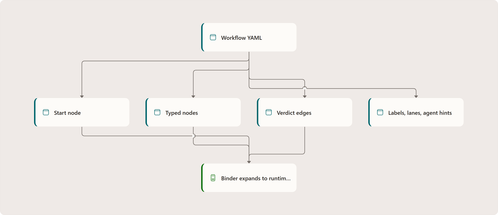
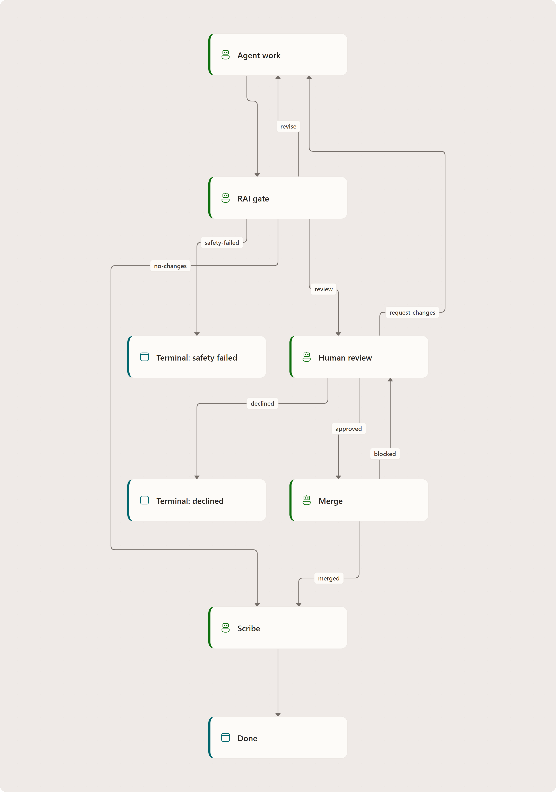
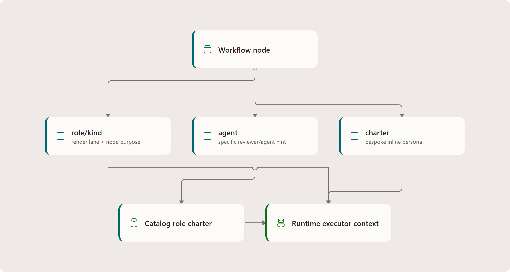
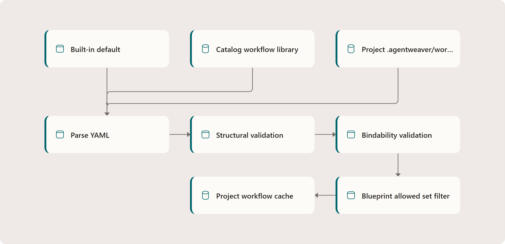
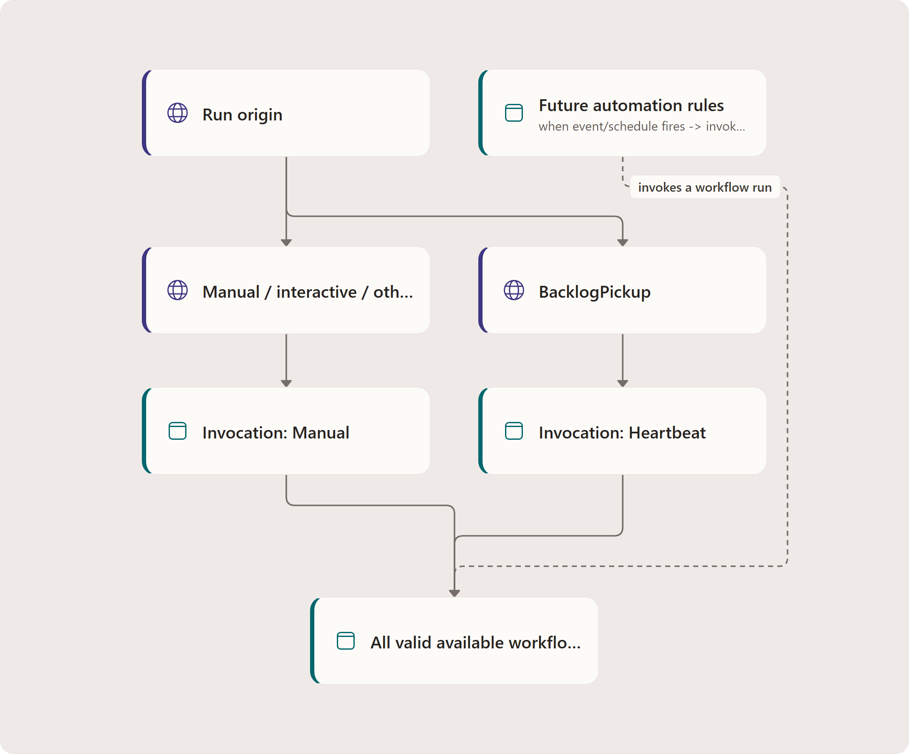
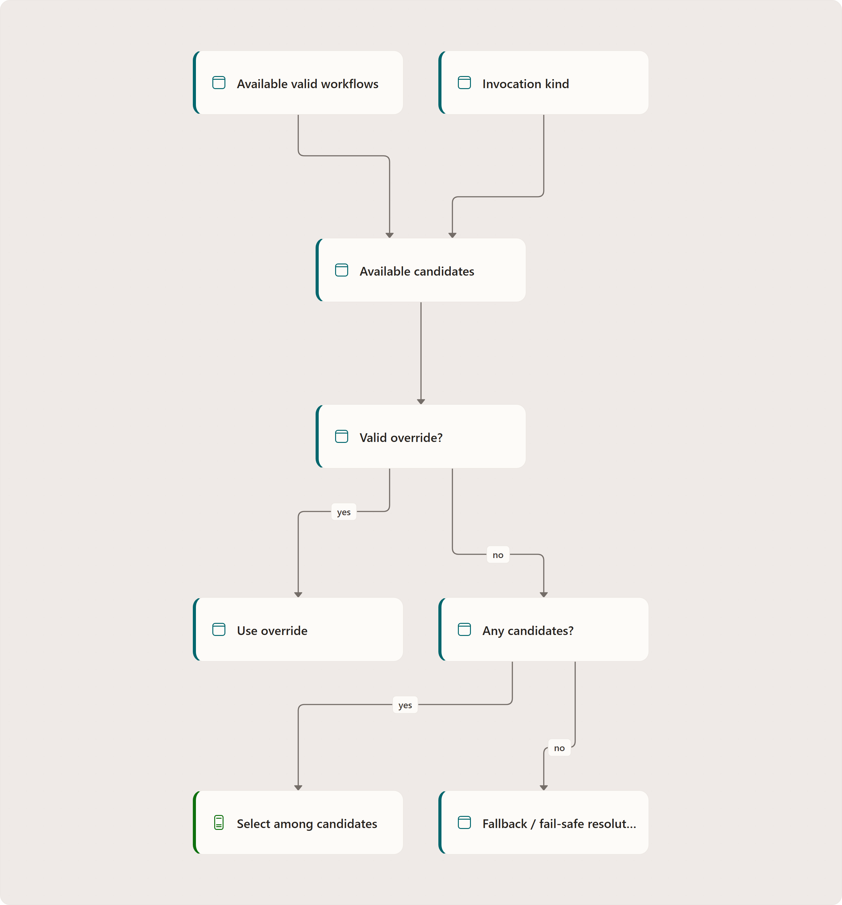
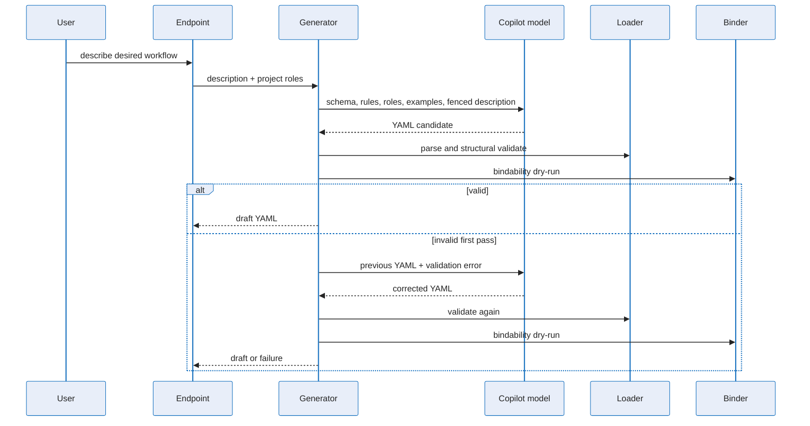
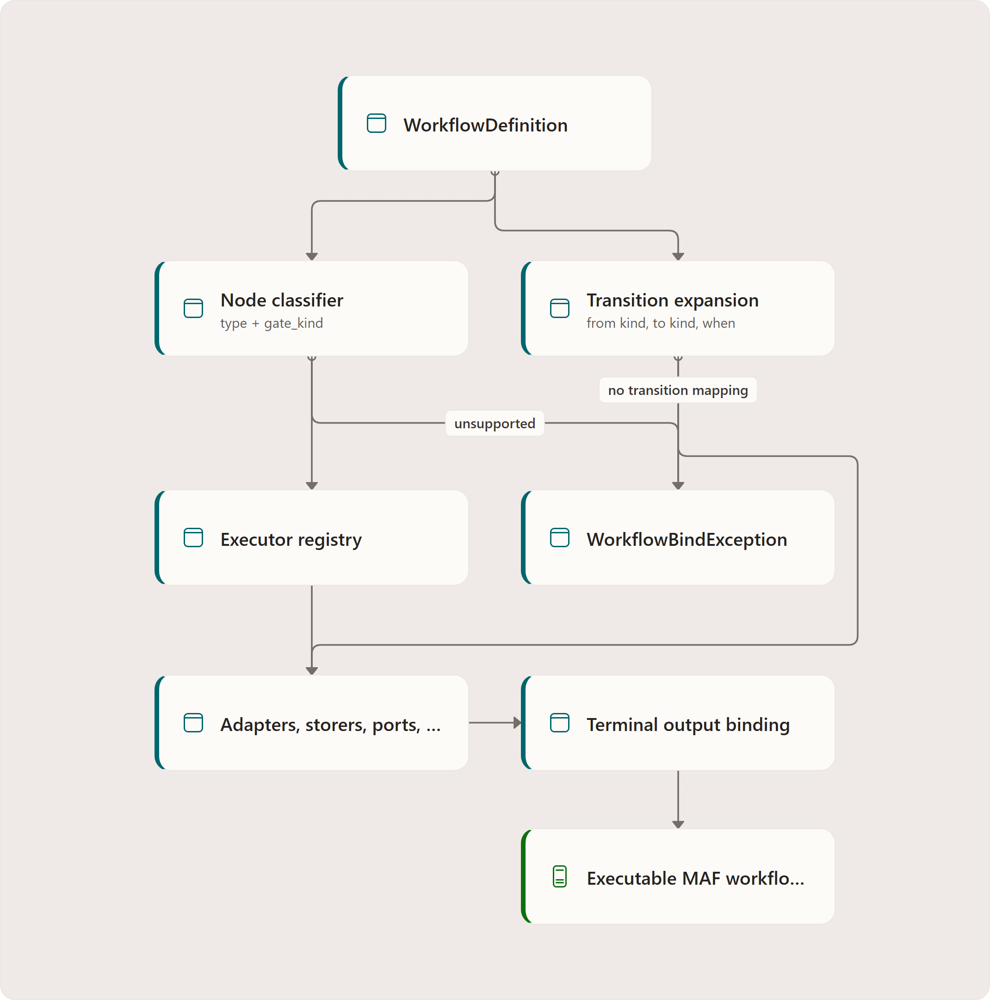
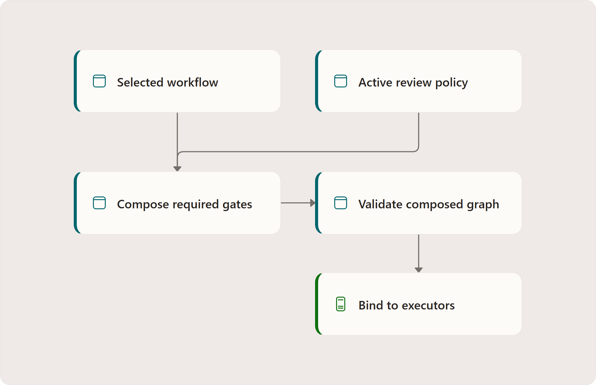

# Workflow Engine — Conceptual Deep Dive

## Purpose & Mental Model

Agentweaver workflows answer one question: **which execution process should move an agent run from intent to a reviewed outcome?**

The workflow engine is the policy layer between orchestration and runtime execution. The coordinator decides what the team should accomplish. The workflow engine decides which gates, loops, and terminal paths govern the run that carries out that work.

Conceptually, a workflow engine has five jobs:

1. **Define** reusable process graphs as declarative workflow templates.
2. **Discover** built-in, catalog, and project-authored workflow definitions.
3. **Track** invocation context and automation metadata so runs carry the right operational context without changing workflow validity.
4. **Select** the best process fit when several workflows are available.
5. **Bind** the selected definition to real runtime executors, failing closed if any node or edge cannot run safely.


<!-- Rendered from ../diagrams/src/workflow-engine-fig1.json by docs/diagram-renderer +
     Playwright (Fluent-styled React Flow), replacing a Mermaid flowchart.
     Edit the JSON, then run `npm run docs:render-diagrams` and commit the
     regenerated PNG + .hash.txt. -->

A useful rebuilding rule is: **workflows are declarative policy graphs; binding is the safety boundary that turns policy into execution.**

Workflows are one half of run orchestration. The coordinator and run lifecycle are covered in [orchestration.md](orchestration.md); the focus here is how workflow definitions are authored, generated, selected, and bound.

## Core Design Invariants

These invariants are the backbone of the workflow engine:

- **Definitions are data, not code.** YAML describes nodes, edges, and metadata. It does not execute directly.
- **Discovery is server-side.** Clients list, render, and edit workflows, but loading, validation, selection, and binding happen in the API.
- **Workflows are trigger-agnostic.** How a run starts is tracked separately from what pipeline definition it executes.
- **Overrides cannot bypass safety.** A requested workflow id is honored only if it resolves, validates, and binds.
- **Selection is bounded model authority.** The selector may choose among already-safe candidates; it may not invent ids or bypass availability and validation checks.
- **Binding fails closed.** A node type, gate, or edge with no known executor mapping aborts the build instead of becoming a no-op.
- **Runtime policy is composed before execution.** Review-policy gates are merged into the selected workflow before the executable graph is built.
- **A built-in default is always available.** The default workflow is embedded in code and serves projects that ship no workflow files of their own, so every project has a valid workflow to run.

## Workflow Template as Policy Graph

### What a Workflow Template Is

A workflow template is a declarative graph with:

- a stable `id`,
- a human-readable `name` and optional `description` / `version`,
- a `start` node,
- typed `nodes`,
- directed `edges`,
- optional board `stages`,
- and node metadata used for rendering and execution context.

The key abstraction is that a workflow describes **what process should happen**, not the hidden plumbing required to execute it. A single logical edge such as `rai -> review when review` may expand into adapters, state storage, predicates, review ports, and graph outputs when bound to the runtime.



<!-- Rendered from ../diagrams/src/workflow-engine-fig2.json by docs/diagram-renderer +
     Playwright (Fluent-styled React Flow), replacing a Mermaid flowchart.
     Edit the JSON, then run `npm run docs:render-diagrams` and commit the
     regenerated PNG + .hash.txt. -->

The loader validates the static shape first: required fields, valid node type, unique node ids, known edge endpoints, check branches with matching outgoing edges, and valid references from structured node fields.

The binder then validates runtime bindability. This second phase matters because the schema can represent graph concepts before the live executor graph has executor support for them.

### Node Types

Agentweaver's workflow schema models these conceptual node types:

- **prompt** — an agent turn that produces work or analysis.
- **peer_review** — an AI review turn that can emit approval, change request, decline, pass, or fail verdicts.
- **build_test** — the platform-owned Build & Test gate. It runs the canonical build/test/preview instruction, emits `approved`, `request-changes`, or `declined`, and should sit after any RAI safety gate and before human review for software workflows. In `Sandbox:AgentExecutionMode=pod-per-run`, assembly Build & Test first launches a dedicated AgentHost pod for the coordinator run and configures it with the detached integration worktree as its working directory, so the gate and any `start_preview` server run from the same assembled tree.
- **check** — a routing gate with declared branches. Known gate kinds include `rai`, `human-review`, and `rubberduck`.
- **merge** — an action that applies produced changes.
- **open_pull_request** — a platform-owned, deterministic action (issue #49) that opens a GitHub pull request on the project's connected repository. It makes exactly one GitHub REST API call — never an LLM turn — so it can safely sit after `build_test`/`peer_review` approval or directly after an agent turn, before (or instead of) `merge`. Configurable node fields: `title`, `body` (both support the placeholders `{run_id}`, `{worktree_branch}`, `{originating_branch}`, `{outcome_summary}`; default templates are used when omitted), `base` (defaults to the project's default branch, then `main`), `head` (defaults to the run's produced worktree branch), and `draft` (defaults to `false`). On success it emits a `completed` step event carrying the PR number/url; on any failure (no head branch/commits, no connected repository, no/invalid access token, GitHub API error) it emits a `failed` step event with a reason and never throws or crashes the run — the produced `AgentTurnOutput` passes through unchanged either way, so a downstream `scribe` step always records the run's real outcome.
- **scribe** — a recording step that captures the outcome.
- **terminal** — an explicit sink such as done, declined, or safety failed.
- **fan_out**, **fan_in**, **serial**, **coordinator_composed** — schema-level extension points for richer topologies.

Runtime binding supports prompt, peer-review, `build_test`, `open_pull_request`, check gates with known gate kinds, merge, scribe, terminal sinks, and a set of sequential / review / direct-completion topologies. Extension node types remain explicit schema concepts; until executors bind them, the runtime fails closed.

An `open_pull_request` node binds from a producing `prompt` node directly, or from a `peer_review`/`build_test` gate's `approved`/`pass` verdict (mirroring the existing gate → merge transition), and forwards into `scribe` exactly like an agent turn does:

```yaml
nodes:
  - id: implement
    type: prompt
    agent: worker
    prompt: "Implement the requested change."
  - id: build-test
    type: build_test
  - id: open-pr
    type: open_pull_request
    title: "Agentweaver: {outcome_summary}"
    body: "Automated changes from run `{run_id}` on `{worktree_branch}`."
    base: main
  - id: record
    type: scribe
edges:
  - from: implement
    to: build-test
  - from: build-test
    to: open-pr
    when: approved
  - from: open-pr
    to: record
```


### Software assembly gate order

Authored assembly gates are executed in workflow traversal order, not YAML declaration order. The coordinator starts at `start` and performs a breadth-first traversal over only the happy-path edges: unconditional edges plus verdict edges whose `when` is `approved`, `pass`, or `review` (`apps/Agentweaver.Api/Coordinator/CoordinatorAssemblyService.cs:1121`, `:1164`, `:1190`). Gate nodes discovered on that path are then projected to canonical assembly stages (`rai`, `build-test`, `rubberduck`, `human-review`) and deduplicated by stage (`CoordinatorAssemblyService.cs:1128`, `:1139`).

For the built-in software workflows this means RAI runs before Build & Test, even if a YAML author groups node declarations differently. `bug-fix` follows `triage -> fix -> verify -> rai-check -> build-test -> human-review`; `software-delivery` follows `plan -> implement -> test-gate -> rai-check -> rubberduck -> code-review -> build-test -> review-gate` (`packages/Agentweaver.Squad/Catalog/Resources/workflows/bug_fix.yaml`, `software_delivery.yaml`). Copilot workflow and blueprint generation prompts carry the same rule so generated software workflows place `build_test` after any RAI gate and immediately before human review (`apps/Agentweaver.Api/Workflows/WorkflowGatePromptGuidance.cs:7`, `apps/Agentweaver.Api/Workflows/CopilotWorkflowGenerator.cs:243`, `apps/Agentweaver.Api/Blueprints/CopilotBlueprintGenerator.cs:152`).

Build & Test infrastructure failures are not authored `request-changes` verdicts. Pod capacity, launch/readiness, endpoint-resolution, and A2A transport failures are raised as typed infrastructure exceptions, then parked as retryable `assembly_blocked` reasons or failed terminally for non-retryable configuration errors (`apps/Agentweaver.Api/Coordinator/CoordinatorAssemblyService.cs:688`, `:1567`; `packages/Agentweaver.AgentRuntime/Workflow/WorkflowAgentInfrastructureException.cs:7`). The emitted event payload includes `detail`, `exceptionMessage`, `innerExceptionMessage`, `innerExceptionType`, and `infrastructureReason`, so operators can distinguish a quota park from an AgentHost launch or A2A transport root cause.

### The Default Workflow

The default workflow encodes the standard run pipeline. Its canonical source is the code-embedded `DefaultWorkflowTemplate` (id `default`), loaded once through the real loader as `BuiltInWorkflows.Default` (`BuiltInWorkflows.DefaultWorkflowId == "default"`). `DefaultWorkflowTemplate.TryMaterialize` can also write a copy to a project's `.agentweaver/workflows/default.yaml` so users can inspect or customize it. The pipeline is `agent -> rai -> review -> merge -> scribe` (with terminal sinks for safety-failed, declined, and done).



<!-- Rendered from ../diagrams/src/workflow-engine-fig3.json by docs/diagram-renderer +
     Playwright (Fluent-styled React Flow), replacing a Mermaid flowchart.
     Edit the JSON, then run `npm run docs:render-diagrams` and commit the
     regenerated PNG + .hash.txt. -->

This default encodes the minimum complete run lifecycle: produce work, apply Responsible AI safety review, pause for human review when changes exist, merge if approved, and record the outcome. The loops are part of the policy, not exceptional control flow.

## Role Slots, Catalog Roles, and Bespoke Charters

Workflow nodes carry two different kinds of "role" information:

1. **Workflow role slots** describe the node's place in the graph or UI lane: `agent`, `review`, `merge`, `scribe`, `plumbing`, and similar labels.
2. **Catalog or bespoke execution roles** identify who should perform a node when a real agent identity is needed.

Do not collapse these into one concept. A node with `role: review` is in a review lane; it is not automatically a catalog role named `review`. A peer-review node names a concrete reviewer with `agent: qa-engineer` when it needs that agent. A generated or project-authored node carries an inline `charter` when no catalog role fits.



<!-- Rendered from ../diagrams/src/workflow-engine-fig4.json by docs/diagram-renderer +
     Playwright (Fluent-styled React Flow), replacing a Mermaid flowchart.
     Edit the JSON, then run `npm run docs:render-diagrams` and commit the
     regenerated PNG + .hash.txt. -->

The runtime uses explicit node fields and run context to build the agent prompt. Catalog roles are preferred because their charters are already known to the casting system. Bespoke charters are a controlled escape hatch for generated workflows whose process needs a role outside the catalog.

Execution hints resolve in a clear order. The `agent` and `charter` fields are the reliable workflow-level execution hints: `agent` binds the node to a known catalog role, and `charter` supplies a bespoke role inline. When neither is present, the run's assigned `AgentName` remains the executing agent. A prompt node's `role` and `kind` are graph metadata: they classify the node and describe its place in the flow, but they do not override `agent`, `charter`, or `AgentName`.

## Discovery, Validation, and Registry

### Source Precedence

For a project, `WorkflowRegistry.Build` assembles a `ProjectWorkflowSet` from:

1. the built-in default workflow (`BuiltInWorkflows.Default`, from `DefaultWorkflowTemplate`),
2. catalog library workflows embedded in the Squad catalog (`CatalogReader.LoadAllWorkflowYamls`, loaded with `isBuiltIn: true`),
3. project-authored `.yaml` / `.yml` files under `.agentweaver/workflows/` (`WorkflowRegistry.WorkflowsRelativePath`).

The result is cached per project in `WorkflowRegistry.GetOrLoad`. Each cache entry is keyed by a signature of the project's top-level workflow YAML files plus the project's allowed workflow id set, so a replica refreshes its local cache when shared project files or blueprint restrictions change. `WorkflowRegistry.Sync` still provides the explicit user-facing refresh path and rebuilds from disk; validation errors are cached as registry results for replica coherence. Invalid workflows remain visible in `ProjectWorkflowSet.Results` with their errors, but `ProjectWorkflowSet.Available` excludes them.



<!-- Rendered from ../diagrams/src/workflow-engine-fig5.json by docs/diagram-renderer +
     Playwright (Fluent-styled React Flow), replacing a Mermaid flowchart.
     Edit the JSON, then run `npm run docs:render-diagrams` and commit the
     regenerated PNG + .hash.txt. -->

The built-in default is always available. Catalog workflows are available without project-local files. A blueprint may restrict the allowed workflow ids for a project via `Project.AllowedWorkflowIds`; `WorkflowRegistry.FilterByAllowedSet` keeps only allowed ids **plus** the built-in `default`, which is always retained so a project never has zero workflows. An empty/absent allowed set means all workflows are returned (backward compatible).

Review policies use the same coherence pattern. `ReviewPolicyRegistry.GetOrLoad` caches a project's `.agentweaver/review-policies/` results with a signature of the top-level policy YAML files, and `ReviewPolicyRegistry.Sync` replaces that cache after an explicit policy refresh. Because workflow and policy files live in the shared project workspace, one API replica can sync a change and another replica will observe the changed signature on the next registry read rather than serving a stale process graph indefinitely.

Reserved ids are protected: `WorkflowRegistry.Build` adds the built-in `default` and every catalog id to a reserved set, so project files cannot override a built-in or catalog id (such a file becomes an invalid result). Duplicate ids are resolved deterministically in `WorkflowRegistry.AddResult`: among built-in/catalog collisions the higher semantic `Version` wins (ties keep the first-loaded source); among project files the first valid file wins and later duplicates are surfaced as invalid load errors rather than silently replacing a definition.

### Validation Layers

Validation happens in layers:

1. **YAML parse** — `WorkflowDefinitionLoader.Load` turns malformed YAML into a file-scoped invalid result.
2. **Schema mapping** — node type, start node, edge endpoints, branches, and references are checked.
3. **Bindability dry-run** — `WorkflowRegistry.ValidateBindable` runs `RunWorkflowGraphBinder.GetBindabilityErrors` to check whether every node and transition can map to real executor wiring.
4. **Runtime composition** — review policies are composed, and the final effective graph is bound before a run starts.

This layered design lets the UI show useful authoring errors while preserving runtime safety.

## Invocation Context

`WorkflowInvocationKind` is tracked as run metadata, not as a workflow eligibility gate. The current kinds are:

- **`Manual`** — the run was started explicitly or by a non-heartbeat origin.
- **`Heartbeat`** — the coordinator heartbeat started the run through backlog pickup.

The invocation context is derived from run origin by `CoordinatorOrchestratorExecutor.ResolveInvocationKindAsync`. A `RunOrigin.BacklogPickup` run is treated as `WorkflowInvocationKind.Heartbeat`; other origins (and lookup failures) are treated as `WorkflowInvocationKind.Manual`.



<!-- Rendered from ../diagrams/src/workflow-engine-fig6.json by docs/diagram-renderer +
     Playwright (Fluent-styled React Flow), replacing a Mermaid flowchart.
     Edit the JSON, then run `npm run docs:render-diagrams` and commit the
     regenerated PNG + .hash.txt. -->

The important design property is that invocation kind does not filter workflow validity. The selector sees the project's valid available workflows regardless of whether the run started manually or from heartbeat pickup.

All valid workflows in the project's available set are candidates. A backlog task can carry a `WorkflowOverrideId`. The override is honored only if the workflow exists, is valid, and can bind safely. Otherwise the system logs the mismatch and continues with normal selection or safe fallback behavior.



<!-- Rendered from ../diagrams/src/workflow-engine-fig7.json by docs/diagram-renderer +
     Playwright (Fluent-styled React Flow), replacing a Mermaid flowchart.
     Edit the JSON, then run `npm run docs:render-diagrams` and commit the
     regenerated PNG + .hash.txt. -->

Rebuild guidance: treat invocation kind as observability and policy context, not as a candidate gate. If a selected id cannot resolve, validate, or bind, do not "helpfully" run it anyway.

## Event Trigger Predicate DSL

Event-triggered workflows can further constrain a matched `github.<event>[.<action>]` trigger with a
small structured `if:` predicate DSL. The design goal is deliberate narrowness: enough expressiveness
for label, branch, review-state, and comment-command routing, without introducing a general-purpose
expression language.

- A plain `if:` array is implicitly **AND**.
- `or:` wraps an array of child predicates.
- `not:` wraps a single child predicate.
- Predicate validation is fail-closed at workflow load time: malformed shapes, unknown enum values,
  unsupported event/predicate combinations, and invalid regexes reject the workflow definition.

Current vocabulary:

- `has_label` / `is_not_labeled_with` — `github.issues*`, `github.pull_request*`
- `base_branch` — `github.pull_request*`
- `review_state` — `github.pull_request_review*`
- `ref` (`equals` / `prefix`) — `github.push`
- `category` — `github.discussion*`
- `comment_matches` — `github.issue_comment*`

Example:

```yaml
trigger:
  type: event
  event_name: github.issue_comment.created
  if:
    - comment_matches: { pattern: "^/agentweaver:triage$" }
    - not:
        or:
          - comment_matches: { pattern: "^/agentweaver:ignore$" }
          - comment_matches: { pattern: "^/agentweaver:skip$" }
```

### `comment_matches` security boundary

`comment_matches` preserves the repo's existing webhook trust boundary. The GitHub comment body is
used only for a fixed regex boolean check. The workflow engine does **not** extract capture groups,
derive arguments, log the raw text at info level, persist it into backlog metadata, or forward it
into downstream prompts. The output of the predicate is only "matched" or "did not match."

## Workflow Library and Generation

### Catalog Library

The catalog library provides reusable functional processes: software delivery, bug fix, code review, content authoring, product discovery, incident response, and agent evaluation. A blueprint can attach a set of these workflow ids to a project and set a default.

The library is process-oriented. A workflow is named for what it does, not for the team that happens to use it. This distinction matters for selection: the coordinator should choose `bug-fix` for a contained defect, `software-delivery` for a larger implementation lifecycle, and `code-review` for feedback-only work.

### Workflow Generation

Workflow generation turns a natural-language process request into an unsaved YAML draft.


```mermaid
%%{init: {'theme':'base','themeVariables':{'fontFamily':'Segoe UI, system-ui, -apple-system, sans-serif','fontSize':'15px','primaryColor':'#E8EEF9','primaryBorderColor':'#0F6CBD','primaryTextColor':'#242424','lineColor':'#605E5C','clusterBkg':'#FAF9F8','clusterBorder':'#D2D0CE','edgeLabelBackground':'#FFFFFF'}}}%%
sequenceDiagram
    participant User
    participant Endpoint
    participant Generator
    participant Model as Copilot model
    participant Loader
    participant Binder

    User->>Endpoint: describe desired workflow
    Endpoint->>Generator: description + project roles
    Generator->>Model: schema, rules, roles, examples, fenced description
    Model-->>Generator: YAML candidate
    Generator->>Loader: parse and structural validate
    Generator->>Binder: bindability dry-run
    alt valid
        Generator-->>Endpoint: draft YAML
    else invalid first pass
        Generator->>Model: previous YAML + validation error
        Model-->>Generator: corrected YAML
        Generator->>Loader: validate again
        Generator->>Binder: bindability dry-run
        Generator-->>Endpoint: draft or failure
    end
```

Generation has these rules:

- The prompt is built server-side.
- The user's description is fenced as untrusted data.
- The prompt includes the schema, supported runtime node vocabulary, validation rules, available project roles, and few-shot examples.
- Output is cleaned for accidental Markdown fences.
- If the model omits an id, a kebab-case id is derived from the description.
- The generator validates with the same loader and binder dry-run used by runtime authoring paths.
- Exactly one correction pass is allowed.
- The result is a draft; it is not written to `.agentweaver/workflows/` until a save/apply path persists it.

Blueprint generation can also invoke workflow generation when no library workflow is a good process fit. Applying that blueprint writes the generated workflow file, syncs the registry, and makes the workflow selectable.

## Selection Logic

Workflow selection chooses a process for a task. It runs inside `CoordinatorOrchestratorExecutor.SelectWorkflowAsync` and is intentionally conservative: deterministic rules narrow the space first (registry ordering, availability, overrides), and `WorkflowSelector.SelectAsync` only chooses among 2+ available definitions.


<!-- Rendered from ../diagrams/src/workflow-engine-fig8.json by docs/diagram-renderer +
     Playwright (Fluent-styled React Flow), replacing a Mermaid flowchart.
     Edit the JSON, then run `npm run docs:render-diagrams` and commit the
     regenerated PNG + .hash.txt. -->

The selector prompt asks for process fit:

- Match on the steps the workflow runs and the output it produces.
- Do not choose by name similarity or domain-word overlap.
- Prefer project/custom workflows when they perform the requested process.
- If nothing fits, select the first listed workflow, which is the project default.

The model must return JSON with a `selected` workflow id and a short `rationale`. `WorkflowSelector.SelectAsync` extracts the first JSON object, verifies that the selected id is one of the provided candidates, and falls back to the default on model failure, malformed JSON, or unknown ids. The production model seam is `CopilotWorkflowSelectionModel` (a Copilot completion wrapper that returns `null` on failure, triggering the deterministic fallback). When two or more candidates are resolved, the coordinator emits a `coordinator.workflow_selected` event with the choice, rationale, `wasAutoSelected`, and an override hint.

### Overrides

There are two override channels:

- **Backlog task override** — `BacklogTask.WorkflowOverrideId`, persisted on the task before it is claimed. `CoordinatorPickupService` prepends `use {id}` to the goal at pickup, and `SelectWorkflowAsync` also resolves the override id directly against the registry and available set.
- **Conversational override** — a human can send `use {workflow-id}`. `WorkflowSelector.TryParseOverride` checks for this pattern before normal selection and uses the requested workflow if it is among the available candidates.

An explicit override wins only inside the candidate safety boundary. It does not let a user or backlog item execute a workflow that the registry cannot resolve or that cannot bind safely.

### Selection vs Runtime Resolution

The coordinator uses selection while planning. The run workflow factory resolves the effective workflow again when it builds the executable graph, then composes the active review policy and binds the result.

That second resolution is deliberate. It prevents a stale or mismatched planning decision from becoming unchecked runtime execution. A rebuild should keep this double-check or replace it with an equally durable selected-workflow record that is still revalidated before execution.

## Binding Declarative Nodes to Runtime Execution

Binding is where a workflow stops being YAML and becomes an executable graph.

The binder:

1. classifies each node by `type` and, for gates, `gate_kind`;
2. resolves the node to a known executor kind;
3. expands every logical edge into concrete executor wiring and predicates;
4. wires terminal outputs from incoming edge semantics;
5. preserves hidden plumbing such as adapters and stored merge data;
6. fails closed when a node or transition has no mapping.



<!-- Rendered from ../diagrams/src/workflow-engine-fig9.json by docs/diagram-renderer +
     Playwright (Fluent-styled React Flow), replacing a Mermaid flowchart.
     Edit the JSON, then run `npm run docs:render-diagrams` and commit the
     regenerated PNG + .hash.txt. -->

The binder resolves by node type, not by hardcoded ids. A workflow can rename `agent`, `rai`, `review`, `merge`, and `scribe` and still bind if the node types and gate kinds describe the same process. This is what lets library and generated workflows use meaningful node ids while preserving the same runtime semantics.

### Canonical Transition Families

The default family includes:

- agent work into RAI,
- RAI revision back to agent,
- RAI safety failure to terminal,
- RAI no-change to scribe,
- RAI review path to human review,
- human approval to merge,
- human change request back to agent,
- human decline to terminal,
- merge success to scribe,
- merge blocked back to review,
- scribe to done.

Catalog-style workflows add supported generic families:

- sequential agent turns,
- agent output into peer review,
- peer-review pass or approval into merge / RAI,
- peer-review fail or request-changes back to an agent,
- direct agent or review completion through scribe,
- merge blocked back into peer review or an agent.

Anything outside supported transition families is not "best effort." It is a binding error.

### Review Policy Composition

Workflow definitions describe the process graph. Review policies describe required gates. Before runtime binding, the system composes the active review policy onto the selected workflow.



<!-- Rendered from ../diagrams/src/workflow-engine-fig10.json by docs/diagram-renderer +
     Playwright (Fluent-styled React Flow), replacing a Mermaid flowchart.
     Edit the JSON, then run `npm run docs:render-diagrams` and commit the
     regenerated PNG + .hash.txt. -->

This lets teams require additional review gates without copying every workflow template. The same fail-closed rule applies: if a required review gate cannot be bound, the run should not start as if the gate were optional.

## Relationship to Runs and Coordinator Work

A workflow is selected at the point where a run needs an execution process. Different run origins use the same concepts but have different responsibility boundaries:

- **Manual run** — an explicit start whose invocation metadata is `Manual`.
- **Backlog pickup coordinator run** — a heartbeat-started run whose invocation metadata is `Heartbeat`.
- **Scheduled or event-driven automation run** — future automation rules can invoke any workflow when their schedule or event condition fires.
- **Coordinator parent run** — owns planning, assembly, review, merge, and scribe for coordinated work.
- **Coordinator child run** — uses a trimmed child pipeline in an isolated child worktree: agent work terminating at assemble-ready. It does not perform per-child RAI, human review, merge, or scribe independently. Dependency outputs are merged forward through the coordinator integration branch before dependent children launch.

The important boundary is that workflows govern run gates, while the coordinator owns intent, decomposition, dependency frontiers, and assembly. A child run can produce a safe piece of work; the parent workflow decides how the assembled result is reviewed and merged.

See [orchestration.md](orchestration.md) for the broader run lifecycle and coordinator model.

## Extension Points and Gotchas

- **Do not execute by id alone.** Workflow ids identify definitions; node types and edge semantics determine bindability.
- **Unattended pickup is governed outside the workflow YAML.** Use project settings and automation rules to decide when a workflow should start automatically.
- **Keep generated examples bindable.** A generator that teaches unsupported node types will produce attractive but unrunnable YAML.
- **Role metadata can be misleading.** Distinguish render lanes from concrete catalog agent ids and inline charters.
- **Peer review must be verdict-routed.** A `peer_review` node needs verdict-labeled outgoing edges; otherwise bindability validation rejects it instead of guessing how to route it.
- **Terminal nodes are resolved by incoming semantics.** Renaming `done` is fine; losing the scribe-sourced or verdict-sourced incoming edge is not.
- **Registry sync matters.** Saving a file should be followed by an explicit sync for immediate feedback; other replicas refresh when they observe the changed shared-file signature.
- **Review policy composition can change the effective graph.** The workflow a user sees and the workflow that runs may differ by required injected gates.
- **Selection is advisory until binding.** A selected workflow still must resolve, compose, and bind at run start.

## Rebuilding Blueprint

If you were rebuilding the workflow engine from scratch, implement it in this order:

1. Define the workflow schema: start, typed nodes, edges, branches, and metadata.
2. Write a loader that returns valid and invalid load results without crashing the whole set.
3. Embed a built-in default workflow and parse it through the same loader as user files.
4. Build a registry that discovers built-in, catalog, and project workflows, caches per project with a shared-file signature, and syncs explicitly.
5. Add invocation-context tracking and keep it separate from candidate availability.
6. Add bindability validation that rejects unsupported node types and transitions before runtime.
7. Implement node classification by type and gate kind, never by fixed ids.
8. Implement edge expansion from `(from kind, to kind, when)` to concrete executor wiring.
9. Compose review policies onto selected workflows before binding.
10. Add default and override resolution that revalidates availability and bindability.
11. Add process-fit selection among available candidates with deterministic fallback.
12. Add generation as a draft-only server-side prompt + validation + one correction pass.
13. Surface graph descriptors and workflow-selected events for clients, but keep clients out of selection and binding.
14. Add recovery tests that prove renamed nodes, invalid edges, invalid overrides, and unsupported types fail safely.

The central design principle is simple: **load workflows as data, select among valid available process graphs, bind every edge to real executors, and fail closed whenever policy cannot be proven executable.**

## Where this lives

- `apps/Agentweaver.Api/Workflows/`
- `apps/Agentweaver.Api/Coordinator/WorkflowSelector.cs`
- `apps/Agentweaver.Api/Coordinator/CoordinatorOrchestratorExecutor.cs`
- `apps/Agentweaver.Api/Runs/RunWorkflowFactory.cs`
- `packages/Agentweaver.Squad/Catalog/Resources/workflows/`
- `docs/workflow-binder.md`
- `docs/workflow-generation.md`
- `docs/workflow-library.md`
- `docs/workflow-selection.md`
