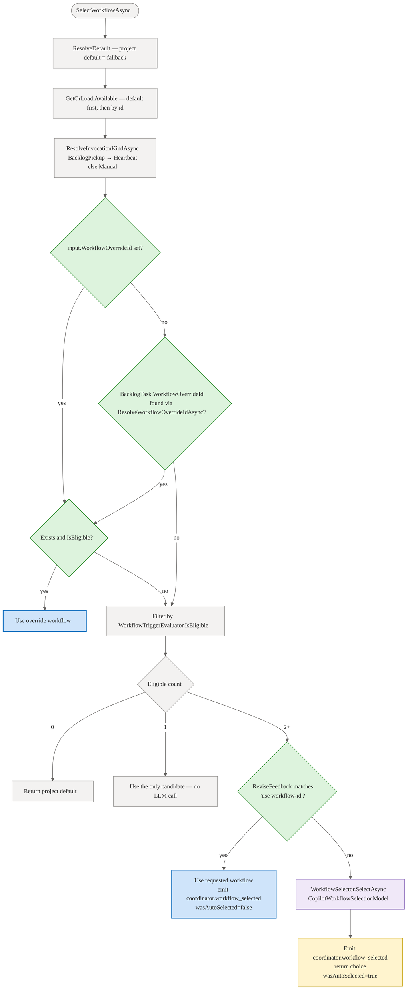

# Workflow selection — Deep Dive

When a project has more than one workflow, the coordinator must decide which one to apply before it decomposes a goal into a work plan. This page explains the selection algorithm, the override hierarchy, the trigger safety boundary, and how all of the above compose into a single deterministic-first decision that is always resilient to model failure.

For the user-facing controls see [Submitting and Watching Runs — Workflow selection](../guide/runs.md#workflow-selection). For the API reference and override precedence table see [Coordinator reference — Workflow selection](../reference/coordinator.md#workflow-selection-how-the-coordinator-picks-the-process-to-run).

## What it is

Workflow selection answers one question: **which process shape should this task follow?** Seven built-in workflows (software delivery, bug fix, code review, content authoring, PM discovery, incident response, agent evaluation) cover the common scenarios, and a project can add any number of custom YAML workflows on top.

Selection is **silently omitted** for single-workflow projects — no LLM call, no event. The multi-workflow path is consulted only when two or more trigger-eligible workflows are available, and it falls back deterministically to the project default on any model failure.

## Selection logic

`WorkflowSelector.SelectAsync` (`apps/Agentweaver.Api/Coordinator/WorkflowSelector.cs:80`) builds a process-fit prompt that includes:

- the task description (goal)
- the team's role titles
- each available workflow's id, name, description, and whether it is project/custom or built-in/library

The selection rules given to the model are explicit:

- **Process fit, not name similarity.** A closest-sounding built-in is a bad pick if its process does not fit.
- **Prefer project/custom workflows** over built-in/library workflows when a custom workflow can perform the requested process.
- **Fallback to default.** If no workflow is a good process fit, select the first listed workflow (the project default).

The model must reply with `{ "selected": "<id>", "rationale": "<1-2 sentences>" }`. A `null` response, unparseable JSON, or an unknown id all fall back to the project default with an explanatory rationale. The `CopilotWorkflowSelectionModel` (`apps/Agentweaver.Api/Coordinator/WorkflowSelector.cs:59`) returns `null` on any completion failure, so the selector stays inert when the model is unavailable.

## Override hierarchy

The algorithm runs overrides and filters before the LLM is ever invoked. In priority order (highest first):

### 1. Request-level dialog override

`StartOrchestrationRequest.WorkflowOverrideId` (`apps/Agentweaver.Api/Contracts/Dtos.cs:847`) is set when the user selects a specific workflow from the **Workflow** dropdown in the **Start task** dialog. It is passed through `ProjectEndpoints.cs:677` → `CoordinatorRunService.StartCoordinatorRunAsync` → `CoordinatorDraftInput.WorkflowOverrideId` (`apps/Agentweaver.Api/Coordinator/CoordinatorMessages.cs:15`).

In `SelectWorkflowAsync` (`apps/Agentweaver.Api/Coordinator/CoordinatorOrchestratorExecutor.cs:198`):

```csharp
var overrideId = input.WorkflowOverrideId
    ?? await ResolveWorkflowOverrideIdAsync(backlogStore, input.RunId, ct);
```

The dialog override is resolved first. If it is set, it wins over the backlog-task pin without a fallback to the pin.

### 2. Backlog-task pin

`BacklogTask.WorkflowOverrideId` is set on the task card via `PUT /api/projects/{id}/backlog/tasks/{taskId}/workflow-override`. When the heartbeat picks up the task and the dialog override is absent, `ResolveWorkflowOverrideIdAsync` (`apps/Agentweaver.Api/Coordinator/CoordinatorOrchestratorExecutor.cs:270`) reads the override from the backlog task.

Both the dialog override and the backlog-task pin are subject to the same eligibility check: the workflow must exist in the available set **and** its trigger must be eligible for the invocation kind (`WorkflowTriggerEvaluator.IsEligible`). An ineligible override is logged and ignored; selection continues with the LLM path.

### 3. Conversational override (`use {workflow-id}`)

Typing `use {workflow-id}` in the coordinator chat before confirming the OutcomeSpec triggers `WorkflowSelector.TryParseOverride` (`apps/Agentweaver.Api/Coordinator/WorkflowSelector.cs:141`), which matches the pattern:

```
^\s*use\s+(?<id>[A-Za-z0-9._-]+)\s*$
```

This is checked in `SelectWorkflowAsync` (`apps/Agentweaver.Api/Coordinator/CoordinatorOrchestratorExecutor.cs:244`) only when the multi-candidate path runs (two or more trigger-eligible workflows, no request-level or backlog-task override). The requested workflow must be among the eligible candidates.

### 4. LLM auto-select

`WorkflowSelector.SelectAsync` is reached only when: two or more trigger-eligible workflows exist and no explicit override was given. The model call produces a selection and a rationale. Both are surfaced in a `coordinator.workflow_selected` event.

### 5. Project default fallback

The project default is always resolved first (`WorkflowRegistry.ResolveDefault`) and placed at the front of the candidate list. It is returned whenever:

- the override workflow is unavailable or trigger-ineligible,
- zero workflows pass the trigger filter,
- `SelectWorkflowAsync` throws for any reason.

```
dialog override  >  backlog-task pin  >  conversational use {id}  >  LLM auto-select  >  project default
```

## Trigger filtering

Before any override check or LLM call, the candidate set is filtered by trigger eligibility. `WorkflowTriggerEvaluator.IsEligible` (`apps/Agentweaver.Api/Workflows/WorkflowTriggerEvaluator.cs`) enforces a hard boundary:

| Invocation kind | Eligible trigger types |
|---|---|
| `Manual` (explicit start, including dialog) | `Manual` only |
| `Heartbeat` (backlog pickup) | `Heartbeat` or `Event` (`TaskAddedToReady`) |

`Schedule` triggers are valid workflow metadata and carry a cadence string such as
`weekly:monday`. They are intentionally not selected by the manual/backlog-pickup paths; scheduled
trigger-task automation owns firing them.

`ResolveInvocationKindAsync` maps `RunOrigin.BacklogPickup` → `Heartbeat`; every other origin → `Manual`. Any failure during lookup defaults to `Manual`.

The dropdown in the **Start task** dialog shows only `Manual`-trigger workflows (`apps/web/src/components/StartOrchestrationDialog.tsx:52`), so a user can never select a heartbeat-only workflow from the UI.

## End-to-end flow



## The workflow selection event

Every multi-candidate resolution — LLM pick or conversational override — emits a `coordinator.workflow_selected` event on the coordinator run stream. The event carries:

| Field | Meaning |
|---|---|
| `selectedId` | The chosen workflow id |
| `selectedName` | The chosen workflow name |
| `rationale` | Why this workflow was selected (or why the default was used) |
| `wasAutoSelected` | `true` when the LLM (or fallback) picked; `false` for an explicit user override |
| `overrideHint` | `"Reply 'use {other-id}' to change..."` with the available list |
| `available` | The full list of eligible workflows at selection time |

Single-workflow projects never emit this event — the path is entirely silent.

## Source

| File | Responsibility |
|---|---|
| `apps/Agentweaver.Api/Coordinator/WorkflowSelector.cs` | `IWorkflowSelector`, `WorkflowSelectionContext`, `WorkflowSelectionResult`, `CopilotWorkflowSelectionModel`, `TryParseOverride`, prompt construction, JSON parsing |
| `apps/Agentweaver.Api/Coordinator/CoordinatorOrchestratorExecutor.cs:167` | `SelectWorkflowAsync` — the full selection algorithm including override hierarchy and trigger filtering |
| `apps/Agentweaver.Api/Coordinator/CoordinatorMessages.cs:15` | `CoordinatorDraftInput.WorkflowOverrideId` — carries the dialog override into the executor |
| `apps/Agentweaver.Api/Contracts/Dtos.cs:831` | `StartOrchestrationRequest.WorkflowOverrideId` — the request DTO field |
| `apps/Agentweaver.Api/Endpoints/ProjectEndpoints.cs:630` | `POST /api/projects/{id}/orchestrations` — passes `workflow_override_id` to `CoordinatorRunService` |
| `apps/Agentweaver.Api/Workflows/WorkflowTriggerEvaluator.cs` | `IsEligible` — hard trigger/kind boundary applied before any model call |
| `apps/Agentweaver.Api/Workflows/WorkflowDefinition.cs` | `WorkflowTrigger`, `WorkflowTriggerType` — `Manual`, `Heartbeat`, `Event` |
| `apps/web/src/components/StartOrchestrationDialog.tsx:45` | Dialog state: `workflowOverride`, `manualWorkflows`; filters to `trigger.type === 'manual'`; hides picker when `manualWorkflows.length <= 1` |
| `apps/web/src/api/client.ts` | `startOrchestration(projectId, goal, workflowOverrideId?)` — passes `workflow_override_id` in the request body |
