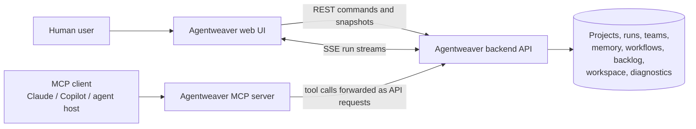
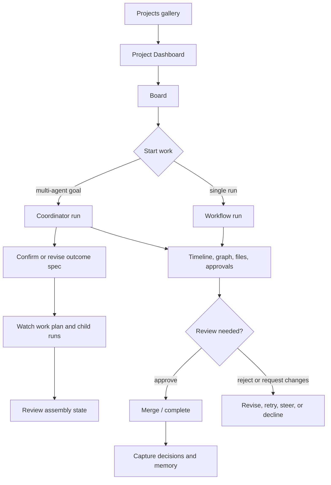
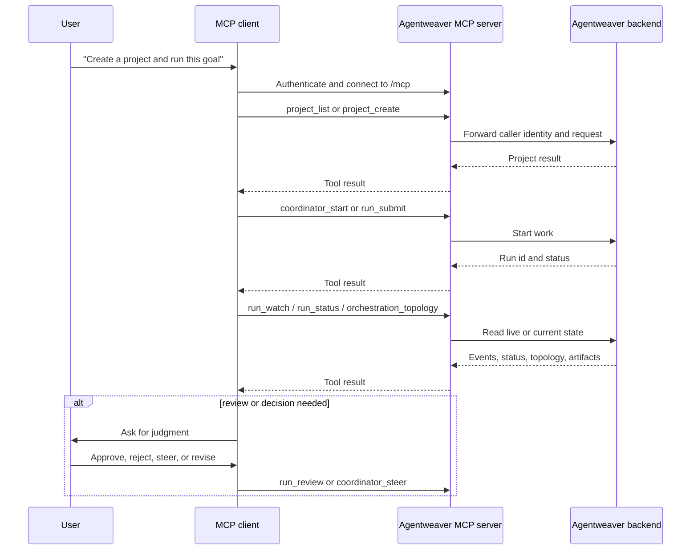

# Agentweaver experience overview

Agentweaver has two product surfaces: the web UI for humans who want a visual, real-time control room, and the MCP server for AI assistants and agent clients that drive the same work through tools. This overview explains how those surfaces fit together, how users move through projects, runs, review, teams, memory, workflows, backlog, and operations, and how to choose the right surface for a task.

Scope note: this is an orientation document for using Agentweaver. It describes what the user sees and does; implementation details live in the architecture deep dives.

## The two surfaces

Agentweaver exposes one product through two front doors:

- **The web UI** is for humans. It is visual, navigable, and real-time. A user signs in, chooses a project, watches boards and timelines update, opens files, reviews output, steers coordinators, and changes project settings.
- **The MCP server** is for MCP clients such as Claude, Copilot, or other AI assistants. A client connects to Agentweaver, authenticates, and invokes tools like `project_create`, `run_submit`, `run_watch`, `coordinator_start`, `team_cast`, or `memory_search`.

They are two front-ends over the same backend and data model. Projects, runs, coordinator orchestration, team rosters, memory, workflows, backlog items, sandbox policy, diagnostics, and workspace files are authoritative on the backend. The web UI renders those facts as pages, cards, graphs, timelines, and forms. The MCP server exposes the same facts and mutations as tools. Most actions a person performs in the web UI have a corresponding MCP tool an assistant can call.

The web UI and MCP server differ in interaction style, not in product intent:

| Surface | Best user | Interaction style | What it is best at |
|---|---|---|---|
| Web UI | Human operators, reviewers, project owners | Click, inspect, compare, approve, steer | Seeing state, understanding context, making judgment calls, watching live work |
| MCP server | AI assistants, automation agents, scripted clients | Connect, authenticate, call tools | Creating and updating work programmatically, chaining operations, asking an assistant to operate Agentweaver for you |

## Shared experience model

The core loop is the same from either surface:

1. **Choose or create a project.** A project binds Agentweaver to a working directory or GitHub repository and records project-level settings.
2. **Define work.** Work can start as a backlog task, a direct run request, or a coordinator goal.
3. **Run agents.** A run executes through a workflow pipeline and emits events as it moves through agent work, RAI, review, merge, and scribe steps.
4. **Watch progress.** The UI shows live timelines and graphs; MCP clients call status and watch tools.
5. **Review and decide.** Humans approve or reject work, steer agents, merge memory decisions, or change settings.
6. **Capture learning.** Team decisions, agent memory, and session context keep future work aligned.

Agentweaver treats the backend as the source of truth. The web UI loads snapshots for current state and consumes live run streams for what changes after the page opens. MCP tools call the same backend operations and return structured results the client can reason over.

## Web UI mental model

The web UI is a signed-in, project-aware control room. It uses a persistent app shell so navigation, project switching, API health, GitHub identity, and the start-orchestration action remain available even when the user opens a deep run page.

### The app shell

The shell has three persistent areas:

- **Left navigation rail** — global destinations always appear at the top; project-scoped sections appear when Agentweaver has a project context. The rail can collapse to icon-only mode.
- **Top bar** — contains the project switcher, API reachability status, and GitHub sign-in/sign-out state.
- **Main content area** — renders the current page: Overview, Projects, Dashboard, Board, Flow, Orchestrations, Workspace, Agents, Memories, Workflows, Settings, Diagnostics, Heartbeat, or a run detail page.

The project switcher lists existing projects, groups recent projects, and preserves the current page category when switching projects where possible. For example, switching projects from Settings lands on the target project's Settings page; switching from a deep run page lands on the target project's Board.

Global pages do not require a project id. When a user leaves a project for a global page, the shell remembers the last active project so project-scoped navigation still has useful targets.

### Navigation taxonomy

Agentweaver's web UI is organized into global destinations plus four project-scoped sections: **WORK**, **SQUAD**, **OPERATIONS**, and **SYSTEM**.

#### Global

| Destination | Route shape | What you do here |
|---|---|---|
| **Overview** | `/` and `/overview` | See fleet activity at a glance: in-flight work, queued work, done-today counts, health, active projects, and recent activity. |
| **Projects** | `/projects` | Browse projects, create a blank project, create a project from GitHub, choose a blueprint, and open a project. |

#### WORK

| Destination | Route shape | What you do here |
|---|---|---|
| **Dashboard** | `/projects/:projectId` | Review delivery metrics, throughput for the last 30 days, active runs, active agents, and the agent leaderboard. |
| **Board** | `/projects/:projectId/board` | Manage the project board across Backlog, Ready, Problems, Human Review, Active, and Done; start coordinator work and open run details. |
| **Flow** | `/projects/:projectId/flow` | See what each agent is working on now, including active, queued, blocked, and done counts grouped by agent and orchestration. |
| **Orchestrations** | `/projects/:projectId/orchestrations` | List coordinator runs for the project and open the topology view for a multi-agent goal. |
| **Workspace** | `/projects/:projectId/workspace` | Browse the project repository and active run worktrees read-only; inspect files and decompose a spec file into backlog tasks. |

#### SQUAD

| Destination | Route shape | What you do here |
|---|---|---|
| **Agents** | `/projects/:projectId/team` | Manage the cast working on the project: inspect agents, view charters and capabilities, add members, retire members, re-role agents, and open the casting wizard. |
| **Memories** | `/projects/:projectId/memories` | Review team decisions, merge or reject decision inbox entries, and create or update agent memory. |

#### OPERATIONS

| Destination | Route shape | What you do here |
|---|---|---|
| **Workflows** | `/projects/:projectId/workflows` | View reusable pipeline definitions, validate discovered workflows, sync from disk, generate a workflow, create a workflow, edit YAML, use the visual editor, and choose a project default. |
| **Settings** | `/projects/:projectId/settings` | Configure the project: name, repository link, default model provider, sandbox policy, review policy, and danger-zone actions. |

#### SYSTEM

| Destination | Route shape | What you do here |
|---|---|---|
| **Diagnostics** | `/projects/:projectId/diagnostics` | Run real diagnostics checks, switch between global and project scope, and inspect pass/warn/fail details with durations. |
| **Heartbeat** | `/projects/:projectId/heartbeat` | Monitor background automation status, coordinator heartbeat, checkpoint GC, recent ticks, errors, and service cadence. |

### Deep run destinations

Run pages are project-scoped but intentionally not separate left-nav items. They keep the relevant parent section active:

| Destination | Route shape | What you do here |
|---|---|---|
| **Workflow run** | `/projects/:projectId/runs/:runId/workflow` | Watch a single run move through Agent, RAI, Human Review, Merge, and Scribe; inspect timeline events, files, approvals, sandbox previews, and run output. |
| **Execution** | `/projects/:projectId/runs/:runId/execution/:executionId` | Open an execution-level watcher for a specific child execution. |
| **Coordinator run** | `/projects/:projectId/orchestrations/:runId` | Watch a coordinator topology, confirm or revise the outcome spec, inspect work plan and child runs, steer agents, view assembly status, and review collective output. |
| **Casting wizard** | `/projects/:projectId/team/cast` | Propose and confirm a project team using templates, goals, constraints, team size, and generated member charters. |

### Common web journey: project → board → run → review

Most human work starts with a project and ends with review:

A typical path looks like this:

1. The user opens **Projects**, creates or selects a project, and lands in the project workspace.
2. The user opens **Board** to see backlog and run buckets.
3. The user starts work either by submitting a direct run or starting a coordinator orchestration.
4. Agentweaver opens a run detail page. The user sees a workflow graph, live timeline, tool and shell approval cards, file artifacts, and status badges.
5. If the run reaches human review, the user approves or rejects it. If the coordinator reaches a confirmation gate, the user confirms or revises the outcome spec before child work is dispatched.
6. After completion, the user reviews artifacts, memory, decisions, and board state.

The UI is optimized for judgment: seeing state, reading output, understanding why a run is blocked, comparing files, approving work, and steering the coordinator at the right time.

## MCP mental model

The MCP server turns Agentweaver into a tool catalog for AI assistants. Instead of clicking through pages, an MCP client connects to Agentweaver and calls tools grouped by domain.

### Connect and authenticate

Agentweaver supports two MCP transport shapes:

- **Hosted HTTP mode** exposes `/mcp` as a protected network resource. An MCP client discovers OAuth metadata, authenticates with Agentweaver's authorization flow, receives a bearer token for the MCP resource, and calls tools with that token.
- **Local stdio mode** is for MCP hosts that spawn the server process locally and communicate over standard input/output. It is suited to local single-user setups and does not use the hosted HTTP bearer challenge path.

In hosted mode, the MCP server is a thin Resource Server. It validates access at the MCP boundary, dispatches the requested tool, and forwards the caller's bearer token to the Agentweaver API so backend authorization sees the real user. The API remains authoritative for projects, runs, memory, team, workflow, backlog, and operations.

### Tool catalog by goal

The tool catalog is broad because it mirrors the product model. It contains 79 tools across 13 groups. A client does not need to know every tool up front; the useful mental model is "pick the domain, then pick the action."

| Tool group | User goal it serves | Representative tools |
|---|---|---|
| **Backlog** | Capture, organize, promote, archive, and decompose work on the project board. | `backlog_capture_task`, `backlog_get_board`, `backlog_move_to_ready`, `backlog_set_settings`, `backlog_decompose_spec` |
| **Blueprint** | Start from predefined or generated project blueprints that bundle roster, workflow, review, and sandbox choices. | `list_blueprints`, `validate_blueprint`, `blueprint_generate` |
| **Catalog** | Discover reusable agent roles and casting scenarios. | `catalog_list_roles`, `catalog_list_scenarios` |
| **Coordinator** | Drive multi-agent work from a plain-language goal through outcome spec, work plan, child runs, topology, and steering. | `coordinator_start`, `coordinator_outcome_spec_confirm`, `coordinator_work_plan_get`, `coordinator_children_get`, `coordinator_steer`, `orchestration_topology` |
| **Diagnostics** | Inspect system health and background heartbeat state. | `diagnostics_get`, `heartbeat_status` |
| **GitHubAuth** | Check or manage GitHub authentication for the caller. | `github_status`, `github_signin`, `github_signout` |
| **Memory** | Capture and govern decisions, inbox entries, agent memory, session context, and file import/export. | `decision_inbox_submit`, `decision_inbox_merge`, `decision_list`, `memory_record`, `memory_search`, `session_start`, `memory_export` |
| **Project** | List, create, inspect, configure, rename, relink, delete projects, and list project runs. | `project_list`, `project_create`, `project_get`, `project_configure`, `project_list_runs` |
| **Run** | Submit, watch, review, inspect artifacts, retry, and archive runs. | `run_submit`, `run_status`, `run_watch`, `run_review`, `run_show_artifacts`, `run_get_file`, `run_retry` |
| **SandboxPolicy** | Read or change the sandbox policy for a repository. | `sandbox_policy_get`, `sandbox_policy_set` |
| **Team** | Cast a team, inspect roster, add or retire members, and fetch charters. | `team_get`, `team_cast`, `team_member_add`, `team_member_retire`, `team_member_get_charter` |
| **Workflow** | List, inspect, sync, generate, and save reusable workflow definitions. | `workflows_list`, `workflow_get`, `workflows_sync`, `workflow_generate`, `workflow_save` |
| **Workspace** | Browse project workspace refs, file trees, and file contents. | `list_project_workspace_refs`, `list_project_workspace`, `get_project_workspace_file` |

### MCP flow: assistant-driven work

An assistant typically uses MCP in a loop like this:

The assistant can perform long chains quickly: create a project, apply a blueprint, cast a team, capture backlog, start a coordinator, poll topology, inspect artifacts, and submit memory. The human still owns judgment points: confirming outcome specs, approving risky actions, reviewing output, and deciding whether a team decision should become durable memory.

## UI ↔ MCP mapping

The table below maps major user goals to where a person goes in the web UI and which MCP tools an assistant uses for the same work.

| User goal | Web UI destination | MCP tool equivalents |
|---|---|---|
| **Create a project** | **Projects** → **Create blank project** or **Create from GitHub**; optionally choose a blueprint. | `project_create`, plus `list_blueprints`, `validate_blueprint`, or `blueprint_generate` when using a blueprint. |
| **Find or open a project** | **Overview** for active projects or **Projects** gallery for all projects; project switcher for recent/all projects. | `project_list`, `project_get`. |
| **Configure a project** | **Settings** → General for name, repository link, and default model. | `project_configure`, `project_rename`, `project_relink`, `project_delete`. |
| **Set sandbox behavior** | **Settings** → Sandbox policy. | `sandbox_policy_get`, `sandbox_policy_set`. |
| **Set review gates** | **Settings** → Review policy. | `workflows_list`, `workflow_get`, and `workflow_save` for workflow-level gates; `run_review` for execution-time review decisions. The current MCP catalog does not expose a dedicated review-policy settings tool. |
| **Submit a direct run** | **Board** → start work and open the run's **Workflow** page. | `run_submit`. |
| **Watch a run** | **Workflow run** or **Execution** page with graph, timeline, files, approvals, and status. | `run_status`, `run_watch`. |
| **Review or approve a run** | **Workflow run** → human review card and approval banner. | `run_review`. |
| **Inspect run artifacts** | **Workflow run** → files/artifacts browser and diff/content panels. | `run_show_artifacts`, `run_get_file`. |
| **Retry or archive a run** | **Board** or run lists for active/terminal run management. | `run_retry`, `run_archive`, `backlog_archive_task`. |
| **Coordinate a multi-agent goal** | **Board** → start orchestration, or floating start-orchestration action; then **Orchestrations** / coordinator detail. | `coordinator_start`. |
| **Confirm or revise coordinator intent** | **Coordinator run** → outcome spec panel. | `coordinator_outcome_spec_get`, `coordinator_outcome_spec_confirm`, `coordinator_outcome_spec_revise`. |
| **Understand coordinator topology** | **Coordinator run** → Coordinator Graph, child runs, agent rail, assembly panels. | `coordinator_work_plan_get`, `coordinator_children_get`, `orchestration_topology`, `run_watch`. |
| **Steer active coordinator work** | **Coordinator run** → steer controls for recover, redirect, amend, and stop. | `coordinator_steer`. |
| **Manage team / cast agents** | **Agents** and **Casting wizard**. | `team_get`, `team_cast`, `team_member_add`, `team_member_retire`, `team_member_get_charter`, plus `catalog_list_roles` and `catalog_list_scenarios`. |
| **Manage decisions and memory** | **Memories** → Decisions and Agent Memory tabs. | `decision_inbox_submit`, `decision_inbox_list`, `decision_inbox_merge`, `decision_inbox_reject`, `decision_create`, `decision_list`, `decision_update`, `squad_decide`, `memory_record`, `memory_list`, `memory_get`, `memory_search`. |
| **Manage session context** | **Memories** and run/collaboration flows that depend on current focus. | `session_start`, `session_current`, `session_update`. |
| **Import/export memory files** | **Memories** and workspace-backed team context. | `memory_export`, `memory_import`. |
| **Manage workflows** | **Workflows** page: list, sync, generate, create, edit YAML, visual editor, set default. | `workflows_list`, `workflow_get`, `workflows_sync`, `workflow_generate`, `workflow_save`. |
| **Manage backlog** | **Board** kanban columns and **Workspace** spec decomposition. | `backlog_capture_task`, `backlog_edit_task`, `backlog_delete_task`, `backlog_get_board`, `backlog_move_to_ready`, `backlog_move_to_backlog`, `backlog_reorder_task`, `send_all_backlog_to_ready`, `backlog_get_workflow_stages`, `backlog_get_settings`, `backlog_set_settings`, `backlog_decompose_spec`. |
| **Browse workspace files** | **Workspace** page: select base branch or active run worktree, open file tree, inspect file content. | `list_project_workspace_refs`, `list_project_workspace`, `get_project_workspace_file`. |
| **Operate and diagnose** | **Diagnostics** and **Heartbeat**. | `diagnostics_get`, `heartbeat_status`. |
| **Manage GitHub auth** | Top bar sign-in/sign-out and project creation from GitHub. | `github_status`, `github_signin`, `github_signout`. |

## Which surface should I use?

Use the **web UI** when the task benefits from visual context or human judgment:

- You need to see the board and decide what matters next.
- You are reviewing a run, approving work, rejecting output, or reading file changes.
- You are steering a coordinator and want to understand topology, child status, and assembly state.
- You are managing a team roster, inspecting charters, or comparing agent capabilities.
- You are diagnosing system state and want pass/warn/fail cards, recent ticks, and live refresh.

Use the **MCP server** when the task benefits from assistant-driven execution or automation:

- You want an AI assistant to create or configure projects.
- You want to capture backlog, submit runs, or coordinate a goal from natural language.
- You want a client to watch progress, summarize state, and ask you only when judgment is required.
- You want to script repeatable operations across projects, runs, workflows, memory, or diagnostics.
- You want an assistant to inspect workspace files and run artifacts without manually navigating the UI.

Use **both** for complex work. A common pattern is: ask an MCP client to start and monitor work, then open the web UI when a review, approval, topology question, file inspection, or operational diagnosis needs human attention.

## Experience principles

### One backend, two front-ends

Agentweaver avoids split-brain behavior by keeping durable state in the backend. The web UI does not invent project state, run state, topology, memory, or workflow definitions. The MCP server does not become a separate business service. Both surfaces ask the backend for facts and submit user-authorized mutations.

### Human control at decision points

Agentweaver lets agents do work, but the experience keeps important decisions visible. Outcome specs are confirmable. Human review is explicit. Coordinator steering is a first-class control. Decision inbox entries can be merged or rejected. Sandbox and review policies are configurable project settings.

### Live work is observable

Runs are eventful. The UI presents streams as timelines, graph state, topology, status badges, approval cards, file artifacts, and assembly panels. MCP clients use `run_watch`, `run_status`, and topology tools to observe the same work in a machine-readable way.

### Project context stays stable

The shell keeps project navigation, switching, health, and identity visible across pages. Deep links are normal URLs. A run page can be reopened directly. Project switching preserves category when possible. Global pages keep enough remembered project context to make navigation feel continuous.

### Teams and memory shape future work

Agentweaver treats the squad as part of the product, not just a runtime detail. Agents have roles, charters, capabilities, and histories. Decisions and memory turn learning into durable context. This gives both the web UI and MCP clients a shared way to align future work.

## Read next

Use this overview as the hub for the experience documentation set:

- [Onboarding & auth](./onboarding-auth.md)
- [Projects](./projects.md)
- [Runs, board & watch](./runs-board-watch.md)
- [Coordinator orchestration](./coordinator-orchestration.md)
- [Review, workspace & merge](./review-workspace-merge.md)
- [Team casting & memory](./team-casting-memory.md)
- [Workflows & backlog](./workflows-backlog.md)
- [Operations](./operations.md)
- [MCP client](./mcp-client.md)
