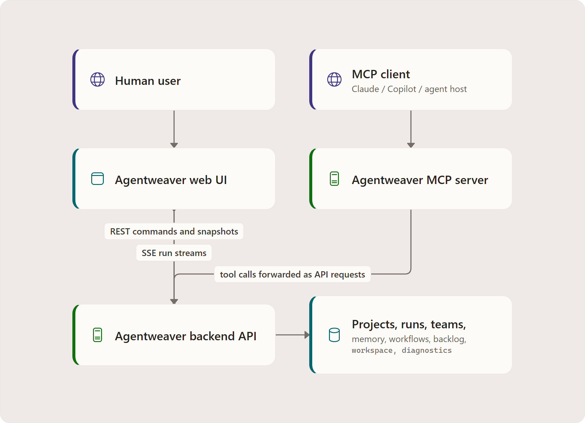
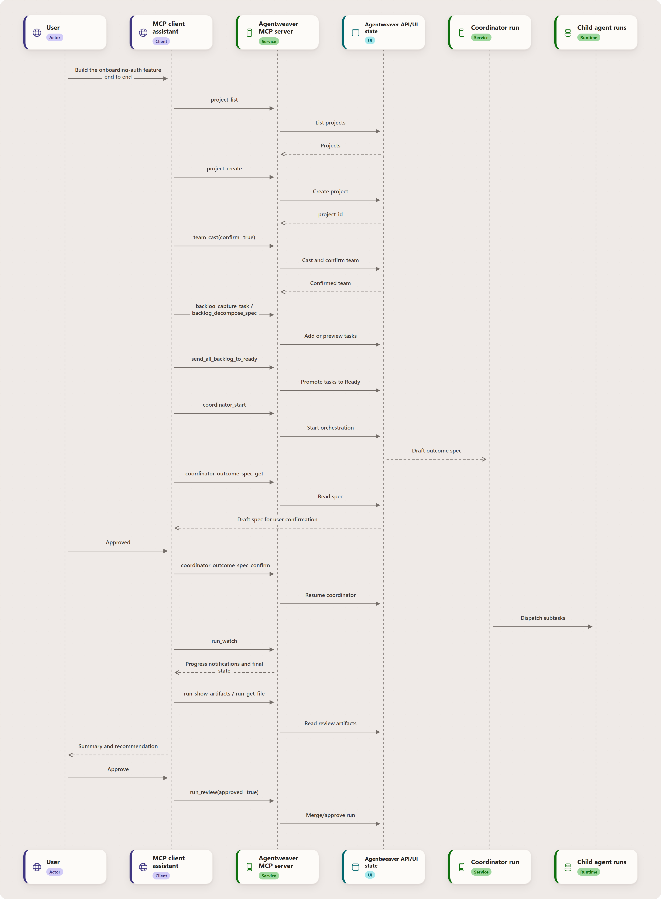

# Agentweaver experience overview

Agentweaver has two product surfaces: the web UI for people who need a visual, real-time control room and the MCP server for AI clients. This overview explains how the surfaces work together.

Scope note: this is an orientation document for using Agentweaver. It describes what the user sees and does; implementation details live in the architecture deep dives.

## The two surfaces

Agentweaver exposes one product through two front doors:

- **The web UI** is for humans. It is visual, navigable, and real-time. A user signs in, chooses a project, watches boards and timelines update, opens files, reviews output, steers coordinators, and changes project settings.
- **The MCP server** is for MCP clients such as Claude, Copilot, or other AI assistants. A client connects, authenticates, and invokes tools such as `project_create`, `coordinator_start`, `run_watch`, `team_cast`, and `memory_search`.

They are two front-ends over the same backend and data model. Projects, runs, coordinator orchestration, team rosters, memory, workflows, backlog items, sandbox policy, diagnostics, and workspace files are authoritative on the backend. The web UI renders those facts as pages, cards, graphs, timelines, and forms. The MCP server exposes the same facts and mutations as tools. Most actions a person performs in the web UI have a corresponding MCP tool an assistant can call.

<!-- Editable source: ../diagrams/src/experience-00-overview-fig1.drawio.
     Published PNG keeps its stable path; use the scoped draw.io authoring workflow. -->

The web UI and MCP server differ in interaction style, not in product intent:

| Surface | Best user | Interaction style | What it is best at |
|---|---|---|---|
| Web UI | Human operators, reviewers, project owners | Click, inspect, compare, approve, steer | Seeing state, understanding context, making judgment calls, watching live work |
| MCP server | AI assistants, automation agents, scripted clients | Connect, authenticate, call tools | Creating and updating work programmatically, chaining operations, asking an assistant to operate Agentweaver for you |

## Shared experience model

The core loop is the same from either surface:

1. **Choose or create a project.** A project binds Agentweaver to a working directory or GitHub repository and records project-level settings.
2. **Define work.** Capture a backlog task or start a coordinator goal.
3. **Run agents.** A run executes through a workflow pipeline and emits events as it moves through agent work, RAI, review, merge, and scribe steps.
4. **Watch progress.** The UI shows live timelines and graphs; MCP clients call status and watch tools.
5. **Review and decide.** Humans approve or reject work, steer agents, merge memory decisions, or change settings.
6. **Capture learning.** Team decisions, agent memory, and session context keep future work aligned.

Agentweaver treats the backend as the source of truth. The web UI loads snapshots for current state and consumes live run streams for what changes after the page opens. MCP tools call the same backend operations and return structured results the client can reason over.

For a live stream, the browser initiates the HTTP request; **event payloads flow from
API to browser**. `run_watch` likewise consumes API events and reports them through MCP
to the assistant. Neither stream makes the client authoritative for run state
(`apps/web/src/api/sse.ts:237`, `apps/Agentweaver.Mcp/Tools/RunTools.cs:229`).

## Web UI mental model

### Overview

The signed-in **Overview** page has four user-visible regions sourced from API calls
(`apps/web/src/pages/OverviewPage.tsx:365-389`):

- **Recent projects** links recently active projects with operational counts and queue pressure.
- **AI usage & performance** aggregates metrics for those recent projects, with a 7d/30d/90d selector. It is not an unqualified total for every project.
- **Activity feed** groups recent activity by day and shows an empty state when no rows exist.
- **Needs attention** surfaces health and work requiring attention rather than fabricating healthy activity.

Open **Overview** at `/overview` to inspect these live regions. The page polls and offers
manual refresh; an empty or unavailable metric is not a screenshot of successful work.

The web UI is a signed-in, project-aware control room. It uses a persistent app shell
for navigation, project switching, API health, the signed-in account, and starting work.
Entra identity remains distinct from connected GitHub capabilities.

### The app shell

The shell has three persistent areas:

- **Left navigation rail** — global destinations always appear at the top; project-scoped sections appear when Agentweaver has a project context. The rail can collapse to icon-only mode.
- **Top bar** — contains the project switcher and API reachability status.
- **Main content area** — renders the selected page.

The project switcher lists existing projects, groups recent projects, and preserves the current page category when switching projects where possible. For example, switching projects from Settings lands on the target project's Settings page; switching from an orchestration detail lands on the target project's Orchestrations page.

Global pages do not require a project id. When a user leaves a project for a global page, the shell remembers the last active project so project-scoped navigation still has useful targets.

### Navigation taxonomy

Agentweaver's web UI is organized into global destinations plus four project-scoped sections: **WORK**, **SQUAD**, **OPERATIONS**, and **SYSTEM**.

#### Global

| Destination | Route shape | What you do here |
|---|---|---|
| **Overview** | `/` and `/overview` | Inspect Recent projects, AI usage & performance, Activity feed, and Needs attention. |
| **Projects** | `/projects` | Browse projects, create a blank project, create a project from GitHub, choose a blueprint, and open a project. |
| **Sessions** | `/sessions` | Start or open Assistant conversations across projects. |
| **Assistant** | `/assistant` | Continue a personal conversation; optional project context does not make it a project work-focus session. |
| **Account settings** | `/settings` | Inspect authentication, AI access, GitHub connections, and MCP client setup. |
| **Platform settings** | `/platform-settings` | Platform Admin controls, including deployment AI source configuration. |

#### WORK

| Destination | Route shape | What you do here |
|---|---|---|
| **Dashboard** | `/projects/:projectId` | Review selected-range delivery metrics, active work, and the agent leaderboard. |
| **Board** | `/projects/:projectId/board` | Use Backlog, Ready, Active, and Done lanes plus Human Review and Problems attention groups; start work and open run details. |
| **Flow** | `/projects/:projectId/flow` | See what each agent is working on now, including active, queued, blocked, and done counts grouped by agent and orchestration. |
| **Orchestrations** | `/projects/:projectId/orchestrations` | List coordinator runs for the project and open the topology view for a multi-agent goal. |
| **Workspace** | `/projects/:projectId/workspace` | Browse the project repository and active run worktrees read-only; inspect files and decompose a spec file into backlog tasks. |

#### SQUAD

| Destination | Route shape | What you do here |
|---|---|---|
| **Agents** | `/projects/:projectId/team` | Manage the cast working on the project: inspect agents, view charters and capabilities, add members, retire members, re-role agents, and open the casting wizard. |
| **Memories** | `/projects/:projectId/memories` | Review Decisions, Agent memory, and project Session history; acceptance requires appropriate authority. |
| **Skills** | `/projects/:projectId/skills` | Build a per-project skill catalog, inspect provenance and status, and assign active skills to individual agents. |

#### OPERATIONS

| Destination | Route shape | What you do here |
|---|---|---|
| **Workflows** | `/projects/:projectId/workflows` | View reusable pipeline definitions, validate discovered workflows, sync from disk, generate a workflow, create a workflow, edit YAML, use the visual editor, and choose a project default. |

#### SYSTEM

| Destination | Route shape | What you do here |
|---|---|---|
| **Diagnostics** | `/projects/:projectId/diagnostics` | Run real diagnostics checks, switch between global and project scope, and inspect pass/warn/fail details with durations. |
| **Heartbeat** | `/projects/:projectId/heartbeat` | Monitor background automation status, coordinator heartbeat, checkpoint GC, recent ticks, errors, and service cadence. |
| **Cluster** | `/projects/:projectId/cluster` | Inspect pod claims, cluster health, and live resource topology. |
| **Observability** | `/projects/:projectId/observability` | Inspect project metrics and selected-range telemetry. |
| **Observability > Agents** | `/projects/:projectId/observability/agents` | Inspect the agent-level metrics breakdown. |
| **Observability > Traces** | `/projects/:projectId/observability/traces` | Preview hierarchical transaction traces for recent coordinator runs. |
| **Settings** | `/projects/:projectId/settings` | Change project configuration and policies; separate from Account and Platform settings. |

### Deep project destinations

Standalone workflow and execution pages are not part of the web UI. Run details appear in the coordinator orchestration page.

| Destination | Route shape | What you do here |
|---|---|---|
| **Coordinator run** | `/projects/:projectId/orchestrations/:runId` | Watch a coordinator topology, confirm or revise the outcome spec, inspect work plan and child runs, steer agents, view assembly status, and review collective output. |
| **Casting wizard** | `/projects/:projectId/team/cast` | Propose and confirm a project team using templates, goals, constraints, team size, and generated member charters. |

### Common web journey: project → board → orchestration → review

Most human work starts with a project and ends with review:

<!-- Shared editable source: ../diagrams/src/canonical-coordinator-journey.drawio.
     Exported by the official draw.io Desktop CLI. Changes belong to the shared owner. -->

A typical path looks like this:

1. The user opens **Projects**, creates or selects a project, and lands on **Dashboard**.
2. The user opens **Board** to see backlog and run buckets.
3. The user chooses **Define Outcome** for a reviewable outcome-spec gate, or **Direct**
   to start without that gate. Alternatively, the user promotes queued work to **Ready**
   for unattended pickup; that is not a reason to manually start the same goal again.
4. Agentweaver opens the orchestration detail page. The user sees the coordinator graph, embedded child sessions, tool and shell approval cards, file artifacts, and status badges.
5. If the run reaches human review, the user approves or rejects it. If the coordinator reaches a confirmation gate, the user confirms or revises the outcome spec before child work is dispatched.
6. After completion, the user reviews artifacts, memory, decisions, and board state.

The UI is optimized for judgment: seeing state, reading output, understanding why a run is blocked, comparing files, approving work, and steering the coordinator at the right time.

## MCP mental model

The MCP server turns Agentweaver into a tool catalog for AI assistants. Instead of clicking through pages, an MCP client connects to Agentweaver and calls tools grouped by domain.

### Connect and authenticate

Agentweaver supports two MCP transport shapes:

- **Hosted HTTP mode** exposes `/mcp` as a protected network resource. An MCP client discovers OAuth metadata, authenticates with Agentweaver's authorization flow, receives a bearer token for the MCP resource, and calls tools with that token.
- **Local stdio mode** is for MCP hosts that spawn the server process locally and communicate over standard input/output. It is suited to local single-user setups and does not use the hosted HTTP bearer challenge path.

In hosted mode, the MCP server is a thin Resource Server. It validates access at the MCP boundary, dispatches the requested tool, and forwards the caller's bearer token to the Agentweaver API so backend authorization sees the real user. The API remains authoritative for projects, runs, memory, team, workflow, backlog, and operations.

### Tool catalog by goal

The tool catalog is broad because it mirrors the product model. Use the generated
[MCP tool index](../reference/mcp-tools.md) and the connected server's `tools/list`
instead of a manually maintained tool count. The table below is a goal map, not a full catalog.

| Tool group | User goal it serves | Representative tools |
|---|---|---|
| **Backlog** | Capture, organize, promote, archive, and decompose work on the project board. | `backlog_capture_task`, `backlog_get_board`, `backlog_move_to_ready`, `backlog_set_settings`, `backlog_decompose_spec` |
| **Blueprint** | Start from predefined or generated project blueprints that bundle roster, workflow, review, and sandbox choices. | `list_blueprints`, `validate_blueprint`, `blueprint_generate` |
| **Catalog** | Discover reusable agent roles and casting scenarios. | `catalog_list_roles`, `catalog_list_scenarios` |
| **Coordinator** | Drive multi-agent work from a plain-language goal through outcome spec, work plan, child runs, topology, and steering. | `coordinator_start`, `coordinator_outcome_spec_confirm`, `coordinator_work_plan_get`, `coordinator_children_get`, `coordinator_steer`, `orchestration_topology` |
| **Diagnostics** | Inspect system health and background heartbeat state. | `diagnostics_get`, `heartbeat_status` |
| **GitHub capability** | Connect or remove a caller's Repo App and an Owner-authorized project's Copilot App capabilities. | `github_repo_app_connect`, `github_repo_app_authorization_status`, `github_repo_app_disconnect`, `project_copilot_app_connect`, `project_copilot_app_authorization_status`, `project_copilot_app_disconnect`, `project_github_capability_status` |
| **Memory** | Capture and govern decisions, inbox entries, agent memory, session context, and file import/export. | `decision_inbox_submit`, `decision_inbox_merge`, `decision_list`, `memory_record`, `memory_search`, `session_start`, `memory_export` |
| **Project** | List, create, inspect, configure, rename, delete projects, and list project runs. | `project_list`, `project_create`, `project_get`, `project_configure`, `project_list_runs` |
| **Run** | Watch, review, inspect artifacts, retry, and archive runs. | `run_status`, `run_watch`, `run_review`, `run_show_artifacts`, `run_get_file`, `run_retry` |
| **SandboxPolicy** | Read or change the sandbox policy for a repository. | `sandbox_policy_get`, `sandbox_policy_set` |
| **Skills** | Acquire project skills and assign them to agents. | `skill_list`, `skill_import_preview`, `skill_import`, `skill_assign`, `skill_assignments_list` |
| **Team** | Cast a team, inspect roster, add or retire members, and fetch charters. | `team_get`, `team_cast`, `team_member_add`, `team_member_retire`, `team_member_get_charter` |
| **Workflow** | List, inspect, sync, generate, and save reusable workflow definitions. | `workflows_list`, `workflow_get`, `workflows_sync`, `workflow_generate`, `workflow_save` |
| **Workspace** | Browse project workspace refs, file trees, and file contents. | `list_project_workspace_refs`, `list_project_workspace`, `get_project_workspace_file` |

### MCP flow: assistant-driven work

An assistant typically uses MCP in a loop like this:

<!-- Editable source: ../diagrams/src/experience-mcp-client-fig1.drawio.
     Shared with mcp-client.md; replaces the merged experience-00-overview-fig3. -->

The assistant can perform long chains quickly: create a project, apply a blueprint, cast a team, capture backlog, start a coordinator, poll topology, inspect artifacts, and submit memory. The human still owns judgment points: confirming outcome specs, approving risky actions, reviewing output, and deciding whether a team decision should become durable memory.

## UI ↔ MCP mapping

The table below maps major user goals to where a person goes in the web UI and which MCP tools an assistant uses for the same work.

| User goal | Web UI destination | MCP tool equivalents |
|---|---|---|
| **Create a project** | **Projects** → **Create blank project** or **Create from GitHub**; optionally choose a blueprint. | `project_create`, plus `list_blueprints`, `validate_blueprint`, or `blueprint_generate` when using a blueprint. |
| **Find or open a project** | **Overview** for active projects or **Projects** gallery for all projects; project switcher for recent/all projects. | `project_list`, `project_get`. |
| **Configure a project** | **Settings** → General for name and default model. | `project_configure`, `project_rename`, `project_delete`. |
| **Set sandbox behavior** | **Settings** → Sandbox policy. | `sandbox_policy_get`, `sandbox_policy_set`. |
| **Inspect review gates** | **Workflows** for definitions and **Coordinator run** for active review; the current Settings rail has no Review policy tab. | `workflows_list`, `workflow_get`, and `workflow_save` for workflow-level gates; `run_review` for execution-time review decisions. No dedicated review-policy settings tool is implied. |
| **Start coordinator work** | **Board** → **Start task** and open the coordinator run. | `coordinator_start`. |
| **Watch a run** | **Coordinator run** and the selected task's **Agent session** panel. | `run_status`, `run_watch`. |
| **Review or approve a run** | **Coordinator run** → human review and artifacts. | `run_review` (approve or decline). |
| **Inspect run artifacts** | Orchestration or selected-task artifacts and diff/content panels. | `run_show_artifacts`, `run_get_file`. |
| **Retry or archive a run** | **Board** or run lists for active/terminal run management. | `run_retry`, `run_archive`, `backlog_archive_task`. |
| **Coordinate a multi-agent goal** | **Board** → start orchestration, or floating start-orchestration action; then **Orchestrations** / coordinator detail. | `coordinator_start`. |
| **Confirm or revise coordinator intent** | **Coordinator run** → outcome spec panel. | `coordinator_outcome_spec_get`, `coordinator_outcome_spec_confirm`, `coordinator_outcome_spec_revise`. |
| **Understand coordinator topology** | **Coordinator run** → Coordinator Graph, child runs, agent rail, assembly panels. | `coordinator_work_plan_get`, `coordinator_children_get`, `orchestration_topology`, `run_watch`. |
| **Steer active coordinator work** | **Coordinator run** → steer controls for recover, redirect, amend, and stop. | `coordinator_steer`. |
| **Manage team / cast agents** | **Agents** and **Casting wizard**. | `team_get`, `team_cast`, `team_member_add`, `team_member_retire`, `team_member_get_charter`, plus `catalog_list_roles` and `catalog_list_scenarios`. |
| **Manage decisions and memory** | **Memories** → Decisions and Agent memory tabs. | `decision_inbox_submit`, `decision_inbox_list`, `decision_inbox_merge`, `decision_inbox_reject`, `decision_create`, `decision_list`, `decision_update`, `squad_decide`, `memory_record`, `memory_list`, `memory_get`, `memory_search`. |
| **Manage session context** | **Memories → Session history** for project work focus, distinct from global Assistant conversations. | `session_start`, `session_current`, `session_update`. |
| **Import/export memory files** | **Memories** and workspace-backed team context. | `memory_export`, `memory_import`. |
| **Manage workflows** | **Workflows** page: list, sync, generate, create, edit YAML, visual editor, set default. | `workflows_list`, `workflow_get`, `workflows_sync`, `workflow_generate`, `workflow_save`. |
| **Manage backlog** | **Board** kanban columns and **Workspace** spec decomposition. | `backlog_capture_task`, `backlog_edit_task`, `backlog_delete_task`, `backlog_get_board`, `backlog_move_to_ready`, `backlog_move_to_backlog`, `backlog_reorder_task`, `send_all_backlog_to_ready`, `backlog_get_workflow_stages`, `backlog_get_settings`, `backlog_set_settings`, `backlog_decompose_spec`. |
| **Browse workspace files** | **Workspace** page: select base branch or active run worktree, open file tree, inspect file content. | `list_project_workspace_refs`, `list_project_workspace`, `get_project_workspace_file`. |
| **Operate and diagnose** | **Diagnostics**, **Heartbeat**, **Cluster**, and **Observability**. | `diagnostics_get`, `heartbeat_status`; no dedicated Cluster or full Observability tool parity is implied. |
| **Manage GitHub capability** | Connect the Repo App in a browser; Project Owners can also connect the project Copilot App. | `github_repo_app_connect`, `github_repo_app_authorization_status`, `github_repo_app_disconnect`, `project_copilot_app_connect`, `project_copilot_app_authorization_status`, `project_copilot_app_disconnect`, `project_github_capability_status`. |

## Which surface should I use?

Use the **web UI** when the task benefits from visual context or human judgment:

- You need to see the board and decide what matters next.
- You are reviewing a run, approving work, rejecting output, or reading file changes.
- You are steering a coordinator and want to understand topology, child status, and assembly state.
- You are managing a team roster, inspecting charters, or comparing agent capabilities.
- You are diagnosing system state and want pass/warn/fail cards, recent ticks, and live refresh.

Use the **MCP server** when the task benefits from assistant-driven execution or automation:

- You want an AI assistant to create or configure projects.
- You want to capture backlog, submit runs, or coordinate a goal from natural language.
- You want a client to watch progress, summarize state, and ask you only when judgment is required.
- You want to script repeatable operations across projects, runs, workflows, memory, or diagnostics.
- You want an assistant to inspect workspace files and run artifacts without manually navigating the UI.

Use **both** for complex work. A common pattern is: ask an MCP client to start and monitor work, then open the web UI when a review, approval, topology question, file inspection, or operational diagnosis needs human attention.

## Experience principles

### One backend, two front-ends

Agentweaver avoids split-brain behavior by keeping durable state in the backend. The web UI does not invent project state, run state, topology, memory, or workflow definitions. The MCP server does not become a separate business service. Both surfaces ask the backend for facts and submit user-authorized mutations.

### Human control at decision points

Agentweaver lets agents do work, but the experience keeps important decisions visible. Outcome specs are confirmable. Human review is explicit. Coordinator steering is a first-class control. Decision inbox entries can be merged or rejected. Sandbox and review policies are configurable project settings.

### Live work is observable

Runs are eventful. The UI presents streams as timelines, graph state, topology, status badges, approval cards, file artifacts, and assembly panels. MCP clients use `run_watch`, `run_status`, and topology tools to observe the same work in a machine-readable way.

### Project context stays stable

The shell keeps project navigation, switching, health, and identity visible across pages. Deep links are normal URLs for supported pages such as orchestration details. Project switching preserves category when possible. Global pages keep enough remembered project context to make navigation feel continuous.

### Teams and memory shape future work

Agentweaver treats the squad as part of the product, not just a runtime detail. Agents have roles, charters, capabilities, and histories. Decisions and memory turn learning into durable context. This gives both the web UI and MCP clients a shared way to align future work.

## Read next

Use this overview as the hub for the experience documentation set:

- [Onboarding & auth](./onboarding-auth.md)
- [Projects](./projects.md)
- [Runs, board & watch](./runs-board-watch.md)
- [Coordinator orchestration](./coordinator-orchestration.md)
- [Review, workspace & merge](./review-workspace-merge.md)
- [Team casting & memory](./team-casting-memory.md)
- [Workflows & backlog](./workflows-backlog.md)
- [Operations](./operations.md)
- [MCP client](./mcp-client.md)

<!-- diagram-context:canonical-coordinator-journey:start -->

Diagram details and constraints

<table><thead><tr><th>Element</th><th>Contract</th></tr></thead><tbody>
<tr><td>title</td><td>One goal, one collective review</td></tr>
<tr><td>subtitle</td><td>Confirm intent, dispatch bounded work, then integrate and review the whole result.</td></tr>
<tr><td>group-title0</td><td>Plan and execute</td></tr>
<tr><td>group-title1</td><td>Integrate, review, finish</td></tr>
<tr><td>Confirm intent</td><td>Confirm intent</td></tr>
<tr><td>Confirm intent</td><td>Draft the OutcomeSpec</td></tr>
<tr><td>Confirm intent</td><td>human confirmation</td></tr>
<tr><td>Plan the work</td><td>Plan the work</td></tr>
<tr><td>Plan the work</td><td>Persist a WorkPlan DAG</td></tr>
<tr><td>Plan the work</td><td>subtasks + dependencies</td></tr>
<tr><td>Dispatch children</td><td>Dispatch children</td></tr>
<tr><td>Dispatch children</td><td>Run the eligible frontier</td></tr>
<tr><td>Dispatch children</td><td>per-child worktrees</td></tr>
<tr><td>Merge + Scribe</td><td>Merge + Scribe</td></tr>
<tr><td>Merge + Scribe</td><td>Approved integration path</td></tr>
<tr><td>Merge + Scribe</td><td>MergeWorktree → Scribe</td></tr>
<tr><td>Collective review</td><td>Collective review</td></tr>
<tr><td>Collective review</td><td>One human decision</td></tr>
<tr><td>Collective review</td><td>approve / revise / decline</td></tr>
<tr><td>Integrate + gates</td><td>Integrate + gates</td></tr>
<tr><td>Integrate + gates</td><td>Assemble child branches</td></tr>
<tr><td>Integrate + gates</td><td>configured checks / review</td></tr>
<tr><td>e1</td><td>confirm</td></tr>
<tr><td>e2</td><td>dispatch</td></tr>
<tr><td>e3</td><td>settled work</td></tr>
<tr><td>e4</td><td>request review</td></tr>
<tr><td>e5</td><td>approve</td></tr>
<tr><td>assurance-title</td><td>DO NOT CONFUSE ASSEMBLY WITH PUBLICATION</td></tr>
<tr><td>assurance-line1</td><td>The collective workflow reaches MergeWorktree and Scribe; this graphic does not promise PR creation.</td></tr>
<tr><td>assurance-line2</td><td>A blocked assembly can be recovered. Review approval does not itself mark the run complete.</td></tr>
<tr><td>Confirm intent</td><td>Input</td></tr>
<tr><td>Confirm intent</td><td>Human goal</td></tr>
<tr><td>Confirm intent</td><td>Artifact</td></tr>
<tr><td>Confirm intent</td><td>OutcomeSpec</td></tr>
<tr><td>Confirm intent</td><td>Gate</td></tr>
<tr><td>Confirm intent</td><td>Confirm or revise</td></tr>
<tr><td>Confirm intent</td><td>Scope</td></tr>
<tr><td>Confirm intent</td><td>Explicit assumptions</td></tr>
<tr><td>Plan the work</td><td>Select</td></tr>
<tr><td>Plan the work</td><td>Workflow choice</td></tr>
<tr><td>Plan the work</td><td>WorkPlan DAG</td></tr>
<tr><td>Plan the work</td><td>Owners</td></tr>
<tr><td>Plan the work</td><td>Named subtasks</td></tr>
<tr><td>Plan the work</td><td>Store</td></tr>
<tr><td>Plan the work</td><td>Persist dependencies</td></tr>
<tr><td>Dispatch children</td><td>Ready</td></tr>
<tr><td>Dispatch children</td><td>Satisfied dependencies</td></tr>
<tr><td>Dispatch children</td><td>Files</td></tr>
<tr><td>Dispatch children</td><td>Child-owned worktree</td></tr>
<tr><td>Dispatch children</td><td>Observe</td></tr>
<tr><td>Dispatch children</td><td>Child status / results</td></tr>
<tr><td>Dispatch children</td><td>Failure</td></tr>
<tr><td>Dispatch children</td><td>Blocks dependents</td></tr>
<tr><td>Merge + Scribe</td><td>Merge</td></tr>
<tr><td>Merge + Scribe</td><td>Reviewed integration</td></tr>
<tr><td>Merge + Scribe</td><td>Then</td></tr>
<tr><td>Merge + Scribe</td><td>Collective Scribe</td></tr>
<tr><td>Merge + Scribe</td><td>Record</td></tr>
<tr><td>Merge + Scribe</td><td>Promote decisions</td></tr>
<tr><td>Merge + Scribe</td><td>Decline</td></tr>
<tr><td>Merge + Scribe</td><td>Skips Scribe</td></tr>
<tr><td>Collective review</td><td>Approve</td></tr>
<tr><td>Collective review</td><td>Proceed to merge</td></tr>
<tr><td>Collective review</td><td>Revise</td></tr>
<tr><td>Collective review</td><td>Steer / redispatch</td></tr>
<tr><td>Collective review</td><td>No Scribe path</td></tr>
<tr><td>Collective review</td><td>Blocked</td></tr>
<tr><td>Collective review</td><td>Recoverable state</td></tr>
<tr><td>Integrate + gates</td><td>Child branches</td></tr>
<tr><td>Integrate + gates</td><td>Target</td></tr>
<tr><td>Integrate + gates</td><td>Integration branch</td></tr>
<tr><td>Integrate + gates</td><td>Gates</td></tr>
<tr><td>Integrate + gates</td><td>Selected checks</td></tr>
<tr><td>Integrate + gates</td><td>Output</td></tr>
<tr><td>intent</td><td>Scope and assumptions are explicit; Revision reopens the intent gate</td></tr>
<tr><td>plan</td><td>Outcome-complete decomposition; Bounded work with named owners</td></tr>
<tr><td>dispatch</td><td>Observe child status and results; Failure / RAI blocks dependents</td></tr>
<tr><td>finish</td><td>Decline skips Scribe; No automatic PR claim here</td></tr>
<tr><td>review</td><td>Changes can redispatch work; Blocked is recoverable, not terminal</td></tr>
<tr><td>integrate</td><td>Collective—not per-child delivery; Merge failure may still run Scribe</td></tr>
<tr><td>notes</td><td>DO NOT CONFUSE ASSEMBLY WITH PUBLICATION; The collective workflow reaches MergeWorktree and Scribe; this graphic does not promise PR creation.; A blocked assembly can be recovered. Review approval does not itself mark the run complete.</td></tr>
<tr><td>groups</td><td>Plan and execute; Integrate, review, finish</td></tr>
</tbody></table>

<!-- diagram-context:canonical-coordinator-journey:end -->

<!-- diagram-context:experience-00-overview-fig1:start -->

Diagram details and constraints

<table><thead><tr><th>Element</th><th>Contract</th></tr></thead><tbody>
<tr><td>title</td><td>Two front doors, one product</td></tr>
<tr><td>takeaway</td><td>Web and MCP share authorization and authoritative state; events flow back to clients.</td></tr>
<tr><td>group-title-0</td><td>PEOPLE AND CLIENTS</td></tr>
<tr><td>group-title-1</td><td>AUTHORITATIVE BACKEND</td></tr>
<tr><td>Human operator</td><td>Human operator</td></tr>
<tr><td>Human operator</td><td>Inspect and decide</td></tr>
<tr><td>Human operator</td><td>browser or assistant</td></tr>
<tr><td>Human operator</td><td>Choose the interface, not a different product.</td></tr>
<tr><td>Web UI</td><td>Web UI</td></tr>
<tr><td>Web UI</td><td>Project and run views</td></tr>
<tr><td>Web UI</td><td>REST + stream request</td></tr>
<tr><td>Web UI</td><td>Opens the watch request; receives API event payloads.</td></tr>
<tr><td>MCP client</td><td>MCP client</td></tr>
<tr><td>MCP client</td><td>Assistant tool caller</td></tr>
<tr><td>MCP client</td><td>tool result + progress</td></tr>
<tr><td>MCP client</td><td>Makes explicit tool calls; surfaces decisions to people.</td></tr>
<tr><td>Product state</td><td>Product state</td></tr>
<tr><td>Product state</td><td>Projects, teams, runs</td></tr>
<tr><td>Product state</td><td>knowledge + workspaces</td></tr>
<tr><td>Product state</td><td>API-authorized reads and mutations; no MCP bypass.</td></tr>
<tr><td>Agentweaver API</td><td>Agentweaver API</td></tr>
<tr><td>Agentweaver API</td><td>Authorization boundary</td></tr>
<tr><td>Agentweaver API</td><td>run snapshots + events</td></tr>
<tr><td>Agentweaver API</td><td>Owns resource checks and access to product state.</td></tr>
<tr><td>MCP server</td><td>MCP server</td></tr>
<tr><td>MCP server</td><td>Authenticated adapter</td></tr>
<tr><td>MCP server</td><td>validated broker bearer</td></tr>
<tr><td>MCP server</td><td>Forwards the exact caller token to the API.</td></tr>
<tr><td>e0</td><td>inspect</td></tr>
<tr><td>e1</td><td>requests</td></tr>
<tr><td>e2</td><td>SSE events</td></tr>
<tr><td>e3</td><td>tool call</td></tr>
<tr><td>e4</td><td>result</td></tr>
<tr><td>e5</td><td>forward</td></tr>
<tr><td>e6</td><td>API result</td></tr>
<tr><td>e7</td><td>access</td></tr>
<tr><td>note</td><td>Browser opens the connection; API sends event payloads. MCP results return through MCP.</td></tr>
<tr><td>n0</td><td>Choose the interface,
not a different product.</td></tr>
<tr><td>n1</td><td>Opens the watch request;
receives API event payloads.</td></tr>
<tr><td>n2</td><td>Makes explicit tool calls;
surfaces decisions to people.</td></tr>
<tr><td>n3</td><td>API-authorized reads and
mutations; no MCP bypass.</td></tr>
<tr><td>n4</td><td>Owns resource checks and
access to product state.</td></tr>
<tr><td>n5</td><td>Forwards the exact caller
token to the API.</td></tr>
<tr><td>groups</td><td>PEOPLE AND CLIENTS; AUTHORITATIVE BACKEND</td></tr>
</tbody></table>

<!-- diagram-context:experience-00-overview-fig1:end -->

<!-- diagram-context:experience-mcp-client-fig1:start -->

Diagram details and constraints

<table><thead><tr><th>Element</th><th>Contract</th></tr></thead><tbody>
<tr><td>title</td><td>Assistant-driven work</td></tr>
<tr><td>takeaway</td><td>Choose one intake path, inspect the result, and preserve explicit human decisions.</td></tr>
<tr><td>group-title-0</td><td>PREPARE AND CHOOSE</td></tr>
<tr><td>group-title-1</td><td>OPERATE AND REVIEW</td></tr>
<tr><td>Human + assistant</td><td>Human + assistant</td></tr>
<tr><td>Human + assistant</td><td>Agree on the work</td></tr>
<tr><td>Human + assistant</td><td>MCP calls -&gt; API</td></tr>
<tr><td>Human + assistant</td><td>The assistant explains actions; a person supplies judgment.</td></tr>
<tr><td>Project and team</td><td>Project and team</td></tr>
<tr><td>Project and team</td><td>Inspect or create</td></tr>
<tr><td>Project and team</td><td>propose -&gt; confirm cast</td></tr>
<tr><td>Project and team</td><td>Named roles and charters belong to the project.</td></tr>
<tr><td>Choose intake</td><td>Choose intake</td></tr>
<tr><td>Choose intake</td><td>Queue OR start now</td></tr>
<tr><td>Choose intake</td><td>do not start twice</td></tr>
<tr><td>Choose intake</td><td>Ready pickup is an alternative to an immediate start.</td></tr>
<tr><td>Human review</td><td>Human review</td></tr>
<tr><td>Human review</td><td>Read before deciding</td></tr>
<tr><td>Human review</td><td>run_review: boolean</td></tr>
<tr><td>Human review</td><td>MCP approve/decline is binary. Feedback uses other surfaces.</td></tr>
<tr><td>State and artifacts</td><td>State and artifacts</td></tr>
<tr><td>State and artifacts</td><td>Watch, list, read</td></tr>
<tr><td>State and artifacts</td><td>API -&gt; MCP -&gt; client</td></tr>
<tr><td>State and artifacts</td><td>Progress and results return through the MCP adapter.</td></tr>
<tr><td>Coordinator</td><td>Coordinator</td></tr>
<tr><td>Coordinator</td><td>Runs and child work</td></tr>
<tr><td>Coordinator</td><td>status / children / watch</td></tr>
<tr><td>Coordinator</td><td>Queued: claim then unattended. Direct: no outcome gate.</td></tr>
<tr><td>e0</td><td>prepare</td></tr>
<tr><td>e1</td><td>choose</td></tr>
<tr><td>e2</td><td>start once</td></tr>
<tr><td>e3</td><td>observe</td></tr>
<tr><td>e4</td><td>inspect</td></tr>
<tr><td>note</td><td>Define Outcome is the third start variant: draft, obtain authorized confirmation, then dispatch.</td></tr>
<tr><td>n0</td><td>The assistant explains actions;
a person supplies judgment.</td></tr>
<tr><td>n1</td><td>Named roles and charters
belong to the project.</td></tr>
<tr><td>n2</td><td>Ready pickup is an alternative
to an immediate start.</td></tr>
<tr><td>n3</td><td>MCP approve/decline is binary.
Feedback uses other surfaces.</td></tr>
<tr><td>n4</td><td>Progress and results return
through the MCP adapter.</td></tr>
<tr><td>n5</td><td>Queued: claim then unattended.
Direct: no outcome gate.</td></tr>
<tr><td>groups</td><td>PREPARE AND CHOOSE; OPERATE AND REVIEW</td></tr>
</tbody></table>

<!-- diagram-context:experience-mcp-client-fig1:end -->
