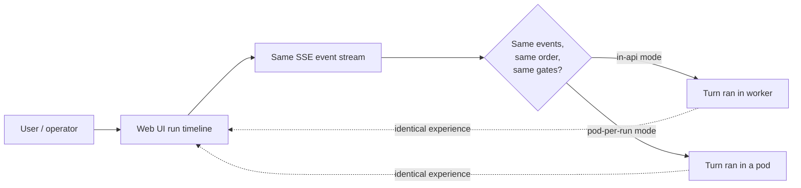
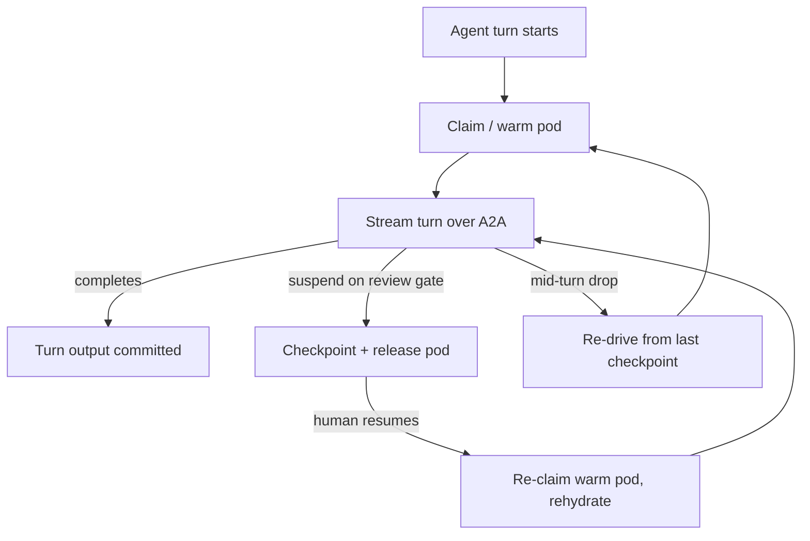

# Distributed agents over A2A — Experience

::: warning Experimental transport
Distributed agent execution rides on the A2A transport, which is built on a `-preview` package line and gated behind a runtime flag. When the flag is off (`in-api`), agents run in-process exactly as they always have. Nothing in the *experience* below changes between the two modes — that invisibility is the whole point — but operators should know the path is preview-staged and instantly reversible.
:::

This doc describes what it **feels like** to run agents distributed across sandbox pods over A2A — for the person watching a run and for the operator running the platform. The short version: it feels like nothing changed. The transport is invisible by design. What changes is *operational*, not *experiential*.

For the design, read the [A2A bridge deep dive](../deep-dive/a2a-bridge.md). For the surface and security gates, read the [A2A reference](../reference/a2a.md). For the pod lifecycle itself, see [Sandbox pod execution](../deep-dive/sandbox-pod-execution.md) and its [experience doc](../experience/sandbox-pod-execution.md).

## 1. The headline: runs behave identically to in-process

A run that executes its agent turns inside pods produces the **same timeline, in the same order, with the same review gates** as a run that executes in-process. From the user's seat:

- The run timeline streams the same events, token-by-token, with no new "remote" markers and no gaps.
- Review and confirmation gates appear at exactly the same points and behave identically — they pause the run, wait for a human, and resume.
- A coordinator orchestration drafts the same OutcomeSpec, suspends at the same confirmation gate, and dispatches the same child runs.

There is no "distributed mode" toggle in the UI, no different progress bar, no transport indicator. A user cannot tell from the experience whether a turn ran in the worker process or in a pod across the cluster. **That is the design goal, not a happy accident.**

## 2. Why the transport is invisible

The reason the experience is identical is structural, and it is worth understanding even from the user's side. Only the **leaf agent turn** moves into a pod. The orchestration graph — the part that raises timeline events and runs the review gates — **stays in the worker**. So:

- The events you watch are produced by the same graph in the same place, whether or not the leaf turn is remote.
- The review/confirm gates are graph constructs that live in the worker; they never travel over the wire, so they behave exactly as before.
- The pod streams the turn's output back, and the worker re-injects it into the same event stream that feeds the browser.

In other words, the only thing that relocated is the heavy model work. The *narrative* of the run — its events, its gates, its ordering — never left home. See the [coordinator orchestration experience](../experience/coordinator-orchestration.md) for that narrative in detail; distributed execution does not alter it.

## 3. What actually changes — and it is operational

The differences are all on the operations side.

| Aspect | In-process (`in-api`) | Distributed (`pod-per-run`) |
|---|---|---|
| Where a turn runs | In the worker process | In a per-run sandbox pod |
| Isolation | Shared worker process | Kata-isolated pod, scoped credential, default-deny egress |
| Memory footprint | Worker holds every active session | Heavy SDK session lives and dies in the pod |
| Failure blast radius | A bad turn can pressure the worker | A bad turn is contained to its pod |
| What an operator watches | Worker pods | Worker pods **plus** sandbox pods |

The operational wins are isolation and memory relief: the heavyweight model session leaves the worker process and runs in a disposable, isolated pod. A run no longer keeps a heavy session pinned in a shared process, which is the memory-pressure fix. And a misbehaving turn is contained inside its own Kata-isolated pod rather than sharing the worker's address space.

## 4. How to reason about it as an operator

A few mental models keep distributed execution easy to reason about.

**The pod is disposable; the run is durable.** Pods come and go. Durable resume does not live in the pod or in the A2A connection — it lives in Agentweaver's checkpoint store. When a run suspends on a review gate or a coordinator idles, the pod can be **checkpointed and released**, and a warm pod is re-claimed and rehydrated on resume. A user watching the run sees a normal pause at a gate, not a pod lifecycle event.

**A dropped connection re-drives a turn, it does not lose it.** A2A's live stream has no mid-stream replay. If a pod or its connection drops mid-turn, the worker re-drives that turn from the last checkpoint. To a watcher this looks like the turn continuing; the timeline does not duplicate, because re-injection is idempotent. There is no manual recovery step for the common case.

**The transport is the sole wire, and the rollback is a flag.** A2A is the only wire transport for agent turns. If anything goes wrong with it, the rollback is not "switch to another protocol" — it is `Sandbox:AgentExecutionMode=in-api`, which reverts to in-process execution instantly. Operators reason about *one* transport and *one* flag, not a matrix of fallback protocols.

**More pods to watch, same run model.** The new operational surface is sandbox pods alongside worker pods. Their warm-pool sizing, isolation, and credential model are covered in [sandbox pods reference](../reference/sandbox-pods.md). The run timeline, review gates, and event stream you already know are unchanged.

## 5. Where you see it: Web UI, MCP, and diagnostics

- **Web UI.** The run and board views are unchanged. The timeline, token streaming, and review/merge surfaces look and behave the same in both execution modes. There is no transport widget to learn.
- **MCP.** The MCP tool surface that drives and observes runs is unchanged — starting, confirming, watching, steering, and reviewing a run work identically whether turns are in-process or distributed. (The MCP server itself is a separate inbound surface; see the [MCP server deep dive](../deep-dive/mcp-server.md) and [MCP client experience](../experience/mcp-client.md).)
- **Diagnostics.** Where distributed execution *does* become visible is in operational diagnostics: pod counts, warm-pool state, per-run pod claims, and the execution-mode flag. These are operator-facing signals, not user-facing run state. East-west connectivity and the bridge's health belong to [agent communication](../deep-dive/agent-communication.md).

## 6. The one caveat to keep in mind

The transport is preview-staged. The experience is designed to be identical and the path is instantly reversible via the `in-api` flag, but the underlying A2A package line is `-preview` and pinned by version+hash until it reaches GA. For most users this is invisible; for operators it is the reason `in-api` stays the default until the distributed path completes soak. The honest framing — strong isolation and memory relief, bought with a pinned, flag-gated preview dependency and a one-flag rollback — is detailed in the [A2A reference](../reference/a2a.md) and the [A2A bridge deep dive](../deep-dive/a2a-bridge.md).
