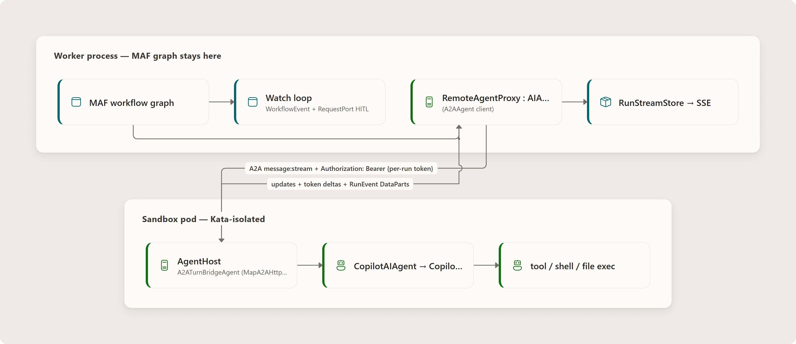
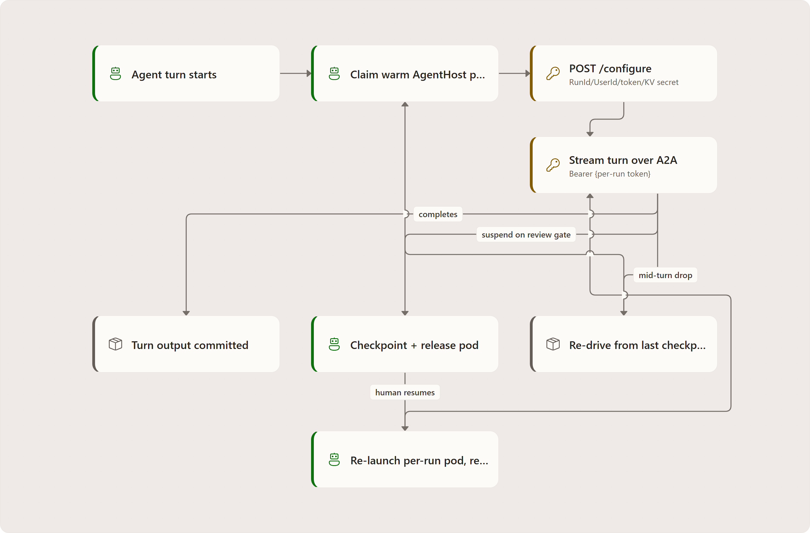

# Distributed agents over A2A — Experience

::: warning Experimental transport
Distributed agent execution uses A2A and a pinned `-preview` package line. `Sandbox:AgentExecutionMode` selects in-process (`in-api`) or remote (`pod-per-run`) leaf turns. The code default is `in-api`; the checked-in Kubernetes API and worker deployments select `pod-per-run`. Changing this configuration is a deployment operation, not an instantaneous migration of active turns.
:::

This doc describes remote execution for the person watching a run and the operator running the platform. The run and review model stays familiar, but pod placement, provisioning delays, and transport failures can be visible.

For the design, read the [A2A bridge deep dive](../deep-dive/a2a-bridge.md). For the surface and security gates, read the [A2A reference](../reference/a2a.md). For the pod lifecycle itself, see [Sandbox pod execution](../deep-dive/sandbox-pod-execution.md) and its [experience doc](../experience/sandbox-pod-execution.md).

## 1. The headline: the run model stays in the worker

A remote leaf turn feeds the existing run timeline and workflow gates. From the user's seat:

- The worker records returned events in arrival order and exposes them through the existing event stream.
- Review and confirmation gates remain worker-owned; execution mode does not decide which gates a workflow requires.
- Coordinator launch mode still matters: Define Outcome requests confirmation, while Direct and unattended pickup do not add that manual gate.

There is no user-facing execution-mode switch. The topology can show a per-node pod indicator, and an interrupted remote turn can surface a structured failure. Familiar workflow semantics do not mean guaranteed gap-free streaming or invisible recovery.

<!-- Editable source: ../diagrams/drawio/generated/canonical-a2a-execution.drawio.
     Published PNG path is stable; visual validation belongs to the diagram owner. -->

## 2. What crosses the transport boundary

Only the **leaf agent turn** moves into a pod. The orchestration graph — including review gates and checkpoint management — **stays in the worker**. So:

- Workflow events remain worker-owned; the pod's turn events are decoded and recorded by the worker.
- The review/confirm gates are graph constructs that live in the worker; they never travel over the wire, so they behave exactly as before.
- The pod streams the turn's output back, and the worker re-injects it into the same event stream that feeds the browser.

The pod has no checkpoint-store or database connection. Durable checkpoints and run events are written through the worker, not directly by AgentHost. See the [coordinator orchestration experience](./coordinator-orchestration.md) for the surrounding workflow.

## 3. What actually changes — and it is operational

The main operational differences are:

| Aspect | In-process (`in-api`) | Distributed (`pod-per-run`) |
|---|---|---|
| Where a turn runs | In the worker process | In a warm AgentHost sandbox pod configured for the run |
| Isolation | Shared worker process | Kata-isolated pod, scoped credential, default-deny egress |
| Memory footprint | Worker holds every active session | Heavy SDK session lives and dies in the pod |
| Failure blast radius | A bad turn can pressure the worker | A bad turn is contained to its pod |
| What an operator watches | Worker pods | Worker pods **plus** sandbox pods |

The operational wins are isolation and memory relief: the heavyweight model session leaves the worker process and runs in a disposable, isolated pod. A run no longer keeps a heavy session pinned in a shared process, which is the memory-pressure fix. And a misbehaving turn is contained inside its own Kata-isolated pod rather than sharing the worker's address space.

## 4. How to reason about it as an operator

A few mental models keep distributed execution easy to reason about.

**The pod is disposable; recovery depends on durable state.** Checkpoint state and the serialized session blob live outside the A2A connection. At a workflow review gate, `RunWatchLoopService` attempts pod release only when pod-per-run and `Sandbox:ReleasePodOnSuspend=true` are active. Resume uses recoverable checkpoint/session state and a newly claimed/configured pod. Release is best-effort, and retained assembly/preview resources are an exception: do not assume every human wait holds zero pods.

**A dropped connection is not transparent replay.** A2A's live stream has no mid-stream replay. Missing `agent.turn.end` produces retryable `agent_host_turn_incomplete`; transport exceptions become `a2a_transport_failure`, with retryability determined from the failure. These visible failures let the coordinator deliberately redispatch or follow its recovery policy. They do not guarantee uninterrupted output, duplicate-free side effects, or recovery without an operator decision.

**The transport is the sole leaf-turn wire.** `Sandbox:AgentExecutionMode=in-api` selects local leaf execution instead of another remote protocol. Apply the configuration through the deployment process and check running work and capacity; it does not move an already executing remote turn into the worker.

**Every turn is authenticated to that run's pod.** The worker path is `API/worker → claim warm pod → POST /configure → RemoteAgentProxy → Authorization: Bearer {per-run token} → AgentHost message:stream`. The token is generated at run launch, delivered by `/configure`, and accepted only by that pod. NetworkPolicy and mTLS still restrict who can reach the listener, but the turn endpoint also has application-layer bearer auth.

**More pods to watch, same run model.** The new operational surface is sandbox pods alongside worker pods. Their warm-pool sizing, isolation, and credential model are covered in [sandbox pods reference](../reference/sandbox-pods.md). The run timeline, review gates, and event stream you already know are unchanged.

Check the actual transport configuration: the base AgentHost ConfigMap has `RequireMtls=false` for its
PoC path, while the production overlay enables mTLS. Do not infer production TLS posture merely from
the presence of a pod or a bearer token.

<!-- Editable source: ../diagrams/drawio/generated/experience-a2a-distributed-agents-fig2.drawio.
     Published PNG path is stable; visual validation belongs to the diagram owner. -->

## 5. Where you see it: Web UI, MCP, and diagnostics

- **Web UI.** The existing timeline and review/merge surfaces remain. Pod indicators show recorded placement, and provisioning or remote-turn failures can appear in run state.
- **MCP.** The MCP tool surface that drives and observes runs is unchanged — starting, confirming, watching, steering, and reviewing a run work identically whether turns are in-process or distributed. (The MCP server itself is a separate inbound surface; see the [MCP server deep dive](../deep-dive/mcp-server.md) and [MCP client experience](../experience/mcp-client.md).)
- **Diagnostics.** Cluster health, warm-pool readiness, and per-run claims complement the run view. The checked-in AgentHost warm-pool target is two, not a guarantee that two pods are currently ready. East-west connectivity and bridge health belong to [agent communication](../deep-dive/agent-communication.md).

## 6. The one caveat to keep in mind

The transport dependency is preview-staged even though the checked-in Kubernetes deployments select remote execution. Treat code defaults, deployed configuration, and live cluster health as separate facts. The [A2A reference](../reference/a2a.md) and [A2A bridge deep dive](../deep-dive/a2a-bridge.md) cover the transport contract; neither a preview dependency nor a mode switch promises transparent recovery.

<!-- diagram-context:canonical-a2a-execution:start -->

Diagram details and constraints

<table><thead><tr><th>Element</th><th>Contract</th></tr></thead><tbody>
<tr><td>title</td><td>Remote leaves, worker-owned graph</td></tr>
<tr><td>takeaway</td><td>A2A moves leaf turns into sandbox pods, not orchestration or durable state ownership.</td></tr>
<tr><td>group-title-0</td><td>WORKER CONTROL PLANE</td></tr>
<tr><td>group-title-1</td><td>LEAF EXECUTION AND DURABILITY</td></tr>
<tr><td>Workflow graph</td><td>Workflow graph</td></tr>
<tr><td>Workflow graph</td><td>Orchestration and gates</td></tr>
<tr><td>Workflow graph</td><td>RequestPort / checkpoints</td></tr>
<tr><td>Workflow graph</td><td>Graph progression and human gates stay worker-side.</td></tr>
<tr><td>RemoteAgentProxy</td><td>RemoteAgentProxy</td></tr>
<tr><td>RemoteAgentProxy</td><td>Leaf-turn adapter</td></tr>
<tr><td>RemoteAgentProxy</td><td>message:stream</td></tr>
<tr><td>RemoteAgentProxy</td><td>Configure run context; forward the leaf invocation.</td></tr>
<tr><td>Event recorder</td><td>Event recorder</td></tr>
<tr><td>Event recorder</td><td>Decode returned events</td></tr>
<tr><td>Event recorder</td><td>ordered sequence numbers</td></tr>
<tr><td>Event recorder</td><td>Records pod event data parts; no direct pod-to-UI stream.</td></tr>
<tr><td>Sandbox pod</td><td>Sandbox pod</td></tr>
<tr><td>Sandbox pod</td><td>AgentHost + executor</td></tr>
<tr><td>Sandbox pod</td><td>leaf agent execution</td></tr>
<tr><td>Sandbox pod</td><td>No database/checkpoint-store access from AgentHost.</td></tr>
<tr><td>Durable state</td><td>Durable state</td></tr>
<tr><td>Durable state</td><td>Checkpoints and events</td></tr>
<tr><td>Durable state</td><td>shared run state</td></tr>
<tr><td>Durable state</td><td>Worker persists progress; API reads event cursors.</td></tr>
<tr><td>Web timeline</td><td>Web timeline</td></tr>
<tr><td>Web timeline</td><td>API stream consumer</td></tr>
<tr><td>Web timeline</td><td>snapshot + SSE</td></tr>
<tr><td>Web timeline</td><td>Shows persisted run events; not transport-level replay.</td></tr>
<tr><td>e0</td><td>invoke leaf</td></tr>
<tr><td>e1</td><td>A2A call</td></tr>
<tr><td>e2</td><td>RunEvents</td></tr>
<tr><td>e3</td><td>record</td></tr>
<tr><td>e4</td><td>API / SSE</td></tr>
<tr><td>note</td><td>Worker checkpoints and review gates remain authoritative. TLS settings depend on deployment overlay.</td></tr>
<tr><td>n0</td><td>Graph progression and human
gates stay worker-side.</td></tr>
<tr><td>n1</td><td>Configure run context;
forward the leaf invocation.</td></tr>
<tr><td>n2</td><td>Records pod event data parts;
no direct pod-to-UI stream.</td></tr>
<tr><td>n3</td><td>No database/checkpoint-store
access from AgentHost.</td></tr>
<tr><td>n4</td><td>Worker persists progress;
API reads event cursors.</td></tr>
<tr><td>n5</td><td>Shows persisted run events;
not transport-level replay.</td></tr>
<tr><td>groups</td><td>WORKER CONTROL PLANE; LEAF EXECUTION AND DURABILITY</td></tr>
</tbody></table>

<!-- diagram-context:canonical-a2a-execution:end -->

<!-- diagram-context:experience-a2a-distributed-agents-fig2:start -->

Diagram details and constraints

<table><thead><tr><th>Element</th><th>Contract</th></tr></thead><tbody>
<tr><td>title</td><td>Remote turns: pause is not failure</td></tr>
<tr><td>takeaway</td><td>Claim/configure, observe terminal evidence, and make recovery an explicit policy decision.</td></tr>
<tr><td>group-title-0</td><td>ACQUIRE AND EXECUTE</td></tr>
<tr><td>group-title-1</td><td>DISTINCT OUTCOMES</td></tr>
<tr><td>Claim a sandbox</td><td>Claim a sandbox</td></tr>
<tr><td>Claim a sandbox</td><td>Controller/Kubernetes bind</td></tr>
<tr><td>Claim a sandbox</td><td>pod-per-run deployment</td></tr>
<tr><td>Claim a sandbox</td><td>Acquire a run-bound pod; not a pod for each token.</td></tr>
<tr><td>Configure + stream</td><td>Configure + stream</td></tr>
<tr><td>Configure + stream</td><td>Inject run context</td></tr>
<tr><td>Configure + stream</td><td>A2A message:stream</td></tr>
<tr><td>Configure + stream</td><td>Leaf output returns through the worker event recorder.</td></tr>
<tr><td>Terminal evidence</td><td>Terminal evidence</td></tr>
<tr><td>Terminal evidence</td><td>agent.turn.end</td></tr>
<tr><td>Terminal evidence</td><td>successful completion</td></tr>
<tr><td>Terminal evidence</td><td>A clean EOF without the terminal marker is not success.</td></tr>
<tr><td>Checkpoint wait</td><td>Checkpoint wait</td></tr>
<tr><td>Checkpoint wait</td><td>Human / external gate</td></tr>
<tr><td>Checkpoint wait</td><td>release is conditional</td></tr>
<tr><td>Checkpoint wait</td><td>Active previews or assembly may retain pod resources.</td></tr>
<tr><td>Visible failure</td><td>Visible failure</td></tr>
<tr><td>Visible failure</td><td>Incomplete / transport</td></tr>
<tr><td>Visible failure</td><td>retryable when classified</td></tr>
<tr><td>Visible failure</td><td>Prior deltas can be preserved; no seamless replay promise.</td></tr>
<tr><td>Recovery decision</td><td>Recovery decision</td></tr>
<tr><td>Recovery decision</td><td>Inspect state and budget</td></tr>
<tr><td>Recovery decision</td><td>redispatch when chosen</td></tr>
<tr><td>Recovery decision</td><td>Fresh dispatch is deliberate; side effects may need review.</td></tr>
<tr><td>e0</td><td>configure</td></tr>
<tr><td>e1</td><td>turn end</td></tr>
<tr><td>e2</td><td>failure</td></tr>
<tr><td>e3</td><td>evaluate</td></tr>
<tr><td>e4</td><td>resume</td></tr>
<tr><td>note</td><td>The checkpoint lane is a separate workflow wait, not an automatic recovery path for a failed turn.</td></tr>
<tr><td>n0</td><td>Acquire a run-bound pod;
not a pod for each token.</td></tr>
<tr><td>n1</td><td>Leaf output returns through
the worker event recorder.</td></tr>
<tr><td>n2</td><td>A clean EOF without the
terminal marker is not success.</td></tr>
<tr><td>n3</td><td>Active previews or assembly
may retain pod resources.</td></tr>
<tr><td>n4</td><td>Prior deltas can be preserved;
no seamless replay promise.</td></tr>
<tr><td>n5</td><td>Fresh dispatch is deliberate;
side effects may need review.</td></tr>
<tr><td>groups</td><td>ACQUIRE AND EXECUTE; DISTINCT OUTCOMES</td></tr>
</tbody></table>

<!-- diagram-context:experience-a2a-distributed-agents-fig2:end -->
