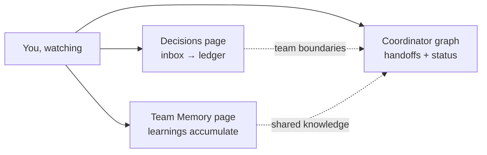
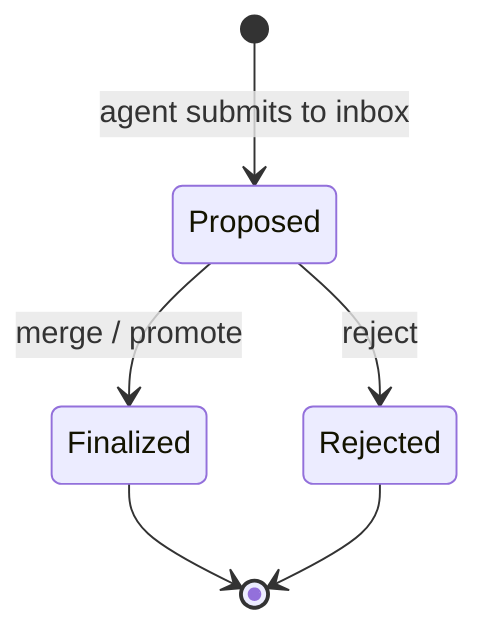
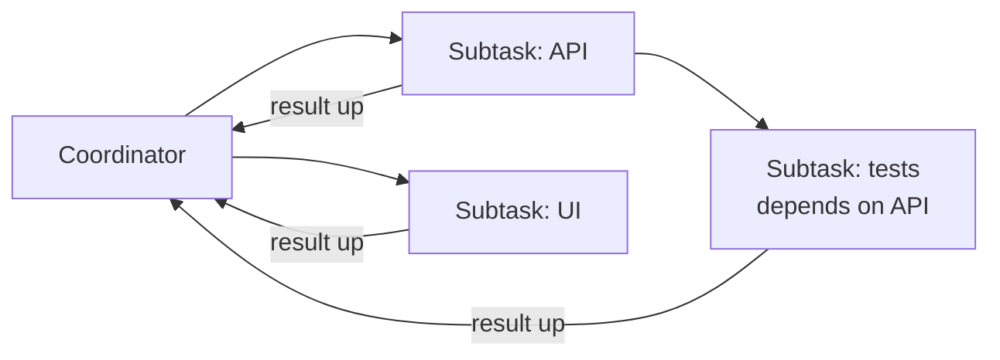

# Agent Communication — Experience

This page is about what team coordination **feels like** when you watch an
Agentweaver team work. The surprising part, the first time you see it, is what you
*don't* see: there is no chat window where agents talk to each other. No agent
DMs another agent. No negotiation thread. Yet the team clearly coordinates — work
splits up, knowledge accumulates, boundaries get respected.

That is by design. Agents coordinate through a **shared brain** and a
**coordinator**, not through conversation. This page walks through what that looks
like on screen and which surfaces you use to follow along. For the reasoning, see
the [Agent Communication deep dive](../deep-dive/agent-communication.md); for the
exact tools and endpoints, see the
[Agent Communication reference](../reference/agent-communication.md).

---

## What you watch: three views, no chat

You follow a working team through three places, each corresponding to one
coordination channel:

| You look at… | To see… | Channel |
| --- | --- | --- |
| The **Decisions** page | Proposals arriving in the inbox and hardening into the ledger | Shared state |
| The **Team Memory** page | Learnings accumulating across agents | Shared state |
| The **Coordinator graph** | A goal fan out into subtasks and results flow back up | Handoff |

None of these is a conversation. They are a shared record and a topology.

---

## Decisions appearing in the inbox, then the ledger

Open the **Team Memory** page and select the **Decisions** tab. This is the team's
governance view, and it is split into two zones: **proposed decisions** (the
inbox) and **finalized decisions** (the ledger).

While agents work, you watch decisions move from left to right in your mind's eye:

1. An agent discovers something that should constrain the whole team — say, "use
   the existing auth library, don't add a new one." It doesn't announce this to
   other agents. It **submits a proposal to the inbox**.
2. The proposal appears as **"Proposed — awaiting Coordinator,"** carrying the
   agent's name, type, and rationale, with **Merge / Promote** and **Reject**
   actions.
3. When the proposal is accepted, it becomes a **canonical decision** in the
   finalized list — title, type, agent, content, and rationale — with the audit
   link back to the proposal retained. Rejected proposals stay visible too, so
   the record explains what the team declined.

The feel is deliberate and auditable: nothing an agent *says* becomes team law.
Only what is **promoted** binds the team. And once a decision is finalized, it
quietly becomes the highest-priority context every future agent reads — so the
*next* agent simply knows the boundary without anyone repeating it. The mechanics
behind this are in the
[Memory & Decisions deep dive](../deep-dive/memory-decisions.md) and the
[Memory reference](../reference/memory.md).

---

## Memories accumulating across the team

Switch to the **Agent Memory** tab on the same page. Here you watch the team's
knowledge grow entry by entry: each item shows the **agent name, importance, type,
created time, and content**. Early in a project this is sparse ("No agent memory
recorded yet"); as agents run, learnings and patterns pile up.

The cross-agent part is what makes it coordination rather than private note-taking:

- **Search spans the whole project.** You (and agents) can search memory across
  *all* agents, not just one — so a useful learning is findable even if the agent
  that recorded it was later re-roled, renamed, or retired.
- **`cross-team`-tagged memory travels.** A learning one agent tags for sharing
  surfaces in *other* agents' context automatically, the next time they run.

So when a backend agent discovers "the sandbox blocks writes outside the
worktree," you see that memory appear — and later a different agent behaves as if
it already knew, because at its next turn that learning was compiled into its
prompt. No message was ever sent between them. This is the
[Team, Casting & Memory experience](./team-casting-memory.md) in action; the
read-side compilation is documented in the [Memory reference](../reference/memory.md).

---

## The coordinator graph: handoffs you can see

Start a coordinator run and open its **graph**. This is where the second channel —
handoffs — becomes visual. You first watch the coordinator draft an **OutcomeSpec**
and pause at a confirmation gate; nothing fans out until you confirm. After
confirmation, the goal **decomposes into subtask nodes** connected by dependency
edges, laid out left-to-right as a DAG.

As work runs, the graph animates:

- Independent subtasks light up **in parallel**; dependent ones wait for their
  prerequisites — you can *see* the ordering.
- Each node carries a status label — **Dispatching, Awaiting assembly,
  Assembling, In review, Complete, Blocked, Failed** — projected live from the run
  stream.
- When a child needs a clarifying answer or a tool approval, the request surfaces
  **on the coordinator**, not on a sibling. You answer once, in one place, and the
  answer routes back to the child that asked.

The arrows only ever point **up to the coordinator and back down to a child** —
never sideways between children. That is the visual proof that children don't chat
with each other: each is a fragment, and the coordinator is the only place pieces
come together, get reviewed, and get merged. The full topology, steering controls,
and assembly flow are covered in the
[Coordinator orchestration experience](./coordinator-orchestration.md) and
[Coordinator Internals](../deep-dive/coordinator-internals.md).

### Steering goes through the coordinator

If you want to change direction mid-flight, you steer **through the coordinator** —
**Stop**, **Redirect**, or **Amend** from the graph toolbar or a subtask card. You
target one child or broadcast to all active children. You never reach into one
agent to have it renegotiate with another; the coordinator relays your direction at
the child's next turn boundary.

---

## Why you never see agents "chatting"

Put together, the experience makes the design legible:

- **Agents leave records, not messages.** Proposals land in the inbox; learnings
  land in memory. You read state, not a transcript.
- **The coordinator is the only meeting point.** Work fans out from it and results
  flow back to it. There is no side channel between workers.
- **Boundaries propagate silently.** A finalized decision shows up as context in
  the next agent's prompt — coordination by shared truth, not by conversation.

This is what makes a team's behavior **auditable and repeatable**: you can always
answer "why did the team do that?" by looking at the decisions ledger, the memory
log, and the coordinator graph — three durable views instead of an ephemeral chat.

---

## Where execution actually happens (and why it's invisible here)

One more thing you *won't* see on these pages: the **A2A transport**. When an agent
turn runs in a distributed deployment (the opt-in `pod-per-run` execution mode), a
single **leaf** turn is remoted from the worker to a sandbox pod over A2A, while the
orchestration graph and its gates stay in the worker. That is execution plumbing —
*where* a turn runs — and it has nothing to do with how the team coordinates. The
Decisions page, the Team Memory page, and the coordinator graph look exactly the
same whether a turn ran locally or in a remote pod. If you want to understand that
layer, see the
[A2A bridge deep dive](../deep-dive/a2a-bridge.md) and
[A2A reference](../reference/a2a.md) — but it is intentionally absent from the
coordination experience, because **A2A is not how agents talk to each other.**

## Related reading

- [Agent Communication deep dive](../deep-dive/agent-communication.md) — the model
  and the reasoning.
- [Agent Communication reference](../reference/agent-communication.md) — the MCP
  tools and API endpoints behind each view.
- [Team, Casting & Memory experience](./team-casting-memory.md) — the Decisions and
  Team Memory pages in depth.
- [Coordinator orchestration experience](./coordinator-orchestration.md) — the
  coordinator graph, steering, and assembly.
