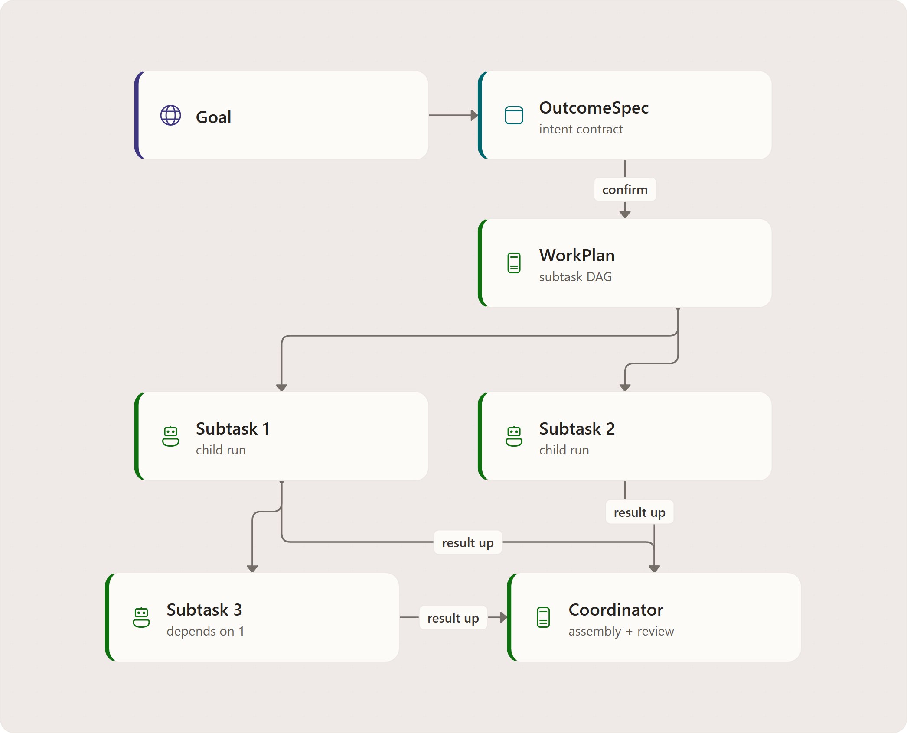
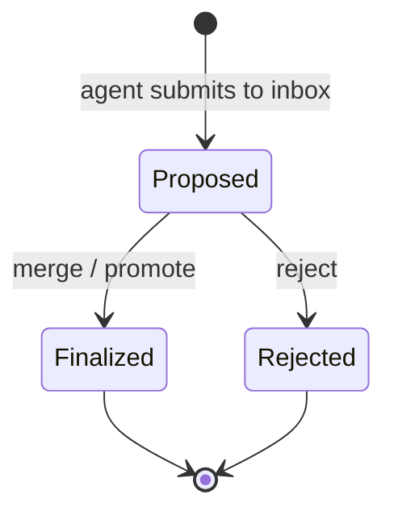

# Agent Communication — Experience

This page is about what team coordination **feels like** when you watch an
Agentweaver team work. The surprising part, the first time you see it, is what you
*don't* see: there is no chat window where agents talk to each other. No agent
DMs another agent. No negotiation thread. Yet the team clearly coordinates — work
splits up, knowledge accumulates, boundaries get respected.

That is by design. Agents coordinate through a **shared brain** and a
**coordinator**, not through conversation. This page walks through what that looks
like on screen and which surfaces you use to follow along. For the reasoning, see
the [Agent Communication deep dive](../deep-dive/agent-communication.md); for the
exact tools and endpoints, see the
[Agent Communication reference](../reference/agent-communication.md).

<!-- Shared editable source: ../diagrams/src/canonical-agent-communication-handoff.drawio.
     Exported by the official draw.io Desktop CLI. Changes belong to the shared owner. -->

---

## What you watch: three views, no chat

You follow a working team through three places, each corresponding to one
coordination channel:

| You look at… | To see… | Channel |
| --- | --- | --- |
| The **Decisions** page | Proposals arriving in the inbox and hardening into the ledger | Shared state |
| The **Team Memory** page | Learnings accumulating across agents | Shared state |
| The **Coordinator graph** | A goal fan out into subtasks and results flow back up | Handoff |

None of these is a conversation. They are a shared record and a topology.

---

## Decisions appearing in the inbox, then the ledger

Open the **Team Memory** page and select the **Decisions** tab. This is the team's
governance view, and it is split into two zones: **proposed decisions** (the
inbox) and **finalized decisions** (the ledger).

While agents work, you watch decisions move from left to right in your mind's eye:

1. An agent discovers something that should constrain the whole team — say, "use
   the existing auth library, don't add a new one." It doesn't announce this to
   other agents. It **submits a proposal to the inbox**.
2. The proposal appears as **"Proposed — awaiting Coordinator,"** carrying the
   agent's name, type, and rationale, with **Merge / Promote** and **Reject**
   actions.
3. When the proposal is accepted, it becomes a **canonical decision** in the
   finalized list — title, type, agent, content, and rationale — with the audit
   link back to the proposal retained. Rejected proposals stay visible too, so
   the record explains what the team declined.

```mermaid
stateDiagram-v2
    [*] --> Proposed: agent submits to inbox
    Proposed --> Finalized: merge / promote
    Proposed --> Rejected: reject
    Finalized --> [*]
    Rejected --> [*]
```

Acceptance and rejection require a **project owner or verified Coordinator run**.
Only **active, approved architectural and scope decisions** are eligible as compiled
team boundaries; being in the finalized list is not sufficient by itself. The compiler
serializes the content as **untrusted historical JSON data**, not executable instructions.
The mechanics
behind this are in the
[Memory & Decisions deep dive](../deep-dive/memory-decisions.md) and the
[Memory reference](../reference/memory.md).

---

## Memories accumulating across the team

Switch to the **Agent Memory** tab on the same page. Here you watch the team's
knowledge grow entry by entry: each item shows the **agent name, importance, type,
created time, and content**. Early in a project this is sparse ("No agent memory
recorded yet"); as agents run, learnings and patterns pile up.

The cross-agent part is what makes it coordination rather than private note-taking:

- **Search spans the whole project.** You (and agents) can search memory across
  *all* agents, not just one — so a useful learning is findable even if the agent
  that recorded it was later re-roled, renamed, or retired.
- **Cross-team sharing requires approval.** A `cross-team` tag alone is insufficient.
  Cross-agent selection requires approved, high-importance learning or pattern records,
  subject to selection budgets. Legacy records are excluded even for their named agent.

Recording a useful observation makes it findable, not automatically authoritative.
An eligible approved observation can later be selected for another agent's context
without peer messaging. Coordinator children may receive the narrower decisions-only
context instead of the full memory stack. This is the
[Team, Casting & Memory experience](./team-casting-memory.md) in action; the
read-side compilation is documented in the [Memory reference](../reference/memory.md).

---

## The coordinator graph: handoffs you can see

Start a coordinator run and open its **graph**. This is where the second channel —
handoffs — becomes visual. **Define Outcome** drafts an **OutcomeSpec** and pauses
for confirmation; **Direct** and unattended pickup skip that manual gate. The goal
decomposes into subtask nodes connected by dependency edges in a top-down layout.

As work runs, the graph animates:

- Independent subtasks light up **in parallel**; dependent ones wait for their
  prerequisites — you can *see* the ordering.
- Each node carries a status label — **Dispatching, Awaiting assembly,
  Assembling, In review, Complete, Blocked, Failed** — projected live from the run
  stream.
- Subtask cards also surface the child run's cost chip when usage exists and the
  executing sandbox pod chip when the run is in Kubernetes.
- When a child needs a clarifying answer or a tool approval, the request surfaces
  **on the coordinator**, not on a sibling. You answer once, in one place, and the
  answer routes back to the child that asked. Tool approvals and run-level
  automation options are durable, so a different API replica can receive the
  click and the child worker still resumes with the same decision.

Dependency arrows between subtasks mean **scheduling prerequisites**, not peer chat.
The coordinator dispatches work and receives results for assembly; layout alone is
not proof of communication or transport behavior. The full topology, steering controls,
and assembly flow are covered in the
[Coordinator orchestration experience](./coordinator-orchestration.md) and
[Coordinator Internals](../deep-dive/coordinator-internals.md).

### Steering goes through the coordinator

If you want to change direction mid-flight, you steer **through the coordinator** —
**Stop**, **Redirect**, or **Amend** from the graph toolbar or a subtask card. You
target one child or broadcast to all active children. You never reach into one
agent to have it renegotiate with another; the coordinator relays your direction at
the child's next turn boundary.

---

## Why you never see agents "chatting"

Put together, the experience makes the design legible:

- **Agents leave records, not messages.** Proposals land in the inbox; learnings
  land in memory. You read state, not a transcript.
- **The coordinator is the only meeting point.** Work fans out from it and results
  flow back to it. There is no side channel between workers.
- **Eligible boundaries inform future context.** Active approved architectural and
  scope decisions can be compiled from the database without peer conversation.

This is what makes a team's behavior **auditable and repeatable**: you can always
answer "why did the team do that?" by looking at the decisions ledger, the memory
log, and the coordinator graph — three durable views instead of an ephemeral chat.

---

## Where execution happens is a separate concern

When an agent turn uses `pod-per-run` execution, a
single **leaf** turn is remoted from the worker to a sandbox pod over A2A, while the
orchestration graph and its gates stay in the worker. That is execution plumbing —
*where* a turn runs — and it has nothing to do with how the team coordinates. The
governance model is the same, but the UI can show each node's executing pod and
visible transport failures. A pod chip is placement information, not peer communication.
If you want to understand that
layer, see the
[A2A bridge deep dive](../deep-dive/a2a-bridge.md) and
[A2A reference](../reference/a2a.md). **A2A is leaf-turn execution transport,
not peer chat between team members.**

## Related reading

- [Agent Communication deep dive](../deep-dive/agent-communication.md) — the model
  and the reasoning.
- [Agent Communication reference](../reference/agent-communication.md) — the MCP
  tools and API endpoints behind each view.
- [Team, Casting & Memory experience](./team-casting-memory.md) — the Decisions and
  Team Memory pages in depth.
- [Coordinator orchestration experience](./coordinator-orchestration.md) — the
  coordinator graph, steering, and assembly.

<!-- diagram-context:canonical-agent-communication-handoff:start -->

Diagram details and constraints

<table><thead><tr><th>Element</th><th>Contract</th></tr></thead><tbody>
<tr><td>title</td><td>Handoffs, not peer chat</td></tr>
<tr><td>subtitle</td><td>The Coordinator owns the dependency frontier and assembles child results.</td></tr>
<tr><td>group-title0</td><td>Intent → execution contract</td></tr>
<tr><td>group-title1</td><td>Children and assembly</td></tr>
<tr><td>Human goal</td><td>Human goal</td></tr>
<tr><td>Human goal</td><td>Define the desired outcome</td></tr>
<tr><td>Human goal</td><td>intent input</td></tr>
<tr><td>OutcomeSpec</td><td>OutcomeSpec</td></tr>
<tr><td>OutcomeSpec</td><td>Confirm before dispatch</td></tr>
<tr><td>OutcomeSpec</td><td>confirmation gate</td></tr>
<tr><td>WorkPlan DAG</td><td>WorkPlan DAG</td></tr>
<tr><td>WorkPlan DAG</td><td>Subtasks + dependencies</td></tr>
<tr><td>WorkPlan DAG</td><td>eligible frontier</td></tr>
<tr><td>Child run A</td><td>Child run A</td></tr>
<tr><td>Child run A</td><td>One assigned subtask</td></tr>
<tr><td>Child run A</td><td>isolated worktree</td></tr>
<tr><td>Child run B</td><td>Child run B</td></tr>
<tr><td>Child run B</td><td>Another eligible subtask</td></tr>
<tr><td>Collective assembly</td><td>Collective assembly</td></tr>
<tr><td>Collective assembly</td><td>Integrate settled work</td></tr>
<tr><td>Collective assembly</td><td>one reviewed integration</td></tr>
<tr><td>e1</td><td>draft</td></tr>
<tr><td>e2</td><td>confirm</td></tr>
<tr><td>e3</td><td>dispatch A</td></tr>
<tr><td>e4</td><td>dispatch B</td></tr>
<tr><td>e5</td><td>result A</td></tr>
<tr><td>e6</td><td>result B</td></tr>
<tr><td>assurance-title</td><td>DEPENDENCIES ARE CONTROL</td></tr>
<tr><td>assurance-line1</td><td>A dependency edge is scheduling, not a conversation channel.</td></tr>
<tr><td>assurance-line2</td><td>A2A transports one agent turn between worker and sandbox; it is not peer chat.</td></tr>
<tr><td>Human goal</td><td>Input</td></tr>
<tr><td>Human goal</td><td>Desired outcome</td></tr>
<tr><td>Human goal</td><td>Scope</td></tr>
<tr><td>Human goal</td><td>Human intent</td></tr>
<tr><td>Human goal</td><td>Gate</td></tr>
<tr><td>Human goal</td><td>Confirm or revise</td></tr>
<tr><td>Human goal</td><td>Owner</td></tr>
<tr><td>Human goal</td><td>Coordinator intake</td></tr>
<tr><td>OutcomeSpec</td><td>State</td></tr>
<tr><td>OutcomeSpec</td><td>Persisted contract</td></tr>
<tr><td>OutcomeSpec</td><td>Fields</td></tr>
<tr><td>OutcomeSpec</td><td>Scope / assumptions</td></tr>
<tr><td>OutcomeSpec</td><td>Human confirmation</td></tr>
<tr><td>OutcomeSpec</td><td>Next</td></tr>
<tr><td>OutcomeSpec</td><td>Workflow selection</td></tr>
<tr><td>WorkPlan DAG</td><td>Model</td></tr>
<tr><td>WorkPlan DAG</td><td>Subtasks + edges</td></tr>
<tr><td>WorkPlan DAG</td><td>Bounded assignee</td></tr>
<tr><td>WorkPlan DAG</td><td>Ready</td></tr>
<tr><td>WorkPlan DAG</td><td>Dependencies satisfied</td></tr>
<tr><td>WorkPlan DAG</td><td>Store</td></tr>
<tr><td>WorkPlan DAG</td><td>Persisted WorkPlan</td></tr>
<tr><td>Child run A</td><td>Binding</td></tr>
<tr><td>Child run A</td><td>ParentRunId / SubtaskId</td></tr>
<tr><td>Child run A</td><td>Files</td></tr>
<tr><td>Child run A</td><td>Per-child worktree</td></tr>
<tr><td>Child run A</td><td>Charter + decisions</td></tr>
<tr><td>Child run A</td><td>Output</td></tr>
<tr><td>Child run A</td><td>Result to parent</td></tr>
<tr><td>Child run B</td><td>Eligible frontier only</td></tr>
<tr><td>Child run B</td><td>Failure</td></tr>
<tr><td>Child run B</td><td>Blocks dependents</td></tr>
<tr><td>Child run B</td><td>Chat</td></tr>
<tr><td>Child run B</td><td>No sibling channel</td></tr>
<tr><td>Collective assembly</td><td>Settled child branches</td></tr>
<tr><td>Collective assembly</td><td>Action</td></tr>
<tr><td>Collective assembly</td><td>Integrate collective work</td></tr>
<tr><td>Collective assembly</td><td>Gates</td></tr>
<tr><td>Collective assembly</td><td>Configured checks</td></tr>
<tr><td>Collective assembly</td><td>Review</td></tr>
<tr><td>Collective assembly</td><td>One human decision</td></tr>
<tr><td>goal</td><td>Outcome, scope, assumptions; Coordinator drafts the contract</td></tr>
<tr><td>spec</td><td>Human confirms or revises; Persisted intent, not execution</td></tr>
<tr><td>plan</td><td>One owner per bounded subtask; Only satisfied dependencies run</td></tr>
<tr><td>a</td><td>Active decisions + charter; Result returned to Coordinator</td></tr>
<tr><td>b</td><td>Parallel only when eligible; No direct child-to-child chat</td></tr>
<tr><td>assembly</td><td>Child results flow upward; Failed / RAI child blocks dependents</td></tr>
<tr><td>notes</td><td>DEPENDENCIES ARE CONTROL; A dependency edge is scheduling, not a conversation channel.; A2A transports one agent turn between worker and sandbox; it is not peer chat.</td></tr>
<tr><td>groups</td><td>Intent → execution contract; Isolated work → collective assembly</td></tr>
</tbody></table>

<!-- diagram-context:canonical-agent-communication-handoff:end -->
