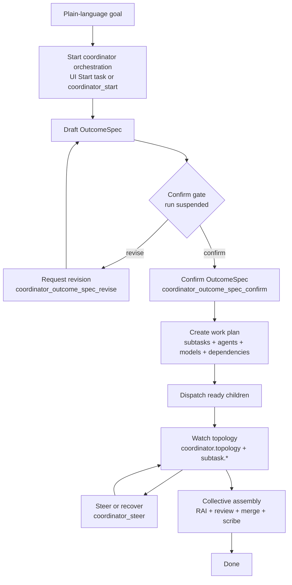

# Coordinator orchestration experience

Coordinator orchestration is the Agentweaver experience for turning one plain-language goal into a confirmed outcome, a dependency-aware work plan, multiple specialist child runs, and one assembled result. The core interaction is deliberately human-accountable: the coordinator drafts an OutcomeSpec, suspends at a confirmation gate, and dispatches no subagent work until the user confirms. The web UI and MCP expose the same lifecycle, so a user can start, confirm, watch, drill in, steer, recover, and review an orchestration from either surface.

Related experience docs: [Runs & board](./runs-board-watch.md), [MCP client](./mcp-client.md), [Projects](./projects.md), and [Review, workspace & merge](./review-workspace-merge.md). Related grounding references: [Coordinator reference](../reference/coordinator.md), [Coordinator internals](../deep-dive/coordinator-internals.md), [Orchestration engine](../deep-dive/orchestration.md), and [Team casting](../deep-dive/team-casting.md).

## The experience in one sentence

The coordinator is a project-level team manager. The user describes the outcome once, confirms the coordinator's interpretation, then watches a live topology of subtasks move through specialists, dependencies, child runs, steering, assembly, and final review.

The experience is not a faster way to skip review. It makes the work larger and more parallel while keeping the user's intent, intervention points, and final accountability visible.

## Starting from a plain-language goal

### In the web UI

The user starts from a project by choosing **Start task**. The dialog asks for a **Goal** and explains the contract in plain language: describe the goal, then the coordinator drafts an outcome spec for review and confirmation before any work is dispatched. The global floating **Start task** button offers the same entry point from anywhere in the app, adding a **Project** selector before the **Goal** field.

When the user clicks **Start**, the UI posts the goal, receives the coordinator run id, and navigates directly to the orchestration detail page. The first thing the user sees is not a fan-out of workers. The first thing they see is a coordinator run that is drafting intent.

That matters. A broad request such as "Add OAuth sign-in and update the docs and tests" can mean many things: provider choice, scope boundaries, migration expectations, documentation depth, and test coverage. The coordinator's first job is to turn that request into a confirmable contract, not to launch agents immediately.

### Over MCP

MCP starts the same experience with `coordinator_start`:

- `project_id` selects the project.
- `goal` is the plain-language outcome the user wants.
- `model_id` optionally overrides the coordinator model for the planning run.

`coordinator_start` returns the created coordinator run. The run begins drafting a confirmable OutcomeSpec and then suspends at the confirmation gate. No subtask decomposition, child run dispatch, or topology fan-out happens before confirmation.

Use MCP when the orchestration starts from an assistant workflow, a CLI session, or another tool that can hold the run id and continue with the coordinator tools. Use the web UI when the user wants the visual confirmation gate and live topology from the start.

## The confirmation gate: the key UX beat

The coordinator run deliberately pauses before work begins. The OutcomeSpec is persisted with an awaiting-confirmation state, the web page shows the **Outcome spec** panel, and the system tells the user: **No subagent work is dispatched until you confirm this outcome spec.**

This is the safety property of coordinator orchestration. The system may draft, ask questions, and revise; it does not treat the goal as executable until the human confirms the interpretation. The user has one clean moment to say "yes, that is what I meant" before work fans out across multiple agents.

### What suspension feels like

In the UI, the graph area remains intentionally quiet while the spec is being authored. The detail page may show the live coordinator node and a hint that the execution pipeline appears once the OutcomeSpec is confirmed. The coordinator session can stream planning activity, but the subtask graph and child pipelines are not active yet.

The left-side **Outcome spec** panel carries the action. It shows a status badge such as **Drafting** or **Awaiting confirmation**, then displays the goal, desired outcome, scope, assumptions, and clarifying questions. While the coordinator is still drafting, the panel shows a spinner with **Coordinator is drafting the outcome spec...**. During revision, it shows **Coordinator is incorporating your changes and re-drafting the spec...**.

### What the gate prevents

The gate prevents accidental fan-out. Without it, each child agent could receive an ambiguous version of the original request and independently choose scope. With it, every downstream subtask is grounded in the same confirmed OutcomeSpec.

The gate also prevents surprise cost and surprise changes. A user can inspect scope, exclusions, and assumptions before multiple agents touch a repository, generate output, ask for tool approvals, or produce branches for assembly.

## OutcomeSpec experience

### Viewing the drafted spec

The web **Outcome spec** panel is the user's readable view of the current spec. MCP reads the same persisted artifact with `coordinator_outcome_spec_get`.

The spec presents:

- **Goal** — the original user request.
- **Desired outcome** — the coordinator's concise description of successful completion.
- **Scope** — what is included and excluded.
- **Assumptions** — decisions the coordinator is making unless corrected.
- **Clarifying questions** — targeted questions the coordinator wants answered before dispatch.
- **Status** — drafting, awaiting confirmation, confirmed, or declined.
- **Confirmed by** — shown after confirmation when present.

The panel renders the server-authored fields as the source of truth. If the coordinator returns a single paragraph, the UI shows a paragraph. If it returns lists, the UI shows lists. The user is evaluating the coordinator's stated intent, not a client-side rewrite.

Over MCP, `coordinator_outcome_spec_get` is the snapshot tool. It is useful after `coordinator_start`, after a web user asks for changes, or after a stream reconnect when the client wants the latest persisted spec without replaying events.

### Confirming the spec

When the status is **Awaiting confirmation**, the UI offers **Confirm**. Clicking it confirms the spec and resumes the suspended coordinator run. The panel switches to **Confirmed** immediately and shows **Outcome spec confirmed... Dispatch is unblocked.** The detail page then makes room for the coordinator graph and child execution experience.

Over MCP, `coordinator_outcome_spec_confirm` performs the same action. It confirms the current drafted OutcomeSpec for the coordinator run and resumes the run past the gate. This is the transition that allows the coordinator to select a workflow shape, decompose the work plan, persist subtasks and dependencies, and begin dispatching ready children.

Confirmation is not just an acknowledgement. It is the user's approval that the coordinator's interpretation is the execution contract for the rest of the orchestration.

After the user clicks **Confirm**, the web UI automatically reconnects the live stream. The coordinator stream closed at the `awaiting_confirmation` gate; confirmation resumes the run and reopens the stream so the topology, subtask graph, and coordinator session update in real time without a manual page refresh. If the confirming SSE event arrives slightly later, the panel still keeps the terminal **Confirmed** state instead of briefly flipping back to an older drafting or awaiting-confirmation snapshot. The **View session** link in the spec authoring state also works correctly: it expands the coordinator session column if it was collapsed before scrolling to the session content.

### Requesting a revision

If the spec is close but not right, the user chooses **Clarify and request changes**. The dialog asks the user to describe what should change. If the coordinator included clarifying questions, the dialog shows those questions as answer fields and includes an **Additional feedback** field. The dialog explains the loop clearly: after sending feedback, the coordinator re-drafts and re-presents the spec for confirmation; no subagent work is dispatched until the user confirms.

Over MCP, `coordinator_outcome_spec_revise` takes `feedback`. The coordinator uses that feedback to produce a fresh draft and suspends again at the same confirmation gate. The user can repeat this loop until the OutcomeSpec is accurate.

Revision is the right action when the desired outcome is correct in spirit but wrong in boundary. Examples: narrow the scope to docs only, require a specific API version, exclude migration work, add tests as a success condition, or answer a clarifying question that changes the plan.

### Why revision re-suspends

Revision does not resume work. It returns the run to the awaiting-confirmation state because the artifact that controls execution has changed. The user gets a fresh chance to inspect the new desired outcome, scope, assumptions, and questions before the coordinator creates the work plan.

This makes the experience predictable: every executable interpretation is confirmed exactly at the boundary where planning turns into dispatch.

## Choosing the workflow

Right after you confirm the spec, and before any subtasks appear, the coordinator picks **which workflow** (which run process) the work should follow. Most projects carry a single workflow, so this is invisible — that one workflow is used with no prompt and no extra step. The experience only becomes visible when a project offers more than one eligible workflow.

### What decides the workflow

You influence the choice in four ways, from strongest to softest:

- **Backlog override.** A backlog task can pin a specific workflow. When the coordinator picks that task up, it uses the pinned workflow as long as it is valid and its trigger fits the pickup.
- **Conversational override.** In a revision, reply with `use <workflow-id>` (for example `use bug-fix`). This wins over the coordinator's own pick, as long as the named workflow is one of the eligible candidates.
- **Blueprint restriction.** A project's blueprint can limit the set of workflows available to the project (`AllowedWorkflowIds`) and set the default. The built-in `default` workflow always stays available as a safety net, so the project is never left with zero choices.
- **Automatic selection.** When two or more workflows are eligible and you haven't named one, a Copilot-backed selector picks the best **process fit** for the goal and team, by what steps each workflow runs and what it produces — not by name similarity.

### Manual vs backlog (heartbeat) invocation

How the run started narrows the candidates before anything else, so a workflow only appears if its declared trigger matches:

- **You started it (manual).** Only workflows with a `manual` trigger are considered.
- **The heartbeat picked up a Ready task.** Only `heartbeat`-trigger workflows, plus event workflows that fire on "task added to Ready", are considered.

A workflow whose trigger does not match the invocation is never selected, even if you name it. When nothing matches, the coordinator falls back to the project default rather than running a mismatched process.

### What you'll see when the coordinator selects

When a project has multiple eligible workflows, the coordinator surfaces its choice as a `coordinator.workflow_selected` event on the run stream. It carries:

- `selectedId` and `selectedName` — the workflow it chose.
- `rationale` — a one- or two-sentence reason for the pick (or an explanation of why it fell back to the default).
- `wasAutoSelected` — `true` when the selector chose it, `false` when you named it with `use ...`.
- `overrideHint` — a reminder you can reply `use {other-id}` to change it, listing the available ids.
- `available` — the full list of workflows you could pick instead.

If anything goes wrong (the model is unavailable, returns an unusable answer, or names a workflow that isn't available), the coordinator deterministically falls back to the project default and says so in the rationale — you are never left without a workflow. Single-workflow projects emit no such event, because there was nothing to choose.

## Work plan experience

### From confirmed intent to executable plan

After confirmation, the coordinator creates a work plan. The work plan is the execution contract for the orchestration. It decomposes the confirmed OutcomeSpec into bounded subtasks, assigns each subtask to an agent, selects a model, records status, attaches a child run id when dispatched, and stores dependency edges.

MCP reads the persisted plan with `coordinator_work_plan_get`. The response includes the coordinator run id, the OutcomeSpec id, the work plan status, optional isolation summary, subtasks, and dependency rows.

Each subtask includes:

- `subtaskId` — the stable subtask identifier.
- `title` — the user-readable unit of work.
- `scope` — the owned work or output boundary.
- `assignedAgent` — the cast agent selected for the subtask.
- `selectedModelId` — the model selected for that subtask.
- `phase` — planning, execution, validation, or another server-authored phase.
- `isolation` — an advisory worktree/shared hint.
- `status` — pending, dispatched, running, assemble-ready, completed, failed, blocked, or RAI-flagged.
- `childRunId` — present once the subtask has a dispatched child run.

Dependency rows point from prerequisite to dependent. In the topology, edges mean "this must finish before that can run." The coordinator advances only the ready frontier: pending subtasks with all dependencies satisfied can dispatch; blocked predecessors keep dependents from running.

### What the user sees in the graph

The orchestration detail page titles the graph section **Coordinator Graph**. It shows the current orchestration phase next to the title when available, such as **Dispatching**, **Awaiting assembly**, **Assembling**, **In review**, **Complete**, **Failed**, **Blocked**, or **Declined**. A live spinner appears while the stream is connected.

The hint explains the graph's job: **Live view of the coordinator and its subtasks. Expand a subtask to see its pipeline, or use the steering controls to send a course-correction to the coordinator or stop the orchestration.**

Subtask cards show the subtask title, assigned agent, role label when available, selected model, phase, status badge, and elapsed time. Status labels are direct and operational: **Pending**, **Dispatched**, **Running**, **Awaiting assembly**, **RAI flagged**, **Completed**, **Failed**, and **Blocked**. A subtask that has finished its part but is waiting for the parent shows the note **Finished its part — waiting for collective assembly**.

The graph uses left-to-right dependency layout. Root subtasks appear after the coordinator; dependent subtasks appear after their prerequisites. The user can see which work is parallel, which work is serial, and which node is blocking the rest.

### Live topology updates

The graph is not computed from guesses in the browser. It is seeded from REST snapshots and then updated from coordinator run stream events.

The live stream events that matter are:

- `coordinator.work_plan` — records the persisted plan and subtask list.
- `coordinator.topology` — provides graph snapshots and deltas.
- `subtask.dispatched` — a child run has been launched for a subtask.
- `subtask.running` — the child is actively working.
- `subtask.assemble_ready` — the child finished its part and is ready for parent assembly.
- `subtask.rai_flagged` — the child hit a responsible-AI block.
- `subtask.completed` — the subtask completed.
- `subtask.failed` — the subtask failed.
- `coordinator.steering` — a user directive was queued, relayed, applied, or otherwise updated.

`coordinator.topology` carries a versioned graph. The initial snapshot includes one coordinator node, one node per subtask, and dependency edges. Later deltas carry changed nodes. Edges are stable after the snapshot because the dependency structure does not change casually while work is running.

Each node in the topology carries an `executionPodName` field. The UI renders a compact pod chip above the card when this field is non-null and non-empty:

- **Coordinator node** — shows the API pod name when the coordinator process is running inside Kubernetes; null otherwise.
- **Subtask node** — shows the pod name of the child run's bound AgentHost pod, populated by the backend from the pod registry (`IPodNameRegistry`) once the child run is dispatched. `null` before dispatch or on non-Kubernetes deployments.

A node with no assigned pod shows no chip. The chip never falls back to the API pod for child or intermediate nodes.

The UI also seeds the graph from `coordinator_work_plan_get` and `coordinator_children_get` equivalents so a finished run or a stream that connected after the first snapshot still renders immediately. Stream deltas reconcile on top of that seed.

### Topology over MCP

MCP offers two ways to inspect topology:

- `orchestration_topology` returns a one-shot snapshot by combining the current work plan and child runs.
- `run_watch` against the coordinator run id streams the live events that reconstruct the graph: `coordinator.topology`, `subtask.*`, and `coordinator.steering`.

Use `orchestration_topology` for a point-in-time view. Use `run_watch` when building an interactive client, a terminal progress display, or an automation that reacts to subtask state.

## Child-runs experience

### Children are real runs

Each dispatched subtask becomes a first-class child run. The coordinator does not invent a second execution system for children. A child run uses the existing run machinery: agent work, RAI/safety checks, timeline events, tool approvals, questions, and assemble-ready handoff.

The parent coordinator owns the collective result. Children perform their assigned pieces and stop at the boundary where the parent can assemble. The user reviews the combined output once, rather than approving a pile of unrelated child fragments.

### Seeing children in the UI

In the graph, a dispatched subtask gains a child run id. The subtask card can show **Expand pipeline**. Expanding the card reveals a compact child pipeline, typically showing steps like **Agent**, **Rai**, and **Assemble-ready**, with statuses and timers. If the child graph descriptor is available, the UI uses the actual child pipeline instead of the fallback.

The card also offers **View run**. In the orchestration detail page, this opens the child run in a modal using the standard run watcher. The user stays in the orchestration context while inspecting the child's timeline, tool calls, questions, approvals, files, and status.

Some topology views link directly to the child run's normal workflow page. The experience goal is the same: a user can move from the all-up topology to the responsible child run without losing which subtask it belongs to.

### Children over MCP

`coordinator_children_get` lists the dispatched child runs for a coordinator run. Each row pairs the child run with subtask state:

- `subtaskId`
- `childRunId`
- `subtaskStatus`
- `assignedAgent`
- `selectedModelId`
- `childRunStatus`
- `worktreeBranch`
- `treeHash`
- `stepCount`

This is the MCP equivalent of clicking through the graph. It lets a tool identify active children, inspect which agent owns which subtask, target a specific child with steering, or jump into the child run's own stream.

## Steering a live orchestration

### Steering in the web UI

The graph toolbar shows **Steer coordinator:** followed by an input and the actions **Send**, **Redirect**, **Amend**, and **Stop** while the orchestration is active. The scope note says **Applies to all active subtasks.** This is whole-orchestration steering: it broadcasts to every active child unless the user targets a subtask from a node-level control.

Subtask cards can also show **Stop**, **Redirect**, and **Amend** when the subtask is active and has a child run. Those actions target that specific child run. The dialog title names the action and target, asks for an **Instruction** when required, and disables **Send** until required guidance is present.

Blocked assembly is a recoverable pause, not a dead end. The recovery panel stays live, explains why assembly paused, lists blocking subtasks or conflicting files when available, and lets the user **Send**, **Redirect**, **Amend**, or **Stop** without reloading the page. After the user sends steering, the panel immediately shows that the message was sent and the coordinator is being resumed. If no steering arrives before the blocked-wait timeout (currently 10 minutes by default), the coordinator settles as failed just as it did before.

### Steering over MCP

`coordinator_steer` is the MCP steering tool. It takes:

- `run_id` — the coordinator run id.
- `kind` — the steering verb.
- `instruction` — required for `redirect` and `amend`; optional for `stop` and recovery verbs.
- `target_child_run_id` — optional; when present, targets one child; when omitted, broadcasts to all active children.

The steering verbs are:

| Verb | User intent | Timing |
| --- | --- | --- |
| `send` | Add context or a note for the coordinator without changing the chosen direction. | Immediate. If assembly is blocked, this wakes the coordinator and retries assembly with the new context. |
| `stop` | Cancel active subagents now and stop further work for the target scope. | Immediate cancellation of active subagents. |
| `redirect` | Point the target at a changed direction. | Injected at the targeted subagent's next turn boundary, or immediately resumes a blocked coordinator by re-entering dispatch. |
| `amend` | Add guidance without discarding the whole in-flight context. | Injected at the targeted subagent's next turn boundary, or immediately resumes a blocked coordinator when there is a recoverable gate to unblock. |

Omitting `target_child_run_id` broadcasts the directive to every active child. Supplying it targets the one child run behind a specific subtask. `redirect` and `amend` need an instruction because the coordinator must know what guidance to relay. `send` and `stop` can work without instruction, though a short reason is still useful for the human timeline.

Pause is not supported.

### What steering changes on screen

A steering directive appears as `coordinator.steering` on the coordinator stream. The topology reducer attaches targeted directives to the matching subtask node by child run id. Broadcast directives attach to the coordinator node. The graph then shows a steering note with the verb and directive status, such as **Redirect · queued**.

The UX intentionally distinguishes immediate stop from next-boundary guidance. `stop` cancels active subagents now. `redirect` and `amend` are queued until the target reaches a turn boundary when work is already in flight; they do not interrupt an in-flight model turn mid-token. When collective assembly is blocked, the coordinator stays observable on the live stream and the same steering verbs resume it: `send` retries assembly with added context, while `redirect` and `amend` reset eligible blocked work and re-arm dispatch.

## Orchestrations list page

The project **Orchestrations** page is the user's project-level index of coordinator runs. It lists coordinator runs only, with each row showing:

- an orchestration status badge,
- the task or goal text,
- the start time,
- and an **Open** button.

The page header is **Orchestrations** with the subtitle **Coordinator runs across this project.** Breadcrumbs take the user back to **Projects** and the project page. **Refresh** reloads the list. While loading, the page shows **Loading orchestrations**. If no coordinator runs exist, the empty state says **No orchestrations yet** and tells the user to start an orchestration from the Board to coordinate a squad of agents.

Status labels are human-readable. Raw coordinator statuses are normalized into labels such as **Awaiting assembly**, **Assembling**, **In review**, **Dispatching**, **Complete**, **Declined**, **Blocked**, and **Failed**. The list uses those labels rather than forcing the user to interpret internal status strings.

## Orchestration detail page

The orchestration detail page is the main control room. It combines the confirmation gate, topology, agent load, coordinator session, bubbled child actions, assembly review, and child-run drill-in.

### Header and goal

The page title is **Orchestration**. It shows a short id in the breadcrumb, live connection spinner when the stream is connecting or streaming, and a **Retry** action for retryable failed or merge-failed coordinator runs. If the run is a retry, the header links back to the run it retried from. The original goal appears as **Goal:** once the `coordinator.started` event is available.

### Coordinator Graph

The **Coordinator Graph** is the full-width band at the top. It is built to be watched. The graph has zoom controls, auto-fit behavior, and expandable subtask cards. When the OutcomeSpec is still being authored, the graph avoids implying future work and shows a focused pre-dispatch state. Once confirmed, the execution pipeline appears.

The graph includes the coordinator node, subtask nodes, dependency edges, and collective assembly stages when they are part of the descriptor. Assembly stages map to the overall orchestration phase: RAI starts during assembly, human review becomes actionable during **In review**, merge and scribe light up from their own assembly events, and completion turns the flow green.

### Agent rail

When the work plan exists, the page shows an **Agents** rail below the graph. It summarizes agent load for this orchestration from the work plan and children snapshot. This gives the user a quick read on which cast members are active, queued, blocked, or done without inspecting every node.

### Outcome spec and coordinator session columns

Below the graph, the page uses two columns. The left column is the **Outcome spec** panel. It can collapse to a rail labeled **Outcome spec**, and it auto-collapses after confirmation to give more space to live execution. The right column is the **Coordinator session**, which can also collapse to a rail while the spec is still being authored.

The coordinator session reuses the standard run timeline. It shows the coordinator's own messages, lifecycle cards, tool activity, and stream state. It filters out raw serialized work-plan JSON when the structured plan is already visible in the graph and panels.

Coordinator-only artifacts are also intentionally quiet on misses. The page stops retrying `work-plan` or `outcome-spec` REST reads after the first `404`, because the live coordinator stream is enough to fill in those artifacts once they exist. Child runs skip those calls entirely: a child run never has its own work plan or outcome spec, so its page does not poll those coordinator-only endpoints at all.

### Bubbled child actions

When a child asks a question or needs a tool approval, the coordinator re-projects that action onto the coordinator stream. The detail page shows those items in the all-up view so the user does not have to hunt through every child run.

Question cards route answers to the child run that asked. Tool approval cards also target the child run. The coordinator view is the inbox; the child remains the owner of the request.

### Assembly and review

After child subtasks settle, the coordinator assembles the collective output. During **Awaiting assembly** or **Assembling**, the page shows **Assembling collective output...** and explains that subtasks are complete and the coordinator is integrating their outputs for collective review.

During **In review**, the page shows a warning that review is pending and directs the user to the Changes panel. The Changes/Files experience is reused for the coordinator's collective assembly output. Approve, request a change, or decline actions go to the assembly review gate, not to individual children.

If assembly blocks or fails, the page explains why. It can show conflict files, blocking subtasks, status badges, and hints such as re-running affected subtasks or stopping the run. The important UX rule is that the user gets a reason and a recovery surface, not a bare failed state.

### Stall diagnostics

If a child stops making progress long enough to hit the configured stall timeout, the coordinator records a `coordinator.child_stall_detected` event on the parent stream and marks the stalled path as ineligible to continue. In practice, the stalled child subtask shows a terminal failure with recovery guidance, while still-pending dependents can surface as **Blocked** because they never became runnable after their prerequisite stalled.

If the run later shows **Blocked** at assembly time, `assembly_blocked` means the coordinator refused partial assembly because one or more subtasks were ineligible, including blocked dependency paths. The recovery action is to re-run the affected stalled or blocked branch through the recovery or steering controls if the plan is still valid, or stop the run if you want to abandon that orchestration attempt.

## MCP flow patterns

### Start, confirm, and watch

A typical MCP client flow is:

1. Call `coordinator_start` with `project_id`, `goal`, and optional `model_id`.
2. Watch the coordinator run stream or call `coordinator_outcome_spec_get` until the spec is available.
3. Present the OutcomeSpec to the user.
4. Call `coordinator_outcome_spec_confirm` when the user approves, or `coordinator_outcome_spec_revise` with feedback when the user wants changes.
5. After confirmation, call `coordinator_work_plan_get` for the plan and `coordinator_children_get` for dispatched children.
6. Use `orchestration_topology` for a one-shot graph or `run_watch` for live topology events.
7. Call `coordinator_steer` to stop, redirect, amend, or recover.

This mirrors the web UI exactly. The MCP client owns presentation; the coordinator service owns orchestration state.

### Inspecting a run after reconnect

For a reconnect or audit view:

1. `coordinator_outcome_spec_get` gives the confirmed or pending intent.
2. `coordinator_work_plan_get` gives the persisted work plan, subtasks, statuses, and dependencies.
3. `coordinator_children_get` gives child run ids and child status.
4. `orchestration_topology` combines the current plan and children into a graph-shaped snapshot.
5. `run_watch` resumes live updates from the coordinator run stream when an active run needs continuous monitoring.

The persisted artifacts are enough to rebuild the user's mental model even if the live stream was disconnected during drafting, dispatch, or assembly.

## User mental model

### Coordinator

The coordinator is the visible parent run and the accountable orchestrator. It drafts intent, waits for confirmation, decomposes work, dispatches children, observes progress, accepts steering, recovers eligible parked work, and assembles the result.

### OutcomeSpec

The OutcomeSpec is the intent contract. It answers: what are we trying to accomplish, what is in scope, what assumptions are active, and what needs clarification? It must be confirmed before subagent work is dispatched.

### Work plan

The work plan is the execution contract. It answers: what subtasks exist, who owns them, which model each uses, what their status is, which child run is attached, and which dependency edges control ordering?

### Subtask

A subtask is one bounded unit of work inside the work plan. It has an assigned agent, selected model, status, scope, phase, and dependency relationships. It may or may not have a child run yet.

### Child run

A child run is the actual execution for a dispatched subtask. It has its own run stream and pipeline, and it can ask questions or request tool approval. The coordinator view can surface those actions, but answers and approvals route back to the child.

### Topology

Topology is the live graph of coordinator plus subtasks and dependency edges. It updates from `coordinator.topology`, `subtask.*`, and `coordinator.steering` events, and it can be snapshotted through `orchestration_topology`.

### Steer and recover

Steer means the user intervenes while the orchestration is alive or parked. Stop cancels active work. Redirect and amend inject guidance at turn boundaries. Recover resets eligible blocked, failed, or parked subtasks and resumes dispatch.

## Scope and limits

- Pause is not supported.
- The confirmation gate is required for interactive coordinator runs; no subagent work dispatches before confirmation.
- `redirect` and `amend` apply at the next subagent turn boundary, not in the middle of an active model turn.
- Omitting `target_child_run_id` in `coordinator_steer` broadcasts to all active children.
- Child isolation is advisory from the user's perspective; the coordinator still relies on dependency edges, scoped subtasks, review, and assembly to manage conflicts.
- The parent coordinator owns collective assembly and final review; child runs do not each merge independently.

## Why this design works

The experience keeps the user oriented at every scale. At the start, the user sees one understandable contract: the OutcomeSpec. In the middle, the user sees a topology: who is doing what, what is blocked, and which dependencies matter. At intervention time, the user has steering verbs that match intent: stop, redirect, amend, recover. At the end, the user reviews one assembled outcome.

The web UI makes that lifecycle visual and action-oriented. MCP makes the same lifecycle scriptable and composable. Both surfaces preserve the same product promise: the coordinator can run a team, but the user confirms intent before work starts and retains control while the team executes.
