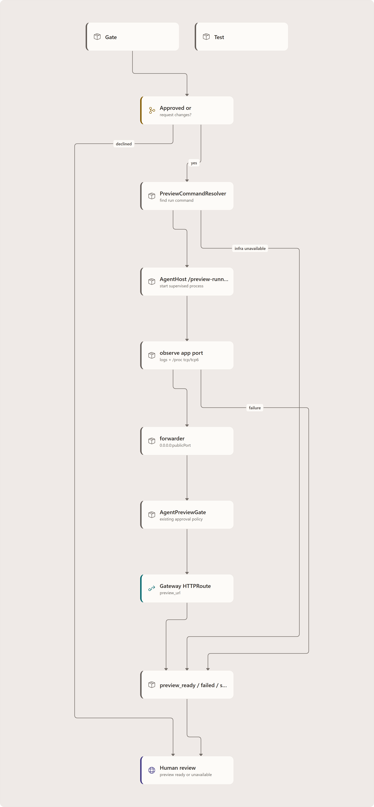

# Decoupled live-preview provisioning

When a coordinator run reaches **Build & Test**, Agentweaver now tries to show you the assembled app running before you make the final human-review decision. This preview is a platform step after Build & Test, not something the Build & Test agent may or may not do.

For implementation details, see the [deep dive](../deep-dive/live-preview-provisioning.md). For event and endpoint details, see the [reference](../reference/live-preview-provisioning.md).

<!-- Shared diagram: live-preview-provisioning-fig1; consume the declared canonical PNG.
     The deep-dive owner maintains the source and visual validation. -->

## When it runs

The preview step runs after Build & Test for:

- Build & Test **approved**;
- Build & Test **requested changes**.

It skips when Build & Test **declines**, because the gate is already terminal. It also self-skips when the deployment cannot produce a reachable Gateway preview, and records that as a skipped preview outcome. There is no feature flag; this is the default behavior.

## What you see

| State | Meaning | What to do |
| --- | --- | --- |
| **Open preview** | The assembled app is reachable at a Gateway preview URL. | Open it and inspect the running result before approving or requesting changes. |
| **Preview pending approval** | The existing preview approval gate is waiting for your decision and shows its expiry. | Approve or deny the persistent tool-approval card. |
| **Preview approval expired** | The project approval window elapsed, but the healthy preview process is retained. | Choose **Retry approval** to create a fresh approval attempt without restarting the run. |
| **Preview unavailable** | The app could not be started, no listening port was discovered, the app exited early, observe failed, approval failed, or registration failed. | Continue review; preview failure does not block you. |
| No preview state | Preview was not applicable or was skipped by infrastructure. | Review the diff normally. |

The preview URL appears on the Build & Test row and in the human-review artifacts panel.

## Step by step

1. Start a coordinator run. Confirm the outcome spec when using Define Outcome; Direct start and
   unattended pickup do not require that manual confirmation.
2. Let child subtasks finish and collective assembly run.
3. Build & Test evaluates the assembled tree.
4. If the verdict is approved or request-changes, Agentweaver starts the preview step.
5. If approval is required, approve the preview request in the normal tool-approval card.
   If it expires, retry it from the card or preview status; each retry has a fresh request id.
6. Open the preview URL if it is available.
7. Complete human review: approve, request changes, or decline based on the diff and the running app.

## What to expect

- **Actual port discovery.** The platform starts the app and observes the port it really bound to; it does not assume port `3000` and does not inject `PORT=3000` or `--port`. Discovery reads app log hints plus `/proc/net/tcp` and `/proc/net/tcp6`, so it does not require `ss` and catches IPv6-any (`::`) listeners.
- **Pod-IP reachability.** AgentHost runs the app and TCP forwarder inside the sandbox pod, with the forwarder listening on `0.0.0.0` on an allowed public port, so the Gateway URL works even when the app only listened on `127.0.0.1`.
- **Gateway is the real path.** The API does not probe the sandbox pod directly. Publication checks the
  generated HTTPS Gateway URL; **Open preview** exercises the same hostname.
- **Verdict independence.** A Build & Test request-changes verdict can still produce a preview so you can inspect what failed or what needs polish.
- **Preview failure is non-blocking.** A failed preview is visible as **Preview unavailable** with legible reasons such as `no_listening_port_discovered`, `process_exited:exit={code}`, or `observe_error`, but it never forces a changes request and never prevents human review.
- **Approval visibility and recovery.** Pending approval stays present in the notification badge,
  persistent toast, and accessible timeline card. The project-configurable window defaults to
  1440 minutes (24 hours); expiry preserves the running process so approval can be retried if it is
  still healthy. Preview lifetime is separately configurable, also defaulting to 1440 minutes, and is
  used for both initial expiry and the hard cap.
- **Retention is deliberate.** Build/Test and active-preview resources can remain alive during review.
  A finished run does not by itself guarantee a usable preview: its pod, process, and route must still
  exist and remain within the configured lifetime.
- **Credential isolation.** The preview-runner credential is per-run, delivered in memory, scrubbed from child process environment, and deleted on terminal cleanup or orphan reaping.

## Related reading

- [Decoupled live-preview provisioning — Deep Dive](../deep-dive/live-preview-provisioning.md)
- [Decoupled live-preview provisioning — Reference](../reference/live-preview-provisioning.md)
- [Reviewing and Merging](../guide/review.md#build-test-preview)
- [Sandbox browser preview](./sandbox-browser-preview.md)

<!-- diagram-context:live-preview-provisioning-fig1:start -->

Diagram details and constraints

<table><thead><tr><th>Element</th><th>Contract</th></tr></thead><tbody>
<tr><td>title</td><td>Preview ready means validated publication</td></tr>
<tr><td>takeaway</td><td>Platform-owned orchestration still has explicit skip, denial, expiry and failure outcomes.</td></tr>
<tr><td>Build/Test verdict</td><td>Build/Test verdict</td></tr>
<tr><td>Build/Test verdict</td><td>Approved or request-changes</td></tr>
<tr><td>Build/Test verdict</td><td>Declined: no preview stage</td></tr>
<tr><td>Command resolution</td><td>Command resolution</td></tr>
<tr><td>Command resolution</td><td>Heuristic then bounded model</td></tr>
<tr><td>Command resolution</td><td>Unavailable infra: skipped</td></tr>
<tr><td>AgentHost runner</td><td>AgentHost runner</td></tr>
<tr><td>AgentHost runner</td><td>Map effective workspace</td></tr>
<tr><td>AgentHost runner</td><td>Start authenticated process</td></tr>
<tr><td>App + forwarder health</td><td>App + forwarder health</td></tr>
<tr><td>App + forwarder health</td><td>Observe actual app port</td></tr>
<tr><td>App + forwarder health</td><td>Bind reachable public port</td></tr>
<tr><td>Preview approval</td><td>Preview approval</td></tr>
<tr><td>Preview approval</td><td>Grant / deny / expire</td></tr>
<tr><td>Preview approval</td><td>Policy auto-approval is explicit</td></tr>
<tr><td>Approved publication</td><td>Approved publication</td></tr>
<tr><td>Approved publication</td><td>Active run + process recheck</td></tr>
<tr><td>Approved publication</td><td>Create Service and HTTPRoute</td></tr>
<tr><td>No publication</td><td>No publication</td></tr>
<tr><td>No publication</td><td>Deny: stop; expire: private retry</td></tr>
<tr><td>No publication</td><td>Never emit ready on rejection</td></tr>
<tr><td>Generated HTTPS URL</td><td>Generated HTTPS URL</td></tr>
<tr><td>Generated HTTPS URL</td><td>Bounded DNS/readiness checks</td></tr>
<tr><td>Generated HTTPS URL</td><td>Failure: rollback publication</td></tr>
<tr><td>preview_ready</td><td>preview_ready</td></tr>
<tr><td>preview_ready</td><td>Exact URL validated</td></tr>
<tr><td>preview_ready</td><td>Return to authored gate handling</td></tr>
<tr><td>arrow-1</td><td>prepare</td></tr>
<tr><td>arrow-2</td><td>start</td></tr>
<tr><td>arrow-3</td><td>observe</td></tr>
<tr><td>arrow-4</td><td>request</td></tr>
<tr><td>arrow-5</td><td>grant</td></tr>
<tr><td>arrow-6</td><td>reject</td></tr>
<tr><td>arrow-7</td><td>probe</td></tr>
<tr><td>arrow-8</td><td>healthy</td></tr>
<tr><td>note-0</td><td>Denial/expiry branch stays private; unresolved commands fail explicitly.</td></tr>
<tr><td>note-1</td><td>Rows summarize stages; the page retains detailed failure and retry rules.</td></tr>
<tr><td>note-2</td><td>Resource creation alone is not readiness; API does not probe pod preview ports.</td></tr>
<tr><td>notes</td><td>Denial/expiry branch stays private; unresolved commands fail explicitly.; Rows summarize stages; the page retains detailed failure and retry rules.; Resource creation alone is not readiness; API does not probe pod preview ports.</td></tr>
</tbody></table>

<!-- diagram-context:live-preview-provisioning-fig1:end -->
